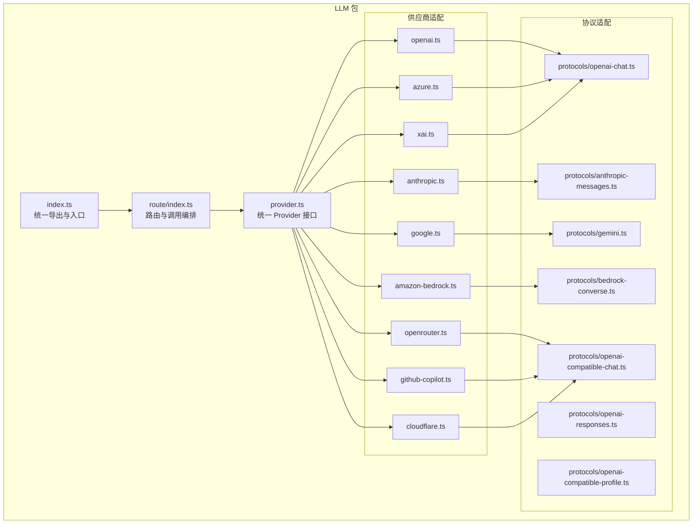
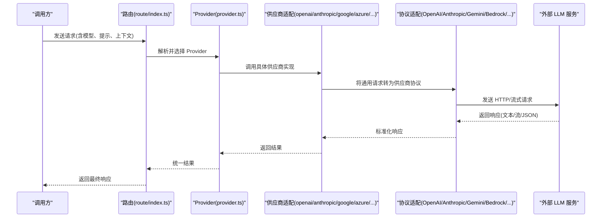
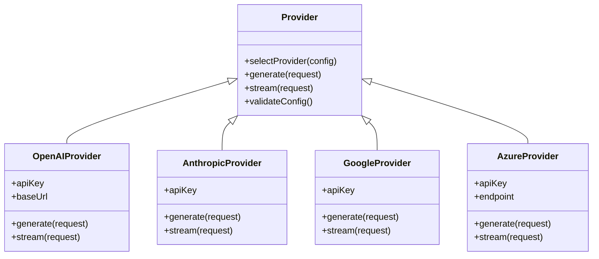
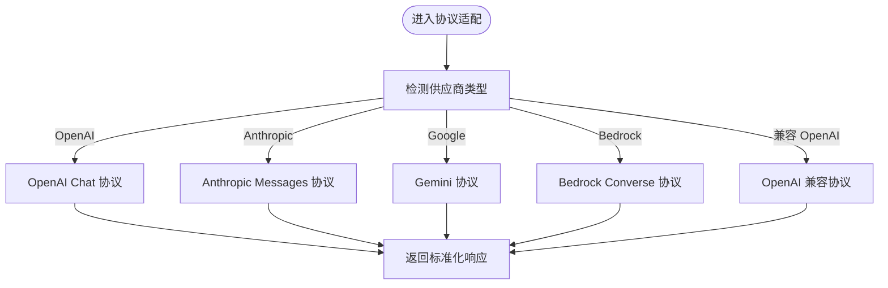
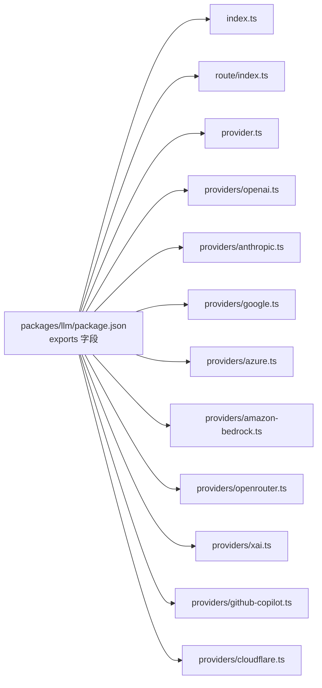

# AI 功能详解

<cite>
**本文引用的文件**
- [README.md](file://README.md)
- [packages/llm/package.json](file://packages/llm/package.json)
- [packages/llm/src/index.ts](file://packages/llm/src/index.ts)
- [packages/llm/src/provider.ts](file://packages/llm/src/provider.ts)
- [packages/llm/src/providers/openai.ts](file://packages/llm/src/providers/openai.ts)
- [packages/llm/src/providers/anthropic.ts](file://packages/llm/src/providers/anthropic.ts)
- [packages/llm/src/providers/google.ts](file://packages/llm/src/providers/google.ts)
- [packages/llm/src/providers/azure.ts](file://packages/llm/src/providers/azure.ts)
- [packages/llm/src/providers/amazon-bedrock.ts](file://packages/llm/src/providers/amazon-bedrock.ts)
- [packages/llm/src/providers/openrouter.ts](file://packages/llm/src/providers/openrouter.ts)
- [packages/llm/src/providers/xai.ts](file://packages/llm/src/providers/xai.ts)
- [packages/llm/src/providers/github-copilot.ts](file://packages/llm/src/providers/github-copilot.ts)
- [packages/llm/src/providers/cloudflare.ts](file://packages/llm/src/providers/cloudflare.ts)
- [packages/llm/src/protocols/openai-chat.ts](file://packages/llm/src/protocols/openai-chat.ts)
- [packages/llm/src/protocols/anthropic-messages.ts](file://packages/llm/src/protocols/anthropic-messages.ts)
- [packages/llm/src/protocols/gemini.ts](file://packages/llm/src/protocols/gemini.ts)
- [packages/llm/src/protocols/bedrock-converse.ts](file://packages/llm/src/protocols/bedrock-converse.ts)
- [packages/llm/src/protocols/openai-responses.ts](file://packages/llm/src/protocols/openai-responses.ts)
- [packages/llm/src/protocols/openai-compatible-chat.ts](file://packages/llm/src/protocols/openai-compatible-chat.ts)
- [packages/llm/src/protocols/openai-compatible-profile.ts](file://packages/llm/src/protocols/openai-compatible-profile.ts)
- [packages/llm/src/route/index.ts](file://packages/llm/src/route/index.ts)
- [packages/llm/src/providers/openai-compatible.ts](file://packages/llm/src/providers/openai-compatible.ts)
- [packages/llm/src/providers/openai-compatible-profile.ts](file://packages/llm/src/providers/openai-compatible-profile.ts)
- [packages/llm/src/providers/openrouter.ts](file://packages/llm/src/providers/openrouter.ts)
- [packages/llm/src/providers/xai.ts](file://packages/llm/src/providers/xai.ts)
- [packages/llm/src/providers/github-copilot.ts](file://packages/llm/src/providers/github-copilot.ts)
- [packages/llm/src/providers/cloudflare.ts](file://packages/llm/src/providers/cloudflare.ts)
- [packages/llm/src/providers/amazon-bedrock.ts](file://packages/llm/src/providers/amazon-bedrock.ts)
- [packages/llm/src/providers/azure.ts](file://packages/llm/src/providers/azure.ts)
- [packages/llm/src/providers/google.ts](file://packages/llm/src/providers/google.ts)
- [packages/llm/src/providers/anthropic.ts](file://packages/llm/src/providers/anthropic.ts)
- [packages/llm/src/providers/openai.ts](file://packages/llm/src/providers/openai.ts)
- [packages/llm/src/protocols/openai-chat.ts](file://packages/llm/src/protocols/openai-chat.ts)
- [packages/llm/src/protocols/anthropic-messages.ts](file://packages/llm/src/protocols/anthropic-messages.ts)
- [packages/llm/src/protocols/gemini.ts](file://packages/llm/src/protocols/gemini.ts)
- [packages/llm/src/protocols/bedrock-converse.ts](file://packages/llm/src/protocols/bedrock-converse.ts)
- [packages/llm/src/protocols/openai-responses.ts](file://packages/llm/src/protocols/openai-responses.ts)
- [packages/llm/src/protocols/openai-compatible-chat.ts](file://packages/llm/src/protocols/openai-compatible-chat.ts)
- [packages/llm/src/protocols/openai-compatible-profile.ts](file://packages/llm/src/protocols/openai-compatible-profile.ts)
- [packages/llm/src/route/index.ts](file://packages/llm/src/route/index.ts)
</cite>

## 目录
1. [简介](#简介)
2. [项目结构](#项目结构)
3. [核心组件](#核心组件)
4. [架构总览](#架构总览)
5. [详细组件分析](#详细组件分析)
6. [依赖关系分析](#依赖关系分析)
7. [性能与成本优化](#性能与成本优化)
8. [质量评估与优化](#质量评估与优化)
9. [提示词工程最佳实践](#提示词工程最佳实践)
10. [使用案例与对比](#使用案例与对比)
11. [故障排查指南](#故障排查指南)
12. [结论](#结论)

## 简介
本文件面向希望深入理解 OpenCode AI 能力的开发者与使用者，系统性阐述其 AI 代码生成工作原理、多供应商集成架构、模型选择策略、提示词工程实践、质量评估与优化方法，并提供性能与成本控制建议。OpenCode 在后端通过统一的 LLM 抽象层整合多家大模型供应商（如 OpenAI、Anthropic、Google AI、Azure OpenAI 等），并通过协议适配器屏蔽各供应商差异，实现“一次接入、多供应商运行”的能力。

## 项目结构
OpenCode 的 AI 能力主要集中在 packages/llm 包中，该包以模块化方式组织供应商与协议适配器，提供统一的路由与入口，便于在不同运行环境（CLI、Web、桌面）中复用。

图表来源
- [packages/llm/package.json:13-36](file://packages/llm/package.json#L13-L36)
- [packages/llm/src/index.ts](file://packages/llm/src/index.ts)
- [packages/llm/src/route/index.ts](file://packages/llm/src/route/index.ts)
- [packages/llm/src/provider.ts](file://packages/llm/src/provider.ts)
- [packages/llm/src/providers/openai.ts](file://packages/llm/src/providers/openai.ts)
- [packages/llm/src/providers/anthropic.ts](file://packages/llm/src/providers/anthropic.ts)
- [packages/llm/src/providers/google.ts](file://packages/llm/src/providers/google.ts)
- [packages/llm/src/providers/azure.ts](file://packages/llm/src/providers/azure.ts)
- [packages/llm/src/providers/amazon-bedrock.ts](file://packages/llm/src/providers/amazon-bedrock.ts)
- [packages/llm/src/providers/openrouter.ts](file://packages/llm/src/providers/openrouter.ts)
- [packages/llm/src/providers/xai.ts](file://packages/llm/src/providers/xai.ts)
- [packages/llm/src/providers/github-copilot.ts](file://packages/llm/src/providers/github-copilot.ts)
- [packages/llm/src/providers/cloudflare.ts](file://packages/llm/src/providers/cloudflare.ts)
- [packages/llm/src/protocols/openai-chat.ts](file://packages/llm/src/protocols/openai-chat.ts)
- [packages/llm/src/protocols/anthropic-messages.ts](file://packages/llm/src/protocols/anthropic-messages.ts)
- [packages/llm/src/protocols/gemini.ts](file://packages/llm/src/protocols/gemini.ts)
- [packages/llm/src/protocols/bedrock-converse.ts](file://packages/llm/src/protocols/bedrock-converse.ts)
- [packages/llm/src/protocols/openai-responses.ts](file://packages/llm/src/protocols/openai-responses.ts)
- [packages/llm/src/protocols/openai-compatible-chat.ts](file://packages/llm/src/protocols/openai-compatible-chat.ts)
- [packages/llm/src/protocols/openai-compatible-profile.ts](file://packages/llm/src/protocols/openai-compatible-profile.ts)

章节来源
- [README.md:100-114](file://README.md#L100-L114)
- [packages/llm/package.json:13-36](file://packages/llm/package.json#L13-L36)

## 核心组件
- 统一入口与导出：通过 index.ts 提供统一的对外接口，便于上层应用按需引入。
- 路由与编排：route/index.ts 负责接收请求、解析参数、选择供应商与协议，并返回标准化响应。
- Provider 抽象：provider.ts 定义统一的 Provider 接口，屏蔽不同供应商的差异，使调用方无需关心底层细节。
- 协议适配器：各供应商的协议适配器负责将通用请求转换为特定供应商的请求格式，并将响应转换回通用格式。
- 供应商适配器：providers 下的各文件封装了与具体供应商交互的逻辑，包括认证、速率限制、错误处理等。

章节来源
- [packages/llm/src/index.ts](file://packages/llm/src/index.ts)
- [packages/llm/src/route/index.ts](file://packages/llm/src/route/index.ts)
- [packages/llm/src/provider.ts](file://packages/llm/src/provider.ts)

## 架构总览
下图展示了从调用方到各供应商的完整链路，以及协议适配器如何将通用请求映射到具体供应商格式。

图表来源
- [packages/llm/src/route/index.ts](file://packages/llm/src/route/index.ts)
- [packages/llm/src/provider.ts](file://packages/llm/src/provider.ts)
- [packages/llm/src/providers/openai.ts](file://packages/llm/src/providers/openai.ts)
- [packages/llm/src/providers/anthropic.ts](file://packages/llm/src/providers/anthropic.ts)
- [packages/llm/src/providers/google.ts](file://packages/llm/src/providers/google.ts)
- [packages/llm/src/providers/azure.ts](file://packages/llm/src/providers/azure.ts)
- [packages/llm/src/protocols/openai-chat.ts](file://packages/llm/src/protocols/openai-chat.ts)
- [packages/llm/src/protocols/anthropic-messages.ts](file://packages/llm/src/protocols/anthropic-messages.ts)
- [packages/llm/src/protocols/gemini.ts](file://packages/llm/src/protocols/gemini.ts)
- [packages/llm/src/protocols/bedrock-converse.ts](file://packages/llm/src/protocols/bedrock-converse.ts)

## 详细组件分析

### Provider 抽象与路由
- Provider 抽象：定义统一的模型选择、参数注入、错误处理与流式输出接口，确保上层调用稳定一致。
- 路由编排：根据请求中的供应商标识与模型名，动态选择对应适配器；支持默认模型、备用模型与按环境切换。

图表来源
- [packages/llm/src/provider.ts](file://packages/llm/src/provider.ts)
- [packages/llm/src/providers/openai.ts](file://packages/llm/src/providers/openai.ts)
- [packages/llm/src/providers/anthropic.ts](file://packages/llm/src/providers/anthropic.ts)
- [packages/llm/src/providers/google.ts](file://packages/llm/src/providers/google.ts)
- [packages/llm/src/providers/azure.ts](file://packages/llm/src/providers/azure.ts)

章节来源
- [packages/llm/src/provider.ts](file://packages/llm/src/provider.ts)
- [packages/llm/src/route/index.ts](file://packages/llm/src/route/index.ts)

### 协议适配器
- OpenAI Chat：将通用消息转换为 OpenAI Chat 格式，处理函数调用、工具调用与流式输出。
- Anthropic Messages：将通用消息转换为 Anthropic Messages 格式，支持系统提示、用户消息与助手回复。
- Gemini：针对 Google AI 的 Gemini 协议进行请求与响应转换。
- Bedrock Converse：AWS Bedrock 的对话式协议适配。
- OpenAI 兼容协议：支持任意兼容 OpenAI 协议的第三方服务（如 OpenRouter、xAI、Cloudflare 等）。

图表来源
- [packages/llm/src/protocols/openai-chat.ts](file://packages/llm/src/protocols/openai-chat.ts)
- [packages/llm/src/protocols/anthropic-messages.ts](file://packages/llm/src/protocols/anthropic-messages.ts)
- [packages/llm/src/protocols/gemini.ts](file://packages/llm/src/protocols/gemini.ts)
- [packages/llm/src/protocols/bedrock-converse.ts](file://packages/llm/src/protocols/bedrock-converse.ts)
- [packages/llm/src/protocols/openai-compatible-chat.ts](file://packages/llm/src/protocols/openai-compatible-chat.ts)

章节来源
- [packages/llm/src/protocols/openai-chat.ts](file://packages/llm/src/protocols/openai-chat.ts)
- [packages/llm/src/protocols/anthropic-messages.ts](file://packages/llm/src/protocols/anthropic-messages.ts)
- [packages/llm/src/protocols/gemini.ts](file://packages/llm/src/protocols/gemini.ts)
- [packages/llm/src/protocols/bedrock-converse.ts](file://packages/llm/src/protocols/bedrock-converse.ts)
- [packages/llm/src/protocols/openai-compatible-chat.ts](file://packages/llm/src/protocols/openai-compatible-chat.ts)

### 供应商适配器概览
- OpenAI：支持标准 ChatCompletion 与流式输出，可配置基础 URL 与 API Key。
- Anthropic：支持 Messages API，适合长上下文与复杂推理任务。
- Google AI：支持 Gemini 系列模型，适合多模态与生成式任务。
- Azure OpenAI：通过 endpoint 与 API Key 访问，适合企业级合规与托管部署。
- Amazon Bedrock：通过 AWS 凭证访问，适合云原生与大规模推理。
- OpenRouter：兼容 OpenAI 协议的聚合平台，支持多模型路由与优选。
- xAI：兼容 OpenAI 协议，适合追求高性价比或特殊模型的场景。
- GitHub Copilot：通过兼容协议对接，适合代码补全与生成。
- Cloudflare：通过兼容协议对接，适合边缘部署与低延迟场景。

章节来源
- [packages/llm/src/providers/openai.ts](file://packages/llm/src/providers/openai.ts)
- [packages/llm/src/providers/anthropic.ts](file://packages/llm/src/providers/anthropic.ts)
- [packages/llm/src/providers/google.ts](file://packages/llm/src/providers/google.ts)
- [packages/llm/src/providers/azure.ts](file://packages/llm/src/providers/azure.ts)
- [packages/llm/src/providers/amazon-bedrock.ts](file://packages/llm/src/providers/amazon-bedrock.ts)
- [packages/llm/src/providers/openrouter.ts](file://packages/llm/src/providers/openrouter.ts)
- [packages/llm/src/providers/xai.ts](file://packages/llm/src/providers/xai.ts)
- [packages/llm/src/providers/github-copilot.ts](file://packages/llm/src/providers/github-copilot.ts)
- [packages/llm/src/providers/cloudflare.ts](file://packages/llm/src/providers/cloudflare.ts)

## 依赖关系分析
- 导出清单：packages/llm/package.json 中的 exports 字段清晰列出所有可用模块路径，便于上层按需引入。
- 运行时依赖：effect 作为核心抽象库，提供并发、错误处理与资源管理能力；aws4fetch、@smithy/* 等用于 AWS 相关签名与编码。
- 开发依赖：HTTP 录制、类型检查与交互式提示等工具，提升开发体验与测试效率。

图表来源
- [packages/llm/package.json:13-36](file://packages/llm/package.json#L13-L36)

章节来源
- [packages/llm/package.json:13-36](file://packages/llm/package.json#L13-L36)
- [packages/llm/package.json:45-51](file://packages/llm/package.json#L45-L51)

## 性能与成本优化
- 流式输出优先：在支持流式的供应商上启用流式传输，降低首字节延迟并改善用户体验。
- 上下文裁剪：对历史对话与文件上下文进行分段与摘要，避免超出上下文长度限制导致的截断与失败。
- 模型选择策略：
  - 高精度推理：Anthropic 或 Google AI（适合复杂任务）
  - 快速迭代：OpenAI 或 xAI（适合快速草稿与编辑）
  - 企业合规：Azure OpenAI 或 Bedrock（满足安全与数据驻留要求）
- 成本控制：
  - 使用兼容协议的聚合平台（如 OpenRouter）进行模型优选与价格比较。
  - 合理设置温度与最大令牌数，减少不必要的消耗。
  - 对重复任务缓存中间结果，避免重复调用。

## 质量评估与优化
- 结果校验：对生成代码进行语法检查与静态分析，过滤明显错误。
- 上下文完整性：确保提示词包含足够的上下文（项目结构、技术栈、目标与约束）。
- 多轮迭代：通过“生成—验证—反馈—再生成”的循环持续改进质量。
- 可解释性：在提示词中明确期望的输出风格与结构，减少歧义。

## 提示词工程最佳实践
- 明确角色与目标：指定 AI 的角色（如“资深工程师”）、任务目标（如“实现某功能”）与交付物格式。
- 结构化上下文：提供项目背景、现有代码片段、依赖与约束条件，帮助 AI 正确理解需求。
- 分步骤指令：将复杂任务拆分为多个小步骤，逐步引导 AI 完成。
- 约束与边界：明确禁止事项（如不使用某些库）、必须遵循的规范（如命名、注释风格）与验收标准。
- 示例驱动：提供正反例，增强对期望输出的理解。

## 使用案例与对比
- 案例一：快速生成 REST API 控制器
  - 场景：需要一个基于现有数据库表的 CRUD 控制器。
  - 建议：使用 OpenAI 或 xAI 生成初版，再用 Anthropic 进行审查与重构。
  - 关键点：提供数据库 schema、路由约定与鉴权策略。
- 案例二：跨语言迁移
  - 场景：将某模块从 TypeScript 迁移到 Rust。
  - 建议：先用 Google AI 生成设计思路，再用 OpenAI 实现具体代码。
  - 关键点：强调性能与内存安全约束。
- 案例三：自动化测试用例
  - 场景：为某个函数自动生成单元测试。
  - 建议：使用 Anthropic 生成测试策略，OpenAI 实现测试代码。
  - 关键点：覆盖边界条件与异常分支。

## 故障排查指南
- 供应商不可达或认证失败
  - 检查 API Key 与基础 URL 是否正确配置。
  - 确认网络代理与防火墙设置。
- 上下文超限
  - 缩短提示词与上下文，或采用分段处理策略。
- 响应格式异常
  - 检查协议适配器是否正确转换请求与响应。
  - 对比 OpenAI 兼容协议与原生协议的行为差异。
- 错误重试与降级
  - 在 Provider 层实现指数退避与降级策略（如切换备用供应商或模型）。

## 结论
OpenCode 的 AI 能力通过统一的 Provider 抽象与协议适配器，实现了对多家供应商的无缝集成。借助合理的模型选择、提示词工程与质量评估流程，可在不同场景下获得稳定且高质量的代码生成结果。配合性能与成本优化策略，可进一步提升整体效率与经济性。