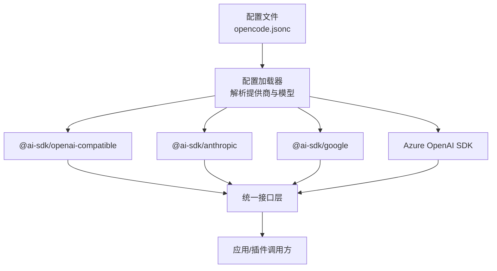
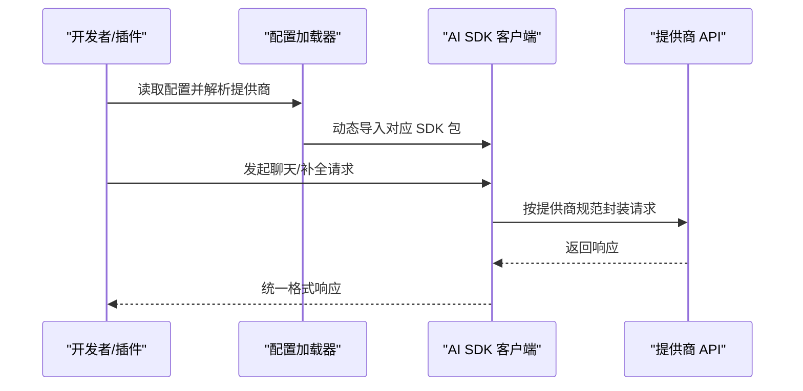
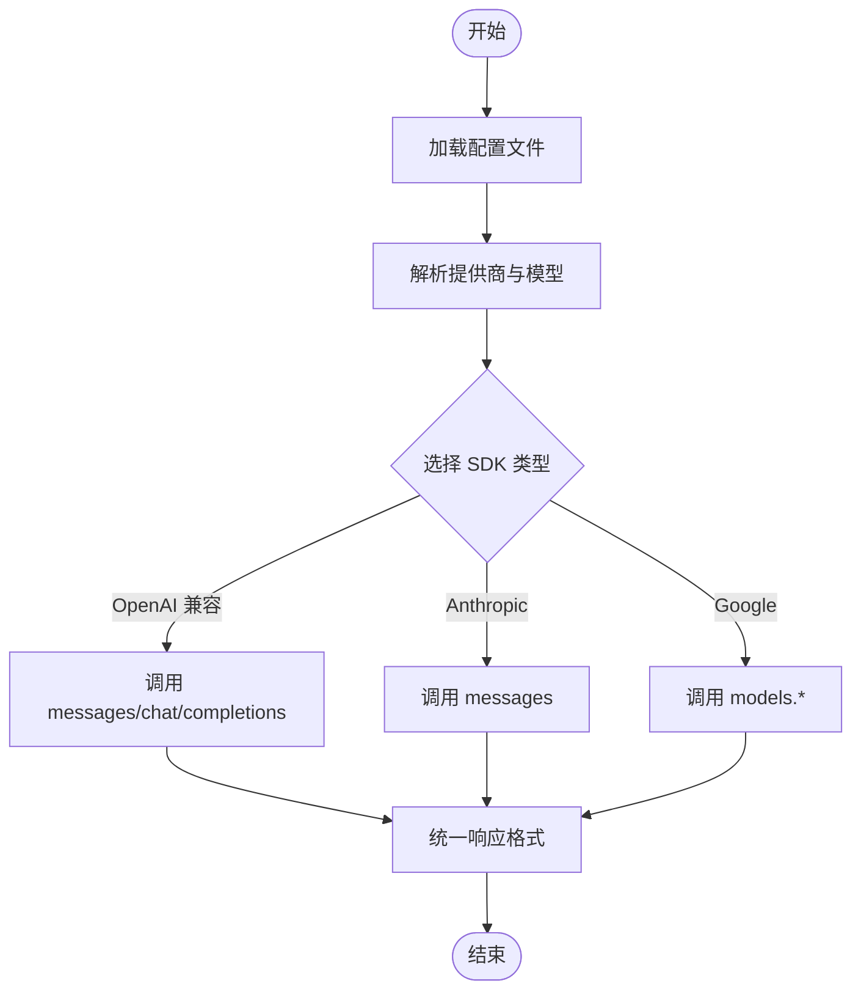
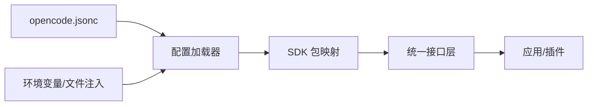

# AI 模型提供商集成

<cite>
**本文引用的文件**
- [providers.mdx](file://packages/web/src/content/docs/zh-cn/providers.mdx)
- [config.mdx](file://packages/web/src/content/docs/zh-cn/config.mdx)
- [zen.mdx](file://packages/web/src/content/docs/zh-cn/zen.mdx)
- [go.mdx](file://packages/web/src/content/docs/zh-tw/go.mdx)
- [opencode.jsonc](file://.opencode/opencode.jsonc)
- [sst.config.ts](file://sst.config.ts)
- [sst-env.d.ts](file://sst-env.d.ts)
- [package.json](file://package.json)
- [tsconfig.json](file://tsconfig.json)
</cite>

## 目录
1. [简介](#简介)
2. [项目结构](#项目结构)
3. [核心组件](#核心组件)
4. [架构总览](#架构总览)
5. [详细组件分析](#详细组件分析)
6. [依赖关系分析](#依赖关系分析)
7. [性能考虑](#性能考虑)
8. [故障排查指南](#故障排查指南)
9. [结论](#结论)
10. [附录](#附录)

## 简介
本技术文档面向 OpenCode 的 AI 模型提供商集成，系统性阐述多供应商架构的设计与实现，覆盖 OpenAI、Anthropic、Google AI、Azure OpenAI 等主流提供商的接入方式、统一接口设计、配置方法与最佳实践。文档同时给出环境变量与密钥管理策略、认证机制、上下文与输出限制配置、以及跨提供商无缝切换的实现思路，帮助开发者快速理解并高效使用不同提供商的特性。

## 项目结构
OpenCode 将“提供商”抽象为可配置的模块单元，通过统一的配置文件与运行时解析器加载各提供商 SDK，实现对 OpenAI 兼容接口与 Anthropic/Gemini 等原生接口的统一调用。核心结构如下：
- 配置层：以 JSON 配置文件集中声明提供商名称、SDK 包、端点、鉴权参数与模型清单。
- 运行时层：根据配置动态加载对应 SDK，构造统一的聊天/补全接口，屏蔽底层差异。
- 环境与密钥：支持环境变量与文件注入，确保敏感信息安全可控。
- 平台适配：内置 Zen 与 Go 等平台路由，映射到不同提供商与端点。

图表来源
- [providers.mdx](file://packages/web/src/content/docs/zh-cn/providers.mdx)
- [config.mdx](file://packages/web/src/content/docs/zh-cn/config.mdx)
- [sst.config.ts](file://sst.config.ts)

章节来源
- [providers.mdx:1890-1940](file://packages/web/src/content/docs/zh-cn/providers.mdx#L1890-L1940)
- [config.mdx:645-687](file://packages/web/src/content/docs/zh-cn/config.mdx#L645-L687)
- [sst.config.ts](file://sst.config.ts)

## 核心组件
- 统一配置模型
  - 提供商键：唯一标识符（如 openai、anthropic、google、azure）。
  - SDK 包：指定使用的 AI SDK 包（如 @ai-sdk/openai-compatible、@ai-sdk/anthropic、@ai-sdk/google）。
  - 端点与鉴权：baseURL、apiKey、headers 等。
  - 模型清单：每个模型的显示名与上下文/输出限制。
- 运行时加载器
  - 根据提供商键与 SDK 包动态导入对应客户端。
  - 构造统一的聊天/补全接口，隐藏底层差异。
- 环境与密钥注入
  - 支持 {env:VAR} 与 {file:/path} 注入，便于安全存放密钥与大文本。
- 平台路由
  - Zen/Go 等平台提供预置端点与模型映射，简化接入成本。

章节来源
- [providers.mdx:1890-1940](file://packages/web/src/content/docs/zh-cn/providers.mdx#L1890-L1940)
- [config.mdx:645-687](file://packages/web/src/content/docs/zh-cn/config.mdx#L645-L687)
- [zen.mdx](file://packages/web/src/content/docs/zh-cn/zen.mdx)
- [go.mdx](file://packages/web/src/content/docs/zh-tw/go.mdx)

## 架构总览
下图展示从配置到统一接口的调用链路，体现多提供商的解耦与统一抽象：

图表来源
- [providers.mdx](file://packages/web/src/content/docs/zh-cn/providers.mdx)
- [config.mdx](file://packages/web/src/content/docs/zh-cn/config.mdx)

## 详细组件分析

### 统一接口设计与跨提供商切换
- 设计要点
  - 抽象统一的聊天/补全接口，屏蔽 SDK 差异。
  - 通过配置驱动切换提供商与模型，无需修改业务代码。
  - 在运行时按需加载 SDK，降低启动开销。
- 实现路径
  - 配置文件中声明提供商与模型，运行时解析并注入到接口层。
  - 接口层根据 SDK 包类型选择对应客户端方法（如 messages 或 chat/completions）。
- 优势
  - 开发者可在不改动代码的情况下切换提供商或模型。
  - 易于扩展新提供商：仅需新增配置与 SDK 包映射。

图表来源
- [providers.mdx](file://packages/web/src/content/docs/zh-cn/providers.mdx)
- [zen.mdx](file://packages/web/src/content/docs/zh-cn/zen.mdx)
- [go.mdx](file://packages/web/src/content/docs/zh-tw/go.mdx)

章节来源
- [providers.mdx:1890-1940](file://packages/web/src/content/docs/zh-cn/providers.mdx#L1890-L1940)
- [zen.mdx](file://packages/web/src/content/docs/zh-cn/zen.mdx)
- [go.mdx](file://packages/web/src/content/docs/zh-tw/go.mdx)

### OpenAI 兼容提供商集成
- 特点
  - 通用的 chat/completions 接口，生态最广。
  - 适合通用对话、代码生成、工具调用等场景。
- 配置要点
  - SDK 包：@ai-sdk/openai-compatible
  - 端点：baseURL 指向 OpenAI 兼容网关
  - 鉴权：apiKey 或自定义 headers
- 最佳实践
  - 使用 {env:VAR} 注入密钥，避免硬编码。
  - 为模型设置 limit.context 与 limit.output，便于上下文管理。

章节来源
- [providers.mdx:1890-1940](file://packages/web/src/content/docs/zh-cn/providers.mdx#L1890-L1940)
- [config.mdx:645-687](file://packages/web/src/content/docs/zh-cn/config.mdx#L645-L687)

### Anthropic 提供商集成
- 特点
  - 专长于安全、理性与长上下文推理。
  - 适合复杂任务规划、代码审查与深度分析。
- 配置要点
  - SDK 包：@ai-sdk/anthropic
  - 端点：messages
  - 鉴权：apiKey 或自定义 headers
- 最佳实践
  - 合理设置 system/instruction，明确角色与约束。
  - 控制 max_tokens 与 temperature，平衡质量与成本。

章节来源
- [providers.mdx:1890-1940](file://packages/web/src/content/docs/zh-cn/providers.mdx#L1890-L1940)
- [zen.mdx](file://packages/web/src/content/docs/zh-cn/zen.mdx)

### Google AI（Gemini）提供商集成
- 特点
  - 多模态与强推理能力，适合图文理解与综合分析。
  - 适合内容创作、检索增强与多模态任务。
- 配置要点
  - SDK 包：@ai-sdk/google
  - 端点：models.{modelName}:generateContent 或类似
- 最佳实践
  - 使用结构化提示与工具调用提升准确性。
  - 结合缓存与流式响应优化用户体验。

章节来源
- [providers.mdx:1890-1940](file://packages/web/src/content/docs/zh-cn/providers.mdx#L1890-L1940)
- [zen.mdx](file://packages/web/src/content/docs/zh-cn/zen.mdx)

### Azure OpenAI 集成
- 特点
  - 企业级合规与托管服务，适合大规模与高安全场景。
  - 支持多种部署版本与模型变体。
- 配置要点
  - SDK 包：Azure OpenAI 官方 SDK
  - 端点：基于资源与部署的完整 URL
  - 鉴权：API Key 或 Azure AD（视部署而定）
- 最佳实践
  - 使用资源级与部署级限流策略。
  - 通过别名与版本控制管理模型演进。

章节来源
- [providers.mdx:1890-1940](file://packages/web/src/content/docs/zh-cn/providers.mdx#L1890-L1940)
- [config.mdx:645-687](file://packages/web/src/content/docs/zh-cn/config.mdx#L645-L687)

### 自定义提供商与模型
- 场景
  - 私有化部署、第三方兼容网关、内部模型注册。
- 配置步骤
  - 在配置文件中新增提供商键，指定 npm 包与 options（baseURL、apiKey、headers）。
  - 在 models 中声明模型名、显示名与 limit（context、output）。
- 注意事项
  - limit 字段用于上下文空间管理，建议从官方模型库同步。
  - 自定义 headers 可用于特定网关鉴权或路由。

章节来源
- [providers.mdx:1890-1940](file://packages/web/src/content/docs/zh-cn/providers.mdx#L1890-L1940)

### 平台路由与预置模型
- Zen/Go 平台
  - 内置常见模型与端点映射，减少重复配置。
  - 通过平台路由快速接入多家提供商的同质化能力。
- 使用建议
  - 优先使用平台提供的模型与端点，确保稳定性与兼容性。
  - 如需定制，再基于自定义提供商扩展。

章节来源
- [zen.mdx](file://packages/web/src/content/docs/zh-cn/zen.mdx)
- [go.mdx](file://packages/web/src/content/docs/zh-tw/go.mdx)

## 依赖关系分析
- 配置文件依赖
  - opencode.jsonc 作为单一可信源，被配置加载器解析。
- 运行时依赖
  - 根据提供商键与 SDK 包动态导入对应客户端。
  - 与平台路由（Zen/Go）协同，决定端点与模型集合。
- 环境与密钥依赖
  - 通过 {env:VAR} 与 {file:/path} 注入，避免硬编码。

图表来源
- [opencode.jsonc](file://.opencode/opencode.jsonc)
- [config.mdx](file://packages/web/src/content/docs/zh-cn/config.mdx)

章节来源
- [opencode.jsonc](file://.opencode/opencode.jsonc)
- [config.mdx:645-687](file://packages/web/src/content/docs/zh-cn/config.mdx#L645-L687)

## 性能考虑
- 上下文与输出限制
  - 通过 limit.context 与 limit.output 控制输入/输出长度，避免超限与昂贵调用。
- 流式响应与缓存
  - 对长文本生成启用流式响应，结合本地缓存减少重复请求。
- 并发与重试
  - 合理设置并发上限与指数退避重试，提升稳定性。
- 成本与速率
  - 不同提供商价格差异较大，建议在配置层标注与监控，按需切换。

## 故障排查指南
- 常见问题
  - 鉴权失败：检查 apiKey 是否正确注入（{env:VAR} 或 {file:/path}），确认 headers 设置。
  - 端点错误：核对 baseURL 与平台路由是否匹配。
  - 模型不可用：确认模型名与提供商是否一致，limit 配置是否合理。
- 排查步骤
  - 逐步缩小范围：先验证配置文件语法，再验证 SDK 包导入，最后验证网络连通性。
  - 查看日志：记录请求与响应摘要，定位异常阶段。
  - 回归测试：在最小配置下验证单个提供商可用性，再逐步合并其他提供商。

章节来源
- [providers.mdx:1890-1940](file://packages/web/src/content/docs/zh-cn/providers.mdx#L1890-L1940)
- [config.mdx:645-687](file://packages/web/src/content/docs/zh-cn/config.mdx#L645-L687)

## 结论
OpenCode 的多提供商架构以“配置即代码”的方式实现了对 OpenAI、Anthropic、Google AI、Azure OpenAI 等提供商的统一接入。通过 SDK 包映射、平台路由与运行时加载器，开发者可以低成本地在不同提供商之间切换，并借助 limit 与环境注入等机制实现安全、可控与高性能的 AI 应用。

## 附录

### 配置文件字段说明
- provider.{key}
  - npm：使用的 AI SDK 包
  - name：UI 展示名称
  - options.baseURL：API 端点 URL
  - options.apiKey：API 密钥（支持 {env:VAR} 或 {file:/path}）
  - options.headers：自定义请求头
  - models.{modelId}.name：模型显示名
  - models.{modelId}.limit.context：最大输入 Token
  - models.{modelId}.limit.output：最大输出 Token

章节来源
- [providers.mdx:1890-1940](file://packages/web/src/content/docs/zh-cn/providers.mdx#L1890-L1940)
- [config.mdx:645-687](file://packages/web/src/content/docs/zh-cn/config.mdx#L645-L687)