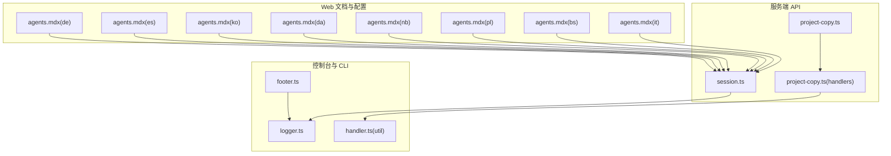
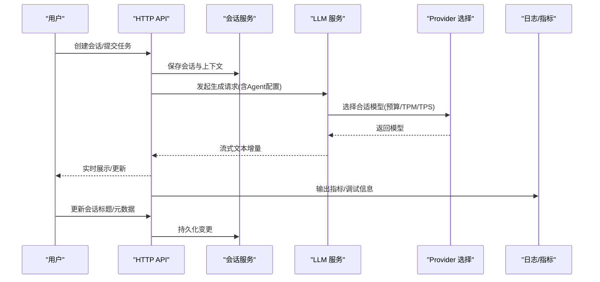
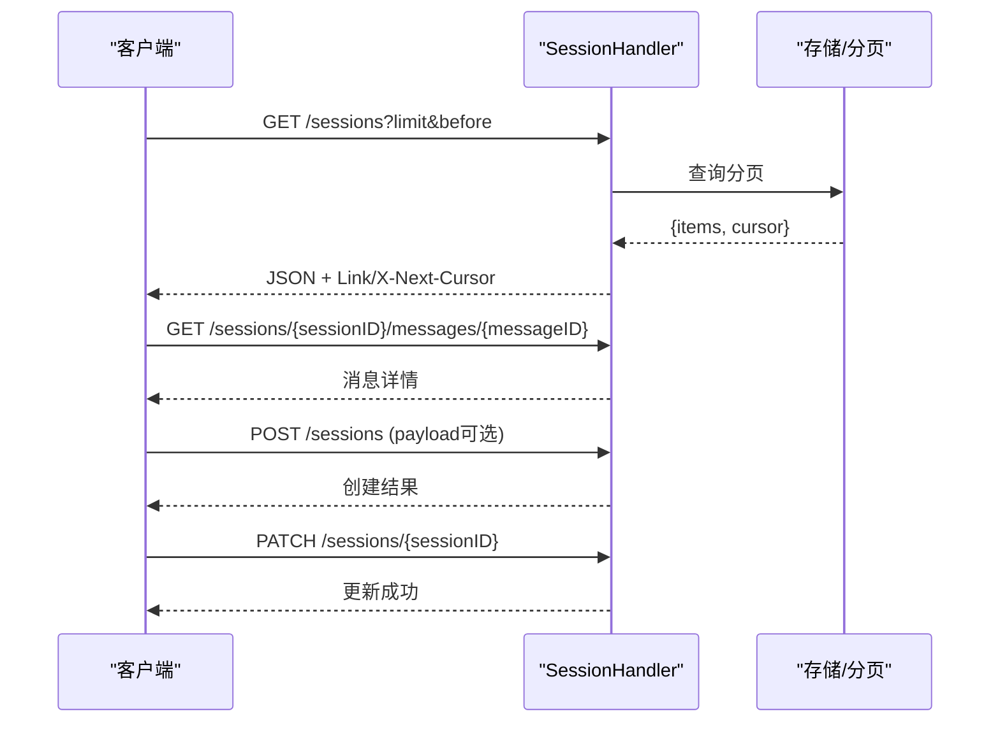
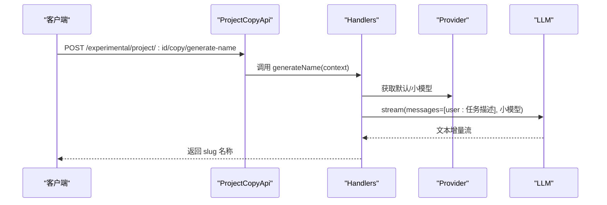
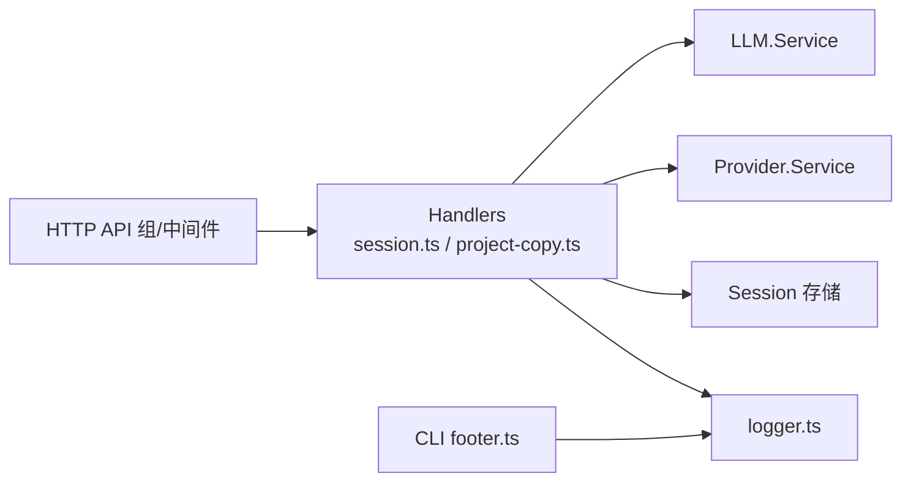

# 代码生成机制

<cite>
**本文引用的文件**
- [README.md](file://README.md)
- [CONTEXT.md](file://CONTEXT.md)
- [AGENTS.md](file://AGENTS.md)
- [packages/opencode/src/server/routes/instance/httpapi/handlers/session.ts](file://packages/opencode/src/server/routes/instance/httpapi/handlers/session.ts)
- [packages/opencode/src/server/routes/instance/httpapi/groups/project-copy.ts](file://packages/opencode/src/server/routes/instance/httpapi/groups/project-copy.ts)
- [packages/opencode/src/server/routes/instance/httpapi/handlers/project-copy.ts](file://packages/opencode/src/server/routes/instance/httpapi/handlers/project-copy.ts)
- [packages/web/src/content/docs/de/agents.mdx](file://packages/web/src/content/docs/de/agents.mdx)
- [packages/web/src/content/docs/es/agents.mdx](file://packages/web/src/content/docs/es/agents.mdx)
- [packages/web/src/content/docs/ko/agents.mdx](file://packages/web/src/content/docs/ko/agents.mdx)
- [packages/web/src/content/docs/da/agents.mdx](file://packages/web/src/content/docs/da/agents.mdx)
- [packages/web/src/content/docs/nb/agents.mdx](file://packages/web/src/content/docs/nb/agents.mdx)
- [packages/web/src/content/docs/pl/agents.mdx](file://packages/web/src/content/docs/pl/agents.mdx)
- [packages/web/src/content/docs/bs/agents.mdx](file://packages/web/src/content/docs/bs/agents.mdx)
- [packages/web/src/content/docs/it/agents.mdx](file://packages/web/src/content/docs/it/agents.mdx)
- [packages/console/app/src/routes/zen/util/logger.ts](file://packages/console/app/src/routes/zen/util/logger.ts)
- [packages/console/app/src/routes/zen/util/handler.ts](file://packages/console/app/src/routes/zen/util/handler.ts)
- [packages/opencode/src/cli/cmd/run/footer.ts](file://packages/opencode/src/cli/cmd/run/footer.ts)
- [packages/opencode/src/server/routes/instance/httpapi/middleware/schema-error.ts](file://packages/opencode/src/server/routes/instance/httpapi/middleware/schema-error.ts)
</cite>

## 目录
1. [引言](#引言)
2. [项目结构](#项目结构)
3. [核心组件](#核心组件)
4. [架构总览](#架构总览)
5. [详细组件分析](#详细组件分析)
6. [依赖关系分析](#依赖关系分析)
7. [性能考虑](#性能考虑)
8. [故障排查指南](#故障排查指南)
9. [结论](#结论)
10. [附录](#附录)

## 引言
本文件系统化阐述 OpenCode 的代码生成机制，覆盖从上下文理解、代码分析到智能生成的关键流程；解释会话管理在保持开发上下文一致性与连续性方面的作用；介绍质量控制（错误检测、结果验证、迭代优化）；说明不同类型的代码生成（函数、类、完整项目）处理方式；并给出性能优化与资源管理策略及典型使用场景。

## 项目结构
OpenCode 采用多包（monorepo）组织，核心与生成相关的模块分布如下：
- 服务端 HTTP API：会话管理、项目复制命名等接口
- Web 文档与配置：Agent 行为与温度、步数等参数配置说明
- 控制台工具与 CLI：运行时状态、中断与通知、日志指标输出
- 核心能力：LLM 调用、Provider 选择、模型限制与预算控制

图表来源
- [packages/opencode/src/server/routes/instance/httpapi/handlers/session.ts:124-189](file://packages/opencode/src/server/routes/instance/httpapi/handlers/session.ts#L124-L189)
- [packages/opencode/src/server/routes/instance/httpapi/groups/project-copy.ts:1-32](file://packages/opencode/src/server/routes/instance/httpapi/groups/project-copy.ts#L1-L32)
- [packages/opencode/src/server/routes/instance/httpapi/handlers/project-copy.ts:1-83](file://packages/opencode/src/server/routes/instance/httpapi/handlers/project-copy.ts#L1-L83)
- [packages/web/src/content/docs/de/agents.mdx:222-277](file://packages/web/src/content/docs/de/agents.mdx#L222-L277)
- [packages/web/src/content/docs/es/agents.mdx:236-287](file://packages/web/src/content/docs/es/agents.mdx#L236-L287)
- [packages/web/src/content/docs/ko/agents.mdx:235-292](file://packages/web/src/content/docs/ko/agents.mdx#L235-L292)
- [packages/web/src/content/docs/da/agents.mdx:250-351](file://packages/web/src/content/docs/da/agents.mdx#L250-L351)
- [packages/web/src/content/docs/nb/agents.mdx:255-301](file://packages/web/src/content/docs/nb/agents.mdx#L255-L301)
- [packages/web/src/content/docs/pl/agents.mdx:288-343](file://packages/web/src/content/docs/pl/agents.mdx#L288-L343)
- [packages/web/src/content/docs/bs/agents.mdx:294-352](file://packages/web/src/content/docs/bs/agents.mdx#L294-L352)
- [packages/web/src/content/docs/it/agents.mdx:295-351](file://packages/web/src/content/docs/it/agents.mdx#L295-L351)
- [packages/console/app/src/routes/zen/util/logger.ts:1-12](file://packages/console/app/src/routes/zen/util/logger.ts#L1-L12)
- [packages/console/app/src/routes/zen/util/handler.ts:516-544](file://packages/console/app/src/routes/zen/util/handler.ts#L516-L544)
- [packages/opencode/src/cli/cmd/run/footer.ts:880-941](file://packages/opencode/src/cli/cmd/run/footer.ts#L880-L941)

章节来源
- [README.md](file://README.md)
- [CONTEXT.md](file://CONTEXT.md)

## 核心组件
- 会话管理（Session）
  - 提供会话创建、分页查询、消息检索、更新标题与元数据、删除等能力
  - 支持 HTTP API 分页返回与 Link/X-Next-Cursor 头部传递游标
- 项目复制命名（Project Copy Name）
  - 基于任务上下文生成项目副本短名称，使用小模型流式生成并进行 slug 化
- Agent 配置与行为
  - 温度（temperature）、最大步数（steps）、禁用（disable）、自定义提示（prompt）等
  - 不同 Agent 角色（analyze/build/brainstorm/plan/creative 等）用于不同阶段的代码生成
- 日志与运行时反馈
  - 控制台指标输出（_metric）、调试日志、CLI 运行状态与中断定时器
- Provider 与模型选择
  - 基于权重、预算、TPM/TPS 限制筛选可用 Provider，优先选择预算充足且低延迟的模型

章节来源
- [packages/opencode/src/server/routes/instance/httpapi/handlers/session.ts:124-189](file://packages/opencode/src/server/routes/instance/httpapi/handlers/session.ts#L124-L189)
- [packages/opencode/src/server/routes/instance/httpapi/groups/project-copy.ts:1-32](file://packages/opencode/src/server/routes/instance/httpapi/groups/project-copy.ts#L1-L32)
- [packages/opencode/src/server/routes/instance/httpapi/handlers/project-copy.ts:1-83](file://packages/opencode/src/server/routes/instance/httpapi/handlers/project-copy.ts#L1-L83)
- [packages/web/src/content/docs/de/agents.mdx:222-277](file://packages/web/src/content/docs/de/agents.mdx#L222-L277)
- [packages/web/src/content/docs/es/agents.mdx:236-287](file://packages/web/src/content/docs/es/agents.mdx#L236-L287)
- [packages/web/src/content/docs/ko/agents.mdx:235-292](file://packages/web/src/content/docs/ko/agents.mdx#L235-L292)
- [packages/web/src/content/docs/da/agents.mdx:250-351](file://packages/web/src/content/docs/da/agents.mdx#L250-L351)
- [packages/web/src/content/docs/nb/agents.mdx:255-301](file://packages/web/src/content/docs/nb/agents.mdx#L255-L301)
- [packages/web/src/content/docs/pl/agents.mdx:288-343](file://packages/web/src/content/docs/pl/agents.mdx#L288-L343)
- [packages/web/src/content/docs/bs/agents.mdx:294-352](file://packages/web/src/content/docs/bs/agents.mdx#L294-L352)
- [packages/web/src/content/docs/it/agents.mdx:295-351](file://packages/web/src/content/docs/it/agents.mdx#L295-L351)
- [packages/console/app/src/routes/zen/util/logger.ts:1-12](file://packages/console/app/src/routes/zen/util/logger.ts#L1-L12)
- [packages/console/app/src/routes/zen/util/handler.ts:516-544](file://packages/console/app/src/routes/zen/util/handler.ts#L516-L544)
- [packages/opencode/src/cli/cmd/run/footer.ts:880-941](file://packages/opencode/src/cli/cmd/run/footer.ts#L880-L941)

## 架构总览
OpenCode 的代码生成以“会话”为中心，贯穿以下主干流程：
- 上下文理解：通过 Agent 的 temperature/steps/prompt 等配置，结合任务上下文与历史消息，形成稳定的生成语境
- 代码分析：利用 analyze/brainstorm 等角色对需求、约束、依赖进行梳理与发散
- 智能生成：build/plan/creative 等角色执行具体生成任务，支持小模型快速迭代与大模型深度优化
- 结果验证与迭代：通过 Provider 选择、预算与速率限制保障稳定性，并结合日志与运行时反馈进行迭代优化
- 会话持久化：会话分页、消息检索、标题与元数据维护，确保上下文连续性

图表来源
- [packages/opencode/src/server/routes/instance/httpapi/handlers/session.ts:124-189](file://packages/opencode/src/server/routes/instance/httpapi/handlers/session.ts#L124-L189)
- [packages/opencode/src/server/routes/instance/httpapi/handlers/project-copy.ts:20-74](file://packages/opencode/src/server/routes/instance/httpapi/handlers/project-copy.ts#L20-L74)
- [packages/console/app/src/routes/zen/util/logger.ts:1-12](file://packages/console/app/src/routes/zen/util/logger.ts#L1-L12)
- [packages/console/app/src/routes/zen/util/handler.ts:516-544](file://packages/console/app/src/routes/zen/util/handler.ts#L516-L544)

## 详细组件分析

### 会话管理（Session）
- 功能要点
  - 列表分页与游标：支持 limit/before 查询，返回 Link/X-Next-Cursor 头部，便于客户端无状态翻页
  - 单条消息检索：按 sessionID/messageID 获取消息详情
  - 会话创建/更新：支持空负载自动创建、JSON 解析与校验、权限数组拷贝
  - 元数据维护：可更新标题与元数据字段
- 关键路径
  - 分页列表：[packages/opencode/src/server/routes/instance/httpapi/handlers/session.ts:124-143](file://packages/opencode/src/server/routes/instance/httpapi/handlers/session.ts#L124-L143)
  - 消息检索：[packages/opencode/src/server/routes/instance/httpapi/handlers/session.ts:145-151](file://packages/opencode/src/server/routes/instance/httpapi/handlers/session.ts#L145-L151)
  - 创建/解析负载：[packages/opencode/src/server/routes/instance/httpapi/handlers/session.ts:153-174](file://packages/opencode/src/server/routes/instance/httpapi/handlers/session.ts#L153-L174)
  - 更新标题/元数据：[packages/opencode/src/server/routes/instance/httpapi/handlers/session.ts:181-189](file://packages/opencode/src/server/routes/instance/httpapi/handlers/session.ts#L181-L189)

图表来源
- [packages/opencode/src/server/routes/instance/httpapi/handlers/session.ts:124-189](file://packages/opencode/src/server/routes/instance/httpapi/handlers/session.ts#L124-L189)

章节来源
- [packages/opencode/src/server/routes/instance/httpapi/handlers/session.ts:124-189](file://packages/opencode/src/server/routes/instance/httpapi/handlers/session.ts#L124-L189)

### 项目复制命名（Project Copy Name）
- 目标：根据任务上下文生成简短的项目副本名称
- 流程
  - 若上下文为空，回退生成随机 slug
  - 选择默认模型，优先小模型，构造一次性的会话 ID
  - 使用 LLM 流式生成文本增量，拼接后截取前 2-3 个词，slug 化
  - 失败时记录警告并回退到随机 slug
- 关键路径
  - API 定义：[packages/opencode/src/server/routes/instance/httpapi/groups/project-copy.ts:1-32](file://packages/opencode/src/server/routes/instance/httpapi/groups/project-copy.ts#L1-L32)
  - 处理逻辑：[packages/opencode/src/server/routes/instance/httpapi/handlers/project-copy.ts:20-74](file://packages/opencode/src/server/routes/instance/httpapi/handlers/project-copy.ts#L20-L74)

图表来源
- [packages/opencode/src/server/routes/instance/httpapi/groups/project-copy.ts:1-32](file://packages/opencode/src/server/routes/instance/httpapi/groups/project-copy.ts#L1-L32)
- [packages/opencode/src/server/routes/instance/httpapi/handlers/project-copy.ts:20-74](file://packages/opencode/src/server/routes/instance/httpapi/handlers/project-copy.ts#L20-L74)

章节来源
- [packages/opencode/src/server/routes/instance/httpapi/groups/project-copy.ts:1-32](file://packages/opencode/src/server/routes/instance/httpapi/groups/project-copy.ts#L1-L32)
- [packages/opencode/src/server/routes/instance/httpapi/handlers/project-copy.ts:20-74](file://packages/opencode/src/server/routes/instance/httpapi/handlers/project-copy.ts#L20-L74)

### Agent 配置与行为（温度、步数、禁用、提示）
- 温度（temperature）
  - 控制响应随机性与创造性，典型范围 0.0–1.0
  - 不同角色建议值：analyze/build/brainstorm/plan/creative 等
- 步数（steps）
  - 限制最大迭代次数，避免无限循环或高成本调用
  - 达到上限后触发“总结+建议剩余任务”的系统提示
- 禁用（disable）
  - 可临时关闭某个 Agent
- 自定义提示（prompt）
  - 指定 Agent 的系统提示文件路径，支持全局与项目级配置

章节来源
- [packages/web/src/content/docs/de/agents.mdx:222-277](file://packages/web/src/content/docs/de/agents.mdx#L222-L277)
- [packages/web/src/content/docs/es/agents.mdx:236-287](file://packages/web/src/content/docs/es/agents.mdx#L236-L287)
- [packages/web/src/content/docs/ko/agents.mdx:235-292](file://packages/web/src/content/docs/ko/agents.mdx#L235-L292)
- [packages/web/src/content/docs/da/agents.mdx:250-351](file://packages/web/src/content/docs/da/agents.mdx#L250-L351)
- [packages/web/src/content/docs/nb/agents.mdx:255-301](file://packages/web/src/content/docs/nb/agents.mdx#L255-L301)
- [packages/web/src/content/docs/pl/agents.mdx:288-343](file://packages/web/src/content/docs/pl/agents.mdx#L288-L343)
- [packages/web/src/content/docs/bs/agents.mdx:294-352](file://packages/web/src/content/docs/bs/agents.mdx#L294-L352)
- [packages/web/src/content/docs/it/agents.mdx:295-351](file://packages/web/src/content/docs/it/agents.mdx#L295-L351)

### 代码生成质量控制
- 错误检测与处理
  - 请求体解析失败时返回 400 并记录原因
  - 生成失败时记录警告并回退到安全策略（如随机 slug）
- 结果验证
  - 对生成内容进行基本格式校验（如非空、slug 化）
  - 通过 Provider 选择与速率限制保障稳定性
- 迭代优化
  - 小模型快速迭代，大模型最终润色
  - 通过 temperature 与 steps 控制探索与收敛

章节来源
- [packages/opencode/src/server/routes/instance/httpapi/middleware/schema-error.ts:28-41](file://packages/opencode/src/server/routes/instance/httpapi/middleware/schema-error.ts#L28-L41)
- [packages/opencode/src/server/routes/instance/httpapi/handlers/project-copy.ts:62-72](file://packages/opencode/src/server/routes/instance/httpapi/handlers/project-copy.ts#L62-L72)

### 不同类型代码生成的处理方式
- 函数生成
  - 使用 analyze/brainstorm 角色梳理输入输出与边界条件
  - 使用 build 角色生成函数实现，必要时通过 creative 角色进行变体探索
- 类生成
  - 先用 analyze 角色确定类职责与依赖，再由 build/creative 生成类定义与方法骨架
- 完整项目生成
  - 使用 project copy name 生成项目名，结合会话上下文与多轮迭代完成目录结构与文件生成

章节来源
- [packages/web/src/content/docs/de/agents.mdx:222-277](file://packages/web/src/content/docs/de/agents.mdx#L222-L277)
- [packages/opencode/src/server/routes/instance/httpapi/handlers/project-copy.ts:20-74](file://packages/opencode/src/server/routes/instance/httpapi/handlers/project-copy.ts#L20-L74)

### 性能优化与资源管理
- Provider 选择策略
  - 权重过滤、预算模式（fill）与使用量比较、TPM/TPS 限制过滤、优先级裁剪
- 模型选择
  - 默认模型回退、小模型优先用于命名与草稿生成
- 运行时反馈
  - 控制台指标输出（_metric）、调试日志、CLI 中断与状态定时器
- 会话与分页
  - 游标分页减少重复扫描，提升大规模会话检索效率

章节来源
- [packages/console/app/src/routes/zen/util/handler.ts:516-544](file://packages/console/app/src/routes/zen/util/handler.ts#L516-L544)
- [packages/opencode/src/server/routes/instance/httpapi/handlers/project-copy.ts:20-74](file://packages/opencode/src/server/routes/instance/httpapi/handlers/project-copy.ts#L20-L74)
- [packages/console/app/src/routes/zen/util/logger.ts:1-12](file://packages/console/app/src/routes/zen/util/logger.ts#L1-L12)
- [packages/opencode/src/cli/cmd/run/footer.ts:880-941](file://packages/opencode/src/cli/cmd/run/footer.ts#L880-L941)

## 依赖关系分析
- 组件耦合
  - Handlers 依赖 LLM 与 Provider 服务，间接耦合到模型生态
  - Session API 与日志/CLI 工具解耦，通过标准输出与头部交互
- 外部依赖
  - HTTP API 层负责路由与中间件（鉴权、实例上下文、工作区路由）
  - Schema 校验与错误映射保证输入合法性

图表来源
- [packages/opencode/src/server/routes/instance/httpapi/handlers/session.ts:124-189](file://packages/opencode/src/server/routes/instance/httpapi/handlers/session.ts#L124-L189)
- [packages/opencode/src/server/routes/instance/httpapi/handlers/project-copy.ts:20-74](file://packages/opencode/src/server/routes/instance/httpapi/handlers/project-copy.ts#L20-L74)
- [packages/console/app/src/routes/zen/util/logger.ts:1-12](file://packages/console/app/src/routes/zen/util/logger.ts#L1-L12)
- [packages/opencode/src/cli/cmd/run/footer.ts:880-941](file://packages/opencode/src/cli/cmd/run/footer.ts#L880-L941)

章节来源
- [packages/opencode/src/server/routes/instance/httpapi/handlers/session.ts:124-189](file://packages/opencode/src/server/routes/instance/httpapi/handlers/session.ts#L124-L189)
- [packages/opencode/src/server/routes/instance/httpapi/handlers/project-copy.ts:20-74](file://packages/opencode/src/server/routes/instance/httpapi/handlers/project-copy.ts#L20-L74)
- [packages/console/app/src/routes/zen/util/logger.ts:1-12](file://packages/console/app/src/routes/zen/util/logger.ts#L1-L12)
- [packages/opencode/src/cli/cmd/run/footer.ts:880-941](file://packages/opencode/src/cli/cmd/run/footer.ts#L880-L941)

## 性能考虑
- 选择合适模型
  - 小模型用于草稿与命名，降低延迟与成本
  - 大模型用于最终润色与复杂推理
- 速率与预算控制
  - 基于 TPM/TPS 与预算阈值动态筛选 Provider，避免超限
- 流式输出
  - 使用流式事件增量返回，缩短首字节时间
- 分页与游标
  - 会话列表分页使用游标，避免全量扫描

## 故障排查指南
- 请求解析失败
  - 现象：返回 400，包含错误类型与原因
  - 排查：检查请求体格式与必填字段
- 生成失败回退
  - 现象：记录警告并回退到安全策略（如随机 slug）
  - 排查：确认 Provider 默认模型可用性与小模型选择
- 会话查询无结果
  - 现象：分页返回空集或游标为空
  - 排查：检查 limit/before 参数与会话存在性

章节来源
- [packages/opencode/src/server/routes/instance/httpapi/middleware/schema-error.ts:28-41](file://packages/opencode/src/server/routes/instance/httpapi/middleware/schema-error.ts#L28-L41)
- [packages/opencode/src/server/routes/instance/httpapi/handlers/project-copy.ts:62-72](file://packages/opencode/src/server/routes/instance/httpapi/handlers/project-copy.ts#L62-L72)
- [packages/opencode/src/server/routes/instance/httpapi/handlers/session.ts:124-143](file://packages/opencode/src/server/routes/instance/httpapi/handlers/session.ts#L124-L143)

## 结论
OpenCode 的代码生成机制以会话为核心，结合 Agent 配置、Provider 选择与流式生成，实现了从上下文理解到智能生成的闭环。通过温度与步数控制探索与收敛，借助预算与速率限制保障稳定性，并以日志与运行时反馈驱动迭代优化。该体系既适用于函数/类等细粒度生成，也适用于项目级的完整生成场景。

## 附录
- 使用场景示例（路径指引）
  - 创建会话并提交任务：[packages/opencode/src/server/routes/instance/httpapi/handlers/session.ts:153-174](file://packages/opencode/src/server/routes/instance/httpapi/handlers/session.ts#L153-L174)
  - 生成项目副本名称：[packages/opencode/src/server/routes/instance/httpapi/handlers/project-copy.ts:62-72](file://packages/opencode/src/server/routes/instance/httpapi/handlers/project-copy.ts#L62-L72)
  - 查看 Agent 配置与参数：[packages/web/src/content/docs/de/agents.mdx:222-277](file://packages/web/src/content/docs/de/agents.mdx#L222-L277)