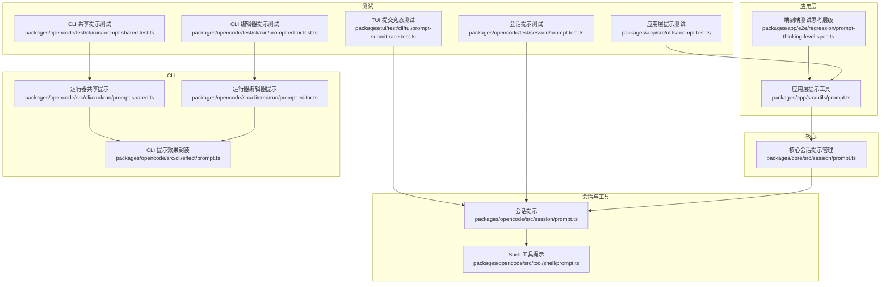
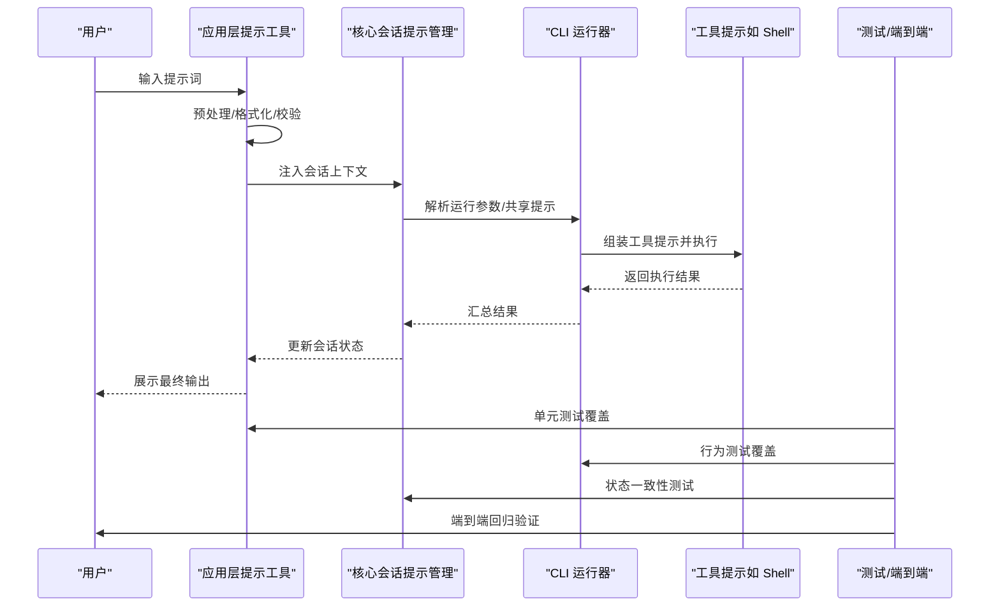
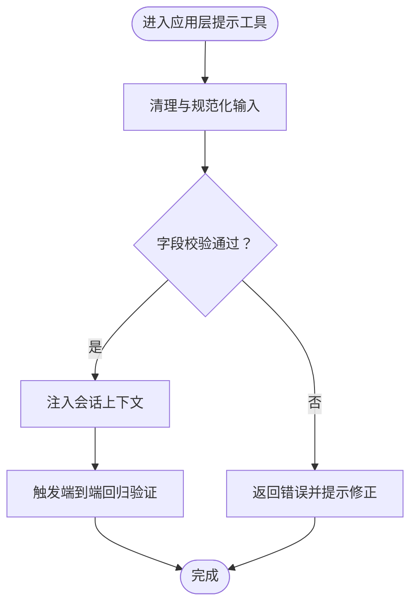
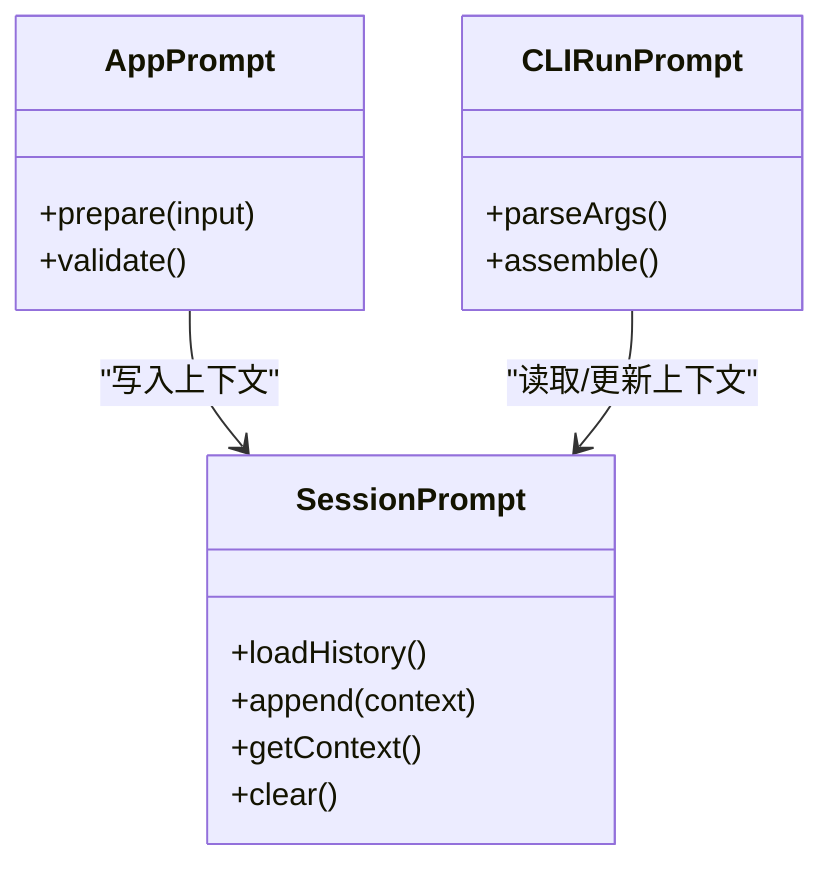
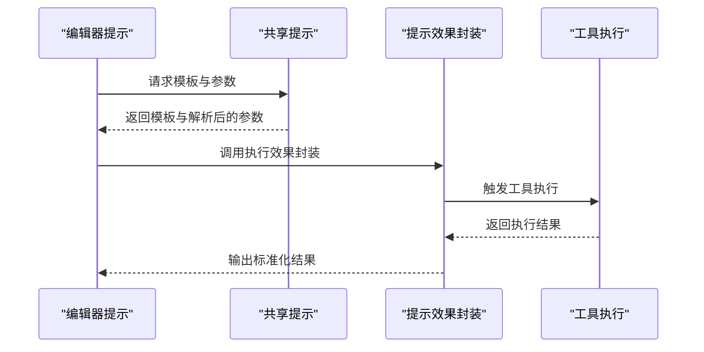
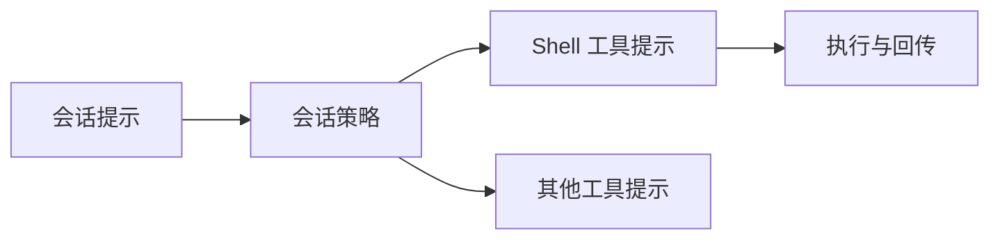
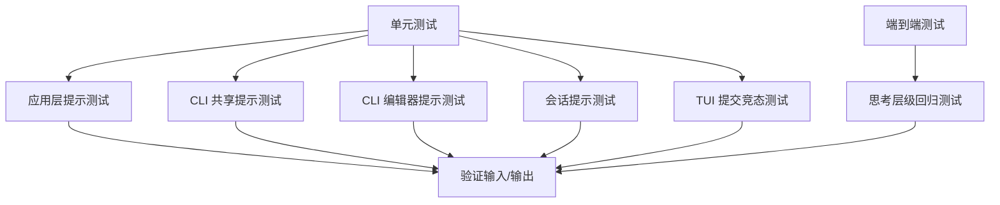
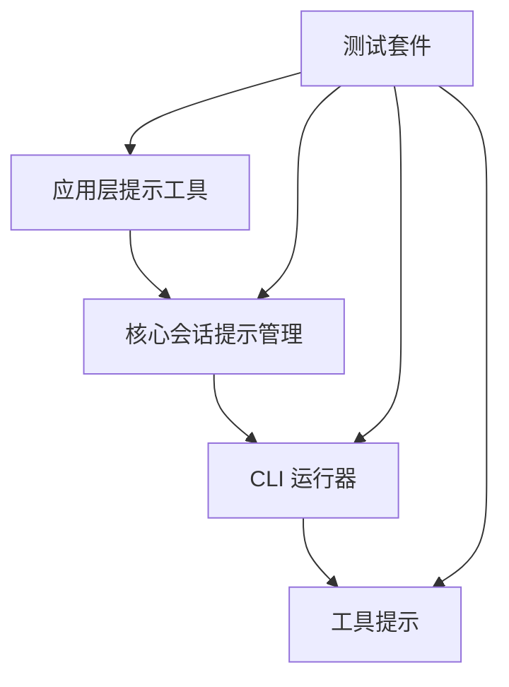

# 提示工程指南

<cite>
**本文引用的文件**
- [packages/app/src/utils/prompt.ts](file://packages/app/src/utils/prompt.ts)
- [packages/app/src/utils/prompt.test.ts](file://packages/app/src/utils/prompt.test.ts)
- [packages/core/src/session/prompt.ts](file://packages/core/src/session/prompt.ts)
- [packages/opencode/src/cli/cmd/run/prompt.editor.ts](file://packages/opencode/src/cli/cmd/run/prompt.editor.ts)
- [packages/opencode/src/cli/cmd/run/prompt.shared.ts](file://packages/opencode/src/cli/cmd/run/prompt.shared.ts)
- [packages/opencode/src/cli/effect/prompt.ts](file://packages/opencode/src/cli/effect/prompt.ts)
- [packages/opencode/src/session/prompt.ts](file://packages/opencode/src/session/prompt.ts)
- [packages/opencode/src/tool/shell/prompt.ts](file://packages/opencode/src/tool/shell/prompt.ts)
- [packages/opencode/test/cli/run/prompt.editor.test.ts](file://packages/opencode/test/cli/run/prompt.editor.test.ts)
- [packages/opencode/test/cli/run/prompt.shared.test.ts](file://packages/opencode/test/cli/run/prompt.shared.test.ts)
- [packages/opencode/test/session/prompt.test.ts](file://packages/opencode/test/session/prompt.test.ts)
- [packages/tui/test/cli/tui/prompt-submit-race.test.ts](file://packages/tui/test/cli/tui/prompt-submit-race.test.ts)
- [packages/app/e2e/regression/prompt-thinking-level.spec.ts](file://packages/app/e2e/regression/prompt-thinking-level.spec.ts)
- [README.md](file://README.md)
- [CONTEXT.md](file://CONTEXT.md)
- [AGENTS.md](file://AGENTS.md)
- [specs/v2/instructions.md](file://specs/v2/instructions.md)
- [specs/v2/tools.md](file://specs/v2/tools.md)
</cite>

## 目录
1. [引言](#引言)
2. [项目结构](#项目结构)
3. [核心组件](#核心组件)
4. [架构总览](#架构总览)
5. [详细组件分析](#详细组件分析)
6. [依赖关系分析](#依赖关系分析)
7. [性能考量](#性能考量)
8. [故障排除指南](#故障排除指南)
9. [结论](#结论)
10. [附录](#附录)

## 引言
本指南面向希望系统掌握 OpenCode 提示工程能力的读者，围绕提示词设计最佳实践、上下文组织方法、典型应用场景（代码生成、代码审查、文档编写、测试用例生成）、提示模板与示例、优化方法与工具（A/B 测试、效果评估、迭代改进）、高级提示技术（思维链推理、自我一致性检查）以及常见问题与排错进行专业梳理。内容基于仓库中与提示工程相关的源码与测试文件提炼总结，并辅以可视化图示帮助理解。

## 项目结构
OpenCode 将提示工程能力分布在多个包中：应用层工具、核心会话管理、CLI 运行时、TUI 交互、以及若干测试与端到端用例。这些模块共同支撑“提示词输入—解析—执行—结果输出”的完整流程。

图表来源
- [packages/app/src/utils/prompt.ts:1-200](file://packages/app/src/utils/prompt.ts#L1-L200)
- [packages/core/src/session/prompt.ts:1-200](file://packages/core/src/session/prompt.ts#L1-L200)
- [packages/opencode/src/cli/cmd/run/prompt.editor.ts:1-200](file://packages/opencode/src/cli/cmd/run/prompt.editor.ts#L1-L200)
- [packages/opencode/src/cli/cmd/run/prompt.shared.ts:1-200](file://packages/opencode/src/cli/cmd/run/prompt.shared.ts#L1-L200)
- [packages/opencode/src/cli/effect/prompt.ts:1-200](file://packages/opencode/src/cli/effect/prompt.ts#L1-L200)
- [packages/opencode/src/session/prompt.ts:1-200](file://packages/opencode/src/session/prompt.ts#L1-L200)
- [packages/opencode/src/tool/shell/prompt.ts:1-200](file://packages/opencode/src/tool/shell/prompt.ts#L1-L200)
- [packages/app/e2e/regression/prompt-thinking-level.spec.ts:1-200](file://packages/app/e2e/regression/prompt-thinking-level.spec.ts#L1-L200)

章节来源
- [packages/app/src/utils/prompt.ts:1-200](file://packages/app/src/utils/prompt.ts#L1-L200)
- [packages/core/src/session/prompt.ts:1-200](file://packages/core/src/session/prompt.ts#L1-L200)
- [packages/opencode/src/cli/cmd/run/prompt.editor.ts:1-200](file://packages/opencode/src/cli/cmd/run/prompt.editor.ts#L1-L200)
- [packages/opencode/src/cli/cmd/run/prompt.shared.ts:1-200](file://packages/opencode/src/cli/cmd/run/prompt.shared.ts#L1-L200)
- [packages/opencode/src/cli/effect/prompt.ts:1-200](file://packages/opencode/src/cli/effect/prompt.ts#L1-L200)
- [packages/opencode/src/session/prompt.ts:1-200](file://packages/opencode/src/session/prompt.ts#L1-L200)
- [packages/opencode/src/tool/shell/prompt.ts:1-200](file://packages/opencode/src/tool/shell/prompt.ts#L1-L200)
- [packages/app/e2e/regression/prompt-thinking-level.spec.ts:1-200](file://packages/app/e2e/regression/prompt-thinking-level.spec.ts#L1-L200)

## 核心组件
- 应用层提示工具：负责在前端或应用侧对提示词进行预处理、格式化与校验，确保输入符合后续执行要求。
- 核心会话提示管理：维护会话上下文中的提示词状态与历史，支持多轮对话与上下文累积。
- CLI 提示运行器：提供命令行环境下的提示词编辑、共享参数与执行效果封装，便于自动化与脚本集成。
- 会话与工具提示：将通用提示策略与具体工具（如 Shell）结合，形成可复用的提示模板与执行路径。
- 测试与端到端验证：通过单元测试、CLI 行为测试与端到端回归测试，保障提示工程流程的稳定性与正确性。

章节来源
- [packages/app/src/utils/prompt.ts:1-200](file://packages/app/src/utils/prompt.ts#L1-L200)
- [packages/core/src/session/prompt.ts:1-200](file://packages/core/src/session/prompt.ts#L1-L200)
- [packages/opencode/src/cli/cmd/run/prompt.editor.ts:1-200](file://packages/opencode/src/cli/cmd/run/prompt.editor.ts#L1-L200)
- [packages/opencode/src/cli/cmd/run/prompt.shared.ts:1-200](file://packages/opencode/src/cli/cmd/run/prompt.shared.ts#L1-L200)
- [packages/opencode/src/cli/effect/prompt.ts:1-200](file://packages/opencode/src/cli/effect/prompt.ts#L1-L200)
- [packages/opencode/src/session/prompt.ts:1-200](file://packages/opencode/src/session/prompt.ts#L1-L200)
- [packages/opencode/src/tool/shell/prompt.ts:1-200](file://packages/opencode/src/tool/shell/prompt.ts#L1-L200)
- [packages/app/e2e/regression/prompt-thinking-level.spec.ts:1-200](file://packages/app/e2e/regression/prompt-thinking-level.spec.ts#L1-L200)

## 架构总览
下图展示了从提示输入到执行与反馈的关键路径，涵盖应用层、核心会话、CLI 运行器与工具层的协作关系。

图表来源
- [packages/app/src/utils/prompt.ts:1-200](file://packages/app/src/utils/prompt.ts#L1-L200)
- [packages/core/src/session/prompt.ts:1-200](file://packages/core/src/session/prompt.ts#L1-L200)
- [packages/opencode/src/cli/cmd/run/prompt.editor.ts:1-200](file://packages/opencode/src/cli/cmd/run/prompt.editor.ts#L1-L200)
- [packages/opencode/src/cli/cmd/run/prompt.shared.ts:1-200](file://packages/opencode/src/cli/cmd/run/prompt.shared.ts#L1-L200)
- [packages/opencode/src/cli/effect/prompt.ts:1-200](file://packages/opencode/src/cli/effect/prompt.ts#L1-L200)
- [packages/opencode/src/session/prompt.ts:1-200](file://packages/opencode/src/session/prompt.ts#L1-L200)
- [packages/opencode/src/tool/shell/prompt.ts:1-200](file://packages/opencode/src/tool/shell/prompt.ts#L1-L200)
- [packages/app/e2e/regression/prompt-thinking-level.spec.ts:1-200](file://packages/app/e2e/regression/prompt-thinking-level.spec.ts#L1-L200)

## 详细组件分析

### 应用层提示工具（packages/app/src/utils/prompt.ts）
职责与特性
- 对用户输入的提示词进行预处理，包括清理、规范化与必要字段校验。
- 与核心会话提示管理对接，确保上下文连贯与历史记录一致。
- 支持与端到端测试协同，验证不同思考层级下的提示行为。

图表来源
- [packages/app/src/utils/prompt.ts:1-200](file://packages/app/src/utils/prompt.ts#L1-L200)
- [packages/app/e2e/regression/prompt-thinking-level.spec.ts:1-200](file://packages/app/e2e/regression/prompt-thinking-level.spec.ts#L1-L200)

章节来源
- [packages/app/src/utils/prompt.ts:1-200](file://packages/app/src/utils/prompt.ts#L1-L200)
- [packages/app/e2e/regression/prompt-thinking-level.spec.ts:1-200](file://packages/app/e2e/regression/prompt-thinking-level.spec.ts#L1-L200)

### 核心会话提示管理（packages/core/src/session/prompt.ts）
职责与特性
- 维护会话提示的历史与状态，支持多轮对话与上下文累积。
- 与应用层与 CLI 层解耦，提供统一的提示词生命周期管理。

图表来源
- [packages/core/src/session/prompt.ts:1-200](file://packages/core/src/session/prompt.ts#L1-L200)
- [packages/app/src/utils/prompt.ts:1-200](file://packages/app/src/utils/prompt.ts#L1-L200)
- [packages/opencode/src/cli/cmd/run/prompt.shared.ts:1-200](file://packages/opencode/src/cli/cmd/run/prompt.shared.ts#L1-L200)

章节来源
- [packages/core/src/session/prompt.ts:1-200](file://packages/core/src/session/prompt.ts#L1-L200)

### CLI 提示运行器（packages/opencode/src/cli/cmd/run/）
职责与特性
- prompt.editor.ts：负责编辑器模式下的提示词组装与参数传递。
- prompt.shared.ts：提供跨场景共享的提示词模板与参数解析逻辑。
- effect/prompt.ts：封装提示执行的效果层，便于测试与监控。

图表来源
- [packages/opencode/src/cli/cmd/run/prompt.editor.ts:1-200](file://packages/opencode/src/cli/cmd/run/prompt.editor.ts#L1-L200)
- [packages/opencode/src/cli/cmd/run/prompt.shared.ts:1-200](file://packages/opencode/src/cli/cmd/run/prompt.shared.ts#L1-L200)
- [packages/opencode/src/cli/effect/prompt.ts:1-200](file://packages/opencode/src/cli/effect/prompt.ts#L1-L200)
- [packages/opencode/src/tool/shell/prompt.ts:1-200](file://packages/opencode/src/tool/shell/prompt.ts#L1-L200)

章节来源
- [packages/opencode/src/cli/cmd/run/prompt.editor.ts:1-200](file://packages/opencode/src/cli/cmd/run/prompt.editor.ts#L1-L200)
- [packages/opencode/src/cli/cmd/run/prompt.shared.ts:1-200](file://packages/opencode/src/cli/cmd/run/prompt.shared.ts#L1-L200)
- [packages/opencode/src/cli/effect/prompt.ts:1-200](file://packages/opencode/src/cli/effect/prompt.ts#L1-L200)
- [packages/opencode/src/tool/shell/prompt.ts:1-200](file://packages/opencode/src/tool/shell/prompt.ts#L1-L200)

### 会话与工具提示（packages/opencode/src/session/prompt.ts 与 tool/shell/prompt.ts）
职责与特性
- 会话提示：定义会话级提示策略，确保多轮交互的一致性与可追溯性。
- 工具提示：针对具体工具（如 Shell）提供专用提示模板，降低使用门槛并提升执行稳定性。

图表来源
- [packages/opencode/src/session/prompt.ts:1-200](file://packages/opencode/src/session/prompt.ts#L1-L200)
- [packages/opencode/src/tool/shell/prompt.ts:1-200](file://packages/opencode/src/tool/shell/prompt.ts#L1-L200)

章节来源
- [packages/opencode/src/session/prompt.ts:1-200](file://packages/opencode/src/session/prompt.ts#L1-L200)
- [packages/opencode/src/tool/shell/prompt.ts:1-200](file://packages/opencode/src/tool/shell/prompt.ts#L1-L200)

### 测试与验证（packages/*/test/*）
职责与特性
- 应用层提示测试：验证输入预处理、校验与会话注入的正确性。
- CLI 共享与编辑器提示测试：覆盖参数解析、模板组装与执行效果。
- 会话提示测试：验证多轮上下文的一致性与状态更新。
- TUI 提交竞态测试：保证在并发提交场景下的稳定性。

图表来源
- [packages/app/src/utils/prompt.test.ts:1-200](file://packages/app/src/utils/prompt.test.ts#L1-L200)
- [packages/opencode/test/cli/run/prompt.shared.test.ts:1-200](file://packages/opencode/test/cli/run/prompt.shared.test.ts#L1-L200)
- [packages/opencode/test/cli/run/prompt.editor.test.ts:1-200](file://packages/opencode/test/cli/run/prompt.editor.test.ts#L1-L200)
- [packages/opencode/test/session/prompt.test.ts:1-200](file://packages/opencode/test/session/prompt.test.ts#L1-L200)
- [packages/tui/test/cli/tui/prompt-submit-race.test.ts:1-200](file://packages/tui/test/cli/tui/prompt-submit-race.test.ts#L1-L200)
- [packages/app/e2e/regression/prompt-thinking-level.spec.ts:1-200](file://packages/app/e2e/regression/prompt-thinking-level.spec.ts#L1-L200)

章节来源
- [packages/app/src/utils/prompt.test.ts:1-200](file://packages/app/src/utils/prompt.test.ts#L1-L200)
- [packages/opencode/test/cli/run/prompt.shared.test.ts:1-200](file://packages/opencode/test/cli/run/prompt.shared.test.ts#L1-L200)
- [packages/opencode/test/cli/run/prompt.editor.test.ts:1-200](file://packages/opencode/test/cli/run/prompt.editor.test.ts#L1-L200)
- [packages/opencode/test/session/prompt.test.ts:1-200](file://packages/opencode/test/session/prompt.test.ts#L1-L200)
- [packages/tui/test/cli/tui/prompt-submit-race.test.ts:1-200](file://packages/tui/test/cli/tui/prompt-submit-race.test.ts#L1-L200)
- [packages/app/e2e/regression/prompt-thinking-level.spec.ts:1-200](file://packages/app/e2e/regression/prompt-thinking-level.spec.ts#L1-L200)

## 依赖关系分析
- 松耦合设计：应用层、核心会话与 CLI 层通过明确接口交互，避免直接依赖，提升可维护性。
- 可复用模板：共享提示与工具提示模板减少重复实现，提高一致性。
- 测试驱动：完善的单元与端到端测试覆盖关键路径，保障变更质量。

图表来源
- [packages/app/src/utils/prompt.ts:1-200](file://packages/app/src/utils/prompt.ts#L1-L200)
- [packages/core/src/session/prompt.ts:1-200](file://packages/core/src/session/prompt.ts#L1-L200)
- [packages/opencode/src/cli/cmd/run/prompt.shared.ts:1-200](file://packages/opencode/src/cli/cmd/run/prompt.shared.ts#L1-L200)
- [packages/opencode/src/tool/shell/prompt.ts:1-200](file://packages/opencode/src/tool/shell/prompt.ts#L1-L200)
- [packages/app/src/utils/prompt.test.ts:1-200](file://packages/app/src/utils/prompt.test.ts#L1-L200)
- [packages/opencode/test/cli/run/prompt.shared.test.ts:1-200](file://packages/opencode/test/cli/run/prompt.shared.test.ts#L1-L200)

章节来源
- [packages/app/src/utils/prompt.ts:1-200](file://packages/app/src/utils/prompt.ts#L1-L200)
- [packages/core/src/session/prompt.ts:1-200](file://packages/core/src/session/prompt.ts#L1-L200)
- [packages/opencode/src/cli/cmd/run/prompt.shared.ts:1-200](file://packages/opencode/src/cli/cmd/run/prompt.shared.ts#L1-L200)
- [packages/opencode/src/tool/shell/prompt.ts:1-200](file://packages/opencode/src/tool/shell/prompt.ts#L1-L200)
- [packages/app/src/utils/prompt.test.ts:1-200](file://packages/app/src/utils/prompt.test.ts#L1-L200)
- [packages/opencode/test/cli/run/prompt.shared.test.ts:1-200](file://packages/opencode/test/cli/run/prompt.shared.test.ts#L1-L200)

## 性能考量
- 输入预处理：在应用层尽早进行清理与校验，减少无效请求与重试成本。
- 上下文控制：合理限制会话历史长度与上下文大小，避免性能退化。
- 执行批量化：在 CLI 层合并相似提示任务，减少工具启动开销。
- 缓存与复用：利用共享提示模板与已知答案缓存，缩短响应时间。
- 并发安全：在 TUI 等并发场景下，确保提示提交的原子性与一致性。

## 故障排除指南
常见问题与定位思路
- 提示词未生效
  - 检查应用层预处理是否拦截了异常输入。
  - 核对核心会话是否正确注入上下文。
  - 在 CLI 层确认参数解析与模板组装是否按预期执行。
- 执行结果不一致
  - 查看会话提示测试与端到端回归测试，定位状态同步问题。
  - 关注工具提示的执行顺序与返回值处理。
- 并发提交冲突
  - 使用 TUI 提交竞态测试用例，验证锁机制与重试策略。
- 思考层级异常
  - 借助端到端回归测试，逐步缩小问题范围至特定思考层级。

章节来源
- [packages/app/src/utils/prompt.ts:1-200](file://packages/app/src/utils/prompt.ts#L1-L200)
- [packages/core/src/session/prompt.ts:1-200](file://packages/core/src/session/prompt.ts#L1-L200)
- [packages/opencode/src/cli/cmd/run/prompt.shared.ts:1-200](file://packages/opencode/src/cli/cmd/run/prompt.shared.ts#L1-L200)
- [packages/opencode/src/tool/shell/prompt.ts:1-200](file://packages/opencode/src/tool/shell/prompt.ts#L1-L200)
- [packages/app/e2e/regression/prompt-thinking-level.spec.ts:1-200](file://packages/app/e2e/regression/prompt-thinking-level.spec.ts#L1-L200)
- [packages/tui/test/cli/tui/prompt-submit-race.test.ts:1-200](file://packages/tui/test/cli/tui/prompt-submit-race.test.ts#L1-L200)

## 结论
OpenCode 的提示工程体系通过“应用层预处理—核心会话管理—CLI 运行器—工具执行—测试验证”的闭环，实现了从输入到输出的全链路可控与可观测。遵循本文提供的最佳实践与排错方法，可在不同应用场景中稳定地构建高质量提示词，并持续优化其效果与性能。

## 附录

### 提示工程最佳实践清单
- 明确目标：在开始前确定期望输出类型与验收标准。
- 清晰指令：使用具体、可执行的动词，避免模糊描述。
- 有效上下文：提供必要的背景、约束与边界条件，减少模型猜测。
- 分步执行：复杂任务拆分为子任务，配合思维链推理逐步收敛。
- 自我一致性：在多轮或多次执行中保持输出一致性，及时发现偏差。
- A/B 测试：对比不同提示版本在关键指标上的差异，选择最优方案。
- 持续评估：建立效果评估体系（准确性、鲁棒性、效率），定期回顾与迭代。

### 典型应用场景与提示设计要点
- 代码生成
  - 明确语言、框架、风格与输出格式；限定依赖与外部接口。
  - 提供最小可运行示例与约束条件，避免过度泛化。
- 代码审查
  - 列出审查重点（安全性、性能、可读性、规范性）与评分维度。
  - 附带改进建议与替代方案，便于快速采纳。
- 文档编写
  - 定义文档类型（API、设计、运维）、受众与语言风格。
  - 提供目录结构与关键段落模板，确保一致性。
- 测试用例生成
  - 指定被测函数/模块、输入域与边界条件。
  - 区分正常、异常与边界场景，给出期望断言。

### 提示模板与示例（路径指引）
- 应用层提示工具
  - [packages/app/src/utils/prompt.ts:1-200](file://packages/app/src/utils/prompt.ts#L1-L200)
- 核心会话提示管理
  - [packages/core/src/session/prompt.ts:1-200](file://packages/core/src/session/prompt.ts#L1-L200)
- CLI 提示运行器（编辑器/共享）
  - [packages/opencode/src/cli/cmd/run/prompt.editor.ts:1-200](file://packages/opencode/src/cli/cmd/run/prompt.editor.ts#L1-L200)
  - [packages/opencode/src/cli/cmd/run/prompt.shared.ts:1-200](file://packages/opencode/src/cli/cmd/run/prompt.shared.ts#L1-L200)
- 会话与工具提示
  - [packages/opencode/src/session/prompt.ts:1-200](file://packages/opencode/src/session/prompt.ts#L1-L200)
  - [packages/opencode/src/tool/shell/prompt.ts:1-200](file://packages/opencode/src/tool/shell/prompt.ts#L1-L200)
- 端到端与测试
  - [packages/app/e2e/regression/prompt-thinking-level.spec.ts:1-200](file://packages/app/e2e/regression/prompt-thinking-level.spec.ts#L1-L200)
  - [packages/app/src/utils/prompt.test.ts:1-200](file://packages/app/src/utils/prompt.test.ts#L1-L200)
  - [packages/opencode/test/cli/run/prompt.shared.test.ts:1-200](file://packages/opencode/test/cli/run/prompt.shared.test.ts#L1-L200)
  - [packages/opencode/test/cli/run/prompt.editor.test.ts:1-200](file://packages/opencode/test/cli/run/prompt.editor.test.ts#L1-L200)
  - [packages/opencode/test/session/prompt.test.ts:1-200](file://packages/opencode/test/session/prompt.test.ts#L1-L200)
  - [packages/tui/test/cli/tui/prompt-submit-race.test.ts:1-200](file://packages/tui/test/cli/tui/prompt-submit-race.test.ts#L1-L200)

### 高级提示技术
- 思维链推理（Chain-of-Thought）
  - 将复杂问题分解为一系列中间步骤，引导模型逐步推导。
  - 适用于数学计算、逻辑推理与多步骤任务编排。
- 自我一致性检查（Self-Consistency）
  - 通过多次采样与多数投票的方式提升稳定性与准确性。
  - 适合开放性问答与创意类任务，降低随机波动影响。

### 相关参考文档
- 项目总览与背景
  - [README.md](file://README.md)
- 提示工程与代理相关
  - [AGENTS.md](file://AGENTS.md)
- 上下文与背景说明
  - [CONTEXT.md](file://CONTEXT.md)
- 规范与说明
  - [specs/v2/instructions.md](file://specs/v2/instructions.md)
  - [specs/v2/tools.md](file://specs/v2/tools.md)