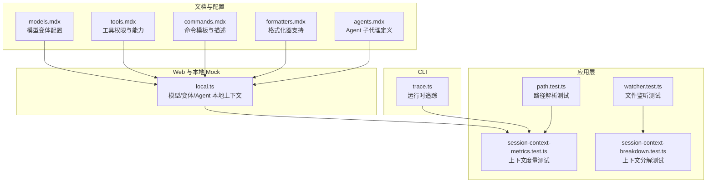
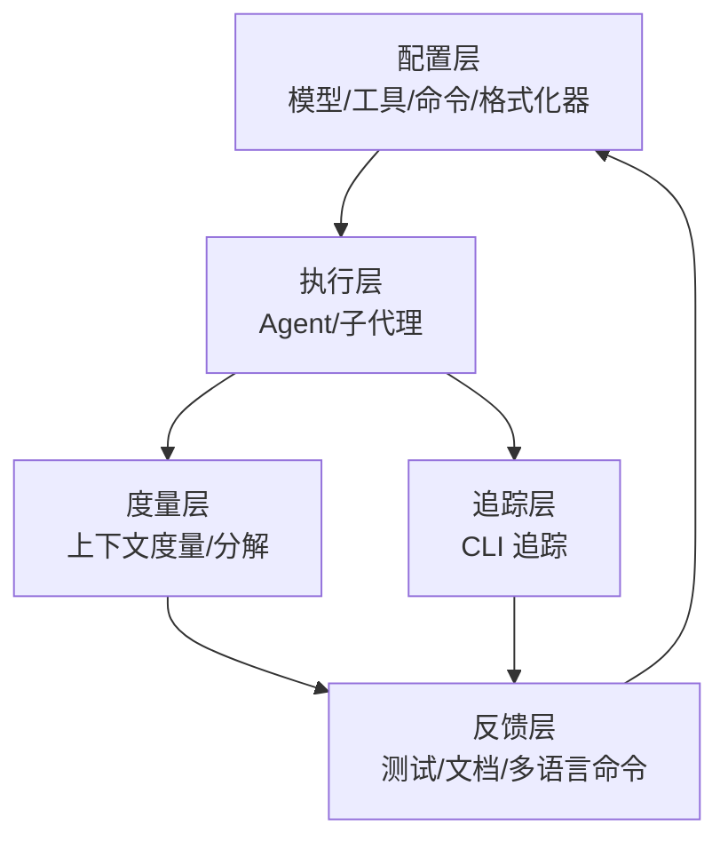
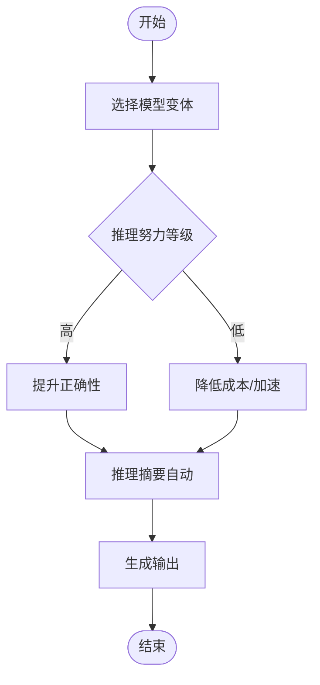
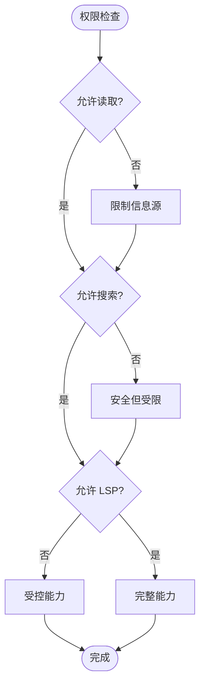
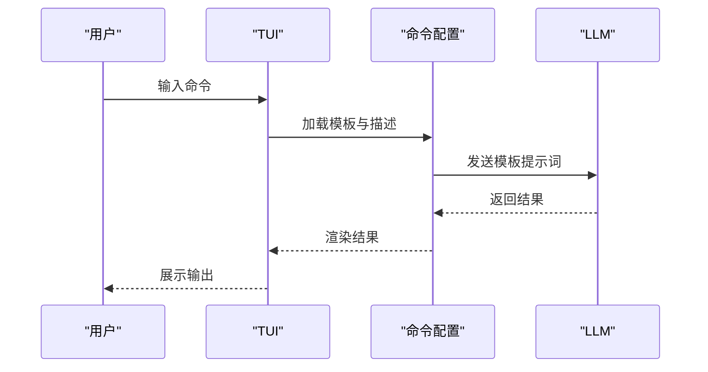
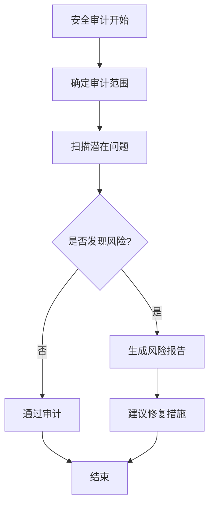
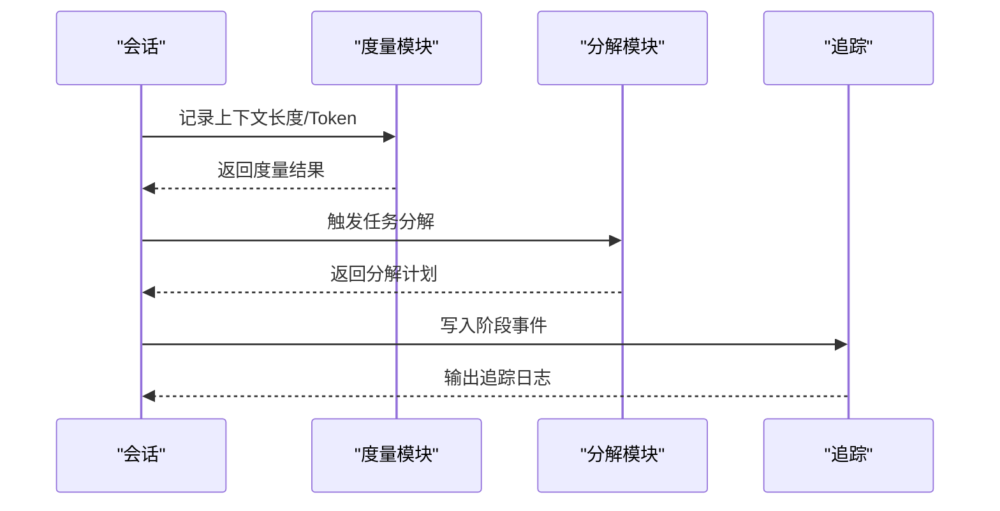
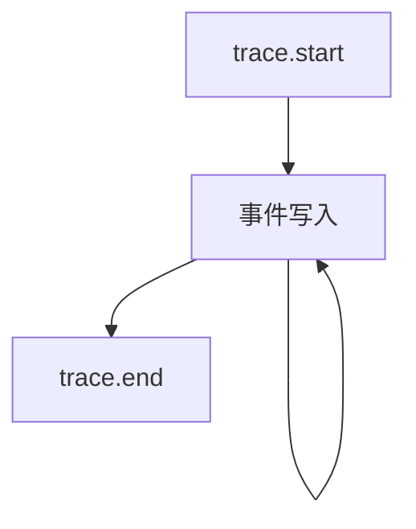
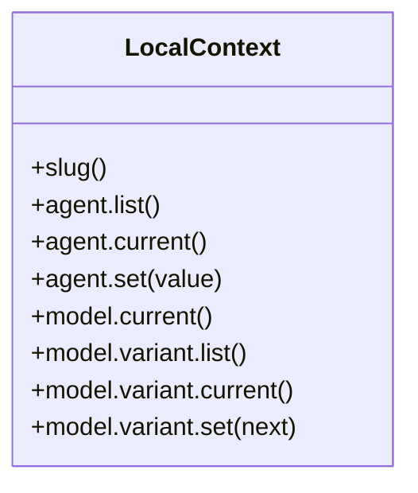
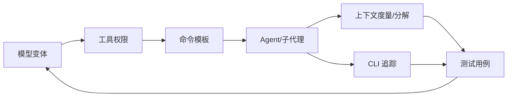

# 生成质量评估

<cite>
**本文引用的文件**
- [README.md](file://README.md)
- [CONTEXT.md](file://CONTEXT.md)
- [packages/web/src/content/docs/zh-cn/agents.mdx](file://packages/web/src/content/docs/zh-cn/agents.mdx)
- [packages/web/src/content/docs/zh-cn/formatters.mdx](file://packages/web/src/content/docs/zh-cn/formatters.mdx)
- [packages/web/src/content/docs/zh-cn/tools.mdx](file://packages/web/src/content/docs/zh-cn/tools.mdx)
- [packages/web/src/content/docs/zh-cn/models.mdx](file://packages/web/src/content/docs/zh-cn/models.mdx)
- [packages/web/src/content/docs/zh-cn/commands.mdx](file://packages/web/src/content/docs/zh-cn/commands.mdx)
- [packages/opencode/src/cli/cmd/run/trace.ts](file://packages/opencode/src/cli/cmd/run/trace.ts)
- [packages/app/src/context/file/path.test.ts](file://packages/app/src/context/file/path.test.ts)
- [packages/app/src/context/file/watcher.test.ts](file://packages/app/src/context/file/watcher.test.ts)
- [packages/app/src/components/session/session-context-metrics.test.ts](file://packages/app/src/components/session/session-context-metrics.test.ts)
- [packages/app/src/components/session/session-context-breakdown.test.ts](file://packages/app/src/components/session/session-context-breakdown.test.ts)
- [packages/storybook/.storybook/mocks/app/context/local.ts](file://packages/storybook/.storybook/mocks/app/context/local.ts)
- [packages/web/src/content/docs/rus/agents.mdx](file://packages/web/src/content/docs/rus/agents.mdx)
- [packages/web/src/content/docs/de/commands.mdx](file://packages/web/src/content/docs/de/commands.mdx)
- [packages/web/src/content/docs/th/commands.mdx](file://packages/web/src/content/docs/th/commands.mdx)
- [packages/web/src/content/docs/tr/commands.mdx](file://packages/web/src/content/docs/tr/commands.mdx)
- [packages/web/src/content/docs/ar/sdk.mdx](file://packages/web/src/content/docs/ar/sdk.mdx)
- [packages/web/src/content/docs/bs/github.mdx](file://packages/web/src/content/docs/bs/github.mdx)
</cite>

## 目录
1. [引言](#引言)
2. [项目结构](#项目结构)
3. [核心组件](#核心组件)
4. [架构总览](#架构总览)
5. [详细组件分析](#详细组件分析)
6. [依赖关系分析](#依赖关系分析)
7. [性能考量](#性能考量)
8. [故障排查指南](#故障排查指南)
9. [结论](#结论)
10. [附录](#附录)

## 引言
本文件面向 OpenCode 的 AI 生成质量评估，旨在建立覆盖“代码正确性、性能表现、安全性、可读性”等多维度的质量评估体系与标准；明确自动评估与人工评估流程；给出错误检测与处理机制；并提出质量监控与持续改进方案。文档以仓库中已有的模型配置、工具权限、格式化器、命令模板、会话上下文度量与追踪能力为基础，结合 Agent 子代理（如安全审计）与 CLI 追踪能力，形成可落地的质量保障闭环。

## 项目结构
OpenCode 由多包组成，与质量评估直接相关的关键模块包括：
- 文档与配置：模型变体、工具权限、命令模板、格式化器等
- 应用层测试：路径解析、文件监听、会话上下文度量与分解
- CLI 追踪：运行时事件记录与输出
- Web 展示与本地 Mock：模型与 Agent 切换、变体选择

图示来源
- [packages/web/src/content/docs/zh-cn/models.mdx:117-170](file://packages/web/src/content/docs/zh-cn/models.mdx#L117-L170)
- [packages/web/src/content/docs/zh-cn/tools.mdx:96-157](file://packages/web/src/content/docs/zh-cn/tools.mdx#L96-L157)
- [packages/web/src/content/docs/zh-cn/commands.mdx:205-261](file://packages/web/src/content/docs/zh-cn/commands.mdx#L205-L261)
- [packages/web/src/content/docs/zh-cn/formatters.mdx:21-46](file://packages/web/src/content/docs/zh-cn/formatters.mdx#L21-L46)
- [packages/web/src/content/docs/zh-cn/agents.mdx:721-754](file://packages/web/src/content/docs/zh-cn/agents.mdx#L721-L754)
- [packages/app/src/context/file/path.test.ts](file://packages/app/src/context/file/path.test.ts)
- [packages/app/src/context/file/watcher.test.ts](file://packages/app/src/context/file/watcher.test.ts)
- [packages/app/src/components/session/session-context-metrics.test.ts](file://packages/app/src/components/session/session-context-metrics.test.ts)
- [packages/app/src/components/session/session-context-breakdown.test.ts](file://packages/app/src/components/session/session-context-breakdown.test.ts)
- [packages/opencode/src/cli/cmd/run/trace.ts:40-94](file://packages/opencode/src/cli/cmd/run/trace.ts#L40-L94)
- [packages/storybook/.storybook/mocks/app/context/local.ts:1-41](file://packages/storybook/.storybook/mocks/app/context/local.ts#L1-L41)

章节来源
- [README.md](file://README.md)
- [CONTEXT.md](file://CONTEXT.md)

## 核心组件
- 模型变体与推理预算：通过模型配置项控制推理努力、文本冗余与推理摘要策略，用于在“质量与成本/速度”之间权衡。
- 工具权限与能力：通过权限开关控制读取、搜索、模式匹配、语言服务器交互等能力，决定生成过程可访问的数据面范围。
- 命令模板与描述：统一的命令模板与描述便于标准化执行流程，支撑自动化测试与覆盖率报告等场景。
- 格式化器：内置多种语言格式化器，保证生成代码风格一致，降低可读性与维护成本。
- Agent 子代理：如安全审计子代理，聚焦输入验证、认证授权、数据暴露、依赖漏洞、配置安全等风险点。
- 会话上下文度量与分解：对上下文长度、Token 使用、任务分解进行度量，辅助定位上下文溢出与性能瓶颈。
- CLI 追踪：记录启动参数、工作目录、进程 ID、时间戳与事件流，便于问题复现与根因分析。
- 本地 Mock 上下文：提供模型、变体、Agent 的本地切换与当前状态查询，便于端到端验证与回归测试。

章节来源
- [packages/web/src/content/docs/zh-cn/models.mdx:117-170](file://packages/web/src/content/docs/zh-cn/models.mdx#L117-L170)
- [packages/web/src/content/docs/zh-cn/tools.mdx:96-157](file://packages/web/src/content/docs/zh-cn/tools.mdx#L96-L157)
- [packages/web/src/content/docs/zh-cn/commands.mdx:205-261](file://packages/web/src/content/docs/zh-cn/commands.mdx#L205-L261)
- [packages/web/src/content/docs/zh-cn/formatters.mdx:21-46](file://packages/web/src/content/docs/zh-cn/formatters.mdx#L21-L46)
- [packages/web/src/content/docs/zh-cn/agents.mdx:721-754](file://packages/web/src/content/docs/zh-cn/agents.mdx#L721-L754)
- [packages/app/src/components/session/session-context-metrics.test.ts](file://packages/app/src/components/session/session-context-metrics.test.ts)
- [packages/app/src/components/session/session-context-breakdown.test.ts](file://packages/app/src/components/session/session-context-breakdown.test.ts)
- [packages/opencode/src/cli/cmd/run/trace.ts:40-94](file://packages/opencode/src/cli/cmd/run/trace.ts#L40-L94)
- [packages/storybook/.storybook/mocks/app/context/local.ts:1-41](file://packages/storybook/.storybook/mocks/app/context/local.ts#L1-L41)

## 架构总览
OpenCode 的质量评估贯穿“配置—执行—度量—追踪—反馈”的闭环：
- 配置层：模型变体、工具权限、命令模板、格式化器
- 执行层：Agent 与子代理协作，按模板与权限执行任务
- 度量层：上下文度量与分解，识别上下文溢出与性能瓶颈
- 追踪层：CLI 追踪记录运行轨迹，便于回溯与定位
- 反馈层：测试用例、文档与多语言命令参考，支撑持续改进

图示来源
- [packages/web/src/content/docs/zh-cn/models.mdx:117-170](file://packages/web/src/content/docs/zh-cn/models.mdx#L117-L170)
- [packages/web/src/content/docs/zh-cn/tools.mdx:96-157](file://packages/web/src/content/docs/zh-cn/tools.mdx#L96-L157)
- [packages/web/src/content/docs/zh-cn/commands.mdx:205-261](file://packages/web/src/content/docs/zh-cn/commands.mdx#L205-L261)
- [packages/web/src/content/docs/zh-cn/formatters.mdx:21-46](file://packages/web/src/content/docs/zh-cn/formatters.mdx#L21-L46)
- [packages/opencode/src/cli/cmd/run/trace.ts:40-94](file://packages/opencode/src/cli/cmd/run/trace.ts#L40-L94)
- [packages/app/src/components/session/session-context-metrics.test.ts](file://packages/app/src/components/session/session-context-metrics.test.ts)
- [packages/app/src/components/session/session-context-breakdown.test.ts](file://packages/app/src/components/session/session-context-breakdown.test.ts)

## 详细组件分析

### 组件一：模型变体与推理预算
- 目标：在“质量/成本/速度”间进行可控权衡，避免过度推理导致延迟或超预算。
- 关键点：
  - 推理努力（高/低/极高）、文本冗余（低）、推理摘要（自动）等组合
  - 不同供应商（Anthropic、OpenAI、Google 等）的默认变体集合
- 质量影响：
  - 高推理努力可能提升正确性但增加延迟与成本
  - 低冗余有助于减少上下文占用，缓解溢出风险
- 建议：
  - 为不同任务设定“快速/思考”两类变体，按场景切换
  - 在 CI 中固定关键任务的变体，确保稳定性

图示来源
- [packages/web/src/content/docs/zh-cn/models.mdx:117-170](file://packages/web/src/content/docs/zh-cn/models.mdx#L117-L170)

章节来源
- [packages/web/src/content/docs/zh-cn/models.mdx:117-170](file://packages/web/src/content/docs/zh-cn/models.mdx#L117-L170)

### 组件二：工具权限与能力
- 目标：限定生成过程可访问的数据面，降低安全与隐私风险，同时保证必要能力。
- 关键点：
  - 读取、搜索、模式匹配、语言服务器交互等能力的许可控制
  - 与格式化器配合，确保输出风格一致
- 质量影响：
  - 权限不足可能导致信息缺失，影响正确性
  - 权限过度可能引入不必要风险或噪声
- 建议：
  - 默认最小权限，按需开启
  - 将格式化器纳入权限白名单，确保输出一致性

图示来源
- [packages/web/src/content/docs/zh-cn/tools.mdx:96-157](file://packages/web/src/content/docs/zh-cn/tools.mdx#L96-L157)
- [packages/web/src/content/docs/zh-cn/formatters.mdx:21-46](file://packages/web/src/content/docs/zh-cn/formatters.mdx#L21-L46)

章节来源
- [packages/web/src/content/docs/zh-cn/tools.mdx:96-157](file://packages/web/src/content/docs/zh-cn/tools.mdx#L96-L157)
- [packages/web/src/content/docs/zh-cn/formatters.mdx:21-46](file://packages/web/src/content/docs/zh-cn/formatters.mdx#L21-L46)

### 组件三：命令模板与描述
- 目标：标准化执行流程，便于自动化测试与覆盖率统计。
- 关键点：
  - 模板定义发送给 LLM 的提示词
  - 描述在 TUI 中展示，指导用户使用
  - 支持指定 Agent 或禁用子任务触发
- 质量影响：
  - 模板清晰度直接影响生成质量
  - 描述准确度影响用户体验与误用率
- 建议：
  - 为关键命令维护多语言模板与描述
  - 在 CI 中固定模板，避免漂移

图示来源
- [packages/web/src/content/docs/zh-cn/commands.mdx:205-261](file://packages/web/src/content/docs/zh-cn/commands.mdx#L205-L261)
- [packages/web/src/content/docs/de/commands.mdx:205-260](file://packages/web/src/content/docs/de/commands.mdx#L205-L260)
- [packages/web/src/content/docs/th/commands.mdx:27-63](file://packages/web/src/content/docs/th/commands.mdx#L27-L63)
- [packages/web/src/content/docs/tr/commands.mdx:208-263](file://packages/web/src/content/docs/tr/commands.mdx#L208-L263)

章节来源
- [packages/web/src/content/docs/zh-cn/commands.mdx:205-261](file://packages/web/src/content/docs/zh-cn/commands.mdx#L205-L261)
- [packages/web/src/content/docs/de/commands.mdx:205-260](file://packages/web/src/content/docs/de/commands.mdx#L205-L260)
- [packages/web/src/content/docs/th/commands.mdx:27-63](file://packages/web/src/content/docs/th/commands.mdx#L27-L63)
- [packages/web/src/content/docs/tr/commands.mdx:208-263](file://packages/web/src/content/docs/tr/commands.mdx#L208-L263)

### 组件四：Agent 子代理（安全审计）
- 目标：在生成过程中主动发现潜在安全问题，降低风险暴露。
- 关键点：
  - 子代理模式，限制写入与编辑能力
  - 关注输入验证、认证授权、数据暴露、依赖漏洞、配置安全
- 质量影响：
  - 提升安全性，减少后续修复成本
  - 与格式化器协同，确保输出可读且规范
- 建议：
  - 将安全审计作为必经环节
  - 结合测试用例验证典型漏洞场景

图示来源
- [packages/web/src/content/docs/zh-cn/agents.mdx:721-754](file://packages/web/src/content/docs/zh-cn/agents.mdx#L721-L754)
- [packages/web/src/content/docs/rus/agents.mdx:723-754](file://packages/web/src/content/docs/rus/agents.mdx#L723-L754)

章节来源
- [packages/web/src/content/docs/zh-cn/agents.mdx:721-754](file://packages/web/src/content/docs/zh-cn/agents.mdx#L721-L754)
- [packages/web/src/content/docs/rus/agents.mdx:723-754](file://packages/web/src/content/docs/rus/agents.mdx#L723-L754)

### 组件五：会话上下文度量与分解
- 目标：量化上下文长度、Token 使用与任务分解，识别溢出与性能瓶颈。
- 关键点：
  - 上下文度量测试与分解测试覆盖
  - 与 CLI 追踪联动，定位异常阶段
- 质量影响：
  - 上下文溢出会导致截断与错误
  - 分解不合理会增加复杂度与失败率
- 建议：
  - 设定阈值告警，超过阈值自动降级或拆分
  - 在 CI 中加入度量回归检查

图示来源
- [packages/app/src/components/session/session-context-metrics.test.ts](file://packages/app/src/components/session/session-context-metrics.test.ts)
- [packages/app/src/components/session/session-context-breakdown.test.ts](file://packages/app/src/components/session/session-context-breakdown.test.ts)
- [packages/opencode/src/cli/cmd/run/trace.ts:40-94](file://packages/opencode/src/cli/cmd/run/trace.ts#L40-L94)

章节来源
- [packages/app/src/components/session/session-context-metrics.test.ts](file://packages/app/src/components/session/session-context-metrics.test.ts)
- [packages/app/src/components/session/session-context-breakdown.test.ts](file://packages/app/src/components/session/session-context-breakdown.test.ts)
- [packages/opencode/src/cli/cmd/run/trace.ts:40-94](file://packages/opencode/src/cli/cmd/run/trace.ts#L40-L94)

### 组件六：CLI 追踪
- 目标：记录运行时事件，便于问题复现与根因分析。
- 关键点：
  - 启动参数、工作目录、进程 ID、时间戳
  - 事件类型与数据内容
- 质量影响：
  - 丰富的追踪日志提升诊断效率
  - 大量日志需控制粒度与保留周期
- 建议：
  - 在 CI 与生产环境按需启用
  - 对敏感信息脱敏

图示来源
- [packages/opencode/src/cli/cmd/run/trace.ts:40-94](file://packages/opencode/src/cli/cmd/run/trace.ts#L40-L94)

章节来源
- [packages/opencode/src/cli/cmd/run/trace.ts:40-94](file://packages/opencode/src/cli/cmd/run/trace.ts#L40-L94)

### 组件七：本地 Mock 上下文
- 目标：提供模型、变体、Agent 的本地切换与当前状态查询，便于端到端验证。
- 关键点：
  - 当前 Agent、可用变体列表、当前变体
  - 模型信息与变体映射
- 质量影响：
  - 本地验证可提前发现集成问题
  - 状态一致性影响测试稳定性
- 建议：
  - 与真实环境保持一致的变体语义
  - 在 Storybook 中完善交互用例

图示来源
- [packages/storybook/.storybook/mocks/app/context/local.ts:1-41](file://packages/storybook/.storybook/mocks/app/context/local.ts#L1-L41)

章节来源
- [packages/storybook/.storybook/mocks/app/context/local.ts:1-41](file://packages/storybook/.storybook/mocks/app/context/local.ts#L1-L41)

## 依赖关系分析
- 配置依赖：模型变体依赖工具权限与命令模板；格式化器依赖工具权限
- 执行依赖：Agent 与子代理依赖工具权限；命令模板驱动执行
- 度量依赖：上下文度量与分解依赖会话状态；CLI 追踪依赖执行阶段
- 反馈依赖：测试用例与文档为配置与执行提供回归保障

图示来源
- [packages/web/src/content/docs/zh-cn/models.mdx:117-170](file://packages/web/src/content/docs/zh-cn/models.mdx#L117-L170)
- [packages/web/src/content/docs/zh-cn/tools.mdx:96-157](file://packages/web/src/content/docs/zh-cn/tools.mdx#L96-L157)
- [packages/web/src/content/docs/zh-cn/commands.mdx:205-261](file://packages/web/src/content/docs/zh-cn/commands.mdx#L205-L261)
- [packages/web/src/content/docs/zh-cn/agents.mdx:721-754](file://packages/web/src/content/docs/zh-cn/agents.mdx#L721-L754)
- [packages/app/src/components/session/session-context-metrics.test.ts](file://packages/app/src/components/session/session-context-metrics.test.ts)
- [packages/app/src/components/session/session-context-breakdown.test.ts](file://packages/app/src/components/session/session-context-breakdown.test.ts)
- [packages/opencode/src/cli/cmd/run/trace.ts:40-94](file://packages/opencode/src/cli/cmd/run/trace.ts#L40-L94)

章节来源
- [packages/web/src/content/docs/zh-cn/models.mdx:117-170](file://packages/web/src/content/docs/zh-cn/models.mdx#L117-L170)
- [packages/web/src/content/docs/zh-cn/tools.mdx:96-157](file://packages/web/src/content/docs/zh-cn/tools.mdx#L96-L157)
- [packages/web/src/content/docs/zh-cn/commands.mdx:205-261](file://packages/web/src/content/docs/zh-cn/commands.mdx#L205-L261)
- [packages/web/src/content/docs/zh-cn/agents.mdx:721-754](file://packages/web/src/content/docs/zh-cn/agents.mdx#L721-L754)
- [packages/app/src/components/session/session-context-metrics.test.ts](file://packages/app/src/components/session/session-context-metrics.test.ts)
- [packages/app/src/components/session/session-context-breakdown.test.ts](file://packages/app/src/components/session/session-context-breakdown.test.ts)
- [packages/opencode/src/cli/cmd/run/trace.ts:40-94](file://packages/opencode/src/cli/cmd/run/trace.ts#L40-L94)

## 性能考量
- 推理预算与上下文长度：通过模型变体与上下文度量控制，避免超长上下文导致的截断与延迟
- 权限与能力：最小权限原则减少无关数据访问，提高响应速度
- 格式化器：统一格式化可减少二次修改与往返，提升整体吞吐
- CLI 追踪：在调试阶段启用，生产环境按需关闭，平衡可观测性与开销

## 故障排查指南
- 上下文溢出
  - 现象：生成被截断、Token 超限
  - 排查：查看上下文度量与分解测试输出，确认阈值与拆分策略
  - 处理：降低冗余、拆分任务、调整变体
- 模型限制
  - 现象：特定供应商返回错误或格式不符
  - 排查：核对变体配置与供应商差异
  - 处理：切换供应商或调整变体
- 格式错误
  - 现象：输出风格不一致或不符合规范
  - 排查：确认格式化器启用与版本
  - 处理：统一格式化器配置，纳入权限白名单
- 权限不足
  - 现象：无法读取/搜索/匹配目标文件
  - 排查：核对工具权限开关
  - 处理：按需放宽权限或调整搜索范围
- 追踪与回溯
  - 使用 CLI 追踪记录启动参数、工作目录、事件流，定位异常阶段

章节来源
- [packages/app/src/components/session/session-context-metrics.test.ts](file://packages/app/src/components/session/session-context-metrics.test.ts)
- [packages/app/src/components/session/session-context-breakdown.test.ts](file://packages/app/src/components/session/session-context-breakdown.test.ts)
- [packages/opencode/src/cli/cmd/run/trace.ts:40-94](file://packages/opencode/src/cli/cmd/run/trace.ts#L40-L94)
- [packages/web/src/content/docs/zh-cn/tools.mdx:96-157](file://packages/web/src/content/docs/zh-cn/tools.mdx#L96-L157)
- [packages/web/src/content/docs/zh-cn/formatters.mdx:21-46](file://packages/web/src/content/docs/zh-cn/formatters.mdx#L21-L46)

## 结论
通过模型变体、工具权限、命令模板、格式化器、Agent 子代理、上下文度量与 CLI 追踪的协同，OpenCode 可构建覆盖正确性、性能、安全与可读性的质量评估体系。建议在 CI 中固化关键配置，结合测试用例与多语言命令参考，形成持续改进闭环。

## 附录
- 多语言命令参考：德语、泰米尔语、土耳其语、阿拉伯语、波斯尼亚语等命令文档，便于国际化场景下的质量一致性
- SDK 与结构化输出：JSON Schema 等结构化输出能力，便于自动化校验与集成

章节来源
- [packages/web/src/content/docs/de/commands.mdx:205-260](file://packages/web/src/content/docs/de/commands.mdx#L205-L260)
- [packages/web/src/content/docs/th/commands.mdx:27-63](file://packages/web/src/content/docs/th/commands.mdx#L27-L63)
- [packages/web/src/content/docs/tr/commands.mdx:208-263](file://packages/web/src/content/docs/tr/commands.mdx#L208-L263)
- [packages/web/src/content/docs/ar/sdk.mdx:142-173](file://packages/web/src/content/docs/ar/sdk.mdx#L142-L173)
- [packages/web/src/content/docs/bs/github.mdx:239-291](file://packages/web/src/content/docs/bs/github.mdx#L239-L291)