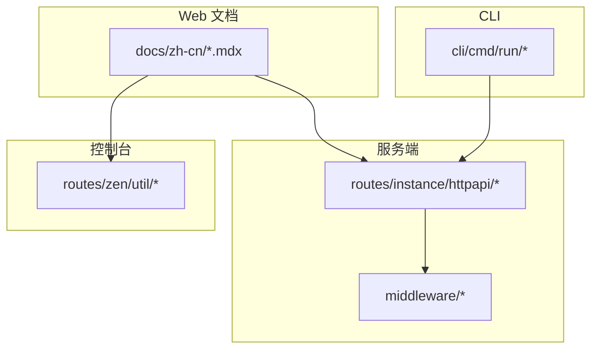
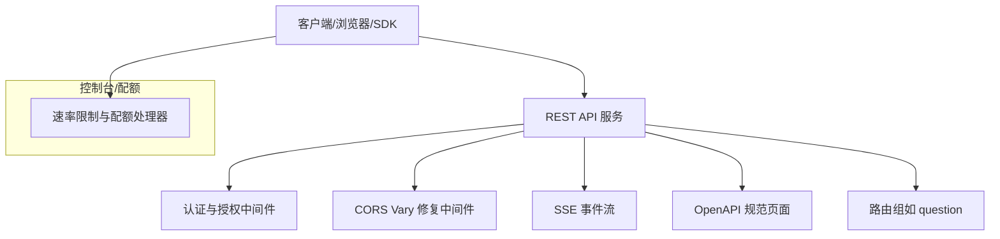
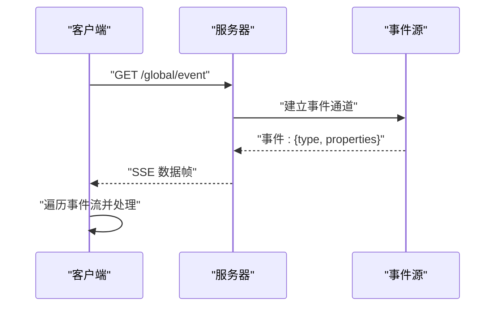
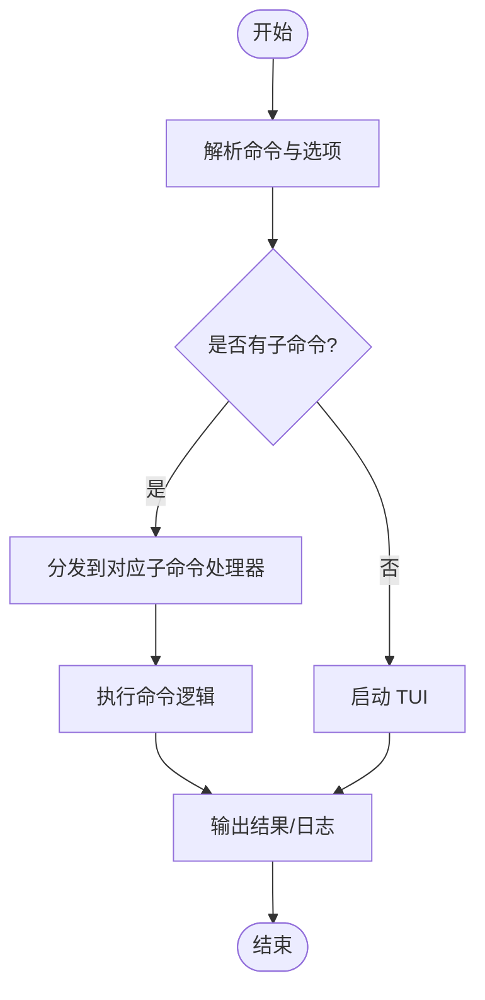
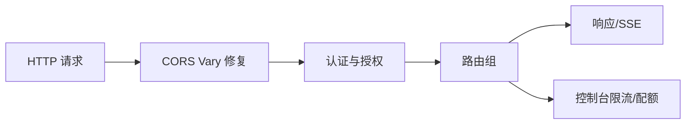

# API 参考

<cite>
**本文引用的文件**
- [question.ts](file://packages/opencode/src/server/routes/instance/httpapi/groups/question.ts)
- [authorization.ts](file://packages/opencode/src/server/routes/instance/httpapi/middleware/authorization.ts)
- [cors-vary.ts](file://packages/opencode/src/server/routes/instance/httpapi/middleware/cors-vary.ts)
- [server.mdx（中文）](file://packages/web/src/content/docs/zh-cn/server.mdx)
- [cli.mdx（中文）](file://packages/web/src/content/docs/zh-cn/cli.mdx)
- [sdk.mdx（中文）](file://packages/web/src/content/docs/zh-cn/sdk.mdx)
- [plugins.mdx（阿拉伯语）](file://packages/web/src/content/docs/ar/plugins.mdx)
- [keyRateLimiter.ts](file://packages/console/app/src/routes/zen/util/keyRateLimiter.ts)
- [ipRateLimiter.ts](file://packages/console/app/src/routes/zen/util/ipRateLimiter.ts)
- [handler.ts](file://packages/console/app/src/routes/zen/util/handler.ts)
- [help-snapshots.test.ts.snap](file://packages/opencode/test/cli/help/__snapshots__/help-snapshots.test.ts.snap)
- [runtime.stdin.ts](file://packages/opencode/src/cli/cmd/run/runtime.stdin.ts)
</cite>

## 目录
1. 引言
2. 项目结构
3. 核心组件
4. 架构总览
5. 详细组件分析
6. 依赖关系分析
7. 性能考量
8. 故障排查指南
9. 结论
10. 附录

## 引言
本文件为 OpenCode 的完整 API 参考，覆盖以下方面：
- REST API：HTTP 方法、URL 模式、请求/响应模式、认证与授权、OpenAPI 规范入口
- WebSocket/事件流：SSE 实时事件订阅与消费
- CLI 命令接口：命令、选项、参数、输出格式与错误码
- 插件 API：事件系统、回调约定、数据交换格式
- 版本管理与向后兼容：版本号、变更策略与迁移建议
- 安全、速率限制与性能优化最佳实践
- 测试与调试工具及方法
- 具体调用示例与客户端实现指引

## 项目结构
OpenCode 采用多包（monorepo）组织，核心 API 相关模块分布如下：
- 服务端路由与中间件：位于 packages/opencode/src/server
- 文档与规范：位于 packages/web/src/content/docs/*
- 控制台与配额/限流：位于 packages/console/app/src/routes/zen
- CLI 与运行时输入：位于 packages/opencode/src/cli

图示来源
- [question.ts:60-74](file://packages/opencode/src/server/routes/instance/httpapi/groups/question.ts#L60-L74)
- [authorization.ts:74-110](file://packages/opencode/src/server/routes/instance/httpapi/middleware/authorization.ts#L74-L110)
- [server.mdx（中文）:40-82](file://packages/web/src/content/docs/zh-cn/server.mdx#L40-L82)
- [cli.mdx（中文）:1-36](file://packages/web/src/content/docs/zh-cn/cli.mdx#L1-L36)

章节来源
- [server.mdx（中文）:40-82](file://packages/web/src/content/docs/zh-cn/server.mdx#L40-L82)
- [question.ts:60-74](file://packages/opencode/src/server/routes/instance/httpapi/groups/question.ts#L60-L74)

## 核心组件
- REST API 服务：基于 Effect Http API，提供全局健康检查、事件流、实例相关路由等
- 认证与授权中间件：支持查询参数令牌与 Basic 认证头，可按配置启用强制鉴权
- CORS Vary 修复：动态 Origin 下的预检缓存问题修复
- SSE 事件流：全局事件流与服务器端事件
- OpenAPI 规范：服务端公开 OpenAPI 3.1 规范页面，便于自动生成 SDK 与类型校验
- CLI：默认启动 TUI；支持 run、serve、mcp 等子命令与选项
- 插件事件系统：涵盖命令、文件、安装、LSP、消息、权限、服务器、会话、Todo、Shell、工具、TUI 等事件
- 速率限制：基于 Redis 的密钥级与 IP 日限额、订阅计划配额分析与滚动窗口限制

章节来源
- [authorization.ts:74-110](file://packages/opencode/src/server/routes/instance/httpapi/middleware/authorization.ts#L74-L110)
- [cors-vary.ts:1-29](file://packages/opencode/src/server/routes/instance/httpapi/middleware/cors-vary.ts#L1-L29)
- [server.mdx（中文）:69-82](file://packages/web/src/content/docs/zh-cn/server.mdx#L69-L82)
- [sdk.mdx（中文）:442-463](file://packages/web/src/content/docs/zh-cn/sdk.mdx#L442-L463)
- [plugins.mdx（阿拉伯语）:134-210](file://packages/web/src/content/docs/ar/plugins.mdx#L134-L210)
- [keyRateLimiter.ts:1-37](file://packages/console/app/src/routes/zen/util/keyRateLimiter.ts#L1-L37)
- [ipRateLimiter.ts:1-61](file://packages/console/app/src/routes/zen/util/ipRateLimiter.ts#L1-L61)
- [handler.ts:743-914](file://packages/console/app/src/routes/zen/util/handler.ts#L743-L914)

## 架构总览
下图展示 OpenCode 的 API 层、中间件与事件流的整体交互。

图示来源
- [authorization.ts:74-110](file://packages/opencode/src/server/routes/instance/httpapi/middleware/authorization.ts#L74-L110)
- [cors-vary.ts:1-29](file://packages/opencode/src/server/routes/instance/httpapi/middleware/cors-vary.ts#L1-L29)
- [question.ts:60-74](file://packages/opencode/src/server/routes/instance/httpapi/groups/question.ts#L60-L74)
- [server.mdx（中文）:69-82](file://packages/web/src/content/docs/zh-cn/server.mdx#L69-L82)

## 详细组件分析

### REST API 接口规范
- OpenAPI 规范入口
  - 服务端公开 OpenAPI 3.1 规范页面，可通过 /doc 访问，便于生成 SDK 与类型校验
- 全局端点
  - GET /global/health：返回服务器健康状态与版本
  - GET /global/event：SSE 事件流，用于全局事件推送
- 其他端点
  - 服务端文档中列出“项目”等路由类别，具体路由需结合 OpenAPI 规范与源码路由定义
- 认证与授权
  - 支持查询参数令牌与 Authorization 头（Basic）
  - 可按配置启用强制鉴权，未授权时返回相应状态码与 WWW-Authenticate 头
- CORS
  - 动态 Origin 场景下修复 Vary 头缺失导致的预检缓存问题

章节来源
- [server.mdx（中文）:69-82](file://packages/web/src/content/docs/zh-cn/server.mdx#L69-L82)
- [authorization.ts:74-110](file://packages/opencode/src/server/routes/instance/httpapi/middleware/authorization.ts#L74-L110)
- [cors-vary.ts:1-29](file://packages/opencode/src/server/routes/instance/httpapi/middleware/cors-vary.ts#L1-L29)

### WebSocket/事件流（SSE）
- 事件订阅
  - SDK 提供 event.subscribe() 订阅服务器事件流
  - 事件流为异步迭代器，逐条推送事件对象（含类型与属性）
- 事件类型
  - 包括但不限于：server.connected、command.executed、file.*、lsp.*、message.*、permission.*、session.*、todo.*、shell.env、tool.execute.*、tui.*

图示来源
- [server.mdx（中文）:276-284](file://packages/web/src/content/docs/zh-cn/server.mdx#L276-L284)
- [sdk.mdx（中文）:442-463](file://packages/web/src/content/docs/zh-cn/sdk.mdx#L442-L463)

章节来源
- [server.mdx（中文）:276-284](file://packages/web/src/content/docs/zh-cn/server.mdx#L276-L284)
- [sdk.mdx（中文）:442-463](file://packages/web/src/content/docs/zh-cn/sdk.mdx#L442-L463)

### CLI 命令接口
- 默认行为
  - 无参数运行 opencode 启动 TUI
- 子命令与示例
  - tui：启动终端用户界面
  - run：执行一次性任务或附加到已运行的服务
  - serve：启动独立服务器
  - mcp list：列举 MCP 服务器及其状态
- 通用选项
  - --help/-h、--version/-v、--print-logs、--log-level、--pure、--format 等
- 交互式输入
  - 在非 TTY 环境下需要控制终端以进行交互式输入

图示来源
- [cli.mdx（中文）:1-36](file://packages/web/src/content/docs/zh-cn/cli.mdx#L1-L36)
- [help-snapshots.test.ts.snap:404-426](file://packages/opencode/test/cli/help/__snapshots__/help-snapshots.test.ts.snap#L404-L426)
- [runtime.stdin.ts:1-37](file://packages/opencode/src/cli/cmd/run/runtime.stdin.ts#L1-L37)

章节来源
- [cli.mdx（中文）:1-36](file://packages/web/src/content/docs/zh-cn/cli.mdx#L1-L36)
- [help-snapshots.test.ts.snap:404-426](file://packages/opencode/test/cli/help/__snapshots__/help-snapshots.test.ts.snap#L404-L426)
- [runtime.stdin.ts:1-37](file://packages/opencode/src/cli/cmd/run/runtime.stdin.ts#L1-L37)

### 插件 API
- 事件系统
  - 插件可订阅多种事件，如命令执行、文件编辑、LSP 更新、消息变更、权限请求、服务器连接、会话状态变化、Todo 更新、Shell 环境、工具执行前后、TUI 交互等
- 回调与钩子
  - 插件导出类型安全的插件对象，内部实现类型安全的钩子
- 数据交换
  - 事件对象包含类型与属性字段，插件据此扩展能力

章节来源
- [plugins.mdx（阿拉伯语）:134-210](file://packages/web/src/content/docs/ar/plugins.mdx#L134-L210)

### API 版本管理与向后兼容
- 版本标识
  - 服务端注解中包含版本号（示例：0.0.1），用于区分 API 表面版本
- OpenAPI 规范
  - 通过 /doc 提供 OpenAPI 3.1 规范，作为契约与演进依据
- 建议
  - 以 OpenAPI 为准进行客户端生成与集成
  - 对于破坏性变更，应在新版本中提供迁移指引与兼容层

章节来源
- [question.ts:68-74](file://packages/opencode/src/server/routes/instance/httpapi/groups/question.ts#L68-L74)
- [server.mdx（中文）:69-82](file://packages/web/src/content/docs/zh-cn/server.mdx#L69-L82)

## 依赖关系分析
- 中间件链路
  - 请求进入后先经 CORS Vary 修复，再进入认证与授权中间件，最后到达路由组
- 事件与路由
  - SSE 事件流与路由组相互独立但共享同一服务端基础设施
- 速率限制与路由
  - 控制台侧的速率限制与配额分析在特定路由中执行，影响请求是否放行

图示来源
- [cors-vary.ts:1-29](file://packages/opencode/src/server/routes/instance/httpapi/middleware/cors-vary.ts#L1-L29)
- [authorization.ts:74-110](file://packages/opencode/src/server/routes/instance/httpapi/middleware/authorization.ts#L74-L110)
- [handler.ts:743-914](file://packages/console/app/src/routes/zen/util/handler.ts#L743-L914)

章节来源
- [cors-vary.ts:1-29](file://packages/opencode/src/server/routes/instance/httpapi/middleware/cors-vary.ts#L1-L29)
- [authorization.ts:74-110](file://packages/opencode/src/server/routes/instance/httpapi/middleware/authorization.ts#L74-L110)
- [handler.ts:743-914](file://packages/console/app/src/routes/zen/util/handler.ts#L743-L914)

## 性能考量
- SSE 事件流
  - 使用服务器端事件推送，避免轮询开销；注意客户端断线重连与背压处理
- 认证与中间件
  - 避免不必要的鉴权计算；对静态资源启用缓存与合适的 CORS 策略
- 速率限制
  - 基于 Redis 的计数与过期策略，合理设置时间窗口与上限，降低数据库压力
- OpenAPI 与 SDK
  - 使用规范生成强类型客户端，减少运行时错误与序列化成本

## 故障排查指南
- 认证失败
  - 确认查询参数令牌或 Authorization 头格式正确；检查服务端是否启用了强制鉴权
- CORS 预检失败
  - 确保动态 Origin 下 Vary: Origin 正确设置
- SSE 无法接收事件
  - 检查 /global/event 是否可达；确认客户端正确处理事件流
- CLI 交互异常
  - 在非 TTY 环境下使用交互式输入需具备控制终端；必要时显式指定日志级别与输出格式
- 速率限制触发
  - 检查密钥级与 IP 日限额、订阅计划配额与滚动窗口限制；根据错误提示调整请求频率或升级方案

章节来源
- [authorization.ts:74-110](file://packages/opencode/src/server/routes/instance/httpapi/middleware/authorization.ts#L74-L110)
- [cors-vary.ts:1-29](file://packages/opencode/src/server/routes/instance/httpapi/middleware/cors-vary.ts#L1-L29)
- [server.mdx（中文）:276-284](file://packages/web/src/content/docs/zh-cn/server.mdx#L276-L284)
- [runtime.stdin.ts:1-37](file://packages/opencode/src/cli/cmd/run/runtime.stdin.ts#L1-L37)
- [keyRateLimiter.ts:1-37](file://packages/console/app/src/routes/zen/util/keyRateLimiter.ts#L1-L37)
- [ipRateLimiter.ts:1-61](file://packages/console/app/src/routes/zen/util/ipRateLimiter.ts#L1-L61)
- [handler.ts:743-914](file://packages/console/app/src/routes/zen/util/handler.ts#L743-L914)

## 结论
OpenCode 的 API 体系以 Effect Http API 为核心，辅以 OpenAPI 规范、SSE 事件流、插件事件系统与完善的中间件栈。通过明确的认证授权、CORS 修复与速率限制机制，保障了安全性与稳定性。建议以 OpenAPI 为契约，结合 SDK 与事件流进行高效集成，并遵循速率限制与安全最佳实践。

## 附录
- 快速参考
  - OpenAPI 规范：/doc
  - 健康检查：/global/health
  - 全局事件：/global/event
  - CLI：opencode、opencode run、opencode serve、opencode mcp list
  - 插件事件：command.executed、file.*、lsp.*、message.*、permission.*、session.*、todo.*、shell.env、tool.execute.*、tui.*