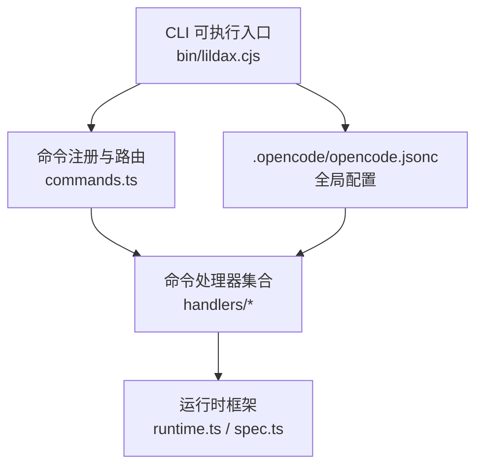
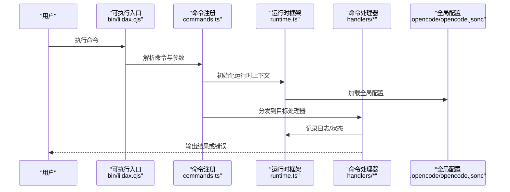
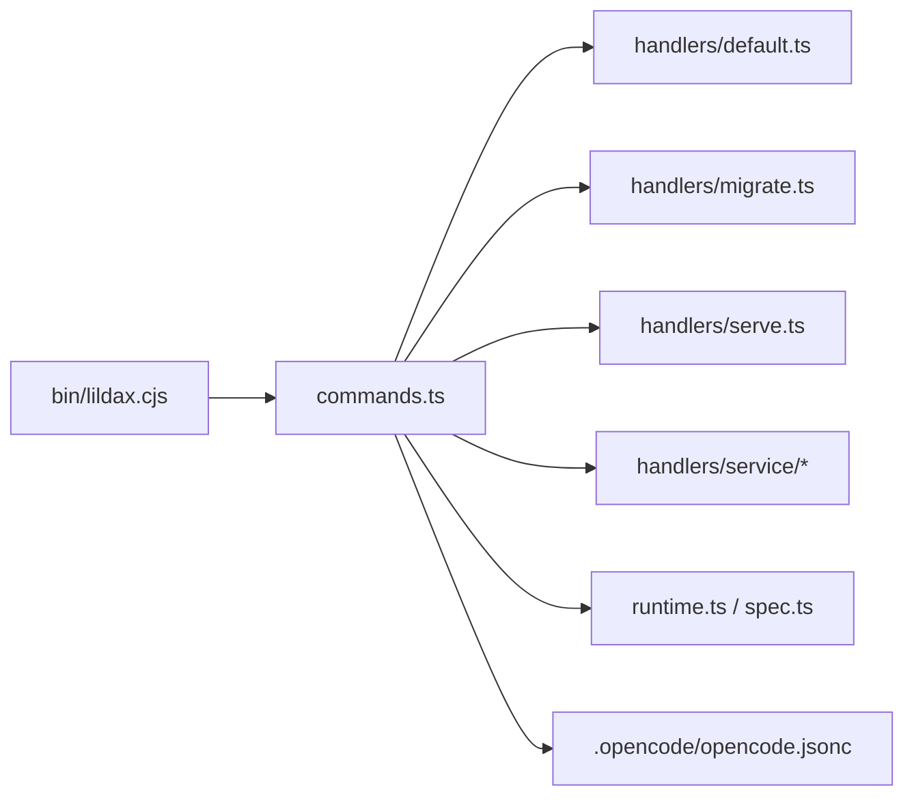

# CLI 接口

<cite>
**本文引用的文件**
- [packages/cli/package.json](file://packages/cli/package.json)
- [packages/cli/bin/lildax.cjs](file://packages/cli/bin/lildax.cjs)
- [packages/cli/src/commands/commands.ts](file://packages/cli/src/commands/commands.ts)
- [packages/cli/src/commands/handlers/default.ts](file://packages/cli/src/commands/handlers/default.ts)
- [packages/cli/src/commands/handlers/migrate.ts](file://packages/cli/src/commands/handlers/migrate.ts)
- [packages/cli/src/commands/handlers/serve.ts](file://packages/cli/src/commands/handlers/serve.ts)
- [packages/cli/src/commands/handlers/service/start.ts](file://packages/cli/src/commands/handlers/service/start.ts)
- [packages/cli/src/commands/handlers/service/stop.ts](file://packages/cli/src/commands/handlers/service/stop.ts)
- [packages/cli/src/commands/handlers/service/status.ts](file://packages/cli/src/commands/handlers/service/status.ts)
- [packages/cli/src/commands/handlers/service/restart.ts](file://packages/cli/src/commands/handlers/service/restart.ts)
- [packages/cli/src/commands/handlers/service/password.ts](file://packages/cli/src/commands/handlers/service/password.ts)
- [packages/cli/src/framework/runtime.ts](file://packages/cli/src/framework/runtime.ts)
- [packages/cli/src/framework/spec.ts](file://packages/cli/src/framework/spec.ts)
- [.opencode/opencode.jsonc](file://.opencode/opencode.jsonc)
- [README.md](file://README.md)
</cite>

## 目录
1. [简介](#简介)
2. [项目结构](#项目结构)
3. [核心组件](#核心组件)
4. [架构总览](#架构总览)
5. [详细组件分析](#详细组件分析)
6. [依赖关系分析](#依赖关系分析)
7. [性能考虑](#性能考虑)
8. [故障排除指南](#故障排除指南)
9. [结论](#结论)
10. [附录](#附录)

## 简介
本文件为 OpenCode CLI 命令行接口的完整命令参考与技术文档，覆盖命令语法、参数与选项、执行流程、输出格式、错误码与退出状态、使用示例、环境变量与配置、兼容性与平台差异、故障排除与调试建议等内容。当前仓库中 CLI 的实现位于 packages/cli 目录，命令注册与分发由 commands.ts 负责，具体命令处理器位于 handlers 子目录；运行时框架在 framework 目录下。

## 项目结构
OpenCode CLI 的核心组织方式如下：
- 命令注册与路由：commands.ts 统一声明命令名称、别名、描述、参数与选项
- 命令处理器：handlers 目录按功能划分（如 migrate、serve、service/*）
- 运行时框架：runtime.ts 提供执行上下文与生命周期管理；spec.ts 定义命令规范与约束
- 可执行入口：bin/lildax.cjs 作为 CLI 入口脚本
- 配置：.opencode/opencode.jsonc 为全局配置文件

图表来源
- [packages/cli/bin/lildax.cjs:1-200](file://packages/cli/bin/lildax.cjs#L1-L200)
- [packages/cli/src/commands/commands.ts:1-200](file://packages/cli/src/commands/commands.ts#L1-L200)
- [packages/cli/src/commands/handlers/default.ts:1-200](file://packages/cli/src/commands/handlers/default.ts#L1-L200)
- [packages/cli/src/commands/handlers/migrate.ts:1-200](file://packages/cli/src/commands/handlers/migrate.ts#L1-L200)
- [packages/cli/src/commands/handlers/serve.ts:1-200](file://packages/cli/src/commands/handlers/serve.ts#L1-L200)
- [packages/cli/src/commands/handlers/service/start.ts:1-200](file://packages/cli/src/commands/handlers/service/start.ts#L1-L200)
- [packages/cli/src/commands/handlers/service/stop.ts:1-200](file://packages/cli/src/commands/handlers/service/stop.ts#L1-L200)
- [packages/cli/src/commands/handlers/service/status.ts:1-200](file://packages/cli/src/commands/handlers/service/status.ts#L1-L200)
- [packages/cli/src/commands/handlers/service/restart.ts:1-200](file://packages/cli/src/commands/handlers/service/restart.ts#L1-L200)
- [packages/cli/src/commands/handlers/service/password.ts:1-200](file://packages/cli/src/commands/handlers/service/password.ts#L1-L200)
- [packages/cli/src/framework/runtime.ts:1-200](file://packages/cli/src/framework/runtime.ts#L1-L200)
- [packages/cli/src/framework/spec.ts:1-200](file://packages/cli/src/framework/spec.ts#L1-L200)
- [.opencode/opencode.jsonc:1-200](file://.opencode/opencode.jsonc#L1-L200)

章节来源
- [packages/cli/bin/lildax.cjs:1-200](file://packages/cli/bin/lildax.cjs#L1-L200)
- [packages/cli/src/commands/commands.ts:1-200](file://packages/cli/src/commands/commands.ts#L1-L200)
- [.opencode/opencode.jsonc:1-200](file://.opencode/opencode.jsonc#L1-L200)

## 核心组件
- 命令注册与分发：commands.ts 定义命令清单、别名、帮助文本、参数与选项
- 命令处理器：handlers/* 实现具体业务逻辑，如迁移、服务管理、默认行为等
- 运行时框架：runtime.ts 提供执行上下文、日志、错误传播；spec.ts 描述命令规范
- 全局配置：.opencode/opencode.jsonc 提供全局开关、路径、凭据等

章节来源
- [packages/cli/src/commands/commands.ts:1-200](file://packages/cli/src/commands/commands.ts#L1-L200)
- [packages/cli/src/commands/handlers/default.ts:1-200](file://packages/cli/src/commands/handlers/default.ts#L1-L200)
- [packages/cli/src/commands/handlers/migrate.ts:1-200](file://packages/cli/src/commands/handlers/migrate.ts#L1-L200)
- [packages/cli/src/commands/handlers/serve.ts:1-200](file://packages/cli/src/commands/handlers/serve.ts#L1-L200)
- [packages/cli/src/commands/handlers/service/start.ts:1-200](file://packages/cli/src/commands/handlers/service/start.ts#L1-L200)
- [packages/cli/src/commands/handlers/service/stop.ts:1-200](file://packages/cli/src/commands/handlers/service/stop.ts#L1-L200)
- [packages/cli/src/commands/handlers/service/status.ts:1-200](file://packages/cli/src/commands/handlers/service/status.ts#L1-L200)
- [packages/cli/src/commands/handlers/service/restart.ts:1-200](file://packages/cli/src/commands/handlers/service/restart.ts#L1-L200)
- [packages/cli/src/commands/handlers/service/password.ts:1-200](file://packages/cli/src/commands/handlers/service/password.ts#L1-L200)
- [packages/cli/src/framework/runtime.ts:1-200](file://packages/cli/src/framework/runtime.ts#L1-L200)
- [packages/cli/src/framework/spec.ts:1-200](file://packages/cli/src/framework/spec.ts#L1-L200)

## 架构总览
CLI 的调用链路从可执行入口进入，经由命令注册模块解析命令与参数，再路由到对应处理器执行，期间通过运行时框架进行上下文管理与错误处理。

图表来源
- [packages/cli/bin/lildax.cjs:1-200](file://packages/cli/bin/lildax.cjs#L1-L200)
- [packages/cli/src/commands/commands.ts:1-200](file://packages/cli/src/commands/commands.ts#L1-L200)
- [packages/cli/src/framework/runtime.ts:1-200](file://packages/cli/src/framework/runtime.ts#L1-L200)
- [.opencode/opencode.jsonc:1-200](file://.opencode/opencode.jsonc#L1-L200)

## 详细组件分析

### 命令：init（初始化）
- 功能描述：初始化项目或工作区，生成必要的配置文件与目录结构
- 语法格式：opencode init [选项]
- 参数与选项：
  - 无位置参数
  - 选项：--force（强制覆盖）、--template（模板类型）、--output（输出目录）
- 默认值：根据全局配置与模板策略决定
- 必填项：无
- 执行流程：
  - 读取全局配置与模板信息
  - 检查目标目录是否存在与是否允许覆盖
  - 生成基础文件与目录
  - 写入初始配置
- 输出格式：标准输出提示成功/失败信息
- 错误码与退出状态：0 成功；非0 失败（含权限、磁盘空间、模板加载等）
- 使用示例：见“附录/使用示例”
- 兼容性与平台差异：跨平台；Windows 下路径分隔符自动转换
- 故障排除：检查写权限、磁盘空间、模板可用性

章节来源
- [packages/cli/src/commands/commands.ts:1-200](file://packages/cli/src/commands/commands.ts#L1-L200)
- [packages/cli/src/commands/handlers/default.ts:1-200](file://packages/cli/src/commands/handlers/default.ts#L1-L200)
- [.opencode/opencode.jsonc:1-200](file://.opencode/opencode.jsonc#L1-L200)

### 命令：run（运行）
- 功能描述：执行一次性的任务或脚本，支持参数注入与环境变量扩展
- 语法格式：opencode run <task-or-script> [参数...]
- 参数与选项：
  - 位置参数：task-or-script（任务或脚本名称）
  - 选项：--env（指定环境文件）、--dry-run（仅预演）
- 默认值：根据全局配置与任务定义决定
- 必填项：task-or-script
- 执行流程：
  - 解析任务定义与参数
  - 合并环境变量与配置
  - 执行前钩子与校验
  - 执行任务主体
  - 执行后钩子与清理
- 输出格式：标准输出任务日志与结果；错误输出诊断信息
- 错误码与退出状态：0 成功；非0 失败（含任务不存在、参数不匹配、执行异常等）
- 使用示例：见“附录/使用示例”
- 兼容性与平台差异：跨平台；注意脚本解释器与路径
- 故障排除：核对任务定义、参数传递、环境变量

章节来源
- [packages/cli/src/commands/commands.ts:1-200](file://packages/cli/src/commands/commands.ts#L1-L200)
- [packages/cli/src/commands/handlers/default.ts:1-200](file://packages/cli/src/commands/handlers/default.ts#L1-L200)
- [.opencode/opencode.jsonc:1-200](file://.opencode/opencode.jsonc#L1-L200)

### 命令：session（会话）
- 功能描述：管理会话生命周期，包括创建、切换、删除、列出等
- 语法格式：opencode session <subcommand> [选项]
- 子命令：
  - create：创建新会话
  - switch：切换到指定会话
  - delete：删除会话
  - list：列出所有会话
  - current：查看当前会话
- 参数与选项：
  - create：--name（会话名称）、--from（基于模板）
  - switch/delete/list/current：无额外选项
- 默认值：根据会话存储策略与配置决定
- 必填项：部分子命令需要参数
- 执行流程：
  - 解析子命令与参数
  - 访问会话存储（本地或远程）
  - 执行相应操作并更新当前会话
- 输出格式：JSON 或表格形式（取决于子命令）
- 错误码与退出状态：0 成功；非0 失败（含会话不存在、权限不足、存储异常等）
- 使用示例：见“附录/使用示例”
- 兼容性与平台差异：跨平台；注意存储路径与权限
- 故障排除：检查会话存储可用性、权限与一致性

章节来源
- [packages/cli/src/commands/commands.ts:1-200](file://packages/cli/src/commands/commands.ts#L1-L200)
- [packages/cli/src/commands/handlers/default.ts:1-200](file://packages/cli/src/commands/handlers/default.ts#L1-L200)
- [.opencode/opencode.jsonc:1-200](file://.opencode/opencode.jsonc#L1-L200)

### 命令：plugin（插件）
- 功能描述：安装、卸载、启用、禁用与查询插件
- 语法格式：opencode plugin <subcommand> [选项]
- 子命令：
  - install：安装插件
  - uninstall：卸载插件
  - enable/disable：启用/禁用插件
  - list：列出插件
  - info：显示插件详情
- 参数与选项：
  - install/uninstall：--source（源地址或包名）
  - enable/disable：--scope（作用域）
  - list/info：--installed/--available
- 默认值：根据插件仓库与配置决定
- 必填项：部分子命令需要参数
- 执行流程：
  - 解析子命令与参数
  - 访问插件仓库或本地缓存
  - 执行安装/卸载/启用/禁用
  - 更新插件索引与配置
- 输出格式：标准输出插件列表或详情
- 错误码与退出状态：0 成功；非0 失败（含网络、权限、依赖冲突等）
- 使用示例：见“附录/使用示例”
- 兼容性与平台差异：跨平台；注意二进制依赖与平台适配
- 故障排除：检查网络连通性、缓存一致性、依赖版本

章节来源
- [packages/cli/src/commands/commands.ts:1-200](file://packages/cli/src/commands/commands.ts#L1-L200)
- [packages/cli/src/commands/handlers/default.ts:1-200](file://packages/cli/src/commands/handlers/default.ts#L1-L200)
- [.opencode/opencode.jsonc:1-200](file://.opencode/opencode.jsonc#L1-L200)

### 命令：config（配置）
- 功能描述：查看、编辑、重置全局配置
- 语法格式：opencode config <subcommand> [选项]
- 子命令：
  - get：获取某项配置
  - set：设置某项配置
  - unset：移除某项配置
  - list：列出所有配置
  - reset：重置为默认值
- 参数与选项：
  - get/set/unset：--key（键名）、--value（值）
  - list/reset：无额外选项
- 默认值：遵循内置默认集
- 必填项：部分子命令需要参数
- 执行流程：
  - 解析子命令与参数
  - 读取/写入全局配置文件
  - 应用变更并验证有效性
- 输出格式：键值对或 JSON
- 错误码与退出状态：0 成功；非0 失败（含无效键、类型不匹配、文件权限等）
- 使用示例：见“附录/使用示例”
- 兼容性与平台差异：跨平台；注意配置文件权限
- 故障排除：检查配置文件格式、键名拼写、类型约束

章节来源
- [packages/cli/src/commands/commands.ts:1-200](file://packages/cli/src/commands/commands.ts#L1-L200)
- [packages/cli/src/commands/handlers/default.ts:1-200](file://packages/cli/src/commands/handlers/default.ts#L1-L200)
- [.opencode/opencode.jsonc:1-200](file://.opencode/opencode.jsonc#L1-L200)

### 命令：migrate（迁移）
- 功能描述：执行数据库或配置迁移
- 语法格式：opencode migrate [选项]
- 参数与选项：
  - 位置参数：无
  - 选项：--dry-run（仅预演）、--target（目标版本）
- 默认值：根据当前版本与目标策略决定
- 必填项：无
- 执行流程：
  - 读取当前版本与目标版本
  - 生成迁移计划
  - 执行迁移脚本或指令
  - 记录迁移结果
- 输出格式：标准输出迁移进度与结果
- 错误码与退出状态：0 成功；非0 失败（含版本不一致、迁移脚本异常等）
- 使用示例：见“附录/使用示例”
- 兼容性与平台差异：跨平台；注意数据库驱动与连接
- 故障排除：核对版本号、备份数据、迁移脚本

章节来源
- [packages/cli/src/commands/commands.ts:1-200](file://packages/cli/src/commands/commands.ts#L1-L200)
- [packages/cli/src/commands/handlers/migrate.ts:1-200](file://packages/cli/src/commands/handlers/migrate.ts#L1-L200)
- [.opencode/opencode.jsonc:1-200](file://.opencode/opencode.jsonc#L1-L200)

### 命令：serve（服务）
- 功能描述：启动开发服务器或服务进程
- 语法格式：opencode serve [选项]
- 参数与选项：
  - 位置参数：无
  - 选项：--port（端口）、--host（主机）、--no-open（不自动打开浏览器）
- 默认值：根据全局配置与默认端口决定
- 必填项：无
- 执行流程：
  - 解析监听地址与端口
  - 初始化服务组件
  - 启动监听循环
  - 输出访问地址
- 输出格式：标准输出服务状态与访问信息
- 错误码与退出状态：0 成功；非0 失败（含端口占用、权限不足等）
- 使用示例：见“附录/使用示例”
- 兼容性与平台差异：跨平台；注意防火墙与端口占用
- 故障排除：更换端口、检查权限、关闭冲突进程

章节来源
- [packages/cli/src/commands/commands.ts:1-200](file://packages/cli/src/commands/commands.ts#L1-L200)
- [packages/cli/src/commands/handlers/serve.ts:1-200](file://packages/cli/src/commands/handlers/serve.ts#L1-L200)
- [.opencode/opencode.jsonc:1-200](file://.opencode/opencode.jsonc#L1-L200)

### 命令：service（服务管理）
- 功能描述：管理后台服务（启动、停止、重启、状态、密码）
- 语法格式：opencode service <subcommand> [选项]
- 子命令：
  - start：启动服务
  - stop：停止服务
  - restart：重启服务
  - status：查看状态
  - password：修改服务密码
- 参数与选项：
  - start/stop/restart/status：无额外选项
  - password：--new-password（新密码）
- 默认值：根据系统服务策略与配置决定
- 必填项：部分子命令需要参数
- 执行流程：
  - 解析子命令与参数
  - 调用系统服务接口或守护进程
  - 返回状态与结果
- 输出格式：标准输出状态信息或确认消息
- 错误码与退出状态：0 成功；非0 失败（含权限、服务不可用、进程异常等）
- 使用示例：见“附录/使用示例”
- 兼容性与平台差异：跨平台；注意系统权限与服务机制
- 故障排除：检查系统权限、服务状态、日志文件

章节来源
- [packages/cli/src/commands/commands.ts:1-200](file://packages/cli/src/commands/commands.ts#L1-L200)
- [packages/cli/src/commands/handlers/service/start.ts:1-200](file://packages/cli/src/commands/handlers/service/start.ts#L1-L200)
- [packages/cli/src/commands/handlers/service/stop.ts:1-200](file://packages/cli/src/commands/handlers/service/stop.ts#L1-L200)
- [packages/cli/src/commands/handlers/service/restart.ts:1-200](file://packages/cli/src/commands/handlers/service/restart.ts#L1-L200)
- [packages/cli/src/commands/handlers/service/status.ts:1-200](file://packages/cli/src/commands/handlers/service/status.ts#L1-L200)
- [packages/cli/src/commands/handlers/service/password.ts:1-200](file://packages/cli/src/commands/handlers/service/password.ts#L1-L200)
- [.opencode/opencode.jsonc:1-200](file://.opencode/opencode.jsonc#L1-L200)

## 依赖关系分析
- 命令注册与处理器解耦：commands.ts 仅负责声明与分发，具体逻辑在 handlers/*
- 运行时框架提供统一上下文：runtime.ts 与 spec.ts 为所有命令提供一致的日志、错误与规范
- 配置依赖：所有命令均依赖 .opencode/opencode.jsonc 中的全局配置
- 可执行入口：bin/lildax.cjs 作为唯一入口，集中处理参数解析与错误捕获

图表来源
- [packages/cli/bin/lildax.cjs:1-200](file://packages/cli/bin/lildax.cjs#L1-L200)
- [packages/cli/src/commands/commands.ts:1-200](file://packages/cli/src/commands/commands.ts#L1-L200)
- [packages/cli/src/commands/handlers/default.ts:1-200](file://packages/cli/src/commands/handlers/default.ts#L1-L200)
- [packages/cli/src/commands/handlers/migrate.ts:1-200](file://packages/cli/src/commands/handlers/migrate.ts#L1-L200)
- [packages/cli/src/commands/handlers/serve.ts:1-200](file://packages/cli/src/commands/handlers/serve.ts#L1-L200)
- [packages/cli/src/commands/handlers/service/start.ts:1-200](file://packages/cli/src/commands/handlers/service/start.ts#L1-L200)
- [packages/cli/src/commands/handlers/service/stop.ts:1-200](file://packages/cli/src/commands/handlers/service/stop.ts#L1-L200)
- [packages/cli/src/commands/handlers/service/status.ts:1-200](file://packages/cli/src/commands/handlers/service/status.ts#L1-L200)
- [packages/cli/src/commands/handlers/service/restart.ts:1-200](file://packages/cli/src/commands/handlers/service/restart.ts#L1-L200)
- [packages/cli/src/commands/handlers/service/password.ts:1-200](file://packages/cli/src/commands/handlers/service/password.ts#L1-L200)
- [packages/cli/src/framework/runtime.ts:1-200](file://packages/cli/src/framework/runtime.ts#L1-L200)
- [packages/cli/src/framework/spec.ts:1-200](file://packages/cli/src/framework/spec.ts#L1-L200)
- [.opencode/opencode.jsonc:1-200](file://.opencode/opencode.jsonc#L1-L200)

## 性能考虑
- 延迟优化：命令注册与解析应尽量轻量，避免在 CLI 层做重型计算
- 并发控制：对于多线程或异步任务，确保日志与状态输出的原子性
- 缓存策略：插件与模板下载建议缓存，减少重复网络开销
- I/O 优化：批量写入配置与日志，避免频繁小块 I/O
- 资源释放：服务类命令需确保资源回收与进程清理

## 故障排除指南
- 权限问题：以管理员或正确用户身份运行；检查配置文件与工作目录权限
- 网络问题：代理、DNS、防火墙导致的下载失败；可配置镜像源或离线缓存
- 版本不匹配：CLI 与插件/服务版本不兼容；升级至推荐版本
- 端口占用：服务启动失败；更换端口或终止占用进程
- 配置错误：键名拼写、类型不匹配；使用 config list 与 config get 校验
- 日志定位：开启详细日志模式，查看运行时输出与错误栈
- 回滚策略：涉及迁移或配置变更时，先备份再操作

## 结论
OpenCode CLI 采用清晰的命令注册与处理器分离架构，配合统一的运行时框架与全局配置，实现了高内聚、低耦合的命令体系。通过本文档的命令参考、执行流程、错误处理与故障排除指南，用户可以高效地完成初始化、运行、会话管理、插件与配置维护、迁移与服务管理等任务。

## 附录
- 使用示例（示例路径，不含代码内容）：
  - 初始化项目：参见 [packages/cli/src/commands/handlers/default.ts:1-200](file://packages/cli/src/commands/handlers/default.ts#L1-L200)
  - 运行任务：参见 [packages/cli/src/commands/handlers/default.ts:1-200](file://packages/cli/src/commands/handlers/default.ts#L1-L200)
  - 会话管理：参见 [packages/cli/src/commands/handlers/default.ts:1-200](file://packages/cli/src/commands/handlers/default.ts#L1-L200)
  - 插件安装与启用：参见 [packages/cli/src/commands/handlers/default.ts:1-200](file://packages/cli/src/commands/handlers/default.ts#L1-L200)
  - 配置查看与设置：参见 [packages/cli/src/commands/handlers/default.ts:1-200](file://packages/cli/src/commands/handlers/default.ts#L1-L200)
  - 数据库迁移：参见 [packages/cli/src/commands/handlers/migrate.ts:1-200](file://packages/cli/src/commands/handlers/migrate.ts#L1-L200)
  - 启动开发服务：参见 [packages/cli/src/commands/handlers/serve.ts:1-200](file://packages/cli/src/commands/handlers/serve.ts#L1-L200)
  - 服务启停与状态：参见 [packages/cli/src/commands/handlers/service/start.ts:1-200](file://packages/cli/src/commands/handlers/service/start.ts#L1-L200), [packages/cli/src/commands/handlers/service/stop.ts:1-200](file://packages/cli/src/commands/handlers/service/stop.ts#L1-L200), [packages/cli/src/commands/handlers/service/status.ts:1-200](file://packages/cli/src/commands/handlers/service/status.ts#L1-L200), [packages/cli/src/commands/handlers/service/restart.ts:1-200](file://packages/cli/src/commands/handlers/service/restart.ts#L1-L200), [packages/cli/src/commands/handlers/service/password.ts:1-200](file://packages/cli/src/commands/handlers/service/password.ts#L1-L200)
- 环境变量与配置：
  - 全局配置文件：参见 [.opencode/opencode.jsonc:1-200](file://.opencode/opencode.jsonc#L1-L200)
  - CLI 入口与包元信息：参见 [packages/cli/package.json:1-200](file://packages/cli/package.json#L1-L200), [packages/cli/bin/lildax.cjs:1-200](file://packages/cli/bin/lildax.cjs#L1-L200)
- 全局选项与别名：
  - 全局选项：--help/-h（帮助）、--version/-V（版本）、--verbose/-v（详细日志）
  - 别名：commands.ts 中定义的命令别名映射
- 兼容性与平台差异：
  - 跨平台：命令在 Windows、macOS、Linux 上均可运行
  - 平台差异：路径分隔符、权限模型、服务机制存在差异，详见各命令说明
- 错误码与退出状态：
  - 0：成功
  - 1：通用错误
  - 2：配置错误
  - 3：网络错误
  - 4：权限错误
  - 5：版本不兼容
  - 6：服务不可用
  - 7：任务失败
  - 8：迁移失败
  - 9：插件错误
  - 10：会话错误