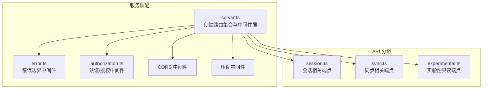
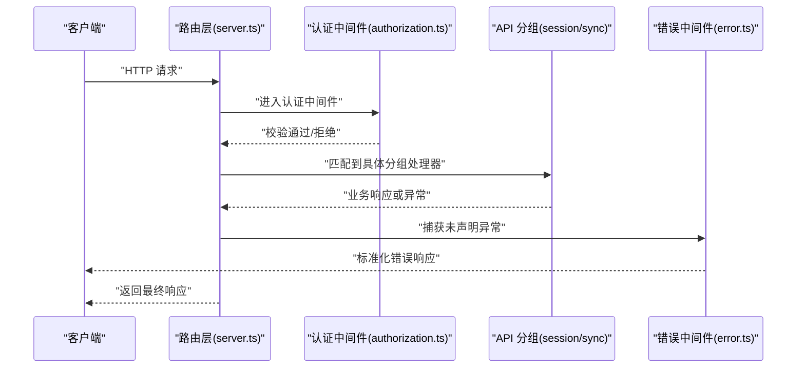
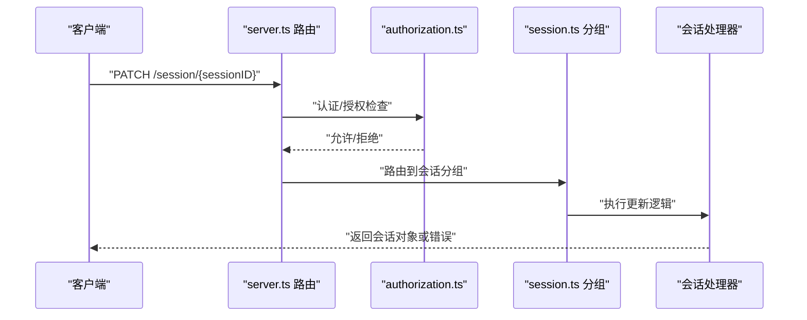
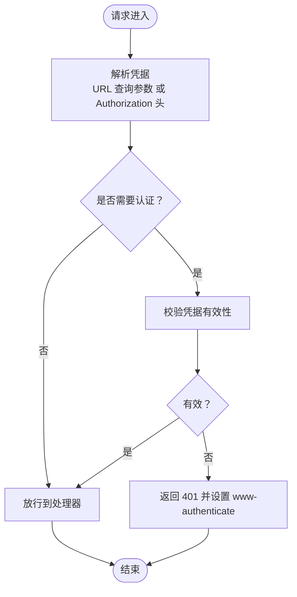
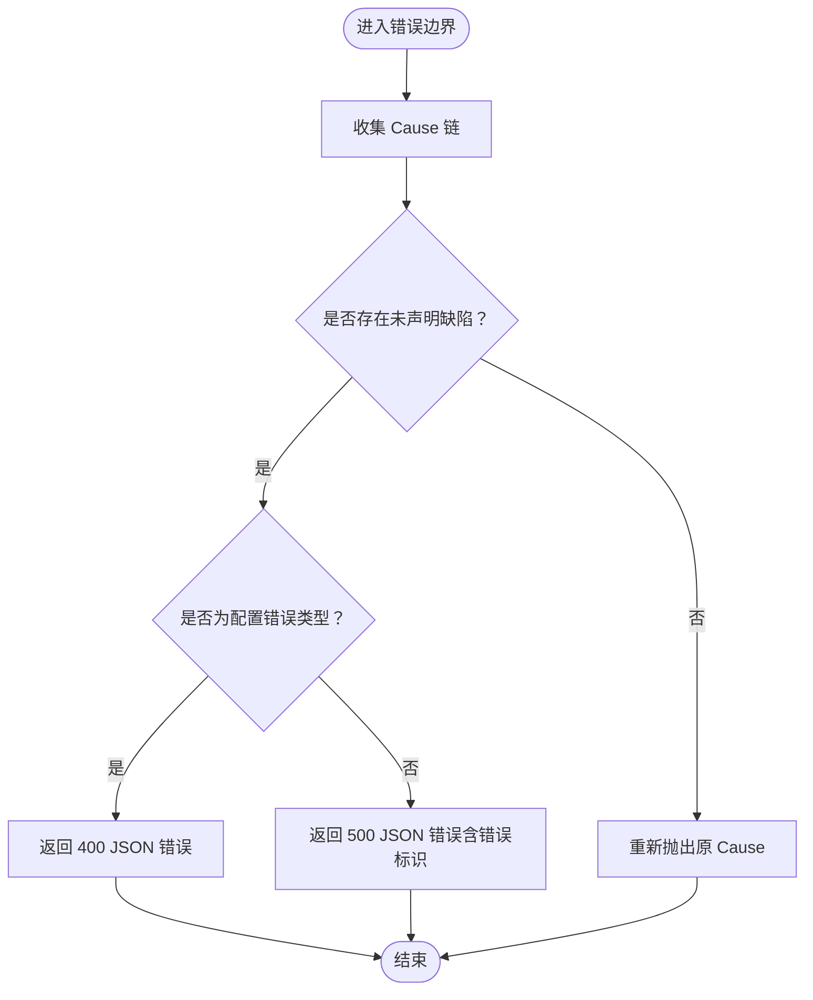
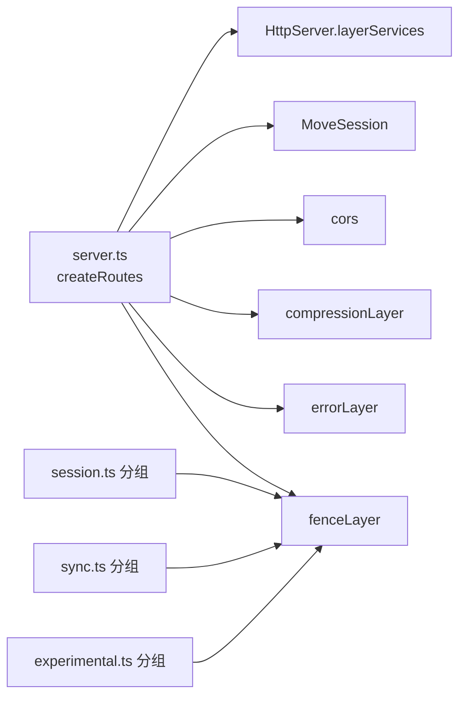

# REST API

<cite>
**本文引用的文件**
- [packages/opencode/src/server/routes/instance/httpapi/AGENTS.md](file://packages/opencode/src/server/routes/instance/httpapi/AGENTS.md)
- [packages/opencode/src/server/routes/instance/httpapi/middleware/authorization.ts](file://packages/opencode/src/server/routes/instance/httpapi/middleware/authorization.ts)
- [packages/opencode/src/server/routes/instance/httpapi/middleware/error.ts](file://packages/opencode/src/server/routes/instance/httpapi/middleware/error.ts)
- [packages/opencode/src/server/routes/instance/httpapi/groups/session.ts](file://packages/opencode/src/server/routes/instance/httpapi/groups/session.ts)
- [packages/opencode/src/server/routes/instance/httpapi/groups/sync.ts](file://packages/opencode/src/server/routes/instance/httpapi/groups/sync.ts)
- [packages/web/src/content/docs/server.mdx](file://packages/web/src/content/docs/server.mdx)
- [packages/sdk/js/src/v2/gen/sdk.gen.ts](file://packages/sdk/js/src/v2/gen/sdk.gen.ts)
- [packages/opencode/src/server/routes/instance/httpapi/server.ts](file://packages/opencode/src/server/routes/instance/httpapi/server.ts)
</cite>

## 目录
1. [简介](#简介)
2. [项目结构](#项目结构)
3. [核心组件](#核心组件)
4. [架构总览](#架构总览)
5. [详细组件分析](#详细组件分析)
6. [依赖关系分析](#依赖关系分析)
7. [性能考量](#性能考量)
8. [故障排查指南](#故障排查指南)
9. [结论](#结论)
10. [附录](#附录)

## 简介
本文件为 OpenCode 的 REST API 接口文档，聚焦于实例级 HTTP API 的端点定义、认证与授权、错误处理、版本控制策略以及客户端 SDK 使用建议。文档基于仓库中已实现的路由与中间件进行归纳总结，并提供面向开发者的可执行参考路径。

## 项目结构
OpenCode 的 HTTP API 主要由“实例级 HttpApi 组”构成，通过分组组织会话、同步、事件等能力域；同时在服务启动时统一装配中间件层（认证、CORS、压缩、可观测等），并通过 OpenAPI 注解生成规范文档。

图表来源
- [packages/opencode/src/server/routes/instance/httpapi/server.ts:261-298](file://packages/opencode/src/server/routes/instance/httpapi/server.ts#L261-L298)
- [packages/opencode/src/server/routes/instance/httpapi/groups/session.ts:443-462](file://packages/opencode/src/server/routes/instance/httpapi/groups/session.ts#L443-L462)
- [packages/opencode/src/server/routes/instance/httpapi/groups/sync.ts:97-113](file://packages/opencode/src/server/routes/instance/httpapi/groups/sync.ts#L97-L113)
- [packages/opencode/src/server/routes/instance/httpapi/middleware/authorization.ts:101-110](file://packages/opencode/src/server/routes/instance/httpapi/middleware/authorization.ts#L101-L110)
- [packages/opencode/src/server/routes/instance/httpapi/middleware/error.ts:1-29](file://packages/opencode/src/server/routes/instance/httpapi/middleware/error.ts#L1-L29)

章节来源
- [packages/opencode/src/server/routes/instance/httpapi/server.ts:261-298](file://packages/opencode/src/server/routes/instance/httpapi/server.ts#L261-L298)
- [packages/opencode/src/server/routes/instance/httpapi/AGENTS.md:1-33](file://packages/opencode/src/server/routes/instance/httpapi/AGENTS.md#L1-L33)

## 核心组件
- 实验性 HttpApi 分组：会话、同步等能力域以 HttpApiBuilder.group 定义，统一注入实例上下文、工作区路由与认证中间件。
- 认证与授权中间件：支持从 URL 查询参数或 Authorization 头解析凭据，按配置决定是否强制认证；对公开 UI 路径放行。
- 错误处理中间件：在路由边界替换未声明的缺陷错误为标准 500 响应，并对特定配置错误类型映射为 4xx。
- 文档与开放接口：提供 OpenAPI 规范页面与事件流端点，便于集成与调试。

章节来源
- [packages/opencode/src/server/routes/instance/httpapi/groups/session.ts:443-462](file://packages/opencode/src/server/routes/instance/httpapi/groups/session.ts#L443-L462)
- [packages/opencode/src/server/routes/instance/httpapi/groups/sync.ts:97-113](file://packages/opencode/src/server/routes/instance/httpapi/groups/sync.ts#L97-L113)
- [packages/opencode/src/server/routes/instance/httpapi/middleware/authorization.ts:74-110](file://packages/opencode/src/server/routes/instance/httpapi/middleware/authorization.ts#L74-L110)
- [packages/opencode/src/server/routes/instance/httpapi/middleware/error.ts:1-29](file://packages/opencode/src/server/routes/instance/httpapi/middleware/error.ts#L1-L29)
- [packages/web/src/content/docs/server.mdx:264-287](file://packages/web/src/content/docs/server.mdx#L264-L287)

## 架构总览
下图展示服务装配、中间件与 API 分组之间的关系，以及认证与错误处理在请求生命周期中的位置。

图表来源
- [packages/opencode/src/server/routes/instance/httpapi/server.ts:261-298](file://packages/opencode/src/server/routes/instance/httpapi/server.ts#L261-L298)
- [packages/opencode/src/server/routes/instance/httpapi/middleware/authorization.ts:101-110](file://packages/opencode/src/server/routes/instance/httpapi/middleware/authorization.ts#L101-L110)
- [packages/opencode/src/server/routes/instance/httpapi/middleware/error.ts:1-29](file://packages/opencode/src/server/routes/instance/httpapi/middleware/error.ts#L1-L29)

## 详细组件分析

### 会话（Session）API
- 分组注解与中间件
  - 分组标题与描述：会话相关端点归类于“session”分组。
  - 中间件链：实例上下文、工作区路由、认证中间件。
- 版本与元数据
  - 实验性 API 元信息：版本号、描述等。
- 客户端调用参考
  - 更新会话：SDK 提供 update 方法，支持路径参数与请求体字段（如标题、元数据、权限规则、时间戳等）。
  - 列表/详情/子会话等：SDK 提供对应方法签名，便于按需调用。

图表来源
- [packages/opencode/src/server/routes/instance/httpapi/groups/session.ts:443-462](file://packages/opencode/src/server/routes/instance/httpapi/groups/session.ts#L443-L462)
- [packages/opencode/src/server/routes/instance/httpapi/middleware/authorization.ts:101-110](file://packages/opencode/src/server/routes/instance/httpapi/middleware/authorization.ts#L101-L110)
- [packages/sdk/js/src/v2/gen/sdk.gen.ts:3490-3543](file://packages/sdk/js/src/v2/gen/sdk.gen.ts#L3490-L3543)

章节来源
- [packages/opencode/src/server/routes/instance/httpapi/groups/session.ts:443-462](file://packages/opencode/src/server/routes/instance/httpapi/groups/session.ts#L443-L462)
- [packages/sdk/js/src/v2/gen/sdk.gen.ts:3490-3543](file://packages/sdk/js/src/v2/gen/sdk.gen.ts#L3490-L3543)

### 同步（Sync）API
- 分组注解与中间件
  - 分组标题与描述：同步相关端点归类于“sync”分组。
  - 中间件链：实例上下文、工作区路由、认证中间件。
- 版本与元数据
  - 实验性 API 元信息：版本号、描述等。

章节来源
- [packages/opencode/src/server/routes/instance/httpapi/groups/sync.ts:97-113](file://packages/opencode/src/server/routes/instance/httpapi/groups/sync.ts#L97-L113)

### 实验性只读 API
- 分组注解与中间件
  - 分组标题与描述：实验性只读端点归类于“experimental”分组。
  - 中间件链：实例上下文、工作区路由、认证中间件。
- 版本与元数据
  - 实验性 API 元信息：版本号、描述等。

章节来源
- [packages/opencode/src/server/routes/instance/httpapi/groups/experimental.ts:247-260](file://packages/opencode/src/server/routes/instance/httpapi/groups/experimental.ts#L247-L260)

### 认证与授权
- 凭据来源
  - URL 查询参数：支持通过查询参数传递令牌。
  - Authorization 头：支持 Basic 方式解析。
  - 默认空凭据：若未提供则视为匿名访问。
- 授权策略
  - 按配置决定是否强制认证；对公开 UI 路径放行。
  - 已授权则继续处理，否则返回 401 并携带 www-authenticate 响应头。
- 中间件装配
  - 在 HttpApi 分组层面声明中间件，装配于服务边界。

图表来源
- [packages/opencode/src/server/routes/instance/httpapi/middleware/authorization.ts:74-110](file://packages/opencode/src/server/routes/instance/httpapi/middleware/authorization.ts#L74-L110)

章节来源
- [packages/opencode/src/server/routes/instance/httpapi/middleware/authorization.ts:74-110](file://packages/opencode/src/server/routes/instance/httpapi/middleware/authorization.ts#L74-L110)

### 错误处理
- 边界职责
  - 将未声明的缺陷错误转换为 500 响应，避免泄漏内部细节。
  - 对特定配置错误类型映射为 400。
- 参考实现
  - 在路由边界包裹错误中间件，确保统一处理。

图表来源
- [packages/opencode/src/server/routes/instance/httpapi/middleware/error.ts:1-29](file://packages/opencode/src/server/routes/instance/httpapi/middleware/error.ts#L1-L29)

章节来源
- [packages/opencode/src/server/routes/instance/httpapi/middleware/error.ts:1-29](file://packages/opencode/src/server/routes/instance/httpapi/middleware/error.ts#L1-L29)

### 文档与事件流
- OpenAPI 文档
  - 提供 OpenAPI 3.1 规范页面，便于查看与集成。
- 服务器推送事件（SSE）
  - 提供事件流端点，首条事件为连接建立通知，随后推送总线事件。

章节来源
- [packages/web/src/content/docs/server.mdx:264-287](file://packages/web/src/content/docs/server.mdx#L264-L287)

## 依赖关系分析
- 路由装配
  - 服务入口集中创建并合并多套路由集合，统一提供中间件层（错误、压缩、CORS、观测等）。
- 分组与中间件耦合
  - 各 HttpApi 分组在声明期即绑定实例上下文、工作区路由与认证中间件，确保一致的行为与安全策略。
- 外部依赖
  - 通过 Layer 提供稳定依赖，避免在请求回调中重复构建。

图表来源
- [packages/opencode/src/server/routes/instance/httpapi/server.ts:261-298](file://packages/opencode/src/server/routes/instance/httpapi/server.ts#L261-L298)
- [packages/opencode/src/server/routes/instance/httpapi/groups/session.ts:443-462](file://packages/opencode/src/server/routes/instance/httpapi/groups/session.ts#L443-L462)
- [packages/opencode/src/server/routes/instance/httpapi/groups/sync.ts:97-113](file://packages/opencode/src/server/routes/instance/httpapi/groups/sync.ts#L97-L113)

章节来源
- [packages/opencode/src/server/routes/instance/httpapi/server.ts:261-298](file://packages/opencode/src/server/routes/instance/httpapi/server.ts#L261-L298)

## 性能考量
- 压缩与缓存
  - 在服务装配阶段启用压缩中间件，减少传输体积。
- 跨域与预检
  - 统一配置 CORS，避免重复握手与跨域问题。
- 观测与日志
  - 提供可观测性层，便于追踪请求耗时与错误分布。

章节来源
- [packages/opencode/src/server/routes/instance/httpapi/server.ts:261-298](file://packages/opencode/src/server/routes/instance/httpapi/server.ts#L261-L298)

## 故障排查指南
- 401 未授权
  - 检查请求头 Authorization 或 URL 查询参数是否正确提供凭据；确认认证中间件配置。
- 403 禁止访问
  - 若已认证但被拒绝，请核对授权策略与资源访问范围。
- 400 参数错误
  - 检查请求体与查询参数格式；特定配置错误会被映射为 400。
- 500 内部错误
  - 查看服务端日志与可观测性指标；错误边界会返回带唯一标识的 500 响应以便定位。

章节来源
- [packages/opencode/src/server/routes/instance/httpapi/middleware/authorization.ts:85-99](file://packages/opencode/src/server/routes/instance/httpapi/middleware/authorization.ts#L85-L99)
- [packages/opencode/src/server/routes/instance/httpapi/middleware/error.ts:1-29](file://packages/opencode/src/server/routes/instance/httpapi/middleware/error.ts#L1-L29)

## 结论
OpenCode 的实例级 HTTP API 采用分组化设计与中间件层统一治理，结合实验性版本标注与 OpenAPI 文档，既保障了扩展性又兼顾了安全性与可观测性。客户端可通过 SDK 直接调用典型端点，服务端在边界处统一处理认证、错误与跨域等问题。

## 附录

### 认证机制与授权策略
- 支持凭据来源
  - URL 查询参数（令牌）
  - Authorization 头（Basic）
- 授权策略
  - 按配置决定是否强制认证；对公开 UI 路径放行。
  - 未授权时返回 401 并设置 www-authenticate 响应头。

章节来源
- [packages/opencode/src/server/routes/instance/httpapi/middleware/authorization.ts:74-110](file://packages/opencode/src/server/routes/instance/httpapi/middleware/authorization.ts#L74-L110)

### 错误处理与状态码
- 400：特定配置错误类型映射
- 401：未授权（携带 www-authenticate）
- 500：未声明缺陷错误统一转换
- 503：服务不可用（在错误边界中生成）

章节来源
- [packages/opencode/src/server/routes/instance/httpapi/middleware/error.ts:1-29](file://packages/opencode/src/server/routes/instance/httpapi/middleware/error.ts#L1-L29)

### API 版本控制与兼容性
- 实验性 API
  - 会话与同步分组均标注为实验性版本与描述，当前版本号与元信息见分组注解。
- 向后兼容性
  - 实验性 API 当前不承诺向后兼容；建议客户端在集成时关注变更日志与版本说明。

章节来源
- [packages/opencode/src/server/routes/instance/httpapi/groups/session.ts:443-462](file://packages/opencode/src/server/routes/instance/httpapi/groups/session.ts#L443-L462)
- [packages/opencode/src/server/routes/instance/httpapi/groups/sync.ts:97-113](file://packages/opencode/src/server/routes/instance/httpapi/groups/sync.ts#L97-L113)

### 客户端 SDK 使用示例与最佳实践
- 会话更新
  - 使用 SDK 的 update 方法，传入 sessionID 作为路径参数，标题、元数据、权限规则、时间戳等作为请求体字段。
- 最佳实践
  - 在应用边界提供稳定依赖层，避免在请求回调中重复构建。
  - 对 SSE/WS 等特殊端点使用 handleRaw 或专门分组，保持 OpenAPI 元数据一致性。

章节来源
- [packages/sdk/js/src/v2/gen/sdk.gen.ts:3490-3543](file://packages/sdk/js/src/v2/gen/sdk.gen.ts#L3490-L3543)
- [packages/opencode/src/server/routes/instance/httpapi/AGENTS.md:1-33](file://packages/opencode/src/server/routes/instance/httpapi/AGENTS.md#L1-L33)