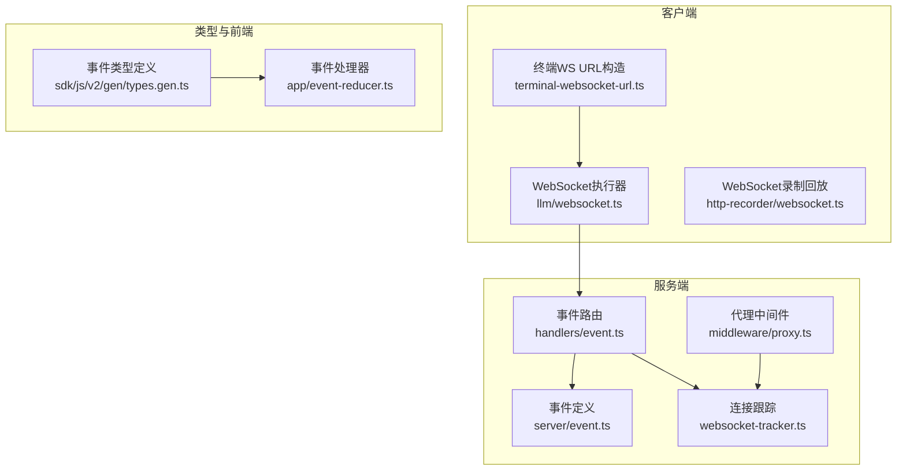
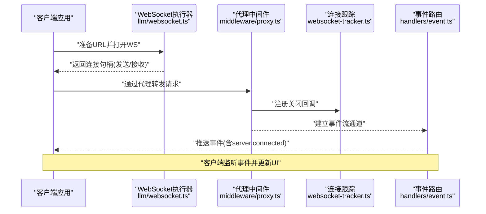
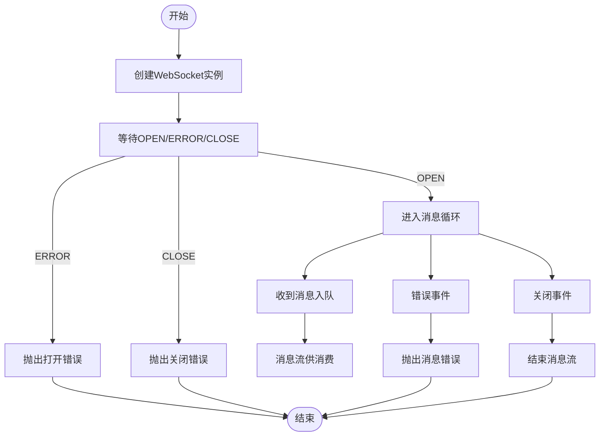
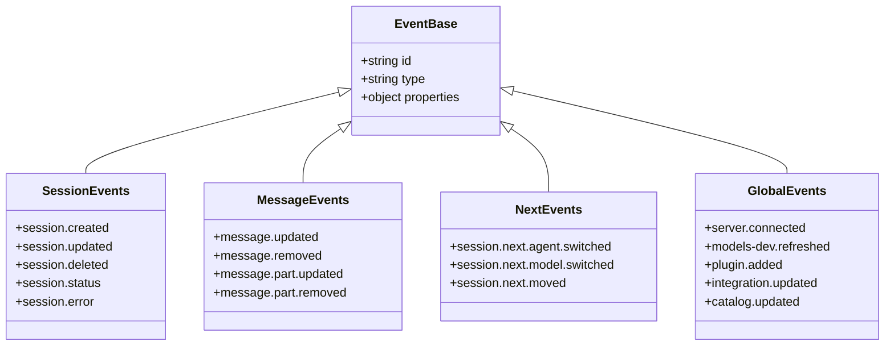
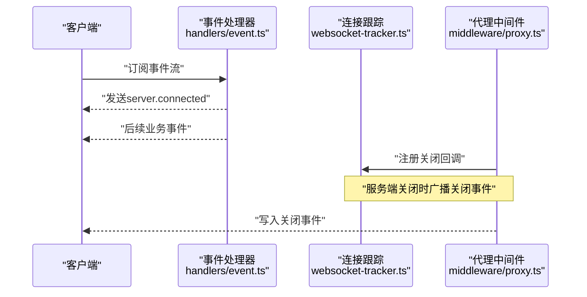
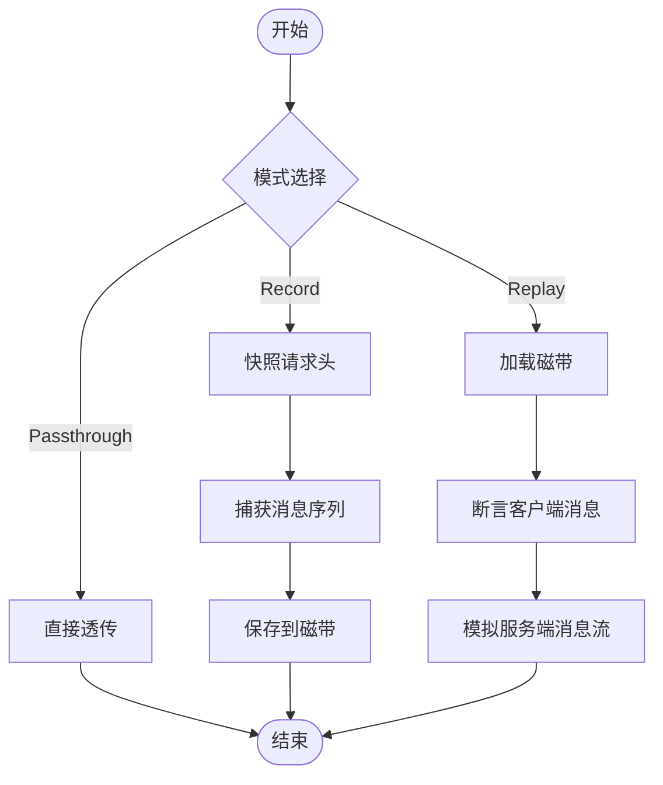
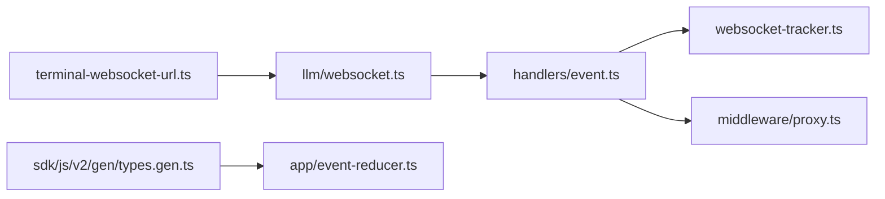

# WebSocket API

<cite>
**本文引用的文件**
- [packages/app/src/utils/terminal-websocket-url.ts](file://packages/app/src/utils/terminal-websocket-url.ts)
- [packages/http-recorder/src/websocket.ts](file://packages/http-recorder/src/websocket.ts)
- [packages/llm/src/route/transport/websocket.ts](file://packages/llm/src/route/transport/websocket.ts)
- [packages/opencode/src/server/routes/instance/httpapi/websocket-tracker.ts](file://packages/opencode/src/server/routes/instance/httpapi/websocket-tracker.ts)
- [packages/opencode/src/server/event.ts](file://packages/opencode/src/server/event.ts)
- [packages/opencode/src/server/routes/instance/httpapi/handlers/event.ts](file://packages/opencode/src/server/routes/instance/httpapi/handlers/event.ts)
- [packages/opencode/src/server/routes/instance/httpapi/middleware/proxy.ts](file://packages/opencode/src/server/routes/instance/httpapi/middleware/proxy.ts)
- [packages/sdk/js/src/v2/gen/types.gen.ts](file://packages/sdk/js/src/v2/gen/types.gen.ts)
- [packages/app/src/context/global-sync/event-reducer.ts](file://packages/app/src/context/global-sync/event-reducer.ts)
- [packages/opencode/test/server/httpapi-event.test.ts](file://packages/opencode/test/server/httpapi-event.test.ts)
- [packages/opencode/test/lib/websocket.ts](file://packages/opencode/test/lib/websocket.ts)
- [packages/llm/test/recorded-websocket.ts](file://packages/llm/test/recorded-websocket.ts)
</cite>

## 目录
1. [简介](#简介)
2. [项目结构](#项目结构)
3. [核心组件](#核心组件)
4. [架构总览](#架构总览)
5. [详细组件分析](#详细组件分析)
6. [依赖分析](#依赖分析)
7. [性能考虑](#性能考虑)
8. [故障排查指南](#故障排查指南)
9. [结论](#结论)
10. [附录](#附录)

## 简介
本文件为 OpenCode 的 WebSocket API 详细文档，覆盖连接建立流程、握手与认证、消息格式与事件类型、消息收发示例、连接管理与心跳、超时与错误恢复、性能优化与并发限制、调试与测试方法等内容。目标是帮助开发者在不同运行环境（浏览器、CLI、桌面端）正确接入并稳定使用 WebSocket 实时通信能力。

## 项目结构
OpenCode 的 WebSocket 能力由多处模块协同实现：
- 客户端侧：终端连接 URL 构造、通用 WebSocket 执行器、录制回放工具
- 服务端侧：事件流输出、全局事件路由、代理与连接跟踪
- 类型与事件：统一的事件类型定义与前端事件处理器

图表来源
- [packages/app/src/utils/terminal-websocket-url.ts:1-29](file://packages/app/src/utils/terminal-websocket-url.ts#L1-L29)
- [packages/llm/src/route/transport/websocket.ts:1-281](file://packages/llm/src/route/transport/websocket.ts#L1-L281)
- [packages/http-recorder/src/websocket.ts:1-174](file://packages/http-recorder/src/websocket.ts#L1-L174)
- [packages/opencode/src/server/event.ts:1-20](file://packages/opencode/src/server/event.ts#L1-L20)
- [packages/opencode/src/server/routes/instance/httpapi/handlers/event.ts:1-120](file://packages/opencode/src/server/routes/instance/httpapi/handlers/event.ts#L1-L120)
- [packages/opencode/src/server/routes/instance/httpapi/websocket-tracker.ts:1-58](file://packages/opencode/src/server/routes/instance/httpapi/websocket-tracker.ts#L1-L58)
- [packages/opencode/src/server/routes/instance/httpapi/middleware/proxy.ts:1-96](file://packages/opencode/src/server/routes/instance/httpapi/middleware/proxy.ts#L1-L96)
- [packages/sdk/js/src/v2/gen/types.gen.ts:787-842](file://packages/sdk/js/src/v2/gen/types.gen.ts#L787-L842)
- [packages/app/src/context/global-sync/event-reducer.ts:120-230](file://packages/app/src/context/global-sync/event-reducer.ts#L120-L230)

章节来源
- [packages/app/src/utils/terminal-websocket-url.ts:1-29](file://packages/app/src/utils/terminal-websocket-url.ts#L1-L29)
- [packages/llm/src/route/transport/websocket.ts:1-281](file://packages/llm/src/route/transport/websocket.ts#L1-L281)
- [packages/http-recorder/src/websocket.ts:1-174](file://packages/http-recorder/src/websocket.ts#L1-L174)
- [packages/opencode/src/server/event.ts:1-20](file://packages/opencode/src/server/event.ts#L1-L20)
- [packages/opencode/src/server/routes/instance/httpapi/handlers/event.ts:1-120](file://packages/opencode/src/server/routes/instance/httpapi/handlers/event.ts#L1-L120)
- [packages/opencode/src/server/routes/instance/httpapi/websocket-tracker.ts:1-58](file://packages/opencode/src/server/routes/instance/httpapi/websocket-tracker.ts#L1-L58)
- [packages/opencode/src/server/routes/instance/httpapi/middleware/proxy.ts:1-96](file://packages/opencode/src/server/routes/instance/httpapi/middleware/proxy.ts#L1-L96)
- [packages/sdk/js/src/v2/gen/types.gen.ts:787-842](file://packages/sdk/js/src/v2/gen/types.gen.ts#L787-L842)
- [packages/app/src/context/global-sync/event-reducer.ts:120-230](file://packages/app/src/context/global-sync/event-reducer.ts#L120-L230)

## 核心组件
- 终端 WebSocket URL 构造：负责根据输入参数生成正确的 WS/WSS 地址，并注入认证参数或令牌。
- WebSocket 执行器：封装浏览器 WebSocket 的打开、消息接收、错误与关闭处理，提供统一的文本消息流与发送接口。
- 事件类型与处理器：统一定义事件类型（如会话更新、消息部分更新、服务器连接等），并在前端进行状态同步与 UI 响应。
- 服务端事件路由与跟踪：提供事件流输出、连接注册与关闭广播、代理层的连接生命周期管理。
- 录制与回放：对 WebSocket 交互进行录制与回放，便于测试与调试。

章节来源
- [packages/app/src/utils/terminal-websocket-url.ts:1-29](file://packages/app/src/utils/terminal-websocket-url.ts#L1-L29)
- [packages/llm/src/route/transport/websocket.ts:1-281](file://packages/llm/src/route/transport/websocket.ts#L1-L281)
- [packages/sdk/js/src/v2/gen/types.gen.ts:787-842](file://packages/sdk/js/src/v2/gen/types.gen.ts#L787-L842)
- [packages/opencode/src/server/routes/instance/httpapi/websocket-tracker.ts:1-58](file://packages/opencode/src/server/routes/instance/httpapi/websocket-tracker.ts#L1-L58)
- [packages/http-recorder/src/websocket.ts:1-174](file://packages/http-recorder/src/websocket.ts#L1-L174)

## 架构总览
下图展示从客户端发起 WebSocket 请求到服务端事件流输出的整体路径，以及连接跟踪与代理层的作用。

图表来源
- [packages/llm/src/route/transport/websocket.ts:125-204](file://packages/llm/src/route/transport/websocket.ts#L125-L204)
- [packages/opencode/src/server/routes/instance/httpapi/middleware/proxy.ts:26-77](file://packages/opencode/src/server/routes/instance/httpapi/middleware/proxy.ts#L26-L77)
- [packages/opencode/src/server/routes/instance/httpapi/websocket-tracker.ts:16-45](file://packages/opencode/src/server/routes/instance/httpapi/websocket-tracker.ts#L16-L45)
- [packages/opencode/src/server/routes/instance/httpapi/handlers/event.ts:60-75](file://packages/opencode/src/server/routes/instance/httpapi/handlers/event.ts#L60-L75)

## 详细组件分析

### 终端 WebSocket URL 构造
- 功能：根据基础 URL、会话标识、目录、光标位置等参数生成 WS/WSS 地址；支持票据参数与凭据认证令牌注入。
- 关键点：
  - 自动将 https/http 协议转换为 wss/ws。
  - 支持 ticket 参数直连。
  - 支持用户名/密码组合生成认证令牌并注入查询参数。
- 典型用途：终端会话连接、文件系统变更通知、AI 生成进度推送等。

章节来源
- [packages/app/src/utils/terminal-websocket-url.ts:1-29](file://packages/app/src/utils/terminal-websocket-url.ts#L1-L29)

### WebSocket 执行器（浏览器）
- 功能：封装浏览器 WebSocket 的打开、消息接收、错误与关闭处理，提供统一的消息流与发送接口。
- 关键点：
  - 打开阶段等待 OPEN 或错误/关闭事件，失败时返回统一错误。
  - 将二进制与文本消息入队，提供只读消息流。
  - 发送失败与不支持的消息载荷均转为错误。
  - 关闭时清理监听并结束消息流。
- 适用场景：浏览器端实时通信、LLM 流式响应、事件订阅等。

图表来源
- [packages/llm/src/route/transport/websocket.ts:52-102](file://packages/llm/src/route/transport/websocket.ts#L52-L102)
- [packages/llm/src/route/transport/websocket.ts:138-204](file://packages/llm/src/route/transport/websocket.ts#L138-L204)

章节来源
- [packages/llm/src/route/transport/websocket.ts:1-281](file://packages/llm/src/route/transport/websocket.ts#L1-L281)

### 事件类型与消息格式
- 事件类型：统一在 SDK 类型文件中定义，涵盖会话、消息、模型切换、插件、目录等事件。
- 消息结构：每条事件包含 id、type、properties 字段；部分事件还包含聚合信息（如 syncEvent）。
- 典型事件：
  - 会话：session.created、session.updated、session.deleted、session.status、session.error
  - 消息：message.updated、message.removed、message.part.updated、message.part.removed
  - 下一步：session.next.agent.switched、session.next.model.switched、session.next.moved
  - 全局：server.connected、models-dev.refreshed、plugin.added、integration.updated、catalog.updated

图表来源
- [packages/sdk/js/src/v2/gen/types.gen.ts:787-842](file://packages/sdk/js/src/v2/gen/types.gen.ts#L787-L842)
- [packages/sdk/js/src/v2/gen/types.gen.ts:4251-4299](file://packages/sdk/js/src/v2/gen/types.gen.ts#L4251-L4299)

章节来源
- [packages/sdk/js/src/v2/gen/types.gen.ts:787-842](file://packages/sdk/js/src/v2/gen/types.gen.ts#L787-L842)
- [packages/sdk/js/src/v2/gen/types.gen.ts:4251-4299](file://packages/sdk/js/src/v2/gen/types.gen.ts#L4251-L4299)

### 服务端事件路由与连接跟踪
- 事件路由：提供事件流输出，首次事件为 server.connected，随后为总线事件。
- 连接跟踪：维护活跃连接集合，在服务端关闭时广播关闭事件并逐个关闭。
- 代理中间件：在代理模式下注册关闭回调，确保双向连接优雅关闭。

图表来源
- [packages/opencode/src/server/routes/instance/httpapi/handlers/event.ts:60-75](file://packages/opencode/src/server/routes/instance/httpapi/handlers/event.ts#L60-L75)
- [packages/opencode/src/server/routes/instance/httpapi/websocket-tracker.ts:30-45](file://packages/opencode/src/server/routes/instance/httpapi/websocket-tracker.ts#L30-L45)
- [packages/opencode/src/server/routes/instance/httpapi/middleware/proxy.ts:40-48](file://packages/opencode/src/server/routes/instance/httpapi/middleware/proxy.ts#L40-L48)

章节来源
- [packages/opencode/src/server/event.ts:1-20](file://packages/opencode/src/server/event.ts#L1-L20)
- [packages/opencode/src/server/routes/instance/httpapi/handlers/event.ts:1-120](file://packages/opencode/src/server/routes/instance/httpapi/handlers/event.ts#L1-L120)
- [packages/opencode/src/server/routes/instance/httpapi/websocket-tracker.ts:1-58](file://packages/opencode/src/server/routes/instance/httpapi/websocket-tracker.ts#L1-L58)
- [packages/opencode/src/server/routes/instance/httpapi/middleware/proxy.ts:1-96](file://packages/opencode/src/server/routes/instance/httpapi/middleware/proxy.ts#L1-L96)

### 录制与回放（测试与调试）
- 录制：捕获 WebSocket 开启请求与消息序列，按方向与内容进行脱敏与规范化存储。
- 回放：按顺序断言客户端消息并模拟服务端消息流，支持 JSON 规范化比较。
- 应用：用于端到端测试、回归验证与离线调试。

图表来源
- [packages/http-recorder/src/websocket.ts:64-174](file://packages/http-recorder/src/websocket.ts#L64-L174)

章节来源
- [packages/http-recorder/src/websocket.ts:1-174](file://packages/http-recorder/src/websocket.ts#L1-L174)

## 依赖分析
- 客户端依赖链：terminal-websocket-url → WebSocket 执行器 → 事件处理器
- 服务端依赖链：事件路由 → 连接跟踪 → 代理中间件
- 类型依赖：SDK 类型文件为事件处理器与前端同步提供契约

图表来源
- [packages/app/src/utils/terminal-websocket-url.ts:1-29](file://packages/app/src/utils/terminal-websocket-url.ts#L1-L29)
- [packages/llm/src/route/transport/websocket.ts:125-204](file://packages/llm/src/route/transport/websocket.ts#L125-L204)
- [packages/opencode/src/server/routes/instance/httpapi/handlers/event.ts:60-75](file://packages/opencode/src/server/routes/instance/httpapi/handlers/event.ts#L60-L75)
- [packages/opencode/src/server/routes/instance/httpapi/websocket-tracker.ts:16-45](file://packages/opencode/src/server/routes/instance/httpapi/websocket-tracker.ts#L16-L45)
- [packages/opencode/src/server/routes/instance/httpapi/middleware/proxy.ts:26-77](file://packages/opencode/src/server/routes/instance/httpapi/middleware/proxy.ts#L26-L77)
- [packages/sdk/js/src/v2/gen/types.gen.ts:787-842](file://packages/sdk/js/src/v2/gen/types.gen.ts#L787-L842)
- [packages/app/src/context/global-sync/event-reducer.ts:120-230](file://packages/app/src/context/global-sync/event-reducer.ts#L120-L230)

章节来源
- [packages/app/src/utils/terminal-websocket-url.ts:1-29](file://packages/app/src/utils/terminal-websocket-url.ts#L1-L29)
- [packages/llm/src/route/transport/websocket.ts:1-281](file://packages/llm/src/route/transport/websocket.ts#L1-L281)
- [packages/opencode/src/server/routes/instance/httpapi/handlers/event.ts:1-120](file://packages/opencode/src/server/routes/instance/httpapi/handlers/event.ts#L1-L120)
- [packages/opencode/src/server/routes/instance/httpapi/websocket-tracker.ts:1-58](file://packages/opencode/src/server/routes/instance/httpapi/websocket-tracker.ts#L1-L58)
- [packages/opencode/src/server/routes/instance/httpapi/middleware/proxy.ts:1-96](file://packages/opencode/src/server/routes/instance/httpapi/middleware/proxy.ts#L1-L96)
- [packages/sdk/js/src/v2/gen/types.gen.ts:787-842](file://packages/sdk/js/src/v2/gen/types.gen.ts#L787-L842)
- [packages/app/src/context/global-sync/event-reducer.ts:120-230](file://packages/app/src/context/global-sync/event-reducer.ts#L120-L230)

## 性能考虑
- 队列容量与背压：执行器内部使用有界队列承载消息，避免内存暴涨；消费端需及时处理以防止阻塞。
- 并发连接限制：服务端连接跟踪在关闭时采用无界并发关闭，但建议客户端按需控制并发，避免风暴。
- 文本/二进制处理：仅接受字符串与 Uint8Array，其他类型报错；建议上层统一编码策略。
- 超时与重试：打开阶段等待 OPEN/ERROR/CLOSE，失败即刻返回；建议客户端实现指数退避重连。
- 资源回收：关闭时移除监听并结束消息流，避免悬挂资源。

## 故障排查指南
- 连接异常关闭：检查关闭码与原因，区分正常关闭与异常关闭。
- 打开失败：确认 URL 协议转换是否成功、凭据/令牌是否有效、网络可达性。
- 消息错误：关注不支持的消息载荷与错误事件，定位上游发送方。
- 事件未达：确认 server.connected 是否先于业务事件到达，检查事件处理器与前端 reducer。
- 代理关闭：代理层会在服务端关闭时广播关闭事件，检查代理中间件日志。

章节来源
- [packages/llm/src/route/transport/websocket.ts:52-102](file://packages/llm/src/route/transport/websocket.ts#L52-L102)
- [packages/llm/src/route/transport/websocket.ts:138-204](file://packages/llm/src/route/transport/websocket.ts#L138-L204)
- [packages/opencode/src/server/routes/instance/httpapi/websocket-tracker.ts:30-45](file://packages/opencode/src/server/routes/instance/httpapi/websocket-tracker.ts#L30-L45)
- [packages/opencode/src/server/routes/instance/httpapi/middleware/proxy.ts:26-77](file://packages/opencode/src/server/routes/instance/httpapi/middleware/proxy.ts#L26-L77)
- [packages/opencode/test/server/httpapi-event.test.ts:56-85](file://packages/opencode/test/server/httpapi-event.test.ts#L56-L85)

## 结论
OpenCode 的 WebSocket API 通过统一的 URL 构造、标准化的事件类型与执行器抽象，实现了跨平台的实时通信能力。配合服务端事件路由、连接跟踪与代理中间件，可满足会话更新、消息增量、AI 生成进度、错误报告等场景。建议在生产环境中结合录制回放进行测试，完善重连与限速策略，并持续监控连接健康度。

## 附录

### 消息发送与接收示例（步骤说明）
- 客户端连接
  - 使用终端 URL 构造函数生成 WS/WSS 地址，注入认证参数或票据。
  - 通过 WebSocket 执行器打开连接，等待 OPEN 事件。
- 订阅事件
  - 在事件处理器中解析 server.connected 与后续业务事件。
  - 对消息部分更新等事件进行增量渲染。
- 断线重连
  - 捕捉关闭事件与错误事件，按指数退避策略重连。
  - 重连后重新订阅事件流。

章节来源
- [packages/app/src/utils/terminal-websocket-url.ts:1-29](file://packages/app/src/utils/terminal-websocket-url.ts#L1-L29)
- [packages/llm/src/route/transport/websocket.ts:125-204](file://packages/llm/src/route/transport/websocket.ts#L125-L204)
- [packages/app/src/context/global-sync/event-reducer.ts:120-230](file://packages/app/src/context/global-sync/event-reducer.ts#L120-L230)

### 调试与测试方法
- 录制回放：使用录制执行器捕获交互并回放，验证消息顺序与内容。
- 单元测试：参考测试库中的 WebSocket 辅助工具与事件流断言。
- 端到端：通过服务端事件测试验证 server.connected 与事件流行为。

章节来源
- [packages/http-recorder/src/websocket.ts:64-174](file://packages/http-recorder/src/websocket.ts#L64-L174)
- [packages/opencode/test/lib/websocket.ts:1-200](file://packages/opencode/test/lib/websocket.ts#L1-L200)
- [packages/opencode/test/server/httpapi-event.test.ts:56-85](file://packages/opencode/test/server/httpapi-event.test.ts#L56-L85)
- [packages/llm/test/recorded-websocket.ts:1-200](file://packages/llm/test/recorded-websocket.ts#L1-L200)