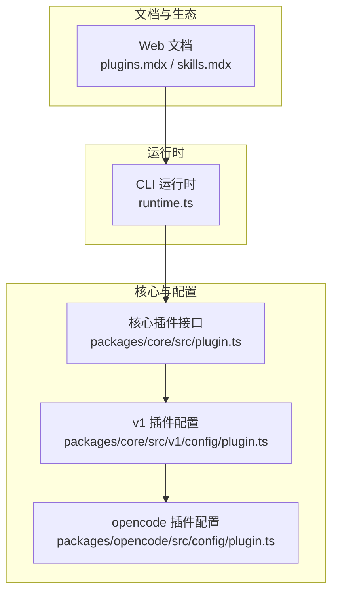
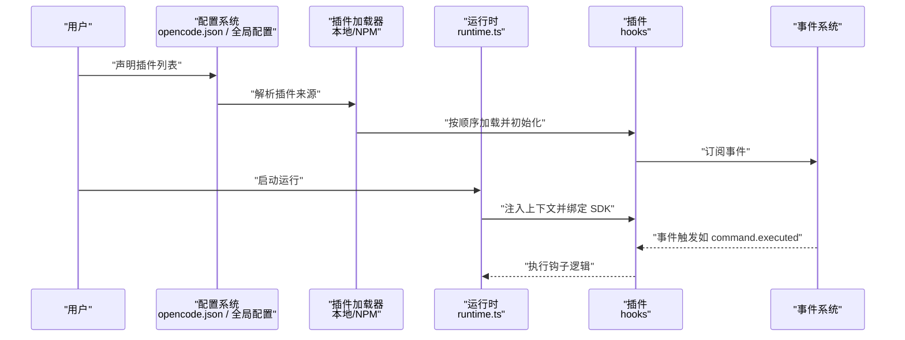
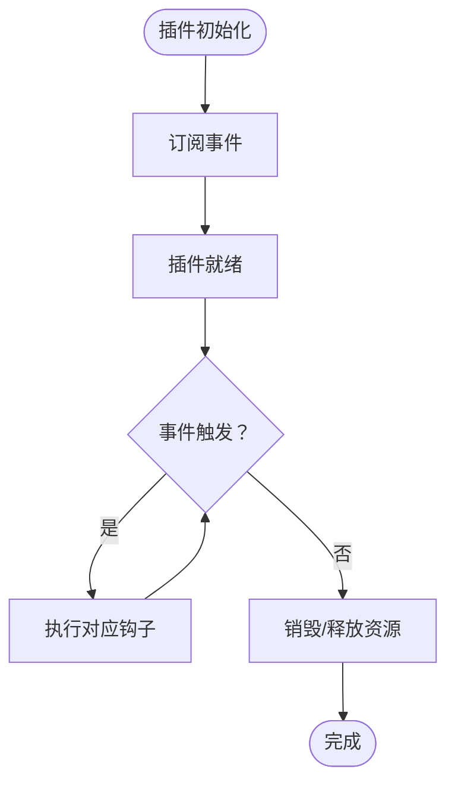
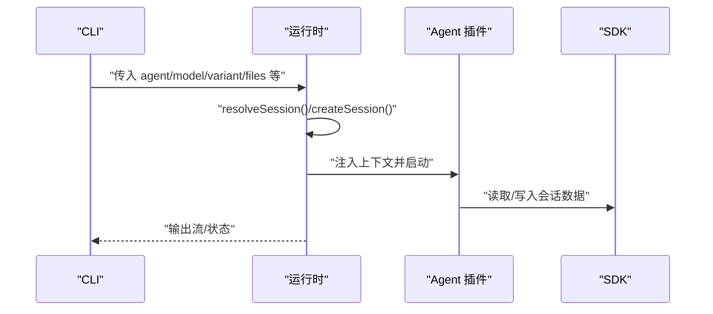
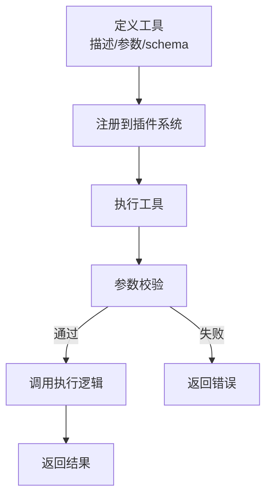
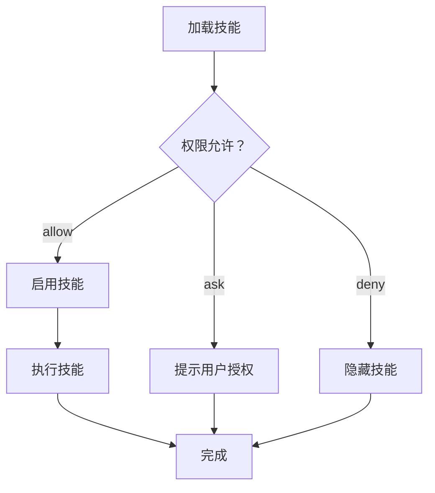
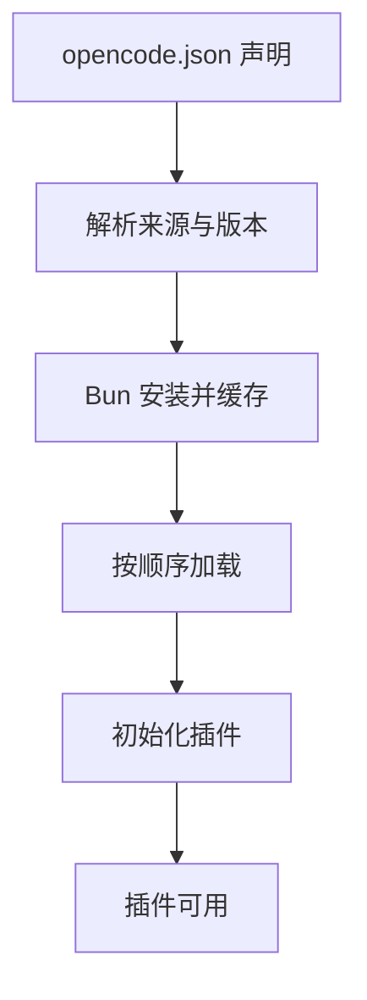
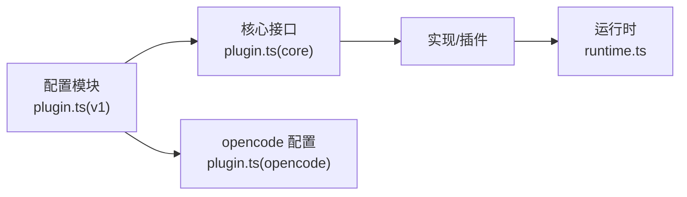

# 插件 API

<cite>
**本文引用的文件**
- [plugins.mdx（德语）](file://packages/web/src/content/docs/de/plugins.mdx)
- [plugins.mdx（意大利语）](file://packages/web/src/content/docs/it/plugins.mdx)
- [skills.mdx（日语）](file://packages/web/src/content/docs/ja/skills.mdx)
- [skills.mdx（丹麦语）](file://packages/web/src/content/docs/da/skills.mdx)
- [skills.mdx（西班牙语）](file://packages/web/src/content/docs/es/skills.mdx)
- [skills.mdx（意大利语）](file://packages/web/src/content/docs/it/skills.mdx)
- [runtime.ts](file://packages/opencode/src/cli/cmd/run/runtime.ts)
- [plugin.ts（核心）](file://packages/core/src/plugin.ts)
- [plugin.ts（v1 配置）](file://packages/core/src/v1/config/plugin.ts)
- [plugin.ts（opencode 包）](file://packages/opencode/src/config/plugin.ts)
- [plugin.ts（测试夹具）](file://packages/opencode/test/fixture/plugin.ts)
</cite>

## 目录
1. [简介](#简介)
2. [项目结构](#项目结构)
3. [核心组件](#核心组件)
4. [架构总览](#架构总览)
5. [详细组件分析](#详细组件分析)
6. [依赖分析](#依赖分析)
7. [性能考虑](#性能考虑)
8. [故障排查指南](#故障排查指南)
9. [结论](#结论)
10. [附录](#附录)

## 简介
本文件面向 OpenCode 插件开发者，系统化梳理插件系统的架构设计、生命周期、注册与加载机制、依赖管理、事件订阅、以及 Agent/Tool/Skill 插件的接口规范与最佳实践。内容基于仓库中的官方文档与核心实现文件整理而成，旨在帮助开发者快速理解并正确实现插件。

## 项目结构
OpenCode 的插件生态由“文档指引 + 核心运行时 + 配置与加载”三部分组成：
- 文档指引：位于 Web 包内多语言文档，覆盖插件使用、安装、加载顺序与事件订阅等。
- 运行时与生命周期：CLI 运行时负责会话解析、SDK 绑定与交互模式启动。
- 配置与加载：核心包与 opencode 包中的插件配置模块，定义插件的注册、加载与版本兼容策略。

图表来源
- [plugins.mdx（德语）:1-73](file://packages/web/src/content/docs/de/plugins.mdx#L1-L73)
- [plugins.mdx（意大利语）:1-49](file://packages/web/src/content/docs/it/plugins.mdx#L1-L49)
- [runtime.ts:65-789](file://packages/opencode/src/cli/cmd/run/runtime.ts#L65-L789)
- [plugin.ts（核心）](file://packages/core/src/plugin.ts)
- [plugin.ts（v1 配置）](file://packages/core/src/v1/config/plugin.ts)
- [plugin.ts（opencode 包）](file://packages/opencode/src/config/plugin.ts)

章节来源
- [plugins.mdx（德语）:1-73](file://packages/web/src/content/docs/de/plugins.mdx#L1-L73)
- [plugins.mdx（意大利语）:1-49](file://packages/web/src/content/docs/it/plugins.mdx#L1-L49)
- [runtime.ts:65-789](file://packages/opencode/src/cli/cmd/run/runtime.ts#L65-L789)

## 核心组件
- 插件接口与生命周期
  - 插件是一个 JavaScript/TypeScript 模块，导出一个或多个插件函数；每个函数接收上下文对象并返回 hooks 对象。
  - 上下文包含项目、客户端、工作树、目录等能力，用于在 hooks 中安全地访问运行环境。
- 事件订阅
  - 插件可订阅多种事件，如命令执行、文件变更、消息更新、权限请求、服务器连接、会话状态变化、工具执行前后等。
- 加载与安装
  - 支持从本地文件与 npm 安装两种方式；npm 插件通过 Bun 自动安装并缓存到本地；本地插件直接从插件目录加载。
  - 加载顺序：全局配置 → 项目配置 → 全局插件目录 → 项目插件目录；重复的 npm 包仅加载一次，但本地与同名 npm 插件可分别加载。
- 会话与运行时
  - CLI 运行时负责解析会话、共享会话、创建交互式运行环境，并将 SDK 注入插件上下文。

章节来源
- [plugins.mdx（德语）:12-73](file://packages/web/src/content/docs/de/plugins.mdx#L12-L73)
- [plugins.mdx（意大利语）:12-49](file://packages/web/src/content/docs/it/plugins.mdx#L12-L49)
- [runtime.ts:65-789](file://packages/opencode/src/cli/cmd/run/runtime.ts#L65-L789)

## 架构总览
下图展示了从用户配置到插件加载、事件触发与运行时交互的整体流程。

图表来源
- [plugins.mdx（德语）:12-73](file://packages/web/src/content/docs/de/plugins.mdx#L12-L73)
- [plugins.mdx（意大利语）:12-49](file://packages/web/src/content/docs/it/plugins.mdx#L12-L49)
- [runtime.ts:65-789](file://packages/opencode/src/cli/cmd/run/runtime.ts#L65-L789)

## 详细组件分析

### 插件接口与生命周期
- 接口形态
  - 插件函数接收上下文对象，返回 hooks 对象；hooks 可以包含事件监听器、工具注册、技能暴露等。
  - 上下文能力包括：项目信息、客户端实例、工作树根目录、当前目录等。
- 生命周期阶段
  - 初始化：加载与安装完成后，插件进入可用状态。
  - 运行期：根据事件触发执行相应钩子。
  - 销毁：会话结束或插件卸载时清理资源。
- 事件清单（节选）
  - 命令类：command.executed
  - 文件类：file.edited、file.watcher.updated
  - 安装类：installation.updated
  - LSP 类：lsp.client.diagnostics、lsp.updated
  - 消息类：message.part.removed、message.part.updated、message.removed、message.updated
  - 权限类：permission.asked、permission.replied
  - 服务器类：server.connected
  - 会话类：session.created、session.compacted、session.deleted、session.diff、session.error、session.idle、session.status、session.updated
  - Todo 类：todo.updated
  - Shell 类：shell.env
  - 工具类：tool.execute.after、tool.execute.before
  - TUI 类：（多语言文档中列出）

章节来源
- [plugins.mdx（德语）:12-73](file://packages/web/src/content/docs/de/plugins.mdx#L12-L73)
- [plugins.mdx（意大利语）:12-49](file://packages/web/src/content/docs/it/plugins.mdx#L12-L49)

### Agent 插件
- 角色定位
  - Agent 插件用于扩展或定制智能体的行为，通常与会话、模型、变体、文件输入等运行参数协同工作。
- 关键流程
  - 运行时解析会话与代理配置，创建交互式运行环境。
  - 将 SDK 与上下文注入插件，使其可在事件回调中访问会话 ID、消息上下文、工作树等。
- 方法与参数要点（基于运行时调用链）
  - 会话解析：支持外部创建会话与分享会话的能力。
  - 运行模式：交互式运行、后台子代理、回放与演示等选项。
  - 上下文注入：目录、会话 ID、标题、代理、模型、变体等。
- 错误处理
  - 会话创建失败或会话不存在时抛出明确错误，便于上层捕获与提示。

图表来源
- [runtime.ts:65-789](file://packages/opencode/src/cli/cmd/run/runtime.ts#L65-L789)

章节来源
- [runtime.ts:65-789](file://packages/opencode/src/cli/cmd/run/runtime.ts#L65-L789)

### Tool 插件
- 工具发现与注册
  - 工具通过插件导出的工具定义进行注册，描述工具用途、参数与执行逻辑。
- 参数验证与执行
  - 使用 schema 对参数进行校验；执行时可访问上下文（如 agent、sessionID、messageID、directory、worktree）。
  - 执行前/后事件可用于审计、缓存或副作用管理。
- 结果格式
  - 工具应返回稳定、可解析的结果字符串或结构化数据，便于后续处理或展示。

章节来源
- [plugins.mdx（德语）:12-73](file://packages/web/src/content/docs/de/plugins.mdx#L12-L73)
- [plugins.mdx（意大利语）:12-49](file://packages/web/src/content/docs/it/plugins.mdx#L12-L49)

### Skill 插件
- 技能定义与权限
  - 技能可通过 Front Matter 或配置文件声明名称与描述；权限控制支持 allow/deny/ask 三种策略，且支持通配符匹配。
  - 可针对特定 Agent 覆盖默认权限；也可完全禁用技能工具。
- 上下文与状态
  - 技能执行需具备会话上下文与工作树根目录；权限策略影响技能是否被加载与可见。
- 故障排查
  - 若技能不显示，检查文件命名大小写、Front Matter 字段完整性、名称唯一性与权限设置。

章节来源
- [skills.mdx（日语）:157-222](file://packages/web/src/content/docs/ja/skills.mdx#L157-L222)
- [skills.mdx（丹麦语）:145-222](file://packages/web/src/content/docs/da/skills.mdx#L145-L222)
- [skills.mdx（西班牙语）:139-210](file://packages/web/src/content/docs/es/skills.mdx#L139-L210)
- [skills.mdx（意大利语）:144-222](file://packages/web/src/content/docs/it/skills.mdx#L144-L222)

### 插件配置与加载
- 配置入口
  - 在 opencode.json 中声明插件数组，支持常规与作用域 npm 包。
- 加载顺序
  - 全局配置 → 项目配置 → 全局插件目录 → 项目插件目录；去重策略与本地/远程插件共存规则明确。
- 缓存与安装
  - npm 插件通过 Bun 安装并缓存至本地；本地插件直接加载，若需要外部依赖需在配置目录提供 package.json 或发布到 npm。

章节来源
- [plugins.mdx（德语）:29-73](file://packages/web/src/content/docs/de/plugins.mdx#L29-L73)
- [plugins.mdx（意大利语）:29-49](file://packages/web/src/content/docs/it/plugins.mdx#L29-L49)

## 依赖分析
- 组件耦合
  - 插件系统与运行时通过上下文与事件解耦；插件仅依赖其声明的 hooks 与事件。
  - 配置模块负责统一解析与去重，避免循环加载与重复初始化。
- 外部依赖
  - npm 插件通过 Bun 管理安装与缓存；本地插件依赖宿主环境与配置目录的 package.json。
- 版本兼容
  - v1 配置与核心插件接口存在演进关系；新旧版本需遵循兼容策略与迁移路径。

图表来源
- [plugin.ts（v1 配置）](file://packages/core/src/v1/config/plugin.ts)
- [plugin.ts（核心）](file://packages/core/src/plugin.ts)
- [plugin.ts（opencode 包）](file://packages/opencode/src/config/plugin.ts)
- [runtime.ts:65-789](file://packages/opencode/src/cli/cmd/run/runtime.ts#L65-L789)

章节来源
- [plugin.ts（v1 配置）](file://packages/core/src/v1/config/plugin.ts)
- [plugin.ts（核心）](file://packages/core/src/plugin.ts)
- [plugin.ts（opencode 包）](file://packages/opencode/src/config/plugin.ts)
- [runtime.ts:65-789](file://packages/opencode/src/cli/cmd/run/runtime.ts#L65-L789)

## 性能考虑
- 插件数量与加载顺序会影响启动时间；建议按需启用与合并功能，减少不必要的事件监听。
- 工具执行前/后事件可用于缓存与去重，降低重复计算成本。
- npm 插件安装与缓存策略可显著缩短二次启动时间，建议保持稳定的依赖版本。

## 故障排查指南
- 插件未加载
  - 检查 opencode.json 中的插件声明与来源；确认加载顺序与去重规则。
- 事件未触发
  - 确认插件已正确订阅目标事件；检查事件名称拼写与上下文注入。
- 会话问题
  - 确保会话创建成功并返回有效 ID；运行时对缺失会话与创建失败有明确报错。
- 技能不可见
  - 检查 Front Matter 字段、文件命名大小写、权限策略与是否被禁用。

章节来源
- [plugins.mdx（德语）:12-73](file://packages/web/src/content/docs/de/plugins.mdx#L12-L73)
- [plugins.mdx（意大利语）:12-49](file://packages/web/src/content/docs/it/plugins.mdx#L12-L49)
- [skills.mdx（日语）:215-222](file://packages/web/src/content/docs/ja/skills.mdx#L215-L222)
- [skills.mdx（丹麦语）:215-222](file://packages/web/src/content/docs/da/skills.mdx#L215-L222)
- [skills.mdx（西班牙语）:210-210](file://packages/web/src/content/docs/es/skills.mdx#L210-L210)
- [skills.mdx（意大利语）:215-222](file://packages/web/src/content/docs/it/skills.mdx#L215-L222)
- [runtime.ts:65-789](file://packages/opencode/src/cli/cmd/run/runtime.ts#L65-L789)

## 结论
OpenCode 插件体系以事件驱动与上下文注入为核心，结合清晰的加载顺序与权限控制，为开发者提供了灵活而强大的扩展能力。遵循本文档的接口规范与最佳实践，可高效构建 Agent/Tool/Skill 插件，并确保在不同版本间的平滑演进与稳定运行。

## 附录
- 开发示例（步骤概述）
  - 插件结构：导出一个或多个插件函数，返回 hooks 对象。
  - 配置文件：在 opencode.json 中声明插件数组。
  - 依赖声明：本地插件需在配置目录提供 package.json；npm 插件由 Bun 自动安装。
  - 打包发布：npm 包可直接发布；本地插件可复制到全局或项目插件目录。
- 版本兼容与废弃策略
  - v1 配置与核心接口存在演进；请参考配置模块与核心接口的演进路径，遵循向后兼容策略并在迁移期间提供过渡方案。
- 调试与测试
  - 利用事件日志与运行时输出定位问题；在工具执行前后事件中埋点审计与缓存。
  - 使用最小化配置与单个插件进行隔离测试，逐步扩大范围。

章节来源
- [plugins.mdx（德语）:12-73](file://packages/web/src/content/docs/de/plugins.mdx#L12-L73)
- [plugins.mdx（意大利语）:12-49](file://packages/web/src/content/docs/it/plugins.mdx#L12-L49)
- [plugin.ts（v1 配置）](file://packages/core/src/v1/config/plugin.ts)
- [plugin.ts（核心）](file://packages/core/src/plugin.ts)
- [plugin.ts（opencode 包）](file://packages/opencode/src/config/plugin.ts)
- [plugin.ts（测试夹具）](file://packages/opencode/test/fixture/plugin.ts)