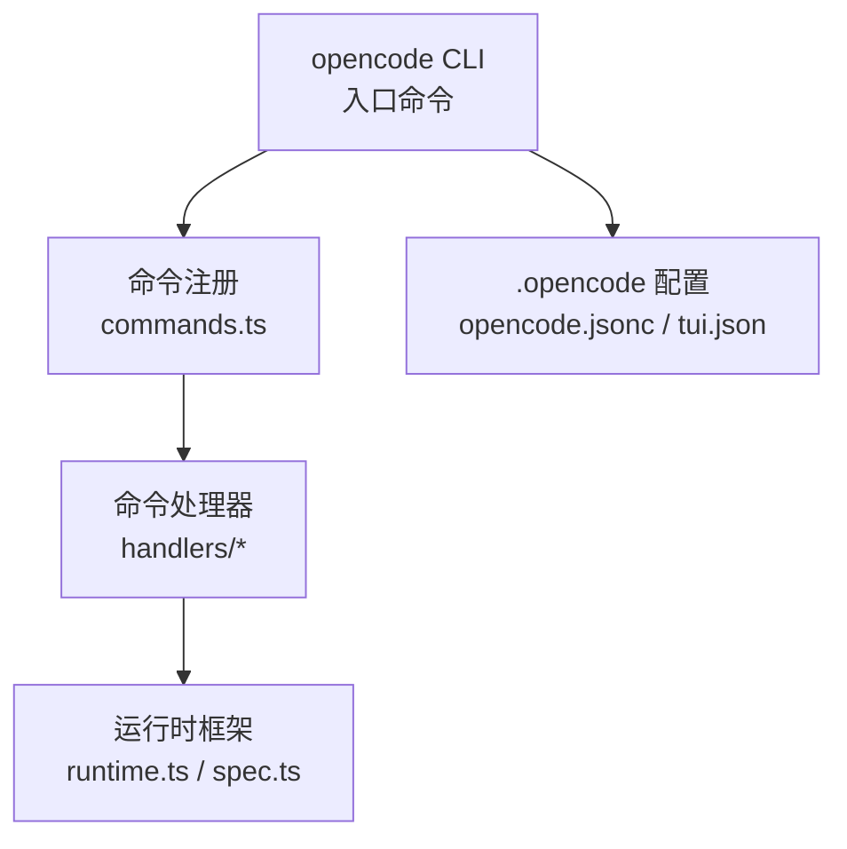
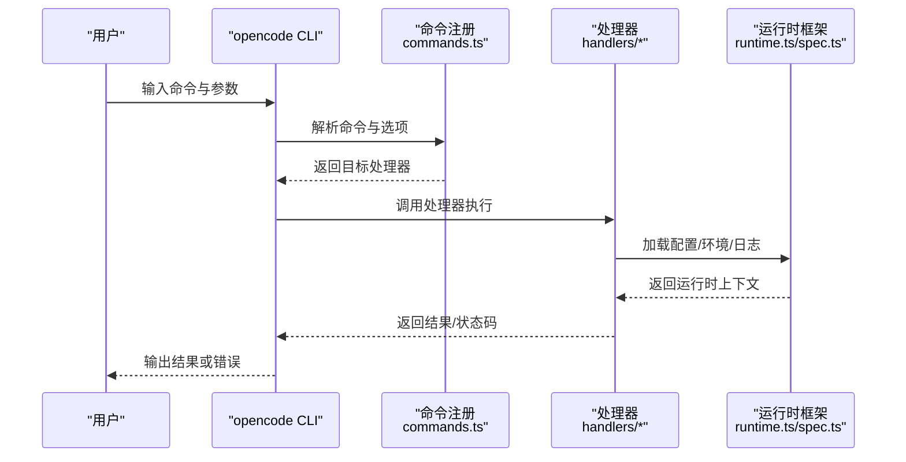
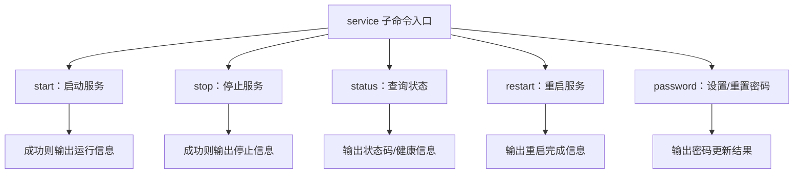
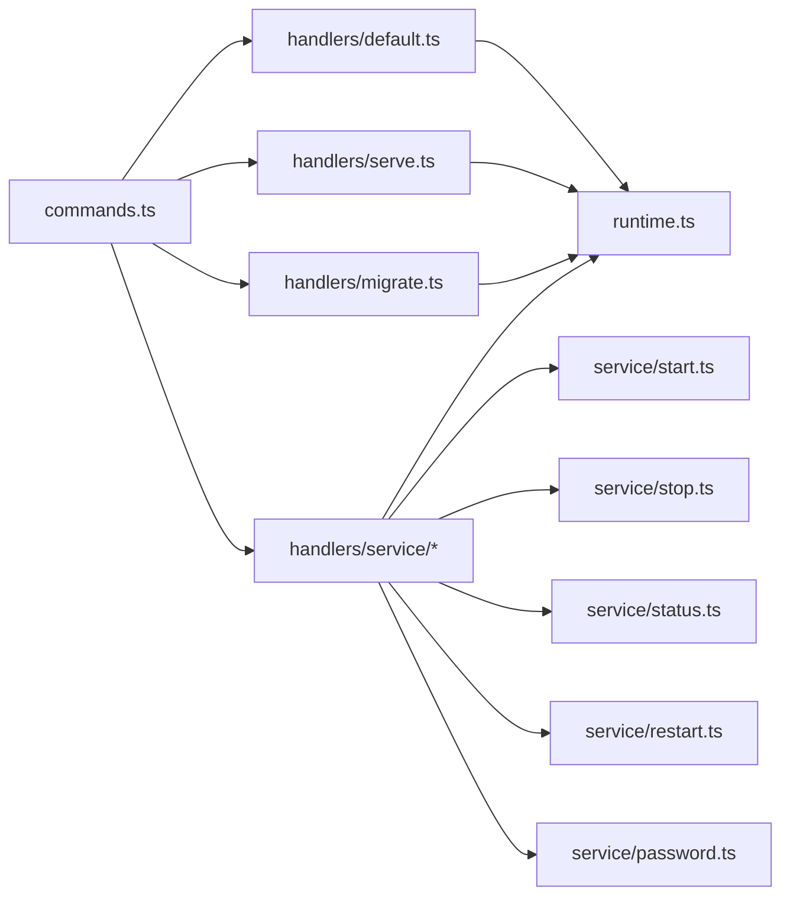

# CLI 工具使用

<cite>
**本文引用的文件**
- [README.md](file://README.md)
- [CONTRIBUTING.md](file://CONTRIBUTING.md)
- [packages/cli/package.json](file://packages/cli/package.json)
- [packages/cli/src/commands/commands.ts](file://packages/cli/src/commands/commands.ts)
- [packages/cli/src/commands/handlers/default.ts](file://packages/cli/src/commands/handlers/default.ts)
- [packages/cli/src/commands/handlers/serve.ts](file://packages/cli/src/commands/handlers/serve.ts)
- [packages/cli/src/commands/handlers/migrate.ts](file://packages/cli/src/commands/handlers/migrate.ts)
- [packages/cli/src/commands/handlers/service/start.ts](file://packages/cli/src/commands/handlers/service/start.ts)
- [packages/cli/src/commands/handlers/service/stop.ts](file://packages/cli/src/commands/handlers/service/stop.ts)
- [packages/cli/src/commands/handlers/service/status.ts](file://packages/cli/src/commands/handlers/service/status.ts)
- [packages/cli/src/commands/handlers/service/restart.ts](file://packages/cli/src/commands/handlers/service/restart.ts)
- [packages/cli/src/commands/handlers/service/password.ts](file://packages/cli/src/commands/handlers/service/password.ts)
- [packages/cli/src/framework/runtime.ts](file://packages/cli/src/framework/runtime.ts)
- [packages/cli/src/framework/spec.ts](file://packages/cli/src/framework/spec.ts)
- [.opencode/opencode.jsonc](file://.opencode/opencode.jsonc)
- [.opencode/tui.json](file://.opencode/tui.json)
</cite>

## 目录
1. [简介](#简介)
2. [项目结构](#项目结构)
3. [核心组件](#核心组件)
4. [架构总览](#架构总览)
5. [详细组件分析](#详细组件分析)
6. [依赖关系分析](#依赖关系分析)
7. [性能与可扩展性](#性能与可扩展性)
8. [故障排除指南](#故障排除指南)
9. [结论](#结论)
10. [附录：常用工作流与最佳实践](#附录常用工作流与最佳实践)

## 简介
本指南面向 OpenCode CLI 的使用者，系统性介绍命令行工具的安装、配置、命令与参数、执行流程、自动补全与快捷键、以及常见问题排查。OpenCode CLI 提供统一入口命令 opencode，并通过子命令实现服务管理、开发辅助与运行时控制等功能。本文档同时覆盖从入门到进阶的使用场景，帮助快速上手与高效批量处理。

## 项目结构
OpenCode CLI 位于 packages/cli 目录，核心由以下部分组成：
- 命令注册与分发：commands.ts 负责定义命令树与路由
- 子命令处理器：handlers/* 实现具体命令逻辑（如 serve、service/*）
- 运行时框架：runtime.ts、spec.ts 提供 CLI 规范与运行时能力
- 配置文件：.opencode 目录下的 opencode.jsonc、tui.json 等
- 文档与贡献指南：README.md、CONTRIBUTING.md 提供使用与开发参考

图表来源
- [packages/cli/src/commands/commands.ts](file://packages/cli/src/commands/commands.ts)
- [packages/cli/src/commands/handlers/default.ts](file://packages/cli/src/commands/handlers/default.ts)
- [packages/cli/src/framework/runtime.ts](file://packages/cli/src/framework/runtime.ts)
- [.opencode/opencode.jsonc](file://.opencode/opencode.jsonc)
- [.opencode/tui.json](file://.opencode/tui.json)

章节来源
- [packages/cli/src/commands/commands.ts](file://packages/cli/src/commands/commands.ts)
- [packages/cli/src/framework/runtime.ts](file://packages/cli/src/framework/runtime.ts)
- [packages/cli/src/framework/spec.ts](file://packages/cli/src/framework/spec.ts)
- [.opencode/opencode.jsonc](file://.opencode/opencode.jsonc)
- [.opencode/tui.json](file://.opencode/tui.json)

## 核心组件
- 入口命令与帮助系统
  - 使用 opencode --help 查看全部可用命令与简要说明
  - 使用 opencode <command> --help 查看子命令的详细帮助
- 命令注册与路由
  - commands.ts 定义命令树与别名映射，负责解析输入并分发到对应处理器
- 运行时框架
  - runtime.ts 提供运行时上下文、日志、环境变量与配置加载
  - spec.ts 定义 CLI 行为规范与参数约定
- 配置体系
  - .opencode/opencode.jsonc：全局/项目级配置（如模型、主题、代理等）
  - .opencode/tui.json：TUI 相关界面与交互配置

章节来源
- [packages/cli/src/commands/commands.ts](file://packages/cli/src/commands/commands.ts)
- [packages/cli/src/framework/runtime.ts](file://packages/cli/src/framework/runtime.ts)
- [packages/cli/src/framework/spec.ts](file://packages/cli/src/framework/spec.ts)
- [.opencode/opencode.jsonc](file://.opencode/opencode.jsonc)
- [.opencode/tui.json](file://.opencode/tui.json)

## 架构总览
OpenCode CLI 的调用链路如下：
- 用户在终端输入 opencode 及其参数
- 命令解析器根据 commands.ts 的定义匹配命令与选项
- 对应的处理器（handlers/*）执行业务逻辑
- 运行时框架（runtime.ts/spec.ts）提供上下文与配置支持
- 结果通过标准输出或错误输出返回给用户

图表来源
- [packages/cli/src/commands/commands.ts](file://packages/cli/src/commands/commands.ts)
- [packages/cli/src/commands/handlers/default.ts](file://packages/cli/src/commands/handlers/default.ts)
- [packages/cli/src/framework/runtime.ts](file://packages/cli/src/framework/runtime.ts)
- [packages/cli/src/framework/spec.ts](file://packages/cli/src/framework/spec.ts)

## 详细组件分析

### 命令总览与优先级规则
- 常用命令
  - opencode --help：显示帮助
  - opencode serve：启动无头 API 服务器
  - opencode web：启动服务器并打开 Web 界面
  - opencode <目录>：在指定目录启动 TUI
  - opencode migrate：数据库迁移相关操作
  - opencode service <subcommand>：服务生命周期管理（start/stop/status/restart/password）
- 参数优先级
  - 命令行参数 > 环境变量 > 配置文件（.opencode/opencode.jsonc）
  - 若同一参数在多处出现，以“最近优先”原则生效（越靠后的来源优先）
- 配置继承机制
  - CLI 启动时按顺序加载：全局配置 → 项目配置 → 当前工作目录配置
  - 处理器在运行时合并并应用最终配置

章节来源
- [CONTRIBUTING.md](file://CONTRIBUTING.md)
- [packages/cli/src/commands/commands.ts](file://packages/cli/src/commands/commands.ts)
- [packages/cli/src/framework/runtime.ts](file://packages/cli/src/framework/runtime.ts)
- [.opencode/opencode.jsonc](file://.opencode/opencode.jsonc)

### 服务管理命令（service 子命令族）
- 子命令
  - opencode service start：启动服务
  - opencode service stop：停止服务
  - opencode service status：查询服务状态
  - opencode service restart：重启服务
  - opencode service password：重置/设置服务密码
- 典型用法
  - service start：后台启动服务并记录 PID/端口
  - service status：查看进程状态与健康检查结果
  - service restart：优雅重启，避免中断当前会话
  - service password：更新认证凭据，配合安全策略

图表来源
- [packages/cli/src/commands/handlers/service/start.ts](file://packages/cli/src/commands/handlers/service/start.ts)
- [packages/cli/src/commands/handlers/service/stop.ts](file://packages/cli/src/commands/handlers/service/stop.ts)
- [packages/cli/src/commands/handlers/service/status.ts](file://packages/cli/src/commands/handlers/service/status.ts)
- [packages/cli/src/commands/handlers/service/restart.ts](file://packages/cli/src/commands/handlers/service/restart.ts)
- [packages/cli/src/commands/handlers/service/password.ts](file://packages/cli/src/commands/handlers/service/password.ts)

章节来源
- [packages/cli/src/commands/handlers/service/start.ts](file://packages/cli/src/commands/handlers/service/start.ts)
- [packages/cli/src/commands/handlers/service/stop.ts](file://packages/cli/src/commands/handlers/service/stop.ts)
- [packages/cli/src/commands/handlers/service/status.ts](file://packages/cli/src/commands/handlers/service/status.ts)
- [packages/cli/src/commands/handlers/service/restart.ts](file://packages/cli/src/commands/handlers/service/restart.ts)
- [packages/cli/src/commands/handlers/service/password.ts](file://packages/cli/src/commands/handlers/service/password.ts)

### 开发与运行模式命令
- opencode serve
  - 启动无头 API 服务器，便于集成与自动化
  - 常用于 CI/CD 或后端服务对接
- opencode web
  - 启动服务器并打开 Web 界面，适合交互式开发
- opencode <目录>
  - 在指定目录启动 TUI，进入交互式会话
  - 适用于本地项目开发与调试

章节来源
- [CONTRIBUTING.md](file://CONTRIBUTING.md)
- [packages/cli/src/commands/handlers/serve.ts](file://packages/cli/src/commands/handlers/serve.ts)
- [packages/cli/src/commands/handlers/default.ts](file://packages/cli/src/commands/handlers/default.ts)

### 数据迁移命令（migrate）
- 作用
  - 执行数据库迁移脚本，确保数据结构与版本一致
- 建议
  - 在生产环境执行前先备份数据库
  - 结合 service status 检查服务状态后再执行

章节来源
- [packages/cli/src/commands/handlers/migrate.ts](file://packages/cli/src/commands/handlers/migrate.ts)

## 依赖关系分析
- 组件耦合
  - commands.ts 作为单一事实源，集中管理命令与参数解析
  - handlers/* 仅依赖 runtime.ts 提供的通用能力，保持低耦合
- 外部依赖
  - 运行时框架依赖 Node/Bun 环境与包管理器
  - 配置文件位于 .opencode 目录，遵循约定优于配置原则
- 可能的循环依赖
  - 命令注册与处理器之间无直接循环导入；若新增处理器需遵循单向依赖

图表来源
- [packages/cli/src/commands/commands.ts](file://packages/cli/src/commands/commands.ts)
- [packages/cli/src/commands/handlers/default.ts](file://packages/cli/src/commands/handlers/default.ts)
- [packages/cli/src/commands/handlers/serve.ts](file://packages/cli/src/commands/handlers/serve.ts)
- [packages/cli/src/commands/handlers/migrate.ts](file://packages/cli/src/commands/handlers/migrate.ts)
- [packages/cli/src/commands/handlers/service/start.ts](file://packages/cli/src/commands/handlers/service/start.ts)
- [packages/cli/src/commands/handlers/service/stop.ts](file://packages/cli/src/commands/handlers/service/stop.ts)
- [packages/cli/src/commands/handlers/service/status.ts](file://packages/cli/src/commands/handlers/service/status.ts)
- [packages/cli/src/commands/handlers/service/restart.ts](file://packages/cli/src/commands/handlers/service/restart.ts)
- [packages/cli/src/commands/handlers/service/password.ts](file://packages/cli/src/commands/handlers/service/password.ts)
- [packages/cli/src/framework/runtime.ts](file://packages/cli/src/framework/runtime.ts)

章节来源
- [packages/cli/src/commands/commands.ts](file://packages/cli/src/commands/commands.ts)
- [packages/cli/src/framework/runtime.ts](file://packages/cli/src/framework/runtime.ts)

## 性能与可扩展性
- 性能建议
  - 尽量使用 service start/stop/status 管理服务，避免频繁重启
  - 在 CI/CD 中复用已启动的服务实例，减少冷启动开销
- 可扩展性
  - 新增命令时遵循 commands.ts 的注册规范，保持参数与输出格式一致
  - 处理器内部通过 runtime.ts 获取上下文，便于统一日志与指标采集

[本节为通用指导，无需列出章节来源]

## 故障排除指南
- 常见问题与定位步骤
  - 无法找到 opencode 命令
    - 检查是否正确安装与 PATH 是否包含二进制路径
    - 参考构建产物位置与安装方式
  - 服务启动失败
    - 使用 service status 检查状态与错误日志
    - 使用 service restart 重试；必要时 service stop 后再 start
  - 权限或端口冲突
    - 使用 service password 更新凭据
    - 检查端口占用并调整配置
  - 配置不生效
    - 确认 .opencode/opencode.jsonc 的语法与字段名称
    - 验证命令行参数优先级高于配置文件
- 日志与诊断
  - 运行时框架提供统一日志入口，可在处理器中调用
  - 建议在问题复现时开启详细日志并附带时间戳

章节来源
- [CONTRIBUTING.md](file://CONTRIBUTING.md)
- [packages/cli/src/commands/handlers/service/status.ts](file://packages/cli/src/commands/handlers/service/status.ts)
- [packages/cli/src/commands/handlers/service/restart.ts](file://packages/cli/src/commands/handlers/service/restart.ts)
- [packages/cli/src/commands/handlers/service/password.ts](file://packages/cli/src/commands/handlers/service/password.ts)
- [packages/cli/src/framework/runtime.ts](file://packages/cli/src/framework/runtime.ts)
- [.opencode/opencode.jsonc](file://.opencode/opencode.jsonc)

## 结论
OpenCode CLI 通过清晰的命令结构与运行时框架，提供了稳定的服务管理与开发体验。建议用户优先掌握 service 子命令族与 serve/web 模式的组合使用，并结合 .opencode 配置实现个性化定制。遇到问题时，可依据本指南的优先级与诊断流程快速定位并解决。

[本节为总结性内容，无需列出章节来源]

## 附录：常用工作流与最佳实践
- 项目初始化
  - 在项目根目录执行 opencode <目录> 进入 TUI
  - 如需无头模式，使用 opencode serve 并在 CI 中拉起
- 代码生成与会话管理
  - 在 TUI 中选择生成模板，完成后使用 service status 检查服务状态
  - 若需要重置凭据，使用 opencode service password
- 自动补全与快捷键
  - Bash/Zsh：参考包内提供的补全脚本并按需启用
  - 快捷键：在 TUI 中使用默认快捷键进行导航与确认
- 批量处理建议
  - 将 service start 放入系统服务或容器编排中，确保开机自启
  - 在 CI 中先执行 migrate，再启动服务，最后进行集成测试

章节来源
- [CONTRIBUTING.md](file://CONTRIBUTING.md)
- [packages/cli/src/commands/handlers/serve.ts](file://packages/cli/src/commands/handlers/serve.ts)
- [packages/cli/src/commands/handlers/default.ts](file://packages/cli/src/commands/handlers/default.ts)
- [packages/cli/src/commands/handlers/migrate.ts](file://packages/cli/src/commands/handlers/migrate.ts)
- [packages/cli/src/commands/handlers/service/start.ts](file://packages/cli/src/commands/handlers/service/start.ts)
- [packages/cli/src/commands/handlers/service/status.ts](file://packages/cli/src/commands/handlers/service/status.ts)
- [packages/cli/src/commands/handlers/service/password.ts](file://packages/cli/src/commands/handlers/service/password.ts)