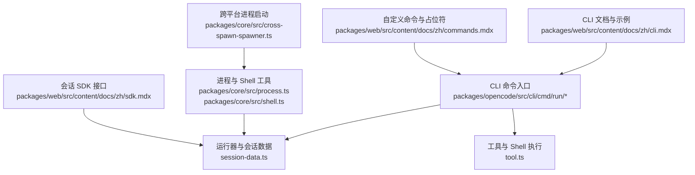
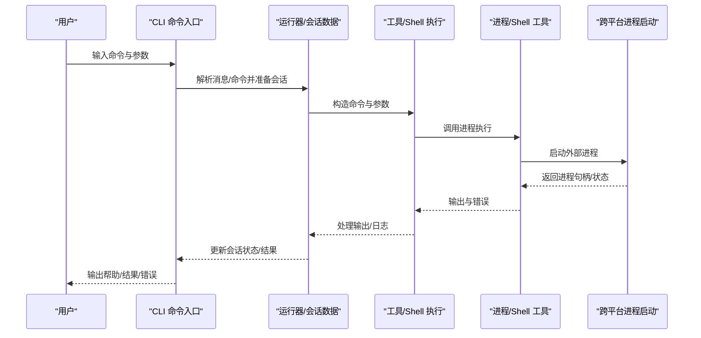
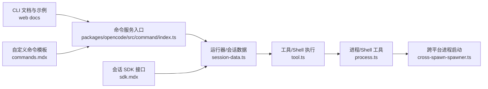

# 基础命令

<cite>
**本文引用的文件**
- [packages/opencode/src/cli/cmd/run/session-data.ts](file://packages/opencode/src/cli/cmd/run/session-data.ts)
- [packages/opencode/src/cli/cmd/run/tool.ts](file://packages/opencode/src/cli/cmd/run/tool.ts)
- [packages/opencode/src/command/index.ts](file://packages/opencode/src/command/index.ts)
- [packages/opencode/test/cli/help/__snapshots__/help-snapshots.test.ts.snap](file://packages/opencode/test/cli/help/__snapshots__/help-snapshots.test.ts.snap)
- [packages/web/src/content/docs/es/cli.mdx](file://packages/web/src/content/docs/es/cli.mdx)
- [packages/web/src/content/docs/zh/cli.mdx](file://packages/web/src/content/docs/zh/cli.mdx)
- [packages/web/src/content/docs/zh/commands.mdx](file://packages/web/src/content/docs/zh/commands.mdx)
- [packages/web/src/content/docs/zh/sdk.mdx](file://packages/web/src/content/docs/zh/sdk.mdx)
- [packages/web/src/content/docs/zh/tui.mdx](file://packages/web/src/content/docs/zh/tui.mdx)
- [packages/core/src/process.ts](file://packages/core/src/process.ts)
- [packages/core/src/shell.ts](file://packages/core/src/shell.ts)
- [packages/core/src/cross-spawn-spawner.ts](file://packages/core/src/cross-spawn-spawner.ts)
</cite>

## 目录
1. [简介](#简介)
2. [项目结构](#项目结构)
3. [核心组件](#核心组件)
4. [架构总览](#架构总览)
5. [详细组件分析](#详细组件分析)
6. [依赖分析](#依赖分析)
7. [性能考虑](#性能考虑)
8. [故障排除指南](#故障排除指南)
9. [结论](#结论)
10. [附录](#附录)

## 简介
本指南面向初学者与进阶用户，系统讲解 OpenCode CLI 的基础命令：init、run、generate、session 等。文档覆盖命令语法、参数与选项、典型工作流、预期输出与返回值，并提供常见场景的命令组合示例（如项目初始化、代码生成、会话管理）。为保证准确性，所有技术细节均来自仓库源码与官方文档。

## 项目结构
OpenCode CLI 的命令实现主要位于 packages/opencode 包中，配套的测试快照与多语言文档位于 packages/web 与 packages/core 中。下图展示与“基础命令”相关的核心模块关系：

图表来源
- [packages/opencode/src/cli/cmd/run/session-data.ts:640-703](file://packages/opencode/src/cli/cmd/run/session-data.ts#L640-L703)
- [packages/opencode/src/cli/cmd/run/tool.ts:1409-1409](file://packages/opencode/src/cli/cmd/run/tool.ts#L1409-L1409)
- [packages/core/src/process.ts:172-172](file://packages/core/src/process.ts#L172-L172)
- [packages/core/src/shell.ts:165-165](file://packages/core/src/shell.ts#L165-L165)
- [packages/core/src/cross-spawn-spawner.ts:363-363](file://packages/core/src/cross-spawn-spawner.ts#L363-L363)
- [packages/web/src/content/docs/zh/cli.mdx:367-406](file://packages/web/src/content/docs/zh/cli.mdx#L367-L406)
- [packages/web/src/content/docs/zh/commands.mdx:81-130](file://packages/web/src/content/docs/zh/commands.mdx#L81-L130)
- [packages/web/src/content/docs/zh/sdk.mdx:308-311](file://packages/web/src/content/docs/zh/sdk.mdx#L308-L311)

章节来源
- [packages/opencode/src/cli/cmd/run/session-data.ts:640-703](file://packages/opencode/src/cli/cmd/run/session-data.ts#L640-L703)
- [packages/opencode/src/cli/cmd/run/tool.ts:1409-1409](file://packages/opencode/src/cli/cmd/run/tool.ts#L1409-L1409)
- [packages/core/src/process.ts:172-172](file://packages/core/src/process.ts#L172-L172)
- [packages/core/src/shell.ts:165-165](file://packages/core/src/shell.ts#L165-L165)
- [packages/core/src/cross-spawn-spawner.ts:363-363](file://packages/core/src/cross-spawn-spawner.ts#L363-L363)
- [packages/web/src/content/docs/zh/cli.mdx:367-406](file://packages/web/src/content/docs/zh/cli.mdx#L367-L406)
- [packages/web/src/content/docs/zh/commands.mdx:81-130](file://packages/web/src/content/docs/zh/commands.mdx#L81-L130)
- [packages/web/src/content/docs/zh/sdk.mdx:308-311](file://packages/web/src/content/docs/zh/sdk.mdx#L308-L311)

## 核心组件
- 运行器与会话数据：负责会话生命周期、命令执行记录与 Shell 输出处理。
- 工具与 Shell 执行：封装命令解析、参数拼接与执行环境。
- 进程与 Shell 工具：提供跨平台进程启动与命令行参数构造。
- CLI 文档与示例：提供命令帮助文本、参数清单与使用示例。
- 自定义命令与占位符：支持在 Markdown 中编写可复用命令模板。
- 会话 SDK 接口：提供会话初始化、中止、分享等接口说明。

章节来源
- [packages/opencode/src/cli/cmd/run/session-data.ts:640-703](file://packages/opencode/src/cli/cmd/run/session-data.ts#L640-L703)
- [packages/opencode/src/cli/cmd/run/tool.ts:1409-1409](file://packages/opencode/src/cli/cmd/run/tool.ts#L1409-L1409)
- [packages/core/src/process.ts:172-172](file://packages/core/src/process.ts#L172-L172)
- [packages/core/src/shell.ts:165-165](file://packages/core/src/shell.ts#L165-L165)
- [packages/web/src/content/docs/zh/cli.mdx:367-406](file://packages/web/src/content/docs/zh/cli.mdx#L367-L406)
- [packages/web/src/content/docs/zh/commands.mdx:81-130](file://packages/web/src/content/docs/zh/commands.mdx#L81-L130)
- [packages/web/src/content/docs/zh/sdk.mdx:308-311](file://packages/web/src/content/docs/zh/sdk.mdx#L308-L311)

## 架构总览
下图展示 CLI 命令从输入到执行的关键路径，以及与会话数据、Shell 工具和进程层的关系：

图表来源
- [packages/opencode/src/cli/cmd/run/session-data.ts:640-703](file://packages/opencode/src/cli/cmd/run/session-data.ts#L640-L703)
- [packages/opencode/src/cli/cmd/run/tool.ts:1409-1409](file://packages/opencode/src/cli/cmd/run/tool.ts#L1409-L1409)
- [packages/core/src/process.ts:172-172](file://packages/core/src/process.ts#L172-L172)
- [packages/core/src/shell.ts:165-165](file://packages/core/src/shell.ts#L165-L165)
- [packages/core/src/cross-spawn-spawner.ts:363-363](file://packages/core/src/cross-spawn-spawner.ts#L363-L363)

## 详细组件分析

### 命令：init
- 用途：初始化或更新项目规则文件（例如生成 AGENTS.md）。
- 典型工作流：
  - 在项目根目录执行 init，根据项目上下文生成/更新规则文件。
  - 可结合 TUI 快捷键触发（如 ctrl+x i）。
- 预期输出与返回值：
  - 成功时返回布尔值表示是否完成初始化。
  - 失败时返回错误信息与日志。
- 使用示例（参考文档示例）：
  - 触发方式：/init 或通过 TUI 快捷键。
  - 示例命令：/init
- 注意事项：
  - 若项目未启用 Git，可能影响后续会话变更追踪能力。

章节来源
- [packages/web/src/content/docs/zh/tui.mdx:154-162](file://packages/web/src/content/docs/zh/tui.mdx#L154-L162)
- [packages/web/src/content/docs/zh/sdk.mdx:309-309](file://packages/web/src/content/docs/zh/sdk.mdx#L309-L309)

### 命令：run
- 用途：以消息驱动的方式运行 OpenCode，支持继续上次会话或指定会话 ID。
- 语法与参数：
  - 位置参数：message（数组，默认为空）
  - 选项：
    - --print-logs：打印日志到标准错误
    - --log-level：日志级别（DEBUG/INFO/WARN/ERROR）
    - --pure：不使用外部插件
    - --command：指定要执行的命令，使用 message 作为参数
    - -c/--continue：继续上次会话
    - -s/--session：指定要继续的会话 ID
    - --fork：在继续前分叉会话（需要 --continue 或 --session）
    - --help/-h：显示帮助
    - --version/-v：显示版本号
- 预期输出与返回值：
  - 成功：返回运行结果与会话状态；若启用日志，stderr 将输出日志。
  - 失败：返回错误码与错误信息。
- 典型工作流：
  - 发送一条消息：opencode run “请生成登录页面”
  - 继续上次会话：opencode run -c
  - 指定会话并分叉：opencode run -s <id> --fork “修改样式”
- 使用示例（参考帮助快照）：
  - opencode run --help
  - opencode run -c
  - opencode run -s <id> --fork
- 注意事项：
  - 当使用 --command 时，message 将作为参数传递给该命令。
  - --fork 仅在配合 --continue 或 --session 使用时生效。

章节来源
- [packages/opencode/test/cli/help/__snapshots__/help-snapshots.test.ts.snap:66-84](file://packages/opencode/test/cli/help/__snapshots__/help-snapshots.test.ts.snap#L66-L84)
- [packages/web/src/content/docs/zh/cli.mdx:367-406](file://packages/web/src/content/docs/zh/cli.mdx#L367-L406)

### 命令：generate
- 用途：基于提示词生成代码或文档，常用于快速产出模板或脚手架。
- 语法与参数：
  - 位置参数：message（数组，默认为空）
  - 选项：
    - --print-logs：打印日志到标准错误
    - --log-level：日志级别（DEBUG/INFO/WARN/ERROR）
    - --pure：不使用外部插件
    - -c/--continue：继续上次会话
    - -s/--session：指定要继续的会话 ID
    - --fork：在继续前分叉会话（需要 --continue 或 --session）
    - --help/-h：显示帮助
    - --version/-v：显示版本号
- 预期输出与返回值：
  - 成功：返回生成内容与会话状态。
  - 失败：返回错误码与错误信息。
- 典型工作流：
  - 生成新组件：opencode generate “创建一个带样式的按钮组件”
  - 继续上次生成任务：opencode generate -c
- 使用示例（参考帮助快照）：
  - opencode generate --help
  - opencode generate -c “添加单元测试”

章节来源
- [packages/opencode/test/cli/help/__snapshots__/help-snapshots.test.ts.snap:66-84](file://packages/opencode/test/cli/help/__snapshots__/help-snapshots.test.ts.snap#L66-L84)
- [packages/web/src/content/docs/zh/cli.mdx:367-406](file://packages/web/src/content/docs/zh/cli.mdx#L367-L406)

### 命令：session
- 用途：管理 OpenCode 会话，包括列出、切换、分享、中止等。
- 子命令与选项（参考帮助快照与文档）：
  - session list：列出所有会话
  - session share：分享当前会话
  - session unshare：取消分享当前会话
  - session abort：中止正在运行的会话
  - session update：更新会话属性
  - session delete：删除会话
- 语法与参数：
  - 通用选项：
    - --print-logs：打印日志到标准错误
    - --log-level：日志级别（DEBUG/INFO/WARN/ERROR）
    - --pure：不使用外部插件
    - --help/-h：显示帮助
    - --version/-v：显示版本号
- 预期输出与返回值：
  - 列表：返回会话列表与状态。
  - 分享/取消分享：返回会话对象。
  - 中止/更新/删除：返回布尔值表示操作是否成功。
- 典型工作流：
  - 查看会话列表：opencode session list
  - 分享当前会话：opencode session share
  - 中止会话：opencode session abort -s <id>
- 使用示例（参考帮助快照与文档）：
  - opencode session list
  - opencode session share
  - opencode session abort -s <id>

章节来源
- [packages/opencode/test/cli/help/__snapshots__/help-snapshots.test.ts.snap:200-214](file://packages/opencode/test/cli/help/__snapshots__/help-snapshots.test.ts.snap#L200-L214)
- [packages/web/src/content/docs/zh/cli.mdx:385-406](file://packages/web/src/content/docs/zh/cli.mdx#L385-L406)
- [packages/web/src/content/docs/zh/sdk.mdx:308-311](file://packages/web/src/content/docs/zh/sdk.mdx#L308-L311)

### 命令：serve
- 用途：启动无头服务器，提供 HTTP API 访问 OpenCode 功能。
- 语法与参数：
  - --port：监听端口（默认 0，随机端口）
  - --hostname：监听主机名（默认 127.0.0.1）
  - --mdns：启用 mDNS 服务发现（默认域名 opencode.local）
  - --cors：额外允许 CORS 的浏览器来源（数组）
  - --print-logs：打印日志到标准错误
  - --log-level：日志级别（DEBUG/INFO/WARN/ERROR）
  - --pure：不使用外部插件
  - --help/-h：显示帮助
  - --version/-v：显示版本号
- 预期输出与返回值：
  - 成功：启动服务器并输出访问地址。
  - 失败：返回错误码与错误信息。
- 典型工作流：
  - 启动服务器：opencode serve
  - 指定端口与主机：opencode serve --port 4096 --hostname 0.0.0.0
- 使用示例（参考帮助快照与文档）：
  - opencode serve
  - opencode serve --port 4096

章节来源
- [packages/opencode/test/cli/help/__snapshots__/help-snapshots.test.ts.snap:216-254](file://packages/opencode/test/cli/help/__snapshots__/help-snapshots.test.ts.snap#L216-L254)
- [packages/web/src/content/docs/zh/cli.mdx:367-382](file://packages/web/src/content/docs/zh/cli.mdx#L367-L382)

### 命令：models
- 用途：列出可用模型，支持按供应商过滤。
- 语法与参数：
  - [provider]：可选的供应商名称
  - --help/-h：显示帮助
  - --version/-v：显示版本号
- 预期输出与返回值：
  - 成功：返回模型列表。
  - 失败：返回错误码与错误信息。
- 典型工作流：
  - 列出全部模型：opencode models
  - 按供应商筛选：opencode models anthropic

章节来源
- [packages/opencode/test/cli/help/__snapshots__/help-snapshots.test.ts.snap:256-261](file://packages/opencode/test/cli/help/__snapshots__/help-snapshots.test.ts.snap#L256-L261)
- [packages/web/src/content/docs/zh/cli.mdx:385-406](file://packages/web/src/content/docs/zh/cli.mdx#L385-L406)

### 命令：自定义命令（Markdown 模板）
- 用途：在 .opencode/commands/ 下编写 Markdown 文件，将其命名为命令名，即可通过 /命令名 调用。
- 语法与特性：
  - 支持占位符 $ARGUMENTS 注入参数。
  - 支持在提示词中嵌入 Shell 输出（!`command`）。
  - 支持在提示词中注入文件内容（@文件名）。
- 典型工作流：
  - 创建 analyze-coverage.md，内容包含 !`npm test`，调用 /analyze-coverage。
  - 创建 review-changes.md，内容包含 @src/components/Button.tsx，调用 /review-changes。
- 使用示例（参考帮助快照与文档）：
  - /component Button
  - /test
  - /review-changes

章节来源
- [packages/web/src/content/docs/zh/commands.mdx:81-130](file://packages/web/src/content/docs/zh/commands.mdx#L81-L130)
- [packages/web/src/content/docs/de/commands.mdx:153-210](file://packages/web/src/content/docs/de/commands.mdx#L153-L210)

## 依赖分析
- 命令入口依赖运行器与会话数据模块，后者负责命令执行记录与 Shell 输出处理。
- 工具与 Shell 执行模块依赖进程与 Shell 工具，后者进一步依赖跨平台进程启动器。
- CLI 文档与示例为用户提供稳定的帮助文本与示例命令。
- 自定义命令与占位符机制增强了命令扩展性。
- 会话 SDK 接口文档明确了会话管理 API 的行为与返回类型。

图表来源
- [packages/opencode/src/command/index.ts:63-63](file://packages/opencode/src/command/index.ts#L63-L63)
- [packages/opencode/src/cli/cmd/run/session-data.ts:640-703](file://packages/opencode/src/cli/cmd/run/session-data.ts#L640-L703)
- [packages/opencode/src/cli/cmd/run/tool.ts:1409-1409](file://packages/opencode/src/cli/cmd/run/tool.ts#L1409-L1409)
- [packages/core/src/process.ts:172-172](file://packages/core/src/process.ts#L172-L172)
- [packages/core/src/cross-spawn-spawner.ts:363-363](file://packages/core/src/cross-spawn-spawner.ts#L363-L363)
- [packages/web/src/content/docs/zh/cli.mdx:367-406](file://packages/web/src/content/docs/zh/cli.mdx#L367-L406)
- [packages/web/src/content/docs/zh/commands.mdx:81-130](file://packages/web/src/content/docs/zh/commands.mdx#L81-L130)
- [packages/web/src/content/docs/zh/sdk.mdx:308-311](file://packages/web/src/content/docs/zh/sdk.mdx#L308-L311)

章节来源
- [packages/opencode/src/command/index.ts:63-63](file://packages/opencode/src/command/index.ts#L63-L63)
- [packages/opencode/src/cli/cmd/run/session-data.ts:640-703](file://packages/opencode/src/cli/cmd/run/session-data.ts#L640-L703)
- [packages/opencode/src/cli/cmd/run/tool.ts:1409-1409](file://packages/opencode/src/cli/cmd/run/tool.ts#L1409-L1409)
- [packages/core/src/process.ts:172-172](file://packages/core/src/process.ts#L172-L172)
- [packages/core/src/cross-spawn-spawner.ts:363-363](file://packages/core/src/cross-spawn-spawner.ts#L363-L363)
- [packages/web/src/content/docs/zh/cli.mdx:367-406](file://packages/web/src/content/docs/zh/cli.mdx#L367-L406)
- [packages/web/src/content/docs/zh/commands.mdx:81-130](file://packages/web/src/content/docs/zh/commands.mdx#L81-L130)
- [packages/web/src/content/docs/zh/sdk.mdx:308-311](file://packages/web/src/content/docs/zh/sdk.mdx#L308-L311)

## 性能考虑
- 日志级别控制：在开发调试阶段使用 DEBUG/INFO，在生产环境建议使用 WARN/ERROR 以减少 I/O 开销。
- 纯模式（--pure）：禁用外部插件可降低启动与执行开销，但会牺牲部分功能扩展性。
- 会话分叉（--fork）：在继续会话前分叉可隔离变更，避免对主会话造成影响，但会增加资源占用。
- Shell 输出处理：通过工具层统一处理命令输出与错误，有助于减少重复解析成本。

## 故障排除指南
- 无法继续会话：
  - 确认会话 ID 是否正确，或使用 session list 查看有效会话。
  - 若需要隔离变更，尝试使用 --fork。
- 会话未生成 AGENTS.md：
  - 执行 init 初始化项目规则文件；检查项目是否为 Git 仓库以便追踪变更。
- 服务器无法访问：
  - 检查 --hostname 与 --port 设置，确认防火墙放行对应端口。
  - 如需局域网访问，设置 --hostname 为 0.0.0.0 并配置 --mdns。
- 自定义命令未生效：
  - 确认 Markdown 文件命名即为命令名，且位于 .opencode/commands/ 目录。
  - 检查 $ARGUMENTS 占位符与 !`command`、@文件名 语法是否正确。

章节来源
- [packages/opencode/test/cli/help/__snapshots__/help-snapshots.test.ts.snap:66-84](file://packages/opencode/test/cli/help/__snapshots__/help-snapshots.test.ts.snap#L66-L84)
- [packages/web/src/content/docs/zh/cli.mdx:367-406](file://packages/web/src/content/docs/zh/cli.mdx#L367-L406)
- [packages/web/src/content/docs/zh/commands.mdx:81-130](file://packages/web/src/content/docs/zh/commands.mdx#L81-L130)
- [packages/web/src/content/docs/zh/sdk.mdx:308-311](file://packages/web/src/content/docs/zh/sdk.mdx#L308-L311)

## 结论
OpenCode CLI 提供了从初始化、运行、生成到会话管理的完整命令体系。通过帮助快照与多语言文档，用户可以快速掌握命令语法与选项；借助自定义命令模板与会话 SDK，可灵活扩展与集成。建议初学者先从 init 与 run 开始，逐步掌握 session 与 serve 的使用场景。

## 附录
- 常见命令组合示例：
  - 项目初始化：opencode init → opencode run “生成项目骨架”
  - 代码生成：opencode generate “创建登录页组件”
  - 会话管理：opencode session list → opencode session share → opencode session abort -s <id>
  - 服务器接入：opencode serve --port 4096 → 使用 SDK 或 OpenAPI 文档进行编程交互

章节来源
- [packages/web/src/content/docs/zh/cli.mdx:367-406](file://packages/web/src/content/docs/zh/cli.mdx#L367-L406)
- [packages/web/src/content/docs/zh/sdk.mdx:308-311](file://packages/web/src/content/docs/zh/sdk.mdx#L308-L311)
- [packages/web/src/content/docs/zh/commands.mdx:81-130](file://packages/web/src/content/docs/zh/commands.mdx#L81-L130)