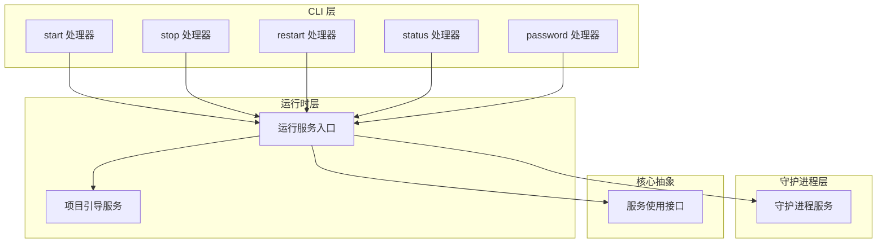
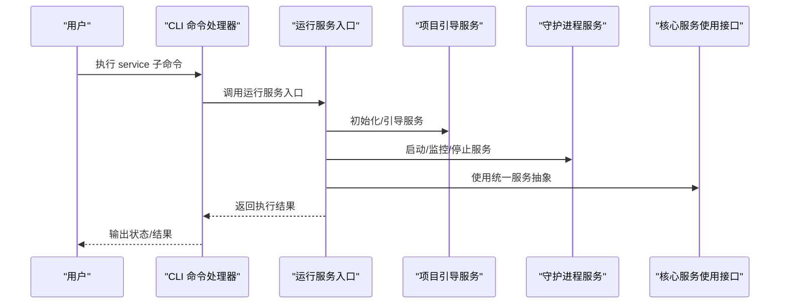
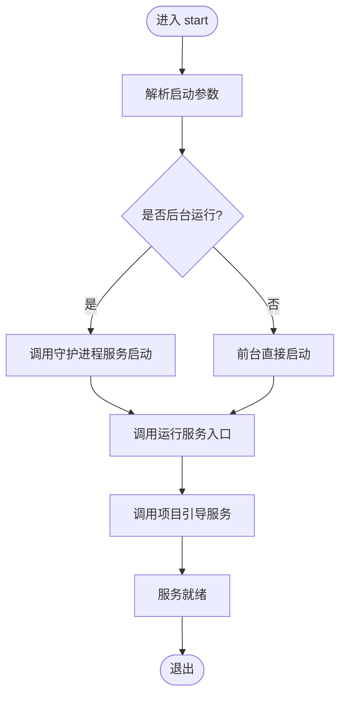
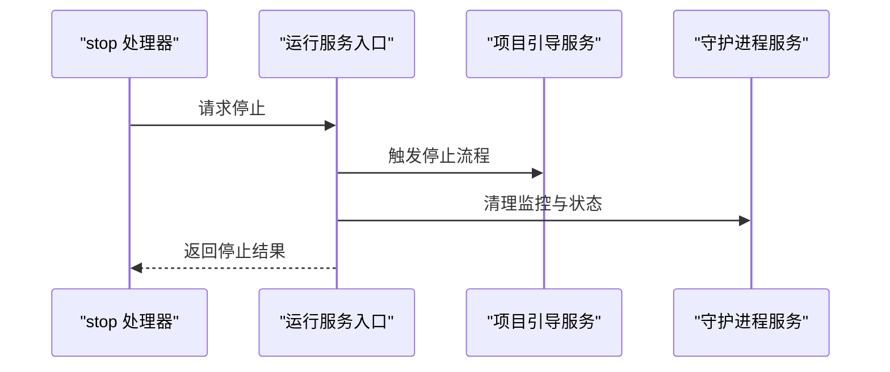
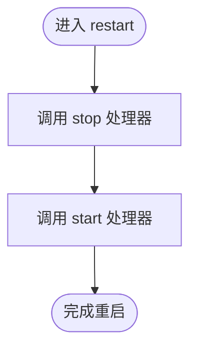
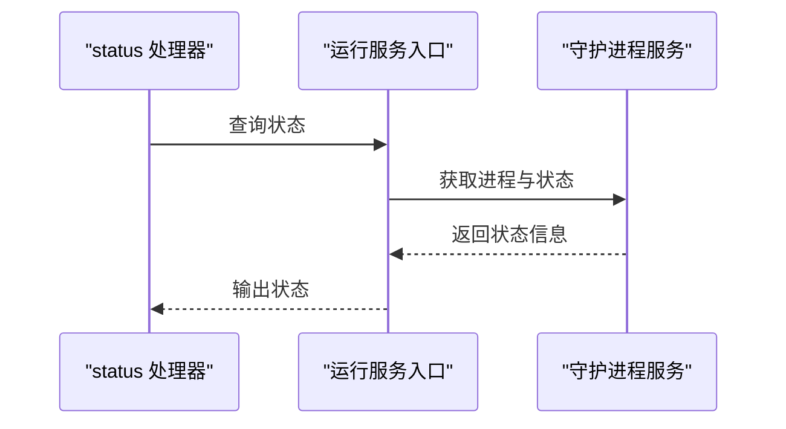
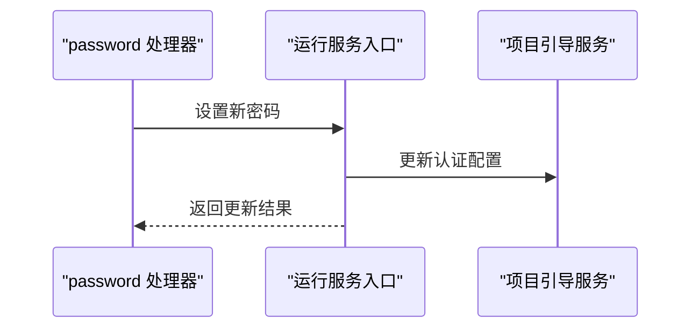
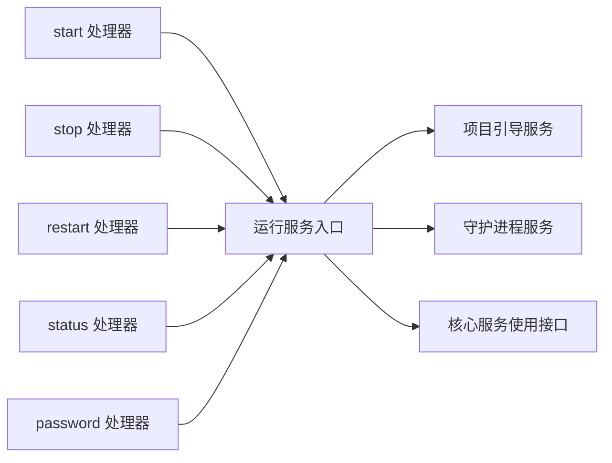

# 服务管理

<cite>
**本文引用的文件**
- [packages/cli/src/commands/handlers/service/password.ts](file://packages/cli/src/commands/handlers/service/password.ts)
- [packages/cli/src/commands/handlers/service/restart.ts](file://packages/cli/src/commands/handlers/service/restart.ts)
- [packages/cli/src/commands/handlers/service/start.ts](file://packages/cli/src/commands/handlers/service/start.ts)
- [packages/cli/src/commands/handlers/service/status.ts](file://packages/cli/src/commands/handlers/service/status.ts)
- [packages/cli/src/commands/handlers/service/stop.ts](file://packages/cli/src/commands/handlers/service/stop.ts)
- [packages/cli/src/services/daemon.ts](file://packages/cli/src/services/daemon.ts)
- [packages/opencode/src/effect/run-service.ts](file://packages/opencode/src/effect/run-service.ts)
- [packages/opencode/src/project/bootstrap-service.ts](file://packages/opencode/src/project/bootstrap-service.ts)
- [packages/core/src/effect/service-use.ts](file://packages/core/src/effect/service-use.ts)
</cite>

## 目录
1. [简介](#简介)
2. [项目结构](#项目结构)
3. [核心组件](#核心组件)
4. [架构总览](#架构总览)
5. [详细组件分析](#详细组件分析)
6. [依赖关系分析](#依赖关系分析)
7. [性能考虑](#性能考虑)
8. [故障排查指南](#故障排查指南)
9. [结论](#结论)
10. [附录](#附录)

## 简介
本指南面向 OpenCode CLI 的服务管理能力，聚焦 service 子命令组（start、stop、restart、status、password）的使用与运维实践。内容涵盖服务生命周期管理、后台运行模式、进程监控、配置文件管理、自定义选项、系统集成（如开机自启动）、性能监控与日志管理最佳实践，以及启动失败的诊断与常见问题解决路径。

## 项目结构
OpenCode CLI 的服务管理由 CLI 命令处理器与底层运行时/引导模块协同完成：
- CLI 层：service 子命令的各处理器分别对应 start、stop、restart、status、password 等操作。
- 运行时层：通过运行服务入口与项目引导服务，负责实际的服务启动、停止与状态查询。
- 守护进程服务：封装后台运行、进程监控与状态维护逻辑。
- 核心服务使用接口：为上层提供统一的服务使用抽象。

**图表来源**
- [packages/cli/src/commands/handlers/service/start.ts](file://packages/cli/src/commands/handlers/service/start.ts)
- [packages/cli/src/commands/handlers/service/stop.ts](file://packages/cli/src/commands/handlers/service/stop.ts)
- [packages/cli/src/commands/handlers/service/restart.ts](file://packages/cli/src/commands/handlers/service/restart.ts)
- [packages/cli/src/commands/handlers/service/status.ts](file://packages/cli/src/commands/handlers/service/status.ts)
- [packages/cli/src/commands/handlers/service/password.ts](file://packages/cli/src/commands/handlers/service/password.ts)
- [packages/opencode/src/effect/run-service.ts](file://packages/opencode/src/effect/run-service.ts)
- [packages/opencode/src/project/bootstrap-service.ts](file://packages/opencode/src/project/bootstrap-service.ts)
- [packages/cli/src/services/daemon.ts](file://packages/cli/src/services/daemon.ts)
- [packages/core/src/effect/service-use.ts](file://packages/core/src/effect/service-use.ts)

**章节来源**
- [packages/cli/src/commands/handlers/service/start.ts](file://packages/cli/src/commands/handlers/service/start.ts)
- [packages/cli/src/commands/handlers/service/stop.ts](file://packages/cli/src/commands/handlers/service/stop.ts)
- [packages/cli/src/commands/handlers/service/restart.ts](file://packages/cli/src/commands/handlers/service/restart.ts)
- [packages/cli/src/commands/handlers/service/status.ts](file://packages/cli/src/commands/handlers/service/status.ts)
- [packages/cli/src/commands/handlers/service/password.ts](file://packages/cli/src/commands/handlers/service/password.ts)
- [packages/opencode/src/effect/run-service.ts](file://packages/opencode/src/effect/run-service.ts)
- [packages/opencode/src/project/bootstrap-service.ts](file://packages/opencode/src/project/bootstrap-service.ts)
- [packages/cli/src/services/daemon.ts](file://packages/cli/src/services/daemon.ts)
- [packages/core/src/effect/service-use.ts](file://packages/core/src/effect/service-use.ts)

## 核心组件
- start：启动服务，支持后台运行模式与参数传递；调用运行服务入口与守护进程服务以完成实际启动与监控。
- stop：停止服务，通过运行服务入口触发停止流程并清理状态。
- restart：组合 stop 与 start 的原子重启操作，确保服务平滑切换。
- status：查询服务当前状态（运行中/已停止/异常），返回可读信息供用户或自动化脚本使用。
- password：设置或更新服务访问密码，用于后续登录认证与安全控制。

上述组件均位于 CLI 命令处理器目录下，通过统一的运行服务入口与守护进程服务协作，实现跨平台的服务生命周期管理。

**章节来源**
- [packages/cli/src/commands/handlers/service/start.ts](file://packages/cli/src/commands/handlers/service/start.ts)
- [packages/cli/src/commands/handlers/service/stop.ts](file://packages/cli/src/commands/handlers/service/stop.ts)
- [packages/cli/src/commands/handlers/service/restart.ts](file://packages/cli/src/commands/handlers/service/restart.ts)
- [packages/cli/src/commands/handlers/service/status.ts](file://packages/cli/src/commands/handlers/service/status.ts)
- [packages/cli/src/commands/handlers/service/password.ts](file://packages/cli/src/commands/handlers/service/password.ts)

## 架构总览
服务管理的端到端流程如下：CLI 命令处理器接收用户输入，调用运行服务入口；运行服务入口协调项目引导服务与守护进程服务，完成服务的启动、停止、重启、状态查询与密码设置；核心服务使用接口提供统一抽象，便于扩展与测试。

**图表来源**
- [packages/cli/src/commands/handlers/service/start.ts](file://packages/cli/src/commands/handlers/service/start.ts)
- [packages/cli/src/commands/handlers/service/stop.ts](file://packages/cli/src/commands/handlers/service/stop.ts)
- [packages/cli/src/commands/handlers/service/restart.ts](file://packages/cli/src/commands/handlers/service/restart.ts)
- [packages/cli/src/commands/handlers/service/status.ts](file://packages/cli/src/commands/handlers/service/status.ts)
- [packages/cli/src/commands/handlers/service/password.ts](file://packages/cli/src/commands/handlers/service/password.ts)
- [packages/opencode/src/effect/run-service.ts](file://packages/opencode/src/effect/run-service.ts)
- [packages/opencode/src/project/bootstrap-service.ts](file://packages/opencode/src/project/bootstrap-service.ts)
- [packages/cli/src/services/daemon.ts](file://packages/cli/src/services/daemon.ts)
- [packages/core/src/effect/service-use.ts](file://packages/core/src/effect/service-use.ts)

## 详细组件分析

### start 组件
- 功能职责：解析启动参数，选择后台运行模式，调用运行服务入口执行启动。
- 关键交互：与运行服务入口协作进行初始化；与守护进程服务协作进行后台运行与监控。
- 典型场景：首次启动、从停止状态恢复、带自定义参数启动。

**图表来源**
- [packages/cli/src/commands/handlers/service/start.ts](file://packages/cli/src/commands/handlers/service/start.ts)
- [packages/opencode/src/effect/run-service.ts](file://packages/opencode/src/effect/run-service.ts)
- [packages/opencode/src/project/bootstrap-service.ts](file://packages/opencode/src/project/bootstrap-service.ts)
- [packages/cli/src/services/daemon.ts](file://packages/cli/src/services/daemon.ts)

**章节来源**
- [packages/cli/src/commands/handlers/service/start.ts](file://packages/cli/src/commands/handlers/service/start.ts)
- [packages/cli/src/services/daemon.ts](file://packages/cli/src/services/daemon.ts)
- [packages/opencode/src/effect/run-service.ts](file://packages/opencode/src/effect/run-service.ts)
- [packages/opencode/src/project/bootstrap-service.ts](file://packages/opencode/src/project/bootstrap-service.ts)

### stop 组件
- 功能职责：请求停止正在运行的服务，清理临时状态与资源。
- 关键交互：通过运行服务入口触发停止流程，确保幂等与一致性。

**图表来源**
- [packages/cli/src/commands/handlers/service/stop.ts](file://packages/cli/src/commands/handlers/service/stop.ts)
- [packages/opencode/src/effect/run-service.ts](file://packages/opencode/src/effect/run-service.ts)
- [packages/opencode/src/project/bootstrap-service.ts](file://packages/opencode/src/project/bootstrap-service.ts)
- [packages/cli/src/services/daemon.ts](file://packages/cli/src/services/daemon.ts)

**章节来源**
- [packages/cli/src/commands/handlers/service/stop.ts](file://packages/cli/src/commands/handlers/service/stop.ts)
- [packages/opencode/src/effect/run-service.ts](file://packages/opencode/src/effect/run-service.ts)
- [packages/opencode/src/project/bootstrap-service.ts](file://packages/opencode/src/project/bootstrap-service.ts)
- [packages/cli/src/services/daemon.ts](file://packages/cli/src/services/daemon.ts)

### restart 组件
- 功能职责：原子性地先停止再启动服务，保证状态一致与最小中断。
- 关键交互：复用 stop 与 start 的处理逻辑，确保顺序与幂等。

**图表来源**
- [packages/cli/src/commands/handlers/service/restart.ts](file://packages/cli/src/commands/handlers/service/restart.ts)
- [packages/cli/src/commands/handlers/service/stop.ts](file://packages/cli/src/commands/handlers/service/stop.ts)
- [packages/cli/src/commands/handlers/service/start.ts](file://packages/cli/src/commands/handlers/service/start.ts)

**章节来源**
- [packages/cli/src/commands/handlers/service/restart.ts](file://packages/cli/src/commands/handlers/service/restart.ts)
- [packages/cli/src/commands/handlers/service/stop.ts](file://packages/cli/src/commands/handlers/service/stop.ts)
- [packages/cli/src/commands/handlers/service/start.ts](file://packages/cli/src/commands/handlers/service/start.ts)

### status 组件
- 功能职责：查询服务当前状态（运行中/已停止/异常），输出可读信息。
- 关键交互：通过运行服务入口与守护进程服务获取实时状态。

**图表来源**
- [packages/cli/src/commands/handlers/service/status.ts](file://packages/cli/src/commands/handlers/service/status.ts)
- [packages/opencode/src/effect/run-service.ts](file://packages/opencode/src/effect/run-service.ts)
- [packages/cli/src/services/daemon.ts](file://packages/cli/src/services/daemon.ts)

**章节来源**
- [packages/cli/src/commands/handlers/service/status.ts](file://packages/cli/src/commands/handlers/service/status.ts)
- [packages/opencode/src/effect/run-service.ts](file://packages/opencode/src/effect/run-service.ts)
- [packages/cli/src/services/daemon.ts](file://packages/cli/src/services/daemon.ts)

### password 组件
- 功能职责：设置或更新服务访问密码，用于后续登录认证与安全控制。
- 关键交互：通过运行服务入口更新认证凭据并持久化。

**图表来源**
- [packages/cli/src/commands/handlers/service/password.ts](file://packages/cli/src/commands/handlers/service/password.ts)
- [packages/opencode/src/effect/run-service.ts](file://packages/opencode/src/effect/run-service.ts)
- [packages/opencode/src/project/bootstrap-service.ts](file://packages/opencode/src/project/bootstrap-service.ts)

**章节来源**
- [packages/cli/src/commands/handlers/service/password.ts](file://packages/cli/src/commands/handlers/service/password.ts)
- [packages/opencode/src/effect/run-service.ts](file://packages/opencode/src/effect/run-service.ts)
- [packages/opencode/src/project/bootstrap-service.ts](file://packages/opencode/src/project/bootstrap-service.ts)

## 依赖关系分析
- CLI 命令处理器依赖运行服务入口与守护进程服务，形成清晰的分层。
- 运行服务入口进一步依赖项目引导服务与核心服务使用接口，实现可扩展与可测试的架构。
- 守护进程服务负责后台运行与进程监控，是服务稳定性的关键。

**图表来源**
- [packages/cli/src/commands/handlers/service/start.ts](file://packages/cli/src/commands/handlers/service/start.ts)
- [packages/cli/src/commands/handlers/service/stop.ts](file://packages/cli/src/commands/handlers/service/stop.ts)
- [packages/cli/src/commands/handlers/service/restart.ts](file://packages/cli/src/commands/handlers/service/restart.ts)
- [packages/cli/src/commands/handlers/service/status.ts](file://packages/cli/src/commands/handlers/service/status.ts)
- [packages/cli/src/commands/handlers/service/password.ts](file://packages/cli/src/commands/handlers/service/password.ts)
- [packages/opencode/src/effect/run-service.ts](file://packages/opencode/src/effect/run-service.ts)
- [packages/opencode/src/project/bootstrap-service.ts](file://packages/opencode/src/project/bootstrap-service.ts)
- [packages/cli/src/services/daemon.ts](file://packages/cli/src/services/daemon.ts)
- [packages/core/src/effect/service-use.ts](file://packages/core/src/effect/service-use.ts)

**章节来源**
- [packages/cli/src/commands/handlers/service/start.ts](file://packages/cli/src/commands/handlers/service/start.ts)
- [packages/cli/src/commands/handlers/service/stop.ts](file://packages/cli/src/commands/handlers/service/stop.ts)
- [packages/cli/src/commands/handlers/service/restart.ts](file://packages/cli/src/commands/handlers/service/restart.ts)
- [packages/cli/src/commands/handlers/service/status.ts](file://packages/cli/src/commands/handlers/service/status.ts)
- [packages/cli/src/commands/handlers/service/password.ts](file://packages/cli/src/commands/handlers/service/password.ts)
- [packages/opencode/src/effect/run-service.ts](file://packages/opencode/src/effect/run-service.ts)
- [packages/opencode/src/project/bootstrap-service.ts](file://packages/opencode/src/project/bootstrap-service.ts)
- [packages/cli/src/services/daemon.ts](file://packages/cli/src/services/daemon.ts)
- [packages/core/src/effect/service-use.ts](file://packages/core/src/effect/service-use.ts)

## 性能考虑
- 后台运行与监控：优先采用守护进程服务进行后台运行与进程监控，降低 CLI 会话期间的资源占用。
- 幂等与快速反馈：status 与 restart 应尽量减少阻塞，优先返回缓存状态或快速探测结果。
- 配置加载优化：在运行服务入口中对配置进行预热与校验，避免启动阶段的重复 IO。
- 日志分级：区分 INFO/WARN/ERROR 级别，避免在高频状态查询中产生大量冗余日志。

## 故障排查指南
- 启动失败
  - 检查端口占用与权限：确认监听端口未被占用且具备绑定权限。
  - 查看状态与日志：使用 status 获取服务状态，结合守护进程服务的日志定位异常。
  - 密码问题：若涉及认证，使用 password 重新设置并验证。
- 进程异常退出
  - 使用守护进程服务检查最近一次退出码与时间点，结合运行服务入口的错误上报定位根因。
- 权限与环境变量
  - 确认运行所需的环境变量已正确设置，尤其是与认证、存储、网络相关的变量。
- 幂等性与一致性
  - 对于 restart，确保 stop 成功后再执行 start，避免并发冲突。

**章节来源**
- [packages/cli/src/commands/handlers/service/status.ts](file://packages/cli/src/commands/handlers/service/status.ts)
- [packages/cli/src/commands/handlers/service/password.ts](file://packages/cli/src/commands/handlers/service/password.ts)
- [packages/cli/src/services/daemon.ts](file://packages/cli/src/services/daemon.ts)
- [packages/opencode/src/effect/run-service.ts](file://packages/opencode/src/effect/run-service.ts)

## 结论
OpenCode CLI 的服务管理通过清晰的分层设计与统一的运行服务入口，实现了对服务生命周期的可靠控制。配合守护进程服务与核心抽象，既满足日常运维需求，也为扩展与集成提供了良好基础。建议在生产环境中结合日志与监控策略，持续优化启动性能与稳定性。

## 附录
- 系统集成建议
  - 开机自启动：在操作系统层面配置服务管理器（如 systemd 或 Windows 服务），指向 CLI 的 start 命令与相应配置文件。
  - 服务注册：将 CLI 可执行文件加入系统 PATH，并通过别名或包装脚本简化常用参数。
- 配置文件管理
  - 将敏感配置（如密码）置于受控的配置文件中，使用最小权限原则与加密存储。
  - 在运行服务入口中对配置进行校验与回退策略，确保服务可用性。
- 自定义选项
  - 通过 CLI 参数与环境变量组合，实现灵活的启动行为定制（如端口、主机名、调试级别等）。
- 性能监控与日志管理
  - 使用守护进程服务记录进程健康指标与退出原因，定期归档日志并设置轮转策略。
  - 在运行服务入口中增加轻量级指标采集与上报通道，便于集中监控。