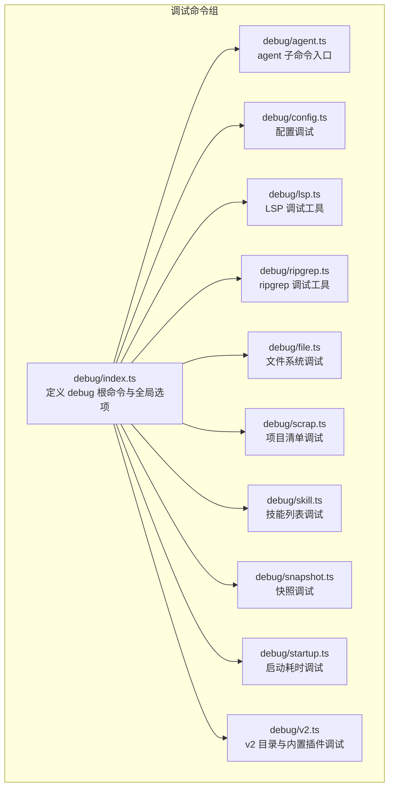
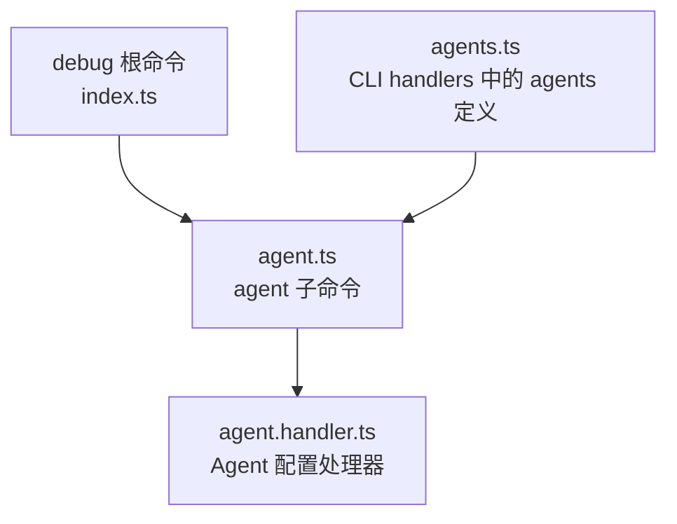
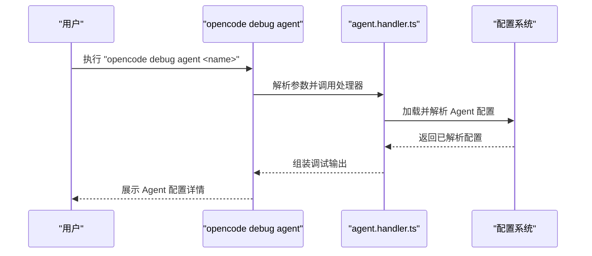
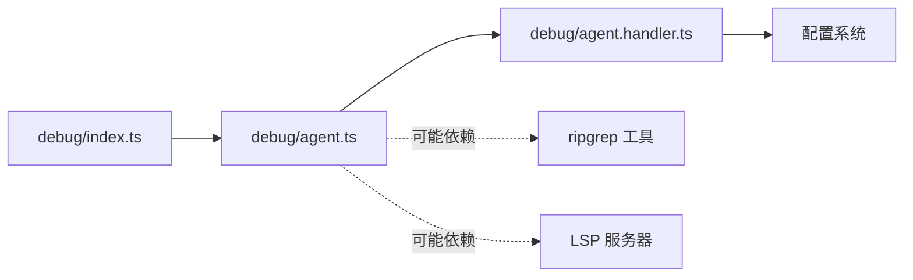

# 调试命令

<cite>
**本文引用的文件**
- [packages/opencode/src/cli/cmd/debug/index.ts](file://packages/opencode/src/cli/cmd/debug/index.ts)
- [packages/opencode/src/cli/cmd/debug/agent.ts](file://packages/opencode/src/cli/cmd/debug/agent.ts)
- [packages/opencode/src/cli/cmd/debug/agent.handler.ts](file://packages/opencode/src/cli/cmd/debug/agent.handler.ts)
- [packages/opencode/src/cli/cmd/debug/config.ts](file://packages/opencode/src/cli/cmd/debug/config.ts)
- [packages/opencode/src/cli/cmd/debug/lsp.ts](file://packages/opencode/src/cli/cmd/debug/lsp.ts)
- [packages/opencode/src/cli/cmd/debug/ripgrep.ts](file://packages/opencode/src/cli/cmd/debug/ripgrep.ts)
- [packages/opencode/src/cli/cmd/debug/file.ts](file://packages/opencode/src/cli/cmd/debug/file.ts)
- [packages/opencode/src/cli/cmd/debug/scrap.ts](file://packages/opencode/src/cli/cmd/debug/scrap.ts)
- [packages/opencode/src/cli/cmd/debug/skill.ts](file://packages/opencode/src/cli/cmd/debug/skill.ts)
- [packages/opencode/src/cli/cmd/debug/snapshot.ts](file://packages/opencode/src/cli/cmd/debug/snapshot.ts)
- [packages/opencode/src/cli/cmd/debug/startup.ts](file://packages/opencode/src/cli/cmd/debug/startup.ts)
- [packages/opencode/src/cli/cmd/debug/v2.ts](file://packages/opencode/src/cli/cmd/debug/v2.ts)
- [packages/cli/src/commands/handlers/debug/agents.ts](file://packages/cli/src/commands/handlers/debug/agents.ts)
- [packages/opencode/test/cli/help/__snapshots__/help-snapshots.test.ts.snap](file://packages/opencode/test/cli/help/__snapshots__/help-snapshots.test.ts.snap)
</cite>

## 目录
1. [简介](#简介)
2. [项目结构](#项目结构)
3. [核心组件](#核心组件)
4. [架构总览](#架构总览)
5. [详细组件分析](#详细组件分析)
6. [依赖关系分析](#依赖关系分析)
7. [性能考量](#性能考量)
8. [故障排查指南](#故障排查指南)
9. [结论](#结论)
10. [附录](#附录)

## 简介
本指南面向 OpenCode CLI 的调试命令使用者，系统性讲解 debug 子命令组的功能与用法，重点覆盖 agents 调试能力、调试模式工作原理与启用方式、调试输出的解读与分析技巧、常见调试场景（Agent 行为检查、插件调试、会话跟踪等）、调试信息的过滤与筛选方法，以及调试工具与其它 CLI 命令的协同使用策略。同时给出调试过程中的性能影响评估与优化建议。

## 项目结构
OpenCode CLI 的 debug 子命令由一组独立的命令模块组成，每个模块负责一类调试能力。整体采用“命令分组 + 具体子命令”的组织方式，便于按需启用与扩展。

图表来源
- [packages/opencode/src/cli/cmd/debug/index.ts](file://packages/opencode/src/cli/cmd/debug/index.ts)
- [packages/opencode/src/cli/cmd/debug/agent.ts](file://packages/opencode/src/cli/cmd/debug/agent.ts)
- [packages/opencode/src/cli/cmd/debug/config.ts](file://packages/opencode/src/cli/cmd/debug/config.ts)
- [packages/opencode/src/cli/cmd/debug/lsp.ts](file://packages/opencode/src/cli/cmd/debug/lsp.ts)
- [packages/opencode/src/cli/cmd/debug/ripgrep.ts](file://packages/opencode/src/cli/cmd/debug/ripgrep.ts)
- [packages/opencode/src/cli/cmd/debug/file.ts](file://packages/opencode/src/cli/cmd/debug/file.ts)
- [packages/opencode/src/cli/cmd/debug/scrap.ts](file://packages/opencode/src/cli/cmd/debug/scrap.ts)
- [packages/opencode/src/cli/cmd/debug/skill.ts](file://packages/opencode/src/cli/cmd/debug/skill.ts)
- [packages/opencode/src/cli/cmd/debug/snapshot.ts](file://packages/opencode/src/cli/cmd/debug/snapshot.ts)
- [packages/opencode/src/cli/cmd/debug/startup.ts](file://packages/opencode/src/cli/cmd/debug/startup.ts)
- [packages/opencode/src/cli/cmd/debug/v2.ts](file://packages/opencode/src/cli/cmd/debug/v2.ts)

章节来源
- [packages/opencode/src/cli/cmd/debug/index.ts](file://packages/opencode/src/cli/cmd/debug/index.ts)
- [packages/opencode/src/cli/cmd/debug/agent.ts](file://packages/opencode/src/cli/cmd/debug/agent.ts)
- [packages/opencode/src/cli/cmd/debug/config.ts](file://packages/opencode/src/cli/cmd/debug/config.ts)
- [packages/opencode/src/cli/cmd/debug/lsp.ts](file://packages/opencode/src/cli/cmd/debug/lsp.ts)
- [packages/opencode/src/cli/cmd/debug/ripgrep.ts](file://packages/opencode/src/cli/cmd/debug/ripgrep.ts)
- [packages/opencode/src/cli/cmd/debug/file.ts](file://packages/opencode/src/cli/cmd/debug/file.ts)
- [packages/opencode/src/cli/cmd/debug/scrap.ts](file://packages/opencode/src/cli/cmd/debug/scrap.ts)
- [packages/opencode/src/cli/cmd/debug/skill.ts](file://packages/opencode/src/cli/cmd/debug/skill.ts)
- [packages/opencode/src/cli/cmd/debug/snapshot.ts](file://packages/opencode/src/cli/cmd/debug/snapshot.ts)
- [packages/opencode/src/cli/cmd/debug/startup.ts](file://packages/opencode/src/cli/cmd/debug/startup.ts)
- [packages/opencode/src/cli/cmd/debug/v2.ts](file://packages/opencode/src/cli/cmd/debug/v2.ts)

## 核心组件
- debug 根命令：提供统一的调试入口与全局选项（如日志打印、日志级别、禁用外部插件等）。
- agent 子命令：用于查看指定 Agent 的配置详情，辅助进行 Agent 行为检查与问题定位。
- config 子命令：展示已解析的配置，帮助确认运行时配置是否符合预期。
- lsp 子命令：提供 LSP 相关的调试工具，便于排查语言服务问题。
- ripgrep 子命令：提供 ripgrep（rg）相关的调试工具，便于排查文本检索类问题。
- file 子命令：提供文件系统层面的调试工具，便于排查权限、路径、缓存等问题。
- scrap 子命令：列出已知项目，辅助进行项目级问题排查。
- skill 子命令：列出可用技能，辅助排查技能加载或调用异常。
- snapshot 子命令：提供快照调试工具，便于捕获与回放调试状态。
- startup 子命令：打印启动耗时，辅助进行启动性能分析。
- v2 子命令：调试 v2 目录与内置插件，辅助排查版本迁移与插件生命周期问题。

章节来源
- [packages/opencode/test/cli/help/__snapshots__/help-snapshots.test.ts.snap](file://packages/opencode/test/cli/help/__snapshots__/help-snapshots.test.ts.snap)

## 架构总览
debug 子命令组通过统一的根命令注册与路由，将具体调试能力下沉到各子模块。每个子模块独立实现自身逻辑，共享 debug 根命令提供的全局选项（如日志控制、纯运行模式等）。agent 子命令通过 handler 将具体实现解耦，便于扩展与维护。

图表来源
- [packages/opencode/src/cli/cmd/debug/index.ts](file://packages/opencode/src/cli/cmd/debug/index.ts)
- [packages/opencode/src/cli/cmd/debug/agent.handler.ts](file://packages/opencode/src/cli/cmd/debug/agent.handler.ts)
- [packages/opencode/src/cli/cmd/debug/agent.ts](file://packages/opencode/src/cli/cmd/debug/agent.ts)
- [packages/cli/src/commands/handlers/debug/agents.ts](file://packages/cli/src/commands/handlers/debug/agents.ts)

## 详细组件分析

### agent 子命令（Agents 调试）
- 功能概述：显示指定 Agent 的配置细节，用于检查 Agent 的行为与配置是否正确。
- 启用方式：在 debug 根命令下执行，传入目标 Agent 名称作为位置参数。
- 输出解读：关注 Agent 的配置项、模型选择、工具链、权限与上下文设置等，核对与预期是否一致。
- 使用场景：
  - Agent 行为检查：确认配置是否导致行为异常。
  - 插件调试：结合 v2 或其他调试命令，定位插件加载或调用问题。
  - 会话跟踪：结合 snapshot 或 startup，定位会话初始化阶段的问题。

图表来源
- [packages/opencode/src/cli/cmd/debug/agent.ts](file://packages/opencode/src/cli/cmd/debug/agent.ts)
- [packages/opencode/src/cli/cmd/debug/agent.handler.ts](file://packages/opencode/src/cli/cmd/debug/agent.handler.ts)
- [packages/cli/src/commands/handlers/debug/agents.ts](file://packages/cli/src/commands/handlers/debug/agents.ts)

章节来源
- [packages/opencode/src/cli/cmd/debug/agent.ts](file://packages/opencode/src/cli/cmd/debug/agent.ts)
- [packages/opencode/src/cli/cmd/debug/agent.handler.ts](file://packages/opencode/src/cli/cmd/debug/agent.handler.ts)
- [packages/cli/src/commands/handlers/debug/agents.ts](file://packages/cli/src/commands/handlers/debug/agents.ts)

### config 子命令（配置调试）
- 功能概述：展示已解析的配置，帮助确认运行时配置是否符合预期。
- 启用方式：执行 "opencode debug config"。
- 输出解读：关注关键配置键值、环境变量注入、默认值覆盖等，核对与期望一致。
- 使用场景：配置错误导致的行为异常、环境差异引发的问题。

章节来源
- [packages/opencode/src/cli/cmd/debug/config.ts](file://packages/opencode/src/cli/cmd/debug/config.ts)

### lsp 子命令（LSP 调试）
- 功能概述：提供 LSP 相关的调试工具，便于排查语言服务问题。
- 启用方式：执行 "opencode debug lsp"。
- 输出解读：关注 LSP 连接状态、服务器进程、消息往返、协议交互等。
- 使用场景：编辑器集成异常、语言服务无响应、协议不兼容等。

章节来源
- [packages/opencode/src/cli/cmd/debug/lsp.ts](file://packages/opencode/src/cli/cmd/debug/lsp.ts)

### ripgrep 子命令（ripgrep 调试）
- 功能概述：提供 ripgrep（rg）相关的调试工具，便于排查文本检索类问题。
- 启用方式：执行 "opencode debug rg"。
- 输出解读：关注 rg 版本、索引状态、搜索性能、正则匹配等。
- 使用场景：搜索结果异常、性能瓶颈、索引损坏等。

章节来源
- [packages/opencode/src/cli/cmd/debug/ripgrep.ts](file://packages/opencode/src/cli/cmd/debug/ripgrep.ts)

### file 子命令（文件系统调试）
- 功能概述：提供文件系统层面的调试工具，便于排查权限、路径、缓存等问题。
- 启用方式：执行 "opencode debug file"。
- 输出解读：关注路径存在性、权限位、缓存命中率、临时文件清理等。
- 使用场景：权限不足、路径错误、缓存污染等。

章节来源
- [packages/opencode/src/cli/cmd/debug/file.ts](file://packages/opencode/src/cli/cmd/debug/file.ts)

### scrap 子命令（项目清单调试）
- 功能概述：列出已知项目，辅助进行项目级问题排查。
- 启用方式：执行 "opencode debug scrap"。
- 输出解读：关注项目数量、项目元数据、索引完整性等。
- 使用场景：项目缺失、索引不同步、权限问题等。

章节来源
- [packages/opencode/src/cli/cmd/debug/scrap.ts](file://packages/opencode/src/cli/cmd/debug/scrap.ts)

### skill 子命令（技能列表调试）
- 功能概述：列出可用技能，辅助排查技能加载或调用异常。
- 启用方式：执行 "opencode debug skill"。
- 输出解读：关注技能名称、分类、依赖、可用性等。
- 使用场景：技能不可用、依赖缺失、冲突等。

章节来源
- [packages/opencode/src/cli/cmd/debug/skill.ts](file://packages/opencode/src/cli/cmd/debug/skill.ts)

### snapshot 子命令（快照调试）
- 功能概述：提供快照调试工具，便于捕获与回放调试状态。
- 启用方式：执行 "opencode debug snapshot"。
- 输出解读：关注快照生成时间、内容完整性、回放一致性等。
- 使用场景：复现问题、状态对比、回归验证等。

章节来源
- [packages/opencode/src/cli/cmd/debug/snapshot.ts](file://packages/opencode/src/cli/cmd/debug/snapshot.ts)

### startup 子命令（启动耗时调试）
- 功能概述：打印启动耗时，辅助进行启动性能分析。
- 启用方式：执行 "opencode debug startup"。
- 输出解读：关注各阶段耗时、峰值内存、阻塞点等。
- 使用场景：启动缓慢、资源占用高、冷启动问题等。

章节来源
- [packages/opencode/src/cli/cmd/debug/startup.ts](file://packages/opencode/src/cli/cmd/debug/startup.ts)

### v2 子命令（v2 目录与内置插件调试）
- 功能概述：调试 v2 目录与内置插件，辅助排查版本迁移与插件生命周期问题。
- 启用方式：执行 "opencode debug v2"。
- 输出解读：关注目录结构、插件清单、生命周期钩子、版本兼容性等。
- 使用场景：迁移失败、插件冲突、生命周期异常等。

章节来源
- [packages/opencode/src/cli/cmd/debug/v2.ts](file://packages/opencode/src/cli/cmd/debug/v2.ts)

## 依赖关系分析
- 命令耦合：debug 根命令与各子模块松耦合，通过统一注册机制接入；agent 子命令通过 handler 与配置系统解耦。
- 外部依赖：部分子命令可能依赖外部工具（如 rg、LSP 服务器），需确保工具可用且版本兼容。
- 全局选项：所有子命令共享 debug 根命令提供的全局选项（日志打印、日志级别、纯运行模式），便于统一控制调试行为。

图表来源
- [packages/opencode/src/cli/cmd/debug/index.ts](file://packages/opencode/src/cli/cmd/debug/index.ts)
- [packages/opencode/src/cli/cmd/debug/agent.ts](file://packages/opencode/src/cli/cmd/debug/agent.ts)
- [packages/opencode/src/cli/cmd/debug/agent.handler.ts](file://packages/opencode/src/cli/cmd/debug/agent.handler.ts)

章节来源
- [packages/opencode/src/cli/cmd/debug/index.ts](file://packages/opencode/src/cli/cmd/debug/index.ts)
- [packages/opencode/src/cli/cmd/debug/agent.ts](file://packages/opencode/src/cli/cmd/debug/agent.ts)
- [packages/opencode/src/cli/cmd/debug/agent.handler.ts](file://packages/opencode/src/cli/cmd/debug/agent.handler.ts)

## 性能考量
- 日志开销：开启 DEBUG 级别日志会显著增加 I/O 与 CPU 开销，建议仅在定位问题时启用，并尽快恢复到 INFO/WARN。
- 纯运行模式：使用 "--pure" 可避免外部插件带来的额外开销，有助于隔离问题与评估核心性能。
- 工具链成本：某些调试工具（如 rg、LSP）本身具有性能开销，应按需启用并及时退出。
- 启动分析：通过 startup 子命令识别启动瓶颈，优先优化阻塞点与资源加载顺序。
- 缓存与索引：file 与 snapshot 子命令可辅助检查缓存与索引状态，避免因脏数据导致的重复计算与 I/O 放大。

## 故障排查指南
- Agent 行为异常
  - 步骤：使用 "opencode debug agent <name>" 查看配置；结合 "opencode debug v2" 检查插件与目录；必要时使用 "opencode debug snapshot" 捕获状态。
  - 关注点：配置键值、插件生命周期、权限与上下文。
- 插件调试
  - 步骤：使用 "opencode debug v2" 检查内置插件与目录；结合 "opencode debug config" 核对配置；使用 "opencode debug lsp" 排查语言服务问题。
  - 关注点：版本兼容性、生命周期钩子、依赖冲突。
- 会话跟踪
  - 步骤：使用 "opencode debug startup" 分析启动阶段；使用 "opencode debug snapshot" 捕获会话状态；结合 "opencode debug file" 检查缓存与权限。
  - 关注点：启动耗时、状态一致性、缓存命中。
- 文本检索问题
  - 步骤：使用 "opencode debug rg" 检查 rg 状态；核对索引完整性；检查正则表达式与性能。
  - 关注点：索引状态、正则匹配、性能阈值。
- 文件系统问题
  - 步骤：使用 "opencode debug file" 检查路径、权限与缓存；核对临时文件清理策略。
  - 关注点：路径存在性、权限位、缓存污染。

章节来源
- [packages/opencode/src/cli/cmd/debug/agent.ts](file://packages/opencode/src/cli/cmd/debug/agent.ts)
- [packages/opencode/src/cli/cmd/debug/agent.handler.ts](file://packages/opencode/src/cli/cmd/debug/agent.handler.ts)
- [packages/opencode/src/cli/cmd/debug/v2.ts](file://packages/opencode/src/cli/cmd/debug/v2.ts)
- [packages/opencode/src/cli/cmd/debug/config.ts](file://packages/opencode/src/cli/cmd/debug/config.ts)
- [packages/opencode/src/cli/cmd/debug/lsp.ts](file://packages/opencode/src/cli/cmd/debug/lsp.ts)
- [packages/opencode/src/cli/cmd/debug/ripgrep.ts](file://packages/opencode/src/cli/cmd/debug/ripgrep.ts)
- [packages/opencode/src/cli/cmd/debug/file.ts](file://packages/opencode/src/cli/cmd/debug/file.ts)
- [packages/opencode/src/cli/cmd/debug/snapshot.ts](file://packages/opencode/src/cli/cmd/debug/snapshot.ts)
- [packages/opencode/src/cli/cmd/debug/startup.ts](file://packages/opencode/src/cli/cmd/debug/startup.ts)

## 结论
OpenCode CLI 的 debug 子命令组提供了从配置、Agent、插件、文件系统到启动性能的全栈调试能力。通过合理启用调试模式、利用全局选项与专用子命令、结合快照与启动分析，可以高效定位与解决各类问题。建议在生产环境中谨慎开启高粒度日志与外部工具，以平衡诊断效果与性能影响。

## 附录
- 调试模式启用方法
  - 在任意 debug 子命令后添加 "--print-logs" 以将日志输出到标准错误流。
  - 使用 "--log-level" 设置日志级别（DEBUG/INFO/WARN/ERROR）。
  - 使用 "--pure" 禁用外部插件，隔离问题来源。
- 常见命令示例（路径参考）
  - 查看 Agent 配置：[agent.ts](file://packages/opencode/src/cli/cmd/debug/agent.ts)
  - 查看已解析配置：[config.ts](file://packages/opencode/src/cli/cmd/debug/config.ts)
  - LSP 调试：[lsp.ts](file://packages/opencode/src/cli/cmd/debug/lsp.ts)
  - ripgrep 调试：[ripgrep.ts](file://packages/opencode/src/cli/cmd/debug/ripgrep.ts)
  - 文件系统调试：[file.ts](file://packages/opencode/src/cli/cmd/debug/file.ts)
  - 项目清单调试：[scrap.ts](file://packages/opencode/src/cli/cmd/debug/scrap.ts)
  - 技能列表调试：[skill.ts](file://packages/opencode/src/cli/cmd/debug/skill.ts)
  - 快照调试：[snapshot.ts](file://packages/opencode/src/cli/cmd/debug/snapshot.ts)
  - 启动耗时调试：[startup.ts](file://packages/opencode/src/cli/cmd/debug/startup.ts)
  - v2 目录与内置插件调试：[v2.ts](file://packages/opencode/src/cli/cmd/debug/v2.ts)
- 调试输出解读与分析技巧
  - 对比期望与实际：逐项核对配置键值、路径与权限、插件清单。
  - 分层定位：先从 config 与 startup 入手，再深入到 agent、plugin 与 file。
  - 状态快照：在关键节点使用 snapshot 保存现场，便于回放与对比。
  - 性能画像：结合 startup 与 file/snapshot 的缓存指标，识别热点与瓶颈。
- 调试工具与其它 CLI 命令的配合
  - 与 agent 协同：先用 agent 查看配置，再用 v2 检查插件，最后用 snapshot 回放。
  - 与 db/路径/查询：在需要数据库支持时，结合 db 相关命令进行验证。
  - 与 mcp/list 协同：在 MCP 服务器相关问题时，结合 mcp list 与 lsp 进行排查。
- 调试过程中的性能影响评估与优化建议
  - 降低日志级别：定位完成后恢复到 INFO/WARN，减少 I/O。
  - 限制调试范围：仅在必要模块启用 "--pure"，避免不必要的插件加载。
  - 使用快照与增量分析：通过 snapshot 与 startup 的阶段性输出，避免全量重跑。
  - 清理缓存与索引：定期使用 file 与 rg 子命令清理无效缓存，保持性能稳定。