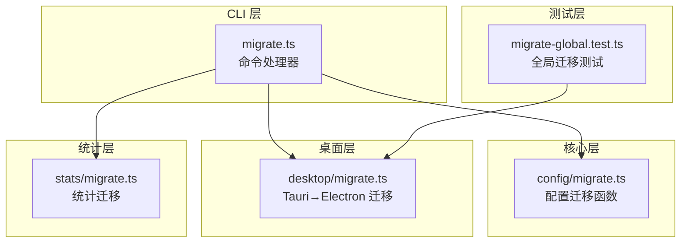
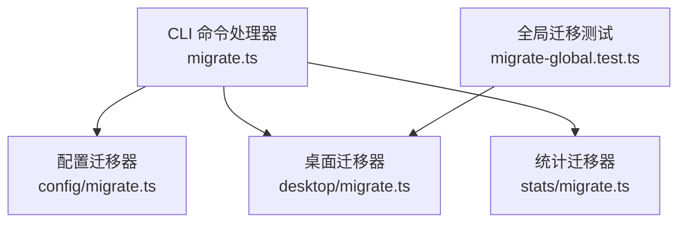
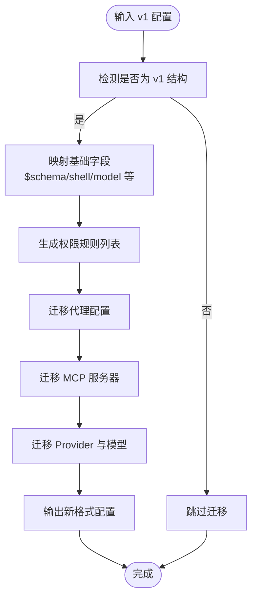
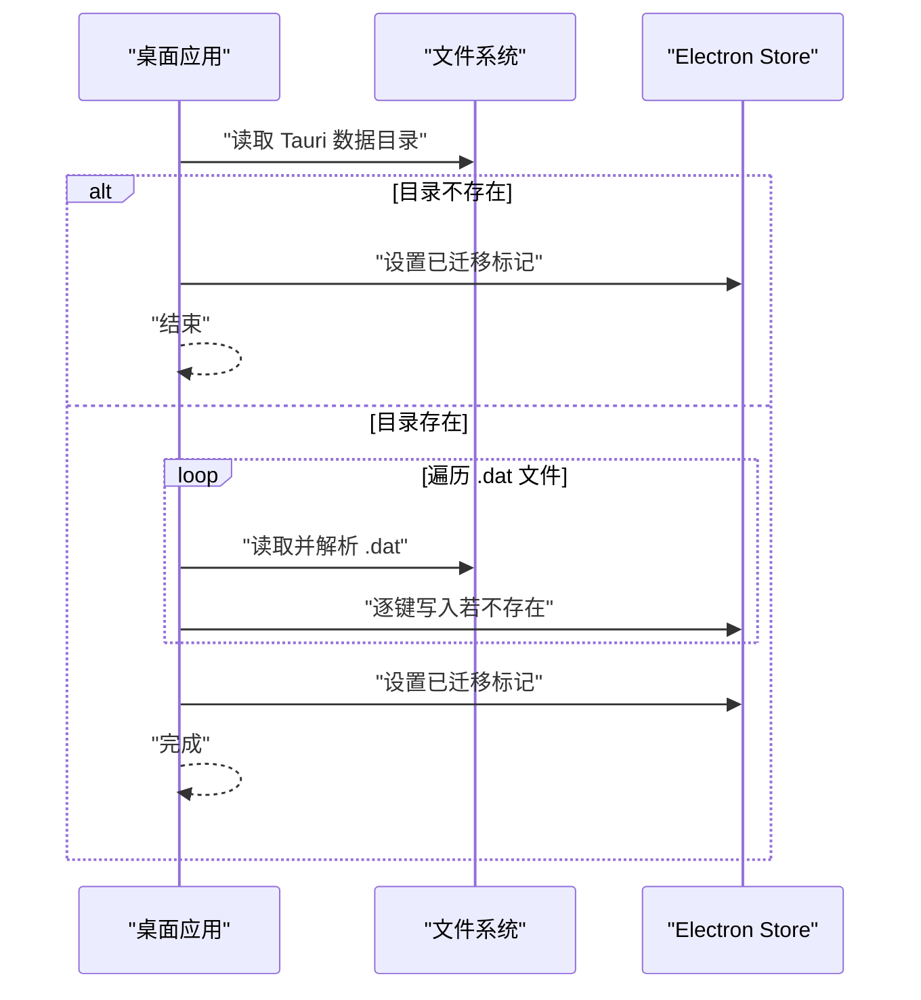
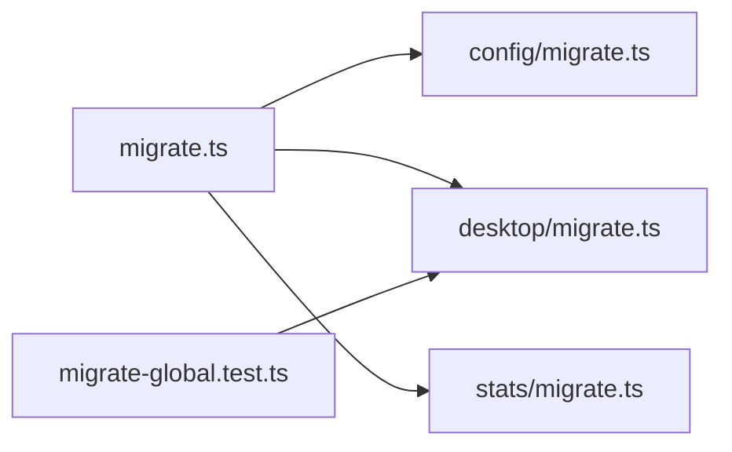

# 迁移命令

<cite>
**本文引用的文件**
- [packages/cli/src/commands/handlers/migrate.ts](file://packages/cli/src/commands/handlers/migrate.ts)
- [packages/core/src/v1/config/migrate.ts](file://packages/core/src/v1/config/migrate.ts)
- [packages/desktop/src/main/migrate.ts](file://packages/desktop/src/main/migrate.ts)
- [packages/opencode/test/project/migrate-global.test.ts](file://packages/opencode/test/project/migrate-global.test.ts)
- [packages/stats/core/src/migrate.ts](file://packages/stats/core/src/migrate.ts)
</cite>

## 目录
1. [简介](#简介)
2. [项目结构](#项目结构)
3. [核心组件](#核心组件)
4. [架构总览](#架构总览)
5. [详细组件分析](#详细组件分析)
6. [依赖分析](#依赖分析)
7. [性能考虑](#性能考虑)
8. [故障排查指南](#故障排查指南)
9. [结论](#结论)
10. [附录](#附录)

## 简介
本指南面向 OpenCode CLI 的“迁移”能力，系统性说明 migrate 子命令的功能、触发条件、执行流程、版本间迁移策略与注意事项、迁移前准备与风险评估、数据验证与完整性检查、失败回滚与恢复策略、批量与增量迁移场景与最佳实践，以及迁移过程中的性能监控与进度跟踪方法。  
当前仓库中存在多处“迁移”实现，分别覆盖配置迁移、桌面应用数据迁移与统计模块迁移等场景。本文将结合各实现给出统一的使用与运维建议。

## 项目结构
围绕“迁移”的关键文件分布如下：
- CLI 层：命令处理器（占位实现）
- 核心层：配置从 v1 到新格式的迁移逻辑
- 桌面层：Tauri 数据到 Electron Store 的迁移
- 测试层：全局迁移行为的测试用例
- 统计层：统计模块的迁移脚本

图表来源
- [packages/cli/src/commands/handlers/migrate.ts:1-6](file://packages/cli/src/commands/handlers/migrate.ts#L1-L6)
- [packages/core/src/v1/config/migrate.ts:1-259](file://packages/core/src/v1/config/migrate.ts#L1-L259)
- [packages/desktop/src/main/migrate.ts:1-92](file://packages/desktop/src/main/migrate.ts#L1-L92)
- [packages/opencode/test/project/migrate-global.test.ts](file://packages/opencode/test/project/migrate-global.test.ts)
- [packages/stats/core/src/migrate.ts](file://packages/stats/core/src/migrate.ts)

章节来源
- [packages/cli/src/commands/handlers/migrate.ts:1-6](file://packages/cli/src/commands/handlers/migrate.ts#L1-L6)
- [packages/core/src/v1/config/migrate.ts:1-259](file://packages/core/src/v1/config/migrate.ts#L1-L259)
- [packages/desktop/src/main/migrate.ts:1-92](file://packages/desktop/src/main/migrate.ts#L1-L92)
- [packages/opencode/test/project/migrate-global.test.ts](file://packages/opencode/test/project/migrate-global.test.ts)
- [packages/stats/core/src/migrate.ts](file://packages/stats/core/src/migrate.ts)

## 核心组件
- CLI 迁移命令处理器：当前为占位实现，输出“无需迁移”的日志提示。
- 配置迁移器：将 v1 配置对象映射到新格式，涵盖权限、代理、MCP、Provider、模型等字段的兼容与转换。
- 桌面迁移器：扫描 Tauri 数据目录，将 .dat 文件逐项迁移到 Electron Store，避免覆盖用户已设置的键值。
- 统计迁移器：提供统计模块的迁移脚本入口。
- 全局迁移测试：验证迁移在全局环境下的行为与幂等性。

章节来源
- [packages/cli/src/commands/handlers/migrate.ts:1-6](file://packages/cli/src/commands/handlers/migrate.ts#L1-L6)
- [packages/core/src/v1/config/migrate.ts:36-73](file://packages/core/src/v1/config/migrate.ts#L36-L73)
- [packages/desktop/src/main/migrate.ts:69-92](file://packages/desktop/src/main/migrate.ts#L69-L92)
- [packages/opencode/test/project/migrate-global.test.ts](file://packages/opencode/test/project/migrate-global.test.ts)
- [packages/stats/core/src/migrate.ts](file://packages/stats/core/src/migrate.ts)

## 架构总览
下图展示 CLI 迁移命令与各迁移实现之间的关系与调用方向：

图表来源
- [packages/cli/src/commands/handlers/migrate.ts:1-6](file://packages/cli/src/commands/handlers/migrate.ts#L1-L6)
- [packages/core/src/v1/config/migrate.ts:1-259](file://packages/core/src/v1/config/migrate.ts#L1-L259)
- [packages/desktop/src/main/migrate.ts:1-92](file://packages/desktop/src/main/migrate.ts#L1-L92)
- [packages/opencode/test/project/migrate-global.test.ts](file://packages/opencode/test/project/migrate-global.test.ts)
- [packages/stats/core/src/migrate.ts](file://packages/stats/core/src/migrate.ts)

## 详细组件分析

### CLI 迁移命令处理器
- 当前实现：直接返回“无需迁移”的日志提示，表明在该版本中无待执行的迁移任务。
- 使用建议：未来可扩展为根据版本号或配置状态判断是否需要执行具体迁移步骤；若存在多个迁移目标（如配置、桌面、统计），应按优先级顺序依次执行并记录进度与结果。

章节来源
- [packages/cli/src/commands/handlers/migrate.ts:1-6](file://packages/cli/src/commands/handlers/migrate.ts#L1-L6)

### 配置迁移器（v1 → 新格式）
- 功能概述：将旧版配置对象映射到新版结构，处理权限规则、代理、MCP、Provider、模型等字段的兼容与转换。
- 关键点：
  - 权限规则归一化与合并，支持工具级默认允许/拒绝与显式规则叠加。
  - 代理（Agent）字段映射，保留温度、top_p 等请求参数。
  - MCP 服务器类型区分（本地/远程），OAuth 参数映射与启用状态处理。
  - Provider 与模型字段映射，包括成本、能力、变体、限制等。
- 复杂度：整体为线性遍历与映射，时间复杂度 O(n)，n 为配置项数量；空间复杂度与输出结构规模一致。

图表来源
- [packages/core/src/v1/config/migrate.ts:31-34](file://packages/core/src/v1/config/migrate.ts#L31-L34)
- [packages/core/src/v1/config/migrate.ts:36-73](file://packages/core/src/v1/config/migrate.ts#L36-L73)
- [packages/core/src/v1/config/migrate.ts:75-92](file://packages/core/src/v1/config/migrate.ts#L75-L92)
- [packages/core/src/v1/config/migrate.ts:98-126](file://packages/core/src/v1/config/migrate.ts#L98-L126)
- [packages/core/src/v1/config/migrate.ts:128-164](file://packages/core/src/v1/config/migrate.ts#L128-L164)
- [packages/core/src/v1/config/migrate.ts:166-190](file://packages/core/src/v1/config/migrate.ts#L166-L190)
- [packages/core/src/v1/config/migrate.ts:192-254](file://packages/core/src/v1/config/migrate.ts#L192-L254)

章节来源
- [packages/core/src/v1/config/migrate.ts:31-34](file://packages/core/src/v1/config/migrate.ts#L31-L34)
- [packages/core/src/v1/config/migrate.ts:36-73](file://packages/core/src/v1/config/migrate.ts#L36-L73)
- [packages/core/src/v1/config/migrate.ts:75-92](file://packages/core/src/v1/config/migrate.ts#L75-L92)
- [packages/core/src/v1/config/migrate.ts:98-126](file://packages/core/src/v1/config/migrate.ts#L98-L126)
- [packages/core/src/v1/config/migrate.ts:128-164](file://packages/core/src/v1/config/migrate.ts#L128-L164)
- [packages/core/src/v1/config/migrate.ts:166-190](file://packages/core/src/v1/config/migrate.ts#L166-L190)
- [packages/core/src/v1/config/migrate.ts:192-254](file://packages/core/src/v1/config/migrate.ts#L192-L254)

### 桌面迁移器（Tauri → Electron Store）
- 功能概述：扫描 Tauri 应用数据目录，将 .dat 文件逐条键值迁移到 Electron Store；对已存在的键值进行跳过，避免覆盖用户设置。
- 触发条件：首次启动或版本升级后执行；通过一个标记键避免重复迁移。
- 执行流程：
  1. 解析平台对应的 Tauri 数据目录路径。
  2. 若目录不存在则标记完成并返回。
  3. 遍历目录中的 .dat 文件，解析 JSON 内容。
  4. 将每个键值写入对应 Store（特殊处理 settings.dat 的映射）。
  5. 记录迁移与跳过的键列表，最后设置完成标记。

图表来源
- [packages/desktop/src/main/migrate.ts:69-92](file://packages/desktop/src/main/migrate.ts#L69-L92)
- [packages/desktop/src/main/migrate.ts:39-67](file://packages/desktop/src/main/migrate.ts#L39-L67)

章节来源
- [packages/desktop/src/main/migrate.ts:13-32](file://packages/desktop/src/main/migrate.ts#L13-L32)
- [packages/desktop/src/main/migrate.ts:39-67](file://packages/desktop/src/main/migrate.ts#L39-L67)
- [packages/desktop/src/main/migrate.ts:69-92](file://packages/desktop/src/main/migrate.ts#L69-L92)

### 统计迁移器
- 作用：提供统计模块的迁移脚本入口，便于后续扩展统计数据结构或存储位置的迁移逻辑。
- 当前状态：作为独立模块存在，具体迁移内容需依据实际需求扩展。

章节来源
- [packages/stats/core/src/migrate.ts](file://packages/stats/core/src/migrate.ts)

### 全局迁移测试
- 作用：验证迁移在全局环境下的行为与幂等性，确保多次运行不会产生副作用。
- 建议：在 CI 中加入迁移前后一致性校验，防止回归问题。

章节来源
- [packages/opencode/test/project/migrate-global.test.ts](file://packages/opencode/test/project/migrate-global.test.ts)

## 依赖分析
- CLI 迁移命令处理器依赖于各迁移实现模块，形成“统一入口 + 多实现并行”的结构。
- 配置迁移器内部依赖 v1 配置类型与模型请求规范化工具，保证字段映射的准确性。
- 桌面迁移器依赖平台路径解析与文件系统 API，以及 Electron Store 的键值写入能力。
- 统计迁移器与全局测试分别独立存在，便于模块化维护与扩展。

图表来源
- [packages/cli/src/commands/handlers/migrate.ts:1-6](file://packages/cli/src/commands/handlers/migrate.ts#L1-L6)
- [packages/core/src/v1/config/migrate.ts:1-259](file://packages/core/src/v1/config/migrate.ts#L1-L259)
- [packages/desktop/src/main/migrate.ts:1-92](file://packages/desktop/src/main/migrate.ts#L1-L92)
- [packages/opencode/test/project/migrate-global.test.ts](file://packages/opencode/test/project/migrate-global.test.ts)
- [packages/stats/core/src/migrate.ts](file://packages/stats/core/src/migrate.ts)

## 性能考虑
- 配置迁移：O(n) 映射，建议在后台异步执行，避免阻塞 CLI 主流程。
- 桌面迁移：I/O 密集型，建议分批处理（按文件或键值分段），并在 UI 或日志中显示进度。
- 统计迁移：根据数据量大小决定是否分页或增量处理，必要时添加索引以提升查询效率。
- 日志与监控：在关键节点输出迁移进度与耗时，便于定位瓶颈。

## 故障排查指南
- 桌面迁移失败
  - 现象：迁移未生效或报错。
  - 排查要点：确认 Tauri 数据目录是否存在、.dat 文件是否可读、Electron Store 是否可写、是否已设置“已迁移”标记导致跳过。
  - 参考路径：[packages/desktop/src/main/migrate.ts:78-82](file://packages/desktop/src/main/migrate.ts#L78-L82)、[packages/desktop/src/main/migrate.ts:43-46](file://packages/desktop/src/main/migrate.ts#L43-L46)
- 配置迁移异常
  - 现象：权限规则缺失或模型字段不正确。
  - 排查要点：核对 v1 配置结构是否符合预期、权限规则是否被正确归一化、MCP/Provider 字段映射是否完整。
  - 参考路径：[packages/core/src/v1/config/migrate.ts:75-92](file://packages/core/src/v1/config/migrate.ts#L75-L92)、[packages/core/src/v1/config/migrate.ts:166-190](file://packages/core/src/v1/config/migrate.ts#L166-L190)
- CLI 迁移无动作
  - 现象：输出“无需迁移”。
  - 排查要点：确认当前版本是否确实没有待迁移任务，或命令处理器是否需要扩展以识别具体迁移目标。
  - 参考路径：[packages/cli/src/commands/handlers/migrate.ts:5-5](file://packages/cli/src/commands/handlers/migrate.ts#L5-L5)

章节来源
- [packages/desktop/src/main/migrate.ts:43-46](file://packages/desktop/src/main/migrate.ts#L43-L46)
- [packages/desktop/src/main/migrate.ts:78-82](file://packages/desktop/src/main/migrate.ts#L78-L82)
- [packages/core/src/v1/config/migrate.ts:75-92](file://packages/core/src/v1/config/migrate.ts#L75-L92)
- [packages/core/src/v1/config/migrate.ts:166-190](file://packages/core/src/v1/config/migrate.ts#L166-L190)
- [packages/cli/src/commands/handlers/migrate.ts:5-5](file://packages/cli/src/commands/handlers/migrate.ts#L5-L5)

## 结论
- 当前 CLI 的 migrate 命令处于占位状态，建议扩展为统一入口，按需调用配置、桌面与统计等迁移实现。
- 配置迁移器提供了从 v1 到新格式的完整映射，具备良好的可维护性与扩展性。
- 桌面迁移器实现了安全的键值迁移策略，避免覆盖用户设置，适合在升级后自动执行。
- 建议在生产环境中引入幂等性测试与进度监控，确保迁移过程可控、可观测、可回滚。

## 附录

### 迁移前准备与风险评估
- 备份策略
  - 配置：备份 v1 配置文件与当前生成的新配置。
  - 桌面：备份 Tauri 数据目录与 Electron Store 的关键键值。
  - 统计：备份统计数据库或导出统计快照。
- 风险评估
  - 幂等性：确保重复执行不会造成副作用。
  - 兼容性：确认新格式字段与下游组件的兼容性。
  - 回滚：准备回退到上一版本的步骤与数据恢复方案。

### 数据验证与完整性检查
- 配置迁移
  - 校验权限规则数量与资源范围是否一致。
  - 校验 MCP/Provider/模型字段映射是否完整且类型正确。
- 桌面迁移
  - 对比迁移前后 Store 键值数量与差异集合。
  - 校验用户自定义键值未被覆盖。
- 统计迁移
  - 校验统计数据总量与关键指标是否一致。

### 回滚与恢复策略
- 回滚步骤
  - 恢复备份的 v1 配置与 Tauri 数据目录。
  - 清理或回退 Electron Store 的迁移键值。
  - 在 CI 中验证回滚后的功能正常。
- 恢复策略
  - 提供一键恢复脚本，记录迁移时间戳以便快速定位。
  - 在 CLI 中增加“回滚”子命令，简化操作。

### 批量与增量迁移
- 批量迁移
  - 场景：首次升级或大规模配置变更。
  - 最佳实践：离线执行、分阶段导入、全量校验。
- 增量迁移
  - 场景：小范围字段调整或热修复。
  - 最佳实践：按模块拆分、记录变更清单、最小化影响范围。

### 性能监控与进度跟踪
- 进度跟踪
  - CLI 输出：在关键步骤打印“开始/完成”日志与耗时。
  - 文件日志：将迁移详情写入日志文件，便于审计。
- 性能监控
  - CPU/内存：监控迁移期间的资源占用峰值。
  - I/O：统计文件读写次数与大小，优化批处理策略。
  - 并发：对 I/O 密集型迁移采用并发控制，避免系统过载。