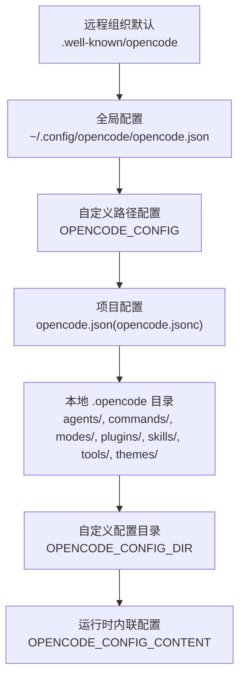
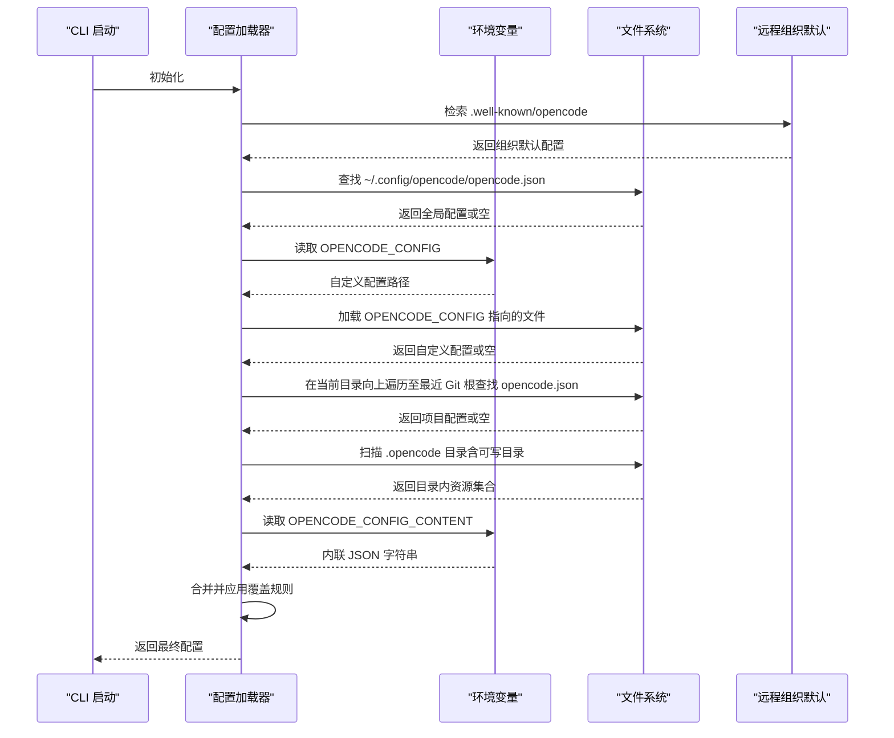
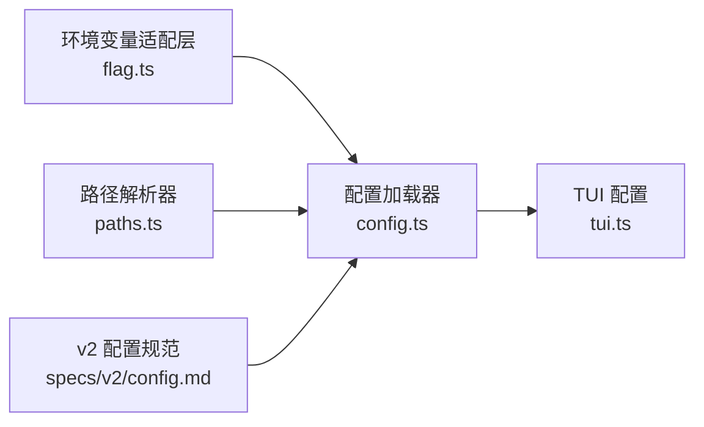

# 配置管理

<cite>
**本文引用的文件**
- [packages/web/src/content/docs/config.mdx](file://packages/web/src/content/docs/config.mdx)
- [packages/web/src/content/docs/tr/config.mdx](file://packages/web/src/content/docs/tr/config.mdx)
- [packages/web/src/content/docs/pl/config.mdx](file://packages/web/src/content/docs/pl/config.mdx)
- [packages/web/src/content/docs/es/config.mdx](file://packages/web/src/content/docs/es/config.mdx)
- [packages/web/src/content/docs/pt-br/config.mdx](file://packages/web/src/content/docs/pt-br/config.mdx)
- [packages/web/src/content/docs/it/config.mdx](file://packages/web/src/content/docs/it/config.mdx)
- [packages/core/src/flag/flag.ts](file://packages/core/src/flag/flag.ts)
- [packages/core/src/global.ts](file://packages/core/src/global.ts)
- [packages/opencode/src/config/config.ts](file://packages/opencode/src/config/config.ts)
- [packages/opencode/src/config/paths.ts](file://packages/opencode/src/config/paths.ts)
- [packages/opencode/src/config/tui.ts](file://packages/opencode/src/config/tui.ts)
- [packages/opencode/src/config/tui-migrate.ts](file://packages/opencode/src/config/tui-migrate.ts)
- [specs/v2/config.md](file://specs/v2/config.md)
- [.opencode/opencode.jsonc](file://.opencode/opencode.jsonc)
- [.opencode/tui.json](file://.opencode/tui.json)
</cite>

## 目录
1. [简介](#简介)
2. [项目结构](#项目结构)
3. [核心组件](#核心组件)
4. [架构总览](#架构总览)
5. [详细组件分析](#详细组件分析)
6. [依赖关系分析](#依赖关系分析)
7. [性能考量](#性能考量)
8. [故障排除指南](#故障排除指南)
9. [结论](#结论)
10. [附录](#附录)

## 简介
本指南面向 OpenCode CLI 的配置管理，系统性阐述配置文件的结构、位置与加载顺序；解释全局配置与项目级配置的区别及优先级规则；提供配置项清单与默认值说明；介绍环境变量的使用与覆盖机制；给出配置模板与最佳实践；涵盖配置迁移与版本兼容处理；并提供故障排除与调试技巧。

## 项目结构
OpenCode 的配置体系由多层级来源构成，按优先级从高到低依次为：远程组织默认、全局用户配置、自定义路径配置、项目配置、本地 .opencode 目录（含可写目录）、运行时内联配置。此外，还支持通过环境变量指定自定义配置目录与内容，实现灵活覆盖。

图示来源
- [packages/web/src/content/docs/config.mdx:41-63](file://packages/web/src/content/docs/config.mdx#L41-L63)
- [packages/web/src/content/docs/tr/config.mdx:41-63](file://packages/web/src/content/docs/tr/config.mdx#L41-L63)
- [packages/web/src/content/docs/pl/config.mdx:41-62](file://packages/web/src/content/docs/pl/config.mdx#L41-L62)
- [packages/web/src/content/docs/es/config.mdx:40-61](file://packages/web/src/content/docs/es/config.mdx#L40-L61)
- [packages/web/src/content/docs/pt-br/config.mdx:41-64](file://packages/web/src/content/docs/pt-br/config.mdx#L41-L64)
- [packages/web/src/content/docs/it/config.mdx:41-63](file://packages/web/src/content/docs/it/config.mdx#L41-L63)

章节来源
- [packages/web/src/content/docs/config.mdx:41-63](file://packages/web/src/content/docs/config.mdx#L41-L63)
- [packages/web/src/content/docs/tr/config.mdx:41-63](file://packages/web/src/content/docs/tr/config.mdx#L41-L63)
- [packages/web/src/content/docs/pl/config.mdx:41-62](file://packages/web/src/content/docs/pl/config.mdx#L41-L62)
- [packages/web/src/content/docs/es/config.mdx:40-61](file://packages/web/src/content/docs/es/config.mdx#L40-L61)
- [packages/web/src/content/docs/pt-br/config.mdx:41-64](file://packages/web/src/content/docs/pt-br/config.mdx#L41-L64)
- [packages/web/src/content/docs/it/config.mdx:41-63](file://packages/web/src/content/docs/it/config.mdx#L41-L63)

## 核心组件
- 配置加载器：负责解析与合并来自不同来源的配置，遵循既定优先级。
- 环境变量适配层：统一读取 OPENCODE_* 系列环境变量，并将其注入到加载流程中。
- 路径解析器：确定配置目录与文件的查找范围，包括当前工作目录、Git 根目录、用户主目录等。
- TUI 配置与迁移：处理 TUI 相关配置以及在升级过程中的迁移逻辑。
- 规范与模式：v2 配置规范文档定义了配置模型与字段约束。

章节来源
- [packages/opencode/src/config/config.ts:249](file://packages/opencode/src/config/config.ts#L249)
- [packages/opencode/src/config/config.ts:323](file://packages/opencode/src/config/config.ts#L323)
- [packages/opencode/src/config/config.ts:399](file://packages/opencode/src/config/config.ts#L399)
- [packages/opencode/src/config/config.ts:400](file://packages/opencode/src/config/config.ts#L400)
- [packages/opencode/src/config/config.ts:416](file://packages/opencode/src/config/config.ts#L416)
- [packages/opencode/src/config/config.ts:466](file://packages/opencode/src/config/config.ts#L466)
- [packages/opencode/src/config/config.ts:467](file://packages/opencode/src/config/config.ts#L467)
- [packages/opencode/src/config/paths.ts:38](file://packages/opencode/src/config/paths.ts#L38)
- [packages/opencode/src/config/tui.ts:169](file://packages/opencode/src/config/tui.ts#L169)
- [packages/opencode/src/config/tui.ts:197](file://packages/opencode/src/config/tui.ts#L197)
- [packages/opencode/src/config/tui-migrate.ts:122](file://packages/opencode/src/config/tui-migrate.ts#L122)
- [specs/v2/config.md](file://specs/v2/config.md)

## 架构总览
下图展示 OpenCode 启动时的配置加载序列，体现各来源的加载顺序与覆盖关系。

图示来源
- [packages/opencode/src/config/config.ts:249](file://packages/opencode/src/config/config.ts#L249)
- [packages/opencode/src/config/config.ts:323](file://packages/opencode/src/config/config.ts#L323)
- [packages/opencode/src/config/config.ts:399](file://packages/opencode/src/config/config.ts#L399)
- [packages/opencode/src/config/config.ts:400](file://packages/opencode/src/config/config.ts#L400)
- [packages/opencode/src/config/config.ts:416](file://packages/opencode/src/config/config.ts#L416)
- [packages/opencode/src/config/config.ts:466](file://packages/opencode/src/config/config.ts#L466)
- [packages/opencode/src/config/config.ts:467](file://packages/opencode/src/config/config.ts#L467)

章节来源
- [packages/opencode/src/config/config.ts:249](file://packages/opencode/src/config/config.ts#L249)
- [packages/opencode/src/config/config.ts:323](file://packages/opencode/src/config/config.ts#L323)
- [packages/opencode/src/config/config.ts:399](file://packages/opencode/src/config/config.ts#L399)
- [packages/opencode/src/config/config.ts:400](file://packages/opencode/src/config/config.ts#L400)
- [packages/opencode/src/config/config.ts:416](file://packages/opencode/src/config/config.ts#L416)
- [packages/opencode/src/config/config.ts:466](file://packages/opencode/src/config/config.ts#L466)
- [packages/opencode/src/config/config.ts:467](file://packages/opencode/src/config/config.ts#L467)

## 详细组件分析

### 配置来源与优先级
- 远程组织默认：通过 .well-known/opencode 获取组织默认配置，最高优先级。
- 全局配置：位于用户主目录下的全局配置文件，用于用户偏好设置。
- 自定义路径配置：通过环境变量 OPENCODE_CONFIG 指定的文件路径，用于临时或特定场景覆盖。
- 项目配置：在项目根目录（向上遍历至最近 Git 根）发现的配置文件，用于项目专属设置。
- 本地 .opencode 目录：标准或可写目录内的 agents/、commands/、modes/、plugins/、skills/、tools/、themes/ 等子目录，用于扩展能力与主题。
- 自定义配置目录：通过环境变量 OPENCODE_CONFIG_DIR 指定的目录，其内容与标准 .opencode 结构一致，可覆盖前述配置。
- 运行时内联配置：通过环境变量 OPENCODE_CONFIG_CONTENT 提供的 JSON 字符串，作为最后的覆盖层。

章节来源
- [packages/web/src/content/docs/config.mdx:41-63](file://packages/web/src/content/docs/config.mdx#L41-L63)
- [packages/web/src/content/docs/tr/config.mdx:41-63](file://packages/web/src/content/docs/tr/config.mdx#L41-L63)
- [packages/web/src/content/docs/pl/config.mdx:41-62](file://packages/web/src/content/docs/pl/config.mdx#L41-L62)
- [packages/web/src/content/docs/es/config.mdx:40-61](file://packages/web/src/content/docs/es/config.mdx#L40-L61)
- [packages/web/src/content/docs/pt-br/config.mdx:41-64](file://packages/web/src/content/docs/pt-br/config.mdx#L41-L64)
- [packages/web/src/content/docs/it/config.mdx:41-63](file://packages/web/src/content/docs/it/config.mdx#L41-L63)

### 环境变量与覆盖机制
- OPENCODE_CONFIG：指向一个额外的配置文件路径，加载顺序位于全局与项目之间。
- OPENCODE_CONFIG_DIR：指定一个自定义配置目录，其内容与标准 .opencode 目录结构一致，加载顺序在全局与 .opencode 之后，可覆盖前两者。
- OPENCODE_CONFIG_CONTENT：以 JSON 字符串形式提供内联配置，作为最后的覆盖层。
- OPENCODE_CONFIG_SCHEMA：用于指定配置模式或校验模式（如仅校验、严格模式等），影响加载与合并策略。

章节来源
- [packages/web/src/content/docs/config.mdx:117-162](file://packages/web/src/content/docs/config.mdx#L117-L162)
- [packages/web/src/content/docs/tr/config.mdx:41-63](file://packages/web/src/content/docs/tr/config.mdx#L41-L63)
- [packages/web/src/content/docs/pl/config.mdx:41-62](file://packages/web/src/content/docs/pl/config.mdx#L41-L62)
- [packages/web/src/content/docs/es/config.mdx:40-61](file://packages/web/src/content/docs/es/config.mdx#L40-L61)
- [packages/web/src/content/docs/pt-br/config.mdx:41-64](file://packages/web/src/content/docs/pt-br/config.mdx#L41-L64)
- [packages/web/src/content/docs/it/config.mdx:41-63](file://packages/web/src/content/docs/it/config.mdx#L41-L63)

### 配置文件结构与默认值
- 全局配置文件：位于用户主目录的全局配置文件，用于保存用户偏好与默认行为。
- 项目配置文件：位于项目根目录的配置文件，用于项目专属设置。
- 本地 .opencode 目录：包含 agents/、commands/、modes/、plugins/、skills/、tools/、themes/ 等子目录，用于扩展能力与主题。
- TUI 配置：TUI 相关的界面与交互配置，通常位于 .opencode/tui.json 中。
- 模式与主题：通过 themes/ 与 modes/ 子目录提供可插拔的主题与模式定义。

章节来源
- [packages/web/src/content/docs/config.mdx:41-63](file://packages/web/src/content/docs/config.mdx#L41-L63)
- [packages/opencode/src/config/paths.ts:38](file://packages/opencode/src/config/paths.ts#L38)
- [packages/opencode/src/config/tui.ts:169](file://packages/opencode/src/config/tui.ts#L169)
- [packages/opencode/src/config/tui.ts:197](file://packages/opencode/src/config/tui.ts#L197)
- [.opencode/opencode.jsonc](file://.opencode/opencode.jsonc)
- [.opencode/tui.json](file://.opencode/tui.json)

### 配置加载与合并流程
- 遍历优先级来源，逐层加载配置。
- 对于同一键，后加载的来源会覆盖先前来源的值。
- 支持对数组类型的配置进行追加或替换，具体策略依据字段语义而定。
- 可写 .opencode 目录与 OPENCODE_CONFIG_DIR 可用于安装插件与写入覆盖，便于团队共享与复用。

章节来源
- [packages/opencode/src/config/config.ts:249](file://packages/opencode/src/config/config.ts#L249)
- [packages/opencode/src/config/config.ts:323](file://packages/opencode/src/config/config.ts#L323)
- [packages/opencode/src/config/config.ts:399](file://packages/opencode/src/config/config.ts#L399)
- [packages/opencode/src/config/config.ts:400](file://packages/opencode/src/config/config.ts#L400)
- [packages/opencode/src/config/config.ts:416](file://packages/opencode/src/config/config.ts#L416)
- [packages/opencode/src/config/config.ts:466](file://packages/opencode/src/config/config.ts#L466)
- [packages/opencode/src/config/config.ts:467](file://packages/opencode/src/config/config.ts#L467)

### 配置模板与最佳实践
- 使用 OPENCODE_CONFIG 指向一个独立的配置文件，便于在 CI 或多环境间切换。
- 将项目专属配置放入项目根目录的配置文件，确保仓库可移植。
- 将团队共享的能力与主题放入可写 .opencode 目录或 OPENCODE_CONFIG_DIR，避免污染上游仓库。
- 使用 OPENCODE_CONFIG_CONTENT 提供一次性覆盖，适合临时调试或演示场景。
- 保持全局配置最小化，仅保留用户偏好；将复杂策略下沉到项目或团队目录。

章节来源
- [packages/web/src/content/docs/config.mdx:117-162](file://packages/web/src/content/docs/config.mdx#L117-L162)
- [packages/opencode/src/config/config.ts:399](file://packages/opencode/src/config/config.ts#L399)
- [packages/opencode/src/config/config.ts:416](file://packages/opencode/src/config/config.ts#L416)
- [packages/opencode/src/config/config.ts:466](file://packages/opencode/src/config/config.ts#L466)

### 配置迁移与版本兼容
- 升级过程中，TUI 配置可能需要迁移，迁移工具会识别并处理可写目录与 OPENCODE_CONFIG 中的文件。
- 当目录结构发生变化（如从单数目录名迁移到复数目录名）时，迁移工具会自动处理兼容性问题。
- 建议在升级前备份可写目录与 OPENCODE_CONFIG，以便回滚。

章节来源
- [packages/opencode/src/config/tui-migrate.ts:122](file://packages/opencode/src/config/tui-migrate.ts#L122)
- [packages/web/src/content/docs/config.mdx:54-56](file://packages/web/src/content/docs/config.mdx#L54-L56)

## 依赖关系分析
- 配置加载器依赖环境变量适配层以获取 OPENCODE_* 参数。
- 路径解析器决定配置目录与文件的查找范围，影响加载顺序与覆盖范围。
- TUI 组件依赖 .opencode/tui.json 与可写目录中的主题与模式。
- v2 配置规范文档为配置模型提供约束与演进方向。

图示来源
- [packages/core/src/flag/flag.ts](file://packages/core/src/flag/flag.ts)
- [packages/opencode/src/config/config.ts](file://packages/opencode/src/config/config.ts)
- [packages/opencode/src/config/paths.ts](file://packages/opencode/src/config/paths.ts)
- [packages/opencode/src/config/tui.ts](file://packages/opencode/src/config/tui.ts)
- [specs/v2/config.md](file://specs/v2/config.md)

章节来源
- [packages/core/src/flag/flag.ts](file://packages/core/src/flag/flag.ts)
- [packages/opencode/src/config/config.ts](file://packages/opencode/src/config/config.ts)
- [packages/opencode/src/config/paths.ts](file://packages/opencode/src/config/paths.ts)
- [packages/opencode/src/config/tui.ts](file://packages/opencode/src/config/tui.ts)
- [specs/v2/config.md](file://specs/v2/config.md)

## 性能考量
- 合理使用 OPENCODE_CONFIG 与 OPENCODE_CONFIG_DIR，避免在启动时扫描过多无关目录。
- 将大型或不常用的配置拆分到可写目录或单独文件，减少主配置体积。
- 在 CI 环境中，尽量使用 OPENCODE_CONFIG_CONTENT 进行最小化覆盖，避免频繁 IO。

## 故障排除指南
- 验证加载顺序：通过日志确认各来源是否被正确加载，检查是否存在重复键导致的意外覆盖。
- 检查环境变量：确认 OPENCODE_CONFIG、OPENCODE_CONFIG_DIR、OPENCODE_CONFIG_CONTENT 是否拼写正确且路径有效。
- 校验 JSON 格式：确保所有配置文件为合法 JSON 或 JSONC，避免语法错误导致加载失败。
- 权限问题：确保可写目录与 OPENCODE_CONFIG_DIR 具有正确的读写权限。
- 版本兼容：若出现目录命名不一致或字段变更，参考迁移工具与 v2 规范文档进行修复。

章节来源
- [packages/opencode/src/config/config.ts:399](file://packages/opencode/src/config/config.ts#L399)
- [packages/opencode/src/config/config.ts:416](file://packages/opencode/src/config/config.ts#L416)
- [packages/opencode/src/config/config.ts:466](file://packages/opencode/src/config/config.ts#L466)
- [packages/opencode/src/config/tui-migrate.ts:122](file://packages/opencode/src/config/tui-migrate.ts#L122)
- [specs/v2/config.md](file://specs/v2/config.md)

## 结论
OpenCode 的配置体系通过清晰的优先级与灵活的覆盖机制，实现了从组织默认到个人偏好的全链路配置管理。建议在日常使用中结合环境变量与可写目录，构建可维护、可迁移、可复用的配置策略。

## 附录
- 配置来源优先级速览
  1) 远程组织默认（.well-known/opencode）
  2) 全局配置（~/.config/opencode/opencode.json）
  3) 自定义路径配置（OPENCODE_CONFIG）
  4) 项目配置（opencode.json）
  5) 本地 .opencode 目录（agents/, commands/, modes/, plugins/, skills/, tools/, themes/）
  6) 自定义配置目录（OPENCODE_CONFIG_DIR）
  7) 运行时内联配置（OPENCODE_CONFIG_CONTENT）

章节来源
- [packages/web/src/content/docs/config.mdx:41-63](file://packages/web/src/content/docs/config.mdx#L41-L63)
- [packages/web/src/content/docs/tr/config.mdx:41-63](file://packages/web/src/content/docs/tr/config.mdx#L41-L63)
- [packages/web/src/content/docs/pl/config.mdx:41-62](file://packages/web/src/content/docs/pl/config.mdx#L41-L62)
- [packages/web/src/content/docs/es/config.mdx:40-61](file://packages/web/src/content/docs/es/config.mdx#L40-L61)
- [packages/web/src/content/docs/pt-br/config.mdx:41-64](file://packages/web/src/content/docs/pt-br/config.mdx#L41-L64)
- [packages/web/src/content/docs/it/config.mdx:41-63](file://packages/web/src/content/docs/it/config.mdx#L41-L63)