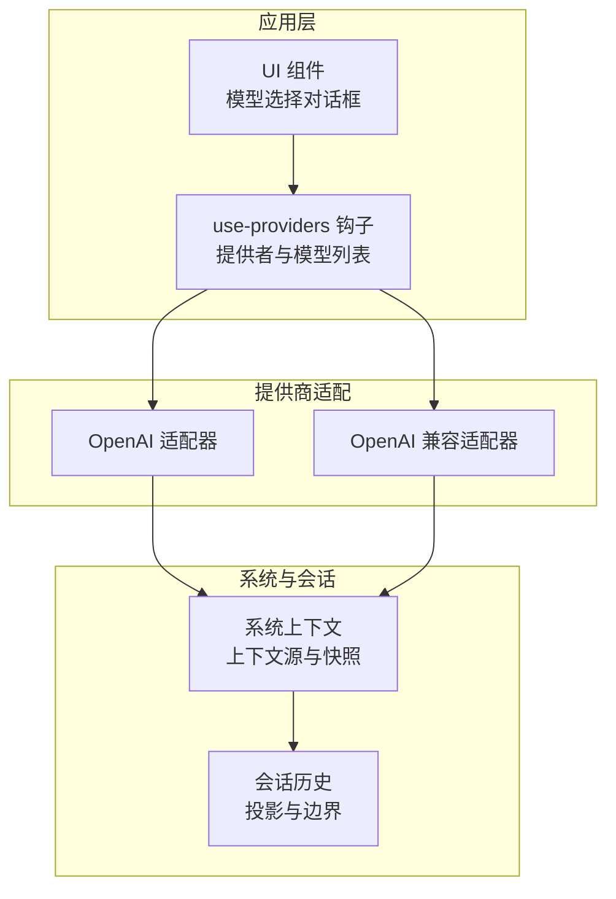
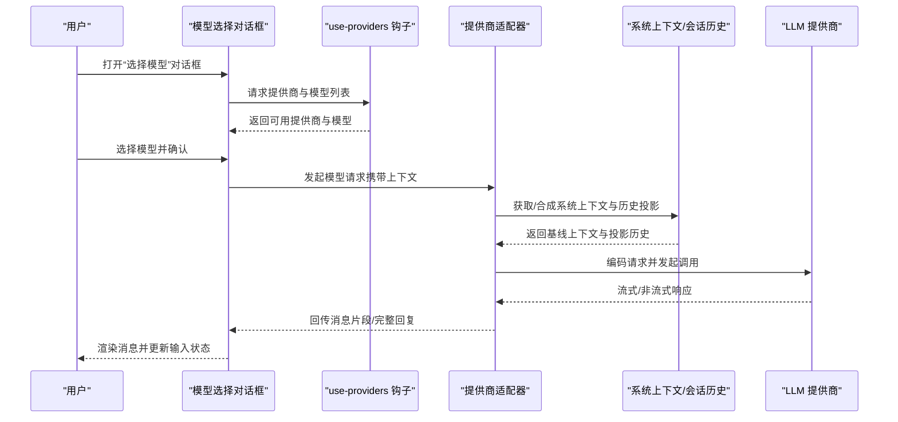
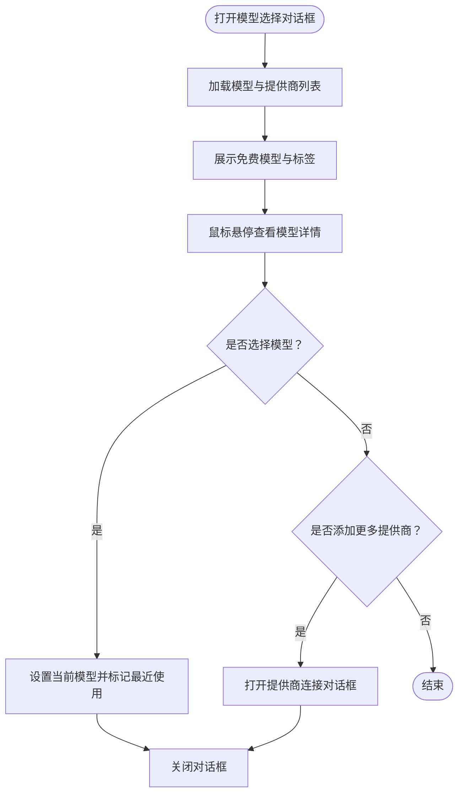
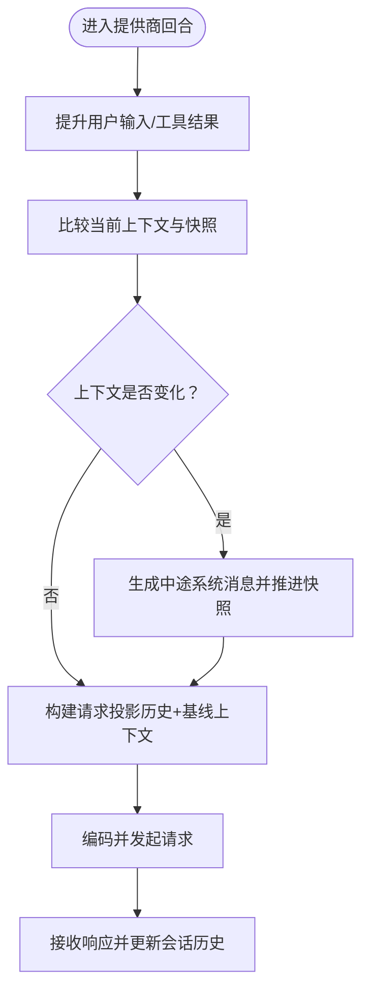
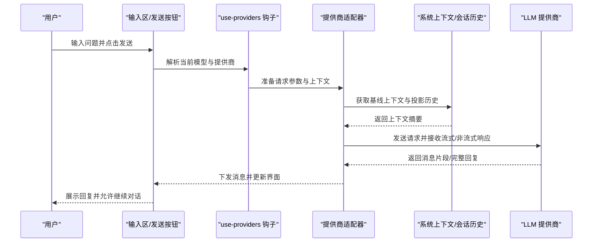
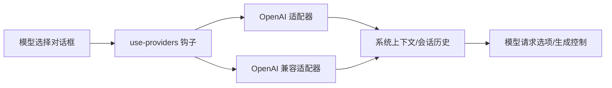

# AI 交互界面

<cite>
**本文引用的文件**
- [README.md](file://README.md)
- [AGENTS.md](file://AGENTS.md)
- [CONTEXT.md](file://CONTEXT.md)
- [dialog-select-model-unpaid.tsx](file://packages/app/src/components/dialog-select-model-unpaid.tsx)
- [aim.ts](file://packages/app/src/utils/aim.ts)
- [openai.ts](file://packages/console/app/src/routes/zen/util/provider/openai.ts)
- [openai-compatible.ts](file://packages/console/app/src/routes/zen/util/provider/openai-compatible.ts)
</cite>

## 目录
1. [简介](#简介)
2. [项目结构](#项目结构)
3. [核心组件](#核心组件)
4. [架构总览](#架构总览)
5. [详细组件分析](#详细组件分析)
6. [依赖关系分析](#依赖关系分析)
7. [性能考量](#性能考量)
8. [故障排查指南](#故障排查指南)
9. [结论](#结论)
10. [附录](#附录)

## 简介
本指南面向 OpenCode Web 应用中的 AI 交互界面，帮助用户高效完成以下目标：
- 理解聊天面板的布局与功能（消息历史、输入区、发送按钮等）
- 掌握与 AI 助手的交互方式（提问技巧、指令格式、上下文管理）
- 选择与切换不同 AI 模型，并理解模型参数与请求选项
- 实践提示工程最佳实践并参考常见使用场景
- 使用对话历史管理、消息导出、会话保存等能力

## 项目结构
OpenCode 的 Web 交互界面由多包协作构成，其中与 AI 交互直接相关的关键位置包括：
- 应用层组件：在应用包中提供模型选择、连接提供商、列表与对话框等 UI 能力
- 提供商适配：在控制台包中提供 OpenAI 及兼容接口的适配器
- 上下文与会话：通过系统上下文与会话运行时实现上下文源、历史投影与安全边界

图表来源
- [dialog-select-model-unpaid.tsx:16-146](file://packages/app/src/components/dialog-select-model-unpaid.tsx#L16-L146)
- [openai.ts](file://packages/console/app/src/routes/zen/util/provider/openai.ts)
- [openai-compatible.ts](file://packages/console/app/src/routes/zen/util/provider/openai-compatible.ts)
- [CONTEXT.md:1-130](file://CONTEXT.md#L1-L130)

章节来源
- [README.md:1-130](file://README.md#L1-L130)

## 核心组件
- 模型选择对话框：用于浏览免费模型、查看模型标签、切换当前模型，并连接新的提供商
- 提供商钩子：提供热门提供商列表、排序与筛选逻辑，支持动态加载更多提供商
- 提供商适配器：封装 OpenAI 与兼容接口的调用细节，负责将系统上下文与会话历史转换为模型请求
- 系统上下文与会话历史：定义上下文源、基线系统上下文、上下文快照、投影历史与安全边界

章节来源
- [dialog-select-model-unpaid.tsx:16-146](file://packages/app/src/components/dialog-select-model-unpaid.tsx#L16-L146)
- [openai.ts](file://packages/console/app/src/routes/zen/util/provider/openai.ts)
- [openai-compatible.ts](file://packages/console/app/src/routes/zen/util/provider/openai-compatible.ts)
- [CONTEXT.md:1-130](file://CONTEXT.md#L1-L130)

## 架构总览
下图展示了从用户交互到模型响应的端到端流程，以及上下文与会话在关键节点的作用。

图表来源
- [dialog-select-model-unpaid.tsx:16-146](file://packages/app/src/components/dialog-select-model-unpaid.tsx#L16-L146)
- [openai.ts](file://packages/console/app/src/routes/zen/util/provider/openai.ts)
- [openai-compatible.ts](file://packages/console/app/src/routes/zen/util/provider/openai-compatible.ts)
- [CONTEXT.md:1-130](file://CONTEXT.md#L1-L130)

## 详细组件分析

### 模型选择与切换组件
该组件提供以下能力：
- 展示免费模型列表与标签（如“免费”“最新”）
- 支持对模型进行 Tooltip 查看详情
- 切换当前模型并记录最近使用
- 连接新的提供商或查看全部提供商

图表来源
- [dialog-select-model-unpaid.tsx:16-146](file://packages/app/src/components/dialog-select-model-unpaid.tsx#L16-L146)

章节来源
- [dialog-select-model-unpaid.tsx:16-146](file://packages/app/src/components/dialog-select-model-unpaid.tsx#L16-L146)

### 提示工程与交互最佳实践
- 明确角色与任务：在消息中清晰描述期望的角色（如开发者、审阅者）与具体任务
- 分步骤与可验证：复杂任务拆分为多步，确保每一步可验证与回溯
- 上下文最小化：仅提供必要的上下文，避免冗余信息干扰模型输出
- 前后一致：保持术语与风格一致，减少歧义
- 结果导向：明确期望的输出格式与质量标准

章节来源
- [AGENTS.md:148-159](file://AGENTS.md#L148-L159)

### 上下文管理与会话边界
- 系统上下文：由多个上下文源组合而成，在一个上下文纪元内保持稳定
- 投影历史：在一次提供商回合前，根据压缩策略与上下文纪元截断生成投影
- 安全边界：在持久化输入提升与工具结算之后，才允许在安全边界处接纳上下文变更
- 中途系统消息：当上下文源发生变化时，会在安全边界处生成一条新的系统消息，告知模型当前有效状态

图表来源
- [CONTEXT.md:39-108](file://CONTEXT.md#L39-L108)

章节来源
- [CONTEXT.md:1-130](file://CONTEXT.md#L1-L130)

### 模型参数与请求选项
- 模型请求选项：来自目录配置与当前会话变体，映射到提供商语义的参数
- 生成控制：与提供商语义分离的采样与输出控制，保证跨提供商一致性
- 兼容适配：对于不支持的字段，通过适配器进行分区与路由

章节来源
- [CONTEXT.md:48-105](file://CONTEXT.md#L48-L105)
- [openai.ts](file://packages/console/app/src/routes/zen/util/provider/openai.ts)
- [openai-compatible.ts](file://packages/console/app/src/routes/zen/util/provider/openai-compatible.ts)

### 交互序列：从提问到响应

图表来源
- [dialog-select-model-unpaid.tsx:16-146](file://packages/app/src/components/dialog-select-model-unpaid.tsx#L16-L146)
- [openai.ts](file://packages/console/app/src/routes/zen/util/provider/openai.ts)
- [openai-compatible.ts](file://packages/console/app/src/routes/zen/util/provider/openai-compatible.ts)
- [CONTEXT.md:1-130](file://CONTEXT.md#L1-L130)

## 依赖关系分析
- 组件耦合：模型选择对话框依赖 use-providers 钩子获取提供商与模型数据；对话框内部通过动态导入打开连接对话框
- 外部集成：提供商适配器负责对接 OpenAI 与兼容接口，屏蔽底层差异
- 上下文契约：系统上下文与会话历史在安全边界处统一注入到请求中，确保一致性与可审计性

图表来源
- [dialog-select-model-unpaid.tsx:16-146](file://packages/app/src/components/dialog-select-model-unpaid.tsx#L16-L146)
- [openai.ts](file://packages/console/app/src/routes/zen/util/provider/openai.ts)
- [openai-compatible.ts](file://packages/console/app/src/routes/zen/util/provider/openai-compatible.ts)
- [CONTEXT.md:48-105](file://CONTEXT.md#L48-L105)

章节来源
- [dialog-select-model-unpaid.tsx:16-146](file://packages/app/src/components/dialog-select-model-unpaid.tsx#L16-L146)
- [openai.ts](file://packages/console/app/src/routes/zen/util/provider/openai.ts)
- [openai-compatible.ts](file://packages/console/app/src/routes/zen/util/provider/openai-compatible.ts)
- [CONTEXT.md:1-130](file://CONTEXT.md#L1-L130)

## 性能考量
- 上下文压缩：在安全边界处进行历史投影与压缩，降低上下文长度，提高响应速度
- 流式输出：优先采用流式响应以改善感知延迟
- 工具输出边界：对工具输出进行有界投影，避免超长文本影响上下文
- 重试与恢复：在不可用上下文阻塞时，等待稳定后再重试，保证一致性

章节来源
- [CONTEXT.md:110-121](file://CONTEXT.md#L110-L121)

## 故障排查指南
- 模型不可用或无响应
  - 检查提供商连接状态与凭据
  - 确认当前模型是否仍在目录中且可用
  - 尝试切换到其他提供商或模型
- 上下文过大导致失败
  - 触发压缩或清理历史，缩短上下文
  - 减少一次性输入的冗余信息
- 响应异常或不一致
  - 在安全边界后重试，确保上下文变更已稳定
  - 检查是否存在中途系统消息未正确注入

章节来源
- [dialog-select-model-unpaid.tsx:16-146](file://packages/app/src/components/dialog-select-model-unpaid.tsx#L16-L146)
- [CONTEXT.md:68-95](file://CONTEXT.md#L68-L95)

## 结论
OpenCode 的 AI 交互界面通过“模型选择对话框 + 提供商钩子 + 适配器 + 系统上下文/会话历史”的分层设计，实现了稳定的提示工程体验与可扩展的模型接入。遵循提示工程最佳实践、合理管理上下文与会话边界，可显著提升交互效率与输出质量。

## 附录
- 快速开始
  - 打开“选择模型”对话框，浏览免费模型并选择合适的提供商与模型
  - 在输入区撰写清晰的问题，必要时附加上下文
  - 点击发送按钮，查看流式或非流式的回复
- 常见操作
  - 切换模型：在对话框中选择新模型并确认
  - 添加提供商：在“添加更多提供商”中连接新的提供商
  - 导出与保存：结合会话历史与消息导出能力，保存重要对话

章节来源
- [README.md:100-114](file://README.md#L100-L114)
- [dialog-select-model-unpaid.tsx:16-146](file://packages/app/src/components/dialog-select-model-unpaid.tsx#L16-L146)
- [CONTEXT.md:1-130](file://CONTEXT.md#L1-L130)