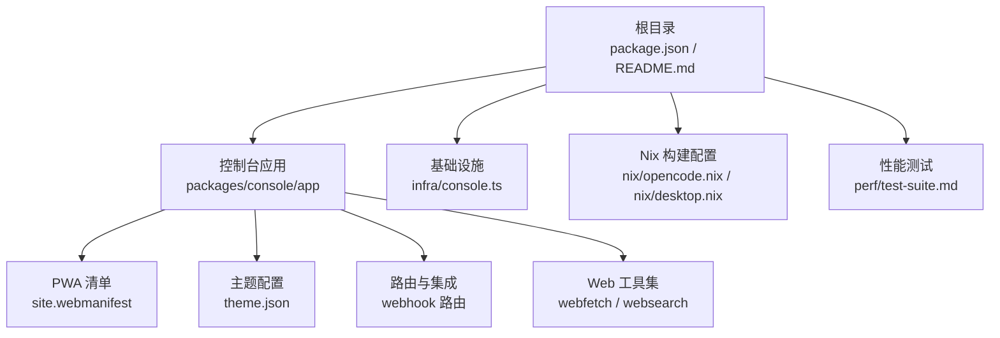
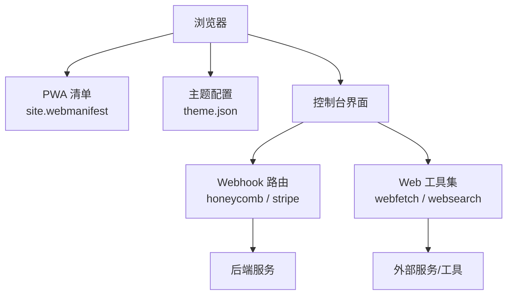
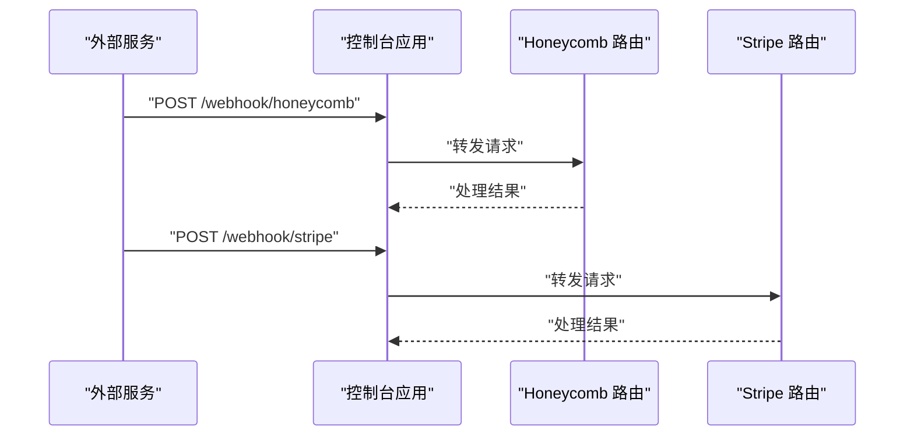
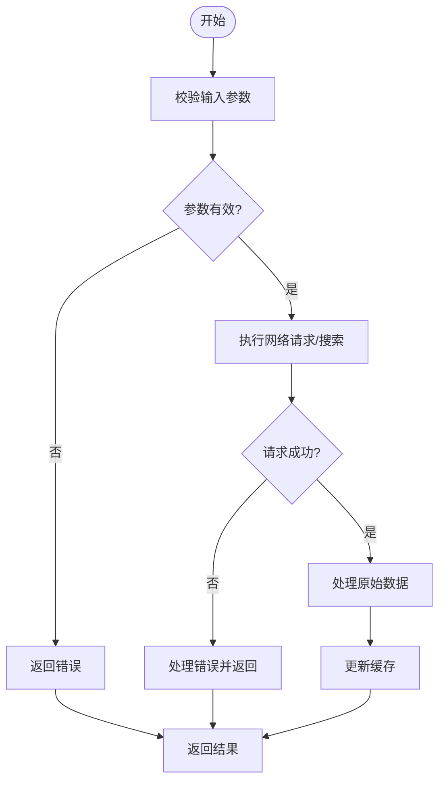
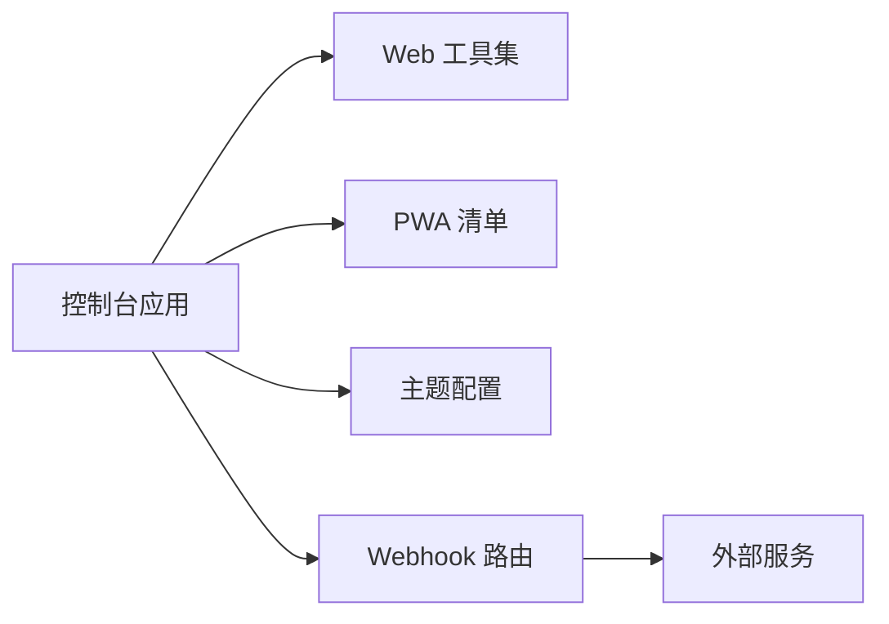

# Web 应用指南

<cite>
**本文引用的文件**
- [README.md](file://README.md)
- [package.json](file://package.json)
- [packages/console/app/package.json](file://packages/console/app/package.json)
- [packages/console/app/public/site.webmanifest](file://packages/console/app/public/site.webmanifest)
- [packages/console/app/public/theme.json](file://packages/console/app/public/theme.json)
- [packages/console/app/src/routes/honeycomb/webhook.ts](file://packages/console/app/src/routes/honeycomb/webhook.ts)
- [packages/console/app/src/routes/stripe/webhook.ts](file://packages/console/app/src/routes/stripe/webhook.ts)
- [packages/desktop/src/renderer/webview-zoom.ts](file://packages/desktop/src/renderer/webview-zoom.ts)
- [packages/core/src/github-copilot/responses/tool/web-search-preview.ts](file://packages/core/src/github-copilot/responses/tool/web-search-preview.ts)
- [packages/core/src/github-copilot/responses/tool/web-search.ts](file://packages/core/src/github-copilot/responses/tool/web-search.ts)
- [packages/core/src/tool/webfetch.ts](file://packages/core/src/tool/webfetch.ts)
- [packages/core/src/tool/websearch.ts](file://packages/core/src/tool/websearch.ts)
- [packages/core/test/tool-webfetch.test.ts](file://packages/core/test/tool-webfetch.test.ts)
- [packages/core/test/tool-websearch.test.ts](file://packages/core/test/tool-websearch.test.ts)
- [infra/console.ts](file://infra/console.ts)
- [nix/opencode.nix](file://nix/opencode.nix)
- [nix/desktop.nix](file://nix/desktop.nix)
- [perf/test-suite.md](file://perf/test-suite.md)
</cite>

## 目录
1. [简介](#简介)
2. [项目结构](#项目结构)
3. [核心组件](#核心组件)
4. [架构总览](#架构总览)
5. [详细组件分析](#详细组件分析)
6. [依赖关系分析](#依赖关系分析)
7. [性能考虑](#性能考虑)
8. [故障排查指南](#故障排查指南)
9. [结论](#结论)
10. [附录](#附录)

## 简介
本指南面向使用 OpenCode Web 控制台（Console）的开发者与运营人员，系统讲解界面布局与功能分区、各功能模块的使用方法、用户界面自定义选项、响应式与移动端适配、性能优化与浏览器兼容性，以及常见使用场景的操作流程。文档基于仓库中的控制台应用、工具链与基础设施代码进行梳理，帮助快速上手并高效使用。

## 项目结构
OpenCode 采用多包（monorepo）组织方式，Web 控制台位于 packages/console/app，同时在 infra 中提供部署与监控相关配置。根目录的 package.json 与 README 提供整体概览；Nix 配置用于本地构建与打包；性能测试文件提供基准参考。

**图表来源**
- [packages/console/app/package.json:1-200](file://packages/console/app/package.json#L1-L200)
- [packages/console/app/public/site.webmanifest:1-200](file://packages/console/app/public/site.webmanifest#L1-L200)
- [packages/console/app/public/theme.json:1-200](file://packages/console/app/public/theme.json#L1-L200)
- [packages/console/app/src/routes/honeycomb/webhook.ts:1-200](file://packages/console/app/src/routes/honeycomb/webhook.ts#L1-L200)
- [packages/console/app/src/routes/stripe/webhook.ts:1-200](file://packages/console/app/src/routes/stripe/webhook.ts#L1-L200)
- [packages/core/src/tool/webfetch.ts:1-200](file://packages/core/src/tool/webfetch.ts#L1-L200)
- [packages/core/src/tool/websearch.ts:1-200](file://packages/core/src/tool/websearch.ts#L1-L200)
- [infra/console.ts:1-200](file://infra/console.ts#L1-L200)
- [nix/opencode.nix:1-200](file://nix/opencode.nix#L1-L200)
- [nix/desktop.nix:1-200](file://nix/desktop.nix#L1-L200)
- [perf/test-suite.md:1-200](file://perf/test-suite.md#L1-L200)

**章节来源**
- [README.md:1-200](file://README.md#L1-L200)
- [package.json:1-200](file://package.json#L1-L200)
- [packages/console/app/package.json:1-200](file://packages/console/app/package.json#L1-L200)
- [infra/console.ts:1-200](file://infra/console.ts#L1-L200)
- [nix/opencode.nix:1-200](file://nix/opencode.nix#L1-L200)
- [nix/desktop.nix:1-200](file://nix/desktop.nix#L1-L200)
- [perf/test-suite.md:1-200](file://perf/test-suite.md#L1-L200)

## 核心组件
- 控制台前端应用：提供 Web 控制台界面、主题与 PWA 支持，包含路由与第三方服务集成点。
- 工具集：封装 Web 搜索与网络请求能力，支持 AI 代理与工具调用。
- 基础设施：部署脚本与监控配置，保障运行环境稳定。
- Nix 构建：统一开发与打包环境，便于跨平台一致性。
- 性能测试：提供基准测试与评估参考。

**章节来源**
- [packages/console/app/package.json:1-200](file://packages/console/app/package.json#L1-L200)
- [packages/core/src/tool/webfetch.ts:1-200](file://packages/core/src/tool/webfetch.ts#L1-L200)
- [packages/core/src/tool/websearch.ts:1-200](file://packages/core/src/tool/websearch.ts#L1-L200)
- [infra/console.ts:1-200](file://infra/console.ts#L1-L200)
- [nix/opencode.nix:1-200](file://nix/opencode.nix#L1-L200)
- [nix/desktop.nix:1-200](file://nix/desktop.nix#L1-L200)
- [perf/test-suite.md:1-200](file://perf/test-suite.md#L1-L200)

## 架构总览
下图展示 Web 控制台从浏览器到后端服务的整体交互路径，包括 PWA 清单、主题配置、Webhook 集成与工具调用。

**图表来源**
- [packages/console/app/public/site.webmanifest:1-200](file://packages/console/app/public/site.webmanifest#L1-L200)
- [packages/console/app/public/theme.json:1-200](file://packages/console/app/public/theme.json#L1-L200)
- [packages/console/app/src/routes/honeycomb/webhook.ts:1-200](file://packages/console/app/src/routes/honeycomb/webhook.ts#L1-L200)
- [packages/console/app/src/routes/stripe/webhook.ts:1-200](file://packages/console/app/src/routes/stripe/webhook.ts#L1-L200)
- [packages/core/src/tool/webfetch.ts:1-200](file://packages/core/src/tool/webfetch.ts#L1-L200)
- [packages/core/src/tool/websearch.ts:1-200](file://packages/core/src/tool/websearch.ts#L1-L200)

## 详细组件分析

### 控制台界面布局与功能分区
- 侧边栏导航：承载主要功能入口与层级菜单，便于快速跳转至不同模块。
- 主工作区：展示当前选中模块的内容，如代码编辑器、AI 交互界面、会话列表等。
- 设置面板：集中管理主题、语言、快捷键等个性化配置。
- 顶部工具栏：提供全局操作按钮（新建、保存、分享等）与状态指示。

注：以上为通用布局描述，具体实现以控制台应用实际页面为准。

### 功能模块使用方法
- 代码编辑器
  - 打开文件或新建文件后，在主工作区进行编辑。
  - 使用工具栏提供的保存、格式化、撤销/重做等操作。
- AI 交互界面
  - 在 AI 交互模块中输入提示词，选择模型与参数，发起对话。
  - 查看返回结果并进行追问或继续对话。
- 会话管理
  - 在会话列表中创建、重命名、删除或导出会话。
  - 通过筛选与搜索快速定位目标会话。
- 插件市场
  - 浏览可用插件，安装并启用以扩展功能。
  - 在设置中配置插件参数与权限。

### 用户界面自定义
- 主题切换
  - 通过设置面板选择浅色/深色主题，或加载自定义主题资源。
  - 主题配置文件位于公共目录，可按需调整颜色与样式变量。
- 语言设置
  - 在设置中选择界面语言，刷新后生效。
  - 多语言资源由控制台应用内置，支持动态切换。
- 快捷键配置
  - 在设置中为常用操作绑定快捷键，提升效率。
  - 快捷键规则可在设置面板中查看与修改。

### 响应式设计与移动端使用
- 响应式布局
  - 控制台界面适配不同屏幕尺寸，侧边栏在小屏时可折叠或切换为抽屉式导航。
- 移动端注意事项
  - 键盘弹出可能遮挡输入框，建议使用外接键盘或竖屏模式。
  - 触控操作建议使用手势缩放与滑动，避免误触。

### 部署与运行
- 开发与构建
  - 使用 Nix 配置统一开发环境，确保依赖一致。
  - 控制台应用通过包管理器安装依赖并启动开发服务器。
- 基础设施
  - 部署脚本与监控配置位于基础设施目录，支持一键部署与健康检查。
- PWA 与缓存
  - PWA 清单定义应用图标、名称与离线策略，提升加载速度与可用性。

**章节来源**
- [packages/console/app/public/site.webmanifest:1-200](file://packages/console/app/public/site.webmanifest#L1-L200)
- [packages/console/app/public/theme.json:1-200](file://packages/console/app/public/theme.json#L1-L200)
- [packages/console/app/package.json:1-200](file://packages/console/app/package.json#L1-L200)
- [infra/console.ts:1-200](file://infra/console.ts#L1-L200)
- [nix/opencode.nix:1-200](file://nix/opencode.nix#L1-L200)
- [nix/desktop.nix:1-200](file://nix/desktop.nix#L1-L200)

### Webhook 集成流程
以下序列图展示了控制台与第三方服务（如 Honeycomb、Stripe）的 Webhook 接收与处理流程。

**图表来源**
- [packages/console/app/src/routes/honeycomb/webhook.ts:1-200](file://packages/console/app/src/routes/honeycomb/webhook.ts#L1-L200)
- [packages/console/app/src/routes/stripe/webhook.ts:1-200](file://packages/console/app/src/routes/stripe/webhook.ts#L1-L200)

### Web 工具调用流程
Web 工具集负责封装网络请求与搜索能力，供 AI 代理与前端模块调用。

**图表来源**
- [packages/core/src/tool/webfetch.ts:1-200](file://packages/core/src/tool/webfetch.ts#L1-L200)
- [packages/core/src/tool/websearch.ts:1-200](file://packages/core/src/tool/websearch.ts#L1-L200)

**章节来源**
- [packages/core/src/tool/webfetch.ts:1-200](file://packages/core/src/tool/webfetch.ts#L1-L200)
- [packages/core/src/tool/websearch.ts:1-200](file://packages/core/src/tool/websearch.ts#L1-L200)
- [packages/core/test/tool-webfetch.test.ts:1-200](file://packages/core/test/tool-webfetch.test.ts#L1-L200)
- [packages/core/test/tool-websearch.test.ts:1-200](file://packages/core/test/tool-websearch.test.ts#L1-L200)

## 依赖关系分析
- 包依赖
  - 控制台应用依赖核心工具集与 UI 组件库，通过包管理器统一管理版本。
- 运行时依赖
  - PWA 清单与主题配置作为静态资源被浏览器缓存，减少重复加载。
- 第三方集成
  - Webhook 路由对接外部服务，确保请求安全与正确路由。

**图表来源**
- [packages/console/app/package.json:1-200](file://packages/console/app/package.json#L1-L200)
- [packages/core/src/tool/webfetch.ts:1-200](file://packages/core/src/tool/webfetch.ts#L1-L200)
- [packages/core/src/tool/websearch.ts:1-200](file://packages/core/src/tool/websearch.ts#L1-L200)
- [packages/console/app/public/site.webmanifest:1-200](file://packages/console/app/public/site.webmanifest#L1-L200)
- [packages/console/app/public/theme.json:1-200](file://packages/console/app/public/theme.json#L1-L200)
- [packages/console/app/src/routes/honeycomb/webhook.ts:1-200](file://packages/console/app/src/routes/honeycomb/webhook.ts#L1-L200)
- [packages/console/app/src/routes/stripe/webhook.ts:1-200](file://packages/console/app/src/routes/stripe/webhook.ts#L1-L200)

**章节来源**
- [packages/console/app/package.json:1-200](file://packages/console/app/package.json#L1-L200)

## 性能考虑
- 缓存策略
  - 利用 PWA 清单与静态资源缓存，减少重复下载。
- 请求优化
  - 合理设置超时与重试机制，避免阻塞主线程。
- 图标与主题
  - 将图标与主题资源放置于公共目录，便于浏览器缓存与预加载。
- 性能测试
  - 参考性能测试套件，定期评估加载时间与交互延迟。

**章节来源**
- [packages/console/app/public/site.webmanifest:1-200](file://packages/console/app/public/site.webmanifest#L1-L200)
- [packages/console/app/public/theme.json:1-200](file://packages/console/app/public/theme.json#L1-L200)
- [perf/test-suite.md:1-200](file://perf/test-suite.md#L1-L200)

## 故障排查指南
- Webhook 无法接收
  - 检查路由配置与服务端可达性，确认请求头与签名验证逻辑。
- 工具调用失败
  - 查看网络请求日志与错误码，确认超时与重试策略是否合理。
- 主题或语言不生效
  - 清除浏览器缓存后重载页面，确认主题配置文件路径正确。
- 移动端显示异常
  - 调整视口设置与缩放比例，必要时禁用页面缩放以避免误触。

**章节来源**
- [packages/console/app/src/routes/honeycomb/webhook.ts:1-200](file://packages/console/app/src/routes/honeycomb/webhook.ts#L1-L200)
- [packages/console/app/src/routes/stripe/webhook.ts:1-200](file://packages/console/app/src/routes/stripe/webhook.ts#L1-L200)
- [packages/core/src/tool/webfetch.ts:1-200](file://packages/core/src/tool/webfetch.ts#L1-L200)
- [packages/core/src/tool/websearch.ts:1-200](file://packages/core/src/tool/websearch.ts#L1-L200)

## 结论
OpenCode Web 控制台通过清晰的界面分区、完善的工具集与基础设施支持，为用户提供高效的开发与协作体验。结合本文档的使用与配置指南，可快速完成日常任务并根据团队需求进行个性化定制。

## 附录
- 常见使用场景
  - 创建新项目：在侧边栏导航中选择“项目”，点击“新建项目”并填写信息。
  - 导入现有代码：在项目详情页选择“导入代码”，上传压缩包或关联版本库。
  - 团队协作：在项目设置中邀请成员，分配角色与权限，开启共享会话。
- 浏览器兼容性
  - 建议使用最新版 Chrome/Firefox/Safari；IE 不再支持。
- 移动端建议
  - 使用竖屏模式，避免键盘遮挡；尽量使用外接键盘提升输入效率。