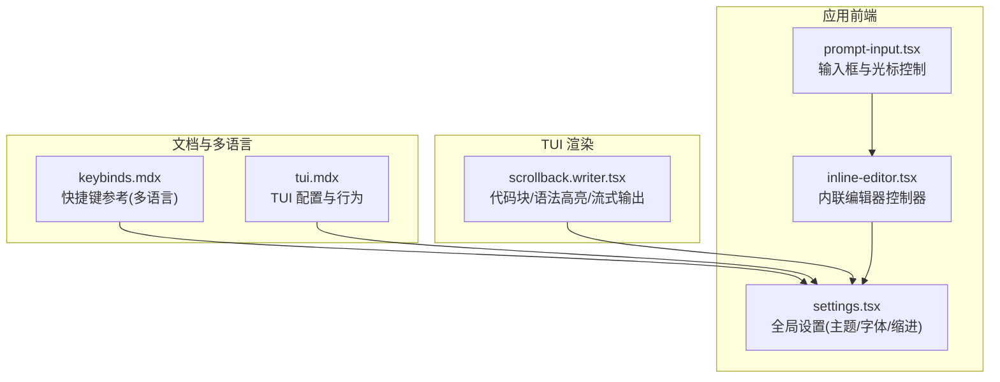
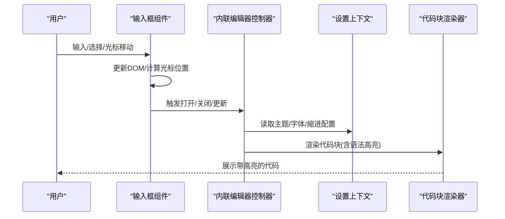
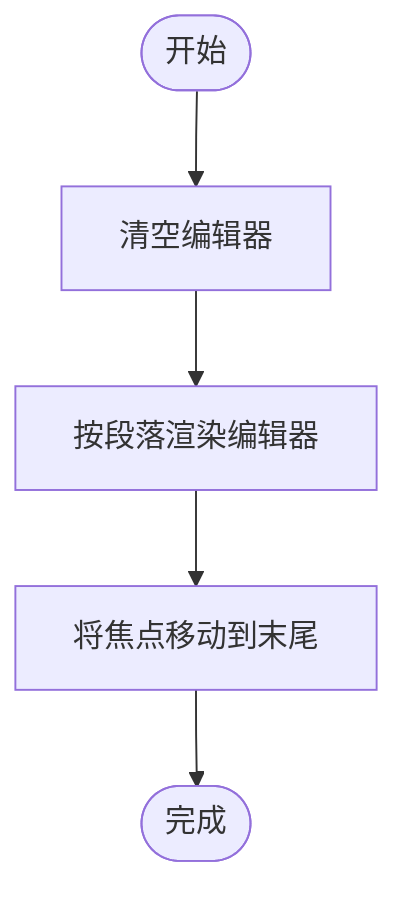
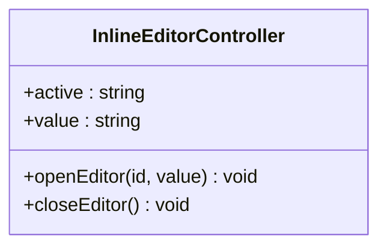
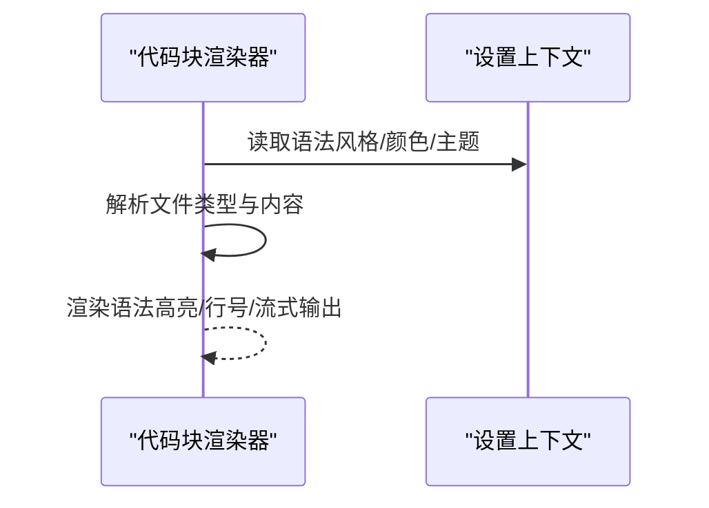
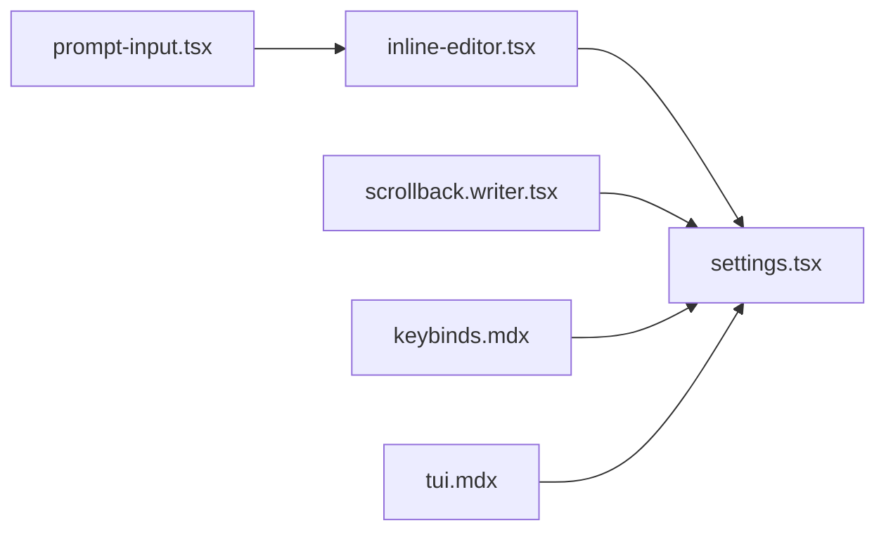

# 代码编辑器功能

<cite>
**本文引用的文件**
- [packages/app/src/components/prompt-input.tsx](file://packages/app/src/components/prompt-input.tsx)
- [packages/app/src/pages/layout/inline-editor.tsx](file://packages/app/src/pages/layout/inline-editor.tsx)
- [packages/app/src/context/settings.tsx](file://packages/app/src/context/settings.tsx)
- [packages/opencode/src/cli/cmd/run/scrollback.writer.tsx](file://packages/opencode/src/cli/cmd/run/scrollback.writer.tsx)
- [packages/ui/src/v2/components/line-comment-v2.tsx](file://packages/ui/src/v2/components/line-comment-v2.tsx)
- [packages/web/src/content/docs/de/tui.mdx](file://packages/web/src/content/docs/de/tui.mdx)
- [packages/web/src/content/docs/tui.mdx](file://packages/web/src/content/docs/tui.mdx)
- [packages/web/src/content/docs/ar/keybinds.mdx](file://packages/web/src/content/docs/ar/keybinds.mdx)
- [packages/web/src/content/docs/ja/keybinds.mdx](file://packages/web/src/content/docs/ja/keybinds.mdx)
</cite>

## 目录
1. [简介](#简介)
2. [项目结构](#项目结构)
3. [核心组件](#核心组件)
4. [架构总览](#架构总览)
5. [详细组件分析](#详细组件分析)
6. [依赖关系分析](#依赖关系分析)
7. [性能考量](#性能考量)
8. [故障排查指南](#故障排查指南)
9. [结论](#结论)
10. [附录](#附录)

## 简介
本指南面向在 Web 环境中使用 OpenCode 的开发者，系统讲解代码编辑器相关能力与使用方法，涵盖：
- 编辑器核心功能：语法高亮、代码补全（建议）、错误检查（建议）、代码格式化（建议）
- 多语言支持与语言特定功能
- 配置项：主题、字体大小、缩进规则等
- 快捷键操作与常用编辑技巧
- 代码片段插入、批量编辑、查找替换等实用功能

说明：当前仓库中与“Web 应用代码编辑器”直接实现最密切的模块集中在应用前端与 TUI 渲染层；Web 文档与多语言键位说明可作为参考。

## 项目结构
围绕编辑器功能的关键位置如下：
- 应用前端交互层：负责输入框渲染、光标控制、内联编辑器状态管理
- TUI 渲染层：负责代码块渲染、语法高亮、流式输出展示
- 设置上下文：提供字体族、字号、主题等全局配置
- 文档与多语言键位：提供快捷键参考与本地化说明

图表来源
- [packages/app/src/components/prompt-input.tsx:51-120](file://packages/app/src/components/prompt-input.tsx#L51-L120)
- [packages/app/src/pages/layout/inline-editor.tsx:1-20](file://packages/app/src/pages/layout/inline-editor.tsx#L1-L20)
- [packages/app/src/context/settings.tsx:57-60](file://packages/app/src/context/settings.tsx#L57-L60)
- [packages/opencode/src/cli/cmd/run/scrollback.writer.tsx:156-167](file://packages/opencode/src/cli/cmd/run/scrollback.writer.tsx#L156-L167)
- [packages/web/src/content/docs/ar/keybinds.mdx:135-151](file://packages/web/src/content/docs/ar/keybinds.mdx#L135-L151)
- [packages/web/src/content/docs/tui.mdx:354-387](file://packages/web/src/content/docs/tui.mdx#L354-L387)

章节来源
- [packages/app/src/components/prompt-input.tsx:51-120](file://packages/app/src/components/prompt-input.tsx#L51-L120)
- [packages/app/src/pages/layout/inline-editor.tsx:1-20](file://packages/app/src/pages/layout/inline-editor.tsx#L1-L20)
- [packages/app/src/context/settings.tsx:57-60](file://packages/app/src/context/settings.tsx#L57-L60)
- [packages/opencode/src/cli/cmd/run/scrollback.writer.tsx:156-167](file://packages/opencode/src/cli/cmd/run/scrollback.writer.tsx#L156-L167)
- [packages/web/src/content/docs/ar/keybinds.mdx:135-151](file://packages/web/src/content/docs/ar/keybinds.mdx#L135-L151)
- [packages/web/src/content/docs/tui.mdx:354-387](file://packages/web/src/content/docs/tui.mdx#L354-L387)

## 核心组件
- 输入框与光标控制：负责编辑区域的文本输入、光标定位、选择范围、清空与重渲染
- 内联编辑器控制器：维护当前激活的编辑器实例、打开/关闭逻辑
- 全局设置上下文：提供字体族、字号、主题色板、缩进宽度等配置入口
- 代码块渲染器：在 TUI 中对代码块进行语法高亮、行号显示、流式输出控制

章节来源
- [packages/app/src/components/prompt-input.tsx:588-626](file://packages/app/src/components/prompt-input.tsx#L588-L626)
- [packages/app/src/pages/layout/inline-editor.tsx:4-17](file://packages/app/src/pages/layout/inline-editor.tsx#L4-L17)
- [packages/app/src/context/settings.tsx:57-60](file://packages/app/src/context/settings.tsx#L57-L60)
- [packages/opencode/src/cli/cmd/run/scrollback.writer.tsx:156-167](file://packages/opencode/src/cli/cmd/run/scrollback.writer.tsx#L156-L167)

## 架构总览
编辑器功能由“前端交互层 + 渲染层 + 配置层 + 文档层”协同构成，数据流从用户输入到渲染展示，再到配置生效与快捷键辅助。

图表来源
- [packages/app/src/components/prompt-input.tsx:588-626](file://packages/app/src/components/prompt-input.tsx#L588-L626)
- [packages/app/src/pages/layout/inline-editor.tsx:4-17](file://packages/app/src/pages/layout/inline-editor.tsx#L4-L17)
- [packages/app/src/context/settings.tsx:57-60](file://packages/app/src/context/settings.tsx#L57-L60)
- [packages/opencode/src/cli/cmd/run/scrollback.writer.tsx:156-167](file://packages/opencode/src/cli/cmd/run/scrollback.writer.tsx#L156-L167)

## 详细组件分析

### 组件一：输入框与光标控制（prompt-input）
职责与特性：
- 负责将提示内容渲染为可编辑的输入框
- 提供清空、设置文本、聚焦末尾、按段落重渲染等能力
- 支持光标定位与范围选择，保证与模型输出一致
- 通过 DOM 工具函数实现精确的光标与选区控制

关键流程（渲染与更新）：

图表来源
- [packages/app/src/components/prompt-input.tsx:588-626](file://packages/app/src/components/prompt-input.tsx#L588-L626)
- [packages/app/src/components/prompt-input.tsx:749-755](file://packages/app/src/components/prompt-input.tsx#L749-L755)
- [packages/app/src/components/prompt-input.tsx:804-863](file://packages/app/src/components/prompt-input.tsx#L804-L863)

章节来源
- [packages/app/src/components/prompt-input.tsx:588-626](file://packages/app/src/components/prompt-input.tsx#L588-L626)
- [packages/app/src/components/prompt-input.tsx:749-755](file://packages/app/src/components/prompt-input.tsx#L749-L755)
- [packages/app/src/components/prompt-input.tsx:804-863](file://packages/app/src/components/prompt-input.tsx#L804-L863)

### 组件二：内联编辑器控制器（inline-editor）
职责与特性：
- 维护当前激活的编辑器实例 ID 与内容值
- 提供打开/关闭编辑器的方法，用于在页面中嵌入临时编辑区域
- 与设置上下文联动，确保主题与字体等配置生效

类图（简化的接口关系）：

图表来源
- [packages/app/src/pages/layout/inline-editor.tsx:4-17](file://packages/app/src/pages/layout/inline-editor.tsx#L4-L17)

章节来源
- [packages/app/src/pages/layout/inline-editor.tsx:4-17](file://packages/app/src/pages/layout/inline-editor.tsx#L4-L17)

### 组件三：全局设置上下文（settings）
职责与特性：
- 提供字体族、字号、主题色板、缩进宽度等配置
- 为编辑器与渲染组件提供统一的视觉与行为参数
- 支持在不同组件间共享与响应式更新

章节来源
- [packages/app/src/context/settings.tsx:57-60](file://packages/app/src/context/settings.tsx#L57-L60)

### 组件四：代码块渲染器（scrollback.writer）
职责与特性：
- 在 TUI 环境中渲染代码块，支持语法高亮、行号、流式输出
- 接收文件类型、语法风格、内容与颜色等参数
- 可用于展示代码快照、差异对比与任务项

序列图（代码块渲染流程）：

图表来源
- [packages/opencode/src/cli/cmd/run/scrollback.writer.tsx:156-167](file://packages/opencode/src/cli/cmd/run/scrollback.writer.tsx#L156-L167)
- [packages/opencode/src/cli/cmd/run/scrollback.writer.tsx:168-187](file://packages/opencode/src/cli/cmd/run/scrollback.writer.tsx#L168-L187)

章节来源
- [packages/opencode/src/cli/cmd/run/scrollback.writer.tsx:156-167](file://packages/opencode/src/cli/cmd/run/scrollback.writer.tsx#L156-L167)
- [packages/opencode/src/cli/cmd/run/scrollback.writer.tsx:168-187](file://packages/opencode/src/cli/cmd/run/scrollback.writer.tsx#L168-L187)

### 组件五：行注释编辑器（line-comment-v2）
职责与特性：
- 提供行级评论的编辑界面，支持标题、占位符、取消/提交回调
- 与选择信息结合，便于在代码行上快速添加注释
- 通过 Solid 组件模式实现可组合的编辑体验

章节来源
- [packages/ui/src/v2/components/line-comment-v2.tsx:56-75](file://packages/ui/src/v2/components/line-comment-v2.tsx#L56-L75)

## 依赖关系分析
- 输入框组件依赖 DOM 工具以实现精准的光标与选区控制
- 内联编辑器控制器依赖设置上下文以获取主题与字体配置
- 代码块渲染器依赖设置上下文以确定语法高亮与颜色
- 文档与多语言键位为用户提供快捷键参考，间接影响编辑效率

图表来源
- [packages/app/src/components/prompt-input.tsx:51-120](file://packages/app/src/components/prompt-input.tsx#L51-L120)
- [packages/app/src/pages/layout/inline-editor.tsx:4-17](file://packages/app/src/pages/layout/inline-editor.tsx#L4-L17)
- [packages/app/src/context/settings.tsx:57-60](file://packages/app/src/context/settings.tsx#L57-L60)
- [packages/opencode/src/cli/cmd/run/scrollback.writer.tsx:156-167](file://packages/opencode/src/cli/cmd/run/scrollback.writer.tsx#L156-L167)
- [packages/web/src/content/docs/ar/keybinds.mdx:135-151](file://packages/web/src/content/docs/ar/keybinds.mdx#L135-L151)
- [packages/web/src/content/docs/tui.mdx:354-387](file://packages/web/src/content/docs/tui.mdx#L354-L387)

章节来源
- [packages/app/src/components/prompt-input.tsx:51-120](file://packages/app/src/components/prompt-input.tsx#L51-L120)
- [packages/app/src/pages/layout/inline-editor.tsx:4-17](file://packages/app/src/pages/layout/inline-editor.tsx#L4-L17)
- [packages/app/src/context/settings.tsx:57-60](file://packages/app/src/context/settings.tsx#L57-L60)
- [packages/opencode/src/cli/cmd/run/scrollback.writer.tsx:156-167](file://packages/opencode/src/cli/cmd/run/scrollback.writer.tsx#L156-L167)
- [packages/web/src/content/docs/ar/keybinds.mdx:135-151](file://packages/web/src/content/docs/ar/keybinds.mdx#L135-L151)
- [packages/web/src/content/docs/tui.mdx:354-387](file://packages/web/src/content/docs/tui.mdx#L354-L387)

## 性能考量
- 渲染策略：按段落重渲染与流式输出有助于减少不必要的 DOM 更新，提升大文档编辑时的流畅度
- 光标与选区：通过精确的光标定位与范围选择，避免重复计算与闪烁
- 配置缓存：设置上下文集中管理主题与字体，减少组件内部重复计算
- 代码块渲染：在 TUI 中启用语法高亮与行号时，注意内容长度与刷新频率，避免频繁重绘

## 故障排查指南
- 输入无响应或光标错位
  - 检查输入框是否正确清空并重新渲染
  - 确认 DOM 工具函数调用顺序与时机
  - 参考路径：[packages/app/src/components/prompt-input.tsx:588-626](file://packages/app/src/components/prompt-input.tsx#L588-L626)
- 编辑器无法打开/关闭
  - 确认内联编辑器控制器的状态字段与方法调用
  - 参考路径：[packages/app/src/pages/layout/inline-editor.tsx:4-17](file://packages/app/src/pages/layout/inline-editor.tsx#L4-L17)
- 语法高亮不生效
  - 检查渲染器传入的文件类型与语法风格
  - 确认设置上下文中的主题与颜色配置
  - 参考路径：[packages/opencode/src/cli/cmd/run/scrollback.writer.tsx:156-167](file://packages/opencode/src/cli/cmd/run/scrollback.writer.tsx#L156-L167)
- 快捷键无效
  - 查看多语言键位文档，确认当前环境下的快捷键映射
  - 参考路径：[packages/web/src/content/docs/ar/keybinds.mdx:135-151](file://packages/web/src/content/docs/ar/keybinds.mdx#L135-L151)、[packages/web/src/content/docs/ja/keybinds.mdx:135-150](file://packages/web/src/content/docs/ja/keybinds.mdx#L135-L150)

章节来源
- [packages/app/src/components/prompt-input.tsx:588-626](file://packages/app/src/components/prompt-input.tsx#L588-L626)
- [packages/app/src/pages/layout/inline-editor.tsx:4-17](file://packages/app/src/pages/layout/inline-editor.tsx#L4-L17)
- [packages/opencode/src/cli/cmd/run/scrollback.writer.tsx:156-167](file://packages/opencode/src/cli/cmd/run/scrollback.writer.tsx#L156-L167)
- [packages/web/src/content/docs/ar/keybinds.mdx:135-151](file://packages/web/src/content/docs/ar/keybinds.mdx#L135-L151)
- [packages/web/src/content/docs/ja/keybinds.mdx:135-150](file://packages/web/src/content/docs/ja/keybinds.mdx#L135-L150)

## 结论
OpenCode 的编辑器能力由前端交互层、渲染层与配置层共同支撑。通过输入框与光标控制、内联编辑器、设置上下文以及代码块渲染器的协作，可在 Web 环境中实现高效的代码编写与展示。配合多语言快捷键文档与 TUI 配置说明，开发者可以进一步优化编辑体验与效率。

## 附录

### 快捷键操作指南（多语言参考）
- 桌面端 Readline/Emacs 风格快捷键（多语言文档提供）
  - 示例：移动光标、删除单词、剪切/粘贴等
  - 参考路径：
    - [packages/web/src/content/docs/ar/keybinds.mdx:135-151](file://packages/web/src/content/docs/ar/keybinds.mdx#L135-L151)
    - [packages/web/src/content/docs/ja/keybinds.mdx:135-150](file://packages/web/src/content/docs/ja/keybinds.mdx#L135-L150)

### TUI 配置与行为（独立于 opencode.json）
- 主题、键位、滚动速度、鼠标支持、注意力提醒等
- 参考路径：
  - [packages/web/src/content/docs/de/tui.mdx:354-387](file://packages/web/src/content/docs/de/tui.mdx#L354-L387)
  - [packages/web/src/content/docs/tui.mdx:354-387](file://packages/web/src/content/docs/tui.mdx#L354-L387)