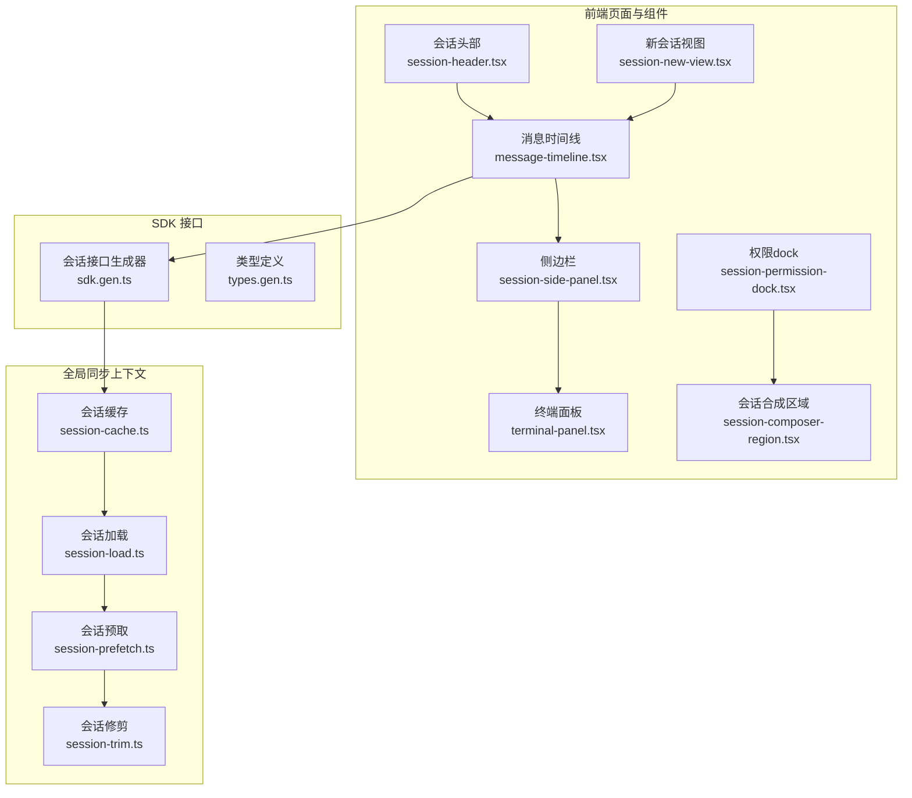
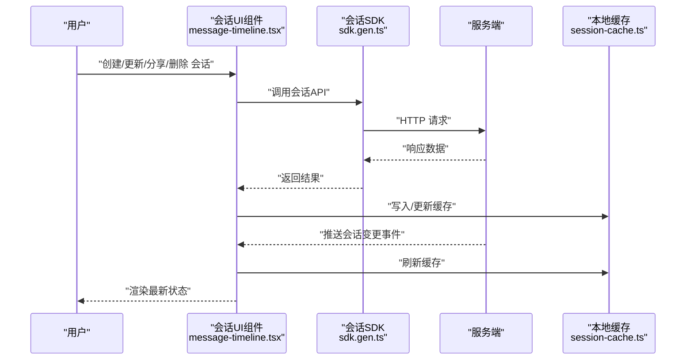
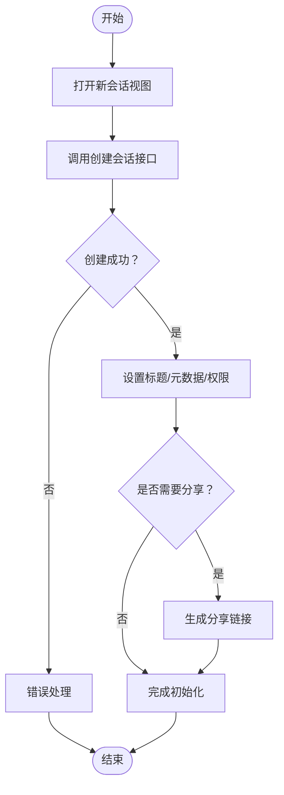
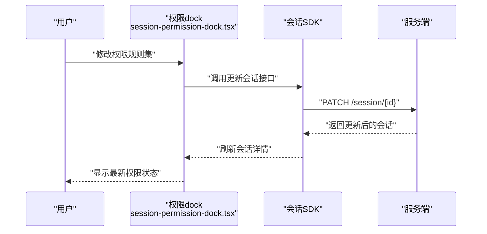
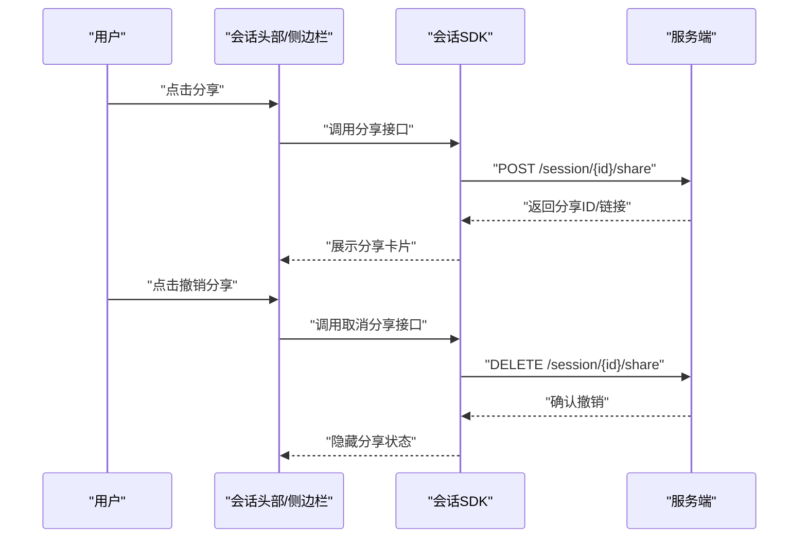
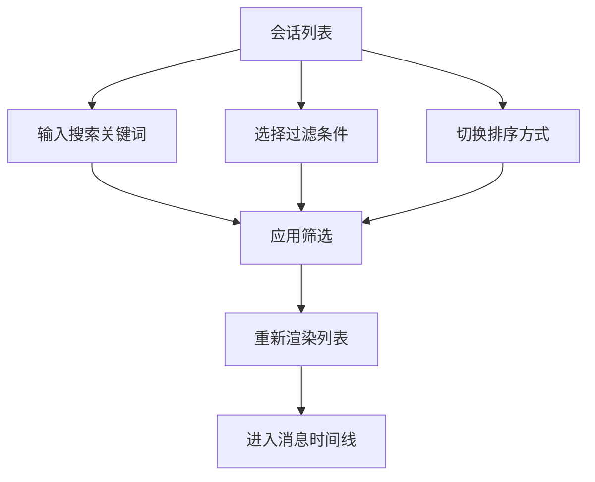
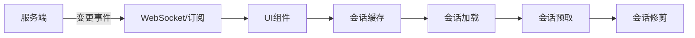
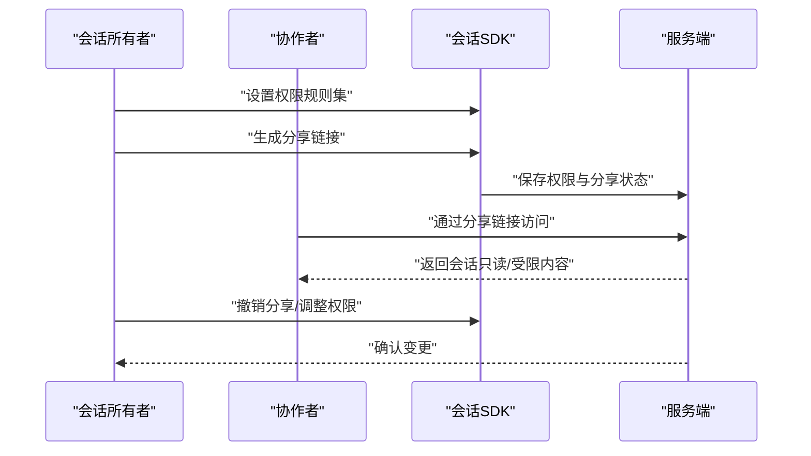
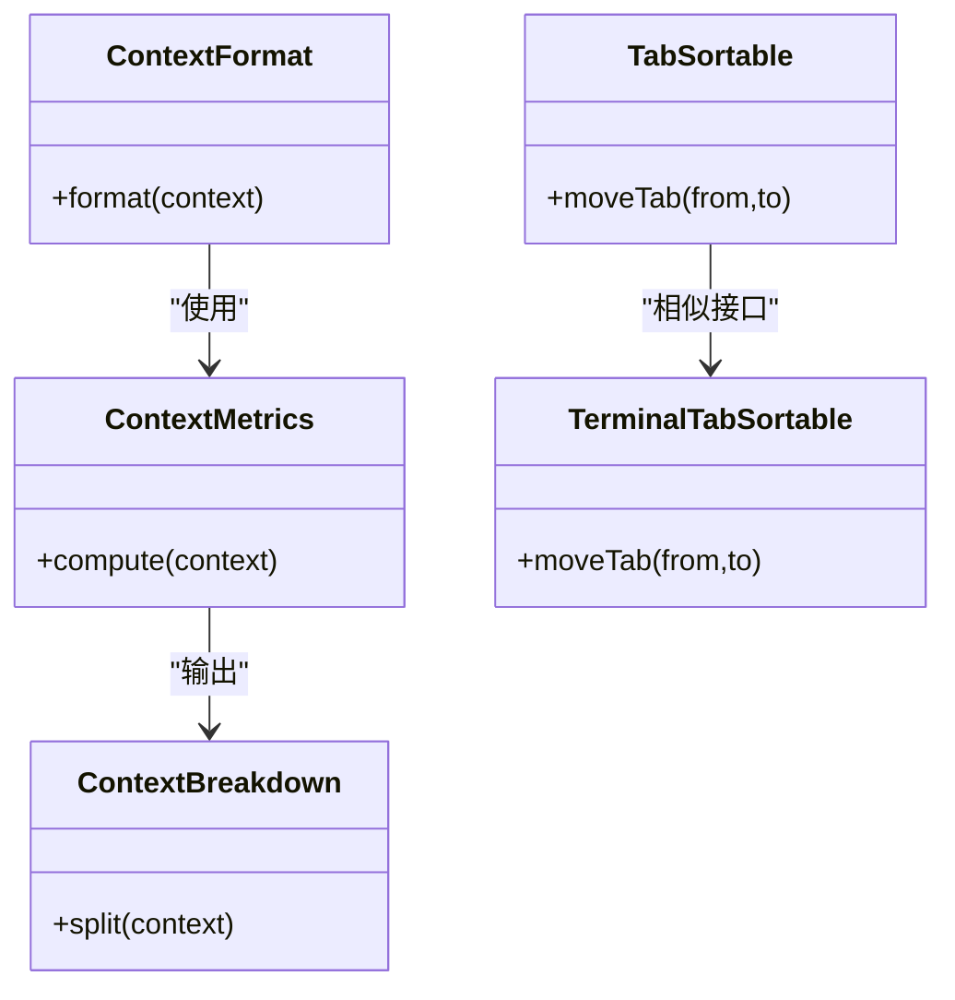
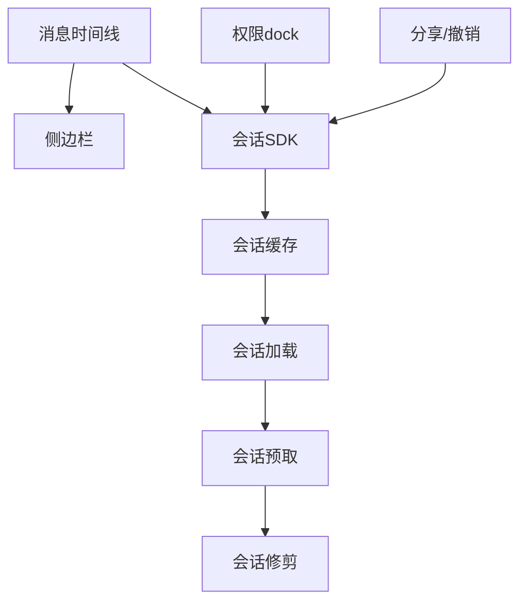

# 会话管理功能

<cite>
**本文引用的文件**
- [session.md](file://specs/v2/session.md)
- [sdk.gen.ts](file://packages/sdk/js/src/v2/gen/sdk.gen.ts)
- [types.gen.ts](file://packages/sdk/js/src/v2/gen/types.gen.ts)
- [session-cache.ts](file://packages/app/src/context/global-sync/session-cache.ts)
- [session-load.ts](file://packages/app/src/context/global-sync/session-load.ts)
- [session-prefetch.ts](file://packages/app/src/context/global-sync/session-prefetch.ts)
- [session-trim.ts](file://packages/app/src/context/global-sync/session-trim.ts)
- [index.ts](file://packages/app/src/components/session/index.ts)
- [session-header.tsx](file://packages/app/src/components/session/session-header.tsx)
- [session-new-view.tsx](file://packages/app/src/components/session/session-new-view.tsx)
- [session-composer-region.tsx](file://packages/app/src/pages/session/composer/session-composer-region.tsx)
- [session-permission-dock.tsx](file://packages/app/src/pages/session/composer/session-permission-dock.tsx)
- [session-timeline.tsx](file://packages/app/src/pages/session/message-timeline.tsx)
- [session-side-panel.tsx](file://packages/app/src/pages/session/session-side-panel.tsx)
- [session-file-tabs.tsx](file://packages/app/src/pages/session/file-tabs.tsx)
- [session-terminal-panel.tsx](file://packages/app/src/pages/session/terminal-panel.tsx)
- [session-context-format.ts](file://packages/app/src/components/session/session-context-format.ts)
- [session-context-metrics.ts](file://packages/app/src/components/session/session-context-metrics.ts)
- [session-context-breakdown.ts](file://packages/app/src/components/session/session-context-breakdown.ts)
- [session-context-usage.tsx](file://packages/app/src/components/session-context-usage.tsx)
- [session-context-tab.tsx](file://packages/app/src/components/session/session-context-tab.tsx)
- [session-sortable-tab.tsx](file://packages/app/src/components/session/session-sortable-tab.tsx)
- [session-sortable-terminal-tab.tsx](file://packages/app/src/components/session/session-sortable-terminal-tab.tsx)
- [session-new-design-view.tsx](file://packages/app/src/components/session/session-new-design-view.tsx)
- [session-review-tab.tsx](file://packages/app/src/pages/session/review-tab.tsx)
- [session-usage-exceeded-dialogs.tsx](file://packages/app/src/pages/session/usage-exceeded-dialogs.tsx)
- [session-list-path-loading.spec.ts](file://packages/app/e2e/regression/session-list-path-loading.spec.ts)
- [session-timeline-collapse-state.spec.ts](file://packages/app/e2e/regression/session-timeline-collapse-state.spec.ts)
- [session-timeline-context-resize.spec.ts](file://packages/app/e2e/regression/session-timeline-context-resize.spec.ts)
- [session-timeline.spec.ts](file://packages/app/e2e/smoke/session-timeline.spec.ts)
- [session-timeline.fixture.ts](file://packages/app/e2e/smoke/session-timeline.fixture.ts)
- [index.ts](file://github/index.ts)
</cite>

## 目录
1. [简介](#简介)
2. [项目结构](#项目结构)
3. [核心组件](#核心组件)
4. [架构总览](#架构总览)
5. [详细组件分析](#详细组件分析)
6. [依赖关系分析](#依赖关系分析)
7. [性能考虑](#性能考虑)
8. [故障排查指南](#故障排查指南)
9. [结论](#结论)
10. [附录](#附录)

## 简介
本指南面向 OpenCode Web 应用中的“会话管理”能力，帮助用户理解并高效使用会话的创建、保存、加载、删除与分享；掌握会话历史的查看与管理（列表、搜索、排序）；了解会话数据的本地缓存与云端同步机制；以及在多人协作场景下进行会话共享与权限控制。文档同时结合前端组件与 SDK 接口定义，给出可操作的流程与最佳实践。

## 项目结构
OpenCode 的会话管理由“前端页面与组件 + 全局同步上下文 + SDK 接口定义”三部分协同实现：
- 前端页面与组件：会话页、消息时间线、侧边栏、终端面板、权限 dock、新会话视图等
- 全局同步上下文：会话缓存、预取、加载、修剪策略
- SDK 接口定义：会话 CRUD、分享/取消分享、更新、查询等 API

图表来源
- [session-header.tsx](file://packages/app/src/components/session/session-header.tsx)
- [session-new-view.tsx](file://packages/app/src/components/session/session-new-view.tsx)
- [message-timeline.tsx](file://packages/app/src/pages/session/message-timeline.tsx)
- [session-side-panel.tsx](file://packages/app/src/pages/session/session-side-panel.tsx)
- [session-terminal-panel.tsx](file://packages/app/src/pages/session/terminal-panel.tsx)
- [session-permission-dock.tsx](file://packages/app/src/pages/session/composer/session-permission-dock.tsx)
- [session-composer-region.tsx](file://packages/app/src/pages/session/composer/session-composer-region.tsx)
- [session-cache.ts](file://packages/app/src/context/global-sync/session-cache.ts)
- [session-load.ts](file://packages/app/src/context/global-sync/session-load.ts)
- [session-prefetch.ts](file://packages/app/src/context/global-sync/session-prefetch.ts)
- [session-trim.ts](file://packages/app/src/context/global-sync/session-trim.ts)
- [sdk.gen.ts](file://packages/sdk/js/src/v2/gen/sdk.gen.ts)
- [types.gen.ts](file://packages/sdk/js/src/v2/gen/types.gen.ts)

章节来源
- [session-header.tsx](file://packages/app/src/components/session/session-header.tsx)
- [session-new-view.tsx](file://packages/app/src/components/session/session-new-view.tsx)
- [message-timeline.tsx](file://packages/app/src/pages/session/message-timeline.tsx)
- [session-side-panel.tsx](file://packages/app/src/pages/session/session-side-panel.tsx)
- [session-terminal-panel.tsx](file://packages/app/src/pages/session/terminal-panel.tsx)
- [session-permission-dock.tsx](file://packages/app/src/pages/session/composer/session-permission-dock.tsx)
- [session-composer-region.tsx](file://packages/app/src/pages/session/composer/session-composer-region.tsx)
- [session-cache.ts](file://packages/app/src/context/global-sync/session-cache.ts)
- [session-load.ts](file://packages/app/src/context/global-sync/session-load.ts)
- [session-prefetch.ts](file://packages/app/src/context/global-sync/session-prefetch.ts)
- [session-trim.ts](file://packages/app/src/context/global-sync/session-trim.ts)
- [sdk.gen.ts](file://packages/sdk/js/src/v2/gen/sdk.gen.ts)
- [types.gen.ts](file://packages/sdk/js/src/v2/gen/types.gen.ts)

## 核心组件
- 会话生命周期与状态
  - 创建：通过新会话视图或 SDK 接口创建会话，返回会话标识与初始信息
  - 更新：支持修改标题、元数据、权限规则集、归档时间等
  - 分享/取消分享：生成或移除可分享链接，便于他人查看
  - 删除：清理会话记录（具体行为以后端策略为准）
- 会话历史与管理
  - 列表：按路径/工作区聚合展示会话
  - 搜索与过滤：基于标题、元数据、时间范围等条件筛选
  - 排序：默认按最近活动时间排序
- 数据持久化与云端同步
  - 本地缓存：提升加载速度与离线可用性
  - 预取与修剪：根据访问模式优化内存占用
  - 同步订阅：监听会话变更事件，实时更新 UI
- 多人协作与权限
  - 权限规则集：细粒度控制读写与分享权限
  - 分享链接：公开或私有分享，支持撤销

章节来源
- [sdk.gen.ts](file://packages/sdk/js/src/v2/gen/sdk.gen.ts)
- [types.gen.ts](file://packages/sdk/js/src/v2/gen/types.gen.ts)
- [session-cache.ts](file://packages/app/src/context/global-sync/session-cache.ts)
- [session-load.ts](file://packages/app/src/context/global-sync/session-load.ts)
- [session-prefetch.ts](file://packages/app/src/context/global-sync/session-prefetch.ts)
- [session-trim.ts](file://packages/app/src/context/global-sync/session-trim.ts)

## 架构总览
下图展示了从用户操作到 SDK 调用、再到本地缓存与云端同步的整体流程：

图表来源
- [message-timeline.tsx](file://packages/app/src/pages/session/message-timeline.tsx)
- [sdk.gen.ts](file://packages/sdk/js/src/v2/gen/sdk.gen.ts)
- [session-cache.ts](file://packages/app/src/context/global-sync/session-cache.ts)

## 详细组件分析

### 会话创建与初始化
- 用户入口：新会话视图组件负责引导用户创建会话
- SDK 调用：通过会话接口创建会话，返回会话标识与基础信息
- 初始化流程：设置标题、元数据、默认权限规则集，必要时开启分享

图表来源
- [session-new-view.tsx](file://packages/app/src/components/session/session-new-view.tsx)
- [sdk.gen.ts](file://packages/sdk/js/src/v2/gen/sdk.gen.ts)

章节来源
- [session-new-view.tsx](file://packages/app/src/components/session/session-new-view.tsx)
- [sdk.gen.ts](file://packages/sdk/js/src/v2/gen/sdk.gen.ts)

### 会话更新与权限管理
- 更新字段：标题、元数据、权限规则集、归档时间等
- 权限 dock：集中式权限编辑界面，支持细粒度授权
- 变更生效：更新后触发缓存刷新与 UI 重绘

图表来源
- [session-permission-dock.tsx](file://packages/app/src/pages/session/composer/session-permission-dock.tsx)
- [sdk.gen.ts](file://packages/sdk/js/src/v2/gen/sdk.gen.ts)

章节来源
- [session-permission-dock.tsx](file://packages/app/src/pages/session/composer/session-permission-dock.tsx)
- [sdk.gen.ts](file://packages/sdk/js/src/v2/gen/sdk.gen.ts)
- [types.gen.ts](file://packages/sdk/js/src/v2/gen/types.gen.ts)

### 会话分享与撤销
- 分享：生成可访问链接，支持社交卡片预览
- 撤销：移除分享链接，使会话回到私有状态
- 社交卡片：根据会话标题与版本生成分享图片

图表来源
- [sdk.gen.ts](file://packages/sdk/js/src/v2/gen/sdk.gen.ts)
- [session-header.tsx](file://packages/app/src/components/session/session-header.tsx)
- [index.ts](file://github/index.ts)

章节来源
- [sdk.gen.ts](file://packages/sdk/js/src/v2/gen/sdk.gen.ts)
- [session-header.tsx](file://packages/app/src/components/session/session-header.tsx)
- [index.ts](file://github/index.ts)

### 会话历史查看与管理
- 列表展示：按路径/工作区聚合，支持分页与懒加载
- 搜索与过滤：按标题、元数据、时间范围筛选
- 排序：默认按最近活动时间排序
- 时间线：消息时间线组件展示对话摘要与上下文

图表来源
- [session-timeline.tsx](file://packages/app/src/pages/session/message-timeline.tsx)
- [session-list-path-loading.spec.ts](file://packages/app/e2e/regression/session-list-path-loading.spec.ts)
- [session-timeline.spec.ts](file://packages/app/e2e/smoke/session-timeline.spec.ts)

章节来源
- [session-timeline.tsx](file://packages/app/src/pages/session/message-timeline.tsx)
- [session-list-path-loading.spec.ts](file://packages/app/e2e/regression/session-list-path-loading.spec.ts)
- [session-timeline.spec.ts](file://packages/app/e2e/smoke/session-timeline.spec.ts)

### 数据持久化与云端同步
- 缓存策略：会话缓存模块负责本地存储与命中率优化
- 加载策略：按需加载，避免一次性拉取过多数据
- 预取策略：基于访问模式提前拉取可能使用的会话
- 修剪策略：定期清理过期或低频会话，释放内存
- 订阅事件：监听服务端推送，实时更新 UI

图表来源
- [session-cache.ts](file://packages/app/src/context/global-sync/session-cache.ts)
- [session-load.ts](file://packages/app/src/context/global-sync/session-load.ts)
- [session-prefetch.ts](file://packages/app/src/context/global-sync/session-prefetch.ts)
- [session-trim.ts](file://packages/app/src/context/global-sync/session-trim.ts)

章节来源
- [session-cache.ts](file://packages/app/src/context/global-sync/session-cache.ts)
- [session-load.ts](file://packages/app/src/context/global-sync/session-load.ts)
- [session-prefetch.ts](file://packages/app/src/context/global-sync/session-prefetch.ts)
- [session-trim.ts](file://packages/app/src/context/global-sync/session-trim.ts)

### 多人协作与权限管理
- 权限规则集：支持读写权限、分享权限等细粒度控制
- 分享链接：公开或私有分享，支持撤销
- 协作流程：邀请他人查看 → 设置权限 → 生成链接 → 回收权限

图表来源
- [sdk.gen.ts](file://packages/sdk/js/src/v2/gen/sdk.gen.ts)
- [types.gen.ts](file://packages/sdk/js/src/v2/gen/types.gen.ts)

章节来源
- [sdk.gen.ts](file://packages/sdk/js/src/v2/gen/sdk.gen.ts)
- [types.gen.ts](file://packages/sdk/js/src/v2/gen/types.gen.ts)

### 会话备份与恢复
- 备份建议：导出会话元数据与关键上下文，保存至安全位置
- 恢复建议：在新环境中重新创建会话，导入元数据与上下文
- 注意事项：权限与分享状态需单独处理，确保合规

[本节为通用指导，不直接分析具体文件]

### 会话上下文与标签页
- 上下文格式化：对会话上下文进行格式化展示
- 上下文指标：统计上下文长度、Token 使用等指标
- 上下文分解：拆解复杂上下文以便于管理
- 标签页组件：支持可排序的文件标签页与终端标签页

图表来源
- [session-context-format.ts](file://packages/app/src/components/session/session-context-format.ts)
- [session-context-metrics.ts](file://packages/app/src/components/session/session-context-metrics.ts)
- [session-context-breakdown.ts](file://packages/app/src/components/session/session-context-breakdown.ts)
- [session-sortable-tab.tsx](file://packages/app/src/components/session/session-sortable-tab.tsx)
- [session-sortable-terminal-tab.tsx](file://packages/app/src/components/session/session-sortable-terminal-tab.tsx)

章节来源
- [session-context-format.ts](file://packages/app/src/components/session/session-context-format.ts)
- [session-context-metrics.ts](file://packages/app/src/components/session/session-context-metrics.ts)
- [session-context-breakdown.ts](file://packages/app/src/components/session/session-context-breakdown.ts)
- [session-sortable-tab.tsx](file://packages/app/src/components/session/session-sortable-tab.tsx)
- [session-sortable-terminal-tab.tsx](file://packages/app/src/components/session/session-sortable-terminal-tab.tsx)

## 依赖关系分析
- 组件耦合
  - 消息时间线与侧边栏强关联，共同构成会话主界面
  - 权限 dock 与会话更新接口耦合，用于权限变更
  - 分享功能与 SDK 接口耦合，生成/撤销分享链接
- 上下文层
  - 缓存、加载、预取、修剪策略相互配合，降低网络与内存压力
- 外部依赖
  - SDK 提供统一的会话 API 定义与类型约束
  - 测试用例覆盖列表加载、时间线折叠状态、上下文尺寸变化等关键场景

图表来源
- [message-timeline.tsx](file://packages/app/src/pages/session/message-timeline.tsx)
- [session-side-panel.tsx](file://packages/app/src/pages/session/session-side-panel.tsx)
- [session-permission-dock.tsx](file://packages/app/src/pages/session/composer/session-permission-dock.tsx)
- [sdk.gen.ts](file://packages/sdk/js/src/v2/gen/sdk.gen.ts)
- [session-cache.ts](file://packages/app/src/context/global-sync/session-cache.ts)
- [session-load.ts](file://packages/app/src/context/global-sync/session-load.ts)
- [session-prefetch.ts](file://packages/app/src/context/global-sync/session-prefetch.ts)
- [session-trim.ts](file://packages/app/src/context/global-sync/session-trim.ts)

章节来源
- [message-timeline.tsx](file://packages/app/src/pages/session/message-timeline.tsx)
- [session-side-panel.tsx](file://packages/app/src/pages/session/session-side-panel.tsx)
- [session-permission-dock.tsx](file://packages/app/src/pages/session/composer/session-permission-dock.tsx)
- [sdk.gen.ts](file://packages/sdk/js/src/v2/gen/sdk.gen.ts)
- [session-cache.ts](file://packages/app/src/context/global-sync/session-cache.ts)
- [session-load.ts](file://packages/app/src/context/global-sync/session-load.ts)
- [session-prefetch.ts](file://packages/app/src/context/global-sync/session-prefetch.ts)
- [session-trim.ts](file://packages/app/src/context/global-sync/session-trim.ts)

## 性能考虑
- 预取策略：根据用户行为预测可能访问的会话，减少等待时间
- 缓存策略：优先命中热点会话，降低重复请求
- 修剪策略：定期清理冷门会话，保持内存健康
- 时间线渲染：对长列表采用虚拟滚动与懒加载，避免 DOM 过大
- 权限与分享：仅在需要时发起请求，避免频繁刷新

[本节提供通用指导，不直接分析具体文件]

## 故障排查指南
- 会话列表加载异常
  - 检查网络状态与 SDK 请求日志
  - 确认缓存是否被正确更新
- 时间线折叠状态异常
  - 确认折叠状态持久化逻辑
  - 检查组件状态与 props 传递
- 上下文尺寸变化导致布局错乱
  - 确保容器尺寸监听与重绘逻辑
  - 避免强制刷新引发的抖动
- 分享链接无法访问
  - 检查权限规则集与分享状态
  - 确认服务端返回的链接有效性

章节来源
- [session-list-path-loading.spec.ts](file://packages/app/e2e/regression/session-list-path-loading.spec.ts)
- [session-timeline-collapse-state.spec.ts](file://packages/app/e2e/regression/session-timeline-collapse-state.spec.ts)
- [session-timeline-context-resize.spec.ts](file://packages/app/e2e/regression/session-timeline-context-resize.spec.ts)
- [session-timeline.spec.ts](file://packages/app/e2e/smoke/session-timeline.spec.ts)

## 结论
OpenCode 的会话管理以“组件 + 上下文 + SDK”的方式实现了完整的生命周期管理与多人协作能力。通过合理的缓存与预取策略，系统在保证交互流畅的同时兼顾了资源占用；通过权限 dock 与分享接口，团队可以安全地进行知识沉淀与协作。建议用户在日常使用中充分利用搜索、排序与上下文指标，以提升会话检索与复盘效率。

## 附录
- 术语说明
  - 会话：一次开发过程的上下文与对话记录
  - 权限规则集：对会话的读写与分享权限进行细粒度控制
  - 分享链接：公开或私有链接，允许他人查看会话
- 快速操作清单
  - 创建会话：打开新会话视图 → 输入标题 → 选择权限 → 保存
  - 查看历史：进入会话列表 → 搜索/过滤/排序 → 打开会话
  - 分享会话：在会话头部或侧边栏点击分享 → 复制链接 → 发送给协作者
  - 管理权限：打开权限 dock → 调整规则集 → 保存
  - 备份与恢复：导出会话元数据 → 在新环境重建会话 → 导入元数据