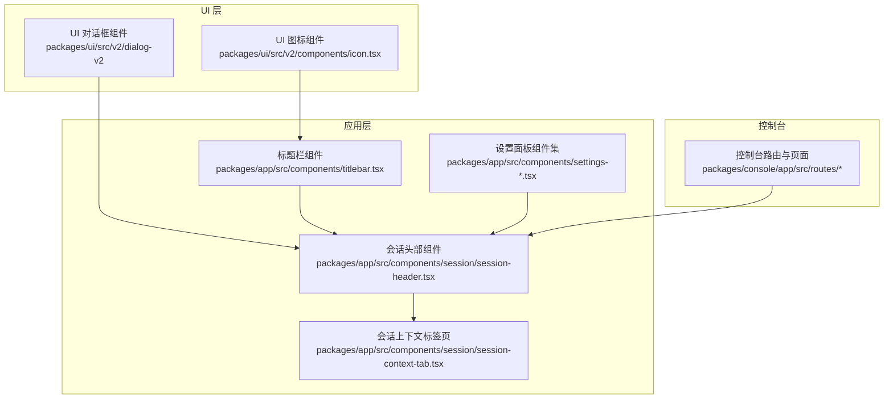
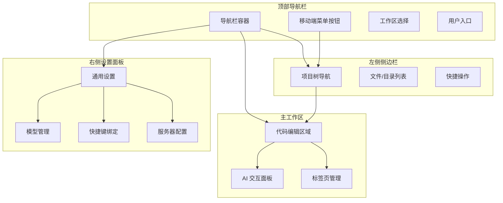
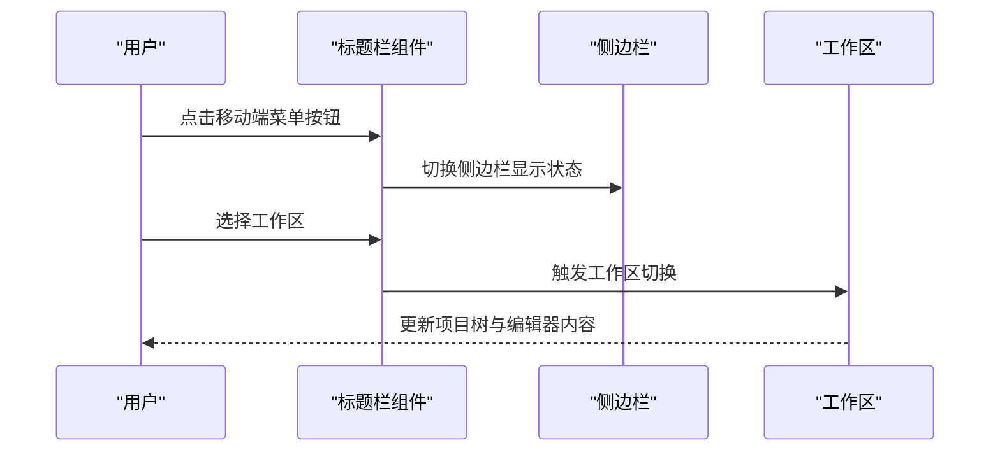
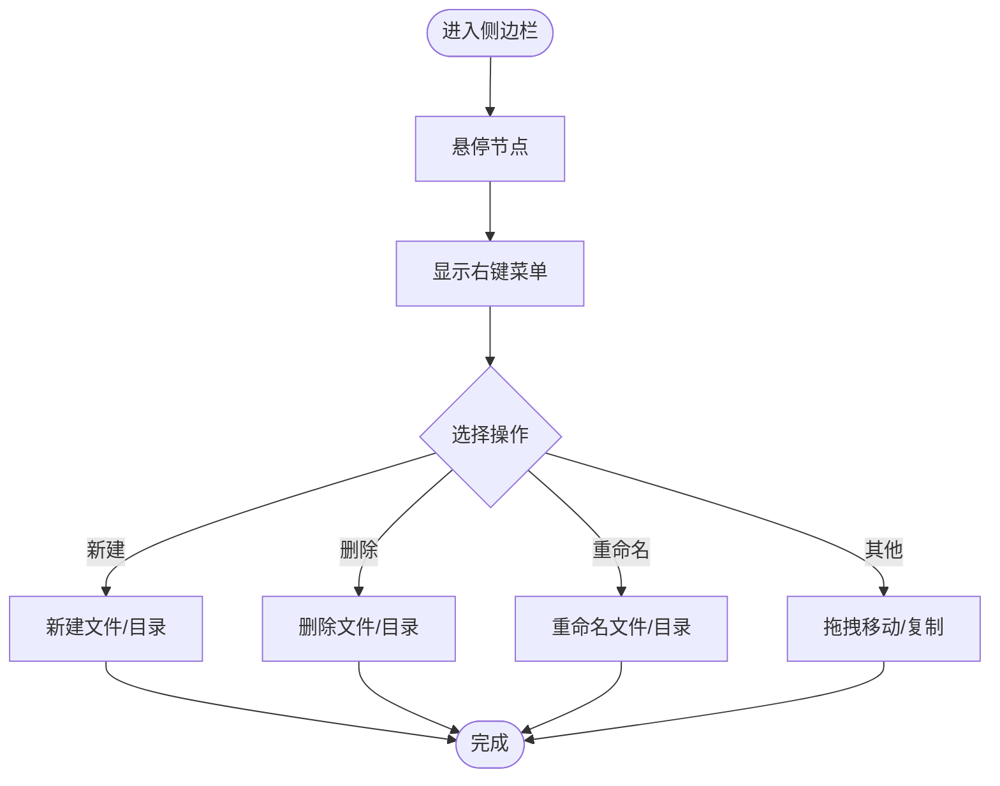
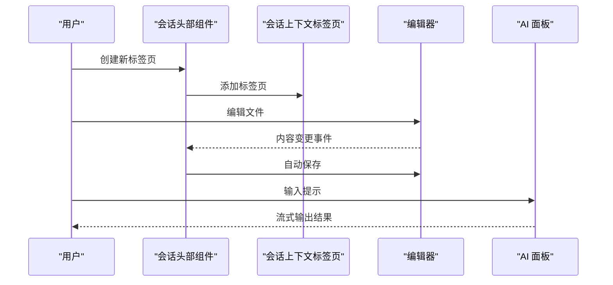
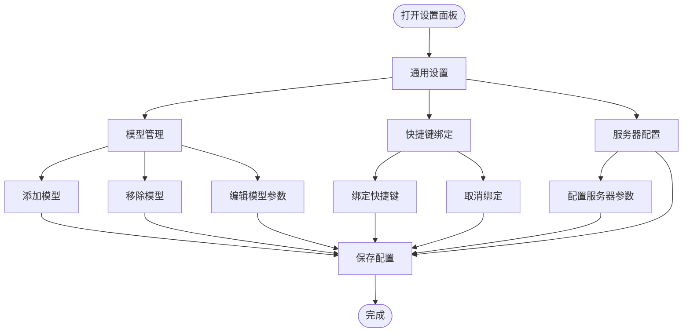
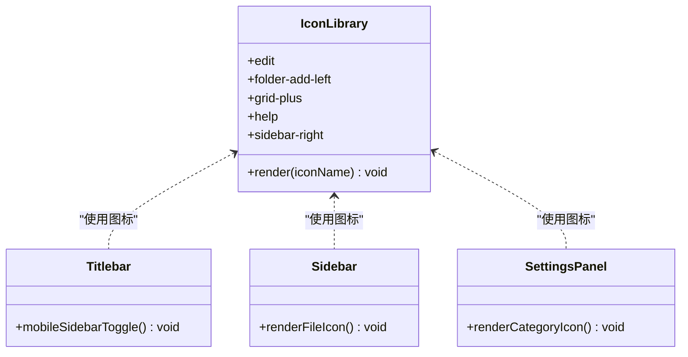
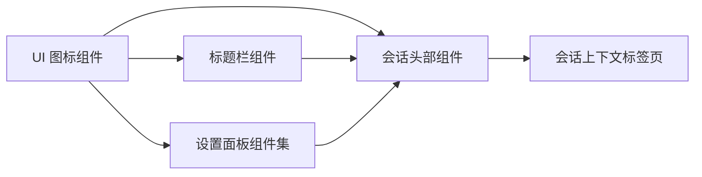

# 界面概览与导航

<cite>
**本文档引用的文件**
- [icon.tsx](file://packages/ui/src/v2/components/icon.tsx)
- [titlebar.tsx](file://packages/app/src/components/titlebar.tsx)
- [session-header.tsx](file://packages/app/src/components/session/session-header.tsx)
- [dialog-custom-provider.tsx](file://packages/app/src/components/dialog-custom-provider.tsx)
- [dialog-manage-models.tsx](file://packages/app/src/components/dialog-manage-models.tsx)
- [dialog-select-directory.tsx](file://packages/app/src/components/dialog-select-directory.tsx)
- [settings-general.tsx](file://packages/app/src/components/settings-general.tsx)
- [settings-keybinds.tsx](file://packages/app/src/components/settings-keybinds.tsx)
- [dialog-server-v2.tsx](file://packages/app/src/components/settings-v2/dialog-server-v2.tsx)
- [session-context-tab.tsx](file://packages/app/src/components/session/session-context-tab.tsx)
</cite>

## 目录
1. [简介](#简介)
2. [项目结构](#项目结构)
3. [核心组件](#核心组件)
4. [架构总览](#架构总览)
5. [详细组件分析](#详细组件分析)
6. [依赖关系分析](#依赖关系分析)
7. [性能考虑](#性能考虑)
8. [故障排除指南](#故障排除指南)
9. [结论](#结论)

## 简介
本文件面向 OpenCode Web 应用的界面使用者与开发者，系统性梳理应用的整体界面布局与导航机制。重点覆盖顶部导航栏、左侧侧边栏、主工作区与右侧设置面板的功能分区，以及项目树导航、代码编辑区域、AI 交互面板等关键功能模块。同时说明响应式设计在不同屏幕尺寸下的布局变化与移动端适配策略，并提供可视化图示与操作指引，帮助用户快速熟悉应用的整体架构与导航方式。

## 项目结构
OpenCode Web 应用采用分层模块化组织，界面相关的关键实现分布在以下包中：
- packages/ui：通用 UI 组件库（图标、对话框等）
- packages/app：应用层组件（标题栏、会话头部、设置面板等）
- packages/console：控制台路由与页面（用于理解工作区与订阅流程）
- 其他包：提供底层能力（LLM、插件、工具等），不直接影响 Web 界面布局

下图展示界面相关模块的高层关系：

**图表来源**
- [icon.tsx:1-20](file://packages/ui/src/v2/components/icon.tsx#L1-L20)
- [titlebar.tsx:583-585](file://packages/app/src/components/titlebar.tsx#L583-L585)
- [session-header.tsx:133-133](file://packages/app/src/components/session/session-header.tsx#L133-L133)
- [session-context-tab.tsx:67-79](file://packages/app/src/components/session/session-context-tab.tsx#L67-L79)

**章节来源**
- [icon.tsx:1-20](file://packages/ui/src/v2/components/icon.tsx#L1-L20)
- [titlebar.tsx:583-585](file://packages/app/src/components/titlebar.tsx#L583-L585)
- [session-header.tsx:133-133](file://packages/app/src/components/session/session-header.tsx#L133-L133)
- [session-context-tab.tsx:67-79](file://packages/app/src/components/session/session-context-tab.tsx#L67-L79)

## 核心组件
本节从界面布局角度拆解四大功能分区及其职责与交互方式：

- 顶部导航栏
  - 职责：全局导航入口、工作区切换、用户操作入口、移动端侧边栏开关
  - 关键交互：点击移动端“菜单”按钮可展开左侧侧边栏；工作区选择触发路由跳转；用户头像或设置入口打开设置面板
  - 响应式行为：在小屏设备上优先显示紧凑的导航元素与移动端专用控件

- 左侧侧边栏
  - 职责：项目树导航、文件/目录浏览、快捷操作入口
  - 关键交互：点击项目节点展开/折叠；右键菜单支持新建、删除、重命名等；拖拽进行移动或复制
  - 响应式行为：在移动端默认隐藏，通过顶部导航栏按钮显隐；在桌面端常驻显示

- 主工作区
  - 职责：代码编辑区域、AI 交互面板、多标签页管理
  - 关键交互：新标签页创建与关闭；编辑器内容变更自动保存；AI 面板输入与输出流式渲染
  - 响应式行为：在窄屏时优先保证编辑器可视区域；AI 面板可折叠或浮动

- 右侧设置面板
  - 职责：全局设置、模型配置、快捷键绑定、服务器配置
  - 关键交互：设置项即时生效或需重启；模型列表支持增删改；快捷键绑定支持自定义
  - 响应式行为：在移动端以抽屉形式出现，避免遮挡主编辑区

**章节来源**
- [titlebar.tsx:583-585](file://packages/app/src/components/titlebar.tsx#L583-L585)
- [session-header.tsx:133-133](file://packages/app/src/components/session/session-header.tsx#L133-L133)
- [settings-general.tsx:391-391](file://packages/app/src/components/settings-general.tsx#L391-L391)
- [settings-keybinds.tsx:45-53](file://packages/app/src/components/settings-keybinds.tsx#L45-L53)

## 架构总览
下图展示界面布局的总体架构与交互流向，体现从顶部导航到侧边栏、主工作区与设置面板的层级关系及响应式适配策略：

**图表来源**
- [titlebar.tsx:583-585](file://packages/app/src/components/titlebar.tsx#L583-L585)
- [session-header.tsx:133-133](file://packages/app/src/components/session/session-header.tsx#L133-L133)
- [settings-general.tsx:391-391](file://packages/app/src/components/settings-general.tsx#L391-L391)
- [settings-keybinds.tsx:45-53](file://packages/app/src/components/settings-keybinds.tsx#L45-L53)

## 详细组件分析

### 顶部导航栏组件分析
- 功能定位：承载全局导航、工作区切换与用户入口，移动端提供侧边栏开关
- 关键实现点：
  - 移动端菜单按钮通过状态控制侧边栏显隐
  - 工作区选择触发路由跳转，影响项目树与编辑器内容
  - 用户入口打开设置面板或执行登出等操作
- 响应式策略：在小屏设备上合并导航元素，优先保证交互效率

**图表来源**
- [titlebar.tsx:583-585](file://packages/app/src/components/titlebar.tsx#L583-L585)

**章节来源**
- [titlebar.tsx:583-585](file://packages/app/src/components/titlebar.tsx#L583-L585)

### 左侧侧边栏组件分析
- 功能定位：提供项目树导航与文件/目录浏览，支持快捷操作与上下文菜单
- 关键实现点：
  - 项目树节点支持展开/折叠与点击选中
  - 右键菜单提供新建、删除、重命名等常用操作
  - 拖拽支持文件/目录的移动或复制
- 响应式策略：移动端默认隐藏，通过顶部按钮显隐；桌面端常驻显示

**图表来源**
- [dialog-custom-provider.tsx:64-64](file://packages/app/src/components/dialog-custom-provider.tsx#L64-L64)
- [dialog-custom-provider.tsx:73-73](file://packages/app/src/components/dialog-custom-provider.tsx#L73-L73)
- [dialog-custom-provider.tsx:96-96](file://packages/app/src/components/dialog-custom-provider.tsx#L96-L96)
- [dialog-custom-provider.tsx:282-282](file://packages/app/src/components/dialog-custom-provider.tsx#L282-L282)
- [dialog-custom-provider.tsx:293-293](file://packages/app/src/components/dialog-custom-provider.tsx#L293-L293)
- [dialog-custom-provider.tsx:303-303](file://packages/app/src/components/dialog-custom-provider.tsx#L303-L303)
- [dialog-custom-provider.tsx:310-310](file://packages/app/src/components/dialog-custom-provider.tsx#L310-L310)

**章节来源**
- [dialog-custom-provider.tsx:64-64](file://packages/app/src/components/dialog-custom-provider.tsx#L64-L64)
- [dialog-custom-provider.tsx:73-73](file://packages/app/src/components/dialog-custom-provider.tsx#L73-L73)
- [dialog-custom-provider.tsx:96-96](file://packages/app/src/components/dialog-custom-provider.tsx#L96-L96)
- [dialog-custom-provider.tsx:282-282](file://packages/app/src/components/dialog-custom-provider.tsx#L282-L282)
- [dialog-custom-provider.tsx:293-293](file://packages/app/src/components/dialog-custom-provider.tsx#L293-L293)
- [dialog-custom-provider.tsx:303-303](file://packages/app/src/components/dialog-custom-provider.tsx#L303-L303)
- [dialog-custom-provider.tsx:310-310](file://packages/app/src/components/dialog-custom-provider.tsx#L310-L310)

### 主工作区组件分析
- 功能定位：代码编辑区域、AI 交互面板与标签页管理
- 关键实现点：
  - 新标签页创建与关闭，支持多文件并行编辑
  - 编辑器内容变更自动保存，确保数据安全
  - AI 面板支持输入与输出流式渲染，提升交互体验
- 响应式策略：在窄屏时优先保证编辑器可视区域；AI 面板可折叠或浮动

**图表来源**
- [session-header.tsx:133-133](file://packages/app/src/components/session/session-header.tsx#L133-L133)
- [session-context-tab.tsx:67-79](file://packages/app/src/components/session/session-context-tab.tsx#L67-L79)

**章节来源**
- [session-header.tsx:133-133](file://packages/app/src/components/session/session-header.tsx#L133-L133)
- [session-context-tab.tsx:67-79](file://packages/app/src/components/session/session-context-tab.tsx#L67-L79)

### 右侧设置面板组件分析
- 功能定位：提供全局设置、模型配置、快捷键绑定与服务器配置
- 关键实现点：
  - 设置项即时生效或需重启，确保配置一致性
  - 模型列表支持增删改，便于管理推理资源
  - 快捷键绑定支持自定义，提升操作效率
- 响应式策略：移动端以抽屉形式出现，避免遮挡主编辑区

**图表来源**
- [settings-general.tsx:391-391](file://packages/app/src/components/settings-general.tsx#L391-L391)
- [settings-keybinds.tsx:45-53](file://packages/app/src/components/settings-keybinds.tsx#L45-L53)
- [dialog-server-v2.tsx:1-1](file://packages/app/src/components/settings-v2/dialog-server-v2.tsx#L1-L1)
- [dialog-server-v2.tsx:118-125](file://packages/app/src/components/settings-v2/dialog-server-v2.tsx#L118-L125)

**章节来源**
- [settings-general.tsx:391-391](file://packages/app/src/components/settings-general.tsx#L391-L391)
- [settings-keybinds.tsx:45-53](file://packages/app/src/components/settings-keybinds.tsx#L45-L53)
- [dialog-server-v2.tsx:1-1](file://packages/app/src/components/settings-v2/dialog-server-v2.tsx#L1-L1)
- [dialog-server-v2.tsx:118-125](file://packages/app/src/components/settings-v2/dialog-server-v2.tsx#L118-L125)

### UI 图标组件分析
- 功能定位：提供统一的图标库，支撑导航、侧边栏、设置面板等组件的视觉表达
- 关键实现点：
  - 定义多种图标资源（如编辑、文件夹新增、网格加号、帮助、侧边栏等）
  - 支持视窗大小与路径绘制，保证在不同分辨率下的清晰度
- 使用场景：顶部导航栏的菜单按钮、侧边栏的文件/目录图标、设置面板的分类图标等

**图表来源**
- [icon.tsx:1-20](file://packages/ui/src/v2/components/icon.tsx#L1-L20)

**章节来源**
- [icon.tsx:1-20](file://packages/ui/src/v2/components/icon.tsx#L1-L20)

## 依赖关系分析
界面组件之间的依赖关系如下：
- UI 图标组件被多个应用层组件复用，形成统一的视觉语言
- 标题栏组件负责移动端侧边栏的显隐控制，是响应式布局的关键入口
- 会话头部组件协调标签页与 AI 面板的交互，是主工作区的核心控制器
- 设置面板组件相互独立但共享配置状态，提供一致的配置体验

**图表来源**
- [icon.tsx:1-20](file://packages/ui/src/v2/components/icon.tsx#L1-L20)
- [titlebar.tsx:583-585](file://packages/app/src/components/titlebar.tsx#L583-L585)
- [session-header.tsx:133-133](file://packages/app/src/components/session/session-header.tsx#L133-L133)
- [session-context-tab.tsx:67-79](file://packages/app/src/components/session/session-context-tab.tsx#L67-L79)

**章节来源**
- [icon.tsx:1-20](file://packages/ui/src/v2/components/icon.tsx#L1-L20)
- [titlebar.tsx:583-585](file://packages/app/src/components/titlebar.tsx#L583-L585)
- [session-header.tsx:133-133](file://packages/app/src/components/session/session-header.tsx#L133-L133)
- [session-context-tab.tsx:67-79](file://packages/app/src/components/session/session-context-tab.tsx#L67-L79)

## 性能考虑
- 图标渲染：使用矢量图标资源，减少图片加载开销，提高缩放清晰度
- 响应式布局：移动端优先采用抽屉与折叠策略，降低 DOM 渲染压力
- 自动保存：编辑器内容变更后异步保存，避免阻塞主线程
- 设置面板：按需加载配置项，避免一次性渲染过多控件导致卡顿

## 故障排除指南
- 侧边栏无法显示/隐藏
  - 检查移动端菜单按钮是否正常响应
  - 确认标题栏组件的状态切换逻辑是否正确
- 项目树无响应
  - 检查右键菜单与拖拽事件绑定
  - 确认文件/目录操作的回调函数是否触发
- 设置面板不生效
  - 确认设置项的即时生效逻辑或重启要求
  - 检查模型管理与快捷键绑定的更新流程
- AI 面板无输出
  - 检查输入事件与流式输出的处理链路
  - 确认网络请求与错误处理逻辑

**章节来源**
- [titlebar.tsx:583-585](file://packages/app/src/components/titlebar.tsx#L583-L585)
- [dialog-custom-provider.tsx:64-64](file://packages/app/src/components/dialog-custom-provider.tsx#L64-L64)
- [dialog-custom-provider.tsx:73-73](file://packages/app/src/components/dialog-custom-provider.tsx#L73-L73)
- [dialog-custom-provider.tsx:96-96](file://packages/app/src/components/dialog-custom-provider.tsx#L96-L96)
- [settings-general.tsx:391-391](file://packages/app/src/components/settings-general.tsx#L391-L391)
- [settings-keybinds.tsx:45-53](file://packages/app/src/components/settings-keybinds.tsx#L45-L53)
- [session-header.tsx:133-133](file://packages/app/src/components/session/session-header.tsx#L133-L133)

## 结论
OpenCode Web 应用通过清晰的四区布局与响应式设计，实现了高效、直观的开发体验。顶部导航栏提供全局入口，左侧侧边栏承载项目树与文件浏览，主工作区聚焦代码编辑与 AI 交互，右侧设置面板满足个性化配置需求。配合统一的 UI 图标体系与完善的交互反馈，用户可在桌面与移动端之间无缝切换，快速完成从项目导航到代码编写的全流程任务。