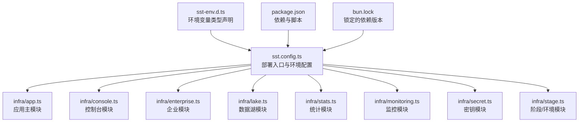
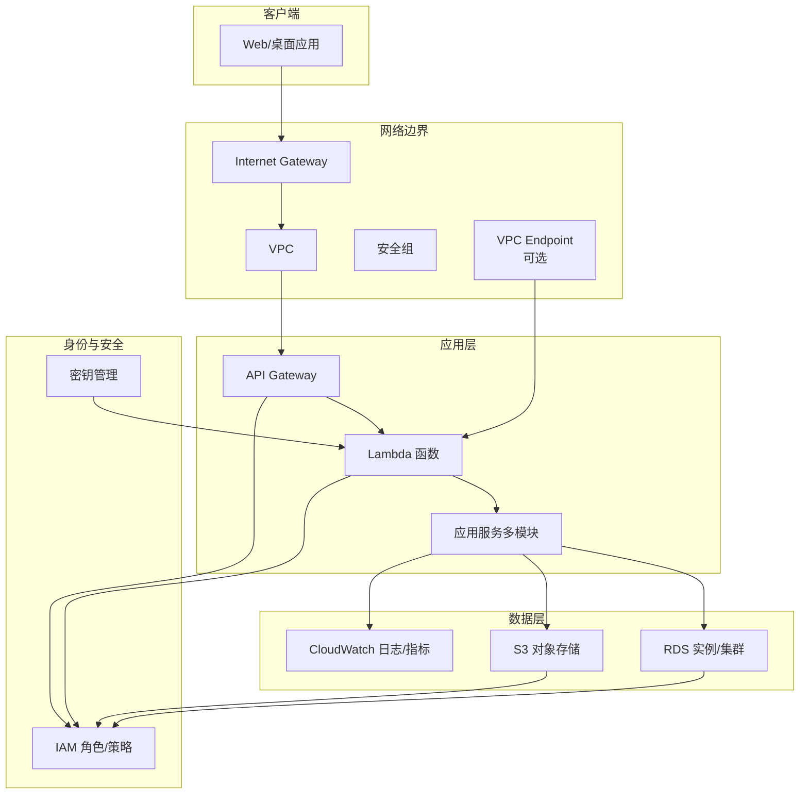
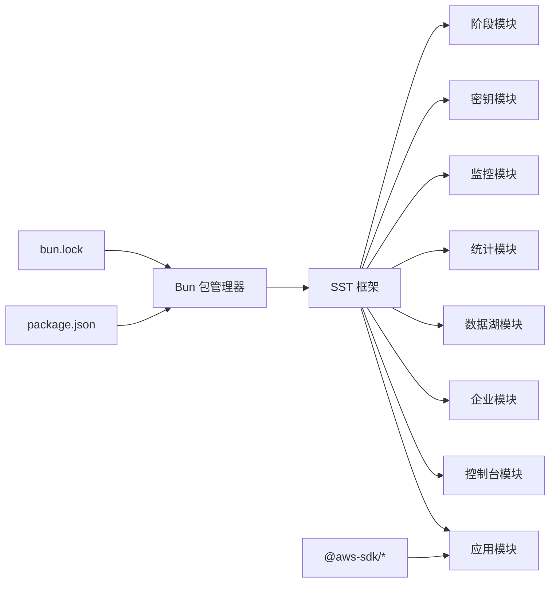

# AWS 配置与架构

<cite>
**本文引用的文件**
- [app.ts](file://infra/app.ts)
- [console.ts](file://infra/console.ts)
- [enterprise.ts](file://infra/enterprise.ts)
- [lake.ts](file://infra/lake.ts)
- [monitoring.ts](file://infra/monitoring.ts)
- [secret.ts](file://infra/secret.ts)
- [stage.ts](file://infra/stage.ts)
- [stats.ts](file://infra/stats.ts)
- [sst.config.ts](file://sst.config.ts)
- [sst-env.d.ts](file://sst-env.d.ts)
- [package.json](file://package.json)
- [bun.lock](file://bun.lock)
- [providers.mdx](file://packages/web/src/content/docs/zh-cn/providers.mdx)
</cite>

## 目录
1. [引言](#引言)
2. [项目结构](#项目结构)
3. [核心组件](#核心组件)
4. [架构总览](#架构总览)
5. [详细组件分析](#详细组件分析)
6. [依赖关系分析](#依赖关系分析)
7. [性能考虑](#性能考虑)
8. [故障排查指南](#故障排查指南)
9. [结论](#结论)
10. [附录](#附录)

## 引言
本文件面向开发者与运维人员，系统化梳理 OpenCode 在 AWS 上的基础设施配置与架构设计，重点覆盖以下方面：
- 基于 SST（Serverless Stack Toolkit）的基础设施即代码（IaC）组织方式
- 核心资源（Lambda、API Gateway、RDS、S3、CloudWatch、IAM 等）的职责与交互
- 不同环境（开发、测试、生产）的资源配置差异与管理策略
- IAM 角色与权限模型、最小权限原则与安全最佳实践
- 网络架构（VPC、子网、安全组）与私有端点（VPC Endpoint）配置
- 资源生命周期管理（创建、更新、删除）与自动化流程
- 成本优化策略与资源清理机制

## 项目结构
OpenCode 的基础设施以模块化方式分布在 infra 目录下，每个模块聚焦特定业务域或能力（如控制台、湖仓、统计、监控、密钥管理等）。顶层配置文件定义了部署目标与环境变量类型。

图表来源
- [sst.config.ts](file://sst.config.ts)
- [sst-env.d.ts](file://sst-env.d.ts)
- [package.json](file://package.json)
- [bun.lock](file://bun.lock)

章节来源
- [sst.config.ts](file://sst.config.ts)
- [sst-env.d.ts](file://sst-env.d.ts)
- [package.json](file://package.json)
- [bun.lock](file://bun.lock)

## 核心组件
- 应用主模块：负责应用服务的统一编排，包含 API 网关、Lambda 函数、数据库连接与存储等。
- 控制台模块：提供前端控制台所需的托管与静态资源分发能力。
- 企业模块：面向企业级能力的扩展模块（如高级鉴权、审计等）。
- 数据湖模块：面向分析型数据的存储与处理（如 S3 分层、查询引擎接入）。
- 统计模块：面向指标采集与报表展示的后端服务。
- 监控模块：面向日志、告警与可观测性的基础设施。
- 密钥模块：集中化的密钥与凭据管理（Secrets Manager 或参数存储）。
- 阶段模块：按环境（dev/test/prod）隔离的资源集合与策略。

章节来源
- [app.ts](file://infra/app.ts)
- [console.ts](file://infra/console.ts)
- [enterprise.ts](file://infra/enterprise.ts)
- [lake.ts](file://infra/lake.ts)
- [monitoring.ts](file://infra/monitoring.ts)
- [secret.ts](file://infra/secret.ts)
- [stage.ts](file://infra/stage.ts)
- [stats.ts](file://infra/stats.ts)

## 架构总览
下图展示了 OpenCode 在 AWS 上的整体架构：前端通过 API Gateway 暴露 REST 接口，后端由 Lambda 承载；数据持久化采用 RDS（关系型）与 S3（对象存储），日志与指标由 CloudWatch 管理；IAM 角色与策略保障最小权限；可选地通过 VPC Endpoint 将外部服务（如 Bedrock）接入私网。

图表来源
- [app.ts](file://infra/app.ts)
- [console.ts](file://infra/console.ts)
- [monitoring.ts](file://infra/monitoring.ts)
- [providers.mdx](file://packages/web/src/content/docs/zh-cn/providers.mdx)

## 详细组件分析

### 应用主模块（App）
- 职责：聚合 API 网关、Lambda、数据库与存储等核心资源，作为应用服务的统一入口。
- 关键点：
  - API 网关：定义路由、CORS、限流与访问日志。
  - Lambda：按功能拆分函数，共享运行时与层，复用工具链。
  - 数据库：RDS（PostgreSQL/MySQL 等）连接池与只读副本（如需）。
  - 存储：S3 桶用于上传、导出与备份，启用版本化与生命周期策略。
- 环境隔离：通过阶段模块区分 dev/test/prod 的资源命名与配额。

章节来源
- [app.ts](file://infra/app.ts)
- [stage.ts](file://infra/stage.ts)

### 控制台模块（Console）
- 职责：托管前端静态资源，提供 CDN 加速与 HTTPS 终端。
- 关键点：
  - CloudFront + S3：静态站点托管与缓存。
  - Route 53：域名解析与证书管理。
  - 安全：仅允许 HTTPS 访问，限制来源 IP（可选）。

章节来源
- [console.ts](file://infra/console.ts)

### 企业模块（Enterprise）
- 职责：提供企业级能力（如 SSO、审计、合规）。
- 关键点：
  - IAM 策略细化到最小权限。
  - CloudTrail 与 Config 审计。
  - KMS 密钥策略与密钥轮换。

章节来源
- [enterprise.ts](file://infra/enterprise.ts)

### 数据湖模块（Lake）
- 职责：构建分析型数据平台。
- 关键点：
  - S3 分层存储（标准/归档/智能分层）。
  - Athena/Firehose/Redshift Serverless 查询与计算。
  - Glue/Crawler 元数据与分区管理。

章节来源
- [lake.ts](file://infra/lake.ts)

### 统计模块（Stats）
- 职责：指标采集、聚合与可视化。
- 关键点：
  - Lambda + EventBridge/Scheduled Events 定时任务。
  - CloudWatch 自定义指标与告警。
  - Dashboard 与 Insights。

章节来源
- [stats.ts](file://infra/stats.ts)
- [monitoring.ts](file://infra/monitoring.ts)

### 监控模块（Monitoring）
- 职责：日志、指标、告警与根因分析。
- 关键点：
  - CloudWatch Logs/Events/Insights。
  - SNS/ChatOps 告警通知。
  - X-Ray 分布式追踪（可选）。

章节来源
- [monitoring.ts](file://infra/monitoring.ts)

### 密钥模块（Secrets）
- 职责：集中化密钥与敏感信息管理。
- 关键点：
  - Secrets Manager 参数存储。
  - KMS CMK 策略与访问控制。
  - 自动轮换与访问审计。

章节来源
- [secret.ts](file://infra/secret.ts)

### 阶段模块（Stage）
- 职责：按环境隔离资源，统一命名与标签。
- 关键点：
  - dev/test/prod 三环境差异化配额与保留策略。
  - 资源标签规范化，便于成本归集与治理。

章节来源
- [stage.ts](file://infra/stage.ts)

### 网络与安全（VPC、子网、安全组、VPC Endpoint）
- VPC：默认 VPC 或专用 VPC，按区域部署。
- 子网：公有/私有混合布局，跨可用区分布。
- 安全组：仅开放必要端口（API 网关、数据库、应用端口）。
- VPC Endpoint：通过 Gateway/Interface 终端接入 S3/DynamoDB 等，降低延迟与带宽成本，并增强安全性。
- 外部服务：如 Bedrock 可通过 VPC Endpoint 内网访问，减少暴露面。

章节来源
- [providers.mdx](file://packages/web/src/content/docs/zh-cn/providers.mdx)

### IAM 角色与权限模型
- 最小权限原则：为每个角色授予完成任务所必需的最小权限集合。
- 分离职责：执行角色（Lambda）、API 访问角色（API Gateway）、数据访问角色（RDS/S3）分离。
- 策略细化：使用条件语句限制时间、IP、资源 ARN 等。
- 审计与合规：开启 CloudTrail，定期审查策略与权限变更。

章节来源
- [app.ts](file://infra/app.ts)
- [enterprise.ts](file://infra/enterprise.ts)
- [monitoring.ts](file://infra/monitoring.ts)

### 资源生命周期管理
- 创建：通过 SST CLI 一键部署，自动解析依赖与顺序。
- 更新：蓝绿/滚动发布策略，配合 API 网关版本与别名管理。
- 删除：清理脚本与保护开关，避免误删关键资源；对 S3/DB 使用版本化与备份。

章节来源
- [sst.config.ts](file://sst.config.ts)
- [stage.ts](file://infra/stage.ts)

## 依赖关系分析
- 工具链依赖：SST 作为 IaC 与部署框架，@aws-sdk 客户端用于运行时 SDK 调用。
- 语言与包管理：Bun 作为运行时与包管理器，package.json 管理脚本与依赖。
- 文档与配置：providers.mdx 提供 AWS 认证与 VPC Endpoint 配置示例，指导用户正确设置区域、凭据与端点。

图表来源
- [sst.config.ts](file://sst.config.ts)
- [bun.lock](file://bun.lock)
- [package.json](file://package.json)

章节来源
- [bun.lock](file://bun.lock)
- [package.json](file://package.json)

## 性能考虑
- Lambda：
  - 合理设置并发与内存上限，结合预留并发保障突发流量。
  - 使用层与共享依赖减少冷启动时间。
- API Gateway：
  - 开启压缩与缓存，合理设置超时与限流。
- 数据库：
  - RDS 使用只读副本分流查询，开启慢查询日志与性能洞察。
- 存储：
  - S3 选择合适存储类别与生命周期策略，启用多版本与跨区域复制（如需）。
- 网络：
  - VPC Endpoint 降低跨账户/跨服务调用延迟与成本。

## 故障排查指南
- 权限问题：
  - 检查 IAM 角色策略与附加策略，确认最小权限是否满足需求。
  - 使用策略评估工具验证权限。
- 网络问题：
  - 核对安全组规则、路由表与 NAT 网关配置。
  - 如使用 VPC Endpoint，检查终端节点策略与路由。
- 数据库问题：
  - 查看 RDS 操作日志与性能指标，确认连接数与慢查询。
- 日志与告警：
  - 使用 CloudWatch Logs/Insights 快速定位错误堆栈。
  - 检查告警规则与通知渠道，确保及时响应。

章节来源
- [monitoring.ts](file://infra/monitoring.ts)
- [providers.mdx](file://packages/web/src/content/docs/zh-cn/providers.mdx)

## 结论
OpenCode 的 AWS 架构以 SST 为核心，围绕模块化基础设施实现清晰的职责分离与环境隔离。通过最小权限的 IAM 设计、完善的网络与安全策略、以及可观测性与成本优化手段，既满足开发效率，也兼顾生产稳定性与合规要求。建议持续完善自动化流程与演练，确保变更可控、回滚可行、成本可压。

## 附录

### 环境与认证配置要点
- 区域与凭据：通过配置文件或环境变量指定区域与命名凭据文件。
- VPC Endpoint：当对接外部服务（如 Bedrock）时，可通过 VPC Endpoint 内网访问，提升安全性与降低成本。
- 认证方式：支持访问密钥、命名凭据文件与 Bearer Token 等多种方式。

章节来源
- [providers.mdx](file://packages/web/src/content/docs/zh-cn/providers.mdx)