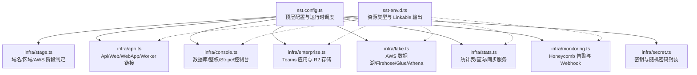
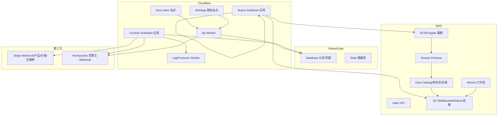
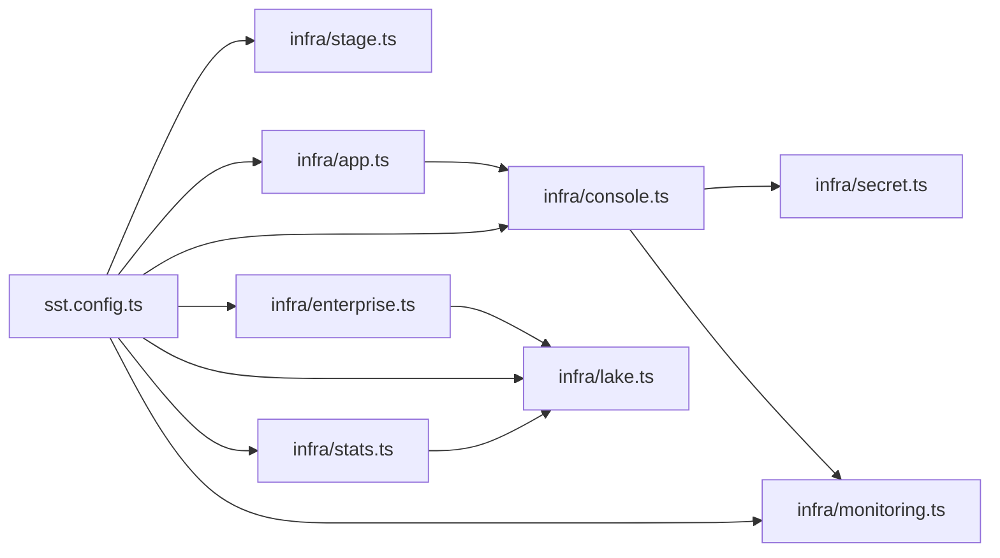
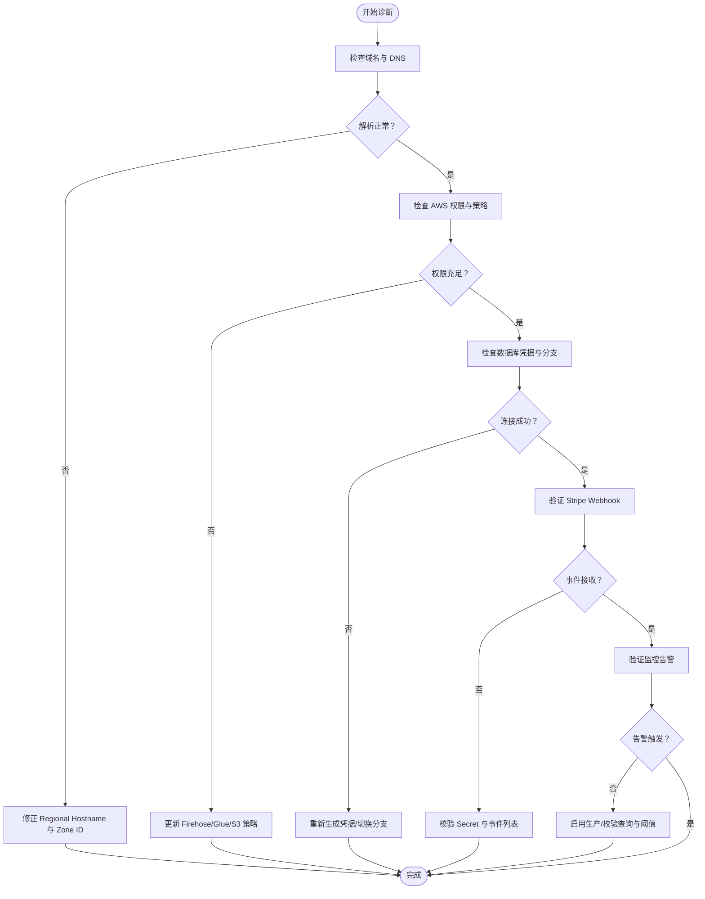

# SST 部署与管理

<cite>
**本文引用的文件**
- [sst.config.ts](file://sst.config.ts)
- [sst-env.d.ts](file://sst-env.d.ts)
- [stage.ts](file://infra/stage.ts)
- [app.ts](file://infra/app.ts)
- [console.ts](file://infra/console.ts)
- [enterprise.ts](file://infra/enterprise.ts)
- [lake.ts](file://infra/lake.ts)
- [stats.ts](file://infra/stats.ts)
- [monitoring.ts](file://infra/monitoring.ts)
- [secret.ts](file://infra/secret.ts)
</cite>

## 目录
1. [简介](#简介)
2. [项目结构](#项目结构)
3. [核心组件](#核心组件)
4. [架构总览](#架构总览)
5. [详细组件分析](#详细组件分析)
6. [依赖关系分析](#依赖关系分析)
7. [性能考虑](#性能考虑)
8. [故障排查指南](#故障排查指南)
9. [结论](#结论)
10. [附录](#附录)

## 简介
本指南面向使用 OpenCode 的 SST（Serverless Stack Toolkit）进行部署与运维的工程师与平台团队，系统讲解 SST 配置文件结构、应用定义、环境变量管理、资源依赖关系、自动化部署流程、多环境策略、开发模式与热重载、CI/CD 最佳实践、性能监控与日志采集等主题。文档以仓库中的实际基础设施代码为依据，结合 SST 的声明式 DSL 与多云提供商集成能力，帮助读者快速掌握从本地开发到生产发布的全链路部署与管理。

## 项目结构
OpenCode 的 SST 部署由顶层配置文件驱动，按阶段动态加载不同模块，形成“按需装配”的基础设施清单。核心结构如下：
- 顶层配置：定义应用名称、清理策略、保护策略、默认云提供商、版本与区域、凭据来源等。
- 基础设施模块：按功能域拆分，如应用服务、控制台、企业版、数据湖、统计与查询、监控告警等。
- 环境与域名：通过阶段推导域名、区域与是否部署 AWS 资源，统一 Cloudflare DNS 与 Regional Hostname。
- 类型与链接：通过 sst-env.d.ts 提供资源类型与 Linkable 输出，便于应用侧强类型访问。

图表来源
- [sst.config.ts:1-54](file://sst.config.ts#L1-L54)
- [stage.ts:1-22](file://infra/stage.ts#L1-L22)
- [app.ts:1-70](file://infra/app.ts#L1-L70)
- [console.ts:1-307](file://infra/console.ts#L1-L307)
- [enterprise.ts:1-18](file://infra/enterprise.ts#L1-L18)
- [lake.ts:1-328](file://infra/lake.ts#L1-L328)
- [stats.ts:1-204](file://infra/stats.ts#L1-L204)
- [monitoring.ts:1-288](file://infra/monitoring.ts#L1-L288)
- [secret.ts:1-15](file://infra/secret.ts#L1-L15)
- [sst-env.d.ts:1-308](file://sst-env.d.ts#L1-L308)

章节来源
- [sst.config.ts:1-54](file://sst.config.ts#L1-L54)
- [stage.ts:1-22](file://infra/stage.ts#L1-L22)
- [sst-env.d.ts:1-308](file://sst-env.d.ts#L1-L308)

## 核心组件
- 应用与提供商配置
  - 应用名、删除策略（生产保留）、保护策略（生产保护）、默认提供商（Cloudflare Workers）、AWS 版本与区域、凭据来源（本地或 CI）。
  - Stripe、Random、PlanetScale、Honeycomb 等第三方提供商集成。
- 运行时调度
  - 按阶段导入模块：基础应用、控制台、企业版；条件性导入数据湖与统计模块；生产或特定阶段启用监控。
  - 返回输出键值：StatWorkerUrl、StatsUrl（可选）、LakeUrl/LakeSecretSsm（可选）、AwsStage。
- 资源类型与链接
  - sst-env.d.ts 定义了大量资源类型（如 Api、Console、Web、WebApp、Database、StripeWebhookSecret 等），以及 Linkable 输出，供应用侧强类型消费。

章节来源
- [sst.config.ts:3-29](file://sst.config.ts#L3-L29)
- [sst.config.ts:30-52](file://sst.config.ts#L30-L52)
- [sst-env.d.ts:7-308](file://sst-env.d.ts#L7-L308)

## 架构总览
下图展示 SST 部署在不同阶段的资源装配与交互关系，涵盖 Cloudflare 主要服务、AWS 数据湖与查询、Stripe 订阅与 Webhook、Honeycomb 监控告警等。

图表来源
- [app.ts:13-70](file://infra/app.ts#L13-L70)
- [console.ts:11-296](file://infra/console.ts#L11-L296)
- [enterprise.ts:4-17](file://infra/enterprise.ts#L4-L17)
- [lake.ts:16-268](file://infra/lake.ts#L16-L268)
- [stats.ts:9-170](file://infra/stats.ts#L9-L170)
- [monitoring.ts:7-287](file://infra/monitoring.ts#L7-L287)

## 详细组件分析

### 配置与运行时调度（sst.config.ts）
- 关键点
  - app(input)：设置应用名、删除与保护策略、home 为 Cloudflare、providers 中 AWS/Stripe/Random/PlanetScale/Honeycomb 的版本与密钥来源。
  - run()：根据阶段动态导入模块；条件性部署 AWS 资源；返回 Linkable 输出键值，供应用侧消费。
- 自动化要点
  - 代码打包：由各应用/站点构建命令触发（例如 WebApp 使用 bun turbo build）。
  - 资源创建：按模块导入顺序执行，Linkable 输出作为下游依赖。
  - 域名与证书：通过 Cloudflare Regional Hostname 与域名解析实现，HTTPS 由 Cloudflare 终端。
  - SSL 证书：Cloudflare 自动签发与续期，无需手动管理。
- 多环境策略
  - 清理与保护：生产保留资源、受保护；非生产自动移除。
  - 凭据来源：本地与 CI（GitHub Actions）区分，CI 下使用环境变量覆盖 AWS profile。
  - AWS 阶段映射：awsStage 将非生产映射为 dev，生产保持 production，用于 AWS 资源部署决策。

章节来源
- [sst.config.ts:3-29](file://sst.config.ts#L3-L29)
- [sst.config.ts:30-52](file://sst.config.ts#L30-L52)

### 域名与区域（infra/stage.ts）
- 关键点
  - 基于阶段生成主域名与短域名，统一 Cloudflare 区域主机名与 Zone ID。
  - awsStage 与 deployAws 决定是否部署 AWS 数据湖与相关服务。
- 多环境命名规范
  - 生产：opencode.ai；开发：dev.opencode.ai；其他阶段：<stage>.dev.opencode.ai。
  - Teams 短域名：opncd.ai 或 dev.opncd.ai 或 <stage>.dev.opncd.ai。

章节来源
- [stage.ts:1-22](file://infra/stage.ts#L1-L22)

### 应用与前端（infra/app.ts）
- 关键点
  - Api Worker：绑定 R2 Bucket、多套 Secret、转发到 SyncServer（Durable Object）迁移配置。
  - Docs Astro 站点：绑定 Api URL，注入 SST_STAGE 与 VITE_API_URL。
  - WebApp 静态站点：使用 bun turbo build，输出到 dist。
- 开发模式与热重载
  - 各应用/站点支持 DevCommand/DevServer，可在本地启动开发服务器并自动重载。
- 环境变量管理
  - 通过 environment 字段注入，如 WEB_DOMAIN、SST_STAGE、VITE_API_URL。

章节来源
- [app.ts:13-70](file://infra/app.ts#L13-L70)

### 控制台与鉴权（infra/console.ts）
- 关键点
  - PlanetScale 数据库分支与凭据：生产走 production 分支，非生产创建/复用阶段分支。
  - Auth Worker：绑定数据库、KV 存储与 OAuth 客户端密钥。
  - Stripe Webhook：注册事件列表，生成 Secret 并暴露 Linkable。
  - Console 应用：SolidStart，链接数据库、R2、Stripe、Honeycomb、邮件/Salesforce 等 Secret，注入 VITE_AUTH_URL 与公开密钥。
  - LogProcessor：接收 Tail 事件并写入数据湖（可选）。
- 环境变量管理
  - 注入 VITE_AUTH_URL、VITE_STRIPE_PUBLISHABLE_KEY 等。
- 多环境策略
  - 非生产注入 CLOUDFLARE_* Secret 以便本地开发。

章节来源
- [console.ts:11-296](file://infra/console.ts#L11-L296)

### 企业版与存储（infra/enterprise.ts）
- 关键点
  - Teams 应用：SolidStart，绑定 R2 存储与账户凭据，设置存储适配器为 r2。
  - 环境变量：OPENCODE_STORAGE_* 与 OPENCODE_STORAGE_BUCKET。
- 多环境策略
  - 通过短域名与阶段解耦，独立部署与域名解析。

章节来源
- [enterprise.ts:4-17](file://infra/enterprise.ts#L4-L17)

### 数据湖与查询（infra/lake.ts）
- 关键点
  - TableBucket：按阶段命名，强制销毁策略随阶段变化。
  - Glue Catalog：联邦 Catalog，授权 IAM_ALLOWED_PRINCIPALS 具备 ALL 权限。
  - Athena 工作组：结果输出至 S3，开启 CloudWatch 指标。
  - Firehose：Iceberg 处理，元数据提取，错误落盘至 S3。
  - ECS/Fargate：自定义镜像，暴露健康检查与负载均衡规则，CPU/Memory 规格随阶段调整。
  - Ingest Secret：随机密码写入 SSM Parameter Store，供上游服务认证。
- 多环境策略
  - 生产最小副本与更高上限，非生产更小规模。
- 资源命名规范
  - 统一前缀 opencode-<stage>-lake-*，避免跨阶段冲突。

章节来源
- [lake.ts:16-268](file://infra/lake.ts#L16-L268)

### 统计与查询（infra/stats.ts）
- 关键点
  - Inference Event 表：Iceberg 格式，Schema 覆盖 LLM 推理关键指标。
  - Stats 数据库：PlanetScale，生产走 production 分支，非生产创建/复用分支。
  - Stats Studio：本地数据库可视化工具。
  - Stats 应用：SolidStart，绑定数据库与邮件 API Key。
  - StatsSync 服务：连接 Athena/Glue/S3，执行统计同步任务。
- 多环境策略
  - 非生产可删除替换，减少资源占用。

章节来源
- [stats.ts:9-170](file://infra/stats.ts#L9-L170)
- [stats.ts:182-204](file://infra/stats.ts#L182-L204)

### 监控与告警（infra/monitoring.ts）
- 关键点
  - Discord Webhook：通过 Console 的 Honeycomb Webhook Secret 与域名路径接收告警。
  - 查询与公式：按模型/提供商维度计算 HTTP 错误率、低 TPS、免费套餐请求增长等。
  - 触发器：基于阈值与频率触发，仅在生产启用。
- 多环境策略
  - 非生产禁用告警，避免噪音。

章节来源
- [monitoring.ts:7-287](file://infra/monitoring.ts#L7-L287)

### 密钥与随机数（infra/secret.ts）
- 关键点
  - 封装 RandomPassword 为 Linkable，统一输出 value。
  - 定义 R2、Honeycomb、Upstash 等 Secret，供各模块链接。

章节来源
- [secret.ts:1-15](file://infra/secret.ts#L1-L15)

### 类型与链接（sst-env.d.ts）
- 关键点
  - Resource 接口定义所有资源类型与 Linkable 输出，如 Api、Console、Web、WebApp、Database、StripeWebhookSecret、ZEN_* 等。
  - 应用侧可通过类型提示安全地读取资源 URL、凭据与链接信息。

章节来源
- [sst-env.d.ts:7-308](file://sst-env.d.ts#L7-L308)

## 依赖关系分析
- 模块耦合
  - sst.config.ts 是入口，按阶段选择性导入模块，降低全局耦合度。
  - console.ts 与 app.ts 之间存在 Linkable 依赖（如 AUTH_API_URL、Database），需先创建后消费。
  - enterprise.ts 与 lake.ts 在 AWS 阶段上存在条件性耦合（deployAws）。
- 外部依赖
  - Cloudflare：Workers、R2、KV、DNS、Regional Hostname。
  - AWS：S3Tables、Glue、Athena、Firehose、ECS/Fargate、SSM。
  - 第三方：Stripe、PlanetScale、Honeycomb。

图表来源
- [sst.config.ts:30-52](file://sst.config.ts#L30-L52)
- [stage.ts:1-22](file://infra/stage.ts#L1-L22)
- [app.ts:13-70](file://infra/app.ts#L13-L70)
- [console.ts:11-296](file://infra/console.ts#L11-L296)
- [enterprise.ts:4-17](file://infra/enterprise.ts#L4-L17)
- [lake.ts:16-268](file://infra/lake.ts#L16-L268)
- [stats.ts:9-170](file://infra/stats.ts#L9-L170)
- [monitoring.ts:7-287](file://infra/monitoring.ts#L7-L287)
- [secret.ts:1-15](file://infra/secret.ts#L1-L15)

## 性能考虑
- 资源规格与弹性
  - 数据湖 ECS 服务 CPU/Memory 与副本数随阶段调整，生产更大弹性与更高上限。
- 查询性能
  - Iceberg 表格式与分区设计有助于 Athena 快速扫描与过滤。
- 日志与可观测性
  - Cloudflare Worker Tail 与 Honeycomb 结合，快速定位异常。
- 缓存与存储
  - Upstash Redis 用于会话与缓存，R2 用于企业版对象存储。

章节来源
- [lake.ts:230-235](file://infra/lake.ts#L230-L235)
- [stats.ts:194-197](file://infra/stats.ts#L194-L197)
- [console.ts:254-256](file://infra/console.ts#L254-L256)

## 故障排查指南
- 常见错误类型与修复
  - 域名解析失败
    - 症状：站点无法访问或 HTTPS 异常。
    - 排查：确认 Regional Hostname 是否创建成功、Zone ID 正确、DNS 解析指向 Cloudflare。
    - 参考：[stage.ts:11-15](file://infra/stage.ts#L11-L15)
  - AWS 资源权限不足
    - 症状：Firehose 写入失败、Glue 元数据访问被拒。
    - 排查：核对 Firehose Role Policy 与 Glue Catalog 授权策略，确认 S3/Bucket 权限。
    - 参考：[lake.ts:93-154](file://infra/lake.ts#L93-L154)
  - 数据库凭据错误
    - 症状：控制台/统计应用连接失败。
    - 排查：确认 PlanetScale 分支与凭据生成，Linkable 输出是否正确注入。
    - 参考：[console.ts:29-44](file://infra/console.ts#L29-L44)，[stats.ts:124-144](file://infra/stats.ts#L124-L144)
  - Stripe Webhook 不生效
    - 症状：订阅状态不同步。
    - 排查：确认 Webhook Secret 与事件列表，检查 Console 的 Linkable 输出。
    - 参考：[console.ts:74-104](file://infra/console.ts#L74-L104)
  - 监控告警不触发
    - 症状：异常无通知。
    - 排查：确认生产阶段启用、Honeycomb API Key 与 Webhook Secret，查询表达式与阈值。
    - 参考：[monitoring.ts:5](file://infra/monitoring.ts#L5)，[monitoring.ts:160-178](file://infra/monitoring.ts#L160-L178)
- 诊断流程图

图表来源
- [stage.ts:11-15](file://infra/stage.ts#L11-L15)
- [lake.ts:93-154](file://infra/lake.ts#L93-L154)
- [console.ts:29-44](file://infra/console.ts#L29-L44)
- [stats.ts:124-144](file://infra/stats.ts#L124-L144)
- [monitoring.ts:5](file://infra/monitoring.ts#L5)

## 结论
OpenCode 的 SST 部署体系通过“按阶段装配”的模块化设计，实现了 Cloudflare 主站与 AWS 数据湖的协同、PlanetScale 数据库的分支化管理、Stripe 订阅与 Webhook 的闭环、Honeycomb 的实时告警联动。配合 sst-env.d.ts 的强类型资源描述，应用侧可以安全、一致地消费 Linkable 输出。建议在 CI/CD 中严格区分生产与非生产阶段，遵循资源命名规范与权限最小化原则，确保持续交付的稳定性与可维护性。

## 附录
- CI/CD 集成最佳实践
  - GitHub Actions：利用环境变量覆盖 AWS profile，避免本地凭据泄露。
  - 构建命令：统一使用 bun turbo 或各应用自有构建脚本，确保产物一致性。
  - 安全：敏感信息通过 Secret 管理，Linkable 输出仅在部署后可见。
- 性能监控与日志收集
  - Cloudflare：Worker Tail 与日志推送，结合 Honeycomb 实时观测。
  - AWS：Firehose 元数据提取与错误落盘，Athena 快速查询。
  - 控制台：本地 DevCommand 支持快速迭代与问题定位。

章节来源
- [sst.config.ts:14-18](file://sst.config.ts#L14-L18)
- [app.ts:62-69](file://infra/app.ts#L62-L69)
- [console.ts:46-53](file://infra/console.ts#L46-L53)
- [stats.ts:146-156](file://infra/stats.ts#L146-L156)