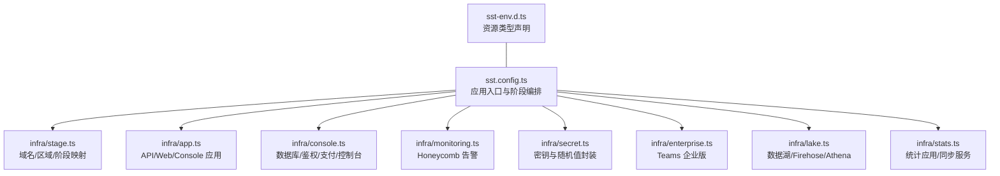
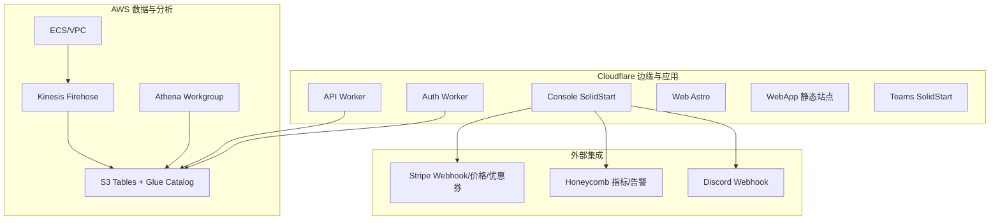
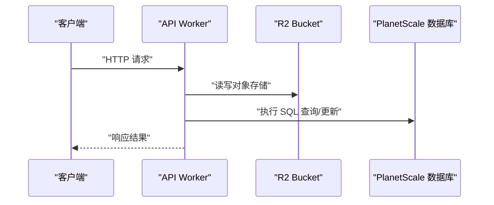
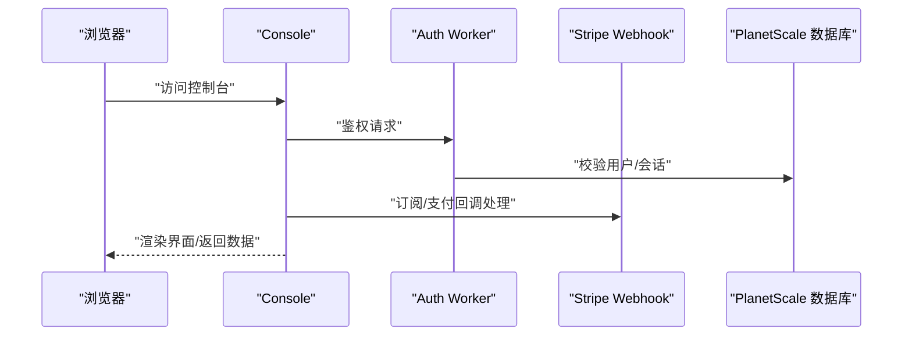
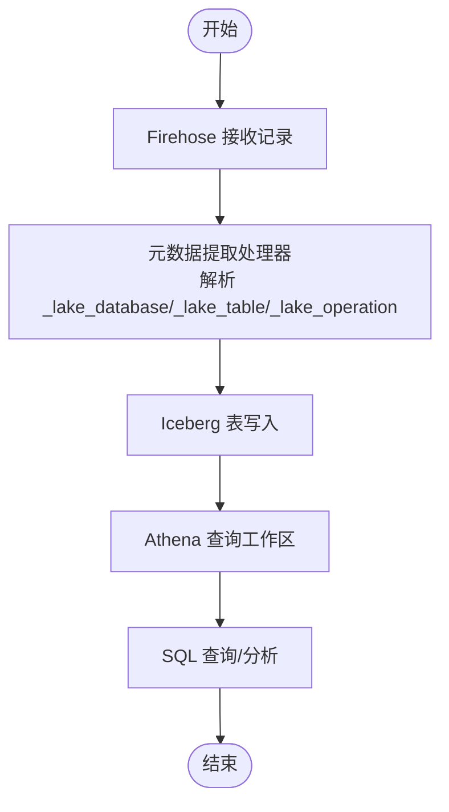
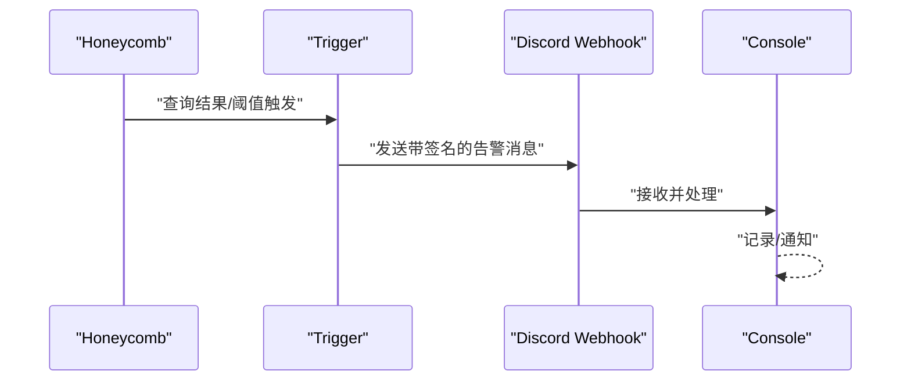
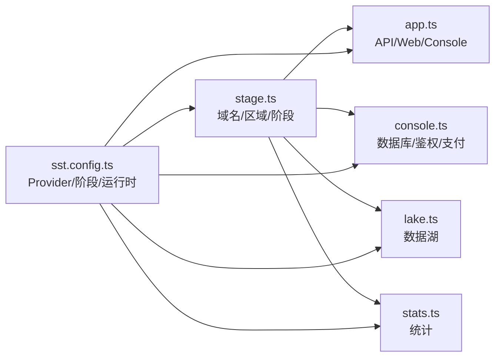

# 云基础设施

<cite>
**本文引用的文件**
- [sst.config.ts](file://sst.config.ts)
- [sst-env.d.ts](file://sst-env.d.ts)
- [infra/stage.ts](file://infra/stage.ts)
- [infra/app.ts](file://infra/app.ts)
- [infra/console.ts](file://infra/console.ts)
- [infra/monitoring.ts](file://infra/monitoring.ts)
- [infra/secret.ts](file://infra/secret.ts)
- [infra/enterprise.ts](file://infra/enterprise.ts)
- [infra/lake.ts](file://infra/lake.ts)
- [infra/stats.ts](file://infra/stats.ts)
</cite>

## 目录
1. [简介](#简介)
2. [项目结构](#项目结构)
3. [核心组件](#核心组件)
4. [架构总览](#架构总览)
5. [详细组件分析](#详细组件分析)
6. [依赖关系分析](#依赖关系分析)
7. [性能与扩展性](#性能与扩展性)
8. [监控与告警](#监控与告警)
9. [安全与访问控制](#安全与访问控制)
10. [多环境部署策略](#多环境部署策略)
11. [CI/CD 与自动化部署](#cicd-与自动化部署)
12. [故障排除与运维指南](#故障排除与运维指南)
13. [结论](#结论)

## 简介
本文件面向 OpenCode 的云基础设施运维与平台工程团队，系统化梳理基于 SST（Serverless Stack Toolkit）与 AWS 的基础设施架构，覆盖 CloudFormation 模板、SST 配置、Cloudflare Workers 与 Lambda 函数、数据湖与查询服务、监控与告警、安全与访问控制、多环境策略、CI/CD 自动化以及运维排障与性能优化建议。目标是帮助运维人员高效管理与维护 OpenCode 的云环境。

## 项目结构
OpenCode 的基础设施以 SST 配置为中心，通过 sst.config.ts 统一编排各模块；核心模块分布在 infra 目录下，分别负责域名与区域、应用层（API/Web/Console）、企业版 Teams、数据湖与统计服务、监控与密钥管理等。Cloudflare Workers 承载无服务器应用，AWS 负责数据湖、查询与部分服务编排。

图表来源
- [sst.config.ts:30-52](file://sst.config.ts#L30-L52)
- [infra/stage.ts:1-22](file://infra/stage.ts#L1-L22)
- [infra/app.ts:1-70](file://infra/app.ts#L1-L70)
- [infra/console.ts:1-307](file://infra/console.ts#L1-L307)
- [infra/monitoring.ts:1-288](file://infra/monitoring.ts#L1-L288)
- [infra/secret.ts:1-15](file://infra/secret.ts#L1-L15)
- [infra/enterprise.ts:1-18](file://infra/enterprise.ts#L1-L18)
- [infra/lake.ts:1-328](file://infra/lake.ts#L1-L328)
- [infra/stats.ts:1-204](file://infra/stats.ts#L1-L204)

章节来源
- [sst.config.ts:3-29](file://sst.config.ts#L3-L29)
- [sst.config.ts:30-52](file://sst.config.ts#L30-L52)

## 核心组件
- 应用与前端
  - API Worker：承载后端接口，绑定存储与第三方密钥，启用 Cloudflare Logpush。
  - Web 应用（Astro）与 WebApp（静态站点），分别指向不同包路径。
- 控制台与鉴权
  - Console（SolidStart）：连接数据库、R2 存储、Stripe Webhook、Discord/Honeycomb 通知、邮件与 Salesforce 等。
  - Auth Worker：提供登录/注册等鉴权能力，使用 KV 存储会话状态。
- 数据库与支付
  - PlanetScale 数据库分支管理，按阶段生成凭据并通过 Linkable 暴露连接信息。
  - Stripe Webhook Endpoint 与价格/优惠券定义，统一在 Console 中链接。
- 数据湖与统计
  - Lake：基于 AWS S3 Tables、Glue Catalog、Firehose、Athena 的数据湖，支持 Iceberg 表与元数据提取。
  - Stats：统计应用与同步服务，连接 Lake 与独立的统计数据库。
- 监控与告警
  - Honeycomb Trigger：针对模型错误率、低 TPS、提供商错误、免费套餐请求量等设置阈值告警，通过 Discord Webhook 通知。
- 密钥与随机值
  - SECRET 对象封装 R2 访问密钥、Honeycomb API Key、随机 Webhook Secret、Upstash Redis 连接信息等。

章节来源
- [infra/app.ts:13-70](file://infra/app.ts#L13-L70)
- [infra/console.ts:36-296](file://infra/console.ts#L36-L296)
- [infra/lake.ts:16-328](file://infra/lake.ts#L16-L328)
- [infra/stats.ts:90-204](file://infra/stats.ts#L90-L204)
- [infra/monitoring.ts:160-288](file://infra/monitoring.ts#L160-L288)
- [infra/secret.ts:7-14](file://infra/secret.ts#L7-L14)

## 架构总览
整体采用“Cloudflare Workers + AWS 数据湖”的混合架构。Cloudflare 负责边缘到应用层的无服务器运行时与域名解析，AWS 负责数据湖、查询与部分托管服务。SST 将两者统一编排，按阶段动态加载模块并注入环境变量与链接资源。

图表来源
- [infra/app.ts:13-70](file://infra/app.ts#L13-L70)
- [infra/console.ts:63-296](file://infra/console.ts#L63-L296)
- [infra/lake.ts:156-268](file://infra/lake.ts#L156-L268)
- [infra/stats.ts:182-204](file://infra/stats.ts#L182-L204)
- [infra/monitoring.ts:7-29](file://infra/monitoring.ts#L7-L29)

## 详细组件分析

### API 与前端组件
- API Worker
  - 绑定 R2 Bucket、GitHub/GitLab/飞书等第三方密钥，启用 Cloudflare Logpush。
  - 支持 Durable Objects 同步服务（非所有阶段启用）。
  - 通过 Linkable 注入域名与 API 地址。
- Web 与 WebApp
  - Web 使用 Astro，通过环境变量注入 API 地址。
  - WebApp 为静态站点，构建命令与输出目录在配置中指定。

图表来源
- [infra/app.ts:13-50](file://infra/app.ts#L13-L50)
- [infra/console.ts:36-44](file://infra/console.ts#L36-L44)

章节来源
- [infra/app.ts:13-70](file://infra/app.ts#L13-L70)

### 控制台与鉴权
- Console
  - 连接数据库、R2 存储、Stripe Webhook、Discord/Honeycomb 通知、邮件与 Salesforce。
  - 通过 transform 将 LogProcessor 作为 Tail Consumer 接入，实现日志尾部消费。
  - 在开发模式下注入 Cloudflare 账户与 API Token。
- Auth
  - 提供鉴权服务，使用 KV 存储短期状态，连接数据库与第三方 OAuth 客户端密钥。

图表来源
- [infra/console.ts:248-296](file://infra/console.ts#L248-L296)
- [infra/console.ts:63-68](file://infra/console.ts#L63-L68)

章节来源
- [infra/console.ts:36-296](file://infra/console.ts#L36-L296)

### 数据湖与统计
- Lake
  - 创建 TableBucket、Glue Catalog、Athena Workgroup、Firehose Delivery Stream。
  - Firehose 使用 Iceberg 目标，启用元数据提取处理器，将 JSON 字段映射到表名/数据库/操作。
  - ECS 服务承载数据摄取入口，配置健康检查、自动扩缩容与 HTTPS 负载均衡。
- Stats
  - 定义 inference 事件表的 Iceberg Schema，暴露 Region/Catalog/Table/Workgroup 等属性。
  - 提供统计应用与同步服务，连接 Lake 与独立统计数据库。

图表来源
- [infra/lake.ts:156-192](file://infra/lake.ts#L156-L192)
- [infra/stats.ts:14-88](file://infra/stats.ts#L14-L88)

章节来源
- [infra/lake.ts:16-328](file://infra/lake.ts#L16-L328)
- [infra/stats.ts:90-204](file://infra/stats.ts#L90-L204)

### 监控与告警
- Honeycomb Trigger
  - 针对模型 HTTP 错误率、提供商 HTTP 错误率、模型低 TPS、免费套餐请求量等设置阈值触发器。
  - 通过 Discord Webhook 通知，携带告警详情与分组信息。
- Webhook 安全
  - 使用随机生成的 Webhook Secret 并通过 SSM Parameter Store 管理。

图表来源
- [infra/monitoring.ts:7-29](file://infra/monitoring.ts#L7-L29)
- [infra/monitoring.ts:160-288](file://infra/monitoring.ts#L160-L288)

章节来源
- [infra/monitoring.ts:1-288](file://infra/monitoring.ts#L1-L288)
- [infra/secret.ts:10-11](file://infra/secret.ts#L10-L11)

## 依赖关系分析
- 阶段与域名
  - stage.ts 根据 $app.stage 动态决定主域名、短域名与 AWS 阶段映射。
- 资源链接
  - 多数组件通过 sst.Linkable 暴露连接信息（如数据库、Lake、Stripe Webhook），便于跨组件解耦。
- Provider 与环境
  - sst.config.ts 统一配置 AWS 区域、Cloudflare Home、Stripe/PlanetScale/Honeycomb 等 Provider 的版本与密钥。

图表来源
- [sst.config.ts:30-52](file://sst.config.ts#L30-L52)
- [infra/stage.ts:1-22](file://infra/stage.ts#L1-L22)

章节来源
- [sst.config.ts:3-29](file://sst.config.ts#L3-L29)
- [infra/stage.ts:1-22](file://infra/stage.ts#L1-L22)

## 性能与扩展性
- 自动扩缩容
  - Lake Ingest Service：按 CPU 与内存利用率进行弹性伸缩，生产最小实例 2，最大 32；非生产最小 1，最大 4。
  - Stats Sync Service：固定副本，适合批处理或定时任务场景。
- 负载均衡与健康检查
  - Lake Ingest Service 配置 HTTPS 负载均衡与健康检查路径，确保流量稳定与快速故障隔离。
- 数据湖性能
  - Iceberg 表格式与分区字段（如 event_date）有利于查询优化与增量处理。
- 数据库
  - PlanetScale 分支隔离与凭据自动生成，降低跨环境冲突风险。

章节来源
- [infra/lake.ts:230-268](file://infra/lake.ts#L230-L268)
- [infra/stats.ts:194-197](file://infra/stats.ts#L194-L197)
- [infra/stats.ts:105-144](file://infra/stats.ts#L105-L144)

## 监控与告警
- 指标采集
  - Cloudflare Logpush：将 Worker 日志推送至下游处理链路。
  - Honeycomb：通过查询公式计算错误率、低 TPS 等关键指标。
- 告警策略
  - 针对模型错误率、提供商错误、免费套餐请求量、模型 TPS 等设置阈值触发器。
  - 生产环境默认启用告警，其他阶段可禁用以避免噪音。
- 通知渠道
  - Discord Webhook：统一接入告警消息，便于团队即时响应。

章节来源
- [infra/app.ts:30-49](file://infra/app.ts#L30-L49)
- [infra/monitoring.ts:160-288](file://infra/monitoring.ts#L160-L288)

## 安全与访问控制
- 密钥管理
  - 使用 sst.Secret 与 sst.Linkable 包装 RandomPassword，集中管理敏感信息。
  - Honeycomb Webhook Secret 与 R2 访问密钥通过 SSM Parameter Store 或 Secrets 管理。
- IAM 与权限
  - Firehose Role 具备 S3 Tables、Glue、S3 写入与错误桶访问权限，遵循最小权限原则。
  - Lake Query 权限集明确列出 Athena、Glue、S3 与 Lake Formation 的访问范围。
- 网络与边界
  - Lake VPC 与 ECS 服务隔离数据处理工作负载。
  - 负载均衡仅开放 80/443，内部服务通过健康检查与容器内服务端口通信。

章节来源
- [infra/secret.ts:7-14](file://infra/secret.ts#L7-L14)
- [infra/lake.ts:76-154](file://infra/lake.ts#L76-L154)
- [infra/lake.ts:277-327](file://infra/lake.ts#L277-L327)
- [infra/lake.ts:194-268](file://infra/lake.ts#L194-L268)

## 多环境部署策略
- 阶段映射
  - production/dev/vimtor/adam/thdxr 等阶段，通过 stage.ts 映射到不同域名与 AWS 阶段。
- 部署差异
  - 生产环境保留资源与保护策略，非生产环境允许删除以降低成本。
  - 不同阶段启用不同的监控与告警策略（如生产启用 Honeycomb 告警）。
- 数据库分支
  - PlanetScale 为每个阶段创建独立分支，生产分支直接复用，其他阶段从 production 分支派生。
- AWS 模块按需加载
  - sst.config.ts 根据 deployAws 判断是否加载 Lake/Stats/Console 等模块。

章节来源
- [sst.config.ts:7-9](file://sst.config.ts#L7-L9)
- [sst.config.ts:37-39](file://sst.config.ts#L37-L39)
- [infra/stage.ts:8-9](file://infra/stage.ts#L8-L9)
- [infra/console.ts:16-28](file://infra/console.ts#L16-L28)
- [infra/monitoring.ts:5](file://infra/monitoring.ts#L5)

## CI/CD 与自动化部署
- 部署入口
  - sst.config.ts 的 run 钩子按阶段动态导入模块，形成统一部署流程。
- Provider 配置
  - AWS 区域、Cloudflare Home、Stripe/PlanetScale/Honeycomb 版本与密钥在配置中集中声明。
- 环境变量
  - GitHub Actions 下通过环境变量切换 AWS Profile；本地开发根据阶段选择不同 Profile。
- 类型安全
  - sst-env.d.ts 自动生成资源类型声明，确保在 TypeScript 中正确引用资源。

章节来源
- [sst.config.ts:30-52](file://sst.config.ts#L30-L52)
- [sst.config.ts:10-27](file://sst.config.ts#L10-L27)
- [sst-env.d.ts:7-305](file://sst-env.d.ts#L7-L305)

## 故障排除与运维指南
- 常见问题定位
  - API Worker：检查 Logpush 是否开启、Durable Objects 是否按阶段启用、绑定的密钥是否存在。
  - Console：确认数据库连接、Stripe Webhook Secret、Discord/Honeycomb Webhook 可达性。
  - 数据湖：验证 Firehose 元数据提取配置、Iceberg 表字段与分区、Athena 结果桶权限。
- 健康检查与恢复
  - Lake Ingest Service 的健康检查命令与重试策略，确保容器内服务可用。
  - 非生产环境可删除资源以快速回滚，生产环境需谨慎操作。
- 监控告警
  - 查看 Honeycomb Trigger 的阈值与频率配置，结合 Discord 告警定位异常时段与模型/提供商。
- 密钥与凭据
  - 通过 sst.Secret 与 SSM Parameter Store 校验密钥有效性，必要时轮换并更新 Linkable 引用。

章节来源
- [infra/app.ts:30-49](file://infra/app.ts#L30-L49)
- [infra/lake.ts:252-261](file://infra/lake.ts#L252-L261)
- [infra/monitoring.ts:160-288](file://infra/monitoring.ts#L160-L288)

## 结论
OpenCode 的云基础设施以 SST 为核心，结合 Cloudflare Workers 与 AWS 数据湖，实现了高可用、可观测、可扩展的混合架构。通过严格的多环境策略、完善的密钥与权限管理、精细化的监控与告警，以及清晰的 CI/CD 流程，运维团队可以稳定地交付与维护系统。建议持续关注数据湖 Schema 与查询性能、自动扩缩容参数调优，并定期演练灾难恢复与密钥轮换流程，以进一步提升系统的韧性与安全性。