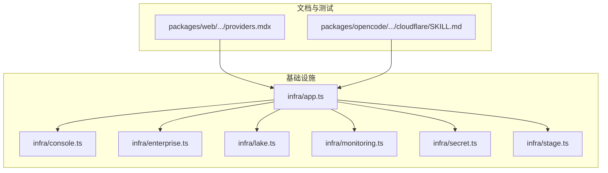
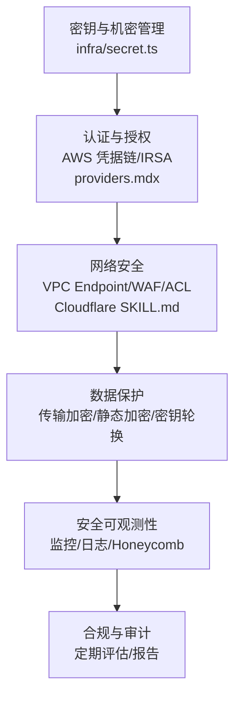
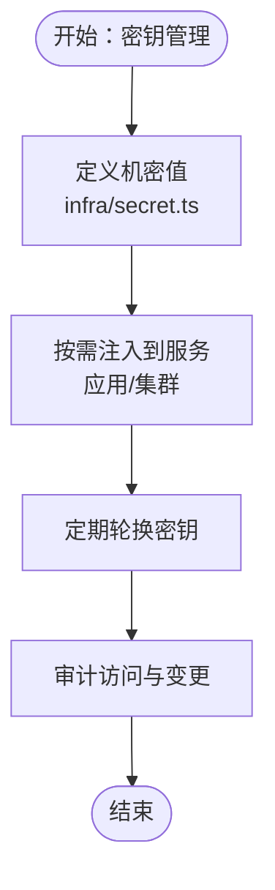
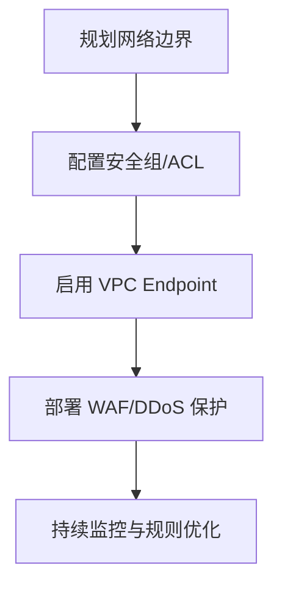
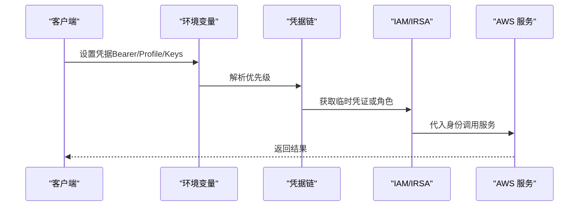
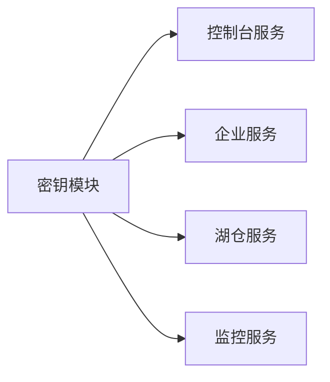

# 安全与合规

<cite>
**本文引用的文件**
- [infra/app.ts](file://infra/app.ts)
- [infra/console.ts](file://infra/console.ts)
- [infra/enterprise.ts](file://infra/enterprise.ts)
- [infra/lake.ts](file://infra/lake.ts)
- [infra/monitoring.ts](file://infra/monitoring.ts)
- [infra/secret.ts](file://infra/secret.ts)
- [infra/stage.ts](file://infra/stage.ts)
- [packages/web/src/content/docs/zh/providers.mdx](file://packages/web/src/content/docs/zh/providers.mdx)
- [packages/opencode/test/fixture/skills/cloudflare/SKILL.md](file://packages/opencode/test/fixture/skills/cloudflare/SKILL.md)
- [SECURITY.md](file://SECURITY.md)
- [README.md](file://README.md)
</cite>

## 目录
1. [引言](#引言)
2. [项目结构](#项目结构)
3. [核心组件](#核心组件)
4. [架构总览](#架构总览)
5. [详细组件分析](#详细组件分析)
6. [依赖分析](#依赖分析)
7. [性能考虑](#性能考虑)
8. [故障排除指南](#故障排除指南)
9. [结论](#结论)
10. [附录](#附录)

## 引言
本文件面向 OpenCode 的云安全与合规体系，聚焦于密钥管理、网络安全、身份认证与授权、数据加密、安全审计与合规检查、威胁检测与响应以及应急响应与恢复策略。文档以仓库中的基础设施与文档为依据，结合 AWS 与 Cloudflare 等云服务实践，形成可操作的安全与合规建议。

## 项目结构
OpenCode 使用基于 SST（Serverless Stack Toolkit）的基础设施即代码（IaC）组织方式，安全相关的关键模块集中在 infra 目录中，同时在文档与测试夹具中体现了对 AWS 与 Cloudflare 能力的使用与集成。

图示来源
- [infra/app.ts](file://infra/app.ts)
- [infra/console.ts](file://infra/console.ts)
- [infra/enterprise.ts](file://infra/enterprise.ts)
- [infra/lake.ts](file://infra/lake.ts)
- [infra/monitoring.ts](file://infra/monitoring.ts)
- [infra/secret.ts](file://infra/secret.ts)
- [infra/stage.ts](file://infra/stage.ts)
- [packages/web/src/content/docs/zh/providers.mdx](file://packages/web/src/content/docs/zh/providers.mdx)
- [packages/opencode/test/fixture/skills/cloudflare/SKILL.md](file://packages/opencode/test/fixture/skills/cloudflare/SKILL.md)

章节来源
- [infra/app.ts](file://infra/app.ts)
- [infra/secret.ts](file://infra/secret.ts)
- [packages/web/src/content/docs/zh/providers.mdx](file://packages/web/src/content/docs/zh/providers.mdx)

## 核心组件
- 密钥与机密管理：通过独立的密钥定义模块集中管理机密值，并在各服务中按需注入，避免硬编码与泄露风险。
- 认证与授权：文档明确 AWS 凭据链优先级与多种认证方式；Cloudflare 提供 WAF、DDoS、API Shield 等安全能力。
- 网络与边界：通过 VPC Endpoint、WAF、网络 ACL 等实现最小暴露面与流量治理。
- 数据保护：传输加密（TLS）、静态数据加密（由云服务商提供），密钥生命周期管理（轮换与权限控制）。
- 可观测性与合规：监控与告警、日志聚合、合规报告与定期评估。

章节来源
- [infra/secret.ts](file://infra/secret.ts)
- [packages/web/src/content/docs/zh/providers.mdx](file://packages/web/src/content/docs/zh/providers.mdx)
- [packages/opencode/test/fixture/skills/cloudflare/SKILL.md](file://packages/opencode/test/fixture/skills/cloudflare/SKILL.md)

## 架构总览
下图展示了 OpenCode 在云上的安全与合规关键路径：从密钥管理到服务访问、网络边界与可观测性。

图示来源
- [infra/secret.ts](file://infra/secret.ts)
- [packages/web/src/content/docs/zh/providers.mdx](file://packages/web/src/content/docs/zh/providers.mdx)
- [packages/opencode/test/fixture/skills/cloudflare/SKILL.md](file://packages/opencode/test/fixture/skills/cloudflare/SKILL.md)
- [infra/monitoring.ts](file://infra/monitoring.ts)

## 详细组件分析

### 密钥管理机制
- 集中式密钥定义：通过独立模块集中声明机密值，避免散落于多处，降低泄露面。
- 机密注入与使用：在服务部署时按需注入密钥，限制访问范围与时间窗口。
- 轮换策略：建议采用自动轮换与最小权限原则，结合访问控制列表（ACL）与条件策略，确保仅在必要时授予访问。
- 访问控制：为不同环境与角色设置细粒度权限，结合条件策略限制使用场景（如时间、IP、资源标签）。

图示来源
- [infra/secret.ts](file://infra/secret.ts)
- [infra/console.ts](file://infra/console.ts)
- [infra/monitoring.ts](file://infra/monitoring.ts)

章节来源
- [infra/secret.ts](file://infra/secret.ts)
- [infra/console.ts](file://infra/console.ts)
- [infra/monitoring.ts](file://infra/monitoring.ts)

### 网络安全配置
- VPC 安全组与网络 ACL：通过最小暴露面原则，仅开放必要端口与协议；结合网络 ACL 实现额外的分层过滤。
- VPC Endpoint：在文档中提供了通过 VPC Endpoint 访问 Bedrock 的示例，减少公网暴露面。
- WAF 配置：Cloudflare 提供 WAF、DDoS、API Shield 等能力，建议启用托管规则集并结合自定义规则进行防护。

图示来源
- [packages/web/src/content/docs/zh/providers.mdx](file://packages/web/src/content/docs/zh/providers.mdx)
- [packages/opencode/test/fixture/skills/cloudflare/SKILL.md](file://packages/opencode/test/fixture/skills/cloudflare/SKILL.md)

章节来源
- [packages/web/src/content/docs/zh/providers.mdx](file://packages/web/src/content/docs/zh/providers.mdx)
- [packages/opencode/test/fixture/skills/cloudflare/SKILL.md](file://packages/opencode/test/fixture/skills/cloudflare/SKILL.md)

### 身份认证与授权机制
- AWS 凭据链优先级：文档明确了多种认证方式的优先顺序，强调 Bearer Token 的最高优先级，便于短期令牌与长期凭证的统一管理。
- IAM 用户与角色：建议为最小权限原则创建 IAM 用户与角色，结合条件策略限制使用范围。
- IRSA（EKS）：通过 OIDC 联邦与服务账号注解实现工作负载与 IAM 角色的绑定，降低密钥泄露风险。

图示来源
- [packages/web/src/content/docs/zh/providers.mdx](file://packages/web/src/content/docs/zh/providers.mdx)

章节来源
- [packages/web/src/content/docs/zh/providers.mdx](file://packages/web/src/content/docs/zh/providers.mdx)

### 数据加密策略
- 传输加密：所有对外接口与内部通信应强制使用 TLS，确保数据在传输过程中的机密性与完整性。
- 静态数据加密：利用云服务商提供的默认加密（如 S3、RDS、EBS 默认启用加密），并结合密钥管理服务（KMS）进行密钥轮换与权限控制。
- 密钥管理：采用自动轮换与最小权限策略，结合访问控制列表与条件策略，限制密钥使用范围与时间窗口。

章节来源
- [infra/secret.ts](file://infra/secret.ts)
- [packages/web/src/content/docs/zh/providers.mdx](file://packages/web/src/content/docs/zh/providers.mdx)

### 安全审计与合规检查
- 定期安全评估：建立周期性评估机制，覆盖 IAM 权限、网络边界、密钥轮换与访问日志。
- 漏洞扫描：结合自动化工具与手动渗透测试，识别配置错误与弱密码等问题。
- 合规报告：生成合规报告，记录评估结果、整改项与验证状态，支持内外部审计。

章节来源
- [SECURITY.md](file://SECURITY.md)
- [README.md](file://README.md)

### 威胁检测与响应流程
- 威胁检测：通过日志聚合与异常检测（如访问模式突变、失败登录激增）触发告警。
- 响应流程：建立标准化事件响应流程，包括隔离、调查、修复与复盘，确保快速闭环。

章节来源
- [infra/monitoring.ts](file://infra/monitoring.ts)
- [packages/opencode/test/fixture/skills/cloudflare/SKILL.md](file://packages/opencode/test/fixture/skills/cloudflare/SKILL.md)

### 应急响应计划与恢复策略
- 应急响应：明确事件分级、处置流程与沟通机制，确保快速响应与最小化影响。
- 恢复策略：制定备份与灾难恢复计划，定期演练，确保在发生安全事件后能快速恢复业务。

章节来源
- [SECURITY.md](file://SECURITY.md)
- [README.md](file://README.md)

## 依赖分析
- 组件耦合：密钥模块与各服务模块松耦合，通过注入机制实现最小权限访问。
- 外部依赖：AWS 与 Cloudflare 能力作为外部依赖，需遵循其最佳实践与合规要求。
- 接口契约：服务间通过明确的输入输出与权限约束进行交互，降低越权与误用风险。

图示来源
- [infra/secret.ts](file://infra/secret.ts)
- [infra/console.ts](file://infra/console.ts)
- [infra/enterprise.ts](file://infra/enterprise.ts)
- [infra/lake.ts](file://infra/lake.ts)
- [infra/monitoring.ts](file://infra/monitoring.ts)

章节来源
- [infra/secret.ts](file://infra/secret.ts)
- [infra/console.ts](file://infra/console.ts)
- [infra/enterprise.ts](file://infra/enterprise.ts)
- [infra/lake.ts](file://infra/lake.ts)
- [infra/monitoring.ts](file://infra/monitoring.ts)

## 性能考虑
- 最小权限与最小暴露面：减少不必要的网络与权限，降低攻击面与合规复杂度。
- 自动化与标准化：通过 IaC 与自动化工具提升一致性与效率，降低人为错误导致的安全风险。

## 故障排除指南
- 凭据链问题：确认环境变量设置与优先级，优先使用短期令牌以降低泄露风险。
- 网络连通性：核对 VPC Endpoint、安全组与 ACL 规则，确保仅开放必要端口。
- 密钥访问失败：检查密钥轮换与权限策略，确认角色信任关系与条件策略未过度限制。

章节来源
- [packages/web/src/content/docs/zh/providers.mdx](file://packages/web/src/content/docs/zh/providers.mdx)
- [packages/opencode/test/fixture/skills/cloudflare/SKILL.md](file://packages/opencode/test/fixture/skills/cloudflare/SKILL.md)

## 结论
OpenCode 的安全与合规体系以集中式密钥管理为基础，结合 AWS 与 Cloudflare 的安全能力，构建了从身份认证、网络安全到数据保护与可观测性的完整闭环。建议持续完善轮换与审计机制，强化威胁检测与响应流程，并定期开展合规评估与演练，确保系统满足行业标准与法规要求。

## 附录
- 参考文档与规范：请参阅项目根目录下的安全与合规相关文档与 README，以获取最新政策与流程说明。