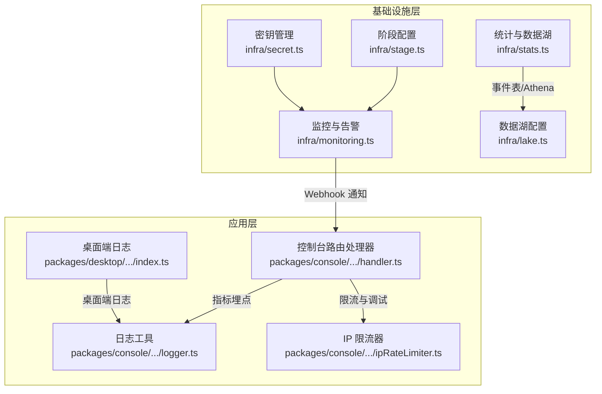
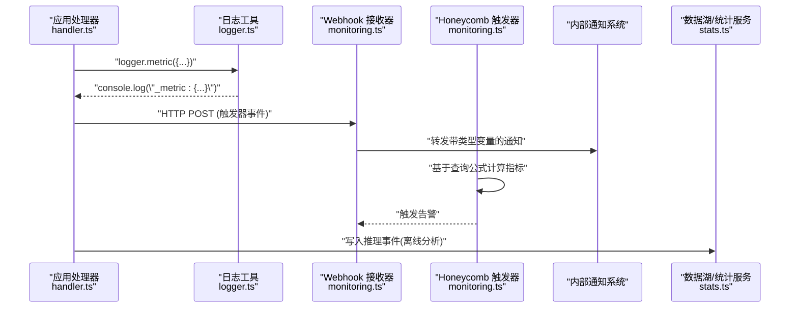
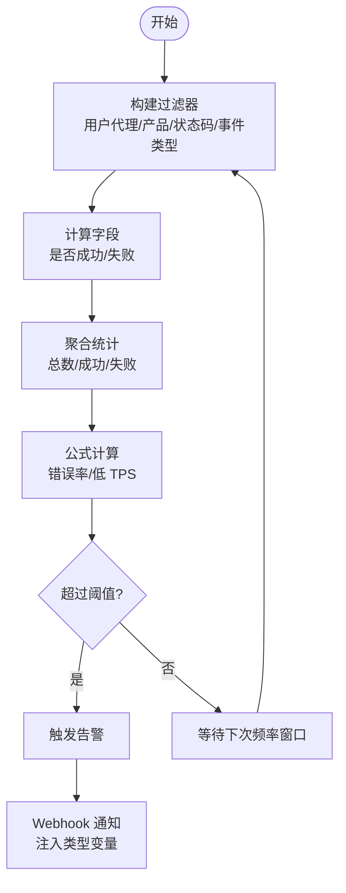
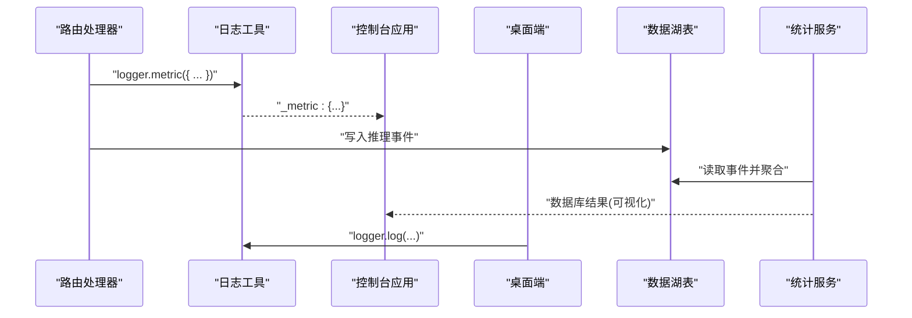
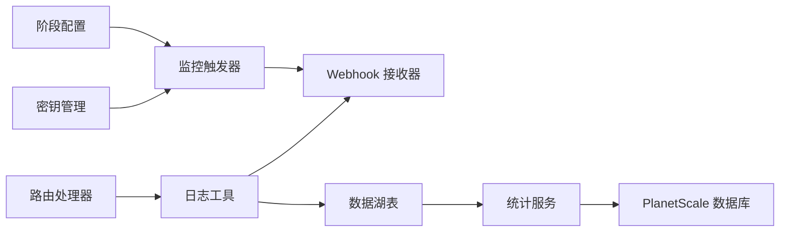

# 监控与日志系统

<cite>
**本文引用的文件**
- [infra/monitoring.ts](file://infra/monitoring.ts)
- [infra/stats.ts](file://infra/stats.ts)
- [infra/lake.ts](file://infra/lake.ts)
- [packages/console/app/src/route/zen/util/logger.ts](file://packages/console/app/src/route/zen/util/logger.ts)
- [packages/console/app/src/route/zen/util/handler.ts](file://packages/console/app/src/route/zen/util/handler.ts)
- [packages/console/app/src/route/zen/util/ipRateLimiter.ts](file://packages/console/app/src/route/zen/util/ipRateLimiter.ts)
- [packages/desktop/src/main/index.ts](file://packages/desktop/src/main/index.ts)
- [infra/stage.ts](file://infra/stage.ts)
- [infra/secret.ts](file://infra/secret.ts)
- [packages/web/src/content/docs/zh-cn/sdk.mdx](file://packages/web/src/content/docs/zh-cn/sdk.mdx)
</cite>

## 目录
1. [简介](#简介)
2. [项目结构](#项目结构)
3. [核心组件](#核心组件)
4. [架构总览](#架构总览)
5. [详细组件分析](#详细组件分析)
6. [依赖关系分析](#依赖关系分析)
7. [性能考量](#性能考量)
8. [故障排除指南](#故障排除指南)
9. [结论](#结论)
10. [附录](#附录)

## 简介
本运维文档聚焦于 OpenCode 的监控与日志体系，涵盖以下方面：
- CloudWatch/Honeycomb 集成：自定义指标、告警规则、通知通道
- 日志采集与聚合：Lambda 日志、API Gateway 访问日志、应用日志
- 性能监控关键指标：请求延迟、错误率、吞吐量、成本
- 分布式追踪：定位性能瓶颈与错误来源
- 告警通知：邮件、Slack、PagerDuty 等多渠道
- 日志分析与洞察：容量规划与性能优化
- 故障排除：工具与技巧

## 项目结构
OpenCode 的监控与日志由基础设施层（SST/CloudFormation/Terraform）与应用层（Console/Web/Desktop）协同实现：
- 基础设施层负责：
  - 监控与告警：Honeycomb 触发器、Webhook 通知接收
  - 数据湖与统计服务：事件表、Athena 查询、统计同步服务
  - 阶段化配置与密钥管理
- 应用层负责：
  - 统一日志输出格式（_metric 前缀）
  - 请求处理链路中的指标埋点
  - IP 限流与调试日志

图表来源
- [infra/monitoring.ts:1-288](file://infra/monitoring.ts#L1-L288)
- [infra/stats.ts:1-204](file://infra/stats.ts#L1-L204)
- [infra/lake.ts](file://infra/lake.ts)
- [infra/stage.ts](file://infra/stage.ts)
- [infra/secret.ts](file://infra/secret.ts)
- [packages/console/app/src/route/zen/util/handler.ts](file://packages/console/app/src/route/zen/util/handler.ts)
- [packages/console/app/src/route/zen/util/logger.ts](file://packages/console/app/src/route/zen/util/logger.ts)
- [packages/console/app/src/route/zen/util/ipRateLimiter.ts](file://packages/console/app/src/route/zen/util/ipRateLimiter.ts)
- [packages/desktop/src/main/index.ts](file://packages/desktop/src/main/index.ts)

章节来源
- [infra/monitoring.ts:1-288](file://infra/monitoring.ts#L1-L288)
- [infra/stats.ts:1-204](file://infra/stats.ts#L1-L204)
- [infra/lake.ts](file://infra/lake.ts)
- [infra/stage.ts](file://infra/stage.ts)
- [infra/secret.ts](file://infra/secret.ts)
- [packages/console/app/src/route/zen/util/handler.ts](file://packages/console/app/src/route/zen/util/handler.ts)
- [packages/console/app/src/route/zen/util/logger.ts](file://packages/console/app/src/route/zen/util/logger.ts)
- [packages/console/app/src/route/zen/util/ipRateLimiter.ts](file://packages/console/app/src/route/zen/util/ipRateLimiter.ts)
- [packages/desktop/src/main/index.ts](file://packages/desktop/src/main/index.ts)

## 核心组件
- Honeycomb 触发器与 Webhook 通知
  - 定义多个触发器：模型 HTTP 错误率、模型 TPS 低阈值、供应商 HTTP 错误率、免费套餐请求激增
  - 使用受控的 Webhook 接收器，按类型注入变量，统一转发到内部通知系统
- 数据湖与统计服务
  - S3 表命名空间与 Iceberg 表定义，承载推理事件
  - Athena 工作组与查询权限，支持离线分析
  - 统计同步服务，周期性从数据湖抽取并写入 PlanetScale 数据库
- 应用日志与指标埋点
  - 控制台路由处理器在关键路径调用 logger.metric 输出结构化指标
  - 日志工具以 _metric 前缀输出，便于后续采集与解析
  - 桌面端日志通过 logger.log 输出，辅助本地调试

章节来源
- [infra/monitoring.ts:1-288](file://infra/monitoring.ts#L1-L288)
- [infra/stats.ts:1-204](file://infra/stats.ts#L1-L204)
- [packages/console/app/src/route/zen/util/logger.ts:1-12](file://packages/console/app/src/route/zen/util/logger.ts#L1-L12)
- [packages/console/app/src/route/zen/util/handler.ts](file://packages/console/app/src/route/zen/util/handler.ts)
- [packages/desktop/src/main/index.ts](file://packages/desktop/src/main/index.ts)

## 架构总览
下图展示监控与日志系统的整体交互：应用侧产生指标与日志，经由 Webhook 聚合到内部通知系统，同时事件数据落盘至数据湖供离线分析。

图表来源
- [packages/console/app/src/route/zen/util/handler.ts](file://packages/console/app/src/route/zen/util/handler.ts)
- [packages/console/app/src/route/zen/util/logger.ts:1-12](file://packages/console/app/src/route/zen/util/logger.ts#L1-L12)
- [infra/monitoring.ts:1-288](file://infra/monitoring.ts#L1-L288)
- [infra/stats.ts:1-204](file://infra/stats.ts#L1-L204)

## 详细组件分析

### Honeycomb 触发器与告警规则
- 触发器类型与阈值
  - 模型 HTTP 错误率（Go/Zen）：阈值 ≥ 0.7，频率 300 秒，按变更触发
  - 模型 TPS 低阈值（Go/Zen）：阈值 ≤ 10，频率 600 秒，按变更触发
  - 供应商 HTTP 错误率：阈值 ≥ 0.7，频率 300 秒，按变更触发
  - 免费套餐请求激增：阈值 ≥ 50，基准对比（偏移 1440 分钟），频率 900 秒
- 通知通道
  - Discord Webhook 接收器，模板化消息体，注入类型变量用于区分告警类别
  - 告警开关与阶段绑定：非生产阶段默认禁用
- 查询与公式
  - 失败条件覆盖 4xx/5xx、429 且非用量限制错误等场景
  - 成功率/失败率公式对样本量进行门槛保护（如 ≥ 150 或 ≥ 总成功+失败 ≥ 150）

图表来源
- [infra/monitoring.ts:41-130](file://infra/monitoring.ts#L41-L130)
- [infra/monitoring.ts:160-287](file://infra/monitoring.ts#L160-L287)

章节来源
- [infra/monitoring.ts:1-288](file://infra/monitoring.ts#L1-L288)

### 日志采集与聚合机制
- 应用日志输出
  - logger.metric 以 _metric 前缀输出结构化键值对，便于下游采集与索引
  - logger.debug 在非生产环境输出调试信息
- 控制台路由埋点
  - 在请求/响应、错误、分片等关键节点调用 logger.metric 注入指标
  - 示例：请求长度、响应长度、错误响应体、模型标识等
- 桌面端日志
  - 通过 logger.log 输出运行时日志，辅助本地问题排查
- 数据湖与统计服务
  - 推理事件表（Iceberg）承载指标与日志元数据
  - Athena 工作组与权限配置，支持 SQL 查询与分析
  - 统计同步服务将数据湖结果写入 PlanetScale 数据库，支撑可视化与报表

图表来源
- [packages/console/app/src/route/zen/util/logger.ts:1-12](file://packages/console/app/src/route/zen/util/logger.ts#L1-L12)
- [packages/console/app/src/route/zen/util/handler.ts](file://packages/console/app/src/route/zen/util/handler.ts)
- [packages/desktop/src/main/index.ts](file://packages/desktop/src/main/index.ts)
- [infra/stats.ts:14-204](file://infra/stats.ts#L14-L204)

章节来源
- [packages/console/app/src/route/zen/util/logger.ts:1-12](file://packages/console/app/src/route/zen/util/logger.ts#L1-L12)
- [packages/console/app/src/route/zen/util/handler.ts](file://packages/console/app/src/route/zen/util/handler.ts)
- [packages/desktop/src/main/index.ts](file://packages/desktop/src/main/index.ts)
- [infra/stats.ts:1-204](file://infra/stats.ts#L1-L204)

### 性能监控关键指标与阈值
- 指标定义
  - 错误率：失败请求数 / 总请求数（对小样本进行门槛保护）
  - 吞吐量（TPS）：按模型/供应商维度的 P50 TPS
  - 延迟：时间到首字节（TTFB）、请求耗时、分片耗时
  - 成本：输入/输出/缓存微成本累加
- 阈值设置
  - 模型 HTTP 错误率 ≥ 0.7
  - 模型 TPS ≤ 10（低样本时返回高哨兵值避免误报）
  - 供应商错误率 ≥ 0.7
  - 免费套餐请求 ≥ 50（对比昨日同一时段）
- 可视化与仪表板
  - 结合 Honeycomb 查询与公式，按模型/供应商/地区等维度拆分
  - 将关键指标映射到仪表板面板，设置滚动窗口与告警阈值

章节来源
- [infra/monitoring.ts:41-130](file://infra/monitoring.ts#L41-L130)
- [infra/monitoring.ts:160-287](file://infra/monitoring.ts#L160-L287)

### 分布式追踪与定位
- 追踪入口
  - 控制台路由处理器在关键路径记录请求/响应、错误、分片等指标
  - 日志工具输出统一前缀，便于跨服务串联
- 定位策略
  - 以会话/请求 ID 为线索，关联日志与指标
  - 结合数据湖事件表，回放完整调用链
  - 对比 Honeycomb 中的错误率与 TPS 指标，快速锁定异常模型或供应商

章节来源
- [packages/console/app/src/route/zen/util/handler.ts](file://packages/console/app/src/route/zen/util/handler.ts)
- [packages/console/app/src/route/zen/util/logger.ts:1-12](file://packages/console/app/src/route/zen/util/logger.ts#L1-L12)

### 告警通知机制
- 通知渠道
  - Discord Webhook：接收器配置模板与变量，按告警类型分类
  - 支持扩展：可接入邮件、Slack、PagerDuty 等（需在 Webhook 侧实现适配）
- 告警开关
  - 非生产阶段默认禁用，避免噪音
- 通知内容
  - 包含告警名称、状态、分组触发详情、类型变量等

章节来源
- [infra/monitoring.ts:1-29](file://infra/monitoring.ts#L1-L29)
- [infra/monitoring.ts:160-287](file://infra/monitoring.ts#L160-L287)

### 日志分析与洞察
- 数据湖建模
  - 推理事件表包含时间戳、状态码、耗时、令牌用量、成本等字段
  - 支持按模型/供应商/地区/会话等维度聚合
- 离线分析
  - 通过 Athena 查询与分区裁剪，执行成本与延迟敏感的分析任务
  - 统计同步服务将结果写入数据库，支撑可视化与报表
- 洞察应用
  - 识别高成本模型与异常延迟
  - 发现免费套餐用量激增与错误集中趋势
  - 为容量规划提供数据基础（峰值 TPS、成本分布）

章节来源
- [infra/stats.ts:14-204](file://infra/stats.ts#L14-L204)
- [infra/lake.ts](file://infra/lake.ts)

## 依赖关系分析
- 组件耦合
  - 监控层依赖阶段配置与密钥管理，确保不同环境隔离
  - 应用层通过统一日志接口与数据湖解耦
  - 统计服务作为数据湖与可视化之间的桥梁
- 外部集成
  - Honeycomb 提供查询与触发能力
  - PlanetScale 提供关系型存储与可视化
  - Discord Webhook 作为通知通道

图表来源
- [infra/stage.ts](file://infra/stage.ts)
- [infra/secret.ts](file://infra/secret.ts)
- [infra/monitoring.ts:1-288](file://infra/monitoring.ts#L1-L288)
- [packages/console/app/src/route/zen/util/logger.ts:1-12](file://packages/console/app/src/route/zen/util/logger.ts#L1-L12)
- [infra/stats.ts:14-204](file://infra/stats.ts#L14-L204)

章节来源
- [infra/stage.ts](file://infra/stage.ts)
- [infra/secret.ts](file://infra/secret.ts)
- [infra/monitoring.ts:1-288](file://infra/monitoring.ts#L1-L288)
- [packages/console/app/src/route/zen/util/logger.ts:1-12](file://packages/console/app/src/route/zen/util/logger.ts#L1-L12)
- [infra/stats.ts:14-204](file://infra/stats.ts#L14-L204)

## 性能考量
- 指标采样与阈值门槛
  - 对小样本进行门槛保护，避免噪声导致误报
- 查询与聚合
  - 使用分区裁剪与计算字段，降低 Athena 查询成本
- 吞吐与成本
  - 通过成本字段与令牌用量，评估不同模型/供应商的成本效率
- 告警频率
  - 合理设置频率窗口，平衡及时性与稳定性

## 故障排除指南
- 日志格式确认
  - 检查控制台与桌面端日志是否以 _metric 前缀输出
  - 确认 logger.metric 是否在关键路径被调用
- Webhook 通知核验
  - 核对 Webhook 接收器 URL 与密钥
  - 查看通知消息体是否包含预期变量（类型、分组等）
- 数据湖连通性
  - 确认 Athena 权限与工作组配置
  - 验证事件表 Schema 与分区字段
- 性能回归定位
  - 关注 Honeycomb 中错误率与 TPS 指标变化
  - 对照数据湖事件表，复现异常请求路径
- 限流与调试
  - IP 限流器输出调试日志，辅助定位异常流量

章节来源
- [packages/console/app/src/route/zen/util/logger.ts:1-12](file://packages/console/app/src/route/zen/util/logger.ts#L1-L12)
- [packages/console/app/src/route/zen/util/handler.ts](file://packages/console/app/src/route/zen/util/handler.ts)
- [packages/console/app/src/route/zen/util/ipRateLimiter.ts](file://packages/console/app/src/route/zen/util/ipRateLimiter.ts)
- [infra/monitoring.ts:1-29](file://infra/monitoring.ts#L1-L29)
- [infra/stats.ts:14-204](file://infra/stats.ts#L14-L204)

## 结论
OpenCode 的监控与日志体系通过 Honeycomb 触发器与 Webhook 通知实现自动化告警，结合数据湖与统计服务完成离线分析与可视化。应用层统一的日志输出与指标埋点，为分布式追踪与容量规划提供了坚实基础。建议持续优化阈值门槛与查询性能，完善通知渠道适配，并加强异常根因分析流程。

## 附录
- API 文档与日志接口参考
  - 控制台应用日志接口示例与方法说明

章节来源
- [packages/web/src/content/docs/zh-cn/sdk.mdx:215-238](file://packages/web/src/content/docs/zh-cn/sdk.mdx#L215-L238)