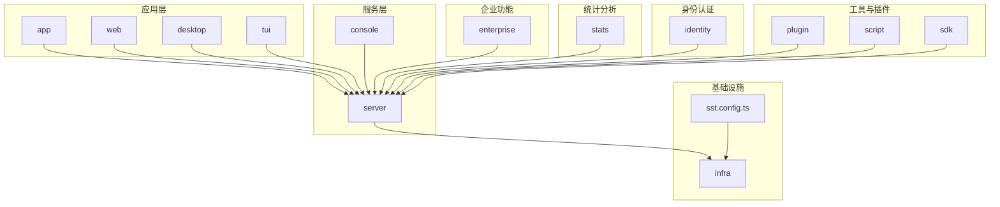
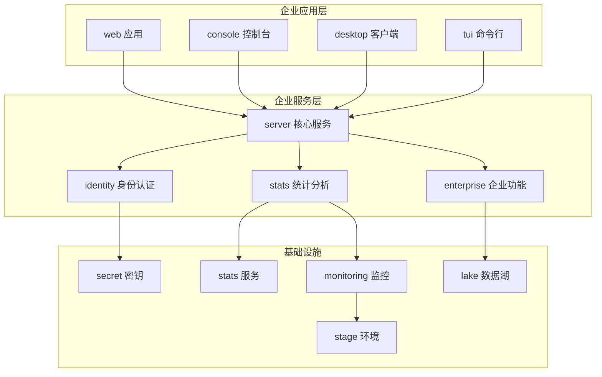
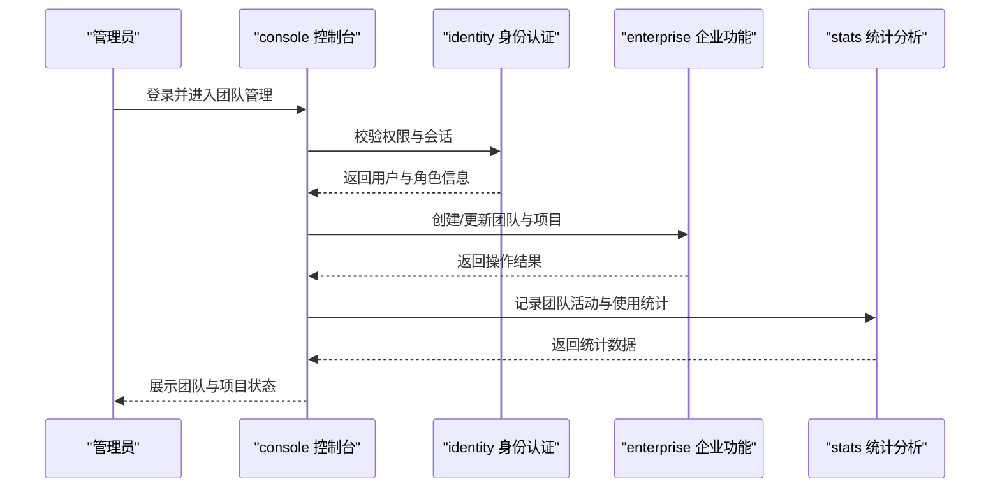
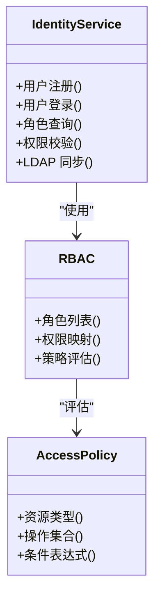
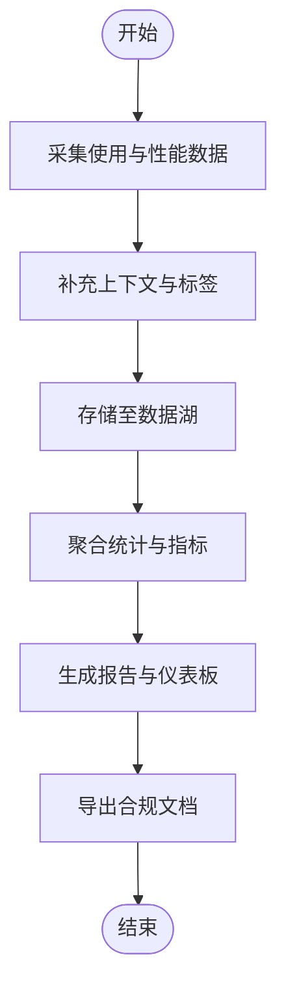
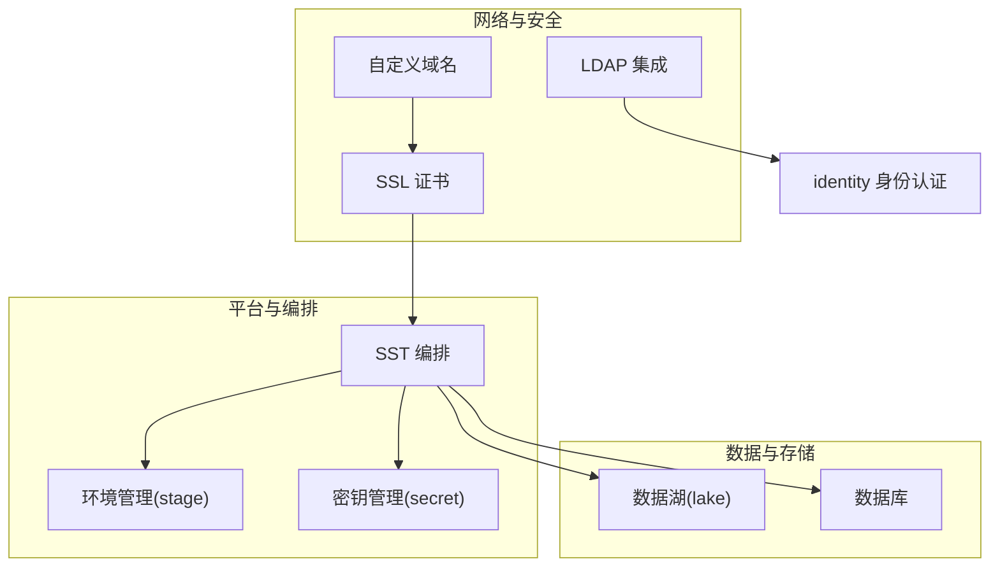
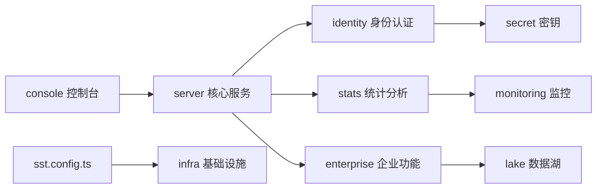

# 企业功能

<cite>
**本文档引用的文件**
- [README.md](file://README.md)
- [STATS.md](file://STATS.md)
- [SECURITY.md](file://SECURITY.md)
- [CONTRIBUTING.md](file://CONTRIBUTING.md)
- [infra/enterprise.ts](file://infra/enterprise.ts)
- [packages/enterprise](file://packages/enterprise)
- [packages/console](file://packages/console)
- [packages/server](file://packages/server)
- [packages/identity](file://packages/identity)
- [packages/stats](file://packages/stats)
- [packages/app](file://packages/app)
- [packages/web](file://packages/web)
- [packages/desktop](file://packages/desktop)
- [packages/cli](file://packages/cli)
- [packages/opencode](file://packages/opencode)
- [packages/ui](file://packages/ui)
- [packages/tui](file://packages/tui)
- [packages/sdk](file://packages/sdk)
- [packages/plugin](file://packages/plugin)
- [packages/function](file://packages/function)
- [packages/effect-drizzle-sqlite](file://packages/effect-drizzle-sqlite)
- [packages/effect-sqlite-node](file://packages/effect-sqlite-node)
- [packages/llm](file://packages/llm)
- [packages/docs](file://packages/docs)
- [packages/script](file://packages/script)
- [packages/slack](file://packages/slack)
- [packages/container](file://packages/containers)
- [sst.config.ts](file://sst.config.ts)
- [sst-env.d.ts](file://sst-env.d.ts)
- [.opencode/opencode.jsonc](file://.opencode/opencode.jsonc)
- [.opencode/env.d.ts](file://.opencode/env.d.ts)
</cite>

## 目录
1. [简介](#简介)
2. [项目结构](#项目结构)
3. [核心组件](#核心组件)
4. [架构总览](#架构总览)
5. [详细组件分析](#详细组件分析)
6. [依赖关系分析](#依赖关系分析)
7. [性能考虑](#性能考虑)
8. [故障排除指南](#故障排除指南)
9. [结论](#结论)
10. [附录](#附录)

## 简介
本指南面向企业用户，系统性介绍 OpenCode 的企业级功能与最佳实践。内容涵盖团队协作（项目共享、权限分配、代码审查）、身份认证与授权（用户管理、角色定义、访问控制）、统计分析与报告（使用统计、性能指标、合规报告）、企业部署（私有化部署、数据本地化、合规性）、企业版与开源版差异及升级路径、企业配置项（自定义域名、SSL 证书、LDAP 集成），以及支持与服务信息。目标是帮助企业用户充分理解并有效利用 OpenCode 的专业能力。

## 项目结构
OpenCode 采用多包（monorepo）组织方式，核心模块按职责分层：应用层（app、web、desktop、tui）、服务层（server、console）、基础设施（infra）、企业功能（enterprise）、统计分析（stats）、身份认证（identity）、工具与插件（plugin、script、sdk）、文档与脚手架（docs、opencode）等。基础设施通过 SST（Serverless Stack Toolkit）进行统一编排，企业功能在独立包中实现并可按需启用。

**图表来源**
- [sst.config.ts](file://sst.config.ts)
- [packages/server](file://packages/server)
- [packages/enterprise](file://packages/enterprise)
- [packages/stats](file://packages/stats)
- [packages/identity](file://packages/identity)
- [packages/console](file://packages/console)

**章节来源**
- [README.md](file://README.md)
- [sst.config.ts](file://sst.config.ts)

## 核心组件
- 企业功能包（enterprise）：封装企业级特性，如团队协作、权限模型、审计日志、合规报告等，作为可选模块集成到主应用。
- 统计分析包（stats）：提供使用统计、性能指标采集与可视化，支撑运营与合规报告。
- 身份认证包（identity）：提供用户管理、角色与权限模型、访问控制策略，支持 LDAP 等外部身份源集成。
- 控制台（console）：企业管理员操作界面，用于配置团队、成员、权限、统计与合规设置。
- 基础设施（infra）：通过 SST 编排企业环境，包括监控、湖仓（lake）、统计服务、密钥管理等。

**章节来源**
- [packages/enterprise](file://packages/enterprise)
- [packages/stats](file://packages/stats)
- [packages/identity](file://packages/identity)
- [packages/console](file://packages/console)
- [infra/enterprise.ts](file://infra/enterprise.ts)

## 架构总览
OpenCode 企业版以“应用层 + 服务层 + 基础设施”的三层架构运行。应用层负责前端与客户端体验；服务层承载业务逻辑、鉴权与统计；基础设施通过 SST 实现资源编排与运维自动化。企业功能通过独立包注入，结合控制台进行集中治理。

**图表来源**
- [packages/server](file://packages/server)
- [packages/identity](file://packages/identity)
- [packages/stats](file://packages/stats)
- [packages/enterprise](file://packages/enterprise)
- [infra/enterprise.ts](file://infra/enterprise.ts)
- [sst.config.ts](file://sst.config.ts)

## 详细组件分析

### 团队协作与项目共享
- 项目共享：企业版支持在团队内共享项目与资源，配合权限模型实现最小授权访问。
- 权限分配：基于角色的访问控制（RBAC），支持细粒度权限策略，覆盖读写删查等操作。
- 代码审查：与版本控制系统集成，支持在企业工作流中发起与跟踪代码审查任务。
- 工作流支持：通过插件与函数扩展，构建从开发到发布的完整企业级流水线。

**图表来源**
- [packages/console](file://packages/console)
- [packages/identity](file://packages/identity)
- [packages/enterprise](file://packages/enterprise)
- [packages/stats](file://packages/stats)

**章节来源**
- [packages/enterprise](file://packages/enterprise)
- [packages/console](file://packages/console)

### 身份认证与授权
- 用户管理：集中管理用户账户、状态与基本信息。
- 角色定义：内置角色与自定义角色，支持继承与叠加。
- 访问控制：基于资源与操作的策略引擎，支持动态授权决策。
- 外部集成：支持 LDAP 等企业身份源，实现单点登录与账号同步。

**图表来源**
- [packages/identity](file://packages/identity)

**章节来源**
- [packages/identity](file://packages/identity)

### 统计分析与报告
- 使用统计：记录团队与项目的活跃度、贡献度、资源使用情况。
- 性能指标：采集系统延迟、吞吐量、错误率等关键指标。
- 合规报告：生成审计日志、访问轨迹、变更记录等合规文档。
- 可视化与导出：提供仪表板与报表导出能力，便于管理层审阅。

**图表来源**
- [packages/stats](file://packages/stats)
- [infra/lake.ts](file://infra/lake.ts)
- [infra/stats.ts](file://infra/stats.ts)

**章节来源**
- [STATS.md](file://STATS.md)
- [packages/stats](file://packages/stats)

### 企业部署与配置
- 私有化部署：通过 SST 在企业 VPC 内部署，实现网络隔离与数据不出境。
- 数据本地化：支持将数据库与数据湖部署在指定区域，满足数据主权要求。
- 自定义域名与 SSL：通过负载均衡与证书管理实现 HTTPS 与域名绑定。
- LDAP 集成：对接企业 AD/LDAP，实现统一身份与自动授权。
- 环境治理：通过 stage 与 secret 管理不同环境的配置与密钥。

**图表来源**
- [infra/enterprise.ts](file://infra/enterprise.ts)
- [sst.config.ts](file://sst.config.ts)
- [packages/identity](file://packages/identity)

**章节来源**
- [infra/enterprise.ts](file://infra/enterprise.ts)
- [sst.config.ts](file://sst.config.ts)

### 企业版与开源版差异
- 功能范围：企业版包含团队协作、权限模型、审计与合规报告、LDAP 集成等高级能力；开源版聚焦基础开发与协作。
- 运维复杂度：企业版通过 SST 与专用包提供更强的可运维性与可观测性。
- 升级路径：建议先在测试环境验证企业功能，再逐步迁移生产；可通过包替换与配置切换完成升级。

**章节来源**
- [packages/enterprise](file://packages/enterprise)
- [packages/server](file://packages/server)

## 依赖关系分析
OpenCode 企业功能围绕 server 为核心，依赖 identity 提供认证授权，依赖 stats 提供统计分析，依赖 enterprise 提供企业特性，控制台 console 作为管理入口。基础设施通过 SST 统一编排，形成高内聚低耦合的体系。

**图表来源**
- [packages/server](file://packages/server)
- [packages/console](file://packages/console)
- [packages/identity](file://packages/identity)
- [packages/stats](file://packages/stats)
- [packages/enterprise](file://packages/enterprise)
- [sst.config.ts](file://sst.config.ts)

**章节来源**
- [packages/server](file://packages/server)
- [packages/console](file://packages/console)
- [packages/identity](file://packages/identity)
- [packages/stats](file://packages/stats)
- [packages/enterprise](file://packages/enterprise)
- [sst.config.ts](file://sst.config.ts)

## 性能考虑
- 资源隔离：通过 SST 将统计、监控与企业功能拆分为独立服务，避免相互影响。
- 数据分层：使用数据湖与缓存策略降低查询压力，提升报表生成效率。
- 扩展性：基于无服务器组件实现弹性伸缩，适配企业高峰期负载。
- 审计开销：合理设置审计粒度与保留周期，在合规与性能间取得平衡。

## 故障排除指南
- 登录与权限问题：检查 identity 服务连通性与 LDAP 配置，确认用户角色与策略是否正确下发。
- 统计缺失：核对 stats 采集器状态与数据湖写入权限，确认聚合任务是否正常执行。
- 控制台不可用：排查 server 与 console 的依赖链路，关注证书与域名解析异常。
- 部署失败：检查 SST 配置与权限，确认密钥与环境变量已正确注入。

**章节来源**
- [packages/identity](file://packages/identity)
- [packages/stats](file://packages/stats)
- [packages/console](file://packages/console)
- [SECURITY.md](file://SECURITY.md)

## 结论
OpenCode 企业版通过完善的团队协作、严格的身份认证与授权、强大的统计分析与合规能力，以及可落地的私有化部署方案，为企业用户提供从开发到运营的一体化解决方案。建议结合自身合规与性能需求，优先启用企业功能包与 SST 编排，逐步完善 LDAP 集成与监控体系，确保系统的安全性与可维护性。

## 附录
- 支持与服务：企业用户可通过官方渠道获取技术支持与培训，具体联系方式请参考项目文档与官网说明。
- 最佳实践清单
  - 使用自定义域名与 SSL 证书保障外网访问安全
  - 对接 LDAP 实现统一身份与自动授权
  - 启用审计与合规报告，定期生成合规文档
  - 利用统计分析优化资源配置与团队绩效
  - 通过 SST 实现私有化部署与环境隔离

**章节来源**
- [README.md](file://README.md)
- [SECURITY.md](file://SECURITY.md)
- [CONTRIBUTING.md](file://CONTRIBUTING.md)