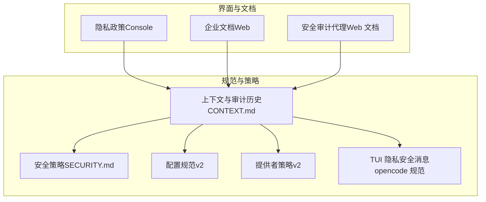
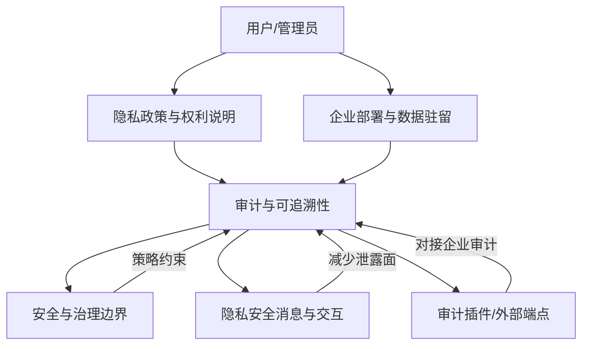
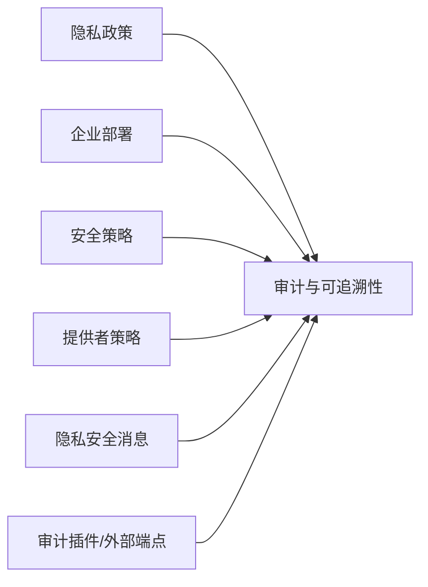

# 合规与治理

<cite>
**本文引用的文件**
- [隐私政策（Console）](file://packages/console/app/src/routes/legal/privacy-policy/index.tsx)
- [企业文档（Web）](file://packages/web/src/content/docs/it/enterprise.mdx)
- [安全审计代理（Web 文档）](file://packages/web/src/content/docs/zh-cn/agents.mdx)
- [上下文与审计历史（CONTEXT.md）](file://CONTEXT.md)
- [安全策略（SECURITY.md）](file://SECURITY.md)
- [配置规范（v2）](file://specs/v2/config.md)
- [提供者策略（v2）](file://specs/v2/provider-policy.md)
- [UI 组件与隐私安全消息（opencode 规范）](file://packages/opencode/specs/tui-plugins.md)
</cite>

## 目录
1. [引言](#引言)
2. [项目结构](#项目结构)
3. [核心组件](#核心组件)
4. [架构总览](#架构总览)
5. [详细组件分析](#详细组件分析)
6. [依赖关系分析](#依赖关系分析)
7. [性能考量](#性能考量)
8. [故障排查指南](#故障排查指南)
9. [结论](#结论)
10. [附录](#附录)

## 引言
本指南面向企业级用户，系统化说明 OpenCode 在合规与治理方面的设计与实践，覆盖数据保护（如 GDPR、CCPA 等）、行业标准（如 ISO 27001 的理念落地）、审计日志与访问追踪、数据治理策略（分类、生命周期、质量控制）、合规报告生成以及最佳实践与常见挑战的应对方法。目标是帮助组织在满足监管要求的同时，充分发挥 OpenCode 的能力。

## 项目结构
OpenCode 将合规与治理相关内容分布在多个层面：
- 产品与界面层：隐私政策页面与企业文档，明确数据处理目的、范围与权利。
- 规范与策略层：上下文与审计历史、安全策略、配置与提供者策略，定义可审计的数据流与执行边界。
- 工具与代理层：安全审计代理，用于识别潜在安全问题与治理缺口。
- 用户体验与隐私安全消息：在交互中避免泄露敏感信息，降低合规风险。

图表来源
- [隐私政策（Console）](file://packages/console/app/src/routes/legal/privacy-policy/index.tsx)
- [企业文档（Web）](file://packages/web/src/content/docs/it/enterprise.mdx)
- [安全审计代理（Web 文档）](file://packages/web/src/content/docs/zh-cn/agents.mdx)
- [上下文与审计历史（CONTEXT.md）](file://CONTEXT.md)
- [安全策略（SECURITY.md）](file://SECURITY.md)
- [配置规范（v2）](file://specs/v2/config.md)
- [提供者策略（v2）](file://specs/v2/provider-policy.md)
- [UI 组件与隐私安全消息（opencode 规范）](file://packages/opencode/specs/tui-plugins.md)

章节来源
- [隐私政策（Console）](file://packages/console/app/src/routes/legal/privacy-policy/index.tsx)
- [企业文档（Web）](file://packages/web/src/content/docs/it/enterprise.mdx)
- [安全审计代理（Web 文档）](file://packages/web/src/content/docs/zh-cn/agents.mdx)
- [上下文与审计历史（CONTEXT.md）](file://CONTEXT.md)
- [安全策略（SECURITY.md）](file://SECURITY.md)
- [配置规范（v2）](file://specs/v2/config.md)
- [提供者策略（v2）](file://specs/v2/provider-policy.md)
- [UI 组件与隐私安全消息（opencode 规范）](file://packages/opencode/specs/tui-plugins.md)

## 核心组件
- 数据处理与权利说明：隐私政策页面列举了数据类别、处理目的、第三方共享情形及用户权利（访问、删除、不歧视），并覆盖多州隐私法（如 CCPA、ICDPA、UCPA 等）。
- 企业部署与数据驻留：企业文档强调“代码与数据不出组织基础设施”的实现路径，支持集中配置、SSO 集成与内部 AI 网关，以满足本地化与最小化数据暴露的要求。
- 审计与可追溯性：上下文与审计历史说明会话上下文的“基线系统上下文”“上下文快照”与“持久化审计历史”，为合规审计提供事实依据。
- 安全与治理边界：安全策略明确不提供沙箱隔离，强调权限提示与用户确认；提供者策略指出“提供者策略并非可执行插件的完整沙箱”，需要额外治理措施。
- 隐私安全的消息与交互：TUI 规范建议使用隐私安全的消息，避免泄露命令、路径、提示词、错误、密钥或文件内容，降低无意泄露风险。
- 可扩展审计与集成：配置规范支持通过插件或外部端点进行审计集成，便于企业接入自有审计平台。

章节来源
- [隐私政策（Console）](file://packages/console/app/src/routes/legal/privacy-policy/index.tsx)
- [企业文档（Web）](file://packages/web/src/content/docs/it/enterprise.mdx)
- [上下文与审计历史（CONTEXT.md）](file://CONTEXT.md)
- [安全策略（SECURITY.md）](file://SECURITY.md)
- [提供者策略（v2）](file://specs/v2/provider-policy.md)
- [UI 组件与隐私安全消息（opencode 规范）](file://packages/opencode/specs/tui-plugins.md)
- [配置规范（v2）](file://specs/v2/config.md)

## 架构总览
下图展示合规与治理在系统中的关键交互：从用户侧的权利与数据处理声明，到企业部署与数据驻留策略，再到审计与可追溯性、安全边界与隐私安全交互，最终通过可选的审计插件对接企业审计体系。

图表来源
- [隐私政策（Console）](file://packages/console/app/src/routes/legal/privacy-policy/index.tsx)
- [企业文档（Web）](file://packages/web/src/content/docs/it/enterprise.mdx)
- [上下文与审计历史（CONTEXT.md）](file://CONTEXT.md)
- [安全策略（SECURITY.md）](file://SECURITY.md)
- [UI 组件与隐私安全消息（opencode 规范）](file://packages/opencode/specs/tui-plugins.md)
- [配置规范（v2）](file://specs/v2/config.md)

## 详细组件分析

### 数据保护与用户权利（GDPR、CCPA 等）
- 数据类别与处理目的：隐私政策页面列明了个人数据类别、业务目的与第三方共享情形，并明确用户权利（访问、删除、不歧视）。
- 多州隐私法覆盖：页面列举了多种州隐私法（如 CCPA、ICDPA、UCPA 等），体现对美国地区法律的适配与指引。
- 实施要点：
  - 明确数据最小化与目的限制，仅在声明范围内处理；
  - 提供便捷的访问与删除入口；
  - 对敏感数据处理保持谨慎，避免销售或针对广告处理。

章节来源
- [隐私政策（Console）](file://packages/console/app/src/routes/legal/privacy-policy/index.tsx)

### 企业部署与数据驻留（本地化与最小化）
- 企业文档强调“代码与数据不出组织基础设施”，通过集中配置、SSO 与内部 AI 网关实现；
- 支持按需禁用或限制分享功能，满足高敏感场景下的合规要求；
- 适合在企业内自托管，降低第三方存储与传输风险。

章节来源
- [企业文档（Web）](file://packages/web/src/content/docs/it/enterprise.mdx)

### 审计日志与访问追踪（持久化审计历史）
- 上下文与审计历史说明了“基线系统上下文”“上下文快照”与“持久化审计历史”的概念，确保对话过程可追溯；
- 这些机制为企业提供操作记录与变更历史，支撑合规审计与争议回溯。

章节来源
- [上下文与审计历史（CONTEXT.md）](file://CONTEXT.md)

### 安全边界与治理（不提供沙箱、需额外治理）
- 安全策略明确不提供沙箱隔离，权限系统为 UX 功能，用于提示用户确认；
- 提供者策略指出“提供者策略并非可执行插件的完整沙箱”，若存在可执行插件且有合规要求，需另行实施治理措施。

章节来源
- [安全策略（SECURITY.md）](file://SECURITY.md)
- [提供者策略（v2）](file://specs/v2/provider-policy.md)

### 隐私安全的消息与交互（降低无意泄露）
- TUI 规范建议使用隐私安全的消息，避免泄露命令、路径、提示词、错误、密钥或文件内容；
- 通过 UI 层面的约束，降低因交互细节导致的数据外泄风险。

章节来源
- [UI 组件与隐私安全消息（opencode 规范）](file://packages/opencode/specs/tui-plugins.md)

### 审计插件与外部端点（可扩展审计）
- 配置规范支持通过插件或外部端点进行审计集成；
- 企业可将审计事件上报至自有审计平台，形成统一的合规报告基础。

章节来源
- [配置规范（v2）](file://specs/v2/config.md)

### 安全审计代理（识别漏洞与治理缺口）
- Web 文档提供了“安全审计代理”的示例与职责，聚焦输入验证、认证授权、数据暴露、依赖与配置安全等问题；
- 该代理可作为企业内部治理工具，辅助识别潜在风险并推动修复。

章节来源
- [安全审计代理（Web 文档）](file://packages/web/src/content/docs/zh-cn/agents.mdx)

## 依赖关系分析
合规与治理各组件之间的耦合与协作如下：
- 隐私政策与企业文档共同定义数据处理与驻留策略；
- 审计与可追溯性贯穿会话生命周期，为安全与治理提供证据；
- 安全策略与提供者策略界定执行边界，决定是否需要额外治理；
- UI 与交互规范降低无意泄露风险；
- 审计插件与外部端点提供可扩展的审计能力。

图表来源
- [隐私政策（Console）](file://packages/console/app/src/routes/legal/privacy-policy/index.tsx)
- [企业文档（Web）](file://packages/web/src/content/docs/it/enterprise.mdx)
- [上下文与审计历史（CONTEXT.md）](file://CONTEXT.md)
- [安全策略（SECURITY.md）](file://SECURITY.md)
- [提供者策略（v2）](file://specs/v2/provider-policy.md)
- [UI 组件与隐私安全消息（opencode 规范）](file://packages/opencode/specs/tui-plugins.md)
- [配置规范（v2）](file://specs/v2/config.md)

章节来源
- [隐私政策（Console）](file://packages/console/app/src/routes/legal/privacy-policy/index.tsx)
- [企业文档（Web）](file://packages/web/src/content/docs/it/enterprise.mdx)
- [上下文与审计历史（CONTEXT.md）](file://CONTEXT.md)
- [安全策略（SECURITY.md）](file://SECURITY.md)
- [提供者策略（v2）](file://specs/v2/provider-policy.md)
- [UI 组件与隐私安全消息（opencode 规范）](file://packages/opencode/specs/tui-plugins.md)
- [配置规范（v2）](file://specs/v2/config.md)

## 性能考量
- 审计与可追溯性：持久化审计历史与上下文快照可能带来存储与查询开销，建议结合分片、归档与索引策略优化检索效率。
- 交互与隐私安全：在 UI 中避免输出敏感信息可减少后续清洗与告警成本，提升整体运营效率。
- 审计插件：外部审计端点的调用应考虑异步与重试机制，避免阻塞主流程。

## 故障排查指南
- 审计缺失或不完整
  - 检查上下文与审计历史配置是否启用；
  - 确认会话生命周期中是否正确生成“上下文快照”与“基线系统上下文”。
  - 参考：[上下文与审计历史（CONTEXT.md）](file://CONTEXT.md)
- 数据泄露风险
  - 检查 UI 是否输出命令、路径、提示词、错误、密钥或文件内容；
  - 使用隐私安全消息规范，降低无意泄露。
  - 参考：[UI 组件与隐私安全消息（opencode 规范）](file://packages/opencode/specs/tui-plugins.md)
- 执行边界与治理不足
  - 若存在可执行插件且有合规要求，需补充独立的治理与审计措施；
  - 参考：[提供者策略（v2）](file://specs/v2/provider-policy.md)
- 安全响应与报告
  - 如遇安全问题，遵循安全策略中的报告流程；
  - 参考：[安全策略（SECURITY.md）](file://SECURITY.md)

章节来源
- [上下文与审计历史（CONTEXT.md）](file://CONTEXT.md)
- [UI 组件与隐私安全消息（opencode 规范）](file://packages/opencode/specs/tui-plugins.md)
- [提供者策略（v2）](file://specs/v2/provider-policy.md)
- [安全策略（SECURITY.md）](file://SECURITY.md)

## 结论
OpenCode 在合规与治理方面提供了从数据处理声明、企业部署策略、审计与可追溯性、安全边界到隐私安全交互的完整思路。通过结合企业内部的审计与治理流程，可有效满足 GDPR、CCPA 等数据保护法规与 ISO 27001 等标准的理念要求，同时利用可扩展的审计插件与安全审计代理，持续改进合规水平与风险控制能力。

## 附录
- 合规报告生成建议
  - 合规状态报告：基于审计历史与隐私政策声明，汇总数据处理活动与用户权利行使情况；
  - 风险评估报告：结合安全审计代理发现的问题与提供者策略边界，评估执行与治理风险；
  - 审计准备材料：整理会话上下文、快照与持久化审计历史，配合外部审计端点输出，形成可追溯证据链。
- 最佳实践
  - 企业部署优先采用自托管与内部网关，确保数据驻留；
  - 在 UI 与交互中坚持隐私安全消息原则；
  - 对可执行插件引入独立治理与审计，弥补提供者策略的边界；
  - 建立定期的安全审计代理巡检与整改闭环。