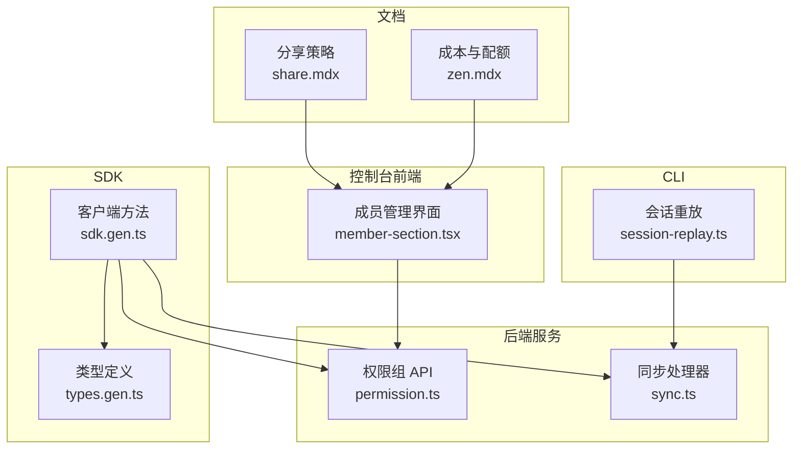
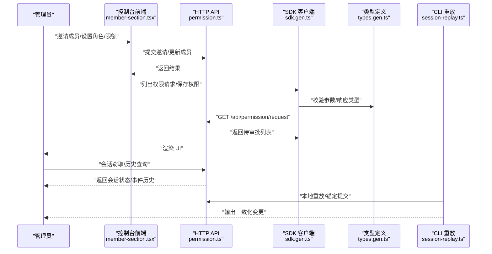
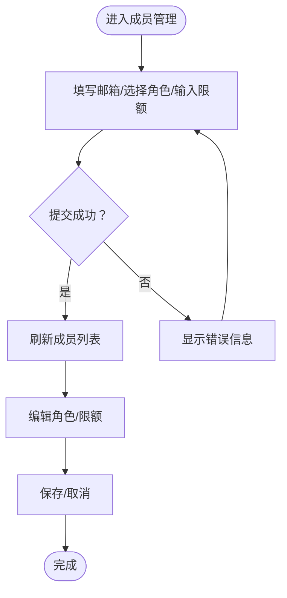
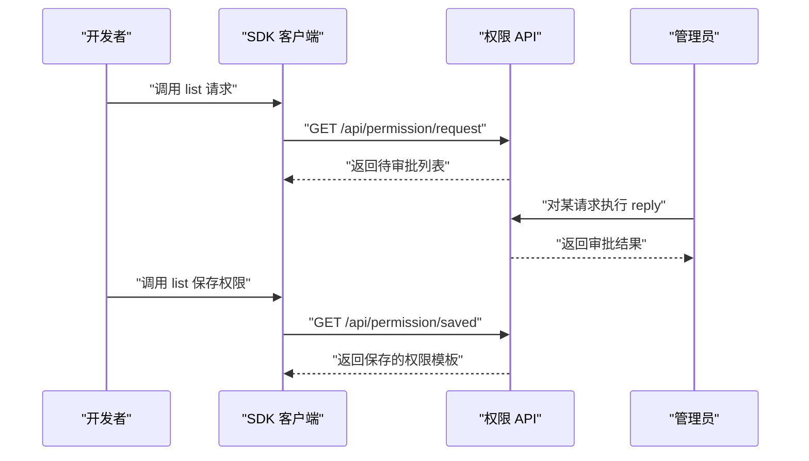
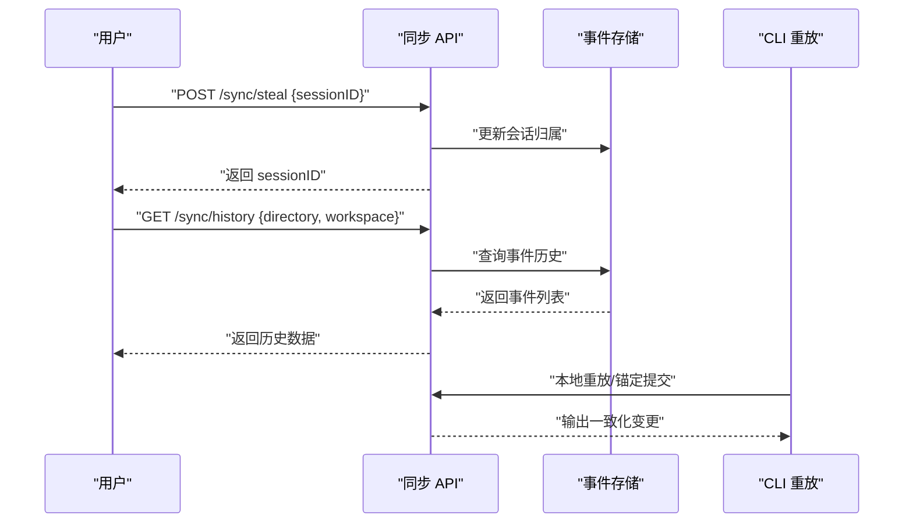
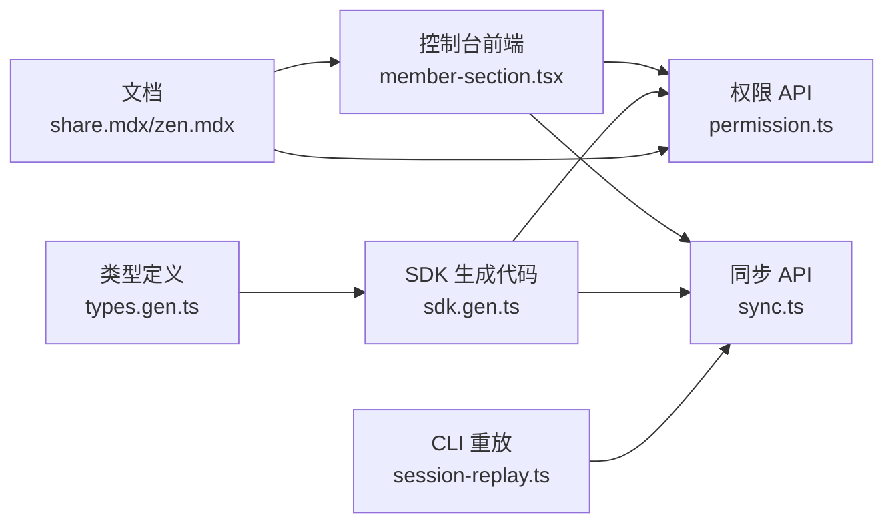

# 团队协作功能

<cite>
**本文引用的文件**
- [member-section.tsx](file://packages/console/app/src/routes/workspace/[id]/members/member-section.tsx)
- [index.tsx](file://packages/console/app/src/routes/workspace/[id]/members/index.tsx)
- [permission.ts](file://packages/opencode/src/server/routes/instance/httpapi/groups/permission.ts)
- [types.gen.ts](file://packages/sdk/js/src/v2/gen/types.gen.ts)
- [sdk.gen.ts](file://packages/sdk/js/src/v2/gen/sdk.gen.ts)
- [sync.ts](file://packages/opencode/src/server/routes/instance/httpapi/handlers/sync.ts)
- [session-replay.ts](file://packages/opencode/src/cli/cmd/run/session-replay.ts)
- [share.mdx](file://packages/web/src/content/docs/share.mdx)
- [zen.mdx（多语言）](file://packages/web/src/content/docs/zh-cn/zen.mdx)
</cite>

## 目录
1. [简介](#简介)
2. [项目结构](#项目结构)
3. [核心组件](#核心组件)
4. [架构总览](#架构总览)
5. [详细组件分析](#详细组件分析)
6. [依赖关系分析](#依赖关系分析)
7. [性能考量](#性能考量)
8. [故障排查指南](#故障排查指南)
9. [结论](#结论)
10. [附录](#附录)

## 简介
本指南面向团队管理者与开发者，系统讲解 OpenCode 的团队协作能力：项目共享与权限控制、成员邀请与角色管理、工作流自动化（任务分配、进度跟踪、代码审查）、以及实时协作（多人编辑、冲突解决、版本同步）。文档结合前端控制台、后端 HTTP API、SDK 类型与 CLI 实现，提供可操作的最佳实践与排障建议。

## 项目结构
围绕“团队协作”的关键模块分布如下：
- 控制台前端：工作区成员管理（邀请、角色、限额）
- 后端 HTTP API：权限请求、保存权限、会话权限、同步与历史
- SDK：生成的类型与客户端方法，用于调用上述 API
- CLI：会话重放与本地回放逻辑，支撑多人协作与冲突处理
- 文档：分享策略、企业级限制、成本与配额管理

**图表来源**
- [member-section.tsx:1-368](file://packages/console/app/src/routes/workspace/[id]/members/member-section.tsx#L1-L368)
- [permission.ts:1-32](file://packages/opencode/src/server/routes/instance/httpapi/groups/permission.ts#L1-L32)
- [types.gen.ts:10217-10337](file://packages/sdk/js/src/v2/gen/types.gen.ts#L10217-L10337)
- [sdk.gen.ts:5890-5943](file://packages/sdk/js/src/v2/gen/sdk.gen.ts#L5890-L5943)
- [sync.ts:64-89](file://packages/opencode/src/server/routes/instance/httpapi/handlers/sync.ts#L64-L89)
- [session-replay.ts:257-300](file://packages/opencode/src/cli/cmd/run/session-replay.ts#L257-L300)
- [share.mdx:113-128](file://packages/web/src/content/docs/share.mdx#L113-L128)
- [zen.mdx（多语言）](file://packages/web/src/content/docs/zh-cn/zen.mdx)

**章节来源**
- [member-section.tsx:1-368](file://packages/console/app/src/routes/workspace/[id]/members/member-section.tsx#L1-L368)
- [permission.ts:1-32](file://packages/opencode/src/server/routes/instance/httpapi/groups/permission.ts#L1-L32)
- [types.gen.ts:10217-10337](file://packages/sdk/js/src/v2/gen/types.gen.ts#L10217-L10337)
- [sdk.gen.ts:5890-5943](file://packages/sdk/js/src/v2/gen/sdk.gen.ts#L5890-L5943)
- [sync.ts:64-89](file://packages/opencode/src/server/routes/instance/httpapi/handlers/sync.ts#L64-L89)
- [session-replay.ts:257-300](file://packages/opencode/src/cli/cmd/run/session-replay.ts#L257-L300)
- [share.mdx:113-128](file://packages/web/src/content/docs/share.mdx#L113-L128)
- [zen.mdx（多语言）](file://packages/web/src/content/docs/zh-cn/zen.mdx)

## 核心组件
- 成员与角色管理：支持管理员邀请成员、设定角色（admin/member）、设置月度限额；普通成员仅能管理自身密钥。
- 权限请求与审批：通过 HTTP API 列出待审批的权限请求，支持回复与保存权限模板，便于复用与审计。
- 实时协作与版本同步：提供会话窃取（steal）与历史查询（history），配合 CLI 重放算法，保障多人编辑一致性。
- 分享与企业安全：文档明确分享策略与企业部署下的禁用/受限/自托管选项，保护敏感项目。

**章节来源**
- [member-section.tsx:220-246](file://packages/console/app/src/routes/workspace/[id]/members/member-section.tsx#L220-L246)
- [permission.ts:17-32](file://packages/opencode/src/server/routes/instance/httpapi/groups/permission.ts#L17-L32)
- [types.gen.ts:10217-10337](file://packages/sdk/js/src/v2/gen/types.gen.ts#L10217-L10337)
- [sdk.gen.ts:5890-5943](file://packages/sdk/js/src/v2/gen/sdk.gen.ts#L5890-L5943)
- [sync.ts:64-89](file://packages/opencode/src/server/routes/instance/httpapi/handlers/sync.ts#L64-L89)
- [share.mdx:113-128](file://packages/web/src/content/docs/share.mdx#L113-L128)

## 架构总览
下图展示从控制台到后端 API、SDK 调用链路，以及 CLI 在本地进行会话重放的关键路径。

**图表来源**
- [member-section.tsx:25-89](file://packages/console/app/src/routes/workspace/[id]/members/member-section.tsx#L25-L89)
- [permission.ts:17-32](file://packages/opencode/src/server/routes/instance/httpapi/groups/permission.ts#L17-L32)
- [sdk.gen.ts:5890-5943](file://packages/sdk/js/src/v2/gen/sdk.gen.ts#L5890-L5943)
- [types.gen.ts:10217-10337](file://packages/sdk/js/src/v2/gen/types.gen.ts#L10217-L10337)
- [session-replay.ts:257-300](file://packages/opencode/src/cli/cmd/run/session-replay.ts#L257-L300)

## 详细组件分析

### 成员与角色管理
- 功能要点
  - 邀请成员：表单提交邮箱、工作区 ID、角色（admin/member）。
  - 角色与权限：admin 可管理模型、成员、API 密钥与账单；member 仅能管理自身密钥。
  - 限额控制：管理员可为成员设置月度限额，用于成本控制。
  - 表格交互：支持编辑、删除（非当前用户）、保存与取消。
- 关键实现位置
  - 列表与邀请动作：[listMembers/inviteMember:14-31](file://packages/console/app/src/routes/workspace/[id]/members/member-section.tsx#L14-L31)
  - 更新成员与限额：[updateMember:66-89](file://packages/console/app/src/routes/workspace/[id]/members/member-section.tsx#L66-L89)
  - UI 表单与角色选项：[MemberSection:219-246](file://packages/console/app/src/routes/workspace/[id]/members/member-section.tsx#L219-L246)
  - 页面入口：[members/index.tsx:1-11](file://packages/console/app/src/routes/workspace/[id]/members/index.tsx#L1-L11)

**图表来源**
- [member-section.tsx:25-89](file://packages/console/app/src/routes/workspace/[id]/members/member-section.tsx#L25-L89)
- [member-section.tsx:219-246](file://packages/console/app/src/routes/workspace/[id]/members/member-section.tsx#L219-L246)

**章节来源**
- [member-section.tsx:14-89](file://packages/console/app/src/routes/workspace/[id]/members/member-section.tsx#L14-L89)
- [member-section.tsx:219-246](file://packages/console/app/src/routes/workspace/[id]/members/member-section.tsx#L219-L246)
- [index.tsx:1-11](file://packages/console/app/src/routes/workspace/[id]/members/index.tsx#L1-L11)

### 权限请求与审批
- 功能要点
  - 列出待审批权限请求，支持按工作区路由参数过滤。
  - 支持对请求进行回复（同意/拒绝/永久授权等）。
  - 保存常用权限模板，便于后续复用。
- 关键实现位置
  - 权限 API 组定义：[PermissionApi:17-32](file://packages/opencode/src/server/routes/instance/httpapi/groups/permission.ts#L17-L32)
  - SDK 方法：列出权限请求、保存/移除权限模板
    - [list 请求:5890-5908](file://packages/sdk/js/src/v2/gen/sdk.gen.ts#L5890-L5908)
    - [list 保存权限:5911-5933](file://packages/sdk/js/src/v2/gen/sdk.gen.ts#L5911-L5933)
    - [remove 保存权限:5940-5943](file://packages/sdk/js/src/v2/gen/sdk.gen.ts#L5940-L5943)
  - 类型定义：[V2Permission* 类型:10217-10337](file://packages/sdk/js/src/v2/gen/types.gen.ts#L10217-L10337)

**图表来源**
- [permission.ts:17-32](file://packages/opencode/src/server/routes/instance/httpapi/groups/permission.ts#L17-L32)
- [sdk.gen.ts:5890-5943](file://packages/sdk/js/src/v2/gen/sdk.gen.ts#L5890-L5943)
- [types.gen.ts:10217-10337](file://packages/sdk/js/src/v2/gen/types.gen.ts#L10217-L10337)

**章节来源**
- [permission.ts:17-32](file://packages/opencode/src/server/routes/instance/httpapi/groups/permission.ts#L17-L32)
- [sdk.gen.ts:5890-5943](file://packages/sdk/js/src/v2/gen/sdk.gen.ts#L5890-L5943)
- [types.gen.ts:10217-10337](file://packages/sdk/js/src/v2/gen/types.gen.ts#L10217-L10337)

### 实时协作与版本同步
- 功能要点
  - 会话窃取：将他人会话“抢夺”到当前工作区，实现跨会话协作。
  - 历史查询：按聚合 ID 与序列号查询事件历史，支持增量拉取。
  - 本地重放：根据消息锚点与提交记录进行本地回放，避免重复或遗漏。
- 关键实现位置
  - 同步处理器（steal/history）：[sync.ts:64-89](file://packages/opencode/src/server/routes/instance/httpapi/handlers/sync.ts#L64-L89)
  - SDK 类型（steal/history）：[types.gen.ts:8584-8652](file://packages/sdk/js/src/v2/gen/types.gen.ts#L8584-L8652)
  - 会话重放算法：[session-replay.ts:257-300](file://packages/opencode/src/cli/cmd/run/session-replay.ts#L257-L300)

**图表来源**
- [sync.ts:64-89](file://packages/opencode/src/server/routes/instance/httpapi/handlers/sync.ts#L64-L89)
- [types.gen.ts:8584-8652](file://packages/sdk/js/src/v2/gen/types.gen.ts#L8584-L8652)
- [session-replay.ts:257-300](file://packages/opencode/src/cli/cmd/run/session-replay.ts#L257-L300)

**章节来源**
- [sync.ts:64-89](file://packages/opencode/src/server/routes/instance/httpapi/handlers/sync.ts#L64-L89)
- [types.gen.ts:8584-8652](file://packages/sdk/js/src/v2/gen/types.gen.ts#L8584-L8652)
- [session-replay.ts:257-300](file://packages/opencode/src/cli/cmd/run/session-replay.ts#L257-L300)

### 项目共享与企业安全
- 功能要点
  - 分享策略：在协作完成后取消分享；敏感项目建议完全禁用分享。
  - 企业部署：可禁用分享、限制为 SSO 认证用户、或自托管。
- 关键实现位置
  - 分享策略说明：[share.mdx:113-128](file://packages/web/src/content/docs/share.mdx#L113-L128)
  - 企业级限制与部署方式：同上文档条目

**章节来源**
- [share.mdx:113-128](file://packages/web/src/content/docs/share.mdx#L113-L128)

### 成本与配额管理（最佳实践）
- 功能要点
  - 工作区与成员月度限额：管理员可设置整体与个人限额，防止超支。
  - 自动充值：余额低于阈值自动充值，可调整金额或关闭。
  - 模型可用性：管理员可启用/禁用特定模型，规避数据收集风险。
- 关键实现位置
  - 多语言文档中的相关段落：[zen.mdx（多语言）](file://packages/web/src/content/docs/zh-cn/zen.mdx)

**章节来源**
- [zen.mdx（多语言）](file://packages/web/src/content/docs/zh-cn/zen.mdx)

## 依赖关系分析
- 前端控制台依赖后端权限 API 与同步 API；SDK 提供类型安全的调用封装。
- CLI 通过本地重放算法与后端历史接口协同，保证多人协作一致性。
- 文档层指导分享策略与企业安全配置，影响前端与后端的可见性与行为。

**图表来源**
- [member-section.tsx:1-368](file://packages/console/app/src/routes/workspace/[id]/members/member-section.tsx#L1-L368)
- [permission.ts:1-32](file://packages/opencode/src/server/routes/instance/httpapi/groups/permission.ts#L1-L32)
- [sdk.gen.ts:5890-5943](file://packages/sdk/js/src/v2/gen/sdk.gen.ts#L5890-L5943)
- [types.gen.ts:10217-10337](file://packages/sdk/js/src/v2/gen/types.gen.ts#L10217-L10337)
- [sync.ts:64-89](file://packages/opencode/src/server/routes/instance/httpapi/handlers/sync.ts#L64-L89)
- [session-replay.ts:257-300](file://packages/opencode/src/cli/cmd/run/session-replay.ts#L257-L300)
- [share.mdx:113-128](file://packages/web/src/content/docs/share.mdx#L113-L128)
- [zen.mdx（多语言）](file://packages/web/src/content/docs/zh-cn/zen.mdx)

**章节来源**
- [member-section.tsx:1-368](file://packages/console/app/src/routes/workspace/[id]/members/member-section.tsx#L1-L368)
- [permission.ts:1-32](file://packages/opencode/src/server/routes/instance/httpapi/groups/permission.ts#L1-L32)
- [sdk.gen.ts:5890-5943](file://packages/sdk/js/src/v2/gen/sdk.gen.ts#L5890-L5943)
- [types.gen.ts:10217-10337](file://packages/sdk/js/src/v2/gen/types.gen.ts#L10217-L10337)
- [sync.ts:64-89](file://packages/opencode/src/server/routes/instance/httpapi/handlers/sync.ts#L64-L89)
- [session-replay.ts:257-300](file://packages/opencode/src/cli/cmd/run/session-replay.ts#L257-L300)
- [share.mdx:113-128](file://packages/web/src/content/docs/share.mdx#L113-L128)
- [zen.mdx（多语言）](file://packages/web/src/content/docs/zh-cn/zen.mdx)

## 性能考量
- 权限请求与保存权限：建议分页/过滤（按项目 ID）以减少响应体积。
- 同步历史：按目录与工作区精确查询，避免全量扫描；增量拉取可降低带宽与延迟。
- 会话重放：优先锚定已持久化的消息 ID，减少回溯成本；本地回放应避免重复提交。

[本节为通用建议，不直接分析具体文件]

## 故障排查指南
- 成员邀请失败
  - 检查邮箱格式、工作区 ID 与角色参数是否正确。
  - 查看表单错误提示与提交状态。
  - 参考：[inviteMember:25-31](file://packages/console/app/src/routes/workspace/[id]/members/member-section.tsx#L25-L31)
- 权限请求无响应
  - 使用 SDK 的“列出权限请求”方法确认是否存在待审批项。
  - 若无，请检查工作区路由参数与鉴权上下文。
  - 参考：[sdk.gen.ts 列表请求:5890-5908](file://packages/sdk/js/src/v2/gen/sdk.gen.ts#L5890-L5908)
- 会话窃取报错
  - 确认 sessionID 与工作区参数；查看 400/401 错误码定位问题。
  - 参考：[types.gen.ts 同步类型:8584-8615](file://packages/sdk/js/src/v2/gen/types.gen.ts#L8584-L8615)
- 历史查询为空
  - 检查目录与工作区参数是否匹配；尝试扩大时间范围或增加过滤条件。
  - 参考：[sync.ts 历史查询:72-85](file://packages/opencode/src/server/routes/instance/httpapi/handlers/sync.ts#L72-L85)
- 分享策略导致协作中断
  - 协作完成后及时取消分享；敏感项目建议禁用分享。
  - 参考：[share.mdx:113-128](file://packages/web/src/content/docs/share.mdx#L113-L128)

**章节来源**
- [member-section.tsx:25-31](file://packages/console/app/src/routes/workspace/[id]/members/member-section.tsx#L25-L31)
- [sdk.gen.ts:5890-5908](file://packages/sdk/js/src/v2/gen/sdk.gen.ts#L5890-L5908)
- [types.gen.ts:8584-8615](file://packages/sdk/js/src/v2/gen/types.gen.ts#L8584-L8615)
- [sync.ts:72-85](file://packages/opencode/src/server/routes/instance/httpapi/handlers/sync.ts#L72-L85)
- [share.mdx:113-128](file://packages/web/src/content/docs/share.mdx#L113-L128)

## 结论
通过成员与角色管理、权限请求与保存模板、会话窃取与历史查询、以及分享与企业安全策略，OpenCode 为团队提供了从“邀请—授权—协作—同步—审计”的完整闭环。结合成本与配额管理，团队可在保障安全与合规的前提下，显著提升协作效率与交付质量。

[本节为总结，不直接分析具体文件]

## 附录
- 使用示例（步骤化）
  - 邀请新成员并分配角色：在成员管理页面填写邮箱与角色，提交后刷新列表确认。
  - 审批权限请求：使用 SDK 列出待审批项，选择同意/拒绝/永久授权。
  - 开始多人协作：在目标工作区发起会话窃取，随后通过历史查询与本地重放保持一致性。
  - 管理成本：为工作区与成员设置月度限额，必要时开启自动充值。
- 最佳实践
  - 角色最小权限原则：仅授予完成任务所需的最低权限。
  - 权限模板复用：将常用权限保存为模板，统一团队标准。
  - 安全优先：敏感项目禁用分享；企业部署可通过 SSO 或自托管强化安全。
  - 版本同步：定期清理历史事件，避免冗余；使用锚定回放减少冲突。

[本节为概念性内容，不直接分析具体文件]