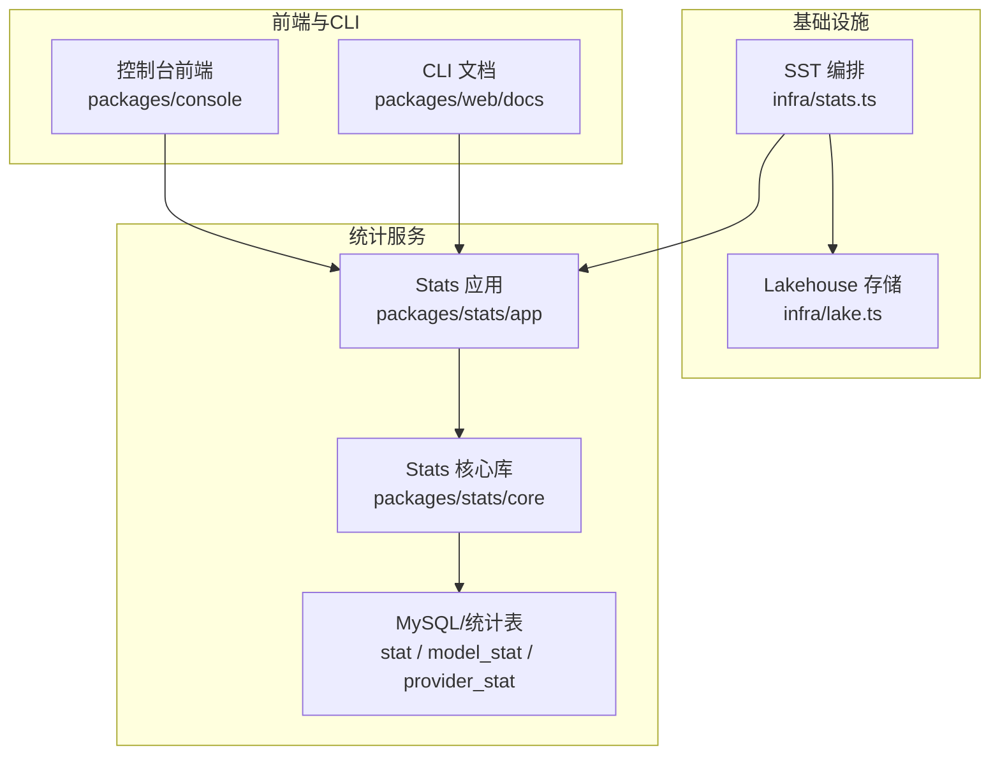
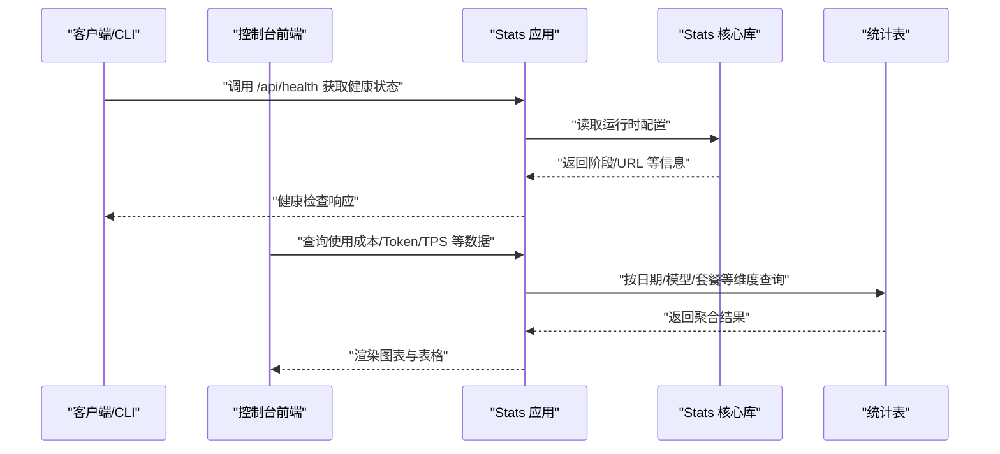
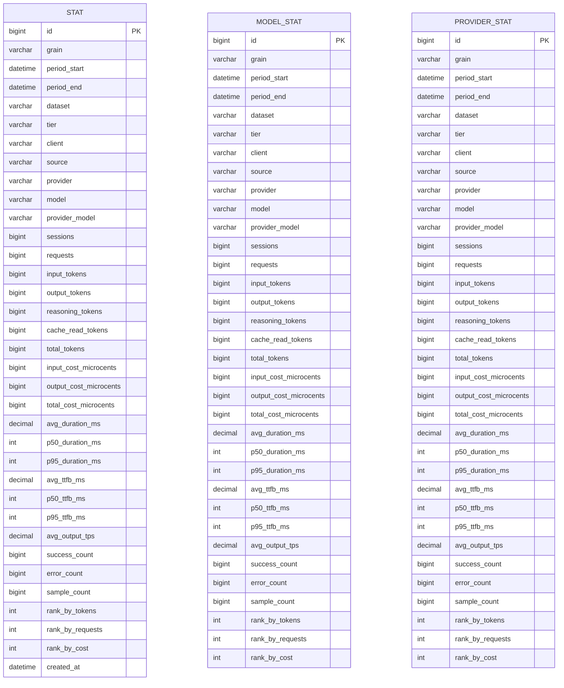
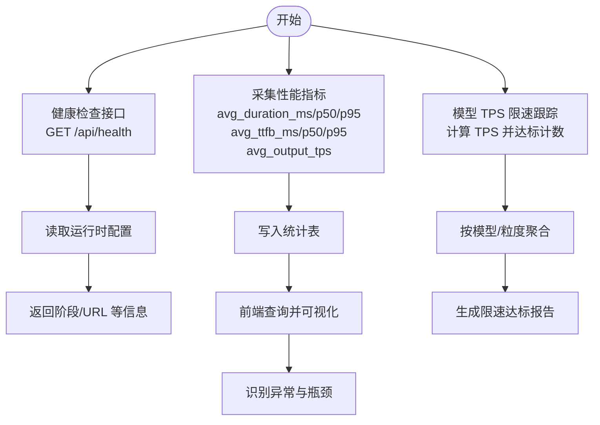
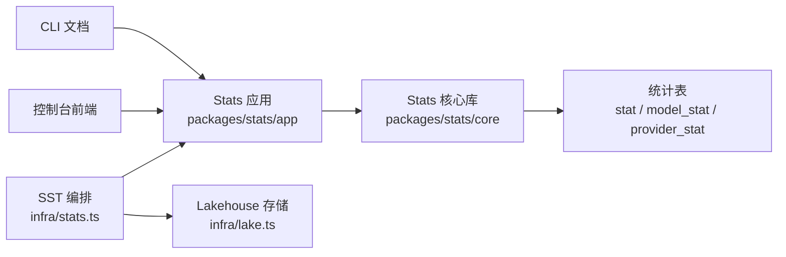

# 统计分析功能

<cite>
**本文引用的文件**
- [packages/stats/core/migrations/20260522121617_common_dust/migration.sql](file://packages/stats/core/migrations/20260522121617_common_dust/migration.sql)
- [packages/stats/core/migrations/20260522121617_common_dust/snapshot.json](file://packages/stats/core/migrations/20260522121617_common_dust/snapshot.json)
- [packages/stats/core/migrations/20260523110335_cool_vin_gonzales/snapshot.json](file://packages/stats/core/migrations/20260523110335_cool_vin_gonzales/snapshot.json)
- [packages/stats/core/migrations/20260528012726_worthless_ultimo/snapshot.json](file://packages/stats/core/migrations/20260528012726_worthless_ultimo/snapshot.json)
- [packages/stats/app/src/routes/api/health.ts](file://packages/stats/app/src/routes/api/health.ts)
- [packages/console/app/src/routes/workspace/[id]/usage/graph-section.tsx](file://packages/console/app/src/routes/workspace/[id]/usage/graph-section.tsx)
- [packages/console/app/src/routes/zen/util/modelTpsLimiter.ts](file://packages/console/app/src/routes/zen/util/modelTpsLimiter.ts)
- [packages/web/src/content/docs/zh-tw/cli.mdx](file://packages/web/src/content/docs/zh-tw/cli.mdx)
- [packages/web/src/content/docs/ar/cli.mdx](file://packages/web/src/content/docs/ar/cli.mdx)
- [packages/web/src/content/docs/tr/cli.mdx](file://packages/web/src/content/docs/tr/cli.mdx)
- [infra/stats.ts](file://infra/stats.ts)
- [infra/lake.ts](file://infra/lake.ts)
- [script/stats.ts](file://script/stats.ts)
- [STATS.md](file://STATS.md)
</cite>

## 目录
1. [简介](#简介)
2. [项目结构](#项目结构)
3. [核心组件](#核心组件)
4. [架构总览](#架构总览)
5. [详细组件分析](#详细组件分析)
6. [依赖关系分析](#依赖关系分析)
7. [性能考量](#性能考量)
8. [故障排查指南](#故障排查指南)
9. [结论](#结论)
10. [附录](#附录)

## 简介
本指南面向企业管理者与运营人员，系统性介绍 OpenCode 统计分析功能的使用方法与实践路径，涵盖以下方面：
- 用户活跃度、功能使用频率、代码生成统计等指标采集与查询
- 性能监控机制：系统性能指标、API 响应时间、资源利用率等
- 报告生成功能：自定义报告模板、定期报告发送、数据导出
- 数据分析工具：趋势分析、对比分析、预测分析等高级能力
- 统计数据的解读与业务洞察建议，帮助基于数据进行决策

## 项目结构
OpenCode 的统计分析能力由“基础设施编排 + 核心统计模块 + 控制台前端 + CLI 文档”共同构成：
- 基础设施层：通过 SST 编排统计服务、数据库与 Lakehouse 存储
- 核心统计层：定义统计表结构与运行时配置，提供健康检查接口
- 前端控制台：可视化展示使用成本、Token 使用、TPS 等指标
- CLI 文档：提供命令行统计与导出说明

图表来源
- [infra/stats.ts:105](file://infra/stats.ts#L105)
- [infra/lake.ts:220](file://infra/lake.ts#L220)
- [packages/stats/app/src/routes/api/health.ts:1](file://packages/stats/app/src/routes/api/health.ts#L1-L19)

章节来源
- [infra/stats.ts:105](file://infra/stats.ts#L105-L199)
- [infra/lake.ts:220](file://infra/lake.ts#L220-L263)
- [packages/stats/app/src/routes/api/health.ts:1](file://packages/stats/app/src/routes/api/health.ts#L1-L19)

## 核心组件
- 统计表结构与字段族
  - stat 表：按粒度与周期聚合的会话、请求、Token、成本、性能分位数等指标
  - model_stat 表：按模型维度的统计
  - provider_stat 表：按供应商维度的统计
- 运行时与健康检查
  - Stats 应用提供健康检查接口，返回应用状态、阶段与公开地址
- 可视化与导出
  - 控制台前端支持按日期、模型、套餐类型等维度展示使用成本与 Token 消耗
  - CLI 文档提供统计与导出命令说明

章节来源
- [packages/stats/core/migrations/20260522121617_common_dust/migration.sql:1-36](file://packages/stats/core/migrations/20260522121617_common_dust/migration.sql#L1-L36)
- [packages/stats/core/migrations/20260522121617_common_dust/snapshot.json:54-418](file://packages/stats/core/migrations/20260522121617_common_dust/snapshot.json#L54-L418)
- [packages/stats/core/migrations/20260523110335_cool_vin_gonzales/snapshot.json:912-967](file://packages/stats/core/migrations/20260523110335_cool_vin_gonzales/snapshot.json#L912-L967)
- [packages/stats/core/migrations/20260528012726_worthless_ultimo/snapshot.json:1418-1473](file://packages/stats/core/migrations/20260528012726_worthless_ultimo/snapshot.json#L1418-L1473)
- [packages/stats/app/src/routes/api/health.ts:1](file://packages/stats/app/src/routes/api/health.ts#L1-L19)

## 架构总览
统计分析系统的运行链路如下：
- 数据采集：会话事件、Token 使用、成本、响应时间等
- 数据聚合：按粒度（如按天、按模型、按供应商）在统计窗口内聚合
- 数据存储：写入 stat、model_stat、provider_stat 等表
- 数据消费：控制台前端读取并可视化；CLI 提供查询与导出
- 健康监控：Stats 应用提供健康检查接口

图表来源
- [packages/stats/app/src/routes/api/health.ts:1](file://packages/stats/app/src/routes/api/health.ts#L1-L19)
- [packages/stats/core/migrations/20260522121617_common_dust/migration.sql:1-36](file://packages/stats/core/migrations/20260522121617_common_dust/migration.sql#L1-L36)

## 详细组件分析

### 统计表结构与字段族
- 共同字段族
  - 粒度与时间：grain、period_start、period_end
  - 分组标签：dataset、tier、client、source
  - 模型标识：provider、model、provider_model
- 通用指标
  - 会话与请求：sessions、requests
  - Token 指标：input_tokens、output_tokens、reasoning_tokens、cache_read_tokens、total_tokens
  - 成本指标：input_cost_microcents、output_cost_microcents、total_cost_microcents
  - 性能指标：avg_duration_ms、p50_duration_ms、p95_duration_ms、avg_ttfb_ms、p50_ttfb_ms、p95_ttfb_ms、avg_output_tps
  - 质量与采样：success_count、error_count、sample_count
  - 排名：rank_by_tokens、rank_by_requests、rank_by_cost
- 模型维度表与供应商维度表
  - model_stat、provider_stat 包含与 stat 类似的字段族，便于按模型或供应商进行深度分析

图表来源
- [packages/stats/core/migrations/20260522121617_common_dust/migration.sql:1-36](file://packages/stats/core/migrations/20260522121617_common_dust/migration.sql#L1-L36)
- [packages/stats/core/migrations/20260522121617_common_dust/snapshot.json:54-418](file://packages/stats/core/migrations/20260522121617_common_dust/snapshot.json#L54-L418)
- [packages/stats/core/migrations/20260523110335_cool_vin_gonzales/snapshot.json:912-967](file://packages/stats/core/migrations/20260523110335_cool_vin_gonzales/snapshot.json#L912-L967)
- [packages/stats/core/migrations/20260528012726_worthless_ultimo/snapshot.json:1418-1473](file://packages/stats/core/migrations/20260528012726_worthless_ultimo/snapshot.json#L1418-L1473)

章节来源
- [packages/stats/core/migrations/20260522121617_common_dust/migration.sql:1-36](file://packages/stats/core/migrations/20260522121617_common_dust/migration.sql#L1-L36)
- [packages/stats/core/migrations/20260522121617_common_dust/snapshot.json:54-418](file://packages/stats/core/migrations/20260522121617_common_dust/snapshot.json#L54-L418)
- [packages/stats/core/migrations/20260523110335_cool_vin_gonzales/snapshot.json:912-967](file://packages/stats/core/migrations/20260523110335_cool_vin_gonzales/snapshot.json#L912-L967)
- [packages/stats/core/migrations/20260528012726_worthless_ultimo/snapshot.json:1418-1473](file://packages/stats/core/migrations/20260528012726_worthless_ultimo/snapshot.json#L1418-L1473)

### 性能监控机制
- 系统级健康检查
  - Stats 应用提供健康检查接口，返回应用状态、阶段与公开地址，便于运维与自动化探活
- 性能指标采集
  - stat 表包含平均/分位响应时间（avg_duration_ms/p50/p95）、首字节时间（avg_ttfb_ms/p50/p95）与输出吞吐（avg_output_tps）
  - 控制台前端按日期与模型维度展示成本与 TPS，辅助定位性能瓶颈
- 模型 TPS 限速跟踪
  - 通过模型 TPS 限速工具对不同模型在目标 TPS 下的达标情况进行记录与聚合，用于评估模型性能与容量规划

图表来源
- [packages/stats/app/src/routes/api/health.ts:1](file://packages/stats/app/src/routes/api/health.ts#L1-L19)
- [packages/stats/core/migrations/20260522121617_common_dust/migration.sql:1-36](file://packages/stats/core/migrations/20260522121617_common_dust/migration.sql#L1-L36)
- [packages/console/app/src/routes/zen/util/modelTpsLimiter.ts:38-88](file://packages/console/app/src/routes/zen/util/modelTpsLimiter.ts#L38-L88)

章节来源
- [packages/stats/app/src/routes/api/health.ts:1](file://packages/stats/app/src/routes/api/health.ts#L1-L19)
- [packages/console/app/src/routes/zen/util/modelTpsLimiter.ts:38-88](file://packages/console/app/src/routes/zen/util/modelTpsLimiter.ts#L38-L88)

### 报告生成功能
- 自定义报告模板
  - 基于统计表的多维字段（dataset、tier、client、source、provider、model）组合，可灵活定制报告维度
- 定期报告发送
  - 结合调度任务与导出流程，按日/周/月生成报告并通过邮件或消息通道推送
- 数据导出
  - CLI 文档提供导出命令示例，支持将会话数据导出为 JSON，便于离线分析与二次加工

章节来源
- [packages/web/src/content/docs/zh-tw/cli.mdx:412-444](file://packages/web/src/content/docs/zh-tw/cli.mdx#L412-L444)
- [packages/web/src/content/docs/ar/cli.mdx:412-438](file://packages/web/src/content/docs/ar/cli.mdx#L412-L438)
- [packages/web/src/content/docs/tr/cli.mdx:412-431](file://packages/web/src/content/docs/tr/cli.mdx#L412-L431)

### 数据分析工具
- 趋势分析
  - 前端按日期序列展示成本与 Token 使用趋势，识别增长/下降拐点
- 对比分析
  - 按模型、套餐类型、客户等维度对比使用强度与成本
- 预测分析
  - 基于历史趋势外推，结合成本与 Token 使用率，预估未来资源与预算需求

章节来源
- [packages/console/app/src/routes/workspace/[id]/usage/graph-section.tsx:266-L336](file://packages/console/app/src/routes/workspace/[id]/usage/graph-section.tsx#L266-L336)

## 依赖关系分析
- 统计服务与基础设施
  - SST 编排统计应用与 Lakehouse 存储，提供高可用的数据湖与服务部署
- 统计服务与前端
  - 控制台前端通过 API 查询统计表，渲染图表与报表
- 统计服务与 CLI
  - CLI 文档指导用户查询与导出统计信息

图表来源
- [infra/stats.ts:105](file://infra/stats.ts#L105-L199)
- [infra/lake.ts:220](file://infra/lake.ts#L220-L263)
- [packages/stats/app/src/routes/api/health.ts:1](file://packages/stats/app/src/routes/api/health.ts#L1-L19)

章节来源
- [infra/stats.ts:105](file://infra/stats.ts#L105-L199)
- [infra/lake.ts:220](file://infra/lake.ts#L220-L263)
- [packages/stats/app/src/routes/api/health.ts:1](file://packages/stats/app/src/routes/api/health.ts#L1-L19)

## 性能考量
- 指标粒度与窗口
  - 合理设置 grain 与 period，避免过细粒度过高导致写放大与查询复杂度上升
- 写入与聚合
  - 在事件侧进行轻量聚合，减少最终写入压力；利用索引覆盖常用过滤字段（dataset、tier、client、provider、model）
- 可视化与查询
  - 前端按需加载与懒加载，避免一次性拉取大范围数据；对高频查询建立物化视图或缓存
- 成本控制
  - 利用 cost 相关字段进行预算预警与超支提醒，结合套餐类型与客户维度做成本归集

## 故障排查指南
- 健康检查失败
  - 通过健康检查接口确认应用状态、阶段与公开地址是否正确
- 数据缺失或延迟
  - 检查统计表字段是否完整（如性能分位数、吞吐等），确认事件采集与聚合流程正常
- 前端图表异常
  - 校验日期范围、模型筛选与套餐类型参数，确认后端查询逻辑与数据存在性

章节来源
- [packages/stats/app/src/routes/api/health.ts:1](file://packages/stats/app/src/routes/api/health.ts#L1-L19)
- [packages/stats/core/migrations/20260522121617_common_dust/snapshot.json:54-418](file://packages/stats/core/migrations/20260522121617_common_dust/snapshot.json#L54-L418)

## 结论
OpenCode 的统计分析功能以标准化的统计表结构为核心，结合基础设施编排、前端可视化与 CLI 导出，为企业管理者提供了从指标采集到报告产出的全链路能力。通过成本、Token、性能等多维指标，配合趋势与对比分析，可有效支撑资源规划与业务优化。

## 附录
- 统计口径与术语
  - 粒度（grain）：按天/小时/会话等聚合单位
  - 成本（microcent）：以微美分为单位的成本计量
  - 性能分位数：p50/p95 响应时间与时延指标
- 常用维度
  - dataset、tier、client、source、provider、model、provider_model
- 相关脚本与文档
  - 统计脚本与发布流程参考仓库中的脚本与文档文件

章节来源
- [script/stats.ts](file://script/stats.ts)
- [STATS.md](file://STATS.md)