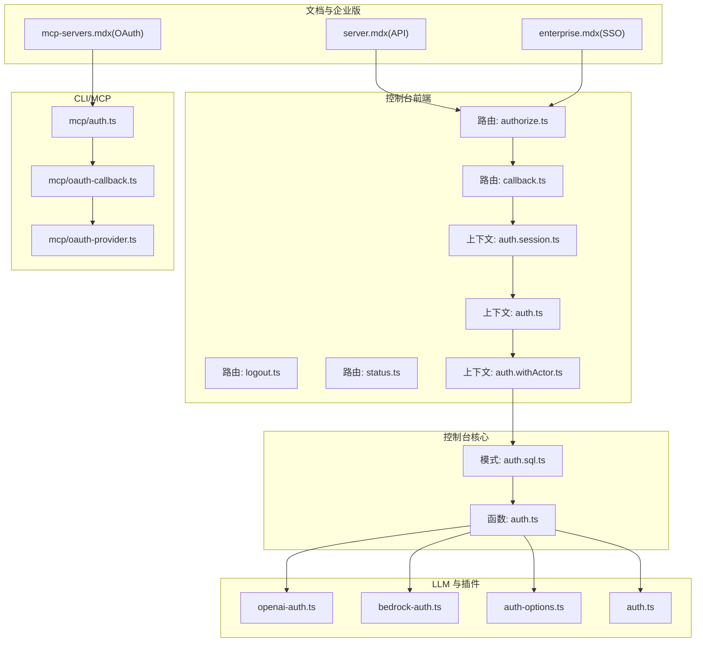
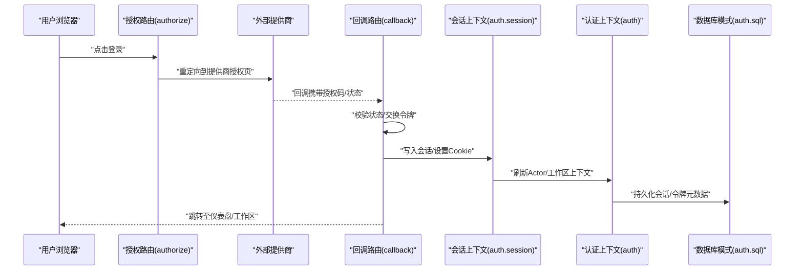
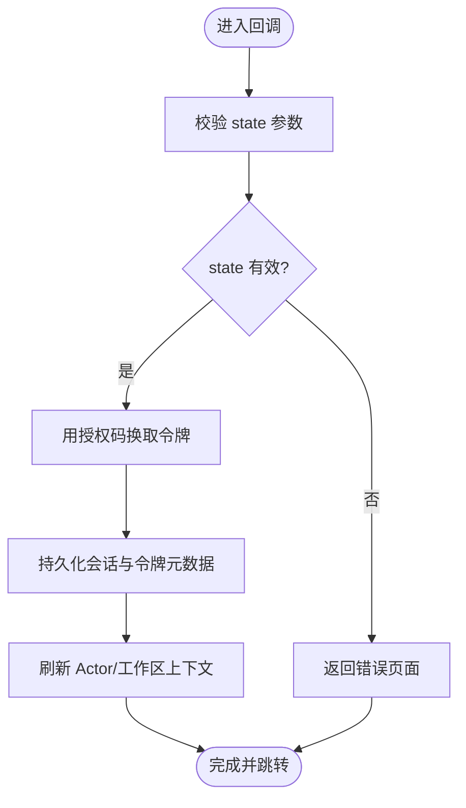
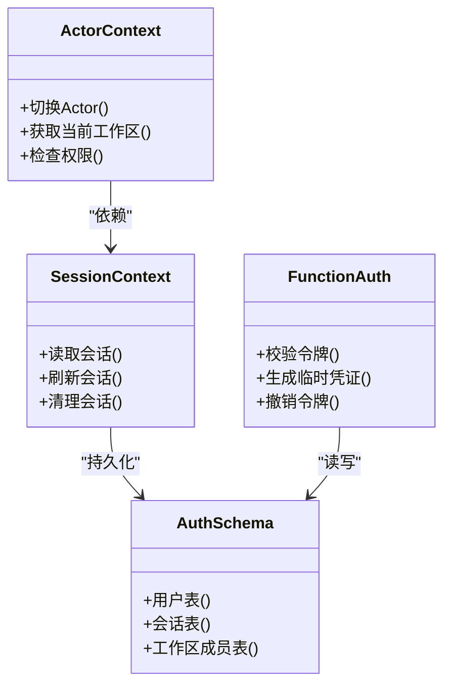
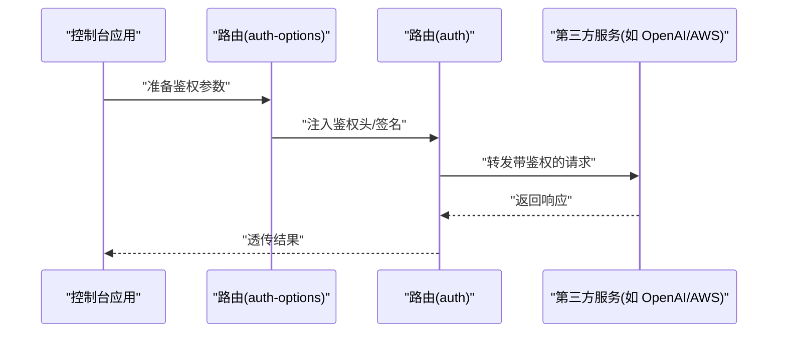
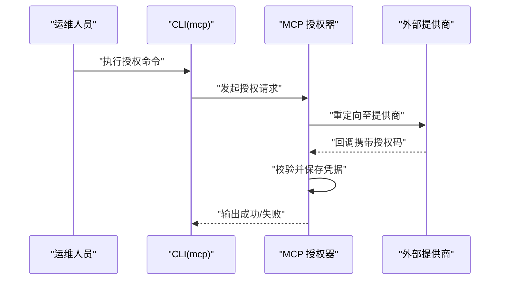
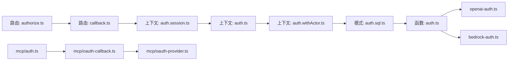

# 身份认证与授权

<cite>
**本文引用的文件**
- [server.mdx](file://packages/web/src/content/docs/server.mdx)
- [auth.session.ts](file://packages/console/app/src/context/auth.session.ts)
- [auth.ts](file://packages/console/app/src/context/auth.ts)
- [auth.withActor.ts](file://packages/console/app/src/context/auth.withActor.ts)
- [authorize.ts](file://packages/console/app/src/routes/auth/authorize.ts)
- [callback.ts](file://packages/console/app/src/routes/auth/[...callback].ts)
- [logout.ts](file://packages/console/app/src/routes/auth/logout.ts)
- [status.ts](file://packages/console/app/src/routes/auth/status.ts)
- [auth.sql.ts](file://packages/console/core/src/schema/auth.sql.ts)
- [auth.ts](file://packages/console/function/src/auth.ts)
- [openai-auth.ts](file://packages/core/src/plugin/provider/openai-auth.ts)
- [bedrock-auth.ts](file://packages/llm/src/protocols/utils/bedrock-auth.ts)
- [auth-options.ts](file://packages/llm/src/route/auth-options.ts)
- [auth.ts](file://packages/llm/src/route/auth.ts)
- [index.ts](file://packages/opencode/src/auth/index.ts)
- [auth.ts](file://packages/opencode/src/mcp/auth.ts)
- [oauth-callback.ts](file://packages/opencode/src/mcp/oauth-callback.ts)
- [oauth-provider.ts](file://packages/opencode/src/mcp/oauth-provider.ts)
- [enterprise.mdx](file://packages/web/src/content/docs/pt-br/enterprise.mdx)
- [ar/mcp-servers.mdx](file://packages/web/src/content/docs/ar/mcp-servers.mdx)
</cite>

## 目录
1. 引言
2. 项目结构
3. 核心组件
4. 架构总览
5. 组件详细分析
6. 依赖关系分析
7. 性能考量
8. 故障排查指南
9. 结论
10. 附录

## 引言
本文件面向 OpenCode 的身份认证与授权系统，聚焦以下目标：
- 用户认证机制：登录流程、会话管理、OAuth 授权回调、状态查询与登出
- 授权体系：RBAC 权限模型、资源保护策略、工作区级访问控制
- 用户管理：注册、信息更新、密钥管理、账户锁定与恢复
- 安全配置：OAuth 集成、企业级 SSO（SAML/SSO）与 LDAP 方案
- 最佳实践与威胁防护：会话安全、令牌轮换、速率限制与审计

## 项目结构
OpenCode 的认证与授权涉及多个包与模块：
- 控制台前端路由与上下文：负责登录授权、会话状态、Actor 切换
- 控制台核心数据库模式：定义认证相关表结构
- 控制台函数层：封装认证业务逻辑
- LLM 与插件层：提供第三方服务鉴权工具
- CLI/MCP 层：提供 OAuth 授权与回调处理
- 文档与企业版：提供企业级 SSO 与集中式配置说明

图表来源
- [authorize.ts](file://packages/console/app/src/routes/auth/authorize.ts)
- [callback.ts](file://packages/console/app/src/routes/auth/[...callback].ts)
- [auth.session.ts](file://packages/console/app/src/context/auth.session.ts)
- [auth.ts](file://packages/console/app/src/context/auth.ts)
- [auth.withActor.ts](file://packages/console/app/src/context/auth.withActor.ts)
- [auth.sql.ts](file://packages/console/core/src/schema/auth.sql.ts)
- [auth.ts](file://packages/console/function/src/auth.ts)
- [openai-auth.ts](file://packages/core/src/plugin/provider/openai-auth.ts)
- [bedrock-auth.ts](file://packages/llm/src/protocols/utils/bedrock-auth.ts)
- [auth-options.ts](file://packages/llm/src/route/auth-options.ts)
- [auth.ts](file://packages/llm/src/route/auth.ts)
- [auth.ts](file://packages/opencode/src/mcp/auth.ts)
- [oauth-callback.ts](file://packages/opencode/src/mcp/oauth-callback.ts)
- [oauth-provider.ts](file://packages/opencode/src/mcp/oauth-provider.ts)
- [server.mdx](file://packages/web/src/content/docs/server.mdx)
- [enterprise.mdx](file://packages/web/src/content/docs/pt-br/enterprise.mdx)
- [ar/mcp-servers.mdx](file://packages/web/src/content/docs/ar/mcp-servers.mdx)

章节来源
- [server.mdx](file://packages/web/src/content/docs/server.mdx)
- [auth.session.ts](file://packages/console/app/src/context/auth.session.ts)
- [auth.ts](file://packages/console/app/src/context/auth.ts)
- [auth.withActor.ts](file://packages/console/app/src/context/auth.withActor.ts)
- [authorize.ts](file://packages/console/app/src/routes/auth/authorize.ts)
- [callback.ts](file://packages/console/app/src/routes/auth/[...callback].ts)
- [logout.ts](file://packages/console/app/src/routes/auth/logout.ts)
- [status.ts](file://packages/console/app/src/routes/auth/status.ts)
- [auth.sql.ts](file://packages/console/core/src/schema/auth.sql.ts)
- [auth.ts](file://packages/console/function/src/auth.ts)
- [openai-auth.ts](file://packages/core/src/plugin/provider/openai-auth.ts)
- [bedrock-auth.ts](file://packages/llm/src/protocols/utils/bedrock-auth.ts)
- [auth-options.ts](file://packages/llm/src/route/auth-options.ts)
- [auth.ts](file://packages/llm/src/route/auth.ts)
- [auth.ts](file://packages/opencode/src/mcp/auth.ts)
- [oauth-callback.ts](file://packages/opencode/src/mcp/oauth-callback.ts)
- [oauth-provider.ts](file://packages/opencode/src/mcp/oauth-provider.ts)
- [enterprise.mdx](file://packages/web/src/content/docs/pt-br/enterprise.mdx)
- [ar/mcp-servers.mdx](file://packages/web/src/content/docs/ar/mcp-servers.mdx)

## 核心组件
- 登录与授权路由
  - 授权入口：发起 OAuth 授权请求，重定向至外部提供商
  - 回调处理：接收并验证回调参数，换取访问令牌或会话
  - 状态查询：返回当前登录状态与会话信息
  - 登出：清理会话并重定向
- 会话与 Actor 上下文
  - 会话状态管理：存储与刷新会话数据
  - Actor 切换：在不同工作区或角色间切换
- 数据库模式与函数层
  - 认证相关表结构定义
  - 认证业务逻辑封装
- 第三方服务鉴权
  - OpenAI/AWS Bedrock 等平台的鉴权工具
- CLI/MCP 层
  - 提供 OAuth 授权与回调处理命令
  - 支持 OAuth 客户端配置与调试

章节来源
- [authorize.ts](file://packages/console/app/src/routes/auth/authorize.ts)
- [callback.ts](file://packages/console/app/src/routes/auth/[...callback].ts)
- [status.ts](file://packages/console/app/src/routes/auth/status.ts)
- [logout.ts](file://packages/console/app/src/routes/auth/logout.ts)
- [auth.session.ts](file://packages/console/app/src/context/auth.session.ts)
- [auth.ts](file://packages/console/app/src/context/auth.ts)
- [auth.withActor.ts](file://packages/console/app/src/context/auth.withActor.ts)
- [auth.sql.ts](file://packages/console/core/src/schema/auth.sql.ts)
- [auth.ts](file://packages/console/function/src/auth.ts)
- [openai-auth.ts](file://packages/core/src/plugin/provider/openai-auth.ts)
- [bedrock-auth.ts](file://packages/llm/src/protocols/utils/bedrock-auth.ts)
- [auth-options.ts](file://packages/llm/src/route/auth-options.ts)
- [auth.ts](file://packages/llm/src/route/auth.ts)
- [auth.ts](file://packages/opencode/src/mcp/auth.ts)
- [oauth-callback.ts](file://packages/opencode/src/mcp/oauth-callback.ts)
- [oauth-provider.ts](file://packages/opencode/src/mcp/oauth-provider.ts)

## 架构总览
OpenCode 的认证与授权采用“前端路由 + 后端上下文 + 数据库模式 + 函数层”的分层架构，并通过 CLI/MCP 扩展企业集成能力。

图表来源
- [authorize.ts](file://packages/console/app/src/routes/auth/authorize.ts)
- [callback.ts](file://packages/console/app/src/routes/auth/[...callback].ts)
- [auth.session.ts](file://packages/console/app/src/context/auth.session.ts)
- [auth.ts](file://packages/console/app/src/context/auth.ts)
- [auth.sql.ts](file://packages/console/core/src/schema/auth.sql.ts)

## 组件详细分析

### 登录与会话管理
- 授权入口
  - 触发 OAuth 授权流程，生成并保存一次性 state，随后重定向至提供商
- 回调处理
  - 校验 state 防止 CSRF；用授权码换取令牌；写入会话并持久化
- 状态查询
  - 返回当前登录状态、会话详情与可用工作区
- 登出
  - 清理会话、撤销令牌、重定向至登录页

图表来源
- [callback.ts](file://packages/console/app/src/routes/auth/[...callback].ts)
- [auth.session.ts](file://packages/console/app/src/context/auth.session.ts)
- [auth.ts](file://packages/console/app/src/context/auth.ts)
- [auth.sql.ts](file://packages/console/core/src/schema/auth.sql.ts)

章节来源
- [authorize.ts](file://packages/console/app/src/routes/auth/authorize.ts)
- [callback.ts](file://packages/console/app/src/routes/auth/[...callback].ts)
- [status.ts](file://packages/console/app/src/routes/auth/status.ts)
- [logout.ts](file://packages/console/app/src/routes/auth/logout.ts)
- [auth.session.ts](file://packages/console/app/src/context/auth.session.ts)
- [auth.ts](file://packages/console/app/src/context/auth.ts)
- [auth.sql.ts](file://packages/console/core/src/schema/auth.sql.ts)

### 授权体系与 RBAC
- 工作区级访问控制
  - 通过 Actor 切换实现跨工作区访问；每个工作区绑定独立权限集
- 资源保护
  - 基于路径与角色的访问控制；对敏感接口进行鉴权与审计
- 令牌与密钥
  - API 密钥用于程序化访问；支持密钥轮换与失效管理

图表来源
- [auth.withActor.ts](file://packages/console/app/src/context/auth.withActor.ts)
- [auth.session.ts](file://packages/console/app/src/context/auth.session.ts)
- [auth.sql.ts](file://packages/console/core/src/schema/auth.sql.ts)
- [auth.ts](file://packages/console/function/src/auth.ts)

章节来源
- [auth.withActor.ts](file://packages/console/app/src/context/auth.withActor.ts)
- [auth.ts](file://packages/console/app/src/context/auth.ts)
- [auth.sql.ts](file://packages/console/core/src/schema/auth.sql.ts)
- [auth.ts](file://packages/console/function/src/auth.ts)

### 第三方服务鉴权
- OpenAI 鉴权
  - 通过 OpenAI-Authorization 头传递密钥
- AWS Bedrock 鉴权
  - 使用签名算法与凭据头进行请求签名
- 鉴权选项与路由
  - 在路由层注入鉴权参数，统一处理第三方平台的认证差异

图表来源
- [auth-options.ts](file://packages/llm/src/route/auth-options.ts)
- [auth.ts](file://packages/llm/src/route/auth.ts)
- [openai-auth.ts](file://packages/core/src/plugin/provider/openai-auth.ts)
- [bedrock-auth.ts](file://packages/llm/src/protocols/utils/bedrock-auth.ts)

章节来源
- [openai-auth.ts](file://packages/core/src/plugin/provider/openai-auth.ts)
- [bedrock-auth.ts](file://packages/llm/src/protocols/utils/bedrock-auth.ts)
- [auth-options.ts](file://packages/llm/src/route/auth-options.ts)
- [auth.ts](file://packages/llm/src/route/auth.ts)

### CLI/MCP 与 OAuth 流程
- 授权与回调
  - 通过 CLI 触发授权流程，处理回调并写入本地凭据
- OAuth 配置
  - 支持客户端 ID/Secret、作用域与自动发现开关
- 调试与诊断
  - 提供 OAuth 状态列表与特定服务器的调试命令

图表来源
- [auth.ts](file://packages/opencode/src/mcp/auth.ts)
- [oauth-callback.ts](file://packages/opencode/src/mcp/oauth-callback.ts)
- [oauth-provider.ts](file://packages/opencode/src/mcp/oauth-provider.ts)
- [ar/mcp-servers.mdx](file://packages/web/src/content/docs/ar/mcp-servers.mdx)

章节来源
- [auth.ts](file://packages/opencode/src/mcp/auth.ts)
- [oauth-callback.ts](file://packages/opencode/src/mcp/oauth-callback.ts)
- [oauth-provider.ts](file://packages/opencode/src/mcp/oauth-provider.ts)
- [ar/mcp-servers.mdx](file://packages/web/src/content/docs/ar/mcp-servers.mdx)

### 企业级认证与配置
- SSO 集成
  - 通过集中式配置对接组织的 SSO 提供商，统一认证入口
- 内部网关
  - 仅允许经由企业内部网关访问 AI 服务，禁用外部提供商
- 自托管与共享页面
  - 可选择自托管共享页面以满足数据不出境需求

章节来源
- [enterprise.mdx](file://packages/web/src/content/docs/pt-br/enterprise.mdx)

## 依赖关系分析
- 前端路由依赖会话与认证上下文，后者依赖数据库模式与函数层
- 第三方服务鉴权依赖路由层的统一注入机制
- CLI/MCP 依赖授权器与回调处理器，配合文档中的 OAuth 配置项

图表来源
- [authorize.ts](file://packages/console/app/src/routes/auth/authorize.ts)
- [callback.ts](file://packages/console/app/src/routes/auth/[...callback].ts)
- [auth.session.ts](file://packages/console/app/src/context/auth.session.ts)
- [auth.ts](file://packages/console/app/src/context/auth.ts)
- [auth.withActor.ts](file://packages/console/app/src/context/auth.withActor.ts)
- [auth.sql.ts](file://packages/console/core/src/schema/auth.sql.ts)
- [auth.ts](file://packages/console/function/src/auth.ts)
- [openai-auth.ts](file://packages/core/src/plugin/provider/openai-auth.ts)
- [bedrock-auth.ts](file://packages/llm/src/protocols/utils/bedrock-auth.ts)
- [auth.ts](file://packages/opencode/src/mcp/auth.ts)
- [oauth-callback.ts](file://packages/opencode/src/mcp/oauth-callback.ts)
- [oauth-provider.ts](file://packages/opencode/src/mcp/oauth-provider.ts)

章节来源
- [server.mdx](file://packages/web/src/content/docs/server.mdx)
- [auth.session.ts](file://packages/console/app/src/context/auth.session.ts)
- [auth.ts](file://packages/console/app/src/context/auth.ts)
- [auth.withActor.ts](file://packages/console/app/src/context/auth.withActor.ts)
- [auth.sql.ts](file://packages/console/core/src/schema/auth.sql.ts)
- [auth.ts](file://packages/console/function/src/auth.ts)
- [openai-auth.ts](file://packages/core/src/plugin/provider/openai-auth.ts)
- [bedrock-auth.ts](file://packages/llm/src/protocols/utils/bedrock-auth.ts)
- [auth.ts](file://packages/opencode/src/mcp/auth.ts)
- [oauth-callback.ts](file://packages/opencode/src/mcp/oauth-callback.ts)
- [oauth-provider.ts](file://packages/opencode/src/mcp/oauth-provider.ts)

## 性能考量
- 会话缓存与预取：减少重复查询与网络往返
- 令牌轮换与失效：降低长期令牌泄露风险
- 速率限制与配额：对第三方服务调用施加节流
- 数据库索引：为会话与用户表建立必要索引以提升查询性能

## 故障排查指南
- OAuth 授权失败
  - 检查 state 校验是否通过、授权码是否过期、回调地址是否匹配
  - 使用 CLI 的 OAuth 状态列表与调试命令定位问题
- 会话异常
  - 查看会话上下文是否正确刷新，Cookie 是否被正确设置
  - 核对数据库中会话记录与令牌元数据
- 第三方服务鉴权错误
  - 确认鉴权头/签名参数是否正确注入
  - 对比客户端 ID/Secret 与作用域配置

章节来源
- [callback.ts](file://packages/console/app/src/routes/auth/[...callback].ts)
- [auth.session.ts](file://packages/console/app/src/context/auth.session.ts)
- [auth.sql.ts](file://packages/console/core/src/schema/auth.sql.ts)
- [ar/mcp-servers.mdx](file://packages/web/src/content/docs/ar/mcp-servers.mdx)

## 结论
OpenCode 的认证与授权体系通过前端路由与上下文、数据库模式与函数层、以及 CLI/MCP 的扩展能力，实现了从用户登录到资源访问的完整闭环。结合企业级 SSO 与内部网关策略，可满足组织对合规与数据安全的要求。建议在生产环境中启用严格的会话安全策略、令牌轮换与审计日志，并定期审查权限矩阵与访问控制规则。

## 附录
- API 端点参考（来自文档）
  - 提供商列表与默认配置
  - OAuth 授权与回调
  - 会话查询

章节来源
- [server.mdx](file://packages/web/src/content/docs/server.mdx)