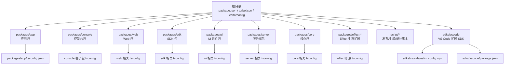
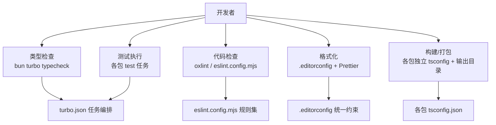
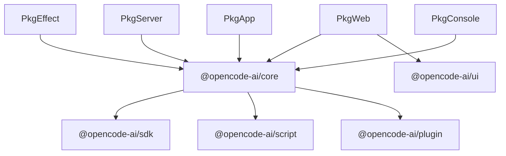

# 代码规范

<cite>
**本文引用的文件**
- [turbo.json](file://turbo.json)
- [.editorconfig](file://.editorconfig)
- [eslint.config.mjs](file://sdks\vscode\eslint.config.mjs)
- [tsconfig.json](file://tsconfig.json)
- [packages/app/tsconfig.json](file://packages\app\tsconfig.json)
- [package.json](file://package.json)
</cite>

## 目录
1. [简介](#简介)
2. [项目结构](#项目结构)
3. [核心组件](#核心组件)
4. [架构总览](#架构总览)
5. [详细组件分析](#详细组件分析)
6. [依赖分析](#依赖分析)
7. [性能考虑](#性能考虑)
8. [故障排查指南](#故障排查指南)
9. [结论](#结论)
10. [附录](#附录)

## 简介
本文件为 OpenCode 项目的 TypeScript 代码规范与工程化实践指南，覆盖类型系统、命名约定、注释与文档、格式化（Prettier + ESLint）、错误处理与异常管理、重构与优化建议，以及跨包一致性与可维护性保障策略。目标是统一贡献者代码风格，提升协作效率与长期可维护性。

## 项目结构
OpenCode 采用 Monorepo 架构，根目录通过工作区与任务编排工具进行统一管理；各子包拥有独立的 tsconfig 与构建/测试脚本；根级配置提供全局格式化与 Lint 规则入口。

图表来源
- [package.json:24-93](file://package.json#L24-L93)
- [turbo.json:1-26](file://turbo.json#L1-L26)
- [packages/app/tsconfig.json:1-27](file://packages\app\tsconfig.json#L1-L27)
- [eslint.config.mjs:1-35](file://sdks\vscode\eslint.config.mjs#L1-L35)

章节来源
- [package.json:1-156](file://package.json#L1-L156)
- [turbo.json:1-26](file://turbo.json#L1-L26)

## 核心组件
- 类型系统与编译配置
  - 全局 tsconfig 继承 Bun 推荐配置，确保一致的编译目标与模块解析策略。
  - 应用包（如 packages/app）启用严格模式、声明输出、路径映射等，保证类型安全与产物可控。
- Lint 与格式化
  - 根级 package.json 配置 Prettier 基础规则（无分号、较长行长），便于统一格式。
  - VS Code SDK 使用 oxlint（基于 Rust 的高性能 linter）作为根级 lint 脚本，同时在子包中可按需引入 ESLint 插件。
  - .editorconfig 提供基础换行、缩进、行宽等通用约束，确保多编辑器一致性。
- 工作流与任务编排
  - turbo.json 定义类型检查、构建、测试等任务依赖关系与缓存输出，加速多包开发体验。

章节来源
- [tsconfig.json:1-6](file://tsconfig.json#L1-L6)
- [packages/app/tsconfig.json:1-27](file://packages\app\tsconfig.json#L1-L27)
- [package.json:101-124](file://package.json#L101-L124)
- [.editorconfig:1-10](file://.editorconfig#L1-L10)
- [turbo.json:1-26](file://turbo.json#L1-L26)

## 架构总览
下图展示 OpenCode 在“类型检查 → Lint → 格式化 → 构建/测试”的工程化流水线中的关键节点与工具交互。

图表来源
- [turbo.json:5-24](file://turbo.json#L5-L24)
- [eslint.config.mjs:1-35](file://sdks\vscode\eslint.config.mjs#L1-L35)
- [.editorconfig:1-10](file://.editorconfig#L1-L10)
- [package.json:101-124](file://package.json#L101-L124)

## 详细组件分析

### 类型系统与编译配置
- 全局 tsconfig
  - 继承 Bun 推荐配置，确保跨平台与现代语法支持一致。
  - compilerOptions 留空以便子包按需覆盖。
- 应用包 tsconfig（示例：packages/app）
  - 开启严格模式，启用声明输出与路径别名，便于 IDE 支持与模块解析。
  - 指定 JSX 处理方式与模块解析策略，适配前端框架生态。
- 最佳实践
  - 子包应明确 include/exclude，避免无关文件参与类型检查。
  - 使用 composite/declaration-only 构建策略以提升增量编译性能。
  - 路径别名保持统一前缀，减少相对路径带来的脆弱性。

章节来源
- [tsconfig.json:1-6](file://tsconfig.json#L1-L6)
- [packages/app/tsconfig.json:1-27](file://packages\app\tsconfig.json#L1-L27)

### 命名约定
- 导入命名
  - ESLint 规则对导入命名进行校验，推荐 camelCase 或 PascalCase，确保可读性与一致性。
- 变量/函数/类命名
  - 建议遵循 camelCase（变量、函数、方法）与 PascalCase（构造函数、类名）。
  - 避免缩写与无意义名称，优先表达意图。
- 文件命名
  - 源文件使用小驼峰或名词复数形式，避免空格与特殊字符。
  - 测试文件以 .test.ts 结尾，或按包内约定组织。
- 接口与类型
  - 接口以大写字母开头（如 IName），或直接使用类型名（如 Name）；根据团队偏好统一风格。
  - 泛型参数使用单字母（如 T、U、K、V）或语义化短名（如 Item、Key）。

章节来源
- [eslint.config.mjs:20-26](file://sdks\vscode\eslint.config.mjs#L20-L26)

### 注释与文档
- JSDoc 注释
  - 为公共 API、复杂函数、接口与类型导出补充 JSDoc，描述用途、参数、返回值与异常。
  - 参数与返回值标注清晰类型，必要时给出默认值与边界条件。
- API 文档要求
  - 对外暴露的函数/类/接口需有简要说明与使用示例。
  - 错误场景与异常分支应在注释中标明，便于调用方正确处理。
- 内部注释
  - 关键算法与业务逻辑添加简要注释，解释“为什么”而非“做了什么”。

章节来源
- [eslint.config.mjs:19-32](file://sdks\vscode\eslint.config.mjs#L19-L32)

### 代码格式化与 Lint
- Prettier
  - 根级 package.json 中设置无分号与较长行长，统一团队格式偏好。
  - 建议在提交前运行格式化命令，确保 PR 代码整洁。
- ESLint/Oxlint
  - 根级使用 oxlint 作为快速 Lint 方案；子包可按需引入 @typescript-eslint 插件。
  - 常用规则建议：强制花括号、相等性比较、禁止抛出字面量、分号策略等。
- .editorconfig
  - 统一换行符、缩进与行宽，降低编辑器差异带来的格式漂移。

章节来源
- [package.json:101-124](file://package.json#L101-L124)
- [eslint.config.mjs:1-35](file://sdks\vscode\eslint.config.mjs#L1-L35)
- [.editorconfig:1-10](file://.editorconfig#L1-L10)

### 错误处理与异常管理
- 异常模型
  - 明确区分“预期错误”与“未预期错误”，前者可携带业务上下文，后者记录堆栈并上报监控。
- 错误传播
  - 在函数边界统一捕获与包装错误，保留原始信息但不泄露敏感数据。
- 异步错误
  - Promise/async 函数必须显式处理 reject 分支，避免未捕获异常导致进程退出。
- 日志与可观测性
  - 记录关键事件与错误上下文，结合唯一请求 ID 进行关联追踪。
- 最佳实践清单
  - 不要吞掉错误；不要抛出字面量；统一错误对象结构；在边界处做输入校验。

章节来源
- [eslint.config.mjs:28-32](file://sdks\vscode\eslint.config.mjs#L28-L32)

### 重构与优化指导
- 类型驱动开发
  - 优先定义接口与类型，再实现逻辑，确保契约清晰、易于测试与演进。
- 泛型使用
  - 在重复逻辑中抽象为泛型，减少代码重复；注意类型推断与约束，避免过度复杂。
- 模块拆分
  - 将大文件拆分为职责单一的小模块，保持高内聚低耦合。
- 性能优化
  - 避免不必要的深拷贝与重复计算；利用缓存与惰性求值；在循环中减少对象创建。
- 可测试性
  - 通过接口隔离与依赖注入提升可测试性；为关键路径提供单元测试与集成测试。

章节来源
- [packages/app/tsconfig.json:15-19](file://packages\app\tsconfig.json#L15-L19)

### 代码审查与质量门禁
- 提交前检查
  - 运行类型检查、Lint 与格式化；确保测试通过。
- CI 集成
  - 利用 turbo 的任务依赖与缓存，加速 CI 执行；在 PR 中固定关键任务顺序。
- 规则升级
  - 新增规则需经讨论并在团队内达成共识；逐步迁移存量代码。

章节来源
- [turbo.json:5-24](file://turbo.json#L5-L24)
- [package.json:8-22](file://package.json#L8-L22)

## 依赖分析
OpenCode 通过工作区与任务编排工具实现跨包依赖与构建协同；根级依赖与脚本定义了统一的开发体验。

图表来源
- [package.json:110-114](file://package.json#L110-L114)

章节来源
- [package.json:24-93](file://package.json#L24-L93)

## 性能考虑
- 类型检查
  - 使用 composite/declaration-only 构建策略，减少全量重检时间。
  - 合理划分包边界，避免不必要的交叉依赖。
- Lint 与格式化
  - 优先使用 Oxlint 作为根级 Lint 工具，提升速度；仅在需要 TS 特性时引入 ESLint。
  - 将格式化纳入 pre-commit 钩子，减少 CI 压力。
- 构建与缓存
  - 利用 turbo 的任务缓存与并行执行，缩短本地与 CI 时间。

章节来源
- [turbo.json:5-24](file://turbo.json#L5-L24)
- [package.json:101-106](file://package.json#L101-L106)

## 故障排查指南
- 类型检查失败
  - 检查 tsconfig 是否继承正确；确认 include/exclude 范围；查看具体报错位置并补充类型。
- Lint 报错
  - 遵循 ESLint 规则建议：强制花括号、相等性比较、禁止抛出字面量、分号策略等；必要时调整规则或忽略特定文件。
- 格式化冲突
  - 统一使用 Prettier；在 IDE 中启用保存时格式化；确保 .editorconfig 与 Prettier 配置一致。
- CI 任务失败
  - 查看 turbo 任务依赖与输出目录；确认脚本顺序与环境变量；定位失败阶段并修复。

章节来源
- [eslint.config.mjs:19-32](file://sdks\vscode\eslint.config.mjs#L19-L32)
- [.editorconfig:1-10](file://.editorconfig#L1-L10)
- [turbo.json:5-24](file://turbo.json#L5-L24)

## 结论
通过统一的类型系统、命名规范、注释与文档、格式化与 Lint、错误处理与异常管理、以及重构与优化指导，OpenCode 能够在多包协作中保持一致的代码风格与高质量交付。建议在团队内定期回顾与更新规范，确保与技术演进同步。

## 附录
- 快速参考
  - 类型检查：bun turbo typecheck
  - Lint：oxlint（根级）或 eslint.config.mjs（子包）
  - 格式化：Prettier（根级配置）+ .editorconfig
  - 构建/测试：各包独立 tsconfig 与脚本，配合 turbo 任务编排

章节来源
- [package.json:8-22](file://package.json#L8-L22)
- [eslint.config.mjs:1-35](file://sdks\vscode\eslint.config.mjs#L1-L35)
- [package.json:101-124](file://package.json#L101-L124)
- [turbo.json:5-24](file://turbo.json#L5-L24)