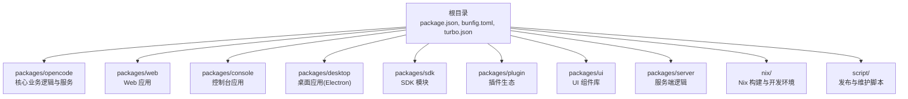
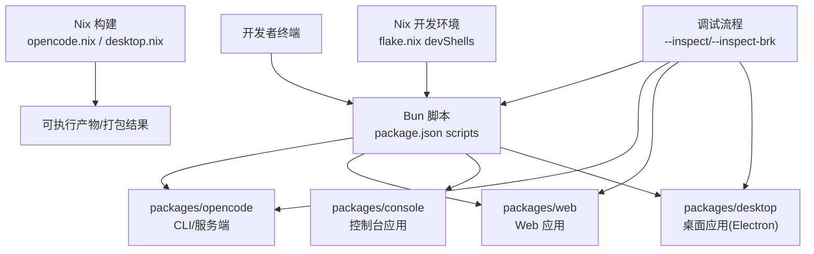
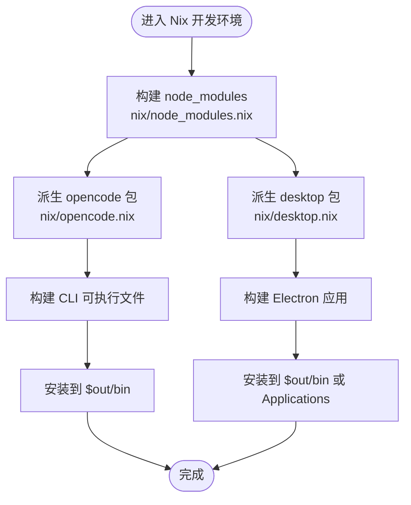
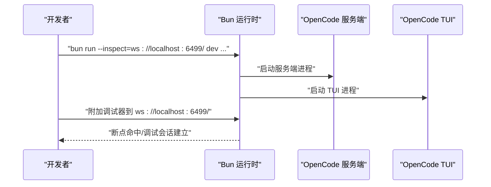
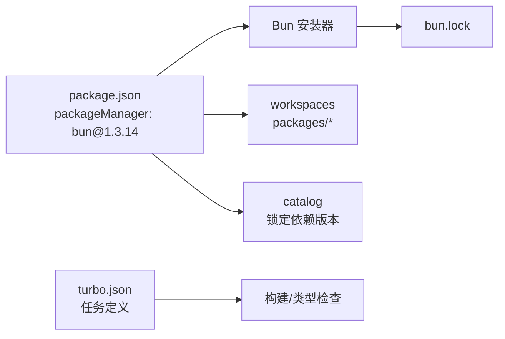

# 开发环境搭建

<cite>
**本文档引用的文件**
- [README.md](file://README.md)
- [CONTRIBUTING.md](file://CONTRIBUTING.md)
- [package.json](file://package.json)
- [bunfig.toml](file://bunfig.toml)
- [turbo.json](file://turbo.json)
- [flake.nix](file://flake.nix)
- [nix/opencode.nix](file://nix/opencode.nix)
- [nix/desktop.nix](file://nix/desktop.nix)
- [nix/node_modules.nix](file://nix/node_modules.nix)
</cite>

## 目录
1. [简介](#简介)
2. [系统要求与前置条件](#系统要求与前置条件)
3. [项目结构概览](#项目结构概览)
4. [核心组件](#核心组件)
5. [架构总览](#架构总览)
6. [详细组件分析](#详细组件分析)
7. [依赖分析](#依赖分析)
8. [性能考虑](#性能考虑)
9. [故障排除指南](#故障排除指南)
10. [结论](#结论)

## 简介
本指南面向希望在本地搭建并调试 OpenCode 项目的开发者，覆盖系统要求、依赖安装、Nix 环境使用、本地开发服务器启动顺序、调试工具配置以及常见问题排查。文档内容均基于仓库中的实际配置文件整理而成，确保可复现性与准确性。

## 系统要求与前置条件
- 包管理器：Bun（版本要求见下文）
- Node.js：用于构建与兼容性（详见 Nix 配置）
- Nix：可选但推荐，用于一致化的开发环境与依赖构建
- 平台支持：Linux（x86_64、aarch64）、macOS（x86_64、aarch64）

关键依据：
- 包管理器与脚本命令由根目录配置定义，使用 Bun 作为默认包管理器与执行环境
- Nix flake 提供统一的开发 Shell，包含 Bun 与 Node.js 等工具
- Nix 衍生物（opencode.nix、desktop.nix）定义了构建流程与运行时环境变量

章节来源
- [package.json:1-156](file://package.json#L1-L156)
- [flake.nix:1-74](file://flake.nix#L1-L74)
- [nix/opencode.nix:1-103](file://nix/opencode.nix#L1-L103)
- [nix/desktop.nix:1-111](file://nix/desktop.nix#L1-L111)
- [nix/node_modules.nix:1-86](file://nix/node_modules.nix#L1-L86)

## 项目结构概览
OpenCode 采用 Monorepo 结构，核心工作区位于 packages/* 下，包含 Web 应用、桌面应用、控制台、SDK、插件等模块。根目录提供统一的脚本与配置，便于在不同子项目间进行开发与调试。

图表来源
- [package.json:24-93](file://package.json#L24-L93)
- [turbo.json:1-26](file://turbo.json#L1-L26)

章节来源
- [package.json:24-93](file://package.json#L24-L93)
- [turbo.json:1-26](file://turbo.json#L1-L26)

## 核心组件
- 包管理与脚本
  - 默认包管理器：Bun（版本由 package.json 指定）
  - 常用开发脚本：dev、dev:web、dev:console、dev:desktop、dev:storybook 等
  - 类型检查与 lint：通过 turbo 统一调度
- Nix 开发环境
  - flake.nix 定义 devShells、overlay 与 packages
  - opencode.nix、desktop.nix、node_modules.nix 分别负责 CLI、桌面应用与 node_modules 构建
- 工作区与依赖
  - workspaces 指向多个子包
  - catalog 中锁定关键依赖版本，确保一致性

章节来源
- [package.json:7-23](file://package.json#L7-L23)
- [package.json:24-93](file://package.json#L24-L93)
- [bunfig.toml:1-9](file://bunfig.toml#L1-L9)
- [turbo.json:1-26](file://turbo.json#L1-L26)
- [flake.nix:21-31](file://flake.nix#L21-L31)
- [nix/opencode.nix:16-93](file://nix/opencode.nix#L16-L93)
- [nix/desktop.nix:16-99](file://nix/desktop.nix#L16-L99)
- [nix/node_modules.nix:21-77](file://nix/node_modules.nix#L21-L77)

## 架构总览
下图展示了本地开发时各组件之间的关系与交互路径，包括开发脚本、Nix 构建与调试流程。

图表来源
- [package.json:8-14](file://package.json#L8-L14)
- [CONTRIBUTING.md:146-176](file://CONTRIBUTING.md#L146-L176)
- [flake.nix:21-31](file://flake.nix#L21-L31)
- [nix/opencode.nix:45-73](file://nix/opencode.nix#L45-L73)
- [nix/desktop.nix:65-77](file://nix/desktop.nix#L65-L77)

章节来源
- [package.json:8-14](file://package.json#L8-L14)
- [CONTRIBUTING.md:146-176](file://CONTRIBUTING.md#L146-L176)
- [flake.nix:21-31](file://flake.nix#L21-L31)
- [nix/opencode.nix:45-73](file://nix/opencode.nix#L45-L73)
- [nix/desktop.nix:65-77](file://nix/desktop.nix#L65-L77)

## 详细组件分析

### 包管理器与脚本配置
- 默认包管理器：Bun（版本由 package.json 指定）
- 开发脚本
  - 启动核心服务与 TUI：bun dev
  - 启动 Web 应用：bun run --cwd packages/app dev
  - 启动控制台应用：bun run --cwd packages/console/app dev
  - 启动桌面应用：bun run --cwd packages/desktop dev
  - 启动 Storybook：bun run --cwd packages/storybook storybook
- 类型检查与 lint：通过 turbo 统一调度，避免重复执行

章节来源
- [package.json:7-23](file://package.json#L7-L23)
- [package.json:8-14](file://package.json#L8-L14)
- [turbo.json:1-26](file://turbo.json#L1-L26)

### Nix 开发环境与构建
- 开发 Shell
  - flake.nix 提供 devShells.default，包含 bun、nodejs_20、pkg-config、openssl、git 等工具
- overlay 与 packages
  - opencode：调用 nix/opencode.nix，设置运行时环境变量（如模型 API、版本等），构建 CLI 可执行文件
  - opencode-desktop：基于 opencode 衍生，构建 Electron 桌面应用
  - node_modules：通过 nix/node_modules.nix 构建统一的 node_modules，支持多平台与缓存
- 构建流程
  - opencode.nix：复制 node_modules、修复 shebang、构建 CLI 与 schema、安装到 $out/bin
  - desktop.nix：准备 Electron 资源、构建并打包应用，生成可执行入口

图表来源
- [flake.nix:33-49](file://flake.nix#L33-L49)
- [nix/node_modules.nix:48-71](file://nix/node_modules.nix#L48-L71)
- [nix/opencode.nix:45-73](file://nix/opencode.nix#L45-L73)
- [nix/desktop.nix:65-77](file://nix/desktop.nix#L65-L77)

章节来源
- [flake.nix:21-31](file://flake.nix#L21-L31)
- [nix/node_modules.nix:21-77](file://nix/node_modules.nix#L21-L77)
- [nix/opencode.nix:16-93](file://nix/opencode.nix#L16-L93)
- [nix/desktop.nix:16-99](file://nix/desktop.nix#L16-L99)

### 调试工具配置
- 推荐方式
  - 使用 --inspect=<url> 手动启动并附加调试器，避免断点映射错误
  - 若需在 TUI 中触发服务端断点，优先尝试 bun dev spawn
  - 也可分别调试服务端与 TUI：先以指定 inspect 地址启动服务端，再在 TUI 中 attach
- VSCode 配置
  - 可参考 .vscode/settings.example.json 与 .vscode/launch.example.json（参见贡献指南）
- 其他提示
  - 可使用 --inspect-wait 或 --inspect-brk 根据工作流选择
  - 可通过导出 BUN_OPTIONS=--inspect=... 简化每次输入

图表来源
- [CONTRIBUTING.md:146-176](file://CONTRIBUTING.md#L146-L176)

章节来源
- [CONTRIBUTING.md:146-176](file://CONTRIBUTING.md#L146-L176)

## 依赖分析
- 包管理器与版本
  - package.json 指定 packageManager 为 bun@1.3.14
  - bunfig.toml 启用 exact 安装与最小发布年龄策略，减少不稳定版本影响
- 工作区与 Catalog
  - workspaces 覆盖多个子包，确保 monorepo 内部依赖解析正确
  - catalog 锁定关键依赖版本，提升可重复性
- Turbo 任务
  - turbo.json 定义类型检查、构建等任务的依赖关系与输出目录，加速增量构建

图表来源
- [package.json:7](file://package.json#L7)
- [package.json:24-93](file://package.json#L24-L93)
- [bunfig.toml:1-5](file://bunfig.toml#L1-L5)
- [turbo.json:1-26](file://turbo.json#L1-L26)

章节来源
- [package.json:7](file://package.json#L7)
- [package.json:24-93](file://package.json#L24-L93)
- [bunfig.toml:1-5](file://bunfig.toml#L1-L5)
- [turbo.json:1-26](file://turbo.json#L1-L26)

## 性能考虑
- 使用 Nix 构建 node_modules，避免跨平台差异导致的重复下载与安装
- 启用 --frozen-lockfile 与 --ignore-scripts，提升安装稳定性与速度
- 在 macOS 上注意 Rosetta 检测与 sysctl 可执行文件的存在性
- Electron 桌面应用在 Linux 上可能需要 autoPatchelfHook 与 Wayland 相关参数

章节来源
- [nix/node_modules.nix:48-63](file://nix/node_modules.nix#L48-L63)
- [nix/opencode.nix:61-70](file://nix/opencode.nix#L61-L70)
- [nix/desktop.nix:30-35](file://nix/desktop.nix#L30-L35)
- [nix/desktop.nix:95-96](file://nix/desktop.nix#L95-L96)

## 故障排除指南
- 安装与依赖
  - 确保使用 Bun 作为包管理器，并遵循 package.json 中的版本要求
  - 如需稳定安装，启用 exact 与最小发布年龄策略（bunfig.toml）
  - 若出现跨平台二进制不匹配，检查 Nix 构建时的 CPU/OS 参数
- Nix 环境
  - 确认 devShells.default 包含 bun 与 nodejs_20
  - 若 node_modules 构建失败，使用 node_modules_updater 派生以更新哈希
- 调试
  - 断点映射错误：改用 --inspect 附加调试器，或使用 spawn 模式
  - VSCode 调试：优先避免 "launch" 请求与 JavaScript Debug Terminal，参考 launch.example.json
- 平台差异
  - macOS：确认 sysctl 存在；必要时调整 Rosetta 检测
  - Linux：确保 autoPatchelfHook 与 Wayland 相关标志可用

章节来源
- [package.json:7](file://package.json#L7)
- [bunfig.toml:1-5](file://bunfig.toml#L1-L5)
- [flake.nix:21-31](file://flake.nix#L21-L31)
- [nix/node_modules.nix:67-77](file://nix/node_modules.nix#L67-L77)
- [nix/opencode.nix:61-70](file://nix/opencode.nix#L61-L70)
- [nix/desktop.nix:30-35](file://nix/desktop.nix#L30-L35)
- [nix/desktop.nix:95-96](file://nix/desktop.nix#L95-L96)
- [CONTRIBUTING.md:146-176](file://CONTRIBUTING.md#L146-L176)

## 结论
通过以上步骤，开发者可以在本地快速搭建 OpenCode 的开发环境，使用 Bun 进行日常开发与调试，借助 Nix 实现跨平台的一致性与可复现性。建议在开始前先完成系统要求与前置条件的核对，并按“依赖安装 → Nix 环境 → 启动服务 → 调试配置”的顺序推进，遇到问题时参考故障排除指南。