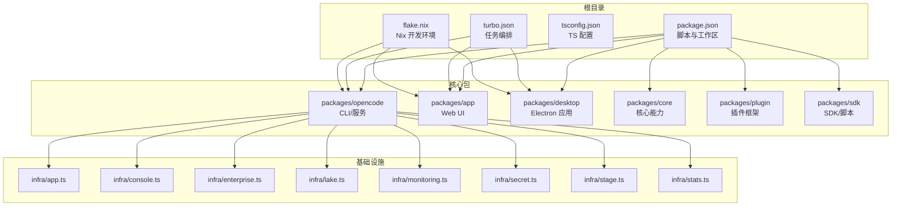
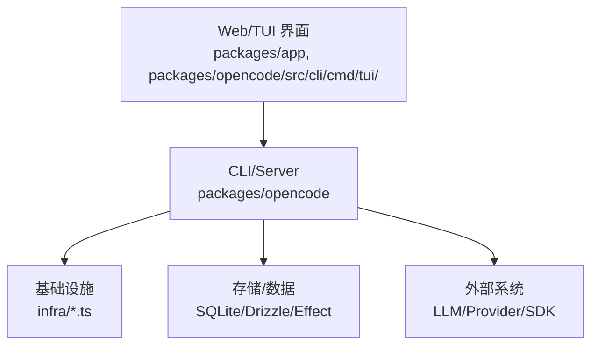
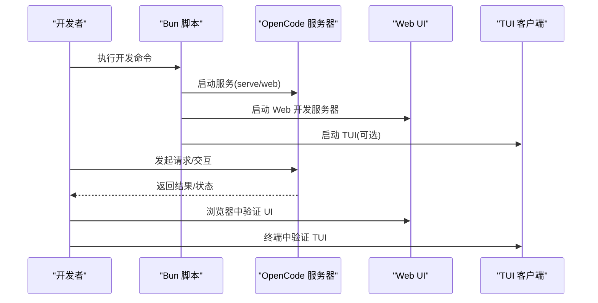
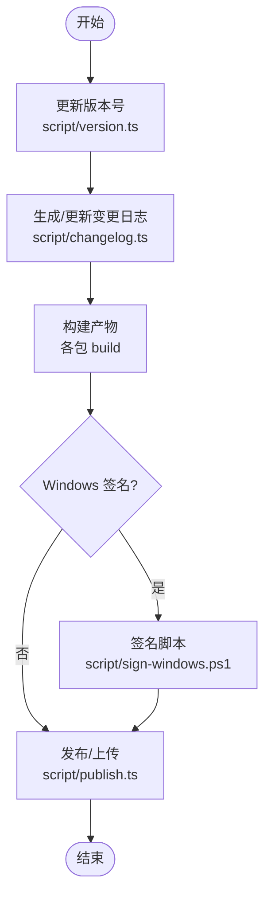
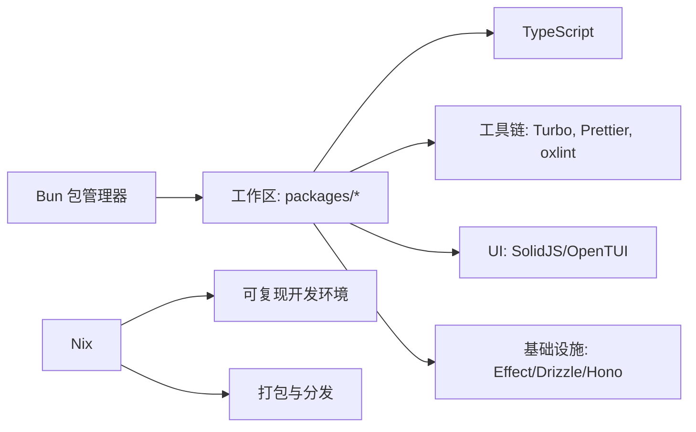

# 开发者指南

<cite>
**本文引用的文件**
- [CONTRIBUTING.md](file://CONTRIBUTING.md)
- [README.md](file://README.md)
- [package.json](file://package.json)
- [turbo.json](file://turbo.json)
- [tsconfig.json](file://tsconfig.json)
- [.github/pull_request_template.md](file://.github/pull_request_template.md)
- [flake.nix](file://flake.nix)
- [bunfig.toml](file://bunfig.toml)
- [nix/opencode.nix](file://nix/opencode.nix)
- [nix/node_modules.nix](file://nix/node_modules.nix)
- [nix/desktop.nix](file://nix/desktop.nix)
- [nix/scripts/canonicalize-node-modules.ts](file://nix/scripts/canonicalize-node-modules.ts)
- [nix/scripts/normalize-bun-binaries.ts](file://nix/scripts/normalize-bun-binaries.ts)
- [nix/hashes.json](file://nix/hashes.json)
- [script/changelog.ts](file://script/changelog.ts)
- [script/version.ts](file://script/version.ts)
- [script/publish.ts](file://script/publish.ts)
- [script/format.ts](file://script/format.ts)
- [script/generate.ts](file://script/generate.ts)
- [script/stats.ts](file://script/stats.ts)
- [script/raw-changelog.ts](file://script/raw-changelog.ts)
- [script/sign-windows.ps1](file://script/sign-windows.ps1)
- [script/upgrade-opentui.ts](file://script/upgrade-opentui.ts)
- [script/github/close-issues.ts](file://script/github/close-issues.ts)
- [script/github/close-prs.ts](file://script/github/close-prs.ts)
- [script/github/duplicate-pr.ts](file://script/github/duplicate-pr.ts)
- [.oxlintrc.json](file://.oxlintrc.json)
- [.prettierignore](file://.prettierignore)
- [.editorconfig](file://.editorconfig)
- [.gitignore](file://.gitignore)
- [.gitleaksignore](file://.gitleaksignore)
- [.opencode/opencode.jsonc](file://.opencode/opencode.jsonc)
- [packages/opencode/src/index.ts](file://packages/opencode/src/index.ts)
- [packages/opencode/src/cli/cmd/tui/](file://packages/opencode/src/cli/cmd/tui/)
- [packages/app/package.json](file://packages/app/package.json)
- [packages/desktop/package.json](file://packages/desktop/package.json)
- [packages/core/package.json](file://packages/core/package.json)
- [packages/sdk/package.json](file://packages/sdk/package.json)
- [sdks/vscode/package.json](file://sdks/vscode/package.json)
- [infra/app.ts](file://infra/app.ts)
- [infra/console.ts](file://infra/console.ts)
- [infra/enterprise.ts](file://infra/enterprise.ts)
- [infra/lake.ts](file://infra/lake.ts)
- [infra/monitoring.ts](file://infra/monitoring.ts)
- [infra/secret.ts](file://infra/secret.ts)
- [infra/stage.ts](file://infra/stage.ts)
- [infra/stats.ts](file://infra/stats.ts)
- [specs/project.md](file://specs/project.md)
- [specs/tui-package.md](file://specs/tui-package.md)
- [specs/storage/effect-sqlite-package.md](file://specs/storage/effect-sqlite-package.md)
- [specs/storage/remove-opencode-db.md](file://specs/storage/remove-opencode-db.md)
- [specs/v2/config.md](file://specs/v2/config.md)
- [specs/v2/instructions.md](file://specs/v2/instructions.md)
- [specs/v2/provider-model.md](file://specs/v2/provider-model.md)
- [specs/v2/provider-policy.md](file://specs/v2/provider-policy.md)
- [specs/v2/schema-changelog.md](file://specs/v2/schema-changelog.md)
- [specs/v2/session.md](file://specs/v2/session.md)
- [specs/v2/tools.md](file://specs/v2/tools.md)
</cite>

## 目录
1. [简介](#简介)
2. [项目结构](#项目结构)
3. [核心组件](#核心组件)
4. [架构总览](#架构总览)
5. [详细组件分析](#详细组件分析)
6. [依赖分析](#依赖分析)
7. [性能考虑](#性能考虑)
8. [故障排除指南](#故障排除指南)
9. [结论](#结论)
10. [附录](#附录)

## 简介
本指南面向希望为 OpenCode 项目做出贡献的开发者，覆盖从 Fork 项目到提交 Pull Request 的全流程，涵盖代码规范与风格、开发环境搭建、测试策略、发布与版本管理、代码审查标准以及社区参与方式。目标是帮助新贡献者快速融入并高质量地交付改动。

## 项目结构
OpenCode 是一个多包（monorepo）项目，采用 Bun 作为包管理器与运行时，使用 Turbo 进行任务编排，TypeScript 作为主要语言，并通过 Nix 提供可复现的开发环境与打包能力。核心模块包括：
- 核心服务与 CLI：packages/opencode
- Web UI 组件：packages/app
- 桌面应用：packages/desktop
- 插件生态：packages/plugin
- SDK 与脚本：packages/sdk、packages/script
- 基础设施与部署：infra/*.ts
- 规范与设计文档：specs/*.md
- Nix 包装与构建：nix/*.nix 及其脚本

图表来源
- [package.json:1-156](file://package.json#L1-L156)
- [turbo.json:1-26](file://turbo.json#L1-L26)
- [tsconfig.json:1-6](file://tsconfig.json#L1-L6)
- [flake.nix:1-74](file://flake.nix#L1-L74)

章节来源
- [package.json:1-156](file://package.json#L1-L156)
- [turbo.json:1-26](file://turbo.json#L1-L26)
- [tsconfig.json:1-6](file://tsconfig.json#L1-L6)
- [flake.nix:1-74](file://flake.nix#L1-L74)

## 核心组件
- OpenCode 核心与 CLI：提供命令行接口、服务器与核心业务逻辑，支持 serve、web、TUI 等模式。
- Web UI 组件：基于 SolidJS 的共享 UI 组件库，用于网页端界面。
- 桌面应用：基于 Electron 的原生桌面应用，包装 Web UI。
- 插件与脚本：插件框架与脚本工具，扩展 OpenCode 能力。
- 基础设施：多环境（app、console、enterprise、lake、monitoring、secret、stage、stats）的部署与配置入口。

章节来源
- [CONTRIBUTING.md:72-78](file://CONTRIBUTING.md#L72-L78)
- [packages/opencode/src/index.ts](file://packages/opencode/src/index.ts)
- [packages/app/package.json](file://packages/app/package.json)
- [packages/desktop/package.json](file://packages/desktop/package.json)
- [packages/plugin/package.json](file://packages/plugin/package.json)
- [packages/script/package.json](file://packages/script/package.json)
- [packages/sdk/package.json](file://packages/sdk/package.json)
- [infra/app.ts](file://infra/app.ts)
- [infra/console.ts](file://infra/console.ts)
- [infra/enterprise.ts](file://infra/enterprise.ts)
- [infra/lake.ts](file://infra/lake.ts)
- [infra/monitoring.ts](file://infra/monitoring.ts)
- [infra/secret.ts](file://infra/secret.ts)
- [infra/stage.ts](file://infra/stage.ts)
- [infra/stats.ts](file://infra/stats.ts)

## 架构总览
OpenCode 采用分层架构：
- 表现层：Web UI 与 TUI（SolidJS + OpenTUI）
- 应用层：OpenCode CLI/Server，处理命令与请求
- 基础设施层：多环境部署与监控
- 数据与存储：SQLite、Drizzle、效果库（Effect）

图表来源
- [packages/opencode/src/index.ts](file://packages/opencode/src/index.ts)
- [packages/opencode/src/cli/cmd/tui/](file://packages/opencode/src/cli/cmd/tui/)
- [infra/app.ts](file://infra/app.ts)
- [infra/console.ts](file://infra/console.ts)
- [infra/enterprise.ts](file://infra/enterprise.ts)
- [infra/lake.ts](file://infra/lake.ts)
- [infra/monitoring.ts](file://infra/monitoring.ts)
- [infra/secret.ts](file://infra/secret.ts)
- [infra/stage.ts](file://infra/stage.ts)
- [infra/stats.ts](file://infra/stats.ts)

## 详细组件分析

### 开发与调试流程
- 使用 Bun 启动开发服务器与各子包开发服务
- 支持在不同目录运行 TUI 或启动 headless 服务
- 推荐使用调试参数连接 Inspector 并在 VSCode 中附加调试

图表来源
- [CONTRIBUTING.md:97-142](file://CONTRIBUTING.md#L97-L142)
- [package.json:8-22](file://package.json#L8-L22)

章节来源
- [CONTRIBUTING.md:97-142](file://CONTRIBUTING.md#L97-L142)
- [package.json:8-22](file://package.json#L8-L22)

### 代码规范与风格
- TypeScript 编码标准：使用 Bun 的 TS 配置，遵循严格类型与最小化 any 的原则
- 命名约定：保持简洁且描述性强；优先不可变变量与精确类型
- 注释与文档：遵循仓库内现有注释风格；PR 描述需清晰、聚焦
- 代码格式：使用 Prettier，遵循项目配置
- Lint：使用 oxlint，遵循项目规则文件

章节来源
- [CONTRIBUTING.md:238-250](file://CONTRIBUTING.md#L238-L250)
- [package.json:121-124](file://package.json#L121-L124)
- [.oxlintrc.json](file://.oxlintrc.json)
- [.prettierignore](file://.prettierignore)
- [.editorconfig](file://.editorconfig)

### 测试策略与用例规范
- 类型检查：通过 Turbo 的 typecheck 任务统一执行
- 单元/集成测试：按包独立进行，依赖构建产物
- 跨包测试：通过 Turbo 的依赖链自动触发上层包测试
- 测试脚本：建议在各自包内维护测试入口，避免在根目录直接运行测试

章节来源
- [turbo.json:5-24](file://turbo.json#L5-L24)
- [package.json:15-16](file://package.json#L15-L16)

### 版本管理与发布流程
- 版本号：通过脚本维护，遵循语义化版本
- 变更日志：自动生成与人工校对相结合
- 发布：包含本地构建、签名（Windows）、打包与上传等步骤
- 标签与变更记录：结合脚本与 CI（如存在）进行自动化管理

图表来源
- [script/version.ts](file://script/version.ts)
- [script/changelog.ts](file://script/changelog.ts)
- [script/publish.ts](file://script/publish.ts)
- [script/sign-windows.ps1](file://script/sign-windows.ps1)

章节来源
- [script/version.ts](file://script/version.ts)
- [script/changelog.ts](file://script/changelog.ts)
- [script/publish.ts](file://script/publish.ts)
- [script/sign-windows.ps1](file://script/sign-windows.ps1)

### 代码审查与 PR 标准
- Issue 首策略：所有 PR 必须关联现有 Issue
- PR 描述：简明扼要，解释问题与修复方案；禁止大段 AI 生成内容
- PR 标题：遵循 Conventional Commits 规范，可带作用域
- UI 变更：需附截图或录屏
- 逻辑变更：需说明如何验证与复现
- 模板：使用官方 PR 模板，确保清单齐全

章节来源
- [CONTRIBUTING.md:178-237](file://CONTRIBUTING.md#L178-L237)
- [.github/pull_request_template.md:1-30](file://.github/pull_request_template.md#L1-L30)

### 社区参与与沟通
- 社区渠道：Discord、GitHub Issues、PR 讨论
- 信任与担保机制：通过 vouch 系统管理贡献者信任度
- 举报与撤销：维护者可对不当行为进行 denounce/unvouch 操作

章节来源
- [README.md:129](file://README.md#L129)
- [CONTRIBUTING.md:255-281](file://CONTRIBUTING.md#L255-L281)

## 依赖分析
- 包管理与工作区：Bun + workspaces，统一脚本与依赖版本
- 类型与工具：TypeScript、oxlint、Prettier、Turbo
- UI 生态：SolidJS、OpenTUI、TailwindCSS、Vite
- 基础设施：Effect、Drizzle、Hono、AWS SDK
- Nix：提供可复现的开发环境与打包

图表来源
- [package.json:24-93](file://package.json#L24-L93)
- [flake.nix:21-49](file://flake.nix#L21-L49)

章节来源
- [package.json:24-93](file://package.json#L24-L93)
- [flake.nix:21-49](file://flake.nix#L21-L49)

## 性能考虑
- 使用 Bun 的原生性能优势，避免不必要的全局安装
- 通过 Turbo 并行与缓存优化构建与测试
- 在大型仓库中合理拆分包，减少无关依赖传递
- 对 UI 与 TUI 的热重载与资源加载进行针对性优化

## 故障排除指南
- 调试 Inspector：推荐使用 --inspect 参数并在 VSCode 中附加调试
- TUI 与服务器断点：必要时使用 spawn 模式或分别调试服务与 TUI
- 环境变量：某些任务需要特定环境变量（如 CI），注意在本地模拟
- Nix 环境：若使用 Nix，确保 shell 与 overlay 正确加载

章节来源
- [CONTRIBUTING.md:146-177](file://CONTRIBUTING.md#L146-L177)
- [flake.nix:21-49](file://flake.nix#L21-L49)

## 结论
本指南提供了从环境搭建到代码贡献、测试、发布与社区协作的完整路径。请严格遵循贡献流程与规范，确保高质量交付与团队高效协作。

## 附录

### 开发环境搭建步骤
- 安装依赖：在仓库根目录执行安装命令
- 启动开发服务：根据需要选择 opencode、web、desktop 或 console 的开发脚本
- 本地调试：使用 Inspector 参数并配合 VSCode 调试配置

章节来源
- [CONTRIBUTING.md:34-40](file://CONTRIBUTING.md#L34-L40)
- [package.json:8-22](file://package.json#L8-L22)

### 常用脚本与用途
- 开发：dev、dev:web、dev:desktop、dev:console、dev:storybook
- 质量：lint、typecheck
- 维护：format、generate、upgrade-opentui
- 其他：stats、sso、随机脚本占位

章节来源
- [package.json:8-22](file://package.json#L8-L22)
- [script/format.ts](file://script/format.ts)
- [script/generate.ts](file://script/generate.ts)
- [script/upgrade-opentui.ts](file://script/upgrade-opentui.ts)
- [script/stats.ts](file://script/stats.ts)

### Nix 开发与打包
- 开发 Shell：包含 bun、nodejs、pkg-config、openssl、git
- Overlay：将 node_modules 与 OpenCode 包装配入
- 打包：提供 opencode 与 desktop 的包定义与更新器

章节来源
- [flake.nix:21-49](file://flake.nix#L21-L49)
- [nix/opencode.nix](file://nix/opencode.nix)
- [nix/node_modules.nix](file://nix/node_modules.nix)
- [nix/desktop.nix](file://nix/desktop.nix)
- [nix/scripts/canonicalize-node-modules.ts](file://nix/scripts/canonicalize-node-modules.ts)
- [nix/scripts/normalize-bun-binaries.ts](file://nix/scripts/normalize-bun-binaries.ts)
- [nix/hashes.json](file://nix/hashes.json)

### 设计与规范参考
- 项目设计：specs/project.md
- TUI 包规范：specs/tui-package.md
- 存储与 SQLite：specs/storage/effect-sqlite-package.md、specs/storage/remove-opencode-db.md
- v2 规范：specs/v2/*.md（配置、指令、提供者模型/策略、模式变更、会话、工具）

章节来源
- [specs/project.md](file://specs/project.md)
- [specs/tui-package.md](file://specs/tui-package.md)
- [specs/storage/effect-sqlite-package.md](file://specs/storage/effect-sqlite-package.md)
- [specs/storage/remove-opencode-db.md](file://specs/storage/remove-opencode-db.md)
- [specs/v2/config.md](file://specs/v2/config.md)
- [specs/v2/instructions.md](file://specs/v2/instructions.md)
- [specs/v2/provider-model.md](file://specs/v2/provider-model.md)
- [specs/v2/provider-policy.md](file://specs/v2/provider-policy.md)
- [specs/v2/schema-changelog.md](file://specs/v2/schema-changelog.md)
- [specs/v2/session.md](file://specs/v2/session.md)
- [specs/v2/tools.md](file://specs/v2/tools.md)