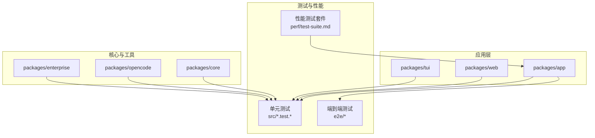
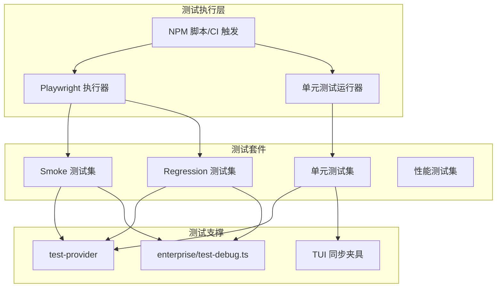
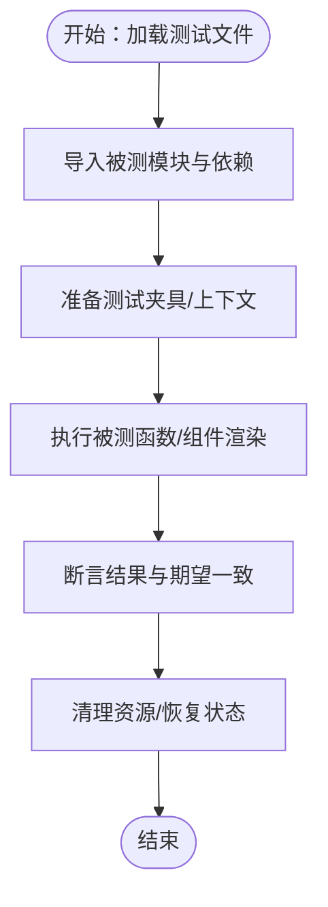
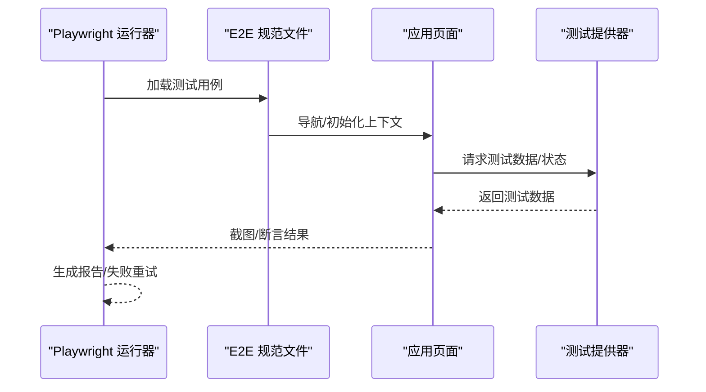
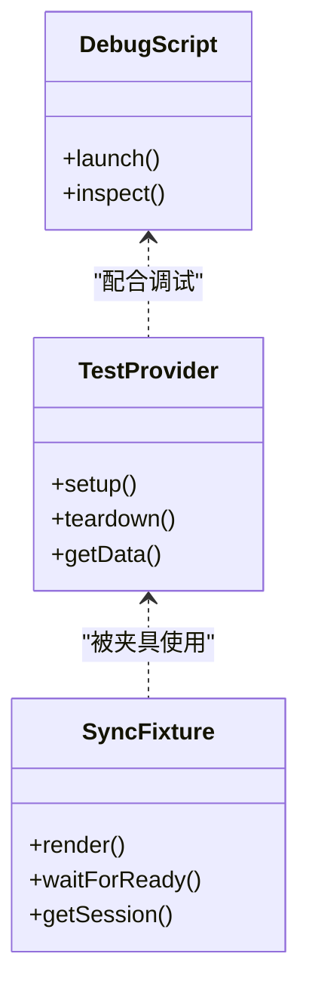
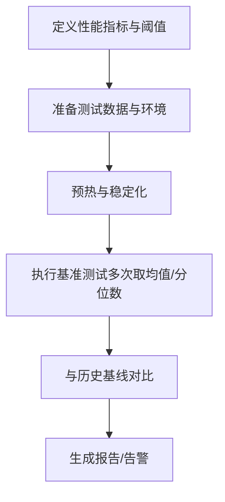
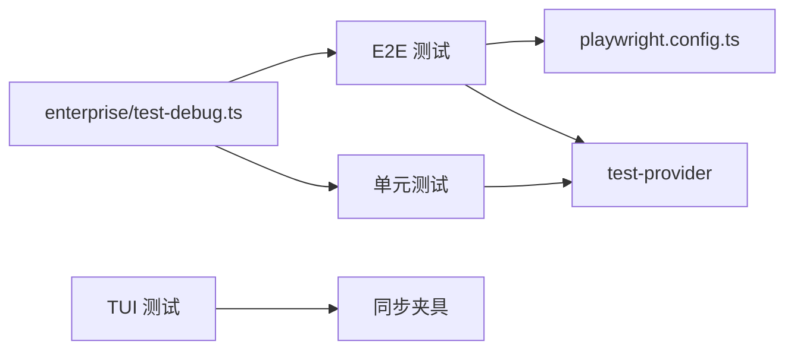

# 测试策略

<cite>
**本文引用的文件**
- [packages/app/playwright.config.ts](file://packages/app/playwright.config.ts)
- [packages/app/src/components/prompt-input/submit.test.ts](file://packages/app/src/components/prompt-input/submit.test.ts)
- [packages/app/src/context/command.test.ts](file://packages/app/src/context/command.test.ts)
- [packages/app/e2e/smoke/session-timeline.spec.ts](file://packages/app/e2e/smoke/session-timeline.spec.ts)
- [packages/app/e2e/regression/prompt-thinking-level.spec.ts](file://packages/app/e2e/regression/prompt-thinking-level.spec.ts)
- [packages/opencode/test/lib/test-provider.ts](file://packages/opencode/test/lib/test-provider.ts)
- [packages/enterprise/test-debug.ts](file://packages/enterprise/test-debug.ts)
- [packages/tui/test/cli/cmd/tui/sync-fixture.tsx](file://packages/tui/test/cli/cmd/tui/sync-fixture.tsx)
- [perf/test-suite.md](file://perf/test-suite.md)
- [packages/web/src/content/docs/th/commands.mdx](file://packages/web/src/content/docs/th/commands.mdx)
</cite>

## 目录
1. 引言
2. 项目结构
3. 核心组件
4. 架构总览
5. 详细组件分析
6. 依赖分析
7. 性能考虑
8. 故障排查指南
9. 结论
10. 附录

## 引言
本测试策略文档面向 OpenCode 项目，系统化阐述测试架构与测试分类（单元测试、集成测试、端到端测试），并结合仓库中已有的测试套件与配置，给出可落地的测试用例编写规范、异步测试处理、性能与基准测试方法、覆盖率与报告生成、测试环境配置与管理、持续集成中的测试执行流程，以及测试调试与问题定位方法。目标是确保代码质量与功能正确性得到充分保障。

## 项目结构
OpenCode 采用多包（monorepo）结构，测试分布在多个包中：
- 单元测试：位于各包的 src 目录下，以 .test.ts/.test.tsx 命名，覆盖组件、上下文、工具函数等。
- 端到端测试（E2E）：位于 packages/app/e2e 下，按 smoke 与 regression 分类组织，使用 Playwright。
- 集成测试与框架：部分包提供测试辅助库或调试脚本，如 test-provider、test-debug、TUI 同步夹具等。
- 性能测试：位于 perf/test-suite.md，定义了性能测试套件与方法。

**章节来源**
- [packages/app/playwright.config.ts](file://packages/app/playwright.config.ts)
- [packages/app/src/components/prompt-input/submit.test.ts](file://packages/app/src/components/prompt-input/submit.test.ts)
- [packages/app/e2e/smoke/session-timeline.spec.ts](file://packages/app/e2e/smoke/session-timeline.spec.ts)
- [perf/test-suite.md](file://perf/test-suite.md)

## 核心组件
- 单元测试基础设施：通过各包内以 .test.ts/.test.tsx 命名的文件组织，覆盖组件行为、上下文逻辑、工具函数等。
- 端到端测试：基于 Playwright 的 E2E 测试，按 smoke 与 regression 分类，验证关键用户路径与回归场景。
- 测试提供器与夹具：如 test-provider 提供测试运行时支持；TUI 同步夹具用于在测试中构建稳定上下文。
- 性能测试：perf/test-suite.md 定义了性能测试范围与方法，指导如何进行基准测试与回归评估。

**章节来源**
- [packages/opencode/test/lib/test-provider.ts](file://packages/opencode/test/lib/test-provider.ts)
- [packages/tui/test/cli/cmd/tui/sync-fixture.tsx](file://packages/tui/test/cli/cmd/tui/sync-fixture.tsx)
- [perf/test-suite.md](file://perf/test-suite.md)

## 架构总览
OpenCode 的测试架构围绕“单元测试 + 端到端测试 + 性能测试”三层展开，并辅以测试提供器与夹具提升稳定性与可维护性。

**图表来源**
- [packages/app/playwright.config.ts](file://packages/app/playwright.config.ts)
- [packages/opencode/test/lib/test-provider.ts](file://packages/opencode/test/lib/test-provider.ts)
- [packages/enterprise/test-debug.ts](file://packages/enterprise/test-debug.ts)
- [packages/tui/test/cli/cmd/tui/sync-fixture.tsx](file://packages/tui/test/cli/cmd/tui/sync-fixture.tsx)

## 详细组件分析

### 单元测试
- 组织方式：以 .test.ts/.test.tsx 命名，集中于各包 src 目录，便于按模块隔离与并行执行。
- 典型覆盖点：组件交互、上下文状态、输入处理、工具函数等。
- 示例参考：
  - 组件提交逻辑测试：[packages/app/src/components/prompt-input/submit.test.ts](file://packages/app/src/components/prompt-input/submit.test.ts)
  - 上下文命令测试：[packages/app/src/context/command.test.ts](file://packages/app/src/context/command.test.ts)

**章节来源**
- [packages/app/src/components/prompt-input/submit.test.ts](file://packages/app/src/components/prompt-input/submit.test.ts)
- [packages/app/src/context/command.test.ts](file://packages/app/src/context/command.test.ts)

### 端到端测试（E2E）
- 运行器：Playwright，配置位于 packages/app/playwright.config.ts。
- 分类：
  - Smoke：关键路径快速验证，如会话时间线渲染与交互。
  - Regression：回归场景，如提示思维层级、时间线折叠状态等。
- 示例参考：
  - Smoke：[packages/app/e2e/smoke/session-timeline.spec.ts](file://packages/app/e2e/smoke/session-timeline.spec.ts)
  - Regression：[packages/app/e2e/regression/prompt-thinking-level.spec.ts](file://packages/app/e2e/regression/prompt-thinking-level.spec.ts)

**图表来源**
- [packages/app/playwright.config.ts](file://packages/app/playwright.config.ts)
- [packages/app/e2e/smoke/session-timeline.spec.ts](file://packages/app/e2e/smoke/session-timeline.spec.ts)
- [packages/opencode/test/lib/test-provider.ts](file://packages/opencode/test/lib/test-provider.ts)

**章节来源**
- [packages/app/playwright.config.ts](file://packages/app/playwright.config.ts)
- [packages/app/e2e/smoke/session-timeline.spec.ts](file://packages/app/e2e/smoke/session-timeline.spec.ts)
- [packages/app/e2e/regression/prompt-thinking-level.spec.ts](file://packages/app/e2e/regression/prompt-thinking-level.spec.ts)

### 集成测试与夹具
- test-provider：为测试提供统一的运行时支持，便于跨模块复用。
- TUI 同步夹具：在 TUI 测试中构建稳定的上下文，等待同步完成后再执行断言。
- enterprise/test-debug.ts：提供调试入口，便于本地快速定位问题。

**图表来源**
- [packages/opencode/test/lib/test-provider.ts](file://packages/opencode/test/lib/test-provider.ts)
- [packages/tui/test/cli/cmd/tui/sync-fixture.tsx](file://packages/tui/test/cli/cmd/tui/sync-fixture.tsx)
- [packages/enterprise/test-debug.ts](file://packages/enterprise/test-debug.ts)

**章节来源**
- [packages/opencode/test/lib/test-provider.ts](file://packages/opencode/test/lib/test-provider.ts)
- [packages/tui/test/cli/cmd/tui/sync-fixture.tsx](file://packages/tui/test/cli/cmd/tui/sync-fixture.tsx)
- [packages/enterprise/test-debug.ts](file://packages/enterprise/test-debug.ts)

### 性能测试与基准测试
- perf/test-suite.md 定义了性能测试套件与方法，建议：
  - 明确性能指标（如启动时间、渲染耗时、内存占用）。
  - 使用稳定的数据集与环境条件，避免噪声干扰。
  - 对关键路径进行回归对比，记录基线与阈值。
  - 将性能测试纳入 CI，设置失败阈值。

**章节来源**
- [perf/test-suite.md](file://perf/test-suite.md)

## 依赖分析
- 测试耦合度：单元测试应尽量低耦合，依赖通过夹具或桩注入；E2E 依赖 Playwright 配置与测试提供器。
- 外部依赖：Playwright、测试提供器、TUI 同步夹具、企业版调试脚本。
- 潜在循环依赖：单元测试与提供器之间通过接口解耦，避免直接互相依赖。

**图表来源**
- [packages/app/playwright.config.ts](file://packages/app/playwright.config.ts)
- [packages/opencode/test/lib/test-provider.ts](file://packages/opencode/test/lib/test-provider.ts)
- [packages/tui/test/cli/cmd/tui/sync-fixture.tsx](file://packages/tui/test/cli/cmd/tui/sync-fixture.tsx)
- [packages/enterprise/test-debug.ts](file://packages/enterprise/test-debug.ts)

**章节来源**
- [packages/app/playwright.config.ts](file://packages/app/playwright.config.ts)
- [packages/opencode/test/lib/test-provider.ts](file://packages/opencode/test/lib/test-provider.ts)
- [packages/tui/test/cli/cmd/tui/sync-fixture.tsx](file://packages/tui/test/cli/cmd/tui/sync-fixture.tsx)
- [packages/enterprise/test-debug.ts](file://packages/enterprise/test-debug.ts)

## 性能考虑
- 测试执行并发：合理拆分测试套件，利用并行执行缩短总时长。
- 数据与环境稳定性：固定测试数据、禁用动画、使用无头模式，减少外部因素影响。
- 报告与可视化：生成覆盖率与性能报告，便于趋势分析与回归定位。
- CI 中的性能门禁：对关键指标设置阈值，失败即阻断发布。

[本节为通用指导，无需列出章节来源]

## 故障排查指南
- 单元测试失败：
  - 检查断言边界与异常分支，确认夹具是否正确注入。
  - 使用最小化复现，逐步缩小问题范围。
- E2E 失败：
  - 查看截图与日志，确认页面状态与交互顺序。
  - 在本地使用 enterprise/test-debug.ts 快速复现。
- 性能回归：
  - 对比基线与当前结果，定位具体步骤与数据源。
  - 固定环境变量与硬件条件，排除噪声。

**章节来源**
- [packages/enterprise/test-debug.ts](file://packages/enterprise/test-debug.ts)
- [packages/app/playwright.config.ts](file://packages/app/playwright.config.ts)

## 结论
OpenCode 的测试体系由单元测试、端到端测试与性能测试构成，配合 test-provider、TUI 同步夹具与调试脚本，形成从局部到全局、从功能到性能的完整保障。建议在现有基础上完善覆盖率与报告机制，将性能测试纳入 CI 并设置门禁，持续优化测试执行效率与稳定性。

[本节为总结性内容，无需列出章节来源]

## 附录

### 测试用例编写规范与最佳实践
- 命名规范：以 .test.ts/.test.tsx 结尾，描述性命名，聚焦单一职责。
- 断言编写：优先断言业务语义而非实现细节，使用明确的期望值与错误信息。
- 异步测试：使用 async/await 或测试运行器提供的等待机制，避免定时器依赖。
- 测试数据：使用夹具或工厂生成稳定数据，必要时使用快照或固定随机种子。
- 可重复性：确保测试可重复执行，避免共享状态污染。

### 覆盖率与报告
- 建议在 CI 中生成覆盖率报告，覆盖关键路径与边界条件。
- 对 E2E 与性能测试单独生成报告，便于专项分析。

### 测试环境配置与管理
- Playwright：通过 playwright.config.ts 配置浏览器、超时、重试等参数。
- 测试数据库与模拟服务：通过 test-provider 注入，保证隔离与一致性。
- TUI 同步夹具：在测试前等待同步完成，再进行断言。

**章节来源**
- [packages/app/playwright.config.ts](file://packages/app/playwright.config.ts)
- [packages/opencode/test/lib/test-provider.ts](file://packages/opencode/test/lib/test-provider.ts)
- [packages/tui/test/cli/cmd/tui/sync-fixture.tsx](file://packages/tui/test/cli/cmd/tui/sync-fixture.tsx)

### 持续集成中的测试执行流程
- 触发条件：PR/MR 合并请求或主干推送。
- 步骤建议：
  - 安装依赖与缓存。
  - 运行单元测试并生成覆盖率。
  - 运行 E2E 测试（按 smoke → regression 顺序）。
  - 运行性能测试并与基线对比。
  - 上传报告与工件。
- 失败策略：任一阶段失败即中断并标记。

[本节为通用指导，无需列出章节来源]

### 关键测试入口与参考
- Web 文档中关于“运行带覆盖率的测试命令”的说明，可作为测试入口参考：[packages/web/src/content/docs/th/commands.mdx](file://packages/web/src/content/docs/th/commands.mdx)

**章节来源**
- [packages/web/src/content/docs/th/commands.mdx](file://packages/web/src/content/docs/th/commands.mdx)