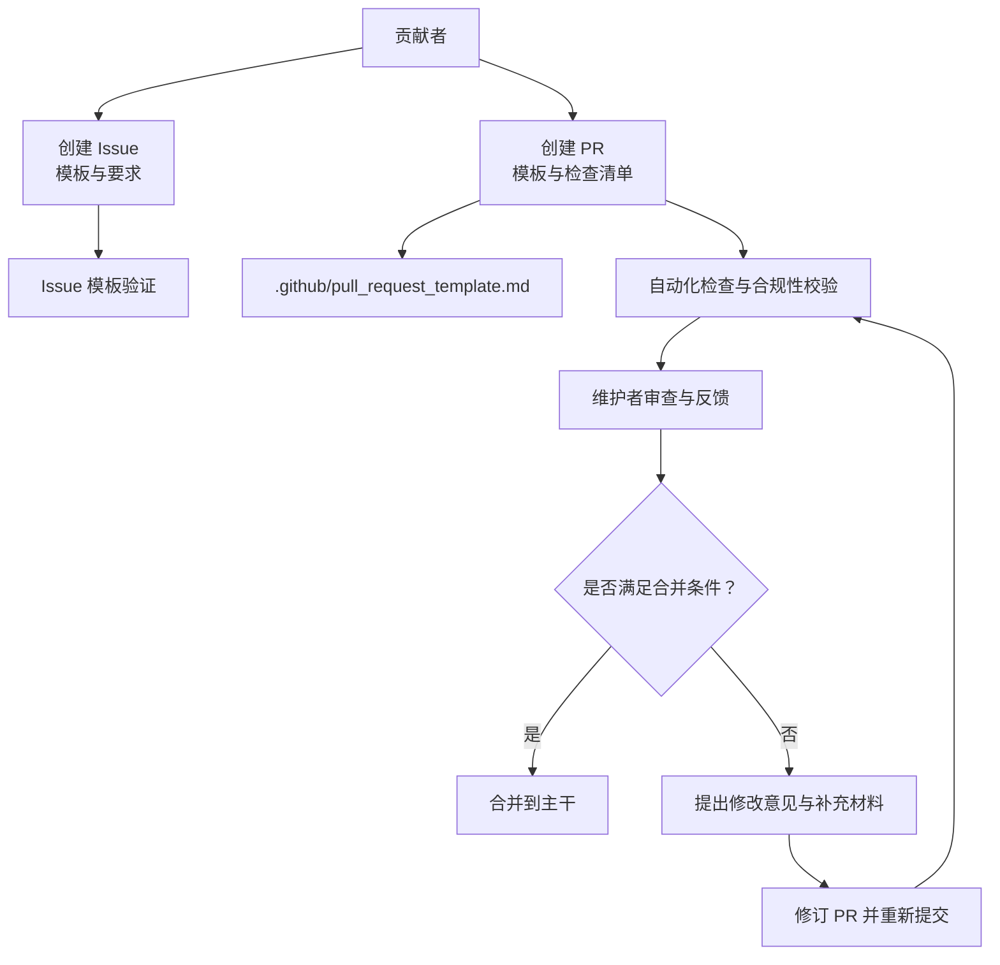
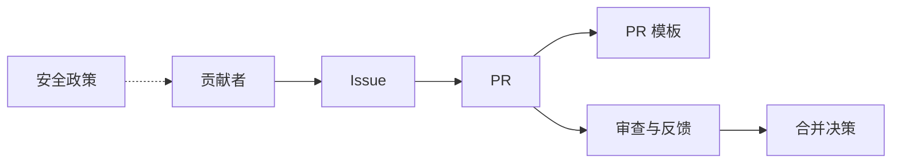

# 贡献流程

<cite>
**本文引用的文件**
- [CONTRIBUTING.md](file://CONTRIBUTING.md)
- [.github/pull_request_template.md](file://.github/pull_request_template.md)
- [SECURITY.md](file://SECURITY.md)
</cite>

## 目录
1. [简介](#简介)
2. [项目结构与入口](#项目结构与入口)
3. [核心贡献类型](#核心贡献类型)
4. [架构总览](#架构总览)
5. [详细流程解析](#详细流程解析)
6. [依赖关系分析](#依赖关系分析)
7. [性能与质量保障](#性能与质量保障)
8. [故障排查指南](#故障排查指南)
9. [结论](#结论)
10. [附录](#附录)

## 简介
本文件面向所有希望参与 OpenCode 项目的贡献者，系统化梳理从 Fork 到代码合并的完整流程，涵盖分支策略、提交规范、Pull Request 要求、Issue 创建与模板、安全报告流程、信任与担保机制、以及代码审查标准与流程。目标是帮助新贡献者快速理解并高效遵循项目的贡献规范。

## 项目结构与入口
- 贡献指南与流程：位于仓库根目录的贡献文档，定义了可接受的变更类型、开发环境、调试方法、PR 期望与模板使用要求等。
- PR 模板：位于 .github 目录下的 Pull Request 模板，用于统一 PR 的描述结构与检查清单。
- 安全政策：独立的安全文档，明确不接受 AI 自动生成的安全报告、威胁模型、服务器模式安全注意事项及报告渠道。

章节来源
- [CONTRIBUTING.md:1-300](file://CONTRIBUTING.md#L1-L300)
- [.github/pull_request_template.md:1-30](file://.github/pull_request_template.md#L1-L30)
- [SECURITY.md:1-48](file://SECURITY.md#L1-L48)

## 核心贡献类型
- 常见可被接受的变更包括但不限于：
  - Bug 修复
  - 新增 LSP 或格式化工具
  - 改进 LLM 性能
  - 新提供商支持
  - 环境特定问题修复
  - 缺失的标准行为补齐
  - 文档改进
- UI 或核心产品功能变更需先通过设计评审，获得核心团队批准后方可实现。

章节来源
- [CONTRIBUTING.md:3-13](file://CONTRIBUTING.md#L3-L13)

## 架构总览
下图展示了贡献流程的关键参与者与交互路径：贡献者、Issue/PR、模板与自动化检查、维护者与审查流程、以及最终合并与发布准备。

图表来源
- [CONTRIBUTING.md:180-300](file://CONTRIBUTING.md#L180-L300)
- [.github/pull_request_template.md:1-30](file://.github/pull_request_template.md#L1-L30)

## 详细流程解析

### 一、Fork 与本地开发准备
- 开发环境要求与安装步骤：
  - 使用 Bun 1.3+ 作为运行时
  - 在仓库根目录执行依赖安装与开发服务启动
- 运行与调试要点：
  - 开发模式与生产命令一致，便于本地等价验证
  - API 服务默认端口与自定义端口设置
  - Web 应用与桌面应用的开发与打包流程
  - 针对 TUI 与服务器断点调试的建议与注意事项
- 变更 API 或 SDK 后，需要生成 SDK 与相关文件以保持一致性。

章节来源
- [CONTRIBUTING.md:32-177](file://CONTRIBUTING.md#L32-L177)

### 二、分支策略与提交规范
- 分支命名与范围：
  - 建议围绕具体功能或修复建立独立分支，避免跨主题混杂
  - 对于多包影响的变更，尽量拆分为小而聚焦的 PR
- 提交信息与 PR 标题：
  - PR 标题遵循约定式提交规范（feat/fix/docs/chore/refactor/test）
  - 可选作用域限定（如 app、desktop、opencode），便于定位影响面
- 提交风格偏好（非强制）：
  - 函数内聚、避免不必要的解构
  - 控制流倾向无 else 结构
  - 错误处理优先 .catch 形式
  - 类型精确、避免 any
  - 变量尽量不可变、优先 const
  - 命名简洁且具描述性
  - 合理使用 Bun 工具函数

章节来源
- [CONTRIBUTING.md:178-250](file://CONTRIBUTING.md#L178-L250)

### 三、Issue 创建与模板
- 必须使用官方 Issue 模板之一：
  - Bug 报告（需提供描述）
  - 功能请求（需验证勾选项与描述）
  - 问答（需提供问题）
- 空白 Issue 不被允许；机器人会在开启时自动校验模板与内容完整性，不符合要求的 Issue 将收到提示并在 2 小时内编辑，否则会被自动关闭。
- Issue 内容禁止 AI 生成“长篇大论”，应简明扼要，尊重维护者时间。

章节来源
- [CONTRIBUTING.md:282-300](file://CONTRIBUTING.md#L282-L300)

### 四、Pull Request 提交流程与模板
- 关联现有 Issue：
  - 所有 PR 必须关联一个已存在的 Issue；在 PR 描述中使用 Fixes/Closes 语法链接
  - 小改动可用简短 Issue，但需足够让维护者理解背景
- PR 描述与模板：
  - 使用 .github/pull_request_template.md 统一结构
  - 明确变更内容、原因与验证方法
  - UI 变更需附截图或录屏
  - 非 UI 变更需说明如何复现与验证
  - 禁止 AI 生成“长篇大论”，否则可能被忽略或直接关闭
- 检查清单：
  - 本地测试通过
  - 未包含无关变更

章节来源
- [CONTRIBUTING.md:178-228](file://CONTRIBUTING.md#L178-L228)
- [.github/pull_request_template.md:1-30](file://.github/pull_request_template.md#L1-L30)

### 五、代码审查标准与流程
- 审查者分配与反馈：
  - 维护者负责审查与分配
  - 审查关注点：代码质量、潜在缺陷、改进建议
- 反馈处理与修改：
  - 针对审查意见进行针对性修改
  - 修改后重新提交并触发新一轮检查
- 合并条件：
  - 通过审查与自动化检查
  - 无阻塞性问题
  - 与 Issue 的解决目标一致

章节来源
- [CONTRIBUTING.md:178-228](file://CONTRIBUTING.md#L178-L228)

### 六、不同类型贡献的实践要点
- Bug 修复：
  - 先开 Issue 描述问题，再提交修复 PR
  - 提供最小可复现步骤与验证结果
- 功能新增：
  - 先进行设计讨论，获得核心团队认可后再实现
  - 避免直接提交功能 PR
- 文档改进：
  - 保持简洁、聚焦，避免冗长与 AI 生成文本
- UI 变更：
  - 提供前后对比截图或录屏，提升审查效率

章节来源
- [CONTRIBUTING.md:251-250](file://CONTRIBUTING.md#L251-L250)

### 七、信任与担保机制（Trust & Vouch）
- vouch 系统用于管理贡献者信任度：
  - 已担保用户：明确受信任
  - 已谴责用户：明确受限，其 Issue 与 PR 将被自动关闭
  - 其他用户：正常参与，无需担保亦可开 Issue/PR
- 维护者可通过评论管理 vouch 列表（vouch、denounce、unvouch 等）
- 被谴责的用户可联系维护者申请解除

章节来源
- [CONTRIBUTING.md:255-281](file://CONTRIBUTING.md#L255-L281)

### 八、安全报告流程
- 不接受 AI 自动生成的安全报告，此类报告将被自动封禁
- 威胁模型与服务器模式安全注意事项：
  - 项目不提供沙箱隔离，权限系统仅为 UX 提示
  - 服务器模式需设置密码以启用 HTTP Basic Auth
- 报告渠道与响应：
  - 使用 GitHub Security Advisory “Report a Vulnerability” 页面提交
  - 若超过 6 个工作日未获确认，可邮件联系安全邮箱进行升级

章节来源
- [SECURITY.md:1-48](file://SECURITY.md#L1-L48)

## 依赖关系分析
- 贡献者与 Issue/PR 的依赖：每个 PR 必须关联一个 Issue，体现“问题驱动”的原则
- PR 模板与自动化检查：.github/pull_request_template.md 作为统一入口，配合仓库自动化规则进行合规性校验
- 维护者与审查：维护者负责审查与决策，决定 PR 是否满足合并条件
- 安全政策与贡献流程：安全文档独立存在，约束安全报告的提交方式与渠道

图表来源
- [CONTRIBUTING.md:178-300](file://CONTRIBUTING.md#L178-L300)
- [.github/pull_request_template.md:1-30](file://.github/pull_request_template.md#L1-L30)
- [SECURITY.md:1-48](file://SECURITY.md#L1-L48)

章节来源
- [CONTRIBUTING.md:178-300](file://CONTRIBUTING.md#L178-L300)
- [.github/pull_request_template.md:1-30](file://.github/pull_request_template.md#L1-L30)
- [SECURITY.md:1-48](file://SECURITY.md#L1-L48)

## 性能与质量保障
- 小步快跑：PR 保持小而聚焦，降低审查成本与回归风险
- 自动化检查：利用模板与规则确保 PR 结构与内容符合要求
- 明确验证：非 UI 变更需提供可复现与可验证的方法；UI 变更需附截图/录屏
- 风险控制：UI 或核心功能变更前必须完成设计评审

章节来源
- [CONTRIBUTING.md:178-228](file://CONTRIBUTING.md#L178-L228)

## 故障排查指南
- PR 被拒或被自动关闭：
  - 检查是否关联了现有 Issue
  - 按模板填写 PR 描述，避免 AI 生成“长篇大论”
  - UI 变更未附截图/录屏
- Issue 被自动关闭：
  - 未使用模板或字段缺失/占位
  - 内容为空或无意义
  - 超过 2 小时未按要求修改
- 安全报告被拒绝：
  - 请勿提交 AI 自动生成的内容
  - 使用 GitHub Security Advisory 正确渠道提交

章节来源
- [CONTRIBUTING.md:180-300](file://CONTRIBUTING.md#L180-L300)
- [SECURITY.md:1-48](file://SECURITY.md#L1-L48)

## 结论
本贡献流程以“问题驱动、模板标准化、审查与自动化结合、安全优先”为核心原则，既保证高质量交付，也降低协作成本。建议新贡献者在提交任何变更前，先阅读并理解上述流程与模板要求，确保一次通过审查与合并。

## 附录
- 常用链接与标签参考：
  - help wanted、good first issue、bug、perf 等标签用于筛选适合入门与优先处理的问题
- 术语说明：
  - vouch：担保机制，用于管理贡献者信任度
  - convention commit：约定式提交规范，统一 PR 标题风格

章节来源
- [CONTRIBUTING.md:15-25](file://CONTRIBUTING.md#L15-L25)
- [CONTRIBUTING.md:255-281](file://CONTRIBUTING.md#L255-L281)