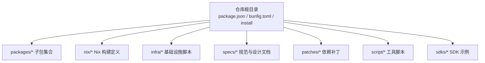
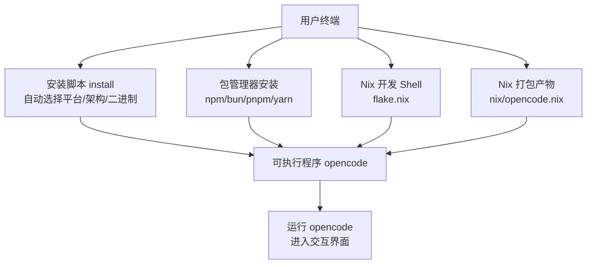
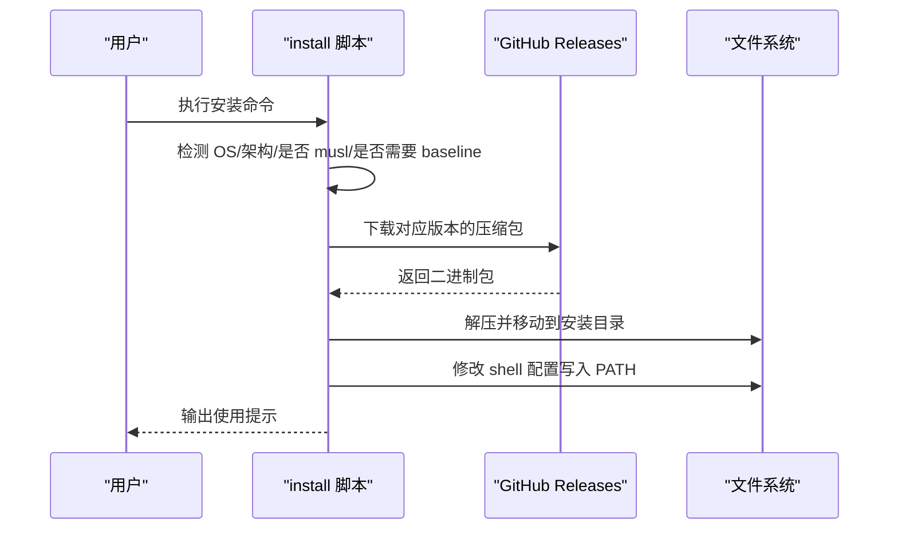
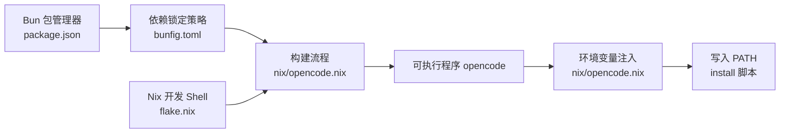

# 快速开始

<cite>
**本文引用的文件**
- [README.md](file://README.md)
- [package.json](file://package.json)
- [bunfig.toml](file://bunfig.toml)
- [install](file://install)
- [flake.nix](file://flake.nix)
- [nix/opencode.nix](file://nix/opencode.nix)
- [nix/desktop.nix](file://nix/desktop.nix)
</cite>

## 目录
1. [简介](#简介)
2. [项目结构](#项目结构)
3. [核心组件](#核心组件)
4. [架构总览](#架构总览)
5. [详细组件分析](#详细组件分析)
6. [依赖关系分析](#依赖关系分析)
7. [性能考虑](#性能考虑)
8. [故障排除指南](#故障排除指南)
9. [结论](#结论)
10. [附录](#附录)

## 简介
本指南面向首次接触 OpenCode 的用户，帮助你在约 15 分钟内完成从零到运行的安装与基础配置，并体验第一个 AI 代码生成示例。文档覆盖以下内容：
- 系统环境要求（Node.js、Bun、Nix 等）
- 多种安装方式（包管理器、源码构建、Docker/Nix）
- 开发环境搭建（依赖安装、环境变量、本地数据库初始化）
- 第一个 AI 代码生成示例
- 常见安装问题排查与验证方法

## 项目结构
OpenCode 是一个多包工作区项目，采用 Bun 作为包管理器与运行时，使用 Turbo 进行类型检查与任务编排。根目录包含安装脚本、Nix 打包定义以及各子包（如 CLI、Web 控制台、桌面应用等）。

图表来源
- [package.json:1-156](file://package.json#L1-L156)
- [bunfig.toml:1-9](file://bunfig.toml#L1-L9)
- [install:1-461](file://install#L1-L461)

章节来源
- [package.json:1-156](file://package.json#L1-L156)
- [bunfig.toml:1-9](file://bunfig.toml#L1-L9)
- [install:1-461](file://install#L1-L461)

## 核心组件
- 包管理与运行时：Bun（在 package.json 中声明为包管理器），用于安装依赖、执行脚本与本地开发。
- 安装脚本：install 脚本支持自动检测平台与架构、下载二进制、写入 PATH 并输出使用提示。
- Nix 支持：flake.nix 提供开发 Shell 与打包产物；nix/opencode.nix 与 nix/desktop.nix 定义了可复现构建与分发。
- 文档与示例：README.md 提供安装与使用指引；桌面应用与控制台分别提供图形化入口。

章节来源
- [package.json:7-23](file://package.json#L7-L23)
- [install:68-98](file://install#L68-L98)
- [flake.nix:21-31](file://flake.nix#L21-L31)
- [nix/opencode.nix:16-73](file://nix/opencode.nix#L16-L73)
- [nix/desktop.nix:16-99](file://nix/desktop.nix#L16-L99)

## 架构总览
下图展示了从安装到运行的关键路径：用户通过包管理器或安装脚本获得可执行程序，随后在项目中启动 OpenCode 交互界面；Nix 可用于在受控环境中构建与运行。

图表来源
- [install:103-110](file://install#L103-L110)
- [install:183-204](file://install#L183-L204)
- [package.json:5-7](file://package.json#L5-L7)
- [flake.nix:21-31](file://flake.nix#L21-L31)
- [nix/opencode.nix:16-73](file://nix/opencode.nix#L16-L73)

## 详细组件分析

### 环境要求与工具链
- Bun：作为包管理器与运行时，版本在根 package.json 中声明；建议使用与声明版本一致或兼容的版本以避免锁版本差异导致的问题。
- Node.js：Nix 开发 Shell 默认包含 nodejs_20，便于在 Nix 环境中进行开发与调试。
- Nix：flake.nix 提供多平台开发 Shell，包含 bun、nodejs、pkg-config、openssl、git 等常用工具。
- 其他：根据平台可能需要 tar（Linux）或 unzip（Windows/macOS）解压二进制包。

章节来源
- [package.json:7](file://package.json#L7)
- [flake.nix:22-29](file://flake.nix#L22-L29)
- [install:171-181](file://install#L171-L181)

### 多种安装方式

#### 1) 包管理器安装
- npm / pnpm / yarn / bun：推荐使用全局安装对应包名，以获得最新稳定版。
- Windows：可使用 Scoop 或 Chocolatey 安装。
- macOS/Linux：Homebrew 公式提供官方与社区维护版本。
- Arch Linux：可使用 pacman 安装稳定版，或使用 AUR 获取最新二进制包。
- mise：跨工具链版本管理器，适合多语言/多工具链场景。

章节来源
- [README.md:52-61](file://README.md#L52-L61)

#### 2) 源码安装与本地构建
- 使用 Nix：通过 flake.nix 提供的开发 Shell 进入受控环境；nix/opencode.nix 定义了构建流程，包括复制 node_modules、生成单文件二进制与 schema 文件、包装可执行程序等。
- 使用 Bun：根 package.json 提供多个开发脚本，可在本地运行 Web 控制台、桌面应用等。

章节来源
- [flake.nix:21-31](file://flake.nix#L21-L31)
- [nix/opencode.nix:30-53](file://nix/opencode.nix#L30-L53)
- [package.json:8-14](file://package.json#L8-L14)

#### 3) Docker 容器部署
- 仓库未提供官方 Dockerfile 或 docker-compose 配置。若需容器化部署，可基于 Nix 打包产物或 Bun 运行时镜像自行封装，或参考 Nix 打包逻辑在容器中复现构建流程。

章节来源
- [nix/opencode.nix:16-73](file://nix/opencode.nix#L16-L73)

### 开发环境搭建
- 依赖安装：使用 Bun 作为包管理器安装工作区依赖；Bun 锁定策略由 bunfig.toml 控制，启用精确安装与最小发布年龄策略以提升稳定性。
- 环境变量：Nix 打包产物会注入版本与模型相关环境变量；安装脚本会在 PATH 中添加安装目录。
- 本地数据库：OpenCode 使用 SQLite（通过 Drizzle ORM）。首次运行时会初始化本地数据库与模式；如需自定义路径，可在运行前设置相应环境变量（具体键名请参考运行时日志与配置项）。

章节来源
- [bunfig.toml:1-5](file://bunfig.toml#L1-L5)
- [nix/opencode.nix:40-43](file://nix/opencode.nix#L40-L43)
- [install:378-439](file://install#L378-L439)

### 第一个 AI 代码生成示例
- 在任意项目目录中运行可执行程序，进入交互界面后，输入自然语言描述你的需求，即可触发 AI 代码生成流程。
- 若需要切换代理角色，可使用 Tab 键在内置代理之间切换（例如默认的 build 代理与只读的 plan 代理）。
- 如需复杂搜索或多步任务，可使用 general 子代理（在消息中以特定语法调用）。

章节来源
- [README.md:100-113](file://README.md#L100-L113)
- [README.md:46-62](file://README.md#L46-L62)

### 安装脚本工作流
下图展示安装脚本如何根据平台与架构选择合适的二进制包并写入 PATH：

图表来源
- [install:79-110](file://install#L79-L110)
- [install:183-204](file://install#L183-L204)
- [install:327-346](file://install#L327-L346)
- [install:362-439](file://install#L362-L439)

## 依赖关系分析
- 包管理器与版本锁定：根 package.json 声明 Bun 版本为包管理器；bunfig.toml 启用精确安装与最小发布年龄策略，减少不稳定依赖对构建的影响。
- Nix 构建链路：flake.nix 提供开发 Shell；nix/opencode.nix 将 node_modules 复制到构建环境、生成单文件二进制与 schema、包装可执行程序并注入必要环境变量；nix/desktop.nix 则在该基础上构建桌面应用。
- 运行时与工具：Nix 打包产物会注入 PATH，确保运行时工具（如 ripgrep、sysctl）可用；安装脚本也会尝试将安装目录加入 PATH。

图表来源
- [package.json:7](file://package.json#L7)
- [bunfig.toml:1-5](file://bunfig.toml#L1-L5)
- [nix/opencode.nix:40-70](file://nix/opencode.nix#L40-L70)
- [install:378-439](file://install#L378-L439)

章节来源
- [package.json:7-23](file://package.json#L7-L23)
- [bunfig.toml:1-5](file://bunfig.toml#L1-L5)
- [flake.nix:21-31](file://flake.nix#L21-L31)
- [nix/opencode.nix:16-73](file://nix/opencode.nix#L16-L73)
- [install:378-439](file://install#L378-L439)

## 性能考虑
- 使用 Bun 作为包管理器与运行时，通常具有更快的安装与启动速度。
- Nix 打包产物会预构建单文件二进制，减少运行时依赖解析时间。
- 在 Linux 上，若 CPU 不支持 AVX2，安装脚本会自动选择 baseline 版本以保证兼容性。
- 对于大型项目，建议在本地磁盘上使用 SQLite 数据库，并确保有足够的磁盘空间与权限。

## 故障排除指南
- 安装脚本无法识别平台/架构
  - 确认操作系统与 CPU 架构组合是否受支持；脚本会针对 Linux/macOS/Windows 与 x64/arm64 进行匹配。
  - 参考：[install:103-110](file://install#L103-L110)
- 下载失败或版本不存在
  - 检查网络连通性与 GitHub Releases 是否存在目标版本；脚本会校验版本并输出可用发布列表。
  - 参考：[install:183-204](file://install#L183-L204)
- tar/unzip 缺失
  - 在 Linux 上需要 tar，在其他平台上需要 unzip；脚本会提前检测并报错。
  - 参考：[install:171-181](file://install#L171-L181)
- PATH 未更新
  - 安装脚本会尝试修改 shell 配置文件；若未生效，请手动将安装目录追加到 PATH。
  - 参考：[install:378-439](file://install#L378-L439)
- Nix 构建失败
  - 确保已安装 Nix 并启用 flakes；按需使用 nix develop 进入开发 Shell。
  - 参考：[flake.nix:21-31](file://flake.nix#L21-L31)
- 模型或版本相关错误
  - Nix 打包会注入版本与模型相关环境变量；如遇模型加载问题，请检查环境变量是否正确注入。
  - 参考：[nix/opencode.nix:40-43](file://nix/opencode.nix#L40-L43)

章节来源
- [install:103-110](file://install#L103-L110)
- [install:171-181](file://install#L171-L181)
- [install:183-204](file://install#L183-L204)
- [install:378-439](file://install#L378-L439)
- [flake.nix:21-31](file://flake.nix#L21-L31)
- [nix/opencode.nix:40-43](file://nix/opencode.nix#L40-L43)

## 结论
通过本指南，你可以在 15 分钟内完成 OpenCode 的安装与基础配置，并体验第一个 AI 代码生成示例。建议优先使用包管理器或安装脚本获得稳定版本，若需要更严格的可复现性，可使用 Nix 开发与打包流程。遇到问题时，可依据“故障排除指南”逐步定位并解决。

## 附录

### 验证安装成功
- 运行版本查询命令，确认输出的版本与期望一致。
- 在任意项目目录中运行可执行程序，观察是否进入交互界面。
- 查看 PATH 是否包含安装目录，确保命令可直接调用。

章节来源
- [install:221-235](file://install#L221-L235)
- [install:453-458](file://install#L453-L458)