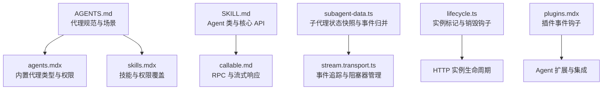
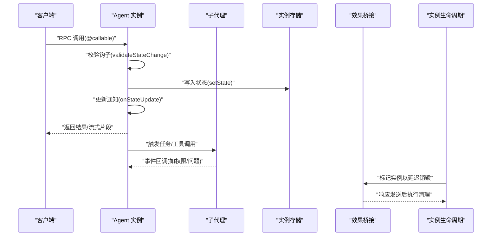
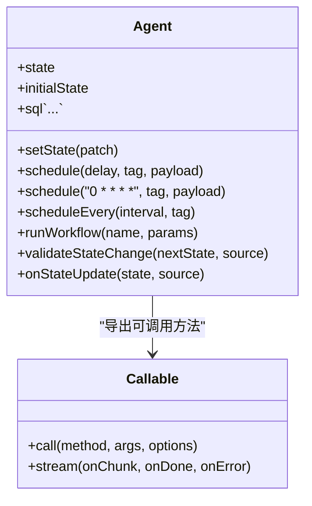
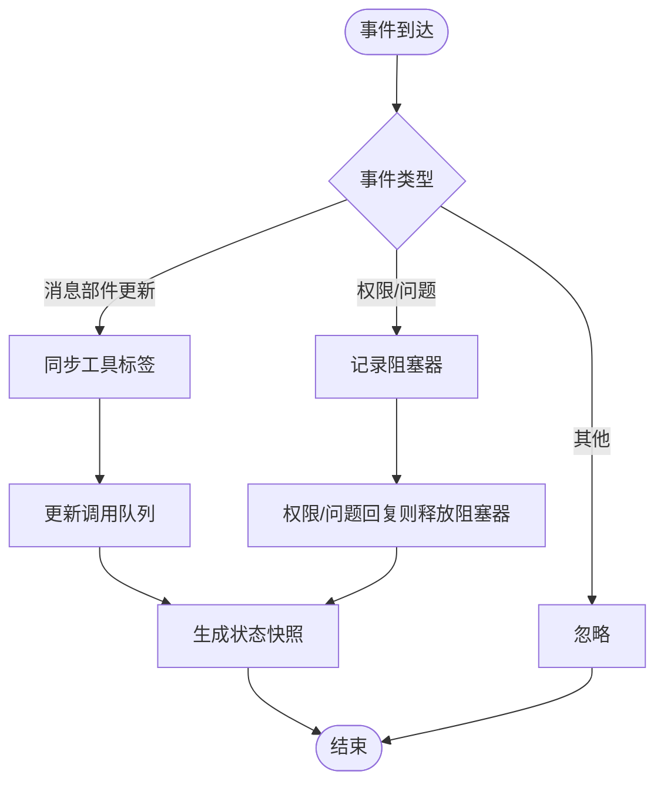
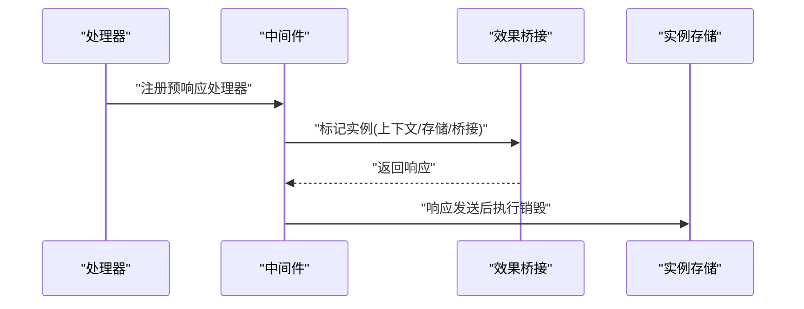
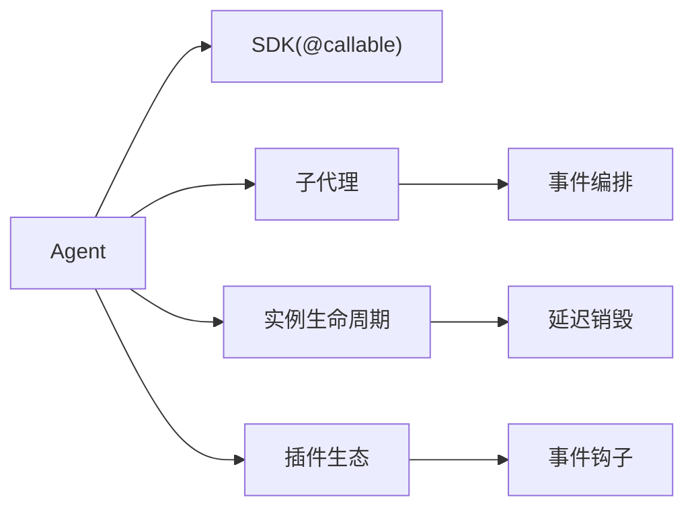

# Agent 插件开发

<cite>
**本文引用的文件**
- [AGENTS.md](file://AGENTS.md)
- [CONTEXT.md](file://CONTEXT.md)
- [packages/web/src/content/docs/zh-cn/agents.mdx](file://packages/web/src/content/docs/zh-cn/agents.mdx)
- [packages/web/src/content/docs/zh-cn/skills.mdx](file://packages/web/src/content/docs/zh-cn/skills.mdx)
- [packages/opencode/test/fixture/skills/agents-sdk/SKILL.md](file://packages/opencode/test/fixture/skills/agents-sdk/SKILL.md)
- [packages/opencode/test/fixture/skills/agents-sdk/references/callable.md](file://packages/opencode/test/fixture/skills/agents-sdk/references/callable.md)
- [packages/opencode/src/cli/cmd/run/subagent-data.ts](file://packages/opencode/src/cli/cmd/run/subagent-data.ts)
- [packages/opencode/src/cli/cmd/run/stream.transport.ts](file://packages/opencode/src/cli/cmd/run/stream.transport.ts)
- [packages/opencode/src/server/routes/instance/httpapi/lifecycle.ts](file://packages/opencode/src/server/routes/instance/httpapi/lifecycle.ts)
- [packages/web/src/content/docs/zh-cn/plugins.mdx](file://packages/web/src/content/docs/zh-cn/plugins.mdx)
</cite>

## 目录
1. [引言](#引言)
2. [项目结构](#项目结构)
3. [核心组件](#核心组件)
4. [架构总览](#架构总览)
5. [详细组件分析](#详细组件分析)
6. [依赖关系分析](#依赖关系分析)
7. [性能考虑](#性能考虑)
8. [故障排查指南](#故障排查指南)
9. [结论](#结论)
10. [附录](#附录)

## 引言
本指南面向希望在 OpenCode 生态中开发 Agent 插件的工程师与产品人员。文档系统性阐述 Agent 的概念、能力边界、生命周期钩子、状态管理、RPC 调用与流式响应、以及与子代理（Subagent）协作的工作流。同时给出从接口定义、核心逻辑实现到运行时管理的全流程实践，并提供可复用的开发范式与测试调试建议。

## 项目结构
OpenCode 将 Agent 作为“可路由、可实例化、可扩展”的智能体单元，围绕以下关键路径组织：
- 文档与规范：AGENTS.md、CONTEXT.md、各语言文档中的 agents.mdx、skills.mdx
- SDK 示例与参考：agents-sdk 测试夹具中的 SKILL.md 与 callable.md
- 运行时与生命周期：CLI 子命令中的子代理数据与事件编排、HTTP 实例生命周期管理
- 插件生态：plugins.mdx 展示插件体系与事件钩子，为 Agent 扩展提供生态支撑

**图表来源**
- [AGENTS.md](file://AGENTS.md)
- [packages/web/src/content/docs/zh-cn/agents.mdx](file://packages/web/src/content/docs/zh-cn/agents.mdx)
- [packages/web/src/content/docs/zh-cn/skills.mdx](file://packages/web/src/content/docs/zh-cn/skills.mdx)
- [packages/opencode/test/fixture/skills/agents-sdk/SKILL.md](file://packages/opencode/test/fixture/skills/agents-sdk/SKILL.md)
- [packages/opencode/test/fixture/skills/agents-sdk/references/callable.md](file://packages/opencode/test/fixture/skills/agents-sdk/references/callable.md)
- [packages/opencode/src/cli/cmd/run/subagent-data.ts](file://packages/opencode/src/cli/cmd/run/subagent-data.ts)
- [packages/opencode/src/cli/cmd/run/stream.transport.ts](file://packages/opencode/src/cli/cmd/run/stream.transport.ts)
- [packages/opencode/src/server/routes/instance/httpapi/lifecycle.ts](file://packages/opencode/src/server/routes/instance/httpapi/lifecycle.ts)
- [packages/web/src/content/docs/zh-cn/plugins.mdx](file://packages/web/src/content/docs/zh-cn/plugins.mdx)

**章节来源**
- [AGENTS.md](file://AGENTS.md)
- [CONTEXT.md](file://CONTEXT.md)
- [packages/web/src/content/docs/zh-cn/agents.mdx](file://packages/web/src/content/docs/zh-cn/agents.mdx)
- [packages/web/src/content/docs/zh-cn/skills.mdx](file://packages/web/src/content/docs/zh-cn/skills.mdx)
- [packages/opencode/test/fixture/skills/agents-sdk/SKILL.md](file://packages/opencode/test/fixture/skills/agents-sdk/SKILL.md)
- [packages/opencode/test/fixture/skills/agents-sdk/references/callable.md](file://packages/opencode/test/fixture/skills/agents-sdk/references/callable.md)
- [packages/opencode/src/cli/cmd/run/subagent-data.ts](file://packages/opencode/src/cli/cmd/run/subagent-data.ts)
- [packages/opencode/src/cli/cmd/run/stream.transport.ts](file://packages/opencode/src/cli/cmd/run/stream.transport.ts)
- [packages/opencode/src/server/routes/instance/httpapi/lifecycle.ts](file://packages/opencode/src/server/routes/instance/httpapi/lifecycle.ts)
- [packages/web/src/content/docs/zh-cn/plugins.mdx](file://packages/web/src/content/docs/zh-cn/plugins.mdx)

## 核心组件
- 代理（Agent）
  - 可路由、可实例化的智能体，支持状态持久化、校验钩子、更新通知钩子、RPC 方法导出与流式响应。
  - 支持定时调度（延时、Cron、周期）、工作流启动、SQL 查询等核心能力。
- 子代理（Subagent）
  - 主代理的协作者，负责具体任务域；通过事件驱动的状态快照与队列管理实现与主代理的协同。
- 生命周期与实例管理
  - 通过 HTTP 实例生命周期钩子标记与延迟销毁，确保响应发送后再执行清理。
- 技能与权限
  - 基于 YAML frontmatter 或 opencode.json 对代理授予技能权限，支持按代理覆盖与禁用。

**章节来源**
- [packages/opencode/test/fixture/skills/agents-sdk/SKILL.md](file://packages/opencode/test/fixture/skills/agents-sdk/SKILL.md)
- [packages/web/src/content/docs/zh-cn/agents.mdx](file://packages/web/src/content/docs/zh-cn/agents.mdx)
- [packages/web/src/content/docs/zh-cn/skills.mdx](file://packages/web/src/content/docs/zh-cn/skills.mdx)
- [packages/opencode/src/server/routes/instance/httpapi/lifecycle.ts](file://packages/opencode/src/server/routes/instance/httpapi/lifecycle.ts)

## 架构总览
下图展示了从客户端发起 RPC 调用，到 Agent 处理、状态变更、事件传播，再到子代理协同与实例生命周期管理的整体流程。

**图表来源**
- [packages/opencode/test/fixture/skills/agents-sdk/SKILL.md](file://packages/opencode/test/fixture/skills/agents-sdk/SKILL.md)
- [packages/opencode/src/cli/cmd/run/subagent-data.ts](file://packages/opencode/src/cli/cmd/run/subagent-data.ts)
- [packages/opencode/src/cli/cmd/run/stream.transport.ts](file://packages/opencode/src/cli/cmd/run/stream.transport.ts)
- [packages/opencode/src/server/routes/instance/httpapi/lifecycle.ts](file://packages/opencode/src/server/routes/instance/httpapi/lifecycle.ts)

## 详细组件分析

### Agent 类与生命周期钩子
- 状态读写
  - 读取当前状态与写入新状态，配合 SQL 查询与调度能力完成任务编排。
- 钩子机制
  - 校验钩子：在状态持久化前同步执行，抛错可拒绝变更。
  - 更新通知钩子：状态持久化后异步执行，非阻塞。
- RPC 与流式响应
  - 使用装饰器导出方法，支持超时控制与流式分片传输。
- 工作流与调度
  - 支持延时、Cron 与周期性调度，以及工作流启动。

**图表来源**
- [packages/opencode/test/fixture/skills/agents-sdk/SKILL.md](file://packages/opencode/test/fixture/skills/agents-sdk/SKILL.md)
- [packages/opencode/test/fixture/skills/agents-sdk/references/callable.md](file://packages/opencode/test/fixture/skills/agents-sdk/references/callable.md)

**章节来源**
- [packages/opencode/test/fixture/skills/agents-sdk/SKILL.md](file://packages/opencode/test/fixture/skills/agents-sdk/SKILL.md)
- [packages/opencode/test/fixture/skills/agents-sdk/references/callable.md](file://packages/opencode/test/fixture/skills/agents-sdk/references/callable.md)

### 子代理数据与事件编排
- 会话与任务标签同步
  - 基于工具输出部分与消息部件，维护任务标签与调用队列，支持增量更新与帧合并。
- 阻塞器与权限/问题跟踪
  - 记录权限请求与问题询问的阻塞状态，统一释放与恢复。
- 选择性快照
  - 支持对选中会话进行状态快照，便于 UI 与 CLI 展示。

**图表来源**
- [packages/opencode/src/cli/cmd/run/subagent-data.ts](file://packages/opencode/src/cli/cmd/run/subagent-data.ts)
- [packages/opencode/src/cli/cmd/run/stream.transport.ts](file://packages/opencode/src/cli/cmd/run/stream.transport.ts)

**章节来源**
- [packages/opencode/src/cli/cmd/run/subagent-data.ts](file://packages/opencode/src/cli/cmd/run/subagent-data.ts)
- [packages/opencode/src/cli/cmd/run/stream.transport.ts](file://packages/opencode/src/cli/cmd/run/stream.transport.ts)

### 实例生命周期与销毁策略
- 标记与延迟销毁
  - 在响应生成后，通过弱映射保留上下文与存储，确保清理在响应之后执行。
- 重载标记
  - 与重载流程配合，保证实例切换时的资源有序回收。

**图表来源**
- [packages/opencode/src/server/routes/instance/httpapi/lifecycle.ts](file://packages/opencode/src/server/routes/instance/httpapi/lifecycle.ts)

**章节来源**
- [packages/opencode/src/server/routes/instance/httpapi/lifecycle.ts](file://packages/opencode/src/server/routes/instance/httpapi/lifecycle.ts)

### 技能与权限体系
- 全局与按代理覆盖
  - 通过 YAML frontmatter 或 opencode.json 为代理授予技能权限，支持按代理覆盖与禁用。
- 权限隐藏规则
  - 设为 deny 的技能将对代理隐藏，避免误用。

**章节来源**
- [packages/web/src/content/docs/zh-cn/skills.mdx](file://packages/web/src/content/docs/zh-cn/skills.mdx)

### 插件生态与事件钩子
- 插件入口
  - 插件以函数形式导出，接收项目、客户端、工具集与工作树等上下文。
- 事件订阅
  - 支持命令、文件、安装、LSP、消息、权限、服务器、会话、Todo、Shell、工具执行等事件钩子。
- 加载顺序
  - 全局设置 → 项目设置 → 全局插件目录 → 项目插件目录，重复包去重但本地与 npm 包可共存。

**章节来源**
- [packages/web/src/content/docs/zh-cn/plugins.mdx](file://packages/web/src/content/docs/zh-cn/plugins.mdx)

## 依赖关系分析
- Agent 与 SDK
  - Agent 通过装饰器导出 RPC 方法，客户端通过 WebSocket RPC 调用。
- Agent 与子代理
  - 通过事件与状态快照实现解耦协作，子代理负责具体任务域。
- Agent 与实例生命周期
  - 生命周期钩子确保资源在响应完成后释放，避免竞态。
- Agent 与插件生态
  - 插件通过事件钩子扩展 Agent 的行为边界，形成可观测与可扩展的运行时。

**图表来源**
- [packages/opencode/test/fixture/skills/agents-sdk/references/callable.md](file://packages/opencode/test/fixture/skills/agents-sdk/references/callable.md)
- [packages/opencode/src/cli/cmd/run/subagent-data.ts](file://packages/opencode/src/cli/cmd/run/subagent-data.ts)
- [packages/opencode/src/server/routes/instance/httpapi/lifecycle.ts](file://packages/opencode/src/server/routes/instance/httpapi/lifecycle.ts)
- [packages/web/src/content/docs/zh-cn/plugins.mdx](file://packages/web/src/content/docs/zh-cn/plugins.mdx)

## 性能考虑
- 状态变更批量化
  - 通过帧合并与增量更新减少不必要的持久化与通知。
- 事件过滤与选择性快照
  - 仅对相关会话与任务进行快照，降低 UI/CLI 渲染压力。
- 调度与流式传输
  - 使用延时/Cron/周期调度与流式响应，避免长时间阻塞。
- 生命周期延迟销毁
  - 在响应发送后再执行清理，避免影响首字节时间。

[本节为通用建议，无需列出章节来源]

## 故障排查指南
- 技能加载问题
  - 检查文件名大小写、frontmatter 字段完整性、名称唯一性与权限设置。
- 插件问题定位
  - 临时移除全局/项目插件目录中的插件，重启应用确认是否恢复；若恢复，逐个启用定位问题插件。
- 缓存清理
  - 完全关闭应用后删除缓存目录，重新启动以重建缓存。
- 服务器连接问题
  - 参考插件文档中的网络与连接排查步骤。

**章节来源**
- [packages/web/src/content/docs/zh-cn/skills.mdx](file://packages/web/src/content/docs/zh-cn/skills.mdx)
- [packages/web/src/content/docs/zh-cn/plugins.mdx](file://packages/web/src/content/docs/zh-cn/plugins.mdx)

## 结论
Agent 插件在 OpenCode 中以“可路由、可实例化、可扩展”为核心设计，结合生命周期钩子、状态管理、RPC 与流式响应、子代理协作与插件生态，形成完整的自动化代理任务实现方案。遵循本文的开发流程与最佳实践，可快速构建稳定、可观测、可扩展的智能代理与任务调度器类插件。

[本节为总结，无需列出章节来源]

## 附录
- 开发流程概览
  - 接口定义：使用装饰器导出 RPC 方法，声明初始状态与钩子。
  - 核心逻辑：利用状态读写、SQL 查询、调度与工作流启动完成任务编排。
  - 运行时管理：通过生命周期钩子与事件编排实现资源与状态的有序管理。
- 示例参考
  - Agent 类与核心 API：参见 [SKILL.md](file://packages/opencode/test/fixture/skills/agents-sdk/SKILL.md)
  - RPC 与流式响应：参见 [callable.md](file://packages/opencode/test/fixture/skills/agents-sdk/references/callable.md)
- 应用场景
  - 自动化代理：基于权限与技能的自动执行。
  - 任务调度器：基于延时/Cron/周期的任务编排。
  - 协同代理：与子代理通过事件与状态快照协作完成复杂流程。

**章节来源**
- [packages/opencode/test/fixture/skills/agents-sdk/SKILL.md](file://packages/opencode/test/fixture/skills/agents-sdk/SKILL.md)
- [packages/opencode/test/fixture/skills/agents-sdk/references/callable.md](file://packages/opencode/test/fixture/skills/agents-sdk/references/callable.md)