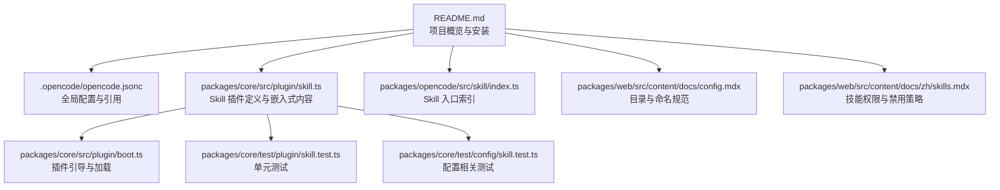
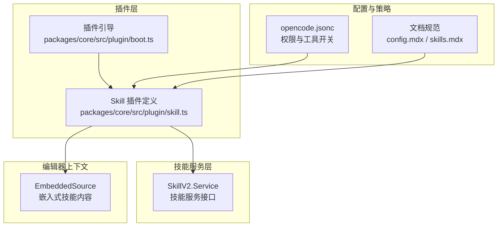
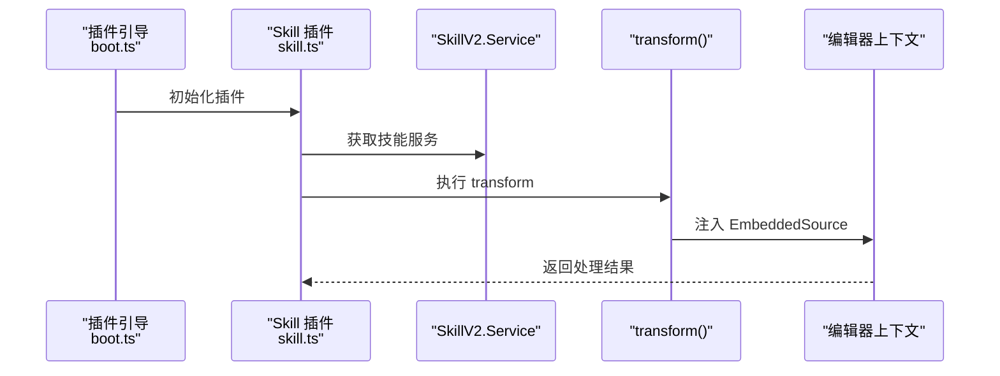
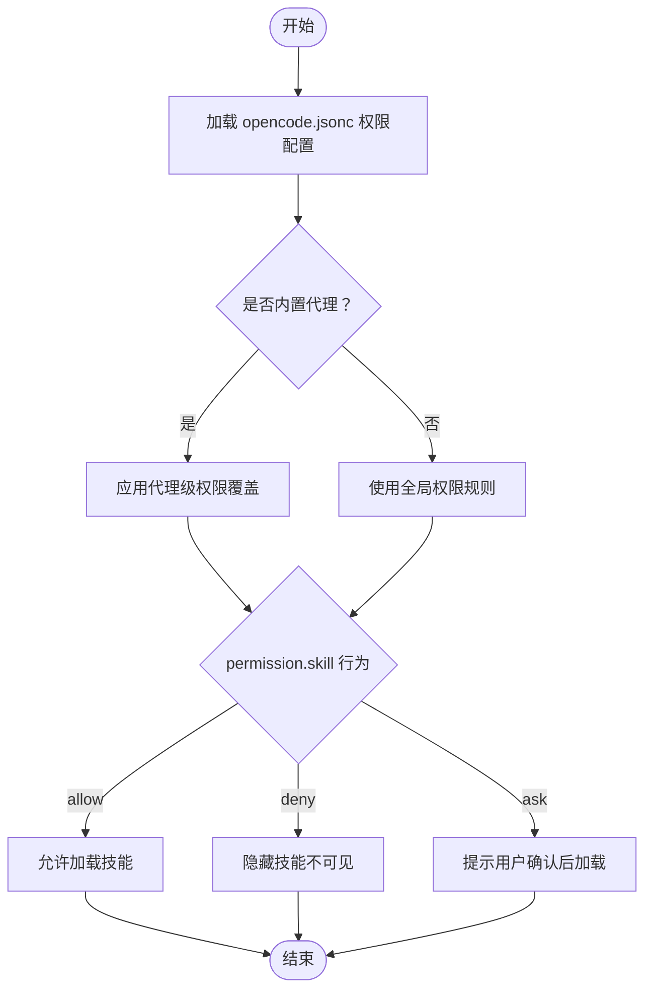
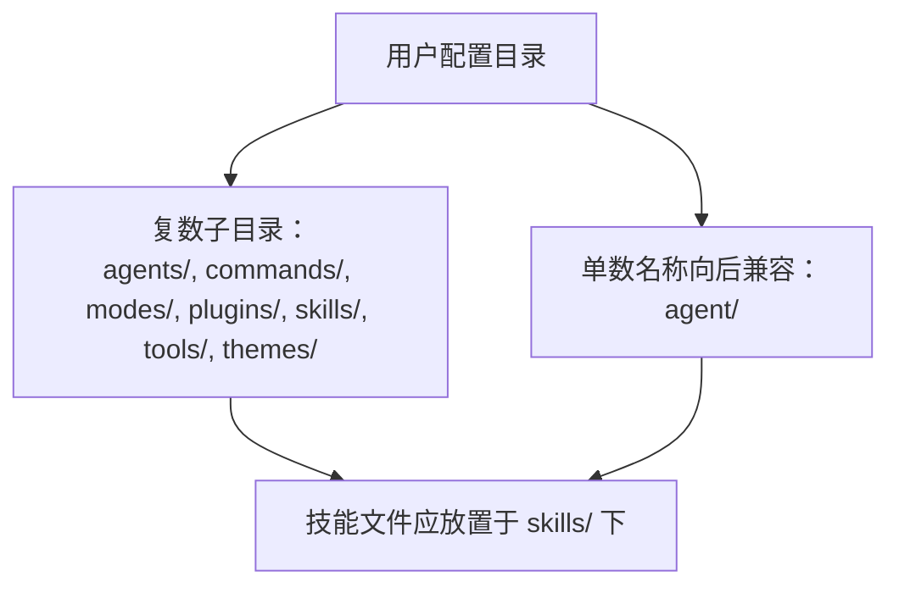
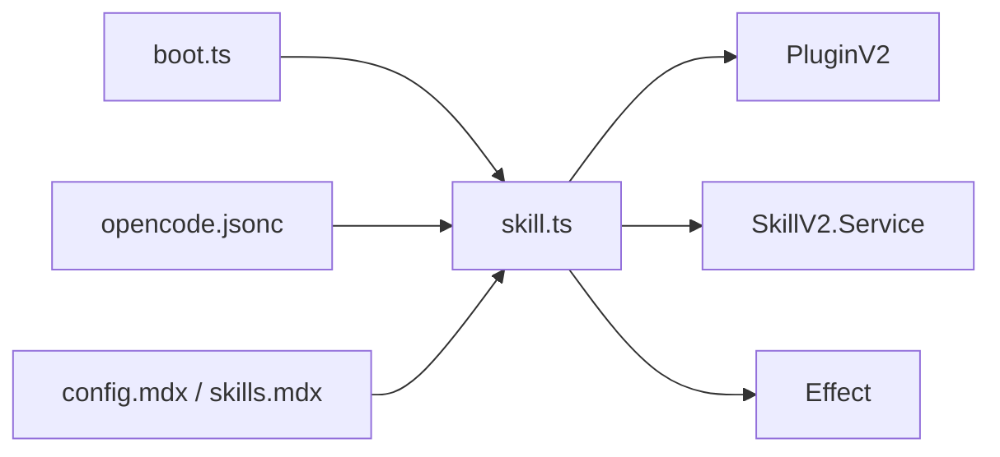

# Skill 插件开发

<cite>
**本文引用的文件**
- [README.md](file://README.md)
- [opencode.jsonc](file://.opencode/opencode.jsonc)
- [env.d.ts](file://.opencode/env.d.ts)
- [skill.ts](file://packages/core/src/plugin/skill.ts)
- [skill/index.ts](file://packages/opencode/src/skill/index.ts)
- [config.mdx](file://packages/web/src/content/docs/config.mdx)
- [skills.mdx（多语言）](file://packages/web/src/content/docs/zh/skills.mdx)
- [boot.ts](file://packages/core/src/plugin/boot.ts)
- [skill.test.ts（core）](file://packages/core/test/plugin/skill.test.ts)
- [skill.test.ts（core config）](file://packages/core/test/config/skill.test.ts)
</cite>

## 目录
1. [简介](#简介)
2. [项目结构](#项目结构)
3. [核心组件](#核心组件)
4. [架构总览](#架构总览)
5. [详细组件分析](#详细组件分析)
6. [依赖关系分析](#依赖关系分析)
7. [性能考量](#性能考量)
8. [故障排除指南](#故障排除指南)
9. [结论](#结论)
10. [附录](#附录)

## 简介
本指南面向希望在 OpenCode 生态中开发与集成 Skill 插件的工程师与架构师。文档聚焦于高级特性与专业场景，涵盖技能组合、能力扩展、权限控制、配置管理、参数传递、状态维护、调试与性能监控等主题，并通过可落地的开发流程帮助你构建具备推理、决策与学习潜力的复杂 Skill。

## 项目结构
OpenCode 将 Skill 作为“插件”体系的一部分进行加载与管理，核心入口与能力由 packages/core 中的插件框架提供；UI 层与文档层提供了技能发现、权限与禁用策略的说明；用户配置位于 .opencode 目录，遵循复数命名约定的子目录组织（如 skills/）。

**图表来源**
- [README.md:1-130](file://README.md#L1-L130)
- [opencode.jsonc:1-21](file://.opencode/opencode.jsonc#L1-L21)
- [skill.ts:1-35](file://packages/core/src/plugin/skill.ts#L1-L35)
- [skill/index.ts:1-40](file://packages/opencode/src/skill/index.ts#L1-L40)
- [config.mdx:53-60](file://packages/web/src/content/docs/config.mdx#L53-L60)
- [skills.mdx（多语言）:107-147](file://packages/web/src/content/docs/zh/skills.mdx#L107-L147)
- [boot.ts:1-40](file://packages/core/src/plugin/boot.ts#L1-L40)
- [skill.test.ts（core）:1-20](file://packages/core/test/plugin/skill.test.ts#L1-L20)
- [skill.test.ts（core config）:1-20](file://packages/core/test/config/skill.test.ts#L1-L20)

**章节来源**
- [README.md:1-130](file://README.md#L1-L130)
- [opencode.jsonc:1-21](file://.opencode/opencode.jsonc#L1-L21)
- [config.mdx:53-60](file://packages/web/src/content/docs/config.mdx#L53-L60)

## 核心组件
- 插件定义与生命周期
  - Skill 插件通过插件框架定义，使用 Effect.gen 协程风格声明 effect，注入 SkillV2.Service 并执行 transform，最终以 EmbeddedSource 的形式将内置技能内容注入编辑器上下文。
  - 参考路径：[packages/core/src/plugin/skill.ts:13-34](file://packages/core/src/plugin/skill.ts#L13-L34)

- 嵌入式技能内容
  - 通过静态导入 Markdown 内容，构造 Info 对象并注册为 EmbeddedSource，便于在编辑器中直接引用与执行。
  - 参考路径：[packages/core/src/plugin/skill.ts:19-32](file://packages/core/src/plugin/skill.ts#L19-L32)

- 技能入口索引
  - opencode 包中的 skill/index.ts 导出 SkillPlugin，作为外部消费方的统一入口。
  - 参考路径：[packages/opencode/src/skill/index.ts:1-40](file://packages/opencode/src/skill/index.ts#L1-L40)

- 配置与环境
  - .opencode/opencode.jsonc 提供 provider、permission、references 等配置项，用于控制工具与技能的可用性与权限策略。
  - 参考路径：[opencode.jsonc:1-21](file://.opencode/opencode.jsonc#L1-L21)

- 文档与规范
  - config.mdx 明确 .opencode 与用户配置目录采用复数命名的子目录（如 skills/），并支持向后兼容的单数名称。
  - skills.mdx 提供技能权限控制（allow/deny/ask）、按代理覆盖权限、以及禁用技能的策略与排障建议。
  - 参考路径：
    - [config.mdx:53-60](file://packages/web/src/content/docs/config.mdx#L53-L60)
    - [skills.mdx（多语言）:107-147](file://packages/web/src/content/docs/zh/skills.mdx#L107-L147)

**章节来源**
- [skill.ts:13-34](file://packages/core/src/plugin/skill.ts#L13-L34)
- [skill.ts:19-32](file://packages/core/src/plugin/skill.ts#L19-L32)
- [skill/index.ts:1-40](file://packages/opencode/src/skill/index.ts#L1-L40)
- [opencode.jsonc:1-21](file://.opencode/opencode.jsonc#L1-L21)
- [config.mdx:53-60](file://packages/web/src/content/docs/config.mdx#L53-L60)
- [skills.mdx（多语言）:107-147](file://packages/web/src/content/docs/zh/skills.mdx#L107-L147)

## 架构总览
Skill 插件在 OpenCode 中的运行时架构围绕“插件框架 + 技能服务 + 编辑器上下文注入”展开。插件启动时通过 effect 注入技能内容，编辑器基于 EmbeddedSource 进行渲染与交互；权限与工具开关由配置层控制。

**图表来源**
- [skill.ts:13-34](file://packages/core/src/plugin/skill.ts#L13-L34)
- [boot.ts:1-40](file://packages/core/src/plugin/boot.ts#L1-L40)
- [opencode.jsonc:1-21](file://.opencode/opencode.jsonc#L1-L21)
- [config.mdx:53-60](file://packages/web/src/content/docs/config.mdx#L53-L60)
- [skills.mdx（多语言）:107-147](file://packages/web/src/content/docs/zh/skills.mdx#L107-L147)

## 详细组件分析

### 组件一：Skill 插件定义与执行逻辑
- 设计要点
  - 使用 PluginV2.define 定义插件 ID 与 effect，effect 内部获取 SkillV2.Service 并调用 transform。
  - transform 接收编辑器实例，注入 EmbeddedSource，使技能内容可被编辑器识别与执行。
  - 嵌入式内容通过静态导入 Markdown 文本，封装为 Info 对象，包含 name、description、location、content 等字段。
- 关键路径
  - 插件定义与 effect 执行：[packages/core/src/plugin/skill.ts:13-34](file://packages/core/src/plugin/skill.ts#L13-L34)
  - 嵌入式内容注入：[packages/core/src/plugin/skill.ts:19-32](file://packages/core/src/plugin/skill.ts#L19-L32)

**图表来源**
- [boot.ts:1-40](file://packages/core/src/plugin/boot.ts#L1-L40)
- [skill.ts:13-34](file://packages/core/src/plugin/skill.ts#L13-L34)

**章节来源**
- [skill.ts:13-34](file://packages/core/src/plugin/skill.ts#L13-L34)
- [skill.ts:19-32](file://packages/core/src/plugin/skill.ts#L19-L32)

### 组件二：技能内容与权限控制
- 技能内容
  - 通过 Markdown 内容注入，结合 Info 对象描述技能元数据，便于在 UI 中展示与检索。
- 权限与工具开关
  - 全局 permission.skill 支持 allow/deny/ask 三种行为，支持通配符匹配（如 internal-*）。
  - 可针对内置代理（如 plan）在 opencode.json 中单独覆盖权限。
  - 可完全禁用技能工具（tools.skill: false），此时 UI 不会显示 <available_skills>。
- 参考路径
  - 权限与行为说明：[skills.mdx（多语言）:107-147](file://packages/web/src/content/docs/zh/skills.mdx#L107-L147)
  - 代理覆盖权限示例：[skills.mdx（多语言）:166-180](file://packages/web/src/content/docs/zh/skills.mdx#L166-L180)
  - 禁用技能工具示例：[skills.mdx（多语言）:184-210](file://packages/web/src/content/docs/zh/skills.mdx#L184-L210)

**图表来源**
- [opencode.jsonc:1-21](file://.opencode/opencode.jsonc#L1-L21)
- [skills.mdx（多语言）:107-147](file://packages/web/src/content/docs/zh/skills.mdx#L107-L147)
- [skills.mdx（多语言）:166-180](file://packages/web/src/content/docs/zh/skills.mdx#L166-L180)
- [skills.mdx（多语言）:184-210](file://packages/web/src/content/docs/zh/skills.mdx#L184-L210)

**章节来源**
- [opencode.jsonc:1-21](file://.opencode/opencode.jsonc#L1-L21)
- [skills.mdx（多语言）:107-147](file://packages/web/src/content/docs/zh/skills.mdx#L107-L147)
- [skills.mdx（多语言）:166-180](file://packages/web/src/content/docs/zh/skills.mdx#L166-L180)
- [skills.mdx（多语言）:184-210](file://packages/web/src/content/docs/zh/skills.mdx#L184-L210)

### 组件三：配置管理与目录规范
- 目录与命名
  - .opencode 与用户配置目录采用复数命名（如 skills/），同时保留单数名称以兼容旧版本。
- 环境类型声明
  - env.d.ts 声明了 *.txt 的模块类型，便于在 TypeScript 中导入文本资源。
- 参考路径
  - 目录与命名规范：[config.mdx:53-60](file://packages/web/src/content/docs/config.mdx#L53-L60)
  - 环境类型声明：[env.d.ts:1-5](file://.opencode/env.d.ts#L1-L5)

**图表来源**
- [config.mdx:53-60](file://packages/web/src/content/docs/config.mdx#L53-L60)

**章节来源**
- [config.mdx:53-60](file://packages/web/src/content/docs/config.mdx#L53-L60)
- [env.d.ts:1-5](file://.opencode/env.d.ts#L1-L5)

### 组件四：参数传递与状态维护
- 参数传递
  - 在 transform 中通过编辑器实例传入的上下文对象进行参数注入与读取，确保技能执行所需的输入参数可被访问。
- 状态维护
  - 建议在技能内部维护轻量状态（如最近一次执行时间、缓存键），并在 effect 生命周期内进行持久化或清理。
- 参考路径
  - 参数注入位置：[packages/core/src/plugin/skill.ts:19-32](file://packages/core/src/plugin/skill.ts#L19-L32)

**章节来源**
- [skill.ts:19-32](file://packages/core/src/plugin/skill.ts#L19-L32)

### 组件五：高级开发示例（概念性）
以下示例为概念性设计，不对应具体源码实现，仅用于指导复杂推理、决策与学习型 Skill 的开发思路：
- 复杂推理
  - 将多个技能串联，形成“先分析、再生成、后验证”的流水线；在 transform 中根据上下文动态选择子技能。
- 决策树
  - 基于输入特征与历史状态，构建决策节点，每个分支对应不同技能或参数组合。
- 学习增强
  - 引入外部缓存或日志记录，记录成功/失败案例，逐步优化技能参数与触发条件。

[本节为概念性内容，不直接分析具体文件，故无“章节来源”]

## 依赖关系分析
- 组件耦合
  - skill.ts 依赖 PluginV2、SkillV2.Service 与 Effect，耦合集中在插件框架与技能服务之间。
  - boot.ts 负责插件初始化，与 skill.ts 形成引导与执行的关系。
- 外部依赖
  - opencode.jsonc 提供权限与工具开关，影响技能可见性与可用性。
  - 文档规范（config.mdx、skills.mdx）约束技能目录与权限策略，间接影响实现细节。

**图表来源**
- [boot.ts:1-40](file://packages/core/src/plugin/boot.ts#L1-L40)
- [skill.ts:13-34](file://packages/core/src/plugin/skill.ts#L13-L34)
- [opencode.jsonc:1-21](file://.opencode/opencode.jsonc#L1-L21)
- [config.mdx:53-60](file://packages/web/src/content/docs/config.mdx#L53-L60)
- [skills.mdx（多语言）:107-147](file://packages/web/src/content/docs/zh/skills.mdx#L107-L147)

**章节来源**
- [boot.ts:1-40](file://packages/core/src/plugin/boot.ts#L1-L40)
- [skill.ts:13-34](file://packages/core/src/plugin/skill.ts#L13-L34)
- [opencode.jsonc:1-21](file://.opencode/opencode.jsonc#L1-L21)
- [config.mdx:53-60](file://packages/web/src/content/docs/config.mdx#L53-L60)
- [skills.mdx（多语言）:107-147](file://packages/web/src/content/docs/zh/skills.mdx#L107-L147)

## 性能考量
- 加载与渲染
  - 嵌入式 Markdown 内容在插件初始化阶段一次性注入，避免运行时重复 IO；建议对大型内容进行分块或延迟加载。
- 权限过滤
  - 在加载前依据 permission.skill 进行快速过滤，减少不必要的初始化开销。
- 缓存与去重
  - 对相同输入的技能执行结果进行缓存，结合唯一键（如输入哈希）避免重复计算。
- 并发与异步
  - 使用 Effect.gen 的协程模型管理并发任务，确保错误可捕获且资源可释放。

[本节提供通用指导，不直接分析具体文件，故无“章节来源”]

## 故障排除指南
- 技能未显示
  - 检查技能文件命名与 frontmatter 字段（name、description）是否完整。
  - 确认权限策略未设置为 deny；如为 ask，需等待用户确认。
  - 确保技能文件位于 skills/ 目录，且目录命名符合复数规范。
- 工具被禁用
  - 若 tools.skill: false，UI 将不会显示 <available_skills>，请在相应代理配置中启用。
- 配置冲突
  - 检查全局 permission.skill 与代理级覆盖是否存在矛盾，优先级以代理覆盖为准。
- 测试与回归
  - 参考单元测试文件定位问题范围，确保插件定义与配置测试通过。

**章节来源**
- [skills.mdx（多语言）:215-222](file://packages/web/src/content/docs/zh/skills.mdx#L215-L222)
- [config.mdx:53-60](file://packages/web/src/content/docs/config.mdx#L53-L60)
- [skill.test.ts（core）:1-20](file://packages/core/test/plugin/skill.test.ts#L1-L20)
- [skill.test.ts（core config）:1-20](file://packages/core/test/config/skill.test.ts#L1-L20)

## 结论
通过将 Skill 视为插件体系中的“内容注入点”，OpenCode 提供了清晰的生命周期与权限控制机制。开发者可在保持低耦合的前提下，利用嵌入式内容与权限策略实现复杂技能的组合与扩展。配合完善的配置与测试体系，可稳定地构建具备推理、决策与学习潜力的高级 Skill。

[本节为总结性内容，不直接分析具体文件，故无“章节来源”]

## 附录
- 快速参考
  - 插件定义与注入：[packages/core/src/plugin/skill.ts:13-34](file://packages/core/src/plugin/skill.ts#L13-L34)
  - 嵌入式内容注入：[packages/core/src/plugin/skill.ts:19-32](file://packages/core/src/plugin/skill.ts#L19-L32)
  - 技能入口索引：[packages/opencode/src/skill/index.ts:1-40](file://packages/opencode/src/skill/index.ts#L1-L40)
  - 目录与命名规范：[packages/web/src/content/docs/config.mdx:53-60](file://packages/web/src/content/docs/config.mdx#L53-L60)
  - 权限与禁用策略：[packages/web/src/content/docs/zh/skills.mdx:107-147](file://packages/web/src/content/docs/zh/skills.mdx#L107-L147)

[本节为补充信息，不直接分析具体文件，故无“章节来源”]