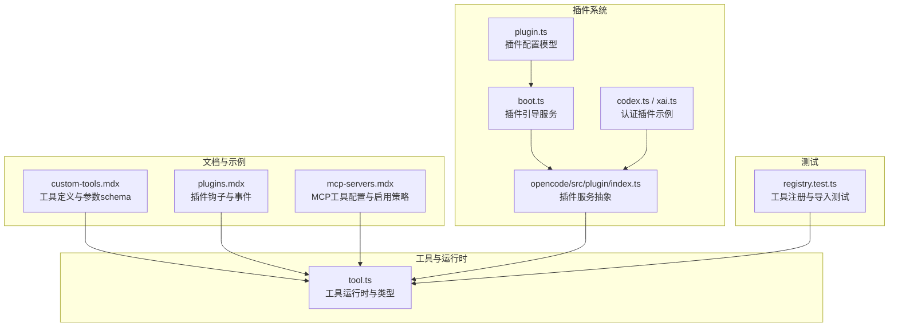
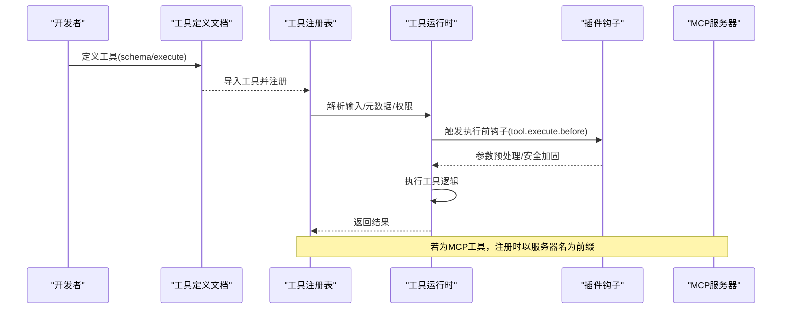
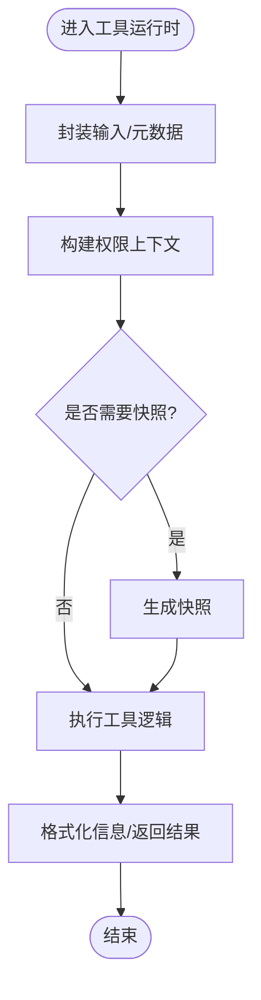
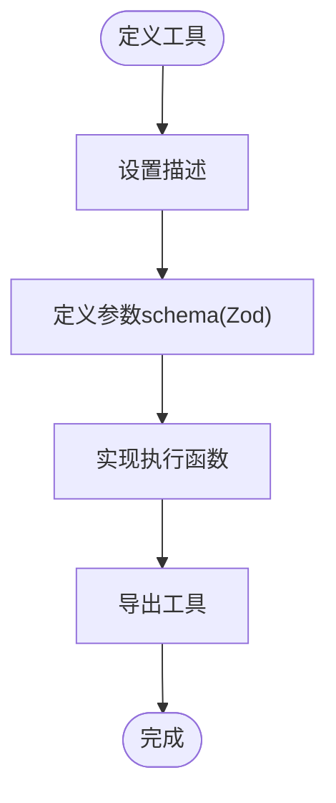
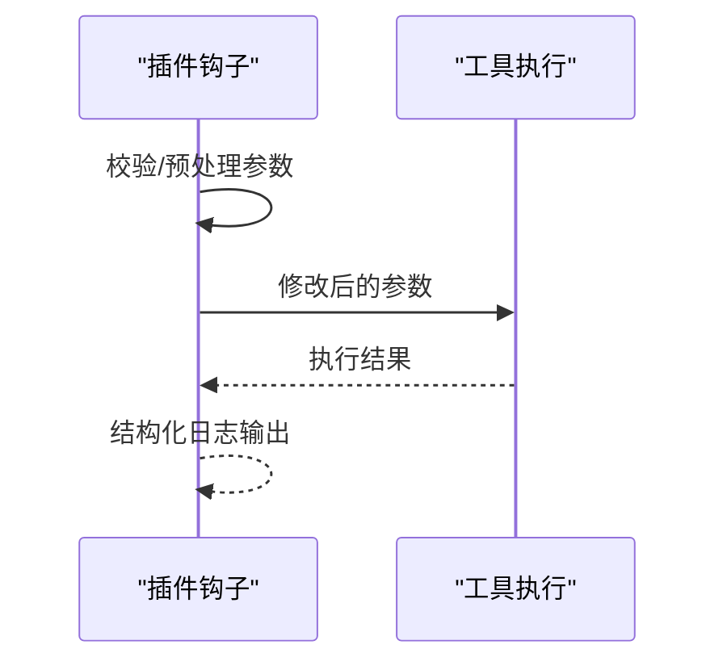
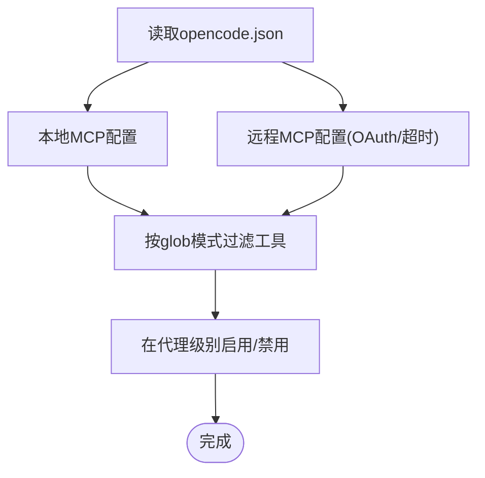
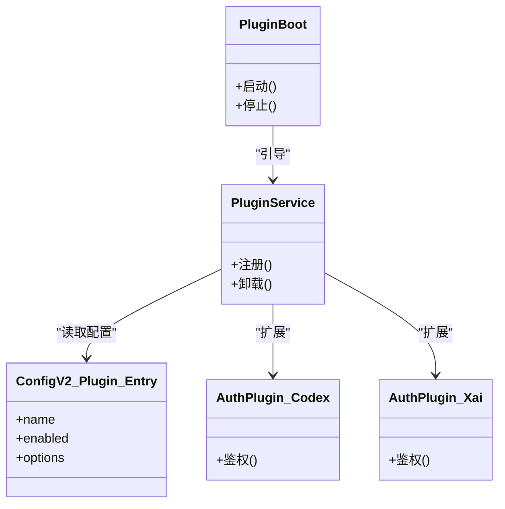
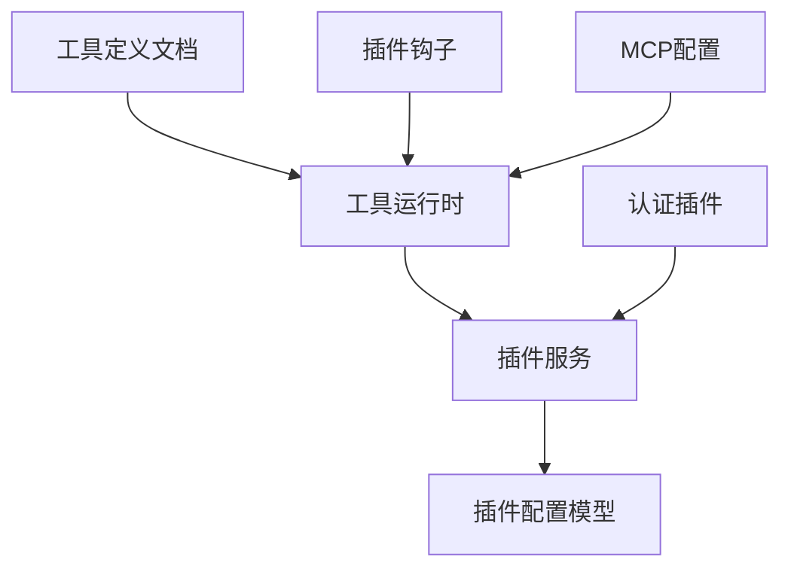

# Tool 插件开发

<cite>
**本文引用的文件**
- [tool.ts](file://packages/opencode/src/cli/cmd/run/tool.ts)
- [custom-tools.mdx](file://packages/web/src/content/docs/zh-cn/custom-tools.mdx)
- [plugins.mdx](file://packages/web/src/content/docs/zh-cn/plugins.mdx)
- [mcp-servers.mdx](file://packages/web/src/content/docs/zh-cn/mcp-servers.mdx)
- [plugin.ts](file://packages/core/src/config/plugin.ts)
- [boot.ts](file://packages/core/src/plugin/boot.ts)
- [plugin.ts](file://packages/opencode/src/plugin/index.ts)
- [codex.ts](file://packages/opencode/src/plugin/openai/codex.ts)
- [xai.ts](file://packages/opencode/src/plugin/xai.ts)
- [registry.test.ts](file://packages/opencode/test/tool/registry.test.ts)
</cite>

## 目录
1. [简介](#简介)
2. [项目结构](#项目结构)
3. [核心组件](#核心组件)
4. [架构总览](#架构总览)
5. [详细组件分析](#详细组件分析)
6. [依赖关系分析](#依赖关系分析)
7. [性能考虑](#性能考虑)
8. [故障排查指南](#故障排查指南)
9. [结论](#结论)
10. [附录](#附录)

## 简介
本指南面向希望在 OpenCode 平台上开发 Tool 插件的工程师与技术作者。文档系统性阐述 Tool 插件的作用机制、使用场景、开发框架（接口规范、参数校验、返回值处理）、注册与发现流程、调用方式，并提供文件操作、网络请求、数据处理等常见功能类型的实践范式。同时给出性能优化建议与安全注意事项，帮助你在保证稳定性的同时提升工具链效率。

## 项目结构
围绕 Tool 插件开发，仓库中与之直接相关的关键位置如下：
- 工具定义与运行时：packages/opencode/src/cli/cmd/run/tool.ts 提供工具运行时的类型与辅助方法（如输入解析、权限上下文、快照生成等）。
- 工具开发文档与示例：packages/web/src/content/docs/zh-cn/custom-tools.mdx 提供工具定义、参数 schema（基于 Zod）、执行函数与命名冲突处理等权威说明。
- 插件生态与钩子：packages/web/src/content/docs/zh-cn/plugins.mdx 展示插件如何通过事件钩子影响工具执行（如 tool.execute.before），并演示日志记录等实践。
- MCP 工具集成：packages/web/src/content/docs/zh-cn/mcp-servers.mdx 说明如何通过 opencode.json 配置本地/远程 MCP 服务器及其工具的启用/禁用策略（支持 glob 模式）。
- 插件配置与生命周期：packages/core/src/config/plugin.ts、packages/core/src/plugin/boot.ts、packages/opencode/src/plugin/index.ts 提供插件配置模型、引导服务与插件服务抽象。
- 认证插件示例：packages/opencode/src/plugin/openai/codex.ts、packages/opencode/src/plugin/xai.ts 展示如何为第三方服务添加认证能力。
- 注册与测试：packages/opencode/test/tool/registry.test.ts 展示工具注册、导入与测试行为。

图表来源
- [tool.ts:122-180](file://packages/opencode/src/cli/cmd/run/tool.ts#L122-L180)
- [custom-tools.mdx:74-117](file://packages/web/src/content/docs/zh-cn/custom-tools.mdx#L74-L117)
- [plugins.mdx:90-143](file://packages/web/src/content/docs/zh-cn/plugins.mdx#L90-L143)
- [mcp-servers.mdx:333-398](file://packages/web/src/content/docs/zh-cn/mcp-servers.mdx#L333-L398)
- [plugin.ts:4-200](file://packages/core/src/config/plugin.ts#L4-L200)
- [boot.ts:54-200](file://packages/core/src/plugin/boot.ts#L54-L200)
- [plugin.ts:57-200](file://packages/opencode/src/plugin/index.ts#L57-L200)
- [codex.ts:99-200](file://packages/opencode/src/plugin/openai/codex.ts#L99-L200)
- [xai.ts:44-200](file://packages/opencode/src/plugin/xai.ts#L44-L200)
- [registry.test.ts:236-354](file://packages/opencode/test/tool/registry.test.ts#L236-L354)

章节来源
- [tool.ts:122-180](file://packages/opencode/src/cli/cmd/run/tool.ts#L122-L180)
- [custom-tools.mdx:74-117](file://packages/web/src/content/docs/zh-cn/custom-tools.mdx#L74-L117)
- [plugins.mdx:90-143](file://packages/web/src/content/docs/zh-cn/plugins.mdx#L90-L143)
- [mcp-servers.mdx:333-398](file://packages/web/src/content/docs/zh-cn/mcp-servers.mdx#L333-L398)
- [plugin.ts:4-200](file://packages/core/src/config/plugin.ts#L4-L200)
- [boot.ts:54-200](file://packages/core/src/plugin/boot.ts#L54-L200)
- [plugin.ts:57-200](file://packages/opencode/src/plugin/index.ts#L57-L200)
- [codex.ts:99-200](file://packages/opencode/src/plugin/openai/codex.ts#L99-L200)
- [xai.ts:44-200](file://packages/opencode/src/plugin/xai.ts#L44-L200)
- [registry.test.ts:236-354](file://packages/opencode/test/tool/registry.test.ts#L236-L354)

## 核心组件
- 工具运行时与类型
  - 工具注册表类型、工具规则、权限上下文、输入/元数据包装器、字符串/数字/列表转换、信息格式化等基础能力由工具运行时模块提供，用于统一处理工具调用的输入、权限与输出。
- 工具定义与参数 schema
  - 工具通过描述、参数 schema（基于 Zod）与执行函数定义；支持导出多个工具，或覆盖内置工具（需注意命名冲突与权限控制）。
- 插件钩子与事件
  - 插件可通过事件钩子拦截工具执行（如 tool.execute.before），对参数进行预处理或安全加固。
- MCP 工具集成
  - 通过 opencode.json 配置本地/远程 MCP 服务器，支持按服务器前缀的 glob 模式启用/禁用工具，便于大规模工具管理。
- 插件系统
  - 插件配置模型、引导服务与插件服务抽象构成插件生命周期与能力边界，认证插件示例展示如何扩展第三方服务接入。

章节来源
- [tool.ts:122-180](file://packages/opencode/src/cli/cmd/run/tool.ts#L122-L180)
- [custom-tools.mdx:74-117](file://packages/web/src/content/docs/zh-cn/custom-tools.mdx#L74-L117)
- [plugins.mdx:90-143](file://packages/web/src/content/docs/zh-cn/plugins.mdx#L90-L143)
- [mcp-servers.mdx:333-398](file://packages/web/src/content/docs/zh-cn/mcp-servers.mdx#L333-L398)
- [plugin.ts:4-200](file://packages/core/src/config/plugin.ts#L4-L200)
- [boot.ts:54-200](file://packages/core/src/plugin/boot.ts#L54-L200)
- [plugin.ts:57-200](file://packages/opencode/src/plugin/index.ts#L57-L200)
- [codex.ts:99-200](file://packages/opencode/src/plugin/openai/codex.ts#L99-L200)
- [xai.ts:44-200](file://packages/opencode/src/plugin/xai.ts#L44-L200)

## 架构总览
下图展示了从“工具定义”到“运行时执行”的整体流程，以及插件钩子与 MCP 工具的集成点。

图表来源
- [custom-tools.mdx:74-117](file://packages/web/src/content/docs/zh-cn/custom-tools.mdx#L74-L117)
- [tool.ts:122-180](file://packages/opencode/src/cli/cmd/run/tool.ts#L122-L180)
- [plugins.mdx:90-143](file://packages/web/src/content/docs/zh-cn/plugins.mdx#L90-L143)
- [mcp-servers.mdx:333-398](file://packages/web/src/content/docs/zh-cn/mcp-servers.mdx#L333-L398)

## 详细组件分析

### 组件A：工具运行时与类型
- 职责
  - 统一工具调用的输入封装、元数据注入、权限上下文构建、工具快照生成与信息格式化。
- 关键点
  - 输入/元数据对象深拷贝与原型隔离，避免污染原始帧。
  - 权限上下文包含模式匹配集合，便于按工具名或模式进行授权控制。
  - 字符串/数字/数组转换函数提供健壮的类型安全与默认值处理。
- 复杂度
  - 基础转换与封装为 O(1)，信息格式化随键值数量线性增长。
- 优化建议
  - 对频繁使用的输入/元数据进行缓存；在钩子中尽量减少昂贵计算。
  - 使用不可变对象模式，降低副作用风险。

图表来源
- [tool.ts:122-180](file://packages/opencode/src/cli/cmd/run/tool.ts#L122-L180)

章节来源
- [tool.ts:122-180](file://packages/opencode/src/cli/cmd/run/tool.ts#L122-L180)

### 组件B：工具定义与参数 schema
- 职责
  - 定义工具描述、参数类型（基于 Zod）、执行函数与可选上下文。
- 关键点
  - 支持导出多个工具；自定义工具可覆盖内置同名工具，但建议使用唯一命名或通过权限禁用内置工具。
  - 参数 schema 可直接使用 tool.schema 或引入 Zod 自行构造。
- 复杂度
  - schema 定义与校验为 O(n)（n 为字段数），执行函数复杂度取决于业务逻辑。
- 优化建议
  - 将常用 schema 抽象为可复用片段；在执行函数中尽早失败（快速校验）。

图表来源
- [custom-tools.mdx:74-117](file://packages/web/src/content/docs/zh-cn/custom-tools.mdx#L74-L117)

章节来源
- [custom-tools.mdx:74-117](file://packages/web/src/content/docs/zh-cn/custom-tools.mdx#L74-L117)

### 组件C：插件钩子与事件
- 职责
  - 通过事件钩子在工具执行前后进行干预，如参数预处理、安全加固、日志记录等。
- 关键点
  - tool.execute.before 可修改参数（如转义命令），实现安全增强。
  - 日志应使用 client.app.log 进行结构化输出，便于审计与排障。
- 复杂度
  - 钩子链路为 O(k)（k 为钩子数量），需避免阻塞主执行流。
- 优化建议
  - 将耗时操作异步化；确保钩子幂等且无副作用。

图表来源
- [plugins.mdx:90-143](file://packages/web/src/content/docs/zh-cn/plugins.mdx#L90-L143)
- [plugins.mdx:317-324](file://packages/web/src/content/docs/zh-cn/plugins.mdx#L317-L324)

章节来源
- [plugins.mdx:90-143](file://packages/web/src/content/docs/zh-cn/plugins.mdx#L90-L143)
- [plugins.mdx:317-324](file://packages/web/src/content/docs/zh-cn/plugins.mdx#L317-L324)

### 组件D：MCP 工具集成与配置
- 职责
  - 通过 opencode.json 配置本地/远程 MCP 服务器，按服务器名前缀启用/禁用工具，支持 glob 模式。
- 关键点
  - 全局禁用后可在代理级别单独启用，实现细粒度控制。
  - glob 模式支持 * 与 ?，便于批量管理工具集。
- 复杂度
  - 工具发现与过滤为 O(t)（t 为工具总数），配置解析为 O(s)（s 为配置项数）。
- 优化建议
  - 合理拆分全局与代理级配置，减少不必要的工具加载。

图表来源
- [mcp-servers.mdx:333-398](file://packages/web/src/content/docs/zh-cn/mcp-servers.mdx#L333-L398)

章节来源
- [mcp-servers.mdx:333-398](file://packages/web/src/content/docs/zh-cn/mcp-servers.mdx#L333-L398)

### 组件E：插件系统与认证扩展
- 职责
  - 插件配置模型、引导服务与插件服务抽象；认证插件示例展示如何对接第三方服务。
- 关键点
  - 插件服务以上下文服务形式存在，便于在不同模块间共享能力。
  - 认证插件通过选项接口扩展鉴权流程，如 OpenAI Codex 与 XAI。
- 复杂度
  - 插件生命周期管理为 O(p)（p 为插件数量），认证流程取决于第三方 API 的响应时间。
- 优化建议
  - 缓存认证令牌；实现重试与降级策略。

图表来源
- [boot.ts:54-200](file://packages/core/src/plugin/boot.ts#L54-L200)
- [plugin.ts:57-200](file://packages/opencode/src/plugin/index.ts#L57-L200)
- [plugin.ts:4-200](file://packages/core/src/config/plugin.ts#L4-L200)
- [codex.ts:99-200](file://packages/opencode/src/plugin/openai/codex.ts#L99-L200)
- [xai.ts:44-200](file://packages/opencode/src/plugin/xai.ts#L44-L200)

章节来源
- [boot.ts:54-200](file://packages/core/src/plugin/boot.ts#L54-L200)
- [plugin.ts:57-200](file://packages/opencode/src/plugin/index.ts#L57-L200)
- [plugin.ts:4-200](file://packages/core/src/config/plugin.ts#L4-L200)
- [codex.ts:99-200](file://packages/opencode/src/plugin/openai/codex.ts#L99-L200)
- [xai.ts:44-200](file://packages/opencode/src/plugin/xai.ts#L44-L200)

### 组件F：工具注册与测试
- 职责
  - 工具注册、导入与测试，验证工具可用性与行为一致性。
- 关键点
  - 测试覆盖工具导入路径、注册行为与错误场景。
- 复杂度
  - 注册与导入为 O(m)（m 为工具数量），测试用例随场景增多而线性增长。
- 优化建议
  - 将通用断言抽取为测试工具；对导入路径进行参数化测试。

章节来源
- [registry.test.ts:236-354](file://packages/opencode/test/tool/registry.test.ts#L236-L354)

## 依赖关系分析
- 工具运行时依赖于插件系统提供的上下文与服务抽象，确保工具在统一的生命周期内被管理。
- 工具定义文档与插件钩子共同决定工具的行为边界与安全性。
- MCP 工具通过配置文件与运行时进行解耦，便于动态启用/禁用与版本演进。
- 认证插件作为外部能力扩展，不改变工具核心逻辑，仅提供鉴权支持。

图表来源
- [tool.ts:122-180](file://packages/opencode/src/cli/cmd/run/tool.ts#L122-L180)
- [plugin.ts:57-200](file://packages/opencode/src/plugin/index.ts#L57-L200)
- [plugin.ts:4-200](file://packages/core/src/config/plugin.ts#L4-L200)
- [custom-tools.mdx:74-117](file://packages/web/src/content/docs/zh-cn/custom-tools.mdx#L74-L117)
- [plugins.mdx:90-143](file://packages/web/src/content/docs/zh-cn/plugins.mdx#L90-L143)
- [mcp-servers.mdx:333-398](file://packages/web/src/content/docs/zh-cn/mcp-servers.mdx#L333-L398)
- [codex.ts:99-200](file://packages/opencode/src/plugin/openai/codex.ts#L99-L200)
- [xai.ts:44-200](file://packages/opencode/src/plugin/xai.ts#L44-L200)

章节来源
- [tool.ts:122-180](file://packages/opencode/src/cli/cmd/run/tool.ts#L122-L180)
- [plugin.ts:57-200](file://packages/opencode/src/plugin/index.ts#L57-L200)
- [plugin.ts:4-200](file://packages/core/src/config/plugin.ts#L4-L200)
- [custom-tools.mdx:74-117](file://packages/web/src/content/docs/zh-cn/custom-tools.mdx#L74-L117)
- [plugins.mdx:90-143](file://packages/web/src/content/docs/zh-cn/plugins.mdx#L90-L143)
- [mcp-servers.mdx:333-398](file://packages/web/src/content/docs/zh-cn/mcp-servers.mdx#L333-L398)
- [codex.ts:99-200](file://packages/opencode/src/plugin/openai/codex.ts#L99-L200)
- [xai.ts:44-200](file://packages/opencode/src/plugin/xai.ts#L44-L200)

## 性能考虑
- 输入与元数据处理
  - 使用浅拷贝/原型隔离避免共享状态引发的竞态；对大对象进行惰性访问，减少不必要的序列化。
- 钩子链路
  - 控制钩子数量与深度；将 IO 密集型任务异步化，避免阻塞工具主执行流。
- MCP 工具
  - 合理设置超时与重试；按需启用工具，避免一次性加载过多远端工具。
- 认证与缓存
  - 对第三方鉴权接口进行缓存与刷新策略；在插件层实现指数退避与熔断。
- 测试与回归
  - 通过参数化测试覆盖边界条件；对导入路径与注册行为进行基准测试。

## 故障排查指南
- 工具无法注册/导入
  - 检查工具导出路径与命名；确认工具已在注册表中可见；参考测试用例定位问题。
- 参数校验失败
  - 核对 schema 定义与调用参数；确保必填字段与类型一致；必要时增加默认值与容错。
- 钩子未生效
  - 确认事件名称正确（如 tool.execute.before）；检查钩子优先级与顺序；避免在钩子中抛出未捕获异常。
- MCP 工具不可用
  - 检查 opencode.json 中的 enabled、type、command/url、headers、oauth、timeout 等配置；确认 glob 模式是否正确匹配。
- 认证失败
  - 核对认证插件选项；检查令牌有效期与刷新逻辑；关注第三方服务的速率限制与错误码。

章节来源
- [registry.test.ts:236-354](file://packages/opencode/test/tool/registry.test.ts#L236-L354)
- [plugins.mdx:90-143](file://packages/web/src/content/docs/zh-cn/plugins.mdx#L90-L143)
- [mcp-servers.mdx:333-398](file://packages/web/src/content/docs/zh-cn/mcp-servers.mdx#L333-L398)
- [codex.ts:99-200](file://packages/opencode/src/plugin/openai/codex.ts#L99-L200)
- [xai.ts:44-200](file://packages/opencode/src/plugin/xai.ts#L44-L200)

## 结论
通过统一的工具运行时、严谨的参数 schema、灵活的插件钩子与 MCP 工具集成，OpenCode 为 Tool 插件提供了高扩展性与强约束的开发体验。遵循本文档的接口规范、参数验证与返回值处理原则，并结合性能优化与安全注意事项，你可以在保证稳定性的前提下快速构建高质量的工具链。

## 附录
- 开发框架清单
  - 接口规范：描述、参数 schema（Zod）、执行函数、上下文。
  - 参数验证：在 schema 中明确类型、范围与描述；在执行前进行快速校验。
  - 返回值处理：统一结果结构；对错误进行结构化包装。
  - 注册机制：导出工具并由注册表收集；支持覆盖内置工具（谨慎使用）。
  - 发现流程：本地工具由导入发现；MCP 工具由配置驱动发现。
  - 调用方式：运行时封装输入/元数据/权限；触发钩子链路；执行工具逻辑；格式化输出。
- 常见功能类型示例思路
  - 文件操作：定义路径与权限参数，执行前进行路径白名单校验与安全加固。
  - 网络请求：定义 URL、头部与超时参数，执行前进行 URL 白名单与协议校验。
  - 数据处理：定义输入/输出 schema，执行前进行数据清洗与格式转换。
- 安全注意事项
  - 严格参数校验与最小权限原则；对命令类工具进行转义与沙箱化。
  - 对第三方认证进行令牌缓存与刷新；限制重试次数与退避策略。
  - 使用结构化日志记录关键事件，便于审计与追踪。