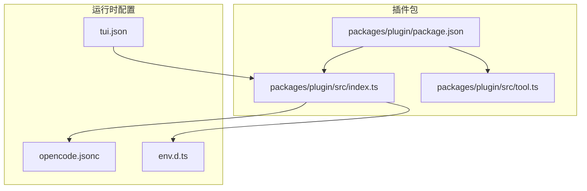
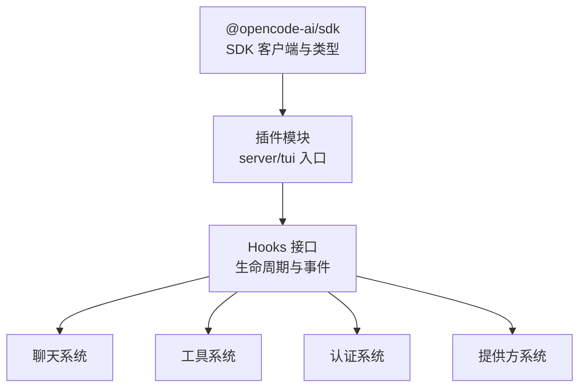
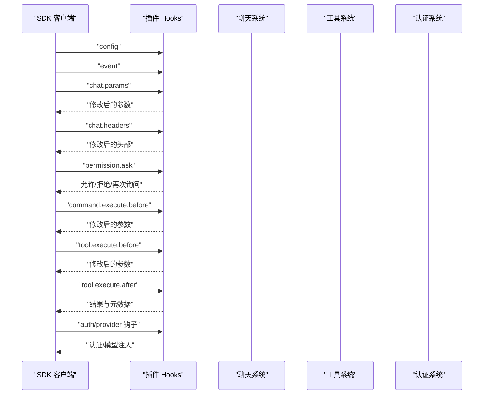
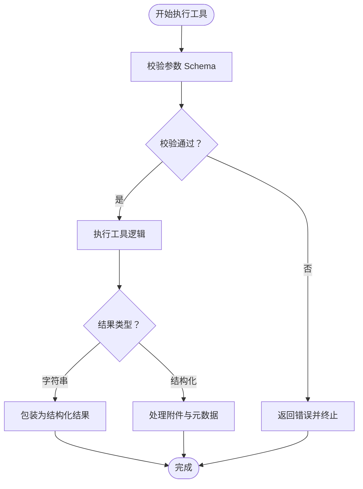
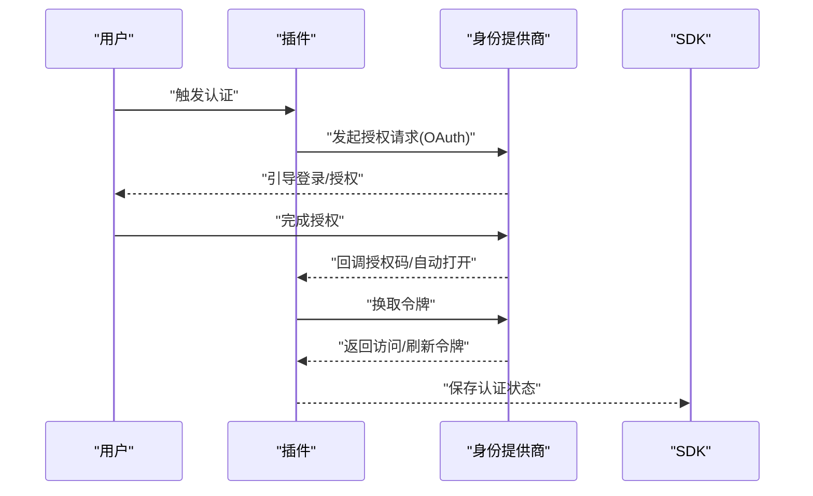
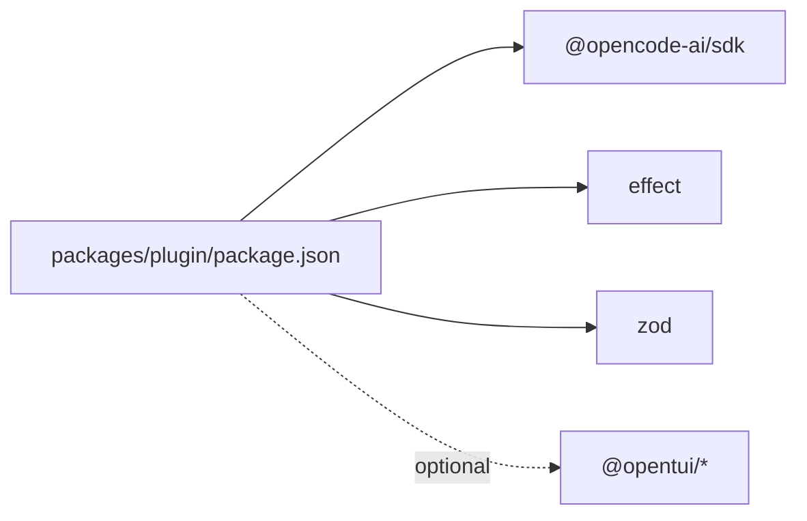

# 插件开发指南

<cite>
**本文引用的文件**
- [packages/plugin/package.json](file://packages/plugin/package.json)
- [.opencode/opencode.jsonc](file://.opencode/opencode.jsonc)
- [.opencode/env.d.ts](file://.opencode/env.d.ts)
- [.opencode/tui.json](file://.opencode/tui.json)
- [packages/plugin/src/index.ts](file://packages/plugin/src/index.ts)
- [packages/plugin/src/tool.ts](file://packages/plugin/src/tool.ts)
</cite>

## 目录
1. [简介](#简介)
2. [项目结构](#项目结构)
3. [核心组件](#核心组件)
4. [架构总览](#架构总览)
5. [详细组件分析](#详细组件分析)
6. [依赖分析](#依赖分析)
7. [性能考量](#性能考量)
8. [故障排查指南](#故障排查指南)
9. [结论](#结论)
10. [附录](#附录)

## 简介
本指南面向希望在 OpenCode 平台开发与扩展插件的开发者，系统讲解插件体系的架构设计与开发流程，涵盖 Agent、Tool、Skill、Theme 等不同类型的插件及其适用场景；提供从项目初始化、接口实现到测试调试的全流程指导；详解插件 API 的生命周期钩子、事件系统与数据交换机制；给出打包、发布与分发的技术要点；并总结调试与性能优化的最佳实践及安全与代码规范要求。

## 项目结构
OpenCode 插件系统位于 packages/plugin 包中，核心类型与导出定义集中在入口模块，工具函数与类型定义位于独立模块。配置与运行时元信息通过 .opencode 目录下的 JSON 配置文件进行声明。

图表来源
- [packages/plugin/package.json:1-50](file://packages/plugin/package.json#L1-L50)
- [packages/plugin/src/index.ts:1-336](file://packages/plugin/src/index.ts#L1-L336)
- [packages/plugin/src/tool.ts:1-55](file://packages/plugin/src/tool.ts#L1-L55)
- [.opencode/opencode.jsonc:1-21](file://.opencode/opencode.jsonc#L1-L21)
- [.opencode/env.d.ts:1-5](file://.opencode/env.d.ts#L1-L5)
- [.opencode/tui.json:1-20](file://.opencode/tui.json#L1-L20)

章节来源
- [packages/plugin/package.json:1-50](file://packages/plugin/package.json#L1-L50)
- [.opencode/opencode.jsonc:1-21](file://.opencode/opencode.jsonc#L1-L21)
- [.opencode/env.d.ts:1-5](file://.opencode/env.d.ts#L1-L5)
- [.opencode/tui.json:1-20](file://.opencode/tui.json#L1-L20)

## 核心组件
- 插件入口与类型
  - 插件模块导出 server 作为后端主入口，并可选导出 tui（当前类型标注为 never，表示暂不支持）。
  - 插件输入对象包含客户端、项目上下文、工作树路径、实验性工作区适配器注册器、服务端地址以及 Shell 执行环境。
  - 插件返回 Hooks 对象，用于订阅生命周期事件与修改系统行为。
- 工具定义与执行
  - 工具通过工厂函数定义，具备描述、参数 Schema 与执行函数；执行上下文提供会话、消息、代理、目录、工作树、中止信号与元数据上报能力。
  - 工具结果支持字符串或结构化对象，可携带标题、输出文本、元数据与附件。
- 认证与提供方钩子
  - 支持 OAuth 与 API 两种认证方式，提供动态表单提示与授权回调。
  - 提供方钩子允许根据上下文动态注入模型列表。
- 生命周期与事件系统
  - 包含通用事件、聊天消息、参数与请求头修改、权限询问、命令与工具执行前后钩子、Shell 环境注入、实验性聊天与会话压缩钩子、文本补全与工具定义修改等。

章节来源
- [packages/plugin/src/index.ts:74-336](file://packages/plugin/src/index.ts#L74-L336)
- [packages/plugin/src/tool.ts:1-55](file://packages/plugin/src/tool.ts#L1-L55)

## 架构总览
下图展示了插件系统在运行时的交互关系：插件通过 Hooks 订阅系统事件，对聊天参数、请求头、工具定义、权限策略等进行拦截与修改；同时通过工具扩展能力，向 LLM 提供新的操作能力。

图表来源
- [packages/plugin/src/index.ts:222-336](file://packages/plugin/src/index.ts#L222-L336)
- [packages/plugin/src/tool.ts:45-55](file://packages/plugin/src/tool.ts#L45-L55)

## 详细组件分析

### 组件一：插件生命周期与事件系统
- 设计要点
  - Hooks 以键值形式暴露多个阶段钩子，覆盖从配置加载、事件广播、聊天参数与头部修改、权限决策、命令与工具执行、Shell 环境注入，到实验性聊天与会话压缩等。
  - 每个钩子接收输入上下文与输出修改器，允许插件在不破坏核心逻辑的前提下进行增强。
- 关键钩子说明
  - chat.message：在新消息到达时触发，可用于记录、转换或阻断消息。
  - chat.params/chat.headers：在调用大模型前修改温度、采样参数与请求头。
  - permission.ask：在发起需要用户许可的操作前弹出确认。
  - command.execute.before/tool.execute.before：在执行命令或工具前注入参数或变更行为。
  - shell.env：注入执行环境变量。
  - experimental.*：实验性钩子，如聊天消息/系统提示转换、小模型选择、会话压缩定制、自动继续对话、文本补全与工具定义修改。
- 开发建议
  - 使用最小必要钩子集，避免过度侵入。
  - 对输出修改器进行幂等处理，确保多次调用的一致性。
  - 实验性钩子可能在未来调整，需做好兼容性处理。

图表来源
- [packages/plugin/src/index.ts:222-336](file://packages/plugin/src/index.ts#L222-L336)

章节来源
- [packages/plugin/src/index.ts:222-336](file://packages/plugin/src/index.ts#L222-L336)

### 组件二：工具定义与执行模型
- 设计要点
  - 工具通过工厂函数定义，内部使用 Zod Schema 进行参数校验，保证与 LLM 的交互一致性。
  - 执行上下文提供会话标识、消息标识、代理名称、工作目录与工作树根路径，便于相对路径解析与资源定位。
  - 支持中止信号，保障长时间任务的可控性；支持元数据上报与提问能力，便于与用户交互。
  - 结果支持字符串与结构化对象，可附加附件（如文件链接、MIME 类型、文件名）。
- 复杂度与性能
  - 参数校验复杂度取决于 Schema 层级与字段数量；建议将复杂校验拆分为子 Schema 并复用。
  - 附件传输应控制大小与数量，避免影响聊天流性能。
- 错误处理
  - 在工具执行失败时，返回结构化错误信息，便于上层统一处理与提示。

图表来源
- [packages/plugin/src/tool.ts:45-55](file://packages/plugin/src/tool.ts#L45-L55)

章节来源
- [packages/plugin/src/tool.ts:1-55](file://packages/plugin/src/tool.ts#L1-L55)

### 组件三：认证与提供方钩子
- 设计要点
  - 支持 OAuth 与 API 两种认证方式，均提供动态表单提示与授权回调。
  - OAuth 支持自动打开浏览器与手动输入授权码两种模式，回调中可返回访问令牌、刷新令牌、账户 ID 或密钥等。
  - 提供方钩子允许根据上下文动态注入模型列表，便于按项目或会话定制模型可用性。
- 安全考虑
  - 严格校验回调参数与状态，防止中间人攻击与重放攻击。
  - 敏感信息（令牌、密钥）仅在内存中持有，避免落盘或泄露。

图表来源
- [packages/plugin/src/index.ts:88-208](file://packages/plugin/src/index.ts#L88-L208)

章节来源
- [packages/plugin/src/index.ts:88-208](file://packages/plugin/src/index.ts#L88-L208)

### 组件四：配置与运行时元信息
- 配置文件
  - opencode.jsonc：全局配置，包含 provider、permission、references、mcp 等字段，用于声明外部依赖与本地路径映射。
  - tui.json：声明 TUI 插件列表与快捷键绑定，支持启用/禁用与按键映射。
  - env.d.ts：声明静态资源导入类型，确保构建时类型安全。
- 开发建议
  - 将本地路径映射与外部仓库信息集中维护，便于团队协作与 CI/CD 使用。
  - TUI 插件清单应与实际插件文件保持一致，避免加载失败。

章节来源
- [.opencode/opencode.jsonc:1-21](file://.opencode/opencode.jsonc#L1-L21)
- [.opencode/tui.json:1-20](file://.opencode/tui.json#L1-L20)
- [.opencode/env.d.ts:1-5](file://.opencode/env.d.ts#L1-L5)

## 依赖分析
- 内部依赖
  - @opencode-ai/sdk：提供 SDK 客户端、类型与配置结构，是插件与平台交互的基础。
- 外部依赖
  - effect：用于效果化编程与资源管理，提升并发与错误处理能力。
  - zod：用于工具参数的强类型校验。
- 可选依赖
  - @opentui/*：TUI 组件生态，插件可按需使用，非强制依赖。

图表来源
- [packages/plugin/package.json:19-48](file://packages/plugin/package.json#L19-L48)

章节来源
- [packages/plugin/package.json:19-48](file://packages/plugin/package.json#L19-L48)

## 性能考量
- 避免在钩子中执行阻塞操作，优先采用异步与并发策略。
- 工具执行应短路返回，长耗时任务使用后台执行并定期上报进度。
- 控制附件大小与数量，必要时采用流式传输或分块上传。
- 合理使用缓存与去重，减少重复计算与网络请求。
- 对实验性钩子保持谨慎，避免引入不稳定因素。

## 故障排查指南
- 常见问题
  - 插件未生效：检查插件导出是否正确、配置文件中插件路径是否有效、TUI 清单是否启用。
  - 工具执行异常：核对参数 Schema 是否与 LLM 调用一致，查看执行上下文中的目录与工作树路径是否正确。
  - 认证失败：确认回调参数与状态校验逻辑，检查网络连通性与提供商限制。
- 调试建议
  - 使用最小化插件复现问题，逐步增加功能定位根因。
  - 在关键钩子中打印上下文信息，便于回溯调用链。
  - 利用 AbortSignal 中止长时间任务，避免资源泄漏。

## 结论
OpenCode 插件系统通过清晰的生命周期钩子与事件机制，为开发者提供了强大的扩展能力。遵循本文档的开发流程、最佳实践与安全规范，可以高效地构建稳定、可维护且高性能的插件应用。

## 附录
- 插件类型与适用场景
  - 功能插件（Tool）：扩展具体可被 LLM 调用的操作能力，适合自动化脚本、文件处理、外部系统集成等。
  - 主题插件（Theme）：调整界面风格与交互体验，适合 UI 定制与品牌化需求。
  - 技能插件（Skill）：封装多步骤的复合任务，适合复杂业务流程编排。
  - 代理插件（Agent）：定义特定角色与行为策略，适合领域专家或角色扮演场景。
- 开发流程建议
  - 初始化：基于现有模板创建插件工程，配置 package.json 与导出入口。
  - 接口实现：按需实现 Hooks 钩子与工具定义，编写参数 Schema 与执行逻辑。
  - 测试调试：在本地环境中验证工具与钩子行为，结合日志与断点定位问题。
  - 打包发布：遵循版本管理与依赖声明，生成产物并提交至分发渠道。
- 安全与代码规范
  - 严格校验输入参数与外部回调，避免注入与越权。
  - 最小权限原则：仅申请必要的权限与访问范围。
  - 代码审查：建立同行评审机制，确保质量与一致性。
  - 文档与注释：为公共 API 与关键逻辑补充说明，便于后续维护。