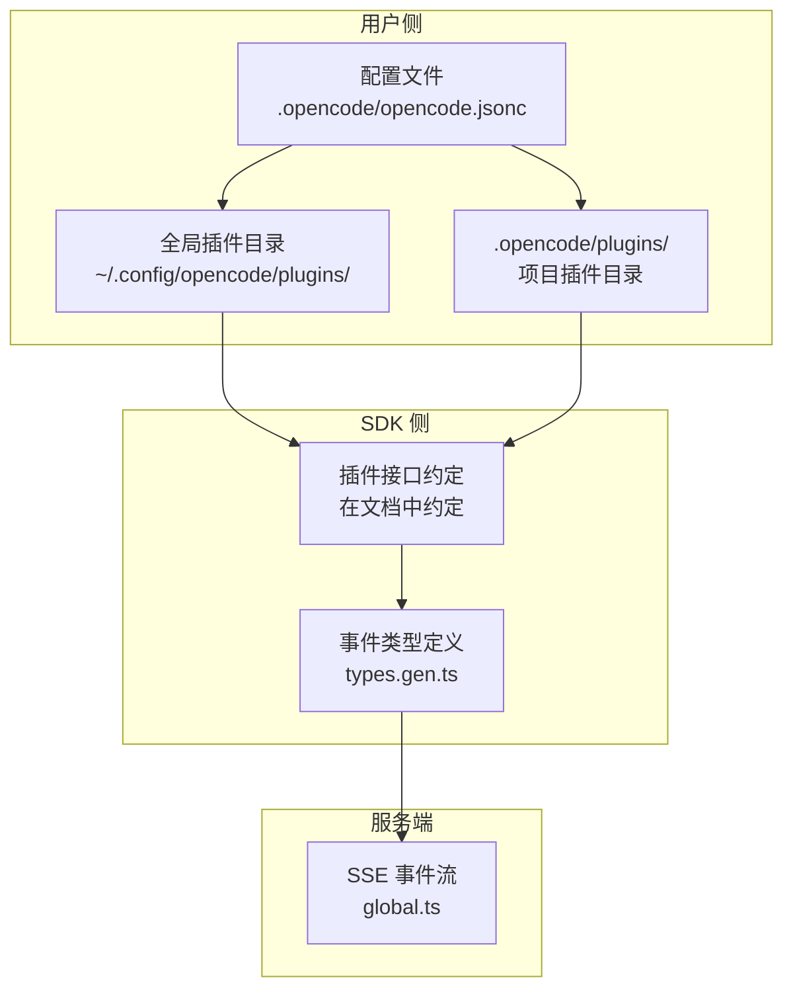
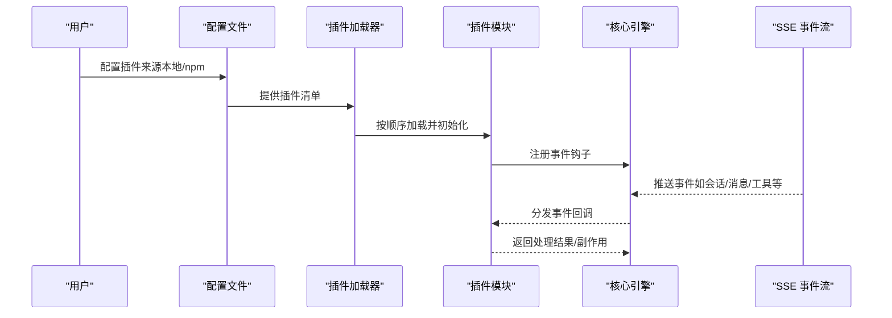
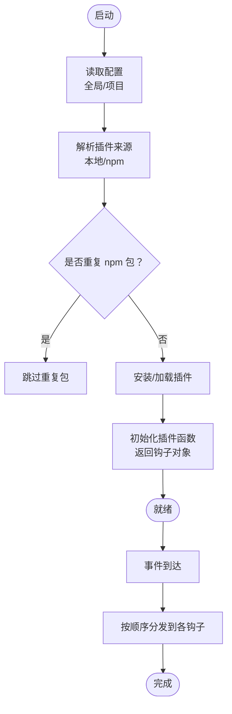
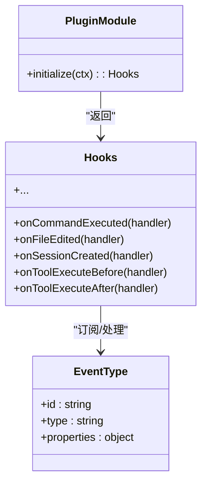
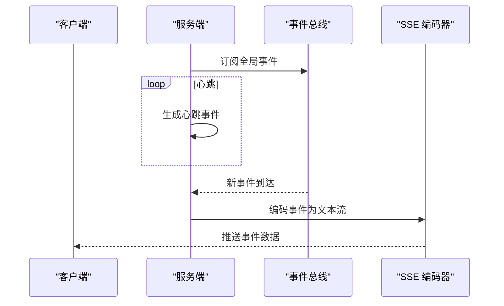
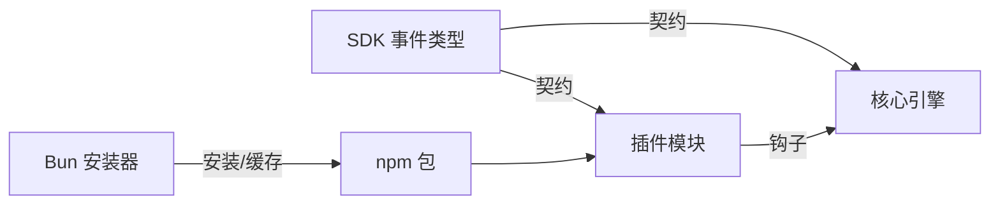

# 插件架构设计

<cite>
**本文引用的文件**
- [plugins.mdx](file://packages/web/src/content/docs/zh/plugins.mdx)
- [types.gen.ts](file://packages/sdk/js/src/v2/gen/types.gen.ts)
- [global.ts](file://packages/opencode/src/server/routes/instance/httpapi/handlers/global.ts)
- [opencode.jsonc](file://.opencode/opencode.jsonc)
- [plugins 目录](file://.opencode/plugins)
- [troubleshooting.mdx](file://packages/web/src/content/docs/zh/troubleshooting.mdx)
</cite>

## 目录
1. [引言](#引言)
2. [项目结构](#项目结构)
3. [核心组件](#核心组件)
4. [架构总览](#架构总览)
5. [详细组件分析](#详细组件分析)
6. [依赖分析](#依赖分析)
7. [性能考虑](#性能考虑)
8. [故障排除指南](#故障排除指南)
9. [结论](#结论)
10. [附录](#附录)

## 引言
本文件面向 OpenCode 插件系统的开发者与维护者，系统性阐述插件架构的设计理念、整体架构模式与实现要点，覆盖插件加载机制、生命周期管理、事件系统与依赖注入等关键主题。通过结合仓库中的文档与类型定义，我们将从“如何编写插件”“如何运行插件”“如何扩展事件系统”三个维度，帮助读者快速掌握插件生态的工作原理，并提供可操作的最佳实践建议。

## 项目结构
OpenCode 的插件体系由“用户侧配置与插件目录”“SDK 类型与事件模型”“服务端事件推送”三部分协同构成：
- 用户侧：通过配置文件声明插件来源，本地或 npm 包均可；插件脚本放置于全局或项目级插件目录中。
- SDK 侧：提供事件类型定义与插件接口约定，确保插件与核心引擎之间的契约清晰。
- 服务端：以 SSE 流的形式向客户端广播事件，供插件订阅与响应。

图表来源
- [plugins.mdx](file://packages/web/src/content/docs/zh/plugins.mdx)
- [types.gen.ts](file://packages/sdk/js/src/v2/gen/types.gen.ts)
- [global.ts](file://packages/opencode/src/server/routes/instance/httpapi/handlers/global.ts)

章节来源
- [plugins.mdx](file://packages/web/src/content/docs/zh/plugins.mdx)
- [opencode.jsonc](file://.opencode/opencode.jsonc)
- [plugins 目录](file://.opencode/plugins)

## 核心组件
- 插件接口与上下文
  - 插件为导出一个或多个“插件函数”的模块，每个插件函数接收一个上下文对象，返回一个“钩子（hooks）”对象。钩子对象用于声明对特定事件的订阅与处理逻辑。
  - 上下文通常包含项目信息、客户端桥接、工作树、目录等能力，便于插件在不同场景下进行扩展。
- 事件系统
  - SDK 提供了丰富的事件类型定义，涵盖命令执行、文件变更、会话状态、消息更新、工具执行前后等多类事件，插件通过订阅这些事件实现行为扩展。
- 加载与安装
  - 支持两类来源：本地文件与 npm 包。本地插件直接从目录加载；npm 插件由 Bun 在启动时自动安装并缓存到本地路径。
- 生命周期与顺序
  - 插件按“全局配置 → 项目配置 → 全局插件目录 → 项目插件目录”的顺序加载，所有钩子按顺序执行。重复的 npm 包仅加载一次，但同名的不同包会分别加载。

章节来源
- [plugins.mdx](file://packages/web/src/content/docs/zh/plugins.mdx)
- [types.gen.ts](file://packages/sdk/js/src/v2/gen/types.gen.ts)

## 架构总览
下图展示了从“插件注册与加载”到“事件分发与处理”的完整流程，以及与 SDK 类型定义的对应关系。

图表来源
- [plugins.mdx](file://packages/web/src/content/docs/zh/plugins.mdx)
- [types.gen.ts](file://packages/sdk/js/src/v2/gen/types.gen.ts)
- [global.ts](file://packages/opencode/src/server/routes/instance/httpapi/handlers/global.ts)

## 详细组件分析

### 组件一：插件加载与生命周期
- 加载顺序
  - 全局配置 → 项目配置 → 全局插件目录 → 项目插件目录
  - 同名同版本 npm 包去重，本地与 npm 名称相近的包分别加载
- 安装策略
  - npm 插件：启动时由 Bun 自动安装并缓存至本地缓存目录
  - 本地插件：直接从插件目录加载；若需外部依赖，可在配置目录添加 package.json 或发布到 npm
- 生命周期
  - 初始化阶段：插件函数接收上下文并返回钩子对象
  - 运行阶段：事件触发时，核心引擎按注册顺序调用对应钩子

图表来源
- [plugins.mdx](file://packages/web/src/content/docs/zh/plugins.mdx)

章节来源
- [plugins.mdx](file://packages/web/src/content/docs/zh/plugins.mdx)

### 组件二：事件系统与类型安全
- 事件类型
  - SDK 提供大量事件类型定义，覆盖命令、文件、安装、LSP、消息、权限、服务器、会话、待办、Shell、工具、TUI 等类别
- 订阅与处理
  - 插件通过返回的钩子对象订阅事件，事件到达时由核心引擎调用相应处理函数
- 类型安全
  - 基于 SDK 的类型定义，插件在编写时即可获得强类型提示与约束，降低运行期错误

图表来源
- [types.gen.ts](file://packages/sdk/js/src/v2/gen/types.gen.ts)
- [plugins.mdx](file://packages/web/src/content/docs/zh/plugins.mdx)

章节来源
- [types.gen.ts](file://packages/sdk/js/src/v2/gen/types.gen.ts)
- [plugins.mdx](file://packages/web/src/content/docs/zh/plugins.mdx)

### 组件三：服务端事件推送（SSE）
- SSE 通道
  - 服务端通过 SSE 流推送事件，客户端以流式方式接收
  - 初始连接事件与心跳事件均通过该通道发送
- 事件封装
  - 事件负载包含唯一 ID、事件类型与属性字段，便于插件识别与处理

图表来源
- [global.ts](file://packages/opencode/src/server/routes/instance/httpapi/handlers/global.ts)

章节来源
- [global.ts](file://packages/opencode/src/server/routes/instance/httpapi/handlers/global.ts)

### 组件四：依赖注入与上下文
- 上下文能力
  - 插件函数接收的上下文对象通常包含项目信息、客户端桥接、工作树、目录等能力，用于在不同场景下进行扩展
- 依赖注入
  - 插件通过返回钩子对象声明所需能力，核心引擎负责在事件触发时注入上下文并调用钩子

章节来源
- [plugins.mdx](file://packages/web/src/content/docs/zh/plugins.mdx)

## 依赖分析
- 组件耦合
  - 插件模块与核心引擎通过“钩子对象”解耦：插件只关心事件与上下文，不直接依赖引擎内部实现
  - 事件类型由 SDK 统一定义，插件与引擎共享同一套类型契约
- 外部依赖
  - npm 插件由 Bun 管理安装与缓存，减少运行时开销
  - 本地插件可借助配置目录下的 package.json 引入外部依赖

图表来源
- [plugins.mdx](file://packages/web/src/content/docs/zh/plugins.mdx)
- [types.gen.ts](file://packages/sdk/js/src/v2/gen/types.gen.ts)

章节来源
- [plugins.mdx](file://packages/web/src/content/docs/zh/plugins.mdx)
- [types.gen.ts](file://packages/sdk/js/src/v2/gen/types.gen.ts)

## 性能考虑
- 插件加载顺序固定且可预测，避免动态依赖导致的不确定性
- npm 插件由 Bun 缓存，减少重复安装带来的冷启动时间
- 事件处理按序执行，建议插件内部尽量保持轻量与幂等，避免阻塞后续钩子
- 对于高频事件（如文件变更、消息更新），建议在插件内做必要的节流/去抖

## 故障排除指南
- 插件导致异常
  - 临时移除全局或项目插件目录，重启应用验证问题是否消失
  - 逐个启用插件定位具体问题插件
- 清理缓存
  - 删除本地缓存目录后重启应用，让系统重新构建缓存
- 服务器连接问题
  - 参考文档中的排查步骤，检查网络与代理设置

章节来源
- [troubleshooting.mdx](file://packages/web/src/content/docs/zh/troubleshooting.mdx)

## 结论
OpenCode 的插件架构以“事件驱动 + 类型安全 + 明确生命周期”为核心设计原则，通过统一的加载顺序、SSE 事件通道与 SDK 类型契约，实现了插件与核心引擎的松耦合协作。开发者可以基于此架构快速扩展功能、集成外部服务，并在保证性能与稳定性的同时提升生态的可维护性。

## 附录
- 开发基础概念
  - 插件即模块：导出一个或多个插件函数，函数接收上下文并返回钩子对象
  - 钩子即订阅：在钩子对象中声明对事件的订阅与处理逻辑
  - 事件即契约：使用 SDK 提供的事件类型，确保插件与引擎的类型一致性
- 最佳实践
  - 将重型任务异步化，避免阻塞事件循环
  - 对外部依赖进行最小化引入，优先使用已缓存的 npm 包
  - 在插件中记录日志与错误，便于排障与监控
  - 对高频事件进行限流与去抖，降低资源消耗