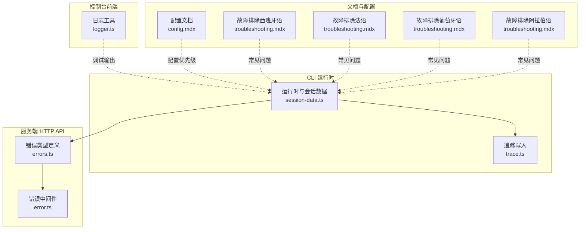
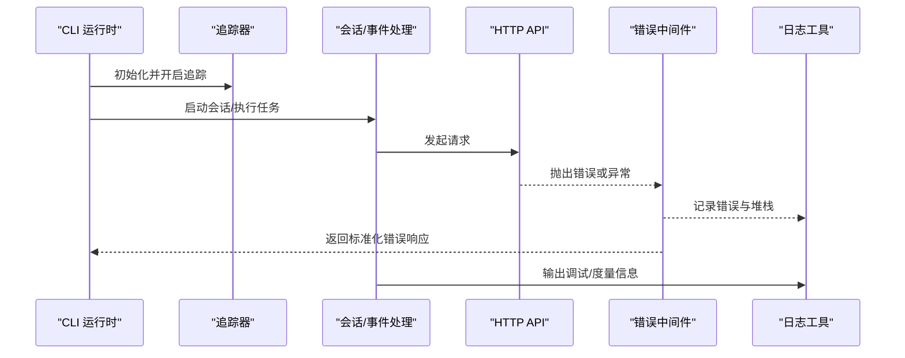
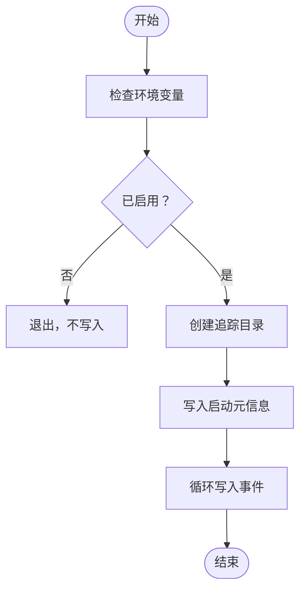
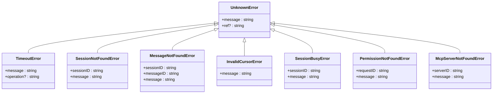
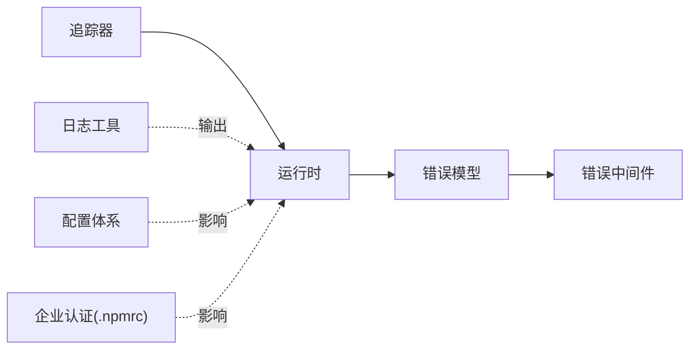

# 故障排除

<cite>
**本文引用的文件**
- [logger.ts](file://packages/console/app/src/routes/zen/util/logger.ts)
- [trace.ts](file://packages/opencode/src/cli/cmd/run/trace.ts)
- [error.ts](file://packages/opencode/src/server/routes/instance/httpapi/middleware/error.ts)
- [errors.ts](file://packages/opencode/src/server/routes/instance/httpapi/errors.ts)
- [session-data.ts](file://packages/opencode/src/cli/cmd/run/session-data.ts)
- [config.mdx（英文）](file://packages/web/src/content/docs/config.mdx)
- [troubleshooting.mdx（西班牙语）](file://packages/web/src/content/docs/es/troubleshooting.mdx)
- [troubleshooting.mdx（法语）](file://packages/web/src/content/docs/fr/troubleshooting.mdx)
- [troubleshooting.mdx（葡萄牙语）](file://packages/web/src/content/docs/pt-br/troubleshooting.mdx)
- [troubleshooting.mdx（阿拉伯语）](file://packages/web/src/content/docs/ar/troubleshooting.mdx)
- [plugins.mdx（阿拉伯语）](file://packages/web/src/content/docs/ar/plugins.mdx)
- [enterprise.mdx（波斯尼亚语）](file://packages/web/src/content/docs/bs/enterprise.mdx)
- [enterprise.mdx（德语）](file://packages/web/src/content/docs/de/enterprise.mdx)
- [enterprise.mdx（英语）](file://packages/web/src/content/docs/enterprise.mdx)
- [github.mdx（英语）](file://packages/web/src/content/docs/ja/github.mdx)
- [go.mdx（波兰语）](file://packages/web/src/content/docs/pl/go.mdx)
</cite>

## 目录
1. 引言
2. 项目结构
3. 核心组件
4. 架构总览
5. 详细组件分析
6. 依赖分析
7. 性能注意事项
8. 故障排除指南
9. 结论
10. 附录

## 引言
本指南面向使用 OpenCode 的开发者与运维人员，提供系统化的故障排除与问题诊断方法。内容覆盖安装失败、配置错误、性能问题、兼容性问题、网络与企业私有仓库认证、工具与插件加载异常、会话与错误码等场景，并给出日志与追踪工具的使用方法、调试流程与预防性维护建议。

## 项目结构
OpenCode 采用多包工作区组织，核心运行时与 CLI 在 packages/opencode 中实现；服务端 HTTP API 错误类型与中间件位于同一目录树下；控制台前端提供日志工具；Web 文档中包含大量故障排除与配置说明。以下图示化展示与故障排除相关的关键模块：

**图表来源**
- [session-data.ts:1088-1113](file://packages/opencode/src/cli/cmd/run/session-data.ts#L1088-L1113)
- [trace.ts:53-94](file://packages/opencode/src/cli/cmd/run/trace.ts#L53-L94)
- [errors.ts:46-145](file://packages/opencode/src/server/routes/instance/httpapi/errors.ts#L46-L145)
- [error.ts:1-43](file://packages/opencode/src/server/routes/instance/httpapi/middleware/error.ts#L1-L43)
- [logger.ts:1-12](file://packages/console/app/src/routes/zen/util/logger.ts#L1-L12)
- [config.mdx（英文）:117-162](file://packages/web/src/content/docs/config.mdx#L117-L162)
- [troubleshooting.mdx（西班牙语）:260-300](file://packages/web/src/content/docs/es/troubleshooting.mdx#L260-L300)
- [troubleshooting.mdx（法语）:256-300](file://packages/web/src/content/docs/fr/troubleshooting.mdx#L256-L300)
- [troubleshooting.mdx（葡萄牙语）:269-299](file://packages/web/src/content/docs/pt-br/troubleshooting.mdx#L269-L299)
- [troubleshooting.mdx（阿拉伯语）:285-299](file://packages/web/src/content/docs/ar/troubleshooting.mdx#L285-L299)

**章节来源**
- [config.mdx（英文）:117-162](file://packages/web/src/content/docs/config.mdx#L117-L162)

## 核心组件
- 日志与度量：控制台侧提供统一日志接口，支持生产环境下的调试开关控制与指标输出。
- 追踪：CLI 提供可选的全量事件追踪写入，便于定位执行链路与异常点。
- 服务器错误模型：HTTP API 定义了多种错误类型与状态码，错误中间件负责兜底与错误响应生成。
- 会话与错误事件：运行时对会话错误事件进行格式化记录，辅助问题回溯。
- 配置体系：通过环境变量与配置文件层级确定加载顺序，影响工具、插件与代理行为。

**章节来源**
- [logger.ts:1-12](file://packages/console/app/src/routes/zen/util/logger.ts#L1-L12)
- [trace.ts:53-94](file://packages/opencode/src/cli/cmd/run/trace.ts#L53-L94)
- [error.ts:1-43](file://packages/opencode/src/server/routes/instance/httpapi/middleware/error.ts#L1-L43)
- [errors.ts:46-145](file://packages/opencode/src/server/routes/instance/httpapi/errors.ts#L46-L145)
- [session-data.ts:1088-1113](file://packages/opencode/src/cli/cmd/run/session-data.ts#L1088-L1113)

## 架构总览
下图展示了从命令行到服务端的错误处理与追踪路径，以及日志输出位置：

**图表来源**
- [trace.ts:53-94](file://packages/opencode/src/cli/cmd/run/trace.ts#L53-L94)
- [error.ts:1-43](file://packages/opencode/src/server/routes/instance/httpapi/middleware/error.ts#L1-L43)
- [errors.ts:46-145](file://packages/opencode/src/server/routes/instance/httpapi/errors.ts#L46-L145)
- [logger.ts:1-12](file://packages/console/app/src/routes/zen/util/logger.ts#L1-L12)

## 详细组件分析

### 组件一：日志与度量（控制台）
- 功能要点
  - 提供 metric、log、debug 等接口，支持按阶段输出指标与调试信息。
  - 生产环境下默认关闭 debug 输出，避免噪声。
- 典型用途
  - 在开发与测试阶段启用 debug 观察内部状态。
  - 使用 metric 输出结构化指标，便于监控与告警。

**章节来源**
- [logger.ts:1-12](file://packages/console/app/src/routes/zen/util/logger.ts#L1-L12)

### 组件二：运行时追踪（CLI）
- 功能要点
  - 通过环境变量控制是否启用追踪。
  - 写入启动元信息与后续事件，支持 JSON 序列化与大整数安全输出。
  - 自动创建追踪文件目录并追加写入。
- 典型用途
  - 定位长时间运行任务的卡点与异常发生点。
  - 协助复现与回放执行过程。

**图表来源**
- [trace.ts:53-94](file://packages/opencode/src/cli/cmd/run/trace.ts#L53-L94)

**章节来源**
- [trace.ts:53-94](file://packages/opencode/src/cli/cmd/run/trace.ts#L53-L94)

### 组件三：HTTP API 错误模型与中间件
- 错误模型
  - 定义了多种错误类型（如超时、未知、会话不存在、消息不存在、游标无效、会话繁忙、权限不存在、MCP 服务器不存在等），并映射到标准 HTTP 状态码。
- 错误中间件
  - 对未声明的缺陷进行兜底，生成带唯一参考号的错误响应。
  - 将错误与堆栈信息写入日志，便于后续排查。

**图表来源**
- [errors.ts:46-145](file://packages/opencode/src/server/routes/instance/httpapi/errors.ts#L46-L145)

**章节来源**
- [error.ts:1-43](file://packages/opencode/src/server/routes/instance/httpapi/middleware/error.ts#L1-L43)
- [errors.ts:46-145](file://packages/opencode/src/server/routes/instance/httpapi/errors.ts#L46-L145)

### 组件四：会话错误事件处理
- 行为描述
  - 当收到会话错误事件时，对错误进行格式化并注入到会话输出中，便于用户侧查看与回溯。
- 典型用途
  - 在交互式会话中快速定位工具调用失败原因。

**章节来源**
- [session-data.ts:1088-1113](file://packages/opencode/src/cli/cmd/run/session-data.ts#L1088-L1113)

## 依赖分析
- 组件耦合
  - 追踪器与运行时强耦合，用于记录执行轨迹。
  - 错误中间件依赖错误模型，统一对外返回格式。
  - 日志工具与运行时弱耦合，仅在需要时被调用。
- 外部依赖
  - 配置加载受环境变量与文件层级影响，间接影响工具与插件可用性。
  - 企业私有仓库认证通过 .npmrc 与登录态影响包安装。

**图表来源**
- [trace.ts:53-94](file://packages/opencode/src/cli/cmd/run/trace.ts#L53-L94)
- [error.ts:1-43](file://packages/opencode/src/server/routes/instance/httpapi/middleware/error.ts#L1-L43)
- [errors.ts:46-145](file://packages/opencode/src/server/routes/instance/httpapi/errors.ts#L46-L145)
- [logger.ts:1-12](file://packages/console/app/src/routes/zen/util/logger.ts#L1-L12)
- [config.mdx（英文）:117-162](file://packages/web/src/content/docs/config.mdx#L117-L162)

**章节来源**
- [config.mdx（英文）:117-162](file://packages/web/src/content/docs/config.mdx#L117-L162)

## 性能注意事项
- 工具与插件加载
  - 插件安装由运行时自动完成，缓存于本地临时目录，避免重复下载。
  - 加载顺序与去重策略影响启动时间与内存占用。
- 企业私有仓库
  - 登录态与 .npmrc 配置直接影响包拉取速度与成功率。
- 模型与资源估算
  - 不同模型的吞吐与内存占用存在差异，应结合实际负载选择合适规格。

**章节来源**
- [plugins.mdx（阿拉伯语）:40-62](file://packages/web/src/content/docs/ar/plugins.mdx#L40-L62)
- [go.mdx（波兰语）:92-108](file://packages/web/src/content/docs/pl/go.mdx#L92-L108)

## 故障排除指南

### 一、安装与环境准备
- 症状：无法安装或更新工具/插件
  - 排查要点
    - 确认企业私有仓库认证已配置且有效（.npmrc 或登录态）。
    - 清理缓存后重启，强制重新下载最新版本。
  - 解决步骤
    - 参考对应语言的故障排除文档中的清理缓存与重装步骤。
  - 预防建议
    - 开发者在运行前完成私有仓库登录，避免中途阻塞。

**章节来源**
- [troubleshooting.mdx（西班牙语）:260-300](file://packages/web/src/content/docs/es/troubleshooting.mdx#L260-L300)
- [troubleshooting.mdx（法语）:256-300](file://packages/web/src/content/docs/fr/troubleshooting.mdx#L256-L300)
- [troubleshooting.mdx（葡萄牙语）:269-299](file://packages/web/src/content/docs/pt-br/troubleshooting.mdx#L269-L299)
- [troubleshooting.mdx（阿拉伯语）:285-299](file://packages/web/src/content/docs/ar/troubleshooting.mdx#L285-L299)
- [enterprise.mdx（英语）](file://packages/web/src/content/docs/enterprise.mdx)
- [enterprise.mdx（德语）:136-165](file://packages/web/src/content/docs/de/enterprise.mdx#L136-L165)
- [enterprise.mdx（波斯尼亚语）:136-165](file://packages/web/src/content/docs/bs/enterprise.mdx#L136-L165)

### 二、配置错误
- 症状：工具不可用、找不到指定工具
  - 排查要点
    - 检查配置文件层级与环境变量（OPENCODE_CONFIG、OPENCODE_CONFIG_DIR）。
    - 确认工具已在全局或项目配置中启用。
  - 解决步骤
    - 按配置文档调整自定义路径与目录，确认加载顺序与覆盖关系。
  - 预防建议
    - 将项目配置纳入版本管理，保持与团队一致。

**章节来源**
- [config.mdx（英文）:117-162](file://packages/web/src/content/docs/config.mdx#L117-L162)

### 三、运行时错误与会话问题
- 症状：会话错误、工具调用失败
  - 排查要点
    - 查看会话错误事件是否被正确格式化并记录。
    - 检查 HTTP API 错误类型与状态码，定位具体错误类别。
  - 解决步骤
    - 根据错误类型采取相应措施（如等待会话释放、修正游标、检查权限等）。
  - 预防建议
    - 在并发场景下避免同时操作同一会话；合理设置超时与重试。

**章节来源**
- [session-data.ts:1088-1113](file://packages/opencode/src/cli/cmd/run/session-data.ts#L1088-L1113)
- [errors.ts:46-145](file://packages/opencode/src/server/routes/instance/httpapi/errors.ts#L46-L145)

### 四、日志与追踪
- 症状：难以定位问题根因
  - 排查要点
    - 启用追踪并观察事件序列，结合日志输出定位异常点。
    - 在非生产环境开启调试输出，收集上下文信息。
  - 解决步骤
    - 使用追踪文件与日志交叉验证，逐步缩小范围。
  - 预防建议
    - 在关键路径埋点输出指标，便于持续监控。

**章节来源**
- [trace.ts:53-94](file://packages/opencode/src/cli/cmd/run/trace.ts#L53-L94)
- [logger.ts:1-12](file://packages/console/app/src/routes/zen/util/logger.ts#L1-L12)

### 五、兼容性与平台问题
- 症状：复制粘贴功能在 Linux/Wayland 下失效
  - 排查要点
    - 检查系统剪贴板工具安装情况（xclip/xsel/wl-clipboard/Xvfb）。
  - 解决步骤
    - 按平台安装对应工具，或在无头环境中设置虚拟显示。
  - 预防建议
    - 在 CI/CD 环境预装所需工具，避免交互中断。

**章节来源**
- [troubleshooting.mdx（西班牙语）:273-300](file://packages/web/src/content/docs/es/troubleshooting.mdx#L273-L300)
- [troubleshooting.mdx（法语）:273-300](file://packages/web/src/content/docs/fr/troubleshooting.mdx#L273-L300)
- [troubleshooting.mdx（葡萄牙语）:272-299](file://packages/web/src/content/docs/pt-br/troubleshooting.mdx#L272-L299)
- [troubleshooting.mdx（阿拉伯语）:285-299](file://packages/web/src/content/docs/ar/troubleshooting.mdx#L285-L299)

### 六、网络与企业私有仓库
- 症状：包安装失败、鉴权错误
  - 排查要点
    - 确认 .npmrc 是否存在与内容正确，开发者是否已登录。
  - 解决步骤
    - 使用登录命令生成 .npmrc 或手动配置；确保私有仓库可达。
  - 预防建议
    - 在流水线中前置登录步骤，避免构建期失败。

**章节来源**
- [enterprise.mdx（英语）](file://packages/web/src/content/docs/enterprise.mdx)
- [enterprise.mdx（德语）:136-165](file://packages/web/src/content/docs/de/enterprise.mdx#L136-L165)
- [enterprise.mdx（波斯尼亚语）:136-165](file://packages/web/src/content/docs/bs/enterprise.mdx#L136-L165)

### 七、GitHub/GitLab 集成问题
- 症状：触发指令无效、评论未响应
  - 排查要点
    - 确认工作流权限与触发条件配置正确。
  - 解决步骤
    - 检查工作流文件与密钥配置，必要时重新安装集成。
  - 预防建议
    - 将集成步骤纳入 CI/CD 流程，减少手工干预。

**章节来源**
- [github.mdx（英语）:1-37](file://packages/web/src/content/docs/ja/github.mdx#L1-L37)

## 结论
通过规范的配置管理、完善的日志与追踪机制、清晰的错误模型与中间件兜底，OpenCode 能够在复杂场景下提供稳定可靠的运行保障。建议团队在日常运维中坚持“预防优先、可观测先行”的原则，结合本文提供的诊断流程与工具，快速定位并解决问题。

## 附录

### A. 常见错误码与含义（节选）
- 400：配置类错误（如 JSON/字段校验失败）
- 404：会话/消息/权限/问题等资源不存在
- 409：会话繁忙
- 503：服务不可用
- 504：超时
- 500：未知错误（附唯一参考号）

**章节来源**
- [errors.ts:46-145](file://packages/opencode/src/server/routes/instance/httpapi/errors.ts#L46-L145)
- [error.ts:1-43](file://packages/opencode/src/server/routes/instance/httpapi/middleware/error.ts#L1-L43)

### B. 调试与日志建议
- 日志级别
  - 生产环境默认关闭调试输出；开发/测试可开启以获取更细粒度信息。
- 错误追踪
  - 使用追踪器记录完整事件序列，配合日志交叉验证。
- 性能分析
  - 关注工具/插件加载耗时与缓存命中率；在企业私有仓库场景下优化网络与鉴权。

**章节来源**
- [logger.ts:1-12](file://packages/console/app/src/routes/zen/util/logger.ts#L1-L12)
- [trace.ts:53-94](file://packages/opencode/src/cli/cmd/run/trace.ts#L53-L94)

### C. 社区支持与获取帮助
- GitHub Issues：提交问题与反馈
- 讨论区与论坛：参与交流与经验分享
- 技术支持：根据组织授权渠道联系支持团队

[本节为通用指引，无需特定文件来源]