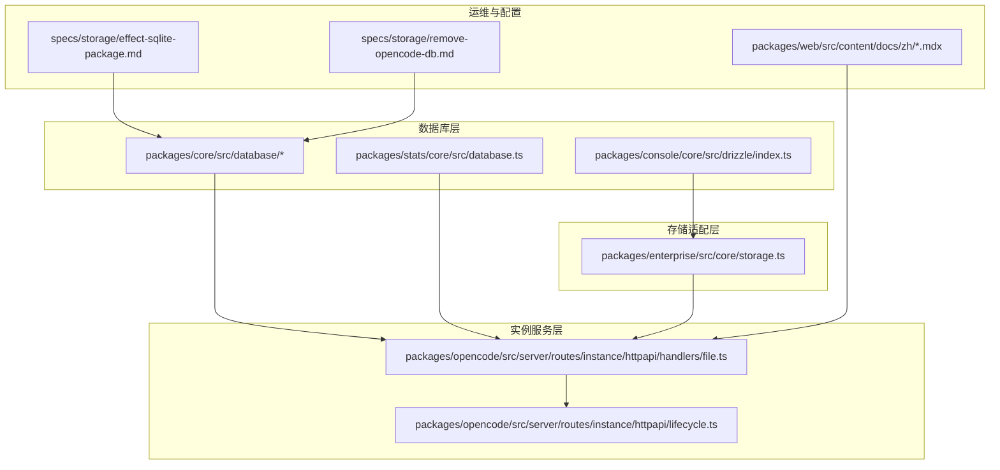
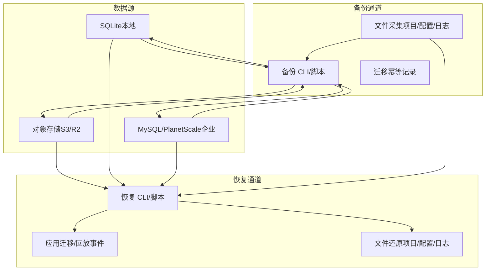
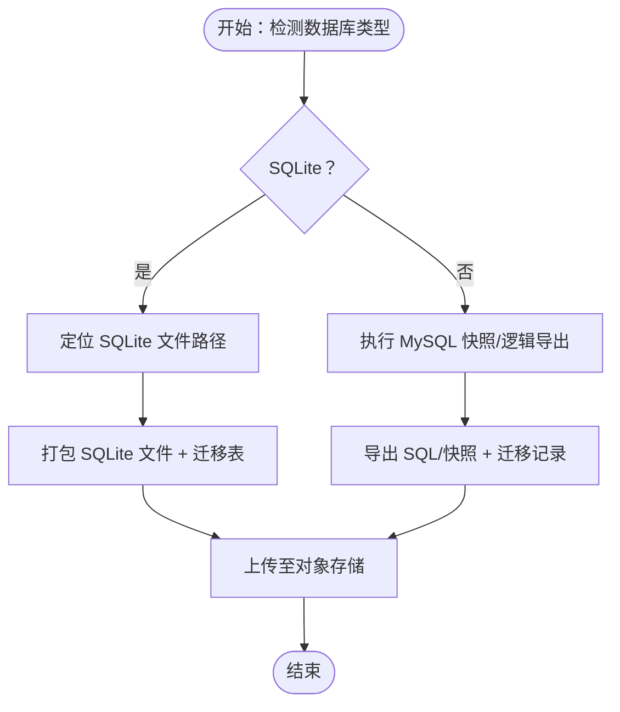
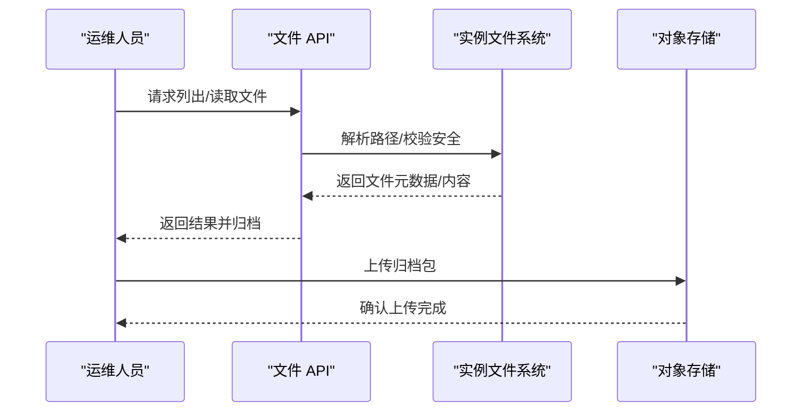
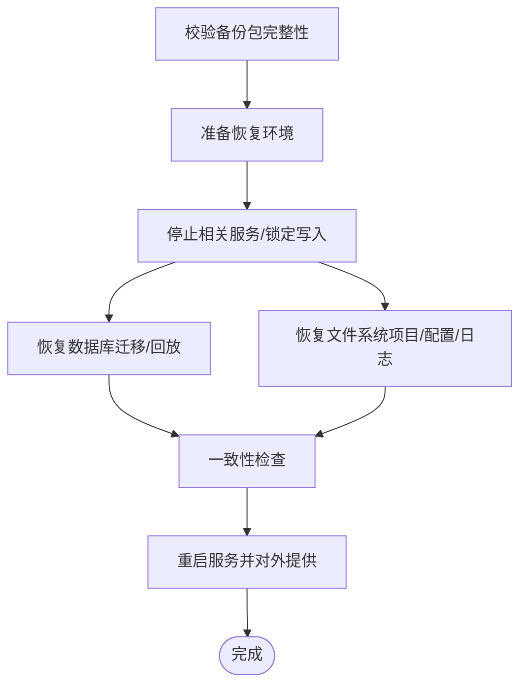
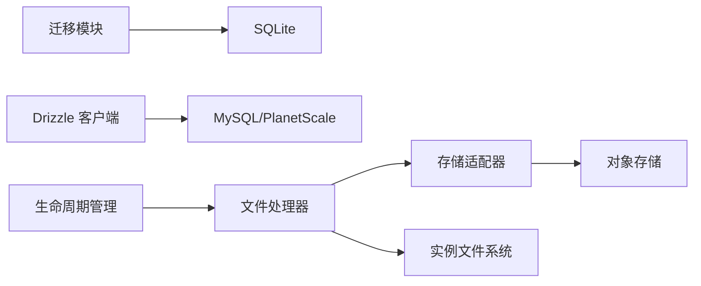

# 数据备份与恢复

<cite>
**本文引用的文件**
- [packages/core/src/database/migration.ts](file://packages/core/src/database/migration.ts)
- [packages/core/src/database/sqlite.ts](file://packages/core/src/database/sqlite.ts)
- [packages/stats/core/src/database.ts](file://packages/stats/core/src/database.ts)
- [packages/enterprise/src/core/storage.ts](file://packages/enterprise/src/core/storage.ts)
- [packages/opencode/src/server/routes/instance/httpapi/handlers/file.ts](file://packages/opencode/src/server/routes/instance/httpapi/handlers/file.ts)
- [packages/opencode/src/server/routes/instance/httpapi/lifecycle.ts](file://packages/opencode/src/server/routes/instance/httpapi/lifecycle.ts)
- [packages/web/src/content/docs/zh/index.mdx](file://packages/web/src/content/docs/zh/index.mdx)
- [packages/web/src/content/docs/zh/troubleshooting.mdx](file://packages/web/src/content/docs/zh/troubleshooting.mdx)
- [packages/web/src/content/docs/zh/config.mdx](file://packages/web/src/content/docs/zh/config.mdx)
- [packages/console/core/src/drizzle/index.ts](file://packages/console/core/src/drizzle/index.ts)
- [specs/storage/effect-sqlite-package.md](file://specs/storage/effect-sqlite-package.md)
- [specs/storage/remove-opencode-db.md](file://specs/storage/remove-opencode-db.md)
</cite>

## 目录
1. [简介](#简介)
2. [项目结构](#项目结构)
3. [核心组件](#核心组件)
4. [架构总览](#架构总览)
5. [详细组件分析](#详细组件分析)
6. [依赖关系分析](#依赖关系分析)
7. [性能考量](#性能考量)
8. [故障排除指南](#故障排除指南)
9. [结论](#结论)
10. [附录](#附录)

## 简介
本运维文档面向 OpenCode 的数据备份与恢复机制，聚焦以下目标：
- 设计并实现数据库备份策略（全量、增量、定时），覆盖本地 SQLite 与企业级 MySQL/PlanetScale 场景
- 规范文件系统数据备份方法（项目文件、配置文件、临时文件）
- 明确数据恢复流程（备份文件验证、恢复过程监控、数据一致性检查）
- 制定灾难恢复应急预案（数据丢失处理、系统故障恢复、业务连续性保障）
- 提出备份存储安全要求（加密存储、访问控制、备份文件管理）
- 给出可执行的操作示例与故障排除指引

## 项目结构
OpenCode 在不同模块中分别承载“数据库迁移与连接”、“企业级对象存储适配”、“实例文件系统访问”以及“运维文档与配置说明”。下图展示与备份恢复相关的关键路径。

**图表来源**
- [packages/core/src/database/migration.ts:18-81](file://packages/core/src/database/migration.ts#L18-L81)
- [packages/core/src/database/sqlite.ts:8-8](file://packages/core/src/database/sqlite.ts#L8-L8)
- [packages/stats/core/src/database.ts:38-38](file://packages/stats/core/src/database.ts#L38-L38)
- [packages/console/core/src/drizzle/index.ts:11-85](file://packages/console/core/src/drizzle/index.ts#L11-L85)
- [packages/enterprise/src/core/storage.ts:4-129](file://packages/enterprise/src/core/storage.ts#L4-L129)
- [packages/opencode/src/server/routes/instance/httpapi/handlers/file.ts:1-117](file://packages/opencode/src/server/routes/instance/httpapi/handlers/file.ts#L1-L117)
- [packages/opencode/src/server/routes/instance/httpapi/lifecycle.ts:1-35](file://packages/opencode/src/server/routes/instance/httpapi/lifecycle.ts#L1-L35)
- [specs/storage/effect-sqlite-package.md](file://specs/storage/effect-sqlite-package.md)
- [specs/storage/remove-opencode-db.md](file://specs/storage/remove-opencode-db.md)

**章节来源**
- [packages/core/src/database/migration.ts:18-81](file://packages/core/src/database/migration.ts#L18-L81)
- [packages/enterprise/src/core/storage.ts:4-129](file://packages/enterprise/src/core/storage.ts#L4-L129)
- [packages/opencode/src/server/routes/instance/httpapi/handlers/file.ts:1-117](file://packages/opencode/src/server/routes/instance/httpapi/handlers/file.ts#L1-L117)
- [packages/opencode/src/server/routes/instance/httpapi/lifecycle.ts:1-35](file://packages/opencode/src/server/routes/instance/httpapi/lifecycle.ts#L1-L35)
- [packages/web/src/content/docs/zh/index.mdx](file://packages/web/src/content/docs/zh/index.mdx)
- [packages/web/src/content/docs/zh/troubleshooting.mdx](file://packages/web/src/content/docs/zh/troubleshooting.mdx)
- [packages/web/src/content/docs/zh/config.mdx](file://packages/web/src/content/docs/zh/config.mdx)
- [specs/storage/effect-sqlite-package.md](file://specs/storage/effect-sqlite-package.md)
- [specs/storage/remove-opencode-db.md](file://specs/storage/remove-opencode-db.md)

## 核心组件
- 数据库迁移与版本控制：负责 SQLite 初始化、迁移应用与幂等记录，确保数据库结构演进安全可控。
- 企业级对象存储适配：提供统一的读写/列举/删除接口，支持 S3/R2 等后端，便于将备份归档到对象存储。
- 实例文件系统访问：封装文件内容读取、目录遍历、文本检索等能力，支撑项目文件与日志的备份采集。
- 生命周期与处置：在请求响应完成后进行实例资源回收，避免备份过程中资源泄漏。
- 运维与配置：提供配置优先级、远程配置、自定义路径等说明，指导备份脚本如何定位与访问配置与数据。

**章节来源**
- [packages/core/src/database/migration.ts:18-81](file://packages/core/src/database/migration.ts#L18-L81)
- [packages/enterprise/src/core/storage.ts:4-129](file://packages/enterprise/src/core/storage.ts#L4-L129)
- [packages/opencode/src/server/routes/instance/httpapi/handlers/file.ts:1-117](file://packages/opencode/src/server/routes/instance/httpapi/handlers/file.ts#L1-L117)
- [packages/opencode/src/server/routes/instance/httpapi/lifecycle.ts:1-35](file://packages/opencode/src/server/routes/instance/httpapi/lifecycle.ts#L1-L35)
- [packages/web/src/content/docs/zh/config.mdx:117-162](file://packages/web/src/content/docs/zh/config.mdx#L117-L162)

## 架构总览
下图展示备份与恢复在系统中的位置与交互关系，强调“数据源（SQLite/MySQL/对象存储）—备份介质（本地/对象存储）—恢复入口（迁移/文件回放）”。

**图表来源**
- [packages/core/src/database/migration.ts:18-81](file://packages/core/src/database/migration.ts#L18-L81)
- [packages/enterprise/src/core/storage.ts:4-129](file://packages/enterprise/src/core/storage.ts#L4-L129)
- [packages/opencode/src/server/routes/instance/httpapi/handlers/file.ts:1-117](file://packages/opencode/src/server/routes/instance/httpapi/handlers/file.ts#L1-L117)

## 详细组件分析

### 数据库备份策略设计与实现
- 全量备份
  - SQLite：通过迁移层提供的幂等机制，结合数据库文件打包，形成可直接恢复的全量镜像；迁移表用于记录已执行的迁移，避免重复应用。
  - MySQL/PlanetScale：使用逻辑导出或物理快照，配合迁移记录（如迁移表）进行一致性校验。
- 增量备份
  - 基于迁移时间戳或事件序列号，仅备份新增/变更的迁移或事件，降低带宽与存储开销。
- 定时备份
  - 结合调度器（如 GitHub Actions 或系统计划任务），按固定周期触发备份作业，并在失败时告警。

**图表来源**
- [packages/core/src/database/migration.ts:18-81](file://packages/core/src/database/migration.ts#L18-L81)
- [packages/console/core/src/drizzle/index.ts:11-85](file://packages/console/core/src/drizzle/index.ts#L11-L85)
- [packages/enterprise/src/core/storage.ts:4-129](file://packages/enterprise/src/core/storage.ts#L4-L129)

**章节来源**
- [packages/core/src/database/migration.ts:18-81](file://packages/core/src/database/migration.ts#L18-L81)
- [packages/console/core/src/drizzle/index.ts:11-85](file://packages/console/core/src/drizzle/index.ts#L11-L85)
- [packages/enterprise/src/core/storage.ts:4-129](file://packages/enterprise/src/core/storage.ts#L4-L129)

### 文件系统数据备份方法
- 项目文件备份
  - 使用文件 API 获取目录树与文件内容，过滤忽略规则，生成清单与归档。
- 配置文件备份
  - 按配置优先级定位配置文件与目录，纳入备份范围，确保恢复后能快速复原运行环境。
- 临时文件处理
  - 将缓存、索引、日志等临时文件纳入备份策略，但需注意敏感信息清理与去重。

**图表来源**
- [packages/opencode/src/server/routes/instance/httpapi/handlers/file.ts:1-117](file://packages/opencode/src/server/routes/instance/httpapi/handlers/file.ts#L1-L117)
- [packages/enterprise/src/core/storage.ts:4-129](file://packages/enterprise/src/core/storage.ts#L4-L129)

**章节来源**
- [packages/opencode/src/server/routes/instance/httpapi/handlers/file.ts:1-117](file://packages/opencode/src/server/routes/instance/httpapi/handlers/file.ts#L1-L117)
- [packages/web/src/content/docs/zh/config.mdx:117-162](file://packages/web/src/content/docs/zh/config.mdx#L117-L162)

### 数据恢复流程
- 备份文件验证
  - 对象存储中的备份包进行完整性校验（哈希/签名），确认版本与时间戳。
- 恢复过程监控
  - 通过日志与进度条反馈恢复阶段（迁移/解压/写入），异常时自动回滚。
- 数据一致性检查
  - 应用迁移后比对迁移表与目标状态，文件恢复后比对清单与实际文件。

**图表来源**
- [packages/core/src/database/migration.ts:18-81](file://packages/core/src/database/migration.ts#L18-L81)
- [packages/opencode/src/server/routes/instance/httpapi/lifecycle.ts:1-35](file://packages/opencode/src/server/routes/instance/httpapi/lifecycle.ts#L1-L35)

**章节来源**
- [packages/core/src/database/migration.ts:18-81](file://packages/core/src/database/migration.ts#L18-L81)
- [packages/opencode/src/server/routes/instance/httpapi/lifecycle.ts:1-35](file://packages/opencode/src/server/routes/instance/httpapi/lifecycle.ts#L1-L35)

### 灾难恢复应急预案
- 数据丢失处理
  - 启动最近可用备份，优先恢复数据库与关键配置，再逐步补齐文件。
- 系统故障恢复
  - 通过生命周期钩子在响应后回收实例资源，避免长时间占用导致恢复阻塞。
- 业务连续性保障
  - 使用只读降级、多副本与异地容灾策略，缩短 RTO/RPO。

**章节来源**
- [packages/opencode/src/server/routes/instance/httpapi/lifecycle.ts:1-35](file://packages/opencode/src/server/routes/instance/httpapi/lifecycle.ts#L1-L35)
- [packages/web/src/content/docs/zh/troubleshooting.mdx](file://packages/web/src/content/docs/zh/troubleshooting.mdx)

### 备份存储安全考虑
- 加密存储
  - 对象存储启用传输与静态加密，备份包采用签名或哈希校验。
- 访问控制
  - 使用最小权限原则，限制访问密钥与桶权限，定期轮换凭据。
- 备份文件管理
  - 设置生命周期策略，过期备份自动清理；保留多个版本以应对误删。

**章节来源**
- [packages/enterprise/src/core/storage.ts:4-129](file://packages/enterprise/src/core/storage.ts#L4-L129)

## 依赖关系分析
- 数据库层依赖
  - SQLite 迁移与初始化由迁移模块负责；MySQL/PlanetScale 通过 drizzle 客户端连接。
- 存储适配层
  - 企业存储适配器抽象了 S3/R2 的读写/列举/删除，供备份脚本统一调用。
- 实例服务层
  - 文件 API 负责安全地读取与列举文件；生命周期模块负责资源回收。

**图表来源**
- [packages/core/src/database/migration.ts:18-81](file://packages/core/src/database/migration.ts#L18-L81)
- [packages/console/core/src/drizzle/index.ts:11-85](file://packages/console/core/src/drizzle/index.ts#L11-L85)
- [packages/enterprise/src/core/storage.ts:4-129](file://packages/enterprise/src/core/storage.ts#L4-L129)
- [packages/opencode/src/server/routes/instance/httpapi/handlers/file.ts:1-117](file://packages/opencode/src/server/routes/instance/httpapi/handlers/file.ts#L1-L117)
- [packages/opencode/src/server/routes/instance/httpapi/lifecycle.ts:1-35](file://packages/opencode/src/server/routes/instance/httpapi/lifecycle.ts#L1-L35)

**章节来源**
- [packages/core/src/database/migration.ts:18-81](file://packages/core/src/database/migration.ts#L18-L81)
- [packages/console/core/src/drizzle/index.ts:11-85](file://packages/console/core/src/drizzle/index.ts#L11-L85)
- [packages/enterprise/src/core/storage.ts:4-129](file://packages/enterprise/src/core/storage.ts#L4-L129)
- [packages/opencode/src/server/routes/instance/httpapi/handlers/file.ts:1-117](file://packages/opencode/src/server/routes/instance/httpapi/handlers/file.ts#L1-L117)
- [packages/opencode/src/server/routes/instance/httpapi/lifecycle.ts:1-35](file://packages/opencode/src/server/routes/instance/httpapi/lifecycle.ts#L1-L35)

## 性能考量
- 备份窗口与并发
  - 控制并发度，避免与在线写入冲突；对大文件采用分块上传与断点续传。
- 存储与网络
  - 选择就近对象存储，启用压缩与去重；合理设置分片大小与超时。
- 恢复速度
  - 预热热点数据，优先恢复数据库与核心配置，再恢复文件系统。

## 故障排除指南
- 数据库无法初始化或迁移失败
  - 检查迁移表是否存在与完整性；确认数据库为空或具备正确的迁移基线。
- 文件读取异常
  - 校验路径是否逃逸实例根目录；确认文件编码与二进制安全读取。
- 对象存储上传失败
  - 校验凭据与桶权限；检查网络与签名；确认对象键命名规范。
- 恢复后不一致
  - 对比迁移时间戳与事件序列；重新应用缺失的迁移或回放事件。

**章节来源**
- [packages/core/src/database/migration.ts:18-81](file://packages/core/src/database/migration.ts#L18-L81)
- [packages/opencode/src/server/routes/instance/httpapi/handlers/file.ts:1-117](file://packages/opencode/src/server/routes/instance/httpapi/handlers/file.ts#L1-L117)
- [packages/enterprise/src/core/storage.ts:4-129](file://packages/enterprise/src/core/storage.ts#L4-L129)
- [packages/web/src/content/docs/zh/troubleshooting.mdx](file://packages/web/src/content/docs/zh/troubleshooting.mdx)

## 结论
通过将数据库迁移与对象存储适配相结合，并辅以严格的文件系统采集与生命周期管理，OpenCode 可构建一套覆盖全量/增量/定时的备份体系，并在恢复流程中实现验证、监控与一致性检查。配合安全策略与应急预案，可有效保障业务连续性与数据安全。

## 附录
- 备份操作示例（步骤化）
  - 步骤 1：确定备份范围（数据库/文件）
  - 步骤 2：执行全量备份（打包 SQLite/导出 MySQL/采集文件）
  - 步骤 3：上传至对象存储并记录元数据
  - 步骤 4：验证备份完整性
  - 步骤 5：按需执行定时备份
- 恢复操作示例（步骤化）
  - 步骤 1：选择可用备份并下载
  - 步骤 2：停止写入并锁定数据库
  - 步骤 3：恢复数据库并应用迁移
  - 步骤 4：恢复文件系统并校验清单
  - 步骤 5：启动服务并验证功能