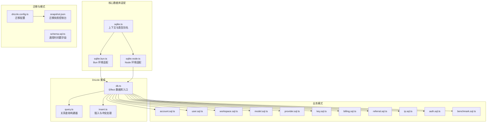
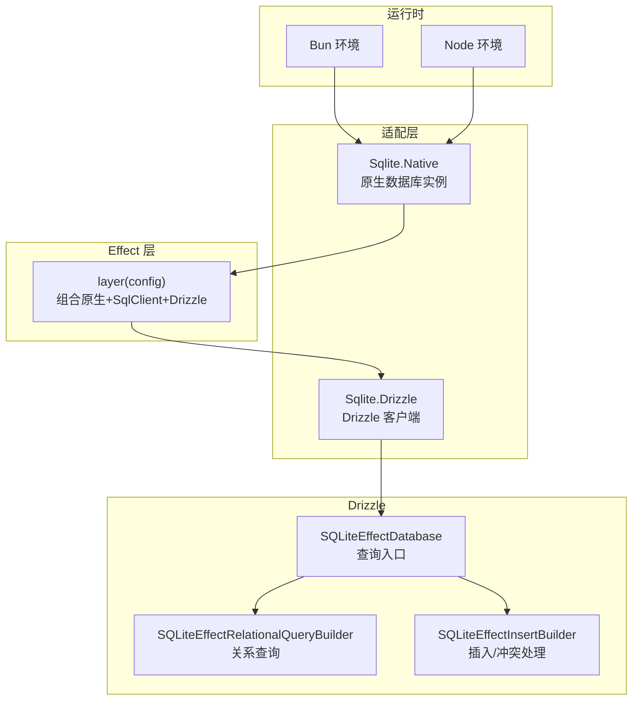
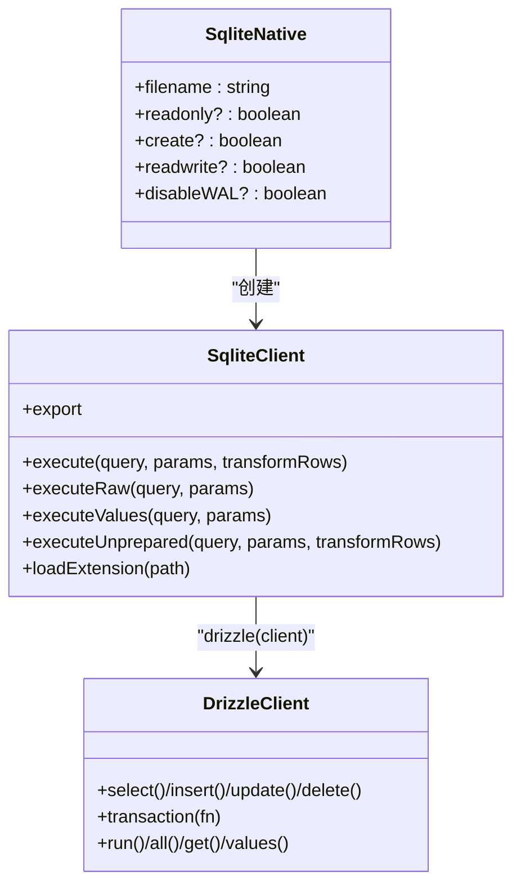
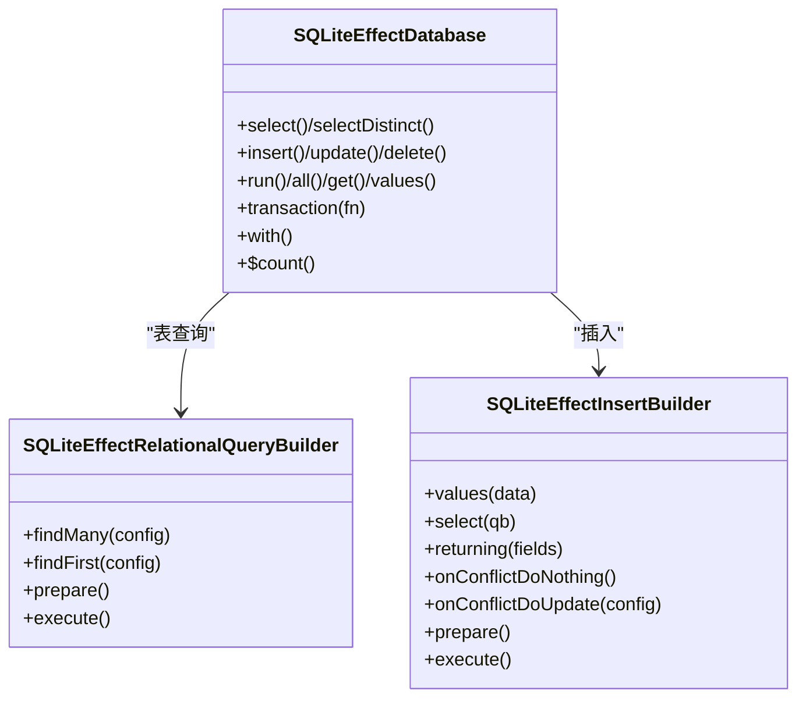
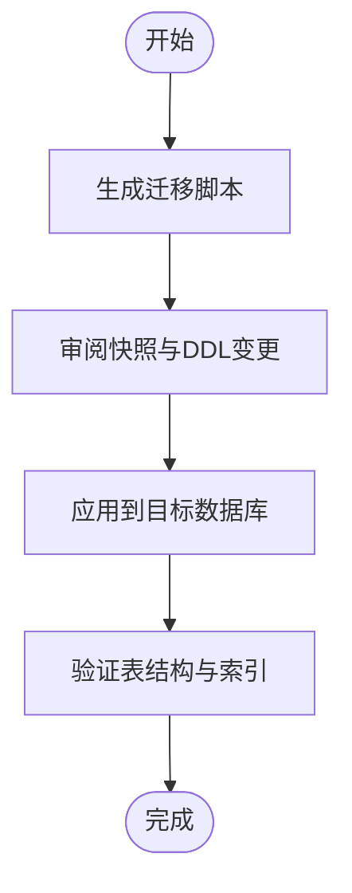
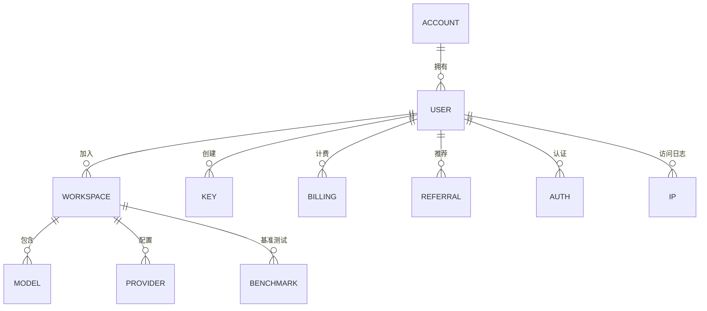
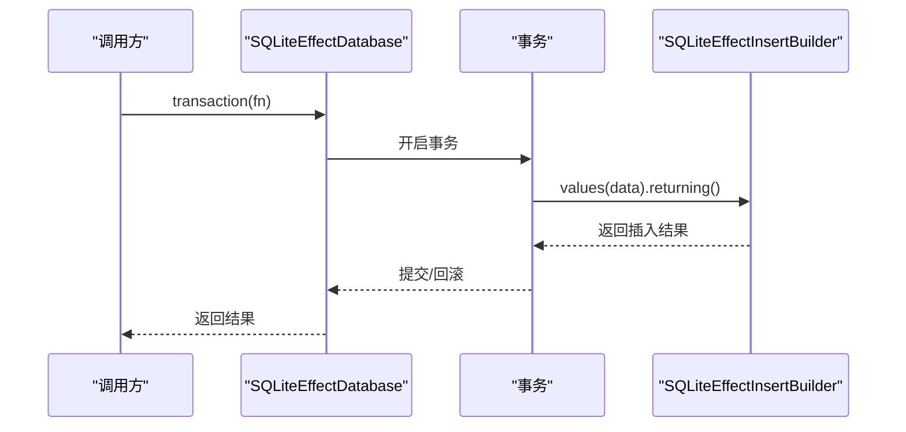
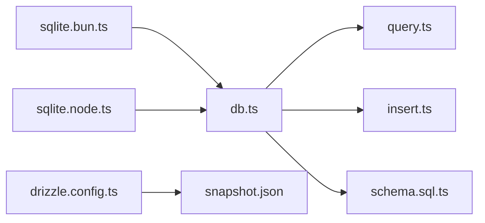

# 数据库设计

<cite>
**本文引用的文件**
- [packages/core/src/database/sqlite.ts](file://packages/core/src/database/sqlite.ts)
- [packages/core/src/database/sqlite.bun.ts](file://packages/core/src/database/sqlite.bun.ts)
- [packages/core/src/database/sqlite.node.ts](file://packages/core/src/database/sqlite.node.ts)
- [packages/core/drizzle.config.ts](file://packages/core/drizzle.config.ts)
- [packages/core/src/database/schema.sql.ts](file://packages/core/src/database/schema.sql.ts)
- [packages/effect-drizzle-sqlite/src/sqlite-core/effect/db.ts](file://packages/effect-drizzle-sqlite/src/sqlite-core/effect/db.ts)
- [packages/effect-drizzle-sqlite/src/sqlite-core/effect/query.ts](file://packages/effect-drizzle-sqlite/src/sqlite-core/effect/query.ts)
- [packages/effect-drizzle-sqlite/src/sqlite-core/effect/insert.ts](file://packages/effect-drizzle-sqlite/src/sqlite-core/effect/insert.ts)
- [packages/console/core/migrations/20250902065410_fluffy_raza/snapshot.json](file://packages/console/core/migrations/20250902065410_fluffy_raza/snapshot.json)
- [packages/console/core/migrations/20250903035359_serious_whistler/snapshot.json](file://packages/console/core/migrations/20250903035359_serious_whistler/snapshot.json)
- [packages/console/core/migrations/20250911133331_violet_loners/snapshot.json](file://packages/console/core/migrations/20250911133331_violet_loners/snapshot.json)
- [packages/console/core/migrations/20250911141957_dusty_clint_barton/snapshot.json](file://packages/console/core/migrations/20250911141957_dusty_clint_barton/snapshot.json)
- [packages/console/core/migrations/20250911214917_first_mockingbird/snapshot.json](file://packages/console/core/migrations/20250911214917_first_mockingbird/snapshot.json)
- [packages/console/core/migrations/20250911231144_jazzy_skrulls/snapshot.json](file://packages/console/core/migrations/20250911231144_jazzy_skrulls/snapshot.json)
- [packages/console/core/migrations/20250912021148_parallel_gauntlet/snapshot.json](file://packages/console/core/migrations/20250912021148_parallel_gauntlet/snapshot.json)
- [packages/console/core/migrations/20250912161749_familiar_nightshade/snapshot.json](file://packages/console/core/migrations/20250912161749_familiar_nightshade/snapshot.json)
- [packages/console/core/migrations/20250914213824_eminent_ultimatum/snapshot.json](file://packages/console/core/migrations/20250914213824_eminent_ultimatum/snapshot.json)
- [packages/console/core/migrations/20250914222302_redundant_piledriver/snapshot.json](file://packages/console/core/migrations/20250914222302_redundant_piledriver/snapshot.json)
- [packages/console/core/src/schema/account.sql.ts](file://packages/console/core/src/schema/account.sql.ts)
- [packages/console/core/src/schema/user.sql.ts](file://packages/console/core/src/schema/user.sql.ts)
- [packages/console/core/src/schema/workspace.sql.ts](file://packages/console/core/src/schema/workspace.sql.ts)
- [packages/console/core/src/schema/model.sql.ts](file://packages/console/core/src/schema/model.sql.ts)
- [packages/console/core/src/schema/provider.sql.ts](file://packages/console/core/src/schema/provider.sql.ts)
- [packages/console/core/src/schema/key.sql.ts](file://packages/console/core/src/schema/key.sql.ts)
- [packages/console/core/src/schema/billing.sql.ts](file://packages/console/core/src/schema/billing.sql.ts)
- [packages/console/core/src/schema/referral.sql.ts](file://packages/console/core/src/schema/referral.sql.ts)
- [packages/console/core/src/schema/ip.sql.ts](file://packages/console/core/src/schema/ip.sql.ts)
- [packages/console/core/src/schema/auth.sql.ts](file://packages/console/core/src/schema/auth.sql.ts)
- [packages/console/core/src/schema/benchmark.sql.ts](file://packages/console/core/src/schema/benchmark.sql.ts)
</cite>

## 目录
1. [简介](#简介)
2. [项目结构](#项目结构)
3. [核心组件](#核心组件)
4. [架构总览](#架构总览)
5. [详细组件分析](#详细组件分析)
6. [依赖分析](#依赖分析)
7. [性能考虑](#性能考虑)
8. [故障排查指南](#故障排查指南)
9. [结论](#结论)
10. [附录](#附录)

## 简介
本文件面向 OpenCode 的数据库设计，系统化阐述以下主题：
- SQLite 数据库选择的原因与适用场景
- 基于 Drizzle ORM 的数据库架构设计与表结构规划
- Drizzle ORM 在 Effect 生态中的配置与使用（连接管理、查询构建器、类型安全查询）
- 数据库迁移策略（版本管理、向后兼容性、生产部署注意事项）
- 数据模型设计原则（实体关系映射、主键外键设计、索引优化）
- 典型数据库操作示例（CRUD、复杂查询、事务处理）
- 性能优化技巧与最佳实践

## 项目结构
OpenCode 将数据库能力抽象为多包协作：
- 核心数据库适配层：分别针对 Bun 与 Node 的 SQLite 实现，统一通过 Effect 上下文与层（Layer）注入
- Drizzle 集成：在 Effect 生态中提供类型安全的查询构建器与事务支持
- 迁移与模式：基于 Drizzle Kit 的迁移生成与快照，配合各业务模块的 schema 定义
- 控制台与统计模块：提供完整的业务表结构与迁移快照作为参考

**图表来源**
- [packages/core/src/database/sqlite.ts:1-9](file://packages/core/src/database/sqlite.ts#L1-L9)
- [packages/core/src/database/sqlite.bun.ts:1-184](file://packages/core/src/database/sqlite.bun.ts#L1-L184)
- [packages/core/src/database/sqlite.node.ts:1-179](file://packages/core/src/database/sqlite.node.ts#L1-L179)
- [packages/effect-drizzle-sqlite/src/sqlite-core/effect/db.ts:1-297](file://packages/effect-drizzle-sqlite/src/sqlite-core/effect/db.ts#L1-L297)
- [packages/effect-drizzle-sqlite/src/sqlite-core/effect/query.ts:1-199](file://packages/effect-drizzle-sqlite/src/sqlite-core/effect/query.ts#L1-L199)
- [packages/effect-drizzle-sqlite/src/sqlite-core/effect/insert.ts:1-350](file://packages/effect-drizzle-sqlite/src/sqlite-core/effect/insert.ts#L1-L350)
- [packages/core/drizzle.config.ts:1-11](file://packages/core/drizzle.config.ts#L1-L11)
- [packages/console/core/migrations/20250902065410_fluffy_raza/snapshot.json:1-58](file://packages/console/core/migrations/20250902065410_fluffy_raza/snapshot.json#L1-L58)

**章节来源**
- [packages/core/src/database/sqlite.ts:1-9](file://packages/core/src/database/sqlite.ts#L1-L9)
- [packages/core/src/database/sqlite.bun.ts:1-184](file://packages/core/src/database/sqlite.bun.ts#L1-L184)
- [packages/core/src/database/sqlite.node.ts:1-179](file://packages/core/src/database/sqlite.node.ts#L1-L179)
- [packages/effect-drizzle-sqlite/src/sqlite-core/effect/db.ts:1-297](file://packages/effect-drizzle-sqlite/src/sqlite-core/effect/db.ts#L1-L297)
- [packages/effect-drizzle-sqlite/src/sqlite-core/effect/query.ts:1-199](file://packages/effect-drizzle-sqlite/src/sqlite-core/effect/query.ts#L1-L199)
- [packages/effect-drizzle-sqlite/src/sqlite-core/effect/insert.ts:1-350](file://packages/effect-drizzle-sqlite/src/sqlite-core/effect/insert.ts#L1-L350)
- [packages/core/drizzle.config.ts:1-11](file://packages/core/drizzle.config.ts#L1-L11)

## 核心组件
- SQLite 适配层（Bun/Node 双栈）
  - 统一通过 Effect Context 注入原生 SQLite 客户端，并封装为 SqlClient 接口
  - 提供只读/可写/创建等参数化配置，自动启用 WAL 模式（除非禁用或只读）
  - 支持扩展加载与数据库导出
- Drizzle 集成
  - 将原生客户端包装为 drizzle 客户端，提供类型安全的查询构建器、关系查询、插入与冲突处理
  - 通过 Effect 层（Layer）提供全局可用的 Drizzle 客户端实例
- 迁移与模式
  - 使用 Drizzle Kit 生成迁移，快照记录表结构演进
  - 业务 schema 分布在各模块目录，统一由 drizzle.config.ts 扫描

**章节来源**
- [packages/core/src/database/sqlite.bun.ts:154-183](file://packages/core/src/database/sqlite.bun.ts#L154-L183)
- [packages/core/src/database/sqlite.node.ts:147-178](file://packages/core/src/database/sqlite.node.ts#L147-L178)
- [packages/effect-drizzle-sqlite/src/sqlite-core/effect/db.ts:30-240](file://packages/effect-drizzle-sqlite/src/sqlite-core/effect/db.ts#L30-L240)
- [packages/core/drizzle.config.ts:1-11](file://packages/core/drizzle.config.ts#L1-L11)

## 架构总览
OpenCode 的数据库架构以“适配层 + Drizzle ORM + Effect 层”为核心，结合迁移与业务模式，形成可维护、可扩展的数据层。

**图表来源**
- [packages/core/src/database/sqlite.bun.ts:154-183](file://packages/core/src/database/sqlite.bun.ts#L154-L183)
- [packages/core/src/database/sqlite.node.ts:147-178](file://packages/core/src/database/sqlite.node.ts#L147-L178)
- [packages/effect-drizzle-sqlite/src/sqlite-core/effect/db.ts:30-240](file://packages/effect-drizzle-sqlite/src/sqlite-core/effect/db.ts#L30-L240)
- [packages/effect-drizzle-sqlite/src/sqlite-core/effect/query.ts:21-69](file://packages/effect-drizzle-sqlite/src/sqlite-core/effect/query.ts#L21-L69)
- [packages/effect-drizzle-sqlite/src/sqlite-core/effect/insert.ts:128-194](file://packages/effect-drizzle-sqlite/src/sqlite-core/effect/insert.ts#L128-L194)

## 详细组件分析

### SQLite 适配层（Bun 与 Node）
- 功能要点
  - 原生数据库实例生命周期管理与关闭钩子
  - 将原生语句执行封装为 Effect，统一错误分类与返回
  - 通过信号量实现串行化事务获取，避免并发冲突
  - 自动启用 WAL 模式（只读时不启用），提升并发读取性能
  - 支持扩展加载与数据库导出
- 关键差异
  - Bun 使用异步查询接口与 safeIntegers
  - Node 使用同步数据库与 prepare/enableForeignKeyConstraints

**图表来源**
- [packages/core/src/database/sqlite.bun.ts:31-45](file://packages/core/src/database/sqlite.bun.ts#L31-L45)
- [packages/core/src/database/sqlite.bun.ts:154-183](file://packages/core/src/database/sqlite.bun.ts#L154-L183)
- [packages/core/src/database/sqlite.node.ts:30-41](file://packages/core/src/database/sqlite.node.ts#L30-L41)
- [packages/core/src/database/sqlite.node.ts:147-178](file://packages/core/src/database/sqlite.node.ts#L147-L178)

**章节来源**
- [packages/core/src/database/sqlite.bun.ts:47-152](file://packages/core/src/database/sqlite.bun.ts#L47-L152)
- [packages/core/src/database/sqlite.node.ts:47-145](file://packages/core/src/database/sqlite.node.ts#L47-L145)

### Drizzle ORM 查询构建器与类型安全
- 数据库入口
  - SQLiteEffectDatabase 提供 select/insert/update/delete/run/all/get/values/transaction 等入口
  - 支持 with 子查询与缓存失效接口
- 关系查询
  - SQLiteEffectRelationalQueryBuilder 支持 findMany/findFirst，内部构建关系查询并准备执行
- 插入与冲突处理
  - SQLiteEffectInsertBuilder 支持 values/select 两种方式，返回 returning 字段
  - onConflictDoNothing/onConflictDoUpdate 提供 SQLite 原生冲突策略

**图表来源**
- [packages/effect-drizzle-sqlite/src/sqlite-core/effect/db.ts:168-240](file://packages/effect-drizzle-sqlite/src/sqlite-core/effect/db.ts#L168-L240)
- [packages/effect-drizzle-sqlite/src/sqlite-core/effect/query.ts:21-69](file://packages/effect-drizzle-sqlite/src/sqlite-core/effect/query.ts#L21-L69)
- [packages/effect-drizzle-sqlite/src/sqlite-core/effect/insert.ts:128-194](file://packages/effect-drizzle-sqlite/src/sqlite-core/effect/insert.ts#L128-L194)

**章节来源**
- [packages/effect-drizzle-sqlite/src/sqlite-core/effect/db.ts:30-240](file://packages/effect-drizzle-sqlite/src/sqlite-core/effect/db.ts#L30-L240)
- [packages/effect-drizzle-sqlite/src/sqlite-core/effect/query.ts:76-199](file://packages/effect-drizzle-sqlite/src/sqlite-core/effect/query.ts#L76-L199)
- [packages/effect-drizzle-sqlite/src/sqlite-core/effect/insert.ts:223-350](file://packages/effect-drizzle-sqlite/src/sqlite-core/effect/insert.ts#L223-L350)

### 数据库迁移策略与版本管理
- 迁移生成
  - drizzle.config.ts 指定方言为 sqlite，扫描 schema 路径，输出到 migration 目录
- 快照演进
  - 各模块迁移包含 snapshot.json，记录表结构、列定义、主键与索引等元数据
  - 控制台模块迁移覆盖 account、user、workspace、model、provider、key、billing、referral、ip、auth、benchmark 等表
- 版本管理与兼容性
  - 通过 prevIds 串联迁移历史，确保回滚与升级路径清晰
  - 保持列类型与约束的向后兼容，必要时使用可选字段或默认值
- 生产部署注意事项
  - 部署前先执行迁移，确保目标数据库 schema 与快照一致
  - 对于 WAL 模式，注意备份策略与并发读写场景下的稳定性

**图表来源**
- [packages/core/drizzle.config.ts:1-11](file://packages/core/drizzle.config.ts#L1-L11)
- [packages/console/core/migrations/20250902065410_fluffy_raza/snapshot.json:1-58](file://packages/console/core/migrations/20250902065410_fluffy_raza/snapshot.json#L1-L58)
- [packages/console/core/migrations/20250903035359_serious_whistler/snapshot.json:1-58](file://packages/console/core/migrations/20250903035359_serious_whistler/snapshot.json#L1-L58)

**章节来源**
- [packages/core/drizzle.config.ts:1-11](file://packages/core/drizzle.config.ts#L1-L11)
- [packages/console/core/migrations/20250902065410_fluffy_raza/snapshot.json:1-58](file://packages/console/core/migrations/20250902065410_fluffy_raza/snapshot.json#L1-L58)
- [packages/console/core/migrations/20250903035359_serious_whistler/snapshot.json:1-58](file://packages/console/core/migrations/20250903035359_serious_whistler/snapshot.json#L1-L58)
- [packages/console/core/migrations/20250911133331_violet_loners/snapshot.json:1-58](file://packages/console/core/migrations/20250911133331_violet_loners/snapshot.json#L1-L58)

### 数据模型设计原则与表结构规划
- 实体关系映射
  - 业务表分布在 console/core/src/schema 下，涵盖账户、用户、工作区、模型、提供商、密钥、账单、推荐、IP、认证、基准测试等
  - 通过 Drizzle 的关系查询构建器实现跨表关联
- 主键与外键
  - 快照显示各表存在 PRIMARY 键定义；外键约束需在迁移中显式声明（如启用外键约束）
- 时间戳设计
  - 通用时间戳字段通过 schema.sql.ts 定义，统一创建与更新时间
- 索引优化
  - 建议对高频过滤/排序字段建立索引；对唯一性字段建立唯一索引
  - 利用快照中的列定义识别潜在索引点

**图表来源**
- [packages/console/core/src/schema/account.sql.ts](file://packages/console/core/src/schema/account.sql.ts)
- [packages/console/core/src/schema/user.sql.ts](file://packages/console/core/src/schema/user.sql.ts)
- [packages/console/core/src/schema/workspace.sql.ts](file://packages/console/core/src/schema/workspace.sql.ts)
- [packages/console/core/src/schema/model.sql.ts](file://packages/console/core/src/schema/model.sql.ts)
- [packages/console/core/src/schema/provider.sql.ts](file://packages/console/core/src/schema/provider.sql.ts)
- [packages/console/core/src/schema/key.sql.ts](file://packages/console/core/src/schema/key.sql.ts)
- [packages/console/core/src/schema/billing.sql.ts](file://packages/console/core/src/schema/billing.sql.ts)
- [packages/console/core/src/schema/referral.sql.ts](file://packages/console/core/src/schema/referral.sql.ts)
- [packages/console/core/src/schema/auth.sql.ts](file://packages/console/core/src/schema/auth.sql.ts)
- [packages/console/core/src/schema/ip.sql.ts](file://packages/console/core/src/schema/ip.sql.ts)
- [packages/console/core/src/schema/benchmark.sql.ts](file://packages/console/core/src/schema/benchmark.sql.ts)

**章节来源**
- [packages/console/core/src/schema/account.sql.ts](file://packages/console/core/src/schema/account.sql.ts)
- [packages/console/core/src/schema/user.sql.ts](file://packages/console/core/src/schema/user.sql.ts)
- [packages/console/core/src/schema/workspace.sql.ts](file://packages/console/core/src/schema/workspace.sql.ts)
- [packages/console/core/src/schema/model.sql.ts](file://packages/console/core/src/schema/model.sql.ts)
- [packages/console/core/src/schema/provider.sql.ts](file://packages/console/core/src/schema/provider.sql.ts)
- [packages/console/core/src/schema/key.sql.ts](file://packages/console/core/src/schema/key.sql.ts)
- [packages/console/core/src/schema/billing.sql.ts](file://packages/console/core/src/schema/billing.sql.ts)
- [packages/console/core/src/schema/referral.sql.ts](file://packages/console/core/src/schema/referral.sql.ts)
- [packages/console/core/src/schema/auth.sql.ts](file://packages/console/core/src/schema/auth.sql.ts)
- [packages/console/core/src/schema/ip.sql.ts](file://packages/console/core/src/schema/ip.sql.ts)
- [packages/console/core/src/schema/benchmark.sql.ts](file://packages/console/core/src/schema/benchmark.sql.ts)
- [packages/core/src/database/schema.sql.ts:1-11](file://packages/core/src/database/schema.sql.ts#L1-L11)

### 数据库操作示例（流程图）
- CRUD 操作
  - 查询：使用 SQLiteEffectDatabase.select/findFirst/findMany
  - 插入：使用 SQLiteEffectInsertBuilder.values/select，支持 returning
  - 更新/删除：使用 update/delete 构建器
- 复杂查询
  - with 子查询与 $with 别名查询
  - 关系查询通过 RelationalQueryBuilder 自动拼接
- 事务处理
  - 使用 database.transaction 包裹多个操作，失败自动回滚

**图表来源**
- [packages/effect-drizzle-sqlite/src/sqlite-core/effect/db.ts:236-240](file://packages/effect-drizzle-sqlite/src/sqlite-core/effect/db.ts#L236-L240)
- [packages/effect-drizzle-sqlite/src/sqlite-core/effect/insert.ts:142-166](file://packages/effect-drizzle-sqlite/src/sqlite-core/effect/insert.ts#L142-L166)

**章节来源**
- [packages/effect-drizzle-sqlite/src/sqlite-core/effect/db.ts:168-240](file://packages/effect-drizzle-sqlite/src/sqlite-core/effect/db.ts#L168-L240)
- [packages/effect-drizzle-sqlite/src/sqlite-core/effect/insert.ts:223-350](file://packages/effect-drizzle-sqlite/src/sqlite-core/effect/insert.ts#L223-L350)

## 依赖分析
- 组件耦合
  - 适配层与 Drizzle 层通过 Effect Context 解耦，便于在不同运行时切换
  - 迁移与模式解耦于业务表结构，通过 drizzle.config.ts 统一扫描
- 外部依赖
  - Bun/Node 原生 SQLite 库
  - Drizzle ORM 与 Effect 生态（Effect/Context/Layer/Semaphore/Stream）

**图表来源**
- [packages/core/src/database/sqlite.bun.ts:171-176](file://packages/core/src/database/sqlite.bun.ts#L171-L176)
- [packages/core/src/database/sqlite.node.ts:166-171](file://packages/core/src/database/sqlite.node.ts#L166-L171)
- [packages/effect-drizzle-sqlite/src/sqlite-core/effect/db.ts:30-77](file://packages/effect-drizzle-sqlite/src/sqlite-core/effect/db.ts#L30-L77)
- [packages/core/drizzle.config.ts:1-11](file://packages/core/drizzle.config.ts#L1-L11)
- [packages/core/src/database/schema.sql.ts:1-11](file://packages/core/src/database/schema.sql.ts#L1-L11)

**章节来源**
- [packages/core/src/database/sqlite.bun.ts:171-176](file://packages/core/src/database/sqlite.bun.ts#L171-L176)
- [packages/core/src/database/sqlite.node.ts:166-171](file://packages/core/src/database/sqlite.node.ts#L166-L171)
- [packages/effect-drizzle-sqlite/src/sqlite-core/effect/db.ts:30-77](file://packages/effect-drizzle-sqlite/src/sqlite-core/effect/db.ts#L30-L77)
- [packages/core/drizzle.config.ts:1-11](file://packages/core/drizzle.config.ts#L1-L11)
- [packages/core/src/database/schema.sql.ts:1-11](file://packages/core/src/database/schema.sql.ts#L1-L11)

## 性能考虑
- 并发与锁
  - 通过信号量串行化事务获取，避免竞争条件
  - WAL 模式提升并发读取吞吐，但需注意备份一致性
- 查询优化
  - 使用关系查询构建器减少 N+1 查询
  - 对高频字段建立索引，避免全表扫描
- 类型安全与编译期检查
  - Drizzle 的类型推断减少运行时错误，提高开发效率
- 大数据量场景
  - 分页查询与批量插入
  - 合理使用 returning 与预编译查询

[本节为通用指导，不直接分析具体文件]

## 故障排查指南
- 常见问题
  - 事务未释放导致阻塞：确认事务作用域正确结束，使用 Effect.finalizer 或中断保护
  - 冲突处理：onConflictDoNothing/onConflictDoUpdate 参数校验与 where 条件设置
  - 扩展加载失败：检查扩展路径与权限
- 错误分类
  - 使用 SqlError 与 classifySqliteError 对异常进行分类与定位
- 建议流程
  - 记录操作与参数，定位失败语句
  - 校验迁移快照与当前数据库结构一致性
  - 在只读/禁用 WAL 场景下验证行为差异

**章节来源**
- [packages/core/src/database/sqlite.bun.ts:56-86](file://packages/core/src/database/sqlite.bun.ts#L56-L86)
- [packages/core/src/database/sqlite.node.ts:56-87](file://packages/core/src/database/sqlite.node.ts#L56-L87)
- [packages/effect-drizzle-sqlite/src/sqlite-core/effect/insert.ts:260-295](file://packages/effect-drizzle-sqlite/src/sqlite-core/effect/insert.ts#L260-L295)

## 结论
OpenCode 的数据库设计以 SQLite 为核心，结合 Drizzle ORM 与 Effect 生态，实现了：
- 跨平台（Bun/Node）的一致适配
- 类型安全的查询构建与事务管理
- 清晰的迁移与模式演进
- 可扩展的业务表结构与索引策略
遵循本文给出的设计原则与最佳实践，可在开发与生产环境中稳定地维护与扩展数据库层。

[本节为总结性内容，不直接分析具体文件]

## 附录
- 快照示例（节选）
  - 控制台模块迁移快照展示表结构与列定义
- 业务表清单
  - account、user、workspace、model、provider、key、billing、referral、ip、auth、benchmark

**章节来源**
- [packages/console/core/migrations/20250902065410_fluffy_raza/snapshot.json:1-58](file://packages/console/core/migrations/20250902065410_fluffy_raza/snapshot.json#L1-L58)
- [packages/console/core/migrations/20250903035359_serious_whistler/snapshot.json:1-58](file://packages/console/core/migrations/20250903035359_serious_whistler/snapshot.json#L1-L58)
- [packages/console/core/migrations/20250911133331_violet_loners/snapshot.json:1-58](file://packages/console/core/migrations/20250911133331_violet_loners/snapshot.json#L1-L58)
- [packages/console/core/migrations/20250911141957_dusty_clint_barton/snapshot.json:1-58](file://packages/console/core/migrations/20250911141957_dusty_clint_barton/snapshot.json#L1-L58)
- [packages/console/core/migrations/20250911214917_first_mockingbird/snapshot.json:1-58](file://packages/console/core/migrations/20250911214917_first_mockingbird/snapshot.json#L1-L58)
- [packages/console/core/migrations/20250911231144_jazzy_skrulls/snapshot.json:1-58](file://packages/console/core/migrations/20250911231144_jazzy_skrulls/snapshot.json#L1-L58)
- [packages/console/core/migrations/20250912021148_parallel_gauntlet/snapshot.json:1-58](file://packages/console/core/migrations/20250912021148_parallel_gauntlet/snapshot.json#L1-L58)
- [packages/console/core/migrations/20250912161749_familiar_nightshade/snapshot.json:1-58](file://packages/console/core/migrations/20250912161749_familiar_nightshade/snapshot.json#L1-L58)
- [packages/console/core/migrations/20250914213824_eminent_ultimatum/snapshot.json:1-58](file://packages/console/core/migrations/20250914213824_eminent_ultimatum/snapshot.json#L1-L58)
- [packages/console/core/migrations/20250914222302_redundant_piledriver/snapshot.json:1-58](file://packages/console/core/migrations/20250914222302_redundant_piledriver/snapshot.json#L1-L58)