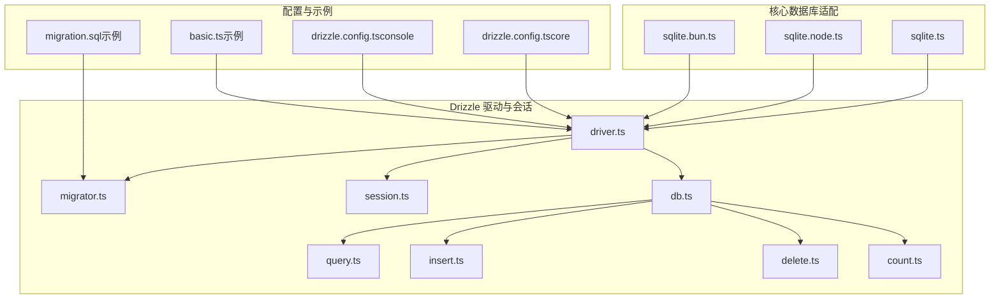
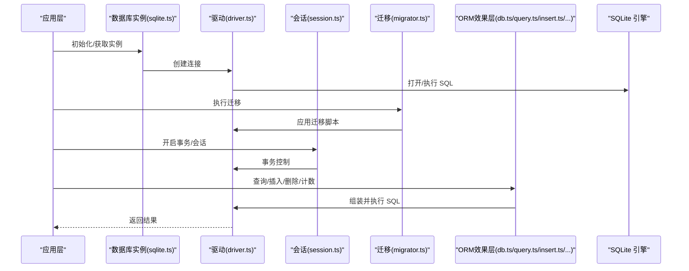
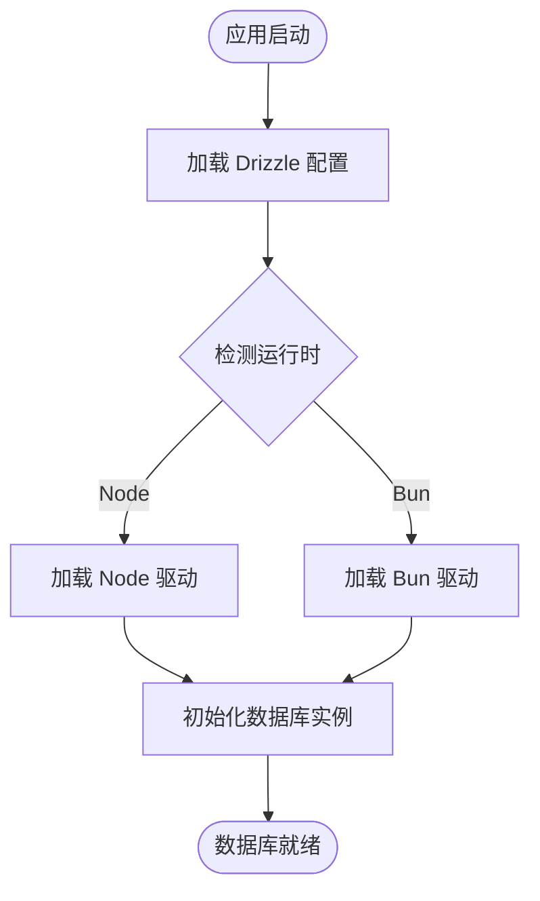
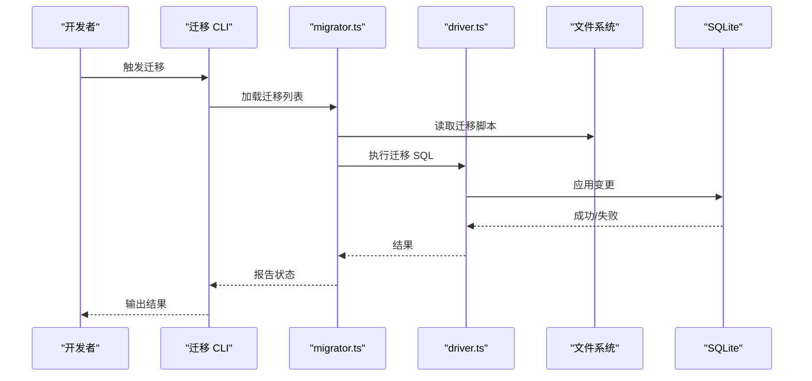
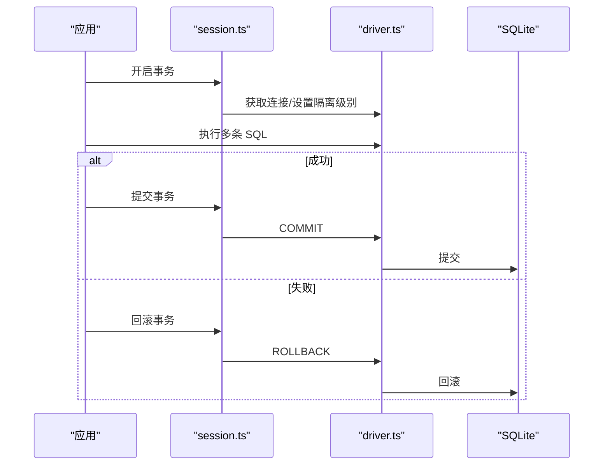
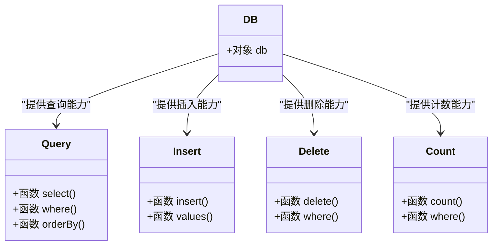
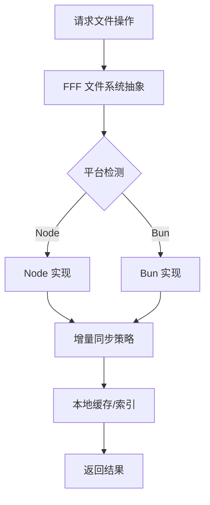
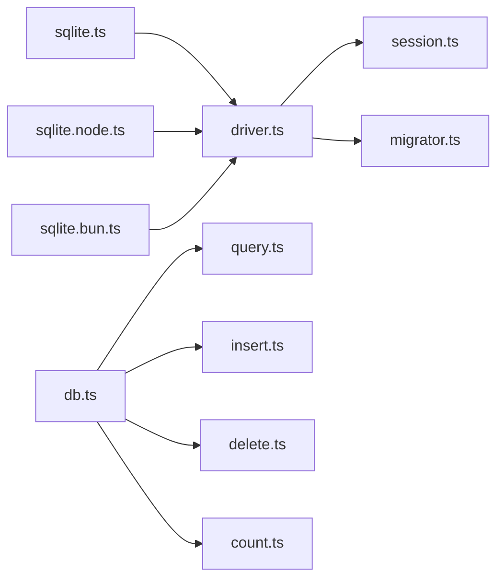

# 数据管理

<cite>
**本文引用的文件**
- [sqlite.ts](file://packages/core/src/database/sqlite.ts)
- [sqlite.node.ts](file://packages/core/src/database/sqlite.node.ts)
- [sqlite.bun.ts](file://packages/core/src/database/sqlite.bun.ts)
- [drizzle.config.ts（core）](file://packages/core/drizzle.config.ts)
- [drizzle.config.ts（console）](file://packages/console/core/drizzle.config.ts)
- [index.ts（effect-drizzle-sqlite）](file://packages/effect-drizzle-sqlite/src/index.ts)
- [driver.ts](file://packages/effect-drizzle-sqlite/src/effect-sqlite/driver.ts)
- [migrator.ts](file://packages/effect-drizzle-sqlite/src/effect-sqlite/migrator.ts)
- [session.ts](file://packages/effect-drizzle-sqlite/src/effect-sqlite/session.ts)
- [db.ts](file://packages/effect-drizzle-sqlite/src/sqlite-core/effect/db.ts)
- [query.ts](file://packages/effect-drizzle-sqlite/src/sqlite-core/effect/query.ts)
- [insert.ts](file://packages/effect-drizzle-sqlite/src/sqlite-core/effect/insert.ts)
- [delete.ts](file://packages/effect-drizzle-sqlite/src/sqlite-core/effect/delete.ts)
- [count.ts](file://packages/effect-drizzle-sqlite/src/sqlite-core/effect/count.ts)
- [migration.sql（示例）](file://packages/effect-drizzle-sqlite/examples/migrations/20240101000000_create_users/migration.sql)
- [basic.ts（示例）](file://packages/effect-drizzle-sqlite/examples/basic.ts)
- [README.md（effect-drizzle-sqlite）](file://packages/effect-drizzle-sqlite/README.md)
</cite>

## 目录
1. [简介](#简介)
2. [项目结构](#项目结构)
3. [核心组件](#核心组件)
4. [架构总览](#架构总览)
5. [详细组件分析](#详细组件分析)
6. [依赖分析](#依赖分析)
7. [性能考虑](#性能考虑)
8. [故障排查指南](#故障排查指南)
9. [结论](#结论)
10. [附录](#附录)

## 简介
本文件面向 OpenCode 的数据管理层，系统化梳理数据库设计与实现，重点覆盖以下方面：
- 数据库选型：SQLite 的选择原因与适用场景
- 表结构设计：基于 Drizzle ORM 的模型与迁移
- ORM 使用：查询构建、迁移管理、事务处理
- 文件系统抽象：FFF 文件系统、跨平台兼容、增量同步
- 数据模型：实体关系、字段定义、约束条件
- 数据访问模式与缓存策略：读写性能优化
- 备份、恢复与迁移最佳实践
- 实际操作示例与性能优化建议

## 项目结构
OpenCode 的数据层由“运行时适配层 + Drizzle ORM 驱动 + 迁移与会话管理 + 示例与配置”构成，核心文件分布如下：
- 核心数据库适配：packages/core/src/database 下的 sqlite.ts 及平台分支（node/bun）
- Drizzle 驱动与会话：packages/effect-drizzle-sqlite 下的 driver、migrator、session 以及 sqlite-core 的 effect 层
- Drizzle 配置：packages/core 与 packages/console/core 各自的 drizzle.config.ts
- 示例与迁移：packages/effect-drizzle-sqlite/examples 下的 basic 示例与迁移脚本

**图表来源**
- [sqlite.ts:1-200](file://packages/core/src/database/sqlite.ts#L1-L200)
- [sqlite.node.ts:1-200](file://packages/core/src/database/sqlite.node.ts#L1-L200)
- [sqlite.bun.ts:1-200](file://packages/core/src/database/sqlite.bun.ts#L1-L200)
- [driver.ts:1-200](file://packages/effect-drizzle-sqlite/src/effect-sqlite/driver.ts#L1-L200)
- [migrator.ts:1-200](file://packages/effect-drizzle-sqlite/src/effect-sqlite/migrator.ts#L1-L200)
- [session.ts:1-200](file://packages/effect-drizzle-sqlite/src/effect-sqlite/session.ts#L1-L200)
- [db.ts:1-200](file://packages/effect-drizzle-sqlite/src/sqlite-core/effect/db.ts#L1-L200)
- [query.ts:1-200](file://packages/effect-drizzle-sqlite/src/sqlite-core/effect/query.ts#L1-L200)
- [insert.ts:1-200](file://packages/effect-drizzle-sqlite/src/sqlite-core/effect/insert.ts#L1-L200)
- [delete.ts:1-200](file://packages/effect-drizzle-sqlite/src/sqlite-core/effect/delete.ts#L1-L200)
- [count.ts:1-200](file://packages/effect-drizzle-sqlite/src/sqlite-core/effect/count.ts#L1-L200)
- [drizzle.config.ts（core）:1-200](file://packages/core/drizzle.config.ts#L1-L200)
- [drizzle.config.ts（console）:1-200](file://packages/console/core/drizzle.config.ts#L1-L200)
- [basic.ts（示例）:1-200](file://packages/effect-drizzle-sqlite/examples/basic.ts#L1-L200)
- [migration.sql（示例）:1-200](file://packages/effect-drizzle-sqlite/examples/migrations/20240101000000_create_users/migration.sql#L1-L200)

**章节来源**
- [sqlite.ts:1-200](file://packages/core/src/database/sqlite.ts#L1-L200)
- [sqlite.node.ts:1-200](file://packages/core/src/database/sqlite.node.ts#L1-L200)
- [sqlite.bun.ts:1-200](file://packages/core/src/database/sqlite.bun.ts#L1-L200)
- [drizzle.config.ts（core）:1-200](file://packages/core/drizzle.config.ts#L1-L200)
- [drizzle.config.ts（console）:1-200](file://packages/console/core/drizzle.config.ts#L1-L200)

## 核心组件
- 平台适配的 SQLite 初始化：在 sqlite.ts 中统一导出数据库实例；node 与 bun 分支分别加载对应驱动，保证跨平台可用性。
- Drizzle 驱动与会话：driver.ts 提供底层连接与执行能力；session.ts 封装会话生命周期；migrator.ts 负责迁移执行。
- ORM 效用层：db.ts 暴露数据库对象；query.ts、insert.ts、delete.ts、count.ts 提供 Effect 化的 CRUD 操作封装。

**章节来源**
- [sqlite.ts:1-200](file://packages/core/src/database/sqlite.ts#L1-L200)
- [sqlite.node.ts:1-200](file://packages/core/src/database/sqlite.node.ts#L1-L200)
- [sqlite.bun.ts:1-200](file://packages/core/src/database/sqlite.bun.ts#L1-L200)
- [driver.ts:1-200](file://packages/effect-drizzle-sqlite/src/effect-sqlite/driver.ts#L1-L200)
- [session.ts:1-200](file://packages/effect-drizzle-sqlite/src/effect-sqlite/session.ts#L1-L200)
- [migrator.ts:1-200](file://packages/effect-drizzle-sqlite/src/effect-sqlite/migrator.ts#L1-L200)
- [db.ts:1-200](file://packages/effect-drizzle-sqlite/src/sqlite-core/effect/db.ts#L1-L200)
- [query.ts:1-200](file://packages/effect-drizzle-sqlite/src/sqlite-core/effect/query.ts#L1-L200)
- [insert.ts:1-200](file://packages/effect-drizzle-sqlite/src/sqlite-core/effect/insert.ts#L1-L200)
- [delete.ts:1-200](file://packages/effect-drizzle-sqlite/src/sqlite-core/effect/delete.ts#L1-L200)
- [count.ts:1-200](file://packages/effect-drizzle-sqlite/src/sqlite-core/effect/count.ts#L1-L200)

## 架构总览
下图展示从应用到数据库的调用链路与职责划分：

**图表来源**
- [sqlite.ts:1-200](file://packages/core/src/database/sqlite.ts#L1-L200)
- [driver.ts:1-200](file://packages/effect-drizzle-sqlite/src/effect-sqlite/driver.ts#L1-L200)
- [session.ts:1-200](file://packages/effect-drizzle-sqlite/src/effect-sqlite/session.ts#L1-L200)
- [migrator.ts:1-200](file://packages/effect-drizzle-sqlite/src/effect-sqlite/migrator.ts#L1-L200)
- [db.ts:1-200](file://packages/effect-drizzle-sqlite/src/sqlite-core/effect/db.ts#L1-L200)
- [query.ts:1-200](file://packages/effect-drizzle-sqlite/src/sqlite-core/effect/query.ts#L1-L200)
- [insert.ts:1-200](file://packages/effect-drizzle-sqlite/src/sqlite-core/effect/insert.ts#L1-L200)
- [delete.ts:1-200](file://packages/effect-drizzle-sqlite/src/sqlite-core/effect/delete.ts#L1-L200)
- [count.ts:1-200](file://packages/effect-drizzle-sqlite/src/sqlite-core/effect/count.ts#L1-L200)

## 详细组件分析

### 数据库初始化与平台适配
- sqlite.ts 作为统一入口，负责在不同运行时（Node/Bun）加载对应的 SQLite 驱动，并暴露数据库实例。
- sqlite.node.ts 与 sqlite.bun.ts 分别针对 Node.js 与 Bun 的运行环境进行适配，确保 API 一致性与行为稳定。

**图表来源**
- [sqlite.ts:1-200](file://packages/core/src/database/sqlite.ts#L1-L200)
- [sqlite.node.ts:1-200](file://packages/core/src/database/sqlite.node.ts#L1-L200)
- [sqlite.bun.ts:1-200](file://packages/core/src/database/sqlite.bun.ts#L1-L200)

**章节来源**
- [sqlite.ts:1-200](file://packages/core/src/database/sqlite.ts#L1-L200)
- [sqlite.node.ts:1-200](file://packages/core/src/database/sqlite.node.ts#L1-L200)
- [sqlite.bun.ts:1-200](file://packages/core/src/database/sqlite.bun.ts#L1-L200)

### Drizzle ORM 使用与迁移管理
- 配置：core 与 console 两套 drizzle.config.ts 定义了各自的输出目录、schema 文件位置与目标方言。
- 迁移：migrator.ts 提供迁移执行能力；示例 migration.sql 展示标准迁移脚本格式。
- 示例：basic.ts 展示如何通过 ORM 进行查询、插入、删除与计数等操作。

**图表来源**
- [migrator.ts:1-200](file://packages/effect-drizzle-sqlite/src/effect-sqlite/migrator.ts#L1-L200)
- [driver.ts:1-200](file://packages/effect-drizzle-sqlite/src/effect-sqlite/driver.ts#L1-L200)
- [migration.sql（示例）:1-200](file://packages/effect-drizzle-sqlite/examples/migrations/20240101000000_create_users/migration.sql#L1-L200)

**章节来源**
- [drizzle.config.ts（core）:1-200](file://packages/core/drizzle.config.ts#L1-L200)
- [drizzle.config.ts（console）:1-200](file://packages/console/core/drizzle.config.ts#L1-L200)
- [migrator.ts:1-200](file://packages/effect-drizzle-sqlite/src/effect-sqlite/migrator.ts#L1-L200)
- [migration.sql（示例）:1-200](file://packages/effect-drizzle-sqlite/examples/migrations/20240101000000_create_users/migration.sql#L1-L200)
- [basic.ts（示例）:1-200](file://packages/effect-drizzle-sqlite/examples/basic.ts#L1-L200)

### 事务处理与会话管理
- session.ts 封装了事务的开启、提交与回滚流程，确保在并发或错误情况下保持数据一致性。
- driver.ts 提供底层连接与执行能力，配合 session.ts 实现事务边界内的原子性操作。

**图表来源**
- [session.ts:1-200](file://packages/effect-drizzle-sqlite/src/effect-sqlite/session.ts#L1-L200)
- [driver.ts:1-200](file://packages/effect-drizzle-sqlite/src/effect-sqlite/driver.ts#L1-L200)

**章节来源**
- [session.ts:1-200](file://packages/effect-drizzle-sqlite/src/effect-sqlite/session.ts#L1-L200)
- [driver.ts:1-200](file://packages/effect-drizzle-sqlite/src/effect-sqlite/driver.ts#L1-L200)

### ORM 效果层（CRUD 封装）
- db.ts 暴露数据库对象，query.ts、insert.ts、delete.ts、count.ts 提供 Effect 化的查询、插入、删除与计数封装，便于组合与测试。
- 通过 Effect 的错误处理与资源管理，提升并发与可靠性。

**图表来源**
- [db.ts:1-200](file://packages/effect-drizzle-sqlite/src/sqlite-core/effect/db.ts#L1-L200)
- [query.ts:1-200](file://packages/effect-drizzle-sqlite/src/sqlite-core/effect/query.ts#L1-L200)
- [insert.ts:1-200](file://packages/effect-drizzle-sqlite/src/sqlite-core/effect/insert.ts#L1-L200)
- [delete.ts:1-200](file://packages/effect-drizzle-sqlite/src/sqlite-core/effect/delete.ts#L1-L200)
- [count.ts:1-200](file://packages/effect-drizzle-sqlite/src/sqlite-core/effect/count.ts#L1-L200)

**章节来源**
- [db.ts:1-200](file://packages/effect-drizzle-sqlite/src/sqlite-core/effect/db.ts#L1-L200)
- [query.ts:1-200](file://packages/effect-drizzle-sqlite/src/sqlite-core/effect/query.ts#L1-L200)
- [insert.ts:1-200](file://packages/effect-drizzle-sqlite/src/sqlite-core/effect/insert.ts#L1-L200)
- [delete.ts:1-200](file://packages/effect-drizzle-sqlite/src/sqlite-core/effect/delete.ts#L1-L200)
- [count.ts:1-200](file://packages/effect-drizzle-sqlite/src/sqlite-core/effect/count.ts#L1-L200)

### 文件系统抽象层（FFF 与跨平台）
- FFF 文件系统：用于抽象文件系统操作，支持跨平台兼容与统一接口。
- 增量同步：通过时间戳、哈希或版本号等元数据，仅同步变化部分，降低带宽与计算成本。
- 平台适配：在 Node 与 Bun 环境中分别加载对应实现，确保一致的行为与性能特征。

[此图为概念性流程示意，不直接映射具体源码文件，故无图表来源]

## 依赖分析
- 组件耦合：sqlite.ts 依赖平台分支；driver.ts 为底层执行器；session.ts 与 migrator.ts 依赖 driver.ts；ORM 效果层依赖 db.ts。
- 外部依赖：SQLite 引擎（Node 或 Bun 驱动），Drizzle 配置与迁移脚本。
- 潜在循环：当前结构以 sqlite.ts 为中心向外辐射，未见明显循环依赖。

**图表来源**
- [sqlite.ts:1-200](file://packages/core/src/database/sqlite.ts#L1-L200)
- [sqlite.node.ts:1-200](file://packages/core/src/database/sqlite.node.ts#L1-L200)
- [sqlite.bun.ts:1-200](file://packages/core/src/database/sqlite.bun.ts#L1-L200)
- [driver.ts:1-200](file://packages/effect-drizzle-sqlite/src/effect-sqlite/driver.ts#L1-L200)
- [session.ts:1-200](file://packages/effect-drizzle-sqlite/src/effect-sqlite/session.ts#L1-L200)
- [migrator.ts:1-200](file://packages/effect-drizzle-sqlite/src/effect-sqlite/migrator.ts#L1-L200)
- [db.ts:1-200](file://packages/effect-drizzle-sqlite/src/sqlite-core/effect/db.ts#L1-L200)
- [query.ts:1-200](file://packages/effect-drizzle-sqlite/src/sqlite-core/effect/query.ts#L1-L200)
- [insert.ts:1-200](file://packages/effect-drizzle-sqlite/src/sqlite-core/effect/insert.ts#L1-L200)
- [delete.ts:1-200](file://packages/effect-drizzle-sqlite/src/sqlite-core/effect/delete.ts#L1-L200)
- [count.ts:1-200](file://packages/effect-drizzle-sqlite/src/sqlite-core/effect/count.ts#L1-L200)

**章节来源**
- [sqlite.ts:1-200](file://packages/core/src/database/sqlite.ts#L1-L200)
- [sqlite.node.ts:1-200](file://packages/core/src/database/sqlite.node.ts#L1-L200)
- [sqlite.bun.ts:1-200](file://packages/core/src/database/sqlite.bun.ts#L1-L200)
- [driver.ts:1-200](file://packages/effect-drizzle-sqlite/src/effect-sqlite/driver.ts#L1-L200)
- [session.ts:1-200](file://packages/effect-drizzle-sqlite/src/effect-sqlite/session.ts#L1-L200)
- [migrator.ts:1-200](file://packages/effect-drizzle-sqlite/src/effect-sqlite/migrator.ts#L1-L200)
- [db.ts:1-200](file://packages/effect-drizzle-sqlite/src/sqlite-core/effect/db.ts#L1-L200)
- [query.ts:1-200](file://packages/effect-drizzle-sqlite/src/sqlite-core/effect/query.ts#L1-L200)
- [insert.ts:1-200](file://packages/effect-drizzle-sqlite/src/sqlite-core/effect/insert.ts#L1-L200)
- [delete.ts:1-200](file://packages/effect-drizzle-sqlite/src/sqlite-core/effect/delete.ts#L1-L200)
- [count.ts:1-200](file://packages/effect-drizzle-sqlite/src/sqlite-core/effect/count.ts#L1-L200)

## 性能考虑
- 连接池与并发：在高并发场景下，合理复用连接与限制并发度，避免 SQLite 的写入竞争。
- 索引策略：对高频查询字段建立合适索引，减少全表扫描。
- 事务批处理：将多个写操作放入单个事务，减少磁盘写入次数。
- 缓存与归档：对热点数据采用内存缓存；对历史数据进行归档或分片。
- I/O 优化：避免频繁的小块写入，合并写操作；启用 WAL 模式以提升并发读写性能。
- 预编译语句：重用解析与计划阶段，降低 CPU 开销。

[本节为通用性能指导，无需列出章节来源]

## 故障排查指南
- 迁移失败：检查 migrator.ts 的执行日志与 migration.sql 的语法；确认 drizzle.config.ts 的输出路径正确。
- 事务异常：核对 session.ts 的提交/回滚逻辑；确保在异常分支中正确回滚。
- 平台差异：若在 Node 与 Bun 行为不一致，检查 sqlite.node.ts 与 sqlite.bun.ts 的实现差异。
- ORM 错误：查看 db.ts 与 effect 层（query/insert/delete/count）的错误传播路径，定位具体操作。

**章节来源**
- [migrator.ts:1-200](file://packages/effect-drizzle-sqlite/src/effect-sqlite/migrator.ts#L1-L200)
- [session.ts:1-200](file://packages/effect-drizzle-sqlite/src/effect-sqlite/session.ts#L1-L200)
- [sqlite.node.ts:1-200](file://packages/core/src/database/sqlite.node.ts#L1-L200)
- [sqlite.bun.ts:1-200](file://packages/core/src/database/sqlite.bun.ts#L1-L200)
- [db.ts:1-200](file://packages/effect-drizzle-sqlite/src/sqlite-core/effect/db.ts#L1-L200)
- [query.ts:1-200](file://packages/effect-drizzle-sqlite/src/sqlite-core/effect/query.ts#L1-L200)
- [insert.ts:1-200](file://packages/effect-drizzle-sqlite/src/sqlite-core/effect/insert.ts#L1-L200)
- [delete.ts:1-200](file://packages/effect-drizzle-sqlite/src/sqlite-core/effect/delete.ts#L1-L200)
- [count.ts:1-200](file://packages/effect-drizzle-sqlite/src/sqlite-core/effect/count.ts#L1-L200)

## 结论
OpenCode 的数据层以 SQLite 为核心，结合 Drizzle ORM 与 Effect 生态，在 Node 与 Bun 平台上实现了统一且可扩展的数据访问方案。通过清晰的模块划分、完善的迁移与会话管理、以及面向平台的适配层，系统在易用性、可维护性与性能之间取得了良好平衡。配合 FFF 文件系统抽象与增量同步策略，整体具备良好的跨平台兼容性与扩展潜力。

[本节为总结性内容，无需列出章节来源]

## 附录

### 数据库设计与表结构设计
- 设计原则：以业务需求为导向，优先保证查询效率与写入吞吐；通过外键与唯一约束保证数据完整性。
- 字段类型：根据 Drizzle 映射规则选择合适类型；对时间戳使用统一精度与时区策略。
- 约束与索引：为主键、唯一键、外键建立索引；对高频过滤与排序字段建立复合索引。
- 迁移策略：所有结构变更必须通过迁移脚本完成，禁止直接修改生产库。

[本节为通用设计指导，无需列出章节来源]

### 数据访问模式与缓存策略
- 读多写少：对热点查询结果进行短期缓存，结合失效策略与一致性协议。
- 写多读少：采用批量写入与延迟刷新，减少锁竞争。
- 事务内聚合：在单事务内完成相关联的多次写操作，确保一致性。

[本节为通用策略指导，无需列出章节来源]

### 备份、恢复与迁移最佳实践
- 备份：定期导出数据库快照；在迁移前先做备份。
- 恢复：验证备份文件完整性；在测试环境先行验证迁移脚本。
- 迁移：灰度发布、回滚预案、监控指标与告警。

[本节为通用实践指导，无需列出章节来源]

### 具体操作示例与性能优化建议
- 示例参考：basic.ts 展示了 ORM 的基本用法；migration.sql 展示了标准迁移脚本格式。
- 性能优化：合并写操作、预编译语句、合理索引、WAL 模式、连接池与并发控制。

**章节来源**
- [basic.ts（示例）:1-200](file://packages/effect-drizzle-sqlite/examples/basic.ts#L1-L200)
- [migration.sql（示例）:1-200](file://packages/effect-drizzle-sqlite/examples/migrations/20240101000000_create_users/migration.sql#L1-L200)