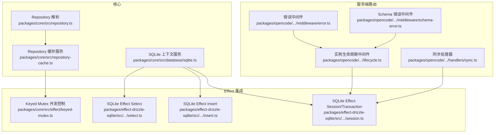
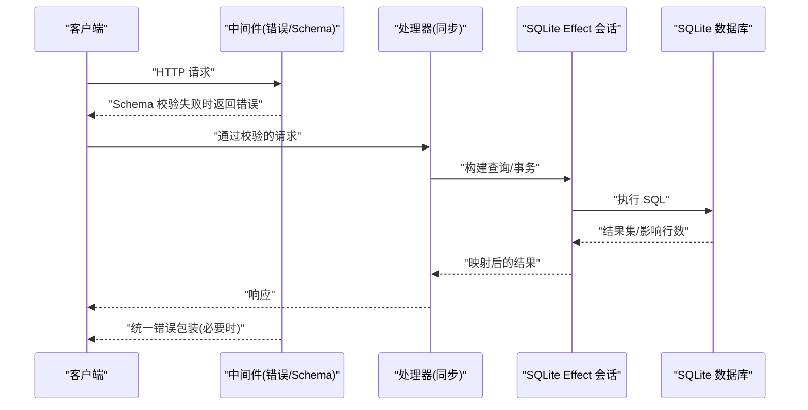
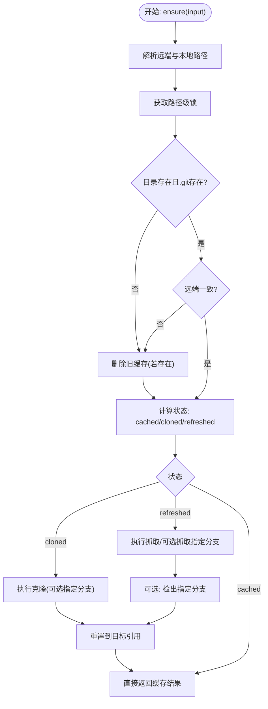
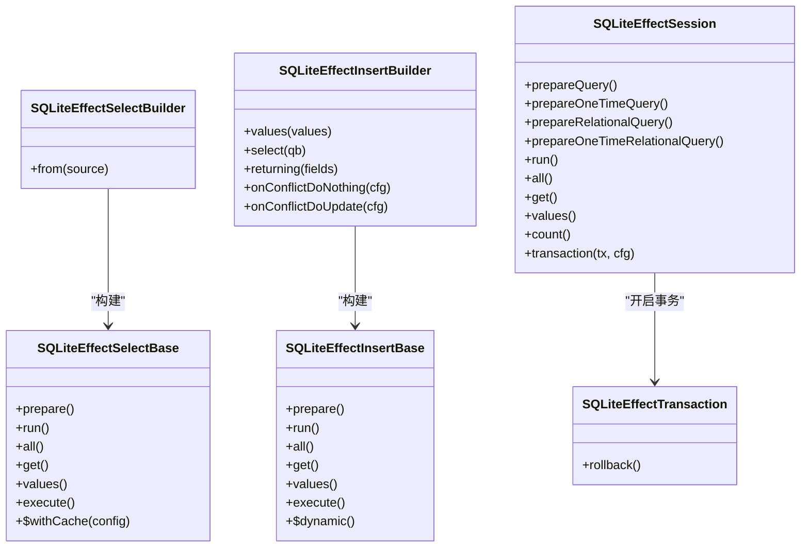
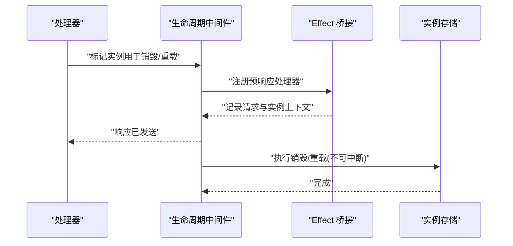
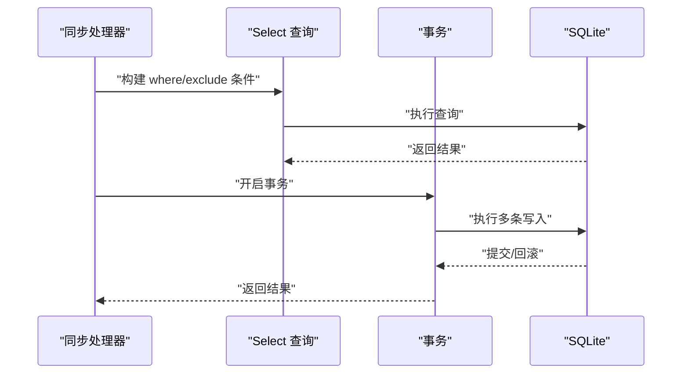
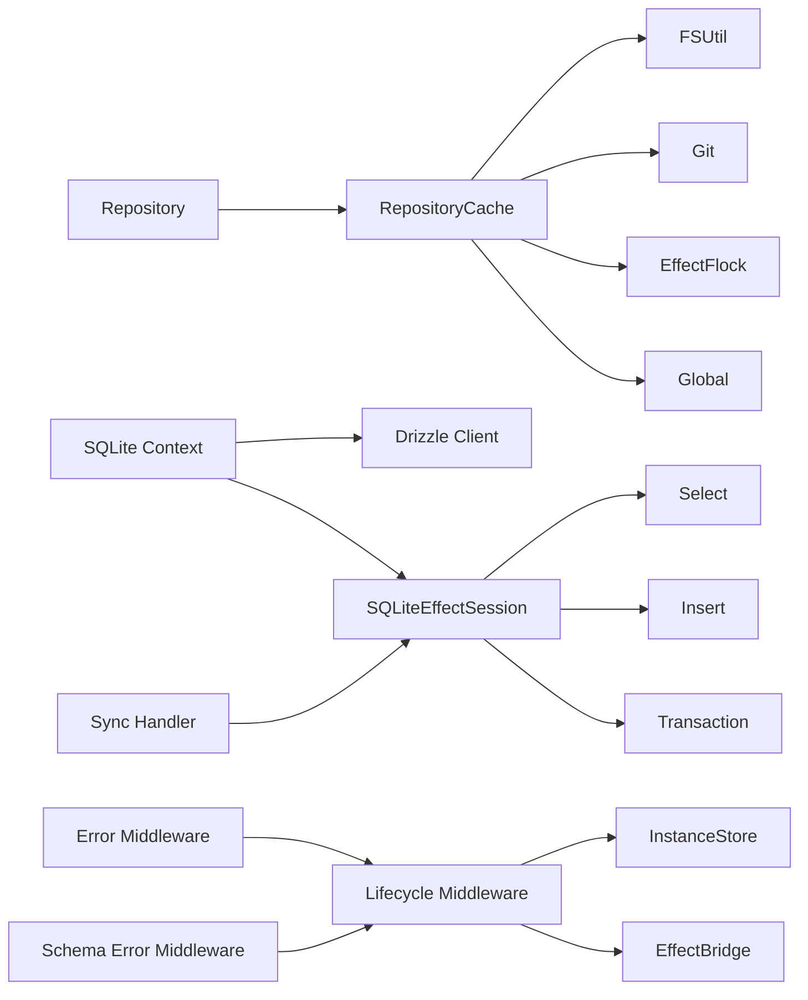

# 数据访问模式

<cite>
**本文引用的文件**
- [packages/core/src/repository.ts](file://packages/core/src/repository.ts)
- [packages/core/src/repository-cache.ts](file://packages/core/src/repository-cache.ts)
- [packages/core/src/database/sqlite.ts](file://packages/core/src/database/sqlite.ts)
- [packages/effect-drizzle-sqlite/src/sqlite-core/effect/select.ts](file://packages/effect-drizzle-sqlite/src/sqlite-core/effect/select.ts)
- [packages/effect-drizzle-sqlite/src/sqlite-core/effect/insert.ts](file://packages/effect-drizzle-sqlite/src/sqlite-core/effect/insert.ts)
- [packages/effect-drizzle-sqlite/src/sqlite-core/effect/session.ts](file://packages/effect-drizzle-sqlite/src/sqlite-core/effect/session.ts)
- [packages/core/src/effect/keyed-mutex.ts](file://packages/core/src/effect/keyed-mutex.ts)
- [packages/opencode/src/server/routes/instance/httpapi/lifecycle.ts](file://packages/opencode/src/server/routes/instance/httpapi/lifecycle.ts)
- [packages/opencode/src/server/routes/instance/httpapi/handlers/sync.ts](file://packages/opencode/src/server/routes/instance/httpapi/handlers/sync.ts)
- [packages/opencode/src/server/routes/instance/httpapi/middleware/error.ts](file://packages/opencode/src/server/routes/instance/httpapi/middleware/error.ts)
- [packages/opencode/src/server/routes/instance/httpapi/middleware/schema-error.ts](file://packages/opencode/src/server/routes/instance/httpapi/middleware/schema-error.ts)
</cite>

## 目录
1. [引言](#引言)
2. [项目结构](#项目结构)
3. [核心组件](#核心组件)
4. [架构总览](#架构总览)
5. [组件详解](#组件详解)
6. [依赖关系分析](#依赖关系分析)
7. [性能考量](#性能考量)
8. [故障排查指南](#故障排查指南)
9. [结论](#结论)
10. [附录](#附录)

## 引言
本文件系统性梳理 OpenCode 的数据访问模式与实现，重点覆盖以下主题：
- 数据访问层设计：Repository 模式、单元工作（事务）模式、数据传输对象（DTO）风格
- 函数式编程在数据访问中的应用：Effect 框架、错误处理策略、并发控制
- 缓存策略：查询结果缓存、文件内容缓存、缓存失效机制
- 性能优化：批量操作、延迟加载、查询优化
- 实现示例：复杂查询构建、事务管理、异常处理
- 测试策略与调试技巧

## 项目结构
OpenCode 将数据访问能力分布在多个包中：
- 核心仓库与缓存：packages/core 下的 repository 与 repository-cache 提供远程仓库解析与本地缓存管理
- 数据库与 Effect 集成：packages/core/database/sqlite.ts 定义数据库上下文服务；packages/effect-drizzle-sqlite 提供基于 Effect 的 SQLite 查询、插入、会话与事务封装
- 服务器端点与生命周期：packages/opencode/server 路由中通过 Effect 管道进行请求处理、错误与中间件管理，并在生命周期中执行实例销毁与重载

**图示来源**
- [packages/core/src/repository.ts:1-209](file://packages/core/src/repository.ts#L1-L209)
- [packages/core/src/repository-cache.ts:1-292](file://packages/core/src/repository-cache.ts#L1-L292)
- [packages/core/src/database/sqlite.ts:1-9](file://packages/core/src/database/sqlite.ts#L1-L9)
- [packages/effect-drizzle-sqlite/src/sqlite-core/effect/select.ts:1-280](file://packages/effect-drizzle-sqlite/src/sqlite-core/effect/select.ts#L1-L280)
- [packages/effect-drizzle-sqlite/src/sqlite-core/effect/insert.ts:1-350](file://packages/effect-drizzle-sqlite/src/sqlite-core/effect/insert.ts#L1-L350)
- [packages/effect-drizzle-sqlite/src/sqlite-core/effect/session.ts:1-491](file://packages/effect-drizzle-sqlite/src/sqlite-core/effect/session.ts#L1-L491)
- [packages/core/src/effect/keyed-mutex.ts:1-46](file://packages/core/src/effect/keyed-mutex.ts#L1-L46)
- [packages/opencode/src/server/routes/instance/httpapi/lifecycle.ts:1-54](file://packages/opencode/src/server/routes/instance/httpapi/lifecycle.ts#L1-L54)
- [packages/opencode/src/server/routes/instance/httpapi/handlers/sync.ts:64-89](file://packages/opencode/src/server/routes/instance/httpapi/handlers/sync.ts#L64-L89)
- [packages/opencode/src/server/routes/instance/httpapi/middleware/error.ts:26-43](file://packages/opencode/src/server/routes/instance/httpapi/middleware/error.ts#L26-L43)
- [packages/opencode/src/server/routes/instance/httpapi/middleware/schema-error.ts:28-41](file://packages/opencode/src/server/routes/instance/httpapi/middleware/schema-error.ts#L28-L41)

**章节来源**
- [packages/core/src/repository.ts:1-209](file://packages/core/src/repository.ts#L1-L209)
- [packages/core/src/repository-cache.ts:1-292](file://packages/core/src/repository-cache.ts#L1-L292)
- [packages/core/src/database/sqlite.ts:1-9](file://packages/core/src/database/sqlite.ts#L1-L9)
- [packages/effect-drizzle-sqlite/src/sqlite-core/effect/select.ts:1-280](file://packages/effect-drizzle-sqlite/src/sqlite-core/effect/select.ts#L1-L280)
- [packages/effect-drizzle-sqlite/src/sqlite-core/effect/insert.ts:1-350](file://packages/effect-drizzle-sqlite/src/sqlite-core/effect/insert.ts#L1-L350)
- [packages/effect-drizzle-sqlite/src/sqlite-core/effect/session.ts:1-491](file://packages/effect-drizzle-sqlite/src/sqlite-core/effect/session.ts#L1-L491)
- [packages/core/src/effect/keyed-mutex.ts:1-46](file://packages/core/src/effect/keyed-mutex.ts#L1-L46)
- [packages/opencode/src/server/routes/instance/httpapi/lifecycle.ts:1-54](file://packages/opencode/src/server/routes/instance/httpapi/lifecycle.ts#L1-L54)
- [packages/opencode/src/server/routes/instance/httpapi/handlers/sync.ts:64-89](file://packages/opencode/src/server/routes/instance/httpapi/handlers/sync.ts#L64-L89)
- [packages/opencode/src/server/routes/instance/httpapi/middleware/error.ts:26-43](file://packages/opencode/src/server/routes/instance/httpapi/middleware/error.ts#L26-L43)
- [packages/opencode/src/server/routes/instance/httpapi/middleware/schema-error.ts:28-41](file://packages/opencode/src/server/routes/instance/httpapi/middleware/schema-error.ts#L28-L41)

## 核心组件
- Repository 模式
  - 仓库引用解析与校验：支持多种输入格式（URL、SCP、简写），生成统一的远程或文件引用模型
  - 缓存路径与标识：根据主机与路径生成本地缓存位置与唯一标识
- Repository 缓存服务
  - 基于全局仓库目录与锁机制的克隆/刷新流程，支持分支校验与重置
  - 统一的错误类型体系，便于上层处理
- SQLite 数据库与 Effect 集成
  - 通过 Context 服务暴露原生与 Drizzle 客户端
  - Effect 包装的 Select/Insert/Session/Transaction，支持结果映射、缓存与日志
- 并发控制
  - Keyed Mutex：按键隔离的互斥量，避免同一资源的并发冲突
- 服务器端点与生命周期
  - 生命周期中间件负责实例销毁与重载的后置处理
  - 同步处理器使用数据库查询构建复杂事件历史
  - 中间件统一处理 Schema 校验失败与通用错误

**章节来源**
- [packages/core/src/repository.ts:57-209](file://packages/core/src/repository.ts#L57-L209)
- [packages/core/src/repository-cache.ts:89-292](file://packages/core/src/repository-cache.ts#L89-L292)
- [packages/core/src/database/sqlite.ts:3-9](file://packages/core/src/database/sqlite.ts#L3-L9)
- [packages/effect-drizzle-sqlite/src/sqlite-core/effect/select.ts:242-275](file://packages/effect-drizzle-sqlite/src/sqlite-core/effect/select.ts#L242-L275)
- [packages/effect-drizzle-sqlite/src/sqlite-core/effect/insert.ts:249-347](file://packages/effect-drizzle-sqlite/src/sqlite-core/effect/insert.ts#L249-L347)
- [packages/effect-drizzle-sqlite/src/sqlite-core/effect/session.ts:306-424](file://packages/effect-drizzle-sqlite/src/sqlite-core/effect/session.ts#L306-L424)
- [packages/core/src/effect/keyed-mutex.ts:20-46](file://packages/core/src/effect/keyed-mutex.ts#L20-L46)
- [packages/opencode/src/server/routes/instance/httpapi/lifecycle.ts:18-54](file://packages/opencode/src/server/routes/instance/httpapi/lifecycle.ts#L18-L54)
- [packages/opencode/src/server/routes/instance/httpapi/handlers/sync.ts:72-85](file://packages/opencode/src/server/routes/instance/httpapi/handlers/sync.ts#L72-L85)

## 架构总览
OpenCode 的数据访问采用“函数式 + 效果化”的分层架构：
- 表达层：HTTP 路由与中间件，负责请求进入与错误收敛
- 应用层：业务处理器（如同步处理器）组合服务与 Effect 流水线
- 数据访问层：Repository 缓存与 SQLite Effect 会话/事务
- 存储层：SQLite 文件数据库

**图示来源**
- [packages/opencode/src/server/routes/instance/httpapi/middleware/error.ts:26-43](file://packages/opencode/src/server/routes/instance/httpapi/middleware/error.ts#L26-L43)
- [packages/opencode/src/server/routes/instance/httpapi/middleware/schema-error.ts:28-41](file://packages/opencode/src/server/routes/instance/httpapi/middleware/schema-error.ts#L28-L41)
- [packages/opencode/src/server/routes/instance/httpapi/handlers/sync.ts:72-85](file://packages/opencode/src/server/routes/instance/httpapi/handlers/sync.ts#L72-L85)
- [packages/effect-drizzle-sqlite/src/sqlite-core/effect/session.ts:359-404](file://packages/effect-drizzle-sqlite/src/sqlite-core/effect/session.ts#L359-L404)

## 组件详解

### Repository 模式与缓存
- 参考路径
  - [packages/core/src/repository.ts:57-209](file://packages/core/src/repository.ts#L57-L209)
  - [packages/core/src/repository-cache.ts:89-292](file://packages/core/src/repository-cache.ts#L89-L292)
- 设计要点
  - 输入解析：支持 URL、SCP、简写与本地文件协议，统一输出远程/文件引用
  - 分支校验：对分支名进行安全校验，防止非法字符
  - 缓存策略：依据本地缓存目录与 Git 远端一致性决定“克隆/刷新/复用”
  - 并发与锁：使用 EffectFlock 对同一缓存路径加锁，避免竞态
  - 错误建模：针对无效仓库、分支、克隆/抓取/检出/重置失败与锁失败定义明确错误类型
- 关键流程（缓存确保）
  - 计算本地路径与目标远端
  - 加锁后检查目录存在性与 .git 存在性
  - 若远端不一致则清理旧缓存
  - 根据 reuse/refresh/branchMatches 决定状态
  - 执行 clone/fetch/checkout/reset 并返回结果元信息

**图示来源**
- [packages/core/src/repository-cache.ts:131-250](file://packages/core/src/repository-cache.ts#L131-L250)

**章节来源**
- [packages/core/src/repository.ts:57-209](file://packages/core/src/repository.ts#L57-L209)
- [packages/core/src/repository-cache.ts:89-292](file://packages/core/src/repository-cache.ts#L89-L292)

### SQLite Effect 查询与事务
- 参考路径
  - [packages/effect-drizzle-sqlite/src/sqlite-core/effect/select.ts:242-275](file://packages/effect-drizzle-sqlite/src/sqlite-core/effect/select.ts#L242-L275)
  - [packages/effect-drizzle-sqlite/src/sqlite-core/effect/insert.ts:249-347](file://packages/effect-drizzle-sqlite/src/sqlite-core/effect/insert.ts#L249-L347)
  - [packages/effect-drizzle-sqlite/src/sqlite-core/effect/session.ts:306-424](file://packages/effect-drizzle-sqlite/src/sqlite-core/effect/session.ts#L306-L424)
- 设计要点
  - 查询构建：Select/Insert 提供链式 API，支持 returning、onConflict 等
  - 结果映射：支持 JIT 映射与自定义映射器，兼容关系型查询
  - 缓存集成：PreparedQuery 支持按策略启用/禁用缓存、自动失效与命中
  - 事务：Session.transaction 提供原子性，内部回滚抛出特定错误类型
- 使用建议
  - 复杂查询优先使用 Select 的 $withCache 控制缓存策略
  - 批量写入使用 Insert 的 values([]) 以减少往返
  - 事务内避免不必要的查询，尽量合并为单事务块

**图示来源**
- [packages/effect-drizzle-sqlite/src/sqlite-core/effect/select.ts:47-275](file://packages/effect-drizzle-sqlite/src/sqlite-core/effect/select.ts#L47-L275)
- [packages/effect-drizzle-sqlite/src/sqlite-core/effect/insert.ts:128-347](file://packages/effect-drizzle-sqlite/src/sqlite-core/effect/insert.ts#L128-L347)
- [packages/effect-drizzle-sqlite/src/sqlite-core/effect/session.ts:306-424](file://packages/effect-drizzle-sqlite/src/sqlite-core/effect/session.ts#L306-L424)

**章节来源**
- [packages/effect-drizzle-sqlite/src/sqlite-core/effect/select.ts:242-275](file://packages/effect-drizzle-sqlite/src/sqlite-core/effect/select.ts#L242-L275)
- [packages/effect-drizzle-sqlite/src/sqlite-core/effect/insert.ts:249-347](file://packages/effect-drizzle-sqlite/src/sqlite-core/effect/insert.ts#L249-L347)
- [packages/effect-drizzle-sqlite/src/sqlite-core/effect/session.ts:306-424](file://packages/effect-drizzle-sqlite/src/sqlite-core/effect/session.ts#L306-L424)

### 并发控制与实例生命周期
- 参考路径
  - [packages/core/src/effect/keyed-mutex.ts:20-46](file://packages/core/src/effect/keyed-mutex.ts#L20-L46)
  - [packages/opencode/src/server/routes/instance/httpapi/lifecycle.ts:18-54](file://packages/opencode/src/server/routes/instance/httpapi/lifecycle.ts#L18-L54)
- 设计要点
  - Keyed Mutex：按键隔离的信号量，适合限制同一资源的并发访问（如缓存路径）
  - 实例生命周期：在响应发送后执行销毁/重载，避免阻塞用户请求
- 使用建议
  - 在需要串行化的关键路径（如缓存目录操作）使用 Keyed Mutex
  - 将耗时的实例释放/重载逻辑放在后置中间件中执行

**图示来源**
- [packages/opencode/src/server/routes/instance/httpapi/lifecycle.ts:23-54](file://packages/opencode/src/server/routes/instance/httpapi/lifecycle.ts#L23-L54)

**章节来源**
- [packages/core/src/effect/keyed-mutex.ts:20-46](file://packages/core/src/effect/keyed-mutex.ts#L20-L46)
- [packages/opencode/src/server/routes/instance/httpapi/lifecycle.ts:18-54](file://packages/opencode/src/server/routes/instance/httpapi/lifecycle.ts#L18-L54)

### 复杂查询构建与事务管理
- 参考路径
  - [packages/opencode/src/server/routes/instance/httpapi/handlers/sync.ts:72-85](file://packages/opencode/src/server/routes/instance/httpapi/handlers/sync.ts#L72-L85)
  - [packages/effect-drizzle-sqlite/src/sqlite-core/effect/session.ts:400-404](file://packages/effect-drizzle-sqlite/src/sqlite-core/effect/session.ts#L400-L404)
- 设计要点
  - 复杂查询：使用 Select 构建 where/exclude 排序等条件，结合 Effect.orDie 管理错误
  - 事务：通过 Session.transaction 将多条语句包裹在原子块中，保证一致性
- 示例场景
  - “历史回放”：从事件表按聚合 ID 与序列号过滤，按顺序返回结果
  - “会话窃取”：更新会话工作区并记录日志

**图示来源**
- [packages/opencode/src/server/routes/instance/httpapi/handlers/sync.ts:72-85](file://packages/opencode/src/server/routes/instance/httpapi/handlers/sync.ts#L72-L85)
- [packages/effect-drizzle-sqlite/src/sqlite-core/effect/session.ts:400-404](file://packages/effect-drizzle-sqlite/src/sqlite-core/effect/session.ts#L400-L404)

**章节来源**
- [packages/opencode/src/server/routes/instance/httpapi/handlers/sync.ts:72-85](file://packages/opencode/src/server/routes/instance/httpapi/handlers/sync.ts#L72-L85)
- [packages/effect-drizzle-sqlite/src/sqlite-core/effect/session.ts:400-404](file://packages/effect-drizzle-sqlite/src/sqlite-core/effect/session.ts#L400-L404)

### 错误处理与中间件
- 参考路径
  - [packages/opencode/src/server/routes/instance/httpapi/middleware/error.ts:26-43](file://packages/opencode/src/server/routes/instance/httpapi/middleware/error.ts#L26-L43)
  - [packages/opencode/src/server/routes/instance/httpapi/middleware/schema-error.ts:28-41](file://packages/opencode/src/server/routes/instance/httpapi/middleware/schema-error.ts#L28-L41)
- 设计要点
  - Schema 错误：将参数校验失败转换为显式的 API 错误类，便于 SDK 使用
  - 通用错误：记录错误并返回标准化的未知错误响应，包含唯一参考号
- 最佳实践
  - 在路由边界声明明确的 API 错误类型
  - 对外部依赖（如 Git、FS）的错误进行适配与归一化

**章节来源**
- [packages/opencode/src/server/routes/instance/httpapi/middleware/error.ts:26-43](file://packages/opencode/src/server/routes/instance/httpapi/middleware/error.ts#L26-L43)
- [packages/opencode/src/server/routes/instance/httpapi/middleware/schema-error.ts:28-41](file://packages/opencode/src/server/routes/instance/httpapi/middleware/schema-error.ts#L28-L41)

## 依赖关系分析
- 组件耦合
  - Repository 与 RepositoryCache 通过全局仓库根目录与 Git/FS 服务协作
  - SQLite Effect 层依赖 Drizzle 与 SQLite 异步方言，向上提供会话与事务抽象
  - 服务器端路由依赖 Effect 框架与 HTTP 中间件，形成稳定的请求处理管线
- 外部依赖
  - Effect 生态：Effect、Cause、Logger、Cache 等
  - Drizzle ORM：SQLite 方言与效果化封装
  - Git/FS 工具：用于仓库克隆与文件系统操作

**图示来源**
- [packages/core/src/repository-cache.ts:122-130](file://packages/core/src/repository-cache.ts#L122-L130)
- [packages/core/src/database/sqlite.ts:3-9](file://packages/core/src/database/sqlite.ts#L3-L9)
- [packages/effect-drizzle-sqlite/src/sqlite-core/effect/session.ts:306-424](file://packages/effect-drizzle-sqlite/src/sqlite-core/effect/session.ts#L306-L424)
- [packages/opencode/src/server/routes/instance/httpapi/lifecycle.ts:18-54](file://packages/opencode/src/server/routes/instance/httpapi/lifecycle.ts#L18-L54)
- [packages/opencode/src/server/routes/instance/httpapi/handlers/sync.ts:72-85](file://packages/opencode/src/server/routes/instance/httpapi/handlers/sync.ts#L72-L85)

**章节来源**
- [packages/core/src/repository-cache.ts:122-130](file://packages/core/src/repository-cache.ts#L122-L130)
- [packages/core/src/database/sqlite.ts:3-9](file://packages/core/src/database/sqlite.ts#L3-L9)
- [packages/effect-drizzle-sqlite/src/sqlite-core/effect/session.ts:306-424](file://packages/effect-drizzle-sqlite/src/sqlite-core/effect/session.ts#L306-L424)
- [packages/opencode/src/server/routes/instance/httpapi/lifecycle.ts:18-54](file://packages/opencode/src/server/routes/instance/httpapi/lifecycle.ts#L18-L54)
- [packages/opencode/src/server/routes/instance/httpapi/handlers/sync.ts:72-85](file://packages/opencode/src/server/routes/instance/httpapi/handlers/sync.ts#L72-L85)

## 性能考量
- 查询缓存
  - 使用 Select 的 $withCache 控制缓存开关、标签与自动失效
  - PreparedQuery 在非事务场景下利用缓存策略提升命中率
- 批量操作
  - Insert.values([]) 一次性写入多条记录，减少网络与编译开销
- 延迟加载
  - 通过关系型查询映射与 JIT 映射器按需解析字段，降低内存占用
- 并发控制
  - Keyed Mutex 限制热点资源的并发，避免竞争导致的抖动
- 事务优化
  - 将相关写入合并到单个事务中，减少提交次数与锁持有时间

**章节来源**
- [packages/effect-drizzle-sqlite/src/sqlite-core/effect/select.ts:242-275](file://packages/effect-drizzle-sqlite/src/sqlite-core/effect/select.ts#L242-L275)
- [packages/effect-drizzle-sqlite/src/sqlite-core/effect/insert.ts:142-193](file://packages/effect-drizzle-sqlite/src/sqlite-core/effect/insert.ts#L142-L193)
- [packages/core/src/effect/keyed-mutex.ts:20-46](file://packages/core/src/effect/keyed-mutex.ts#L20-L46)
- [packages/effect-drizzle-sqlite/src/sqlite-core/effect/session.ts:400-404](file://packages/effect-drizzle-sqlite/src/sqlite-core/effect/session.ts#L400-L404)

## 故障排查指南
- 常见问题定位
  - Schema 校验失败：检查请求体与路径参数是否符合 API 定义
  - 通用服务器错误：查看日志中的错误参考号，定位具体调用栈
  - 缓存/锁问题：确认缓存路径权限、锁文件状态与并发访问
- 调试技巧
  - 在 Select/Insert 上启用缓存策略并观察命中/失效行为
  - 使用事务包裹可疑写入，逐步缩小范围
  - 利用 Effect 日志与错误包装，保留上下文信息

**章节来源**
- [packages/opencode/src/server/routes/instance/httpapi/middleware/schema-error.ts:28-41](file://packages/opencode/src/server/routes/instance/httpapi/middleware/schema-error.ts#L28-L41)
- [packages/opencode/src/server/routes/instance/httpapi/middleware/error.ts:26-43](file://packages/opencode/src/server/routes/instance/httpapi/middleware/error.ts#L26-L43)
- [packages/core/src/repository-cache.ts:245-249](file://packages/core/src/repository-cache.ts#L245-L249)

## 结论
OpenCode 的数据访问模式以 Effect 为核心，结合 Drizzle ORM 的 SQLite 能力，提供了：
- 清晰的 Repository 模式与缓存策略，保障远程仓库的稳定与高效
- 完整的查询、插入与事务抽象，支持复杂业务场景
- 健壮的错误处理与中间件体系，确保请求边界的一致性
- 可扩展的并发控制与缓存策略，满足性能与可靠性要求

## 附录
- 相关实现示例（路径）
  - 复杂查询构建：[packages/opencode/src/server/routes/instance/httpapi/handlers/sync.ts:72-85](file://packages/opencode/src/server/routes/instance/httpapi/handlers/sync.ts#L72-L85)
  - 事务管理：[packages/effect-drizzle-sqlite/src/sqlite-core/effect/session.ts:400-404](file://packages/effect-drizzle-sqlite/src/sqlite-core/effect/session.ts#L400-L404)
  - 查询缓存：[packages/effect-drizzle-sqlite/src/sqlite-core/effect/select.ts:242-275](file://packages/effect-drizzle-sqlite/src/sqlite-core/effect/select.ts#L242-L275)
  - 并发控制：[packages/core/src/effect/keyed-mutex.ts:20-46](file://packages/core/src/effect/keyed-mutex.ts#L20-L46)
  - 生命周期中间件：[packages/opencode/src/server/routes/instance/httpapi/lifecycle.ts:18-54](file://packages/opencode/src/server/routes/instance/httpapi/lifecycle.ts#L18-L54)