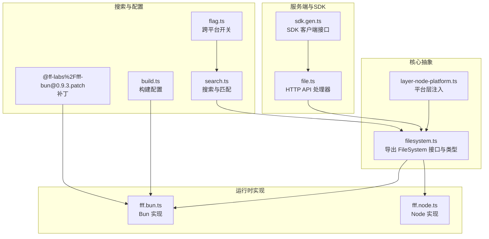
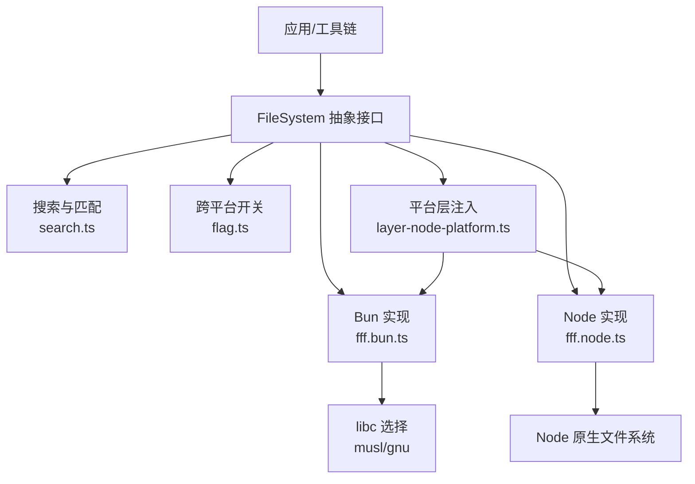
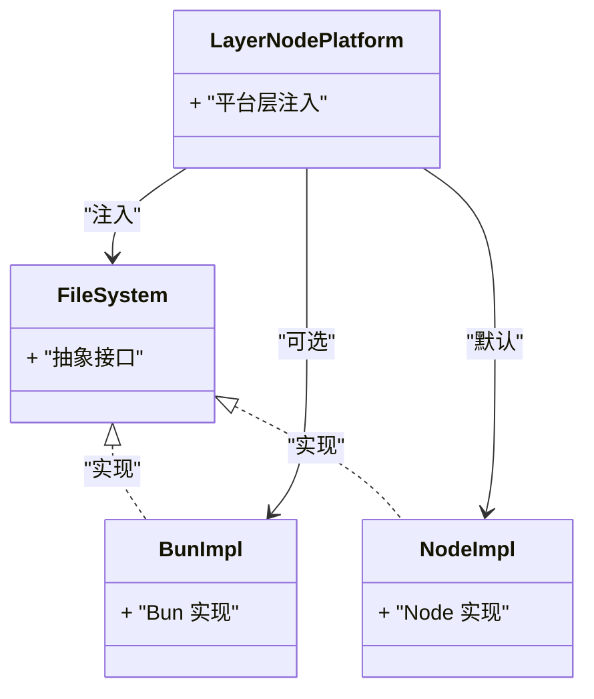
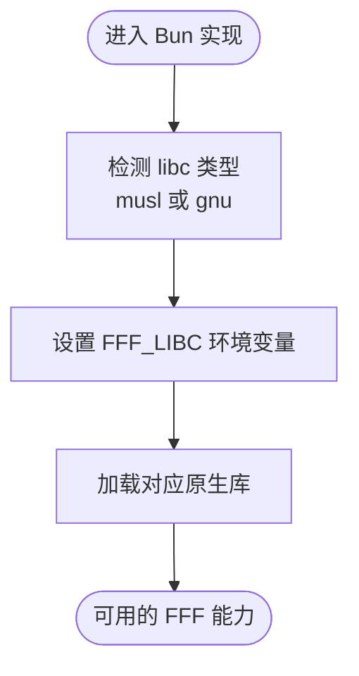
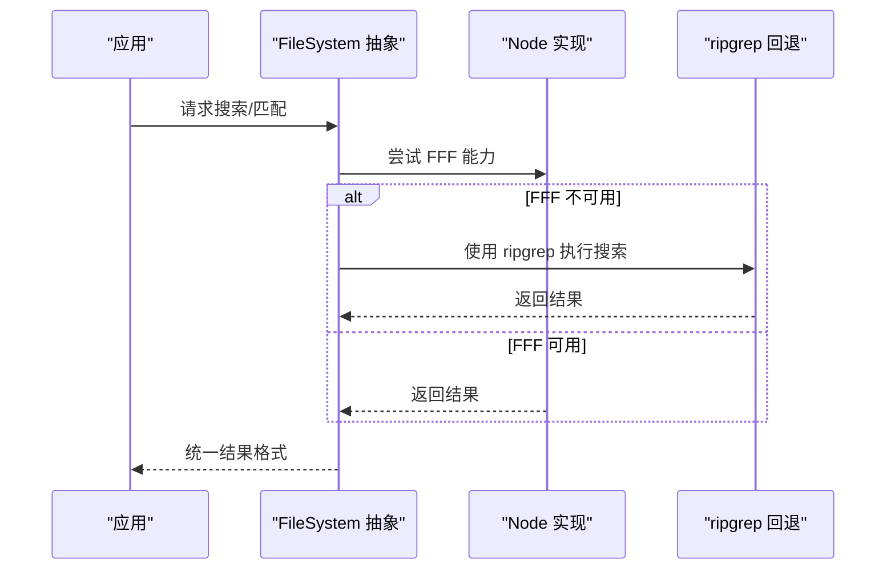
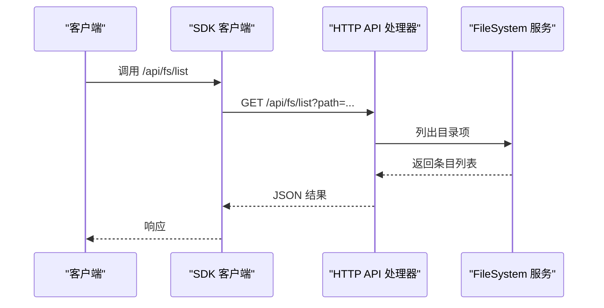
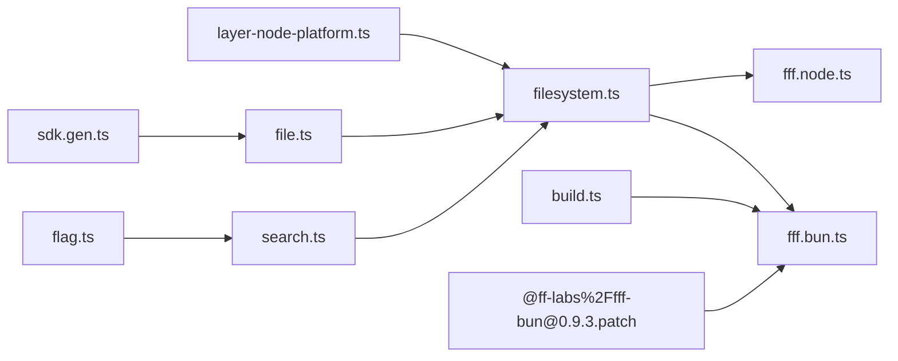

# 文件系统抽象

<cite>
**本文引用的文件**
- [fff.bun.ts](file://packages/core/src/filesystem/fff.bun.ts)
- [fff.node.ts](file://packages/core/src/filesystem/fff.node.ts)
- [filesystem.ts](file://packages/core/src/filesystem.ts)
- [layer-node-platform.ts](file://packages/core/src/effect/layer-node-platform.ts)
- [file.ts](file://packages/opencode/src/server/routes/instance/httpapi/handlers/file.ts)
- [search.ts](file://packages/core/src/filesystem/search.ts)
- [flag.ts](file://packages/core/src/flag/flag.ts)
- [fs-util.ts](file://packages/core/src/fs-util.ts)
- [@ff-labs%2Ffff-bun@0.9.3.patch](file://patches/@ff-labs%2Ffff-bun@0.9.3.patch)
- [build.ts](file://packages/cli/script/build.ts)
- [sdk.gen.ts](file://packages/sdk/js/src/v2/gen/sdk.gen.ts)
</cite>

## 目录
1. [引言](#引言)
2. [项目结构](#项目结构)
3. [核心组件](#核心组件)
4. [架构总览](#架构总览)
5. [详细组件分析](#详细组件分析)
6. [依赖关系分析](#依赖关系分析)
7. [性能考量](#性能考量)
8. [故障排查指南](#故障排查指南)
9. [结论](#结论)
10. [附录](#附录)

## 引言
本文件系统抽象层（FFF 文件系统）旨在为 OpenCode 提供统一、可移植且高性能的文件系统能力，覆盖文件读写、目录遍历、文件属性与元数据、变更监听与增量同步、以及跨平台兼容性（Windows、macOS、Linux）。该抽象通过“运行时选择”机制在不同平台与运行时（Node.js 与 Bun）之间切换具体实现，并通过 Effect 层（Layer）注入到系统中，确保上层逻辑与底层实现解耦。

## 项目结构
FFF 文件系统相关代码主要位于 packages/core 下的 filesystem 与 effect 子模块，并在服务端路由与 SDK 中被调用。关键位置如下：
- 运行时实现：packages/core/src/filesystem/fff.{node,bun}.ts
- 抽象入口与类型导出：packages/core/src/filesystem.ts
- 平台层注入：packages/core/src/effect/layer-node-platform.ts
- 服务端 HTTP API 处理器：packages/opencode/src/server/routes/instance/httpapi/handlers/file.ts
- 搜索与匹配：packages/core/src/filesystem/search.ts
- 跨平台开关与构建配置：packages/core/src/flag/flag.ts、packages/cli/script/build.ts
- 补丁与第三方集成：patches/@ff-labs%2Ffff-bun@0.9.3.patch
- SDK 生成的客户端接口：packages/sdk/js/src/v2/gen/sdk.gen.ts

图表来源
- [filesystem.ts:1-10](file://packages/core/src/filesystem.ts#L1-L10)
- [layer-node-platform.ts:1-10](file://packages/core/src/effect/layer-node-platform.ts#L1-L10)
- [fff.bun.ts:1-30](file://packages/core/src/filesystem/fff.bun.ts#L1-L30)
- [fff.node.ts:1-30](file://packages/core/src/filesystem/fff.node.ts#L1-L30)
- [file.ts:60-117](file://packages/opencode/src/server/routes/instance/httpapi/handlers/file.ts#L60-L117)
- [search.ts:230-240](file://packages/core/src/filesystem/search.ts#L230-L240)
- [flag.ts:1-40](file://packages/core/src/flag/flag.ts#L1-L40)
- [build.ts:90-100](file://packages/cli/script/build.ts#L90-L100)
- [@ff-labs%2Ffff-bun@0.9.3.patch:1-50](file://patches/@ff-labs%2Ffff-bun@0.9.3.patch#L1-L50)
- [sdk.gen.ts:5987-6043](file://packages/sdk/js/src/v2/gen/sdk.gen.ts#L5987-L6043)

章节来源
- [filesystem.ts:1-10](file://packages/core/src/filesystem.ts#L1-L10)
- [layer-node-platform.ts:1-10](file://packages/core/src/effect/layer-node-platform.ts#L1-L10)
- [fff.bun.ts:1-30](file://packages/core/src/filesystem/fff.bun.ts#L1-L30)
- [fff.node.ts:1-30](file://packages/core/src/filesystem/fff.node.ts#L1-L30)
- [file.ts:60-117](file://packages/opencode/src/server/routes/instance/httpapi/handlers/file.ts#L60-L117)
- [search.ts:230-240](file://packages/core/src/filesystem/search.ts#L230-L240)
- [flag.ts:1-40](file://packages/core/src/flag/flag.ts#L1-L40)
- [build.ts:90-100](file://packages/cli/script/build.ts#L90-L100)
- [@ff-labs%2Ffff-bun@0.9.3.patch:1-50](file://patches/@ff-labs%2Ffff-bun@0.9.3.patch#L1-L50)
- [sdk.gen.ts:5987-6043](file://packages/sdk/js/src/v2/gen/sdk.gen.ts#L5987-L6043)

## 核心组件
- 文件系统抽象入口：导出 FileSystem 服务与通用类型（Entry、Match 等），屏蔽底层差异。
- 平台层注入：通过 LayerNode 将平台特定的文件系统实现注入到系统中，便于测试与替换。
- 运行时实现：
  - Bun 实现：在 Bun 环境下加载 FFF 原生库，结合 libc 选择（musl/gnu）进行编译与运行时选择。
  - Node 实现：在 Node 环境下提供等价的文件系统能力。
- 搜索与匹配：基于 FFF 的全文/模糊搜索能力，支持限制类型、限制数量、忽略规则等。
- 跨平台开关：通过环境变量或平台判断决定是否启用 FFF，或回退到 ripgrep 等替代方案。
- 服务端 API：提供列出目录、读取内容、查找文件等 HTTP 接口，内部统一走 FileSystem 服务。
- SDK 客户端：自动生成的 SDK 提供 /api/fs/read/*、/api/fs/list、/api/fs/find 等接口。

章节来源
- [filesystem.ts:1-10](file://packages/core/src/filesystem.ts#L1-L10)
- [layer-node-platform.ts:1-10](file://packages/core/src/effect/layer-node-platform.ts#L1-L10)
- [fff.bun.ts:1-30](file://packages/core/src/filesystem/fff.bun.ts#L1-L30)
- [fff.node.ts:1-30](file://packages/core/src/filesystem/fff.node.ts#L1-L30)
- [search.ts:230-240](file://packages/core/src/filesystem/search.ts#L230-L240)
- [flag.ts:1-40](file://packages/core/src/flag/flag.ts#L1-L40)
- [file.ts:60-117](file://packages/opencode/src/server/routes/instance/httpapi/handlers/file.ts#L60-L117)
- [sdk.gen.ts:5987-6043](file://packages/sdk/js/src/v2/gen/sdk.gen.ts#L5987-L6043)

## 架构总览
FFF 文件系统采用“抽象 + 运行时实现 + 平台层注入”的分层设计，上层仅依赖抽象接口，运行时根据环境自动选择具体实现；同时通过 Effect Layer 将实现注入到系统，便于统一管理与替换。

图表来源
- [filesystem.ts:1-10](file://packages/core/src/filesystem.ts#L1-L10)
- [fff.bun.ts:1-30](file://packages/core/src/filesystem/fff.bun.ts#L1-L30)
- [fff.node.ts:1-30](file://packages/core/src/filesystem/fff.node.ts#L1-L30)
- [search.ts:230-240](file://packages/core/src/filesystem/search.ts#L230-L240)
- [flag.ts:1-40](file://packages/core/src/flag/flag.ts#L1-L40)
- [layer-node-platform.ts:1-10](file://packages/core/src/effect/layer-node-platform.ts#L1-L10)

## 详细组件分析

### 组件一：文件系统抽象与平台层注入
- 抽象入口导出 FileSystem 服务与通用类型，保证上层不直接依赖具体实现。
- 平台层通过 LayerNode 将文件系统实现注入到系统，便于在不同运行时（Node/Bun）间切换。
- 在 Node 环境中，平台层默认绑定 NodeFileSystem 实现；在 Bun 环境中，由 fff.bun.ts 提供实现。

图表来源
- [filesystem.ts:1-10](file://packages/core/src/filesystem.ts#L1-L10)
- [layer-node-platform.ts:1-10](file://packages/core/src/effect/layer-node-platform.ts#L1-L10)
- [fff.bun.ts:1-30](file://packages/core/src/filesystem/fff.bun.ts#L1-L30)
- [fff.node.ts:1-30](file://packages/core/src/filesystem/fff.node.ts#L1-L30)

章节来源
- [filesystem.ts:1-10](file://packages/core/src/filesystem.ts#L1-L10)
- [layer-node-platform.ts:1-10](file://packages/core/src/effect/layer-node-platform.ts#L1-L10)

### 组件二：Bun 实现与 libc 选择
- Bun 实现通过原生库加载与 libc 选择（musl/gnu）适配不同 Linux 发行版。
- 构建脚本在 Linux 平台上设置 FFF_LIBC 变量以选择合适的原生库变体。
- 补丁文件用于对第三方包 @ff-labs/fff-bun 进行必要的修改以适配当前版本。

图表来源
- [fff.bun.ts:1-30](file://packages/core/src/filesystem/fff.bun.ts#L1-L30)
- [build.ts:90-100](file://packages/cli/script/build.ts#L90-L100)
- [@ff-labs%2Ffff-bun@0.9.3.patch:1-50](file://patches/@ff-labs%2Ffff-bun@0.9.3.patch#L1-L50)

章节来源
- [fff.bun.ts:1-30](file://packages/core/src/filesystem/fff.bun.ts#L1-L30)
- [build.ts:90-100](file://packages/cli/script/build.ts#L90-L100)
- [@ff-labs%2Ffff-bun@0.9.3.patch:1-50](file://patches/@ff-labs%2Ffff-bun@0.9.3.patch#L1-L50)

### 组件三：Node 实现与回退策略
- Node 实现作为默认实现，提供基础文件系统能力。
- 当 FFF 不可用或被禁用时，系统会回退到 ripgrep 等替代方案，确保功能可用性。

图表来源
- [search.ts:230-240](file://packages/core/src/filesystem/search.ts#L230-L240)
- [flag.ts:1-40](file://packages/core/src/flag/flag.ts#L1-L40)

章节来源
- [search.ts:230-240](file://packages/core/src/filesystem/search.ts#L230-L240)
- [flag.ts:1-40](file://packages/core/src/flag/flag.ts#L1-L40)

### 组件四：服务端 HTTP API 与 SDK 集成
- 服务端处理器统一通过 FileSystem 服务执行文件列表、内容读取、查找等操作，并结合 ignore 规则过滤结果。
- SDK 自动生成的客户端接口覆盖 /api/fs/read/*、/api/fs/list、/api/fs/find 等，便于前端与外部工具调用。

图表来源
- [sdk.gen.ts:5987-6043](file://packages/sdk/js/src/v2/gen/sdk.gen.ts#L5987-L6043)
- [file.ts:60-117](file://packages/opencode/src/server/routes/instance/httpapi/handlers/file.ts#L60-L117)

章节来源
- [sdk.gen.ts:5987-6043](file://packages/sdk/js/src/v2/gen/sdk.gen.ts#L5987-L6043)
- [file.ts:60-117](file://packages/opencode/src/server/routes/instance/httpapi/handlers/file.ts#L60-L117)

### 组件五：文件属性与安全校验
- 服务端在读取文件内容前进行路径安全校验，防止路径逃逸。
- 对于二进制文件，返回非文本标记；对于文本文件，使用 UTF-8 解码并裁剪空白。

图表来源
- [file.ts:96-117](file://packages/opencode/src/server/routes/instance/httpapi/handlers/file.ts#L96-L117)

章节来源
- [file.ts:96-117](file://packages/opencode/src/server/routes/instance/httpapi/handlers/file.ts#L96-L117)

## 依赖关系分析
- 抽象与实现解耦：filesystem.ts 导出抽象接口，fff.bun.ts 与 fff.node.ts 分别实现。
- 平台层注入：layer-node-platform.ts 将实现注入到系统，便于在 Node/Bun 间切换。
- 搜索回退：search.ts 在 FFF 不可用时回退到 ripgrep，flag.ts 控制是否禁用 FFF。
- 构建与运行：build.ts 设置 FFF_LIBC，@ff-labs%2Ffff-bun@0.9.3.patch 修复兼容性问题。
- 服务端与 SDK：file.ts 与 sdk.gen.ts 形成完整的读写/列举/查找闭环。

图表来源
- [filesystem.ts:1-10](file://packages/core/src/filesystem.ts#L1-L10)
- [fff.bun.ts:1-30](file://packages/core/src/filesystem/fff.bun.ts#L1-L30)
- [fff.node.ts:1-30](file://packages/core/src/filesystem/fff.node.ts#L1-L30)
- [layer-node-platform.ts:1-10](file://packages/core/src/effect/layer-node-platform.ts#L1-L10)
- [search.ts:230-240](file://packages/core/src/filesystem/search.ts#L230-L240)
- [flag.ts:1-40](file://packages/core/src/flag/flag.ts#L1-L40)
- [build.ts:90-100](file://packages/cli/script/build.ts#L90-L100)
- [@ff-labs%2Ffff-bun@0.9.3.patch:1-50](file://patches/@ff-labs%2Ffff-bun@0.9.3.patch#L1-L50)
- [file.ts:60-117](file://packages/opencode/src/server/routes/instance/httpapi/handlers/file.ts#L60-L117)
- [sdk.gen.ts:5987-6043](file://packages/sdk/js/src/v2/gen/sdk.gen.ts#L5987-L6043)

章节来源
- [filesystem.ts:1-10](file://packages/core/src/filesystem.ts#L1-L10)
- [layer-node-platform.ts:1-10](file://packages/core/src/effect/layer-node-platform.ts#L1-L10)
- [fff.bun.ts:1-30](file://packages/core/src/filesystem/fff.bun.ts#L1-L30)
- [fff.node.ts:1-30](file://packages/core/src/filesystem/fff.node.ts#L1-L30)
- [search.ts:230-240](file://packages/core/src/filesystem/search.ts#L230-L240)
- [flag.ts:1-40](file://packages/core/src/flag/flag.ts#L1-L40)
- [build.ts:90-100](file://packages/cli/script/build.ts#L90-L100)
- [@ff-labs%2Ffff-bun@0.9.3.patch:1-50](file://patches/@ff-labs%2Ffff-bun@0.9.3.patch#L1-L50)
- [file.ts:60-117](file://packages/opencode/src/server/routes/instance/httpapi/handlers/file.ts#L60-L117)
- [sdk.gen.ts:5987-6043](file://packages/sdk/js/src/v2/gen/sdk.gen.ts#L5987-L6043)

## 性能考量
- 运行时选择：在 Linux 上通过 FFF_LIBC 选择 musl/gnu，减少运行时开销与二进制体积。
- 搜索回退：当 FFF 不可用时自动回退到 ripgrep，避免阻塞与失败。
- 编解码优化：对文本内容使用 UTF-8 解码并裁剪空白，减少后续处理成本。
- 路径安全：提前进行路径校验，避免无效 IO 与潜在攻击面。

[本节为通用性能建议，无需引用具体文件]

## 故障排查指南
- 启用/禁用 FFF：通过环境变量或平台判断控制是否禁用 FFF，必要时回退到 ripgrep。
- 构建问题：确认 Linux 平台的 FFF_LIBC 设置正确，补丁文件已应用。
- 路径逃逸：服务端在读取文件前进行安全校验，若出现异常需检查传入路径与工作区边界。
- 文本/二进制：二进制文件不会被解码为文本，需按二进制方式处理。

章节来源
- [flag.ts:1-40](file://packages/core/src/flag/flag.ts#L1-L40)
- [build.ts:90-100](file://packages/cli/script/build.ts#L90-L100)
- [@ff-labs%2Ffff-bun@0.9.3.patch:1-50](file://patches/@ff-labs%2Ffff-bun@0.9.3.patch#L1-L50)
- [file.ts:96-117](file://packages/opencode/src/server/routes/instance/httpapi/handlers/file.ts#L96-L117)

## 结论
FFF 文件系统抽象层通过清晰的分层设计与平台层注入，实现了在不同运行时与平台上的统一文件系统能力。配合搜索回退、路径安全校验与构建期 libc 选择，既保证了功能完整性，也兼顾了性能与可维护性。未来可在缓存与并发控制方面进一步增强，以支撑更大规模的文件操作场景。

[本节为总结性内容，无需引用具体文件]

## 附录
- 实际使用示例（路径指引）
  - 列出目录：参考 [file.ts:66-94](file://packages/opencode/src/server/routes/instance/httpapi/handlers/file.ts#L66-L94)
  - 读取内容：参考 [file.ts:96-117](file://packages/opencode/src/server/routes/instance/httpapi/handlers/file.ts#L96-L117)
  - 查找文件：参考 [sdk.gen.ts:6032-6043](file://packages/sdk/js/src/v2/gen/sdk.gen.ts#L6032-L6043)
- 跨平台与构建
  - libc 选择与构建：参考 [build.ts:90-100](file://packages/cli/script/build.ts#L90-L100)
  - 补丁应用：参考 [@ff-labs%2Ffff-bun@0.9.3.patch:1-50](file://patches/@ff-labs%2Ffff-bun@0.9.3.patch#L1-L50)
- 搜索与匹配
  - 搜索回退策略：参考 [search.ts:230-240](file://packages/core/src/filesystem/search.ts#L230-L240)
  - 跨平台开关：参考 [flag.ts:1-40](file://packages/core/src/flag/flag.ts#L1-L40)