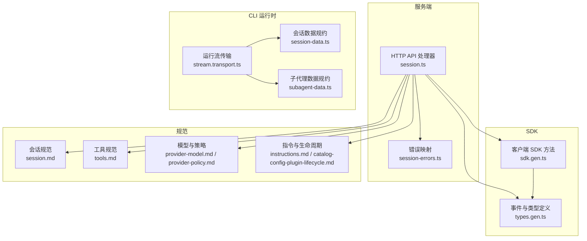
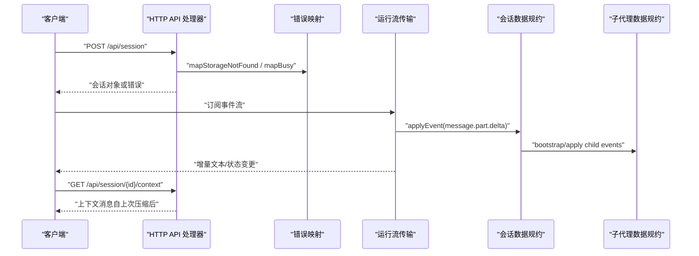
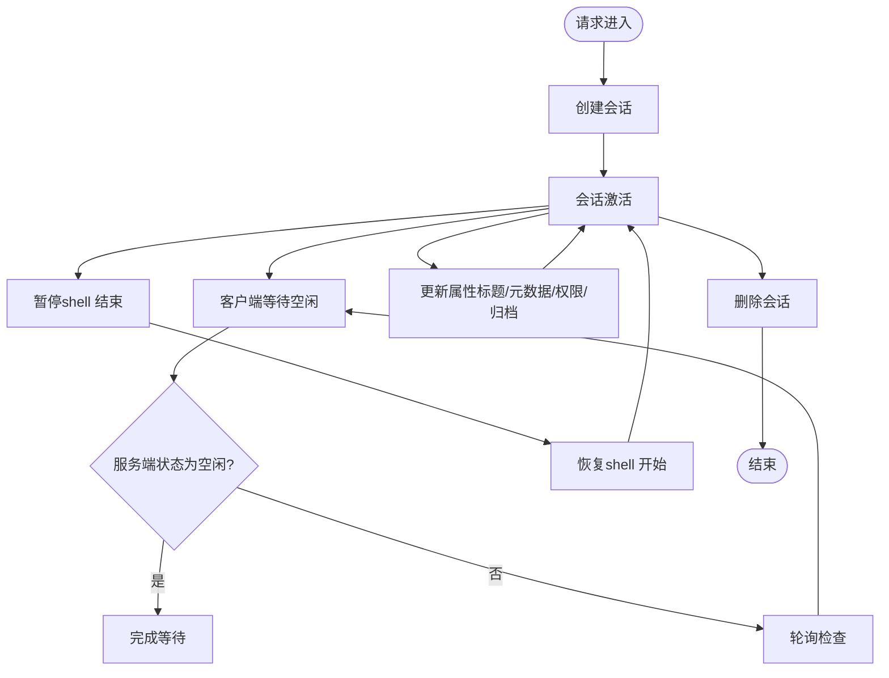
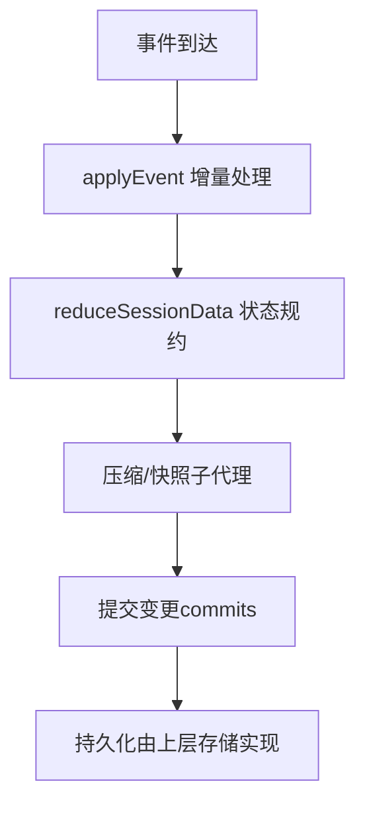
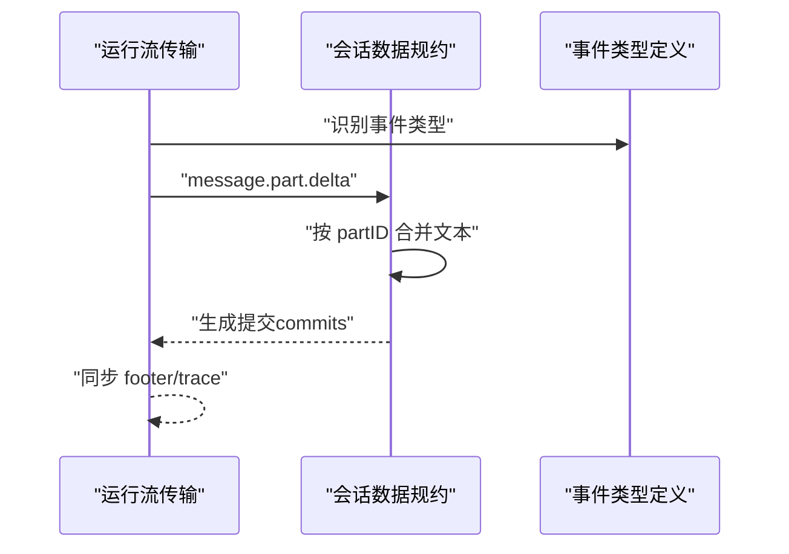
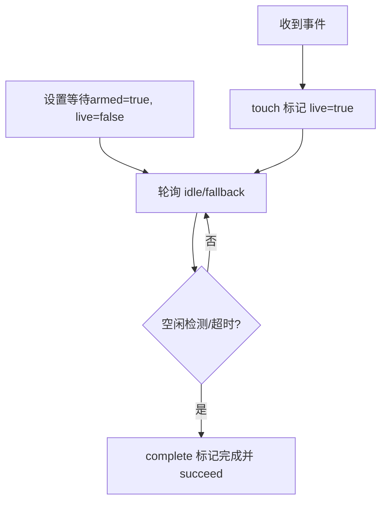
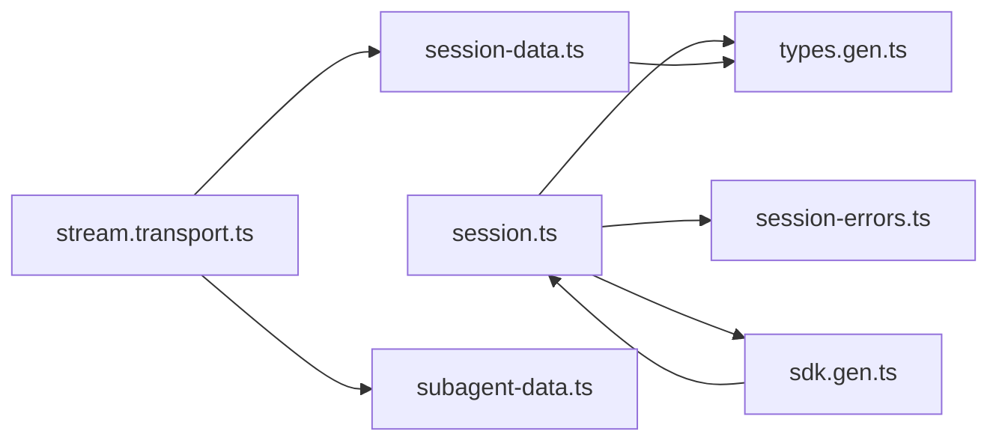

# 会话管理机制

<cite>
**本文引用的文件**
- [packages/opencode/src/server/routes/instance/httpapi/handlers/session.ts](file://packages/opencode/src/server/routes/instance/httpapi/handlers/session.ts)
- [packages/opencode/src/server/routes/instance/httpapi/handlers/session-errors.ts](file://packages/opencode/src/server/routes/instance/httpapi/handlers/session-errors.ts)
- [packages/opencode/src/cli/cmd/run/stream.transport.ts](file://packages/opencode/src/cli/cmd/run/stream.transport.ts)
- [packages/opencode/src/cli/cmd/run/session-data.ts](file://packages/opencode/src/cli/cmd/run/session-data.ts)
- [packages/opencode/src/cli/cmd/run/subagent-data.ts](file://packages/opencode/src/cli/cmd/run/subagent-data.ts)
- [packages/serversdk/js/src/v2/gen/sdk.gen.ts](file://packages/serversdk/js/src/v2/gen/sdk.gen.ts)
- [packages/serversdk/js/src/v2/gen/types.gen.ts](file://packages/serversdk/js/src/v2/gen/types.gen.ts)
- [specs/v2/session.md](file://specs/v2/session.md)
- [specs/v2/tools.md](file://specs/v2/tools.md)
- [specs/v2/provider-model.md](file://specs/v2/provider-model.md)
- [specs/v2/provider-policy.md](file://specs/v2/provider-policy.md)
- [specs/v2/instructions.md](file://specs/v2/instructions.md)
- [specs/v2/catalog-config-plugin-lifecycle.md](file://specs/v2/catalog-config-plugin-lifecycle.md)
- [packages/web/src/content/docs/da/plugins.mdx](file://packages/web/src/content/docs/da/plugins.mdx)
</cite>

## 目录
1. [引言](#引言)
2. [项目结构](#项目结构)
3. [核心组件](#核心组件)
4. [架构总览](#架构总览)
5. [详细组件分析](#详细组件分析)
6. [依赖关系分析](#依赖关系分析)
7. [性能考量](#性能考量)
8. [故障排查指南](#故障排查指南)
9. [结论](#结论)
10. [附录](#附录)

## 引言
本文件系统性阐述 OpenCode 的会话管理机制，覆盖会话生命周期（创建、激活、暂停、恢复、销毁）、状态存储（内存与持久化）、消息处理（格式、序列化、传输、历史记录）、并发控制与线程安全、配置与自定义参数、以及与插件系统的集成与数据交换。文档以仓库中的真实实现为依据，并通过图示与路径指引帮助读者快速定位到具体源码位置。

## 项目结构
围绕会话管理的关键模块分布于服务端 HTTP API、CLI 运行时、SDK 类型定义与规范文档中：
- 服务端 HTTP API：提供会话的创建、查询、更新、删除、分页、fork 等接口
- CLI 运行时：负责事件流处理、会话数据聚合与状态机推进
- SDK 类型与客户端：定义事件类型、会话与消息的数据模型
- 规范文档：定义会话、工具、模型与策略等领域的数据契约

图表来源
- [packages/opencode/src/server/routes/instance/httpapi/handlers/session.ts:124-223](file://packages/opencode/src/server/routes/instance/httpapi/handlers/session.ts#L124-L223)
- [packages/opencode/src/server/routes/instance/httpapi/handlers/session-errors.ts:1-21](file://packages/opencode/src/server/routes/instance/httpapi/handlers/session-errors.ts#L1-L21)
- [packages/opencode/src/cli/cmd/run/stream.transport.ts:129-897](file://packages/opencode/src/cli/cmd/run/stream.transport.ts#L129-L897)
- [packages/opencode/src/cli/cmd/run/session-data.ts:275-1091](file://packages/opencode/src/cli/cmd/run/session-data.ts#L275-L1091)
- [packages/opencode/src/cli/cmd/run/subagent-data.ts:544-586](file://packages/opencode/src/cli/cmd/run/subagent-data.ts#L544-L586)
- [packages/serversdk/js/src/v2/gen/sdk.gen.ts:5351-5397](file://packages/serversdk/js/src/v2/gen/sdk.gen.ts#L5351-L5397)
- [packages/serversdk/js/src/v2/gen/types.gen.ts:4220-4299](file://packages/serversdk/js/src/v2/gen/types.gen.ts#L4220-L4299)
- [specs/v2/session.md](file://specs/v2/session.md)
- [specs/v2/tools.md](file://specs/v2/tools.md)
- [specs/v2/provider-model.md](file://specs/v2/provider-model.md)
- [specs/v2/provider-policy.md](file://specs/v2/provider-policy.md)
- [specs/v2/instructions.md](file://specs/v2/instructions.md)
- [specs/v2/catalog-config-plugin-lifecycle.md](file://specs/v2/catalog-config-plugin-lifecycle.md)

章节来源
- [packages/opencode/src/server/routes/instance/httpapi/handlers/session.ts:124-223](file://packages/opencode/src/server/routes/instance/httpapi/handlers/session.ts#L124-L223)
- [packages/opencode/src/server/routes/instance/httpapi/handlers/session-errors.ts:1-21](file://packages/opencode/src/server/routes/instance/httpapi/handlers/session-errors.ts#L1-L21)
- [packages/opencode/src/cli/cmd/run/stream.transport.ts:129-897](file://packages/opencode/src/cli/cmd/run/stream.transport.ts#L129-L897)
- [packages/opencode/src/cli/cmd/run/session-data.ts:275-1091](file://packages/opencode/src/cli/cmd/run/session-data.ts#L275-L1091)
- [packages/opencode/src/cli/cmd/run/subagent-data.ts:544-586](file://packages/opencode/src/cli/cmd/run/subagent-data.ts#L544-L586)
- [packages/serversdk/js/src/v2/gen/sdk.gen.ts:5351-5397](file://packages/serversdk/js/src/v2/gen/sdk.gen.ts#L5351-L5397)
- [packages/serversdk/js/src/v2/gen/types.gen.ts:4220-4299](file://packages/serversdk/js/src/v2/gen/types.gen.ts#L4220-L4299)
- [specs/v2/session.md](file://specs/v2/session.md)
- [specs/v2/tools.md](file://specs/v2/tools.md)
- [specs/v2/provider-model.md](file://specs/v2/provider-model.md)
- [specs/v2/provider-policy.md](file://specs/v2/provider-policy.md)
- [specs/v2/instructions.md](file://specs/v2/instructions.md)
- [specs/v2/catalog-config-plugin-lifecycle.md](file://specs/v2/catalog-config-plugin-lifecycle.md)

## 核心组件
- 会话 HTTP API 处理器：提供会话列表、消息查询、创建、更新、删除、分页、fork 等能力；对权限合并、标题与元数据更新进行细粒度控制
- 错误映射：将存储未找到与“会话忙”等业务错误转换为标准 HTTP API 错误
- 运行流传输：解析事件、推进等待态、处理增量文本、同步提交、跟踪阻塞器
- 会话数据规约：基于事件驱动的状态机，维护消息、部分（parts）、权限、问题等集合，支持去重、补丁与压缩
- 子代理数据规约：在多子代理场景下，按消息/部分维度进行压缩与快照
- SDK 类型与客户端：定义事件类型（如 session.created/updated/deleted、message.*、permission.*、question.*）与客户端方法（context/wait 等）

章节来源
- [packages/opencode/src/server/routes/instance/httpapi/handlers/session.ts:124-223](file://packages/opencode/src/server/routes/instance/httpapi/handlers/session.ts#L124-L223)
- [packages/opencode/src/server/routes/instance/httpapi/handlers/session-errors.ts:1-21](file://packages/opencode/src/server/routes/instance/httpapi/handlers/session-errors.ts#L1-L21)
- [packages/opencode/src/cli/cmd/run/stream.transport.ts:129-897](file://packages/opencode/src/cli/cmd/run/stream.transport.ts#L129-L897)
- [packages/opencode/src/cli/cmd/run/session-data.ts:275-1091](file://packages/opencode/src/cli/cmd/run/session-data.ts#L275-L1091)
- [packages/opencode/src/cli/cmd/run/subagent-data.ts:544-586](file://packages/opencode/src/cli/cmd/run/subagent-data.ts#L544-L586)
- [packages/serversdk/js/src/v2/gen/types.gen.ts:4220-4299](file://packages/serversdk/js/src/v2/gen/types.gen.ts#L4220-L4299)
- [packages/serversdk/js/src/v2/gen/sdk.gen.ts:5351-5397](file://packages/serversdk/js/src/v2/gen/sdk.gen.ts#L5351-L5397)

## 架构总览
下图展示了从 HTTP 请求到事件流处理再到状态持久化的整体链路，以及 SDK 客户端与服务端的交互。

图表来源
- [packages/opencode/src/server/routes/instance/httpapi/handlers/session.ts:124-223](file://packages/opencode/src/server/routes/instance/httpapi/handlers/session.ts#L124-L223)
- [packages/opencode/src/server/routes/instance/httpapi/handlers/session-errors.ts:1-21](file://packages/opencode/src/server/routes/instance/httpapi/handlers/session-errors.ts#L1-L21)
- [packages/opencode/src/cli/cmd/run/stream.transport.ts:883-897](file://packages/opencode/src/cli/cmd/run/stream.transport.ts#L883-L897)
- [packages/opencode/src/cli/cmd/run/session-data.ts:872-903](file://packages/opencode/src/cli/cmd/run/session-data.ts#L872-L903)
- [packages/opencode/src/cli/cmd/run/subagent-data.ts:557-586](file://packages/opencode/src/cli/cmd/run/subagent-data.ts#L557-L586)
- [packages/serversdk/js/src/v2/gen/sdk.gen.ts:5381-5393](file://packages/serversdk/js/src/v2/gen/sdk.gen.ts#L5381-L5393)

## 详细组件分析

### 会话生命周期管理
- 创建：支持带载荷的创建与原始 JSON 载荷解析；权限数组进行浅拷贝以避免外部引用污染
- 激活/等待：客户端可通过 wait 接口等待会话空闲；服务端通过事件“session.status/idle”触发完成
- 暂停/恢复：通过事件“session.next.shell.started/ended”与“session.status”状态切换实现
- 更新：可分别更新标题、元数据、权限（合并策略）、归档时间等
- 删除：移除会话并返回布尔结果
- 分页与导航：列表接口支持 limit/before 查询参数与 Link/X-Next-Cursor 响应头
- Fork：基于指定消息 ID 或当前状态派生新会话

图表来源
- [packages/opencode/src/server/routes/instance/httpapi/handlers/session.ts:153-214](file://packages/opencode/src/server/routes/instance/httpapi/handlers/session.ts#L153-L214)
- [packages/serversdk/js/src/v2/gen/sdk.gen.ts:5362-5374](file://packages/serversdk/js/src/v2/gen/sdk.gen.ts#L5362-L5374)

章节来源
- [packages/opencode/src/server/routes/instance/httpapi/handlers/session.ts:124-223](file://packages/opencode/src/server/routes/instance/httpapi/handlers/session.ts#L124-L223)
- [packages/serversdk/js/src/v2/gen/sdk.gen.ts:5351-5397](file://packages/serversdk/js/src/v2/gen/sdk.gen.ts#L5351-L5397)

### 会话状态存储机制
- 内存状态管理：CLI 运行时维护会话数据结构（消息、部分文本、工具调用输入、权限请求、问题等），通过 applyEvent 与 reduceSessionData 实现增量更新与去重
- 持久化存储策略：规范文档定义了会话与消息的持久化契约（如压缩、上下文窗口、历史记录），SDK 客户端通过“/api/session/{sessionID}/context”获取自上次压缩后的上下文消息
- 压缩与快照：子代理数据规约在事件驱动下对活跃消息/部分进行压缩，减少内存占用并保持一致性

图表来源
- [packages/opencode/src/cli/cmd/run/stream.transport.ts:883-897](file://packages/opencode/src/cli/cmd/run/stream.transport.ts#L883-L897)
- [packages/opencode/src/cli/cmd/run/session-data.ts:872-903](file://packages/opencode/src/cli/cmd/run/session-data.ts#L872-L903)
- [packages/opencode/src/cli/cmd/run/subagent-data.ts:544-586](file://packages/opencode/src/cli/cmd/run/subagent-data.ts#L544-L586)
- [specs/v2/session.md](file://specs/v2/session.md)

章节来源
- [packages/opencode/src/cli/cmd/run/stream.transport.ts:883-897](file://packages/opencode/src/cli/cmd/run/stream.transport.ts#L883-L897)
- [packages/opencode/src/cli/cmd/run/session-data.ts:275-1091](file://packages/opencode/src/cli/cmd/run/session-data.ts#L275-L1091)
- [packages/opencode/src/cli/cmd/run/subagent-data.ts:544-586](file://packages/opencode/src/cli/cmd/run/subagent-data.ts#L544-L586)
- [specs/v2/session.md](file://specs/v2/session.md)

### 消息处理系统
- 消息格式与序列化：事件类型在 SDK 类型定义中集中声明，如“session.created/updated/deleted”、“message.updated/removed/part.updated/delta”、“permission.*”、“question.*”
- 传输与历史记录：运行流传输处理增量文本（delta），避免重复；当事件来自同一会话且字段为“text”时，按 partID 合并；同时维护消息与部分的映射关系，确保历史记录可追溯
- 上下文获取：客户端通过 context 接口获取自上次压缩后的上下文消息，便于模型推理

图表来源
- [packages/opencode/src/cli/cmd/run/stream.transport.ts:883-897](file://packages/opencode/src/cli/cmd/run/stream.transport.ts#L883-L897)
- [packages/opencode/src/cli/cmd/run/session-data.ts:872-903](file://packages/opencode/src/cli/cmd/run/session-data.ts#L872-L903)
- [packages/serversdk/js/src/v2/gen/types.gen.ts:4251-4299](file://packages/serversdk/js/src/v2/gen/types.gen.ts#L4251-L4299)

章节来源
- [packages/opencode/src/cli/cmd/run/stream.transport.ts:129-897](file://packages/opencode/src/cli/cmd/run/stream.transport.ts#L129-L897)
- [packages/opencode/src/cli/cmd/run/session-data.ts:872-903](file://packages/opencode/src/cli/cmd/run/session-data.ts#L872-L903)
- [packages/serversdk/js/src/v2/gen/types.gen.ts:4220-4299](file://packages/serversdk/js/src/v2/gen/types.gen.ts#L4220-L4299)

### 并发控制与线程安全
- 等待机制：RunStreamTransport 维护等待队列（Wait），通过“live/armed/tick”状态与轮询（poll）在空闲检测后完成等待；当事件到达或超时则尝试完成
- 事件过滤：applyEvent 中根据事件类型与 sessionID 进行过滤，避免跨会话干扰
- 提交与回放：flushInterrupted 在中断时收集提交并同步 footer；replayedParts 避免重复应用已见过的 delta
- 并发约束：mapBusy 将“会话忙”错误映射为 HTTP 400/423 等，防止竞态条件下的并发写入

图表来源
- [packages/opencode/src/cli/cmd/run/stream.transport.ts:827-872](file://packages/opencode/src/cli/cmd/run/stream.transport.ts#L827-L872)
- [packages/opencode/src/server/routes/instance/httpapi/handlers/session-errors.ts:10-21](file://packages/opencode/src/server/routes/instance/httpapi/handlers/session-errors.ts#L10-L21)

章节来源
- [packages/opencode/src/cli/cmd/run/stream.transport.ts:827-872](file://packages/opencode/src/cli/cmd/run/stream.transport.ts#L827-L872)
- [packages/opencode/src/server/routes/instance/httpapi/handlers/session-errors.ts:10-21](file://packages/opencode/src/server/routes/instance/httpapi/handlers/session-errors.ts#L10-L21)

### 会话配置选项与自定义参数
- 创建输入：支持权限数组（浅拷贝）、标题、元数据等字段；原始 JSON 解析失败时返回 400
- 权限合并：更新时对现有权限与新权限进行合并，避免覆盖
- 归档时间：可单独更新归档时间字段
- 列表分页：limit/before 参数与 Link/X-Next-Cursor 响应头支持无状态分页

章节来源
- [packages/opencode/src/server/routes/instance/httpapi/handlers/session.ts:157-174](file://packages/opencode/src/server/routes/instance/httpapi/handlers/session.ts#L157-L174)
- [packages/opencode/src/server/routes/instance/httpapi/handlers/session.ts:181-202](file://packages/opencode/src/server/routes/instance/httpapi/handlers/session.ts#L181-L202)
- [packages/opencode/src/server/routes/instance/httpapi/handlers/session.ts:124-143](file://packages/opencode/src/server/routes/instance/httpapi/handlers/session.ts#L124-L143)

### 代码示例（路径指引）
- 创建会话（含原始 JSON 载荷解析与权限数组浅拷贝）
  - [packages/opencode/src/server/routes/instance/httpapi/handlers/session.ts:157-174](file://packages/opencode/src/server/routes/instance/httpapi/handlers/session.ts#L157-L174)
- 更新会话属性（标题/元数据/权限/归档）
  - [packages/opencode/src/server/routes/instance/httpapi/handlers/session.ts:181-202](file://packages/opencode/src/server/routes/instance/httpapi/handlers/session.ts#L181-L202)
- 获取会话上下文（自上次压缩后）
  - [packages/serversdk/js/src/v2/gen/sdk.gen.ts:5381-5393](file://packages/serversdk/js/src/v2/gen/sdk.gen.ts#L5381-L5393)
- 等待会话空闲
  - [packages/serversdk/js/src/v2/gen/sdk.gen.ts:5362-5374](file://packages/serversdk/js/src/v2/gen/sdk.gen.ts#L5362-L5374)
- 订阅事件流并处理增量文本
  - [packages/opencode/src/cli/cmd/run/stream.transport.ts:883-897](file://packages/opencode/src/cli/cmd/run/stream.transport.ts#L883-L897)
  - [packages/opencode/src/cli/cmd/run/session-data.ts:872-903](file://packages/opencode/src/cli/cmd/run/session-data.ts#L872-L903)

### 会话与插件系统的集成
- 插件事件：插件可订阅会话相关事件（如 session.created/updated/deleted、session.status、permission.asked/replied、question.* 等），并在事件驱动下执行钩子逻辑
- 加载顺序：全局配置、项目配置、全局与项目插件目录按固定顺序加载，重复包按约定处理
- 数据交换：插件通过事件上下文访问会话 ID、消息 ID、权限请求等信息，实现与会话状态的解耦协作

章节来源
- [packages/web/src/content/docs/da/plugins.mdx:180-190](file://packages/web/src/content/docs/da/plugins.mdx#L180-L190)
- [packages/web/src/content/docs/da/plugins.mdx:56-63](file://packages/web/src/content/docs/da/plugins.mdx#L56-L63)
- [packages/serversdk/js/src/v2/gen/types.gen.ts:4251-4299](file://packages/serversdk/js/src/v2/gen/types.gen.ts#L4251-L4299)

## 依赖关系分析
- 服务端 API 依赖错误映射模块，统一将存储与业务错误转换为 HTTP API 错误
- 运行时依赖 SDK 类型定义，保证事件语义一致
- 会话数据规约依赖事件过滤与增量处理逻辑，确保状态收敛
- 客户端 SDK 依赖服务端路由契约，提供上下文与等待等高级能力

图表来源
- [packages/opencode/src/server/routes/instance/httpapi/handlers/session.ts:124-223](file://packages/opencode/src/server/routes/instance/httpapi/handlers/session.ts#L124-L223)
- [packages/opencode/src/server/routes/instance/httpapi/handlers/session-errors.ts:1-21](file://packages/opencode/src/server/routes/instance/httpapi/handlers/session-errors.ts#L1-L21)
- [packages/opencode/src/cli/cmd/run/stream.transport.ts:129-897](file://packages/opencode/src/cli/cmd/run/stream.transport.ts#L129-L897)
- [packages/opencode/src/cli/cmd/run/session-data.ts:275-1091](file://packages/opencode/src/cli/cmd/run/session-data.ts#L275-L1091)
- [packages/opencode/src/cli/cmd/run/subagent-data.ts:544-586](file://packages/opencode/src/cli/cmd/run/subagent-data.ts#L544-L586)
- [packages/serversdk/js/src/v2/gen/types.gen.ts:4220-4299](file://packages/serversdk/js/src/v2/gen/types.gen.ts#L4220-L4299)
- [packages/serversdk/js/src/v2/gen/sdk.gen.ts:5351-5397](file://packages/serversdk/js/src/v2/gen/sdk.gen.ts#L5351-L5397)

章节来源
- [packages/opencode/src/server/routes/instance/httpapi/handlers/session.ts:124-223](file://packages/opencode/src/server/routes/instance/httpapi/handlers/session.ts#L124-L223)
- [packages/opencode/src/server/routes/instance/httpapi/handlers/session-errors.ts:1-21](file://packages/opencode/src/server/routes/instance/httpapi/handlers/session-errors.ts#L1-L21)
- [packages/opencode/src/cli/cmd/run/stream.transport.ts:129-897](file://packages/opencode/src/cli/cmd/run/stream.transport.ts#L129-L897)
- [packages/opencode/src/cli/cmd/run/session-data.ts:275-1091](file://packages/opencode/src/cli/cmd/run/session-data.ts#L275-L1091)
- [packages/opencode/src/cli/cmd/run/subagent-data.ts:544-586](file://packages/opencode/src/cli/cmd/run/subagent-data.ts#L544-L586)
- [packages/serversdk/js/src/v2/gen/types.gen.ts:4220-4299](file://packages/serversdk/js/src/v2/gen/types.gen.ts#L4220-L4299)
- [packages/serversdk/js/src/v2/gen/sdk.gen.ts:5351-5397](file://packages/serversdk/js/src/v2/gen/sdk.gen.ts#L5351-L5397)

## 性能考量
- 增量处理：仅对“text”字段的 delta 进行拼接，避免全量复制
- 去重与缓存：按 partID 与消息 ID 去重，replayedParts 防止重复应用
- 压缩与快照：子代理数据规约在事件驱动下进行压缩，降低内存与计算开销
- 等待轮询：合理的轮询间隔与 fallback 机制平衡响应性与资源消耗

## 故障排查指南
- 会话忙错误：当并发写入冲突时，错误映射将其转换为 HTTP API 错误，建议重试或串行化操作
- 存储未找到：对会话/消息查询失败时返回 404，需确认 sessionID/messageID 是否正确
- 事件未生效：检查事件类型与 sessionID 是否匹配；确认“session.status/idle”是否触发完成等待
- 增量重复：若出现重复文本，检查 replayedParts 与 seen 文本末尾判断逻辑

章节来源
- [packages/opencode/src/server/routes/instance/httpapi/handlers/session-errors.ts:1-21](file://packages/opencode/src/server/routes/instance/httpapi/handlers/session-errors.ts#L1-L21)
- [packages/opencode/src/cli/cmd/run/stream.transport.ts:883-897](file://packages/opencode/src/cli/cmd/run/stream.transport.ts#L883-L897)

## 结论
OpenCode 的会话管理以事件驱动为核心，结合 HTTP API、CLI 运行时与 SDK 客户端形成闭环：服务端负责会话生命周期与状态暴露，CLI 负责事件规约与内存状态管理，SDK 提供稳定的客户端接口。通过权限合并、增量文本处理、压缩与等待机制，系统在功能完整性与性能之间取得平衡。插件体系进一步扩展了会话周边能力，实现松耦合的数据交换与行为定制。

## 附录
- 规范参考
  - 会话规范：[specs/v2/session.md](file://specs/v2/session.md)
  - 工具规范：[specs/v2/tools.md](file://specs/v2/tools.md)
  - 模型与策略：[specs/v2/provider-model.md](file://specs/v2/provider-model.md)、[specs/v2/provider-policy.md](file://specs/v2/provider-policy.md)
  - 指令与生命周期：[specs/v2/instructions.md](file://specs/v2/instructions.md)、[specs/v2/catalog-config-plugin-lifecycle.md](file://specs/v2/catalog-config-plugin-lifecycle.md)
- 插件事件清单（节选）
  - 会话事件：session.created、session.updated、session.deleted、session.status、session.error、session.compacted、session.diff、session.idle
  - 权限与问题：permission.asked、permission.replied、question.asked、question.replied、question.rejected
  - 消息事件：message.updated、message.removed、message.part.updated、message.part.removed、message.part.delta

章节来源
- [packages/web/src/content/docs/da/plugins.mdx:180-190](file://packages/web/src/content/docs/da/plugins.mdx#L180-L190)
- [packages/serversdk/js/src/v2/gen/types.gen.ts:4251-4299](file://packages/serversdk/js/src/v2/gen/types.gen.ts#L4251-L4299)