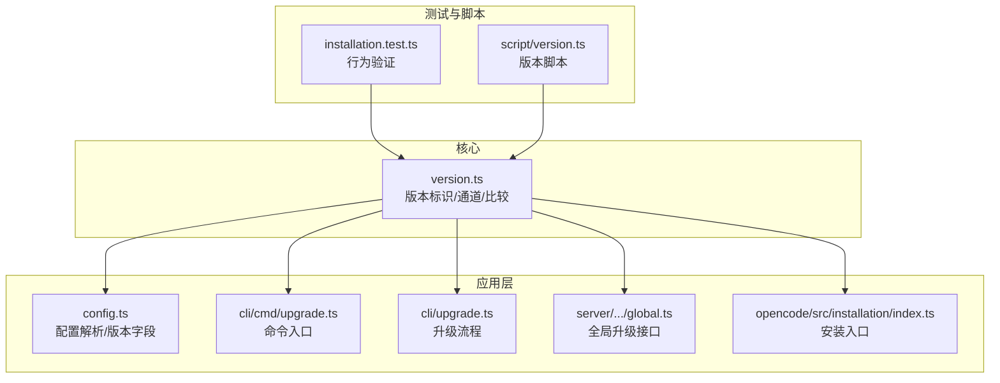
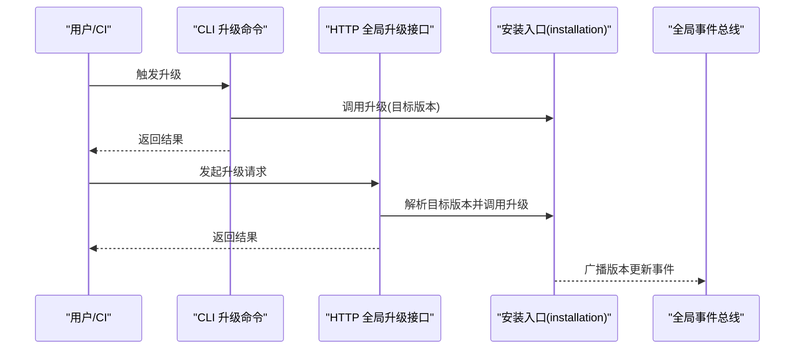
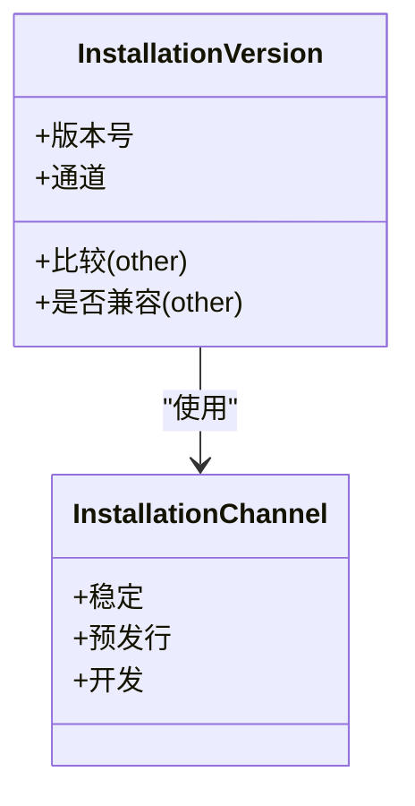
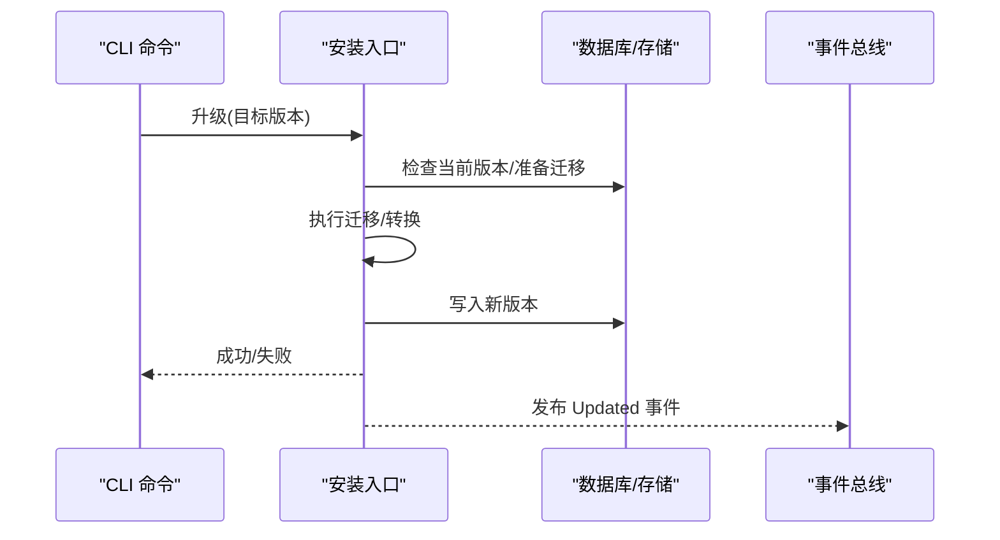
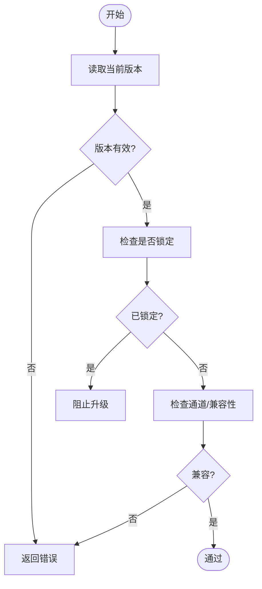
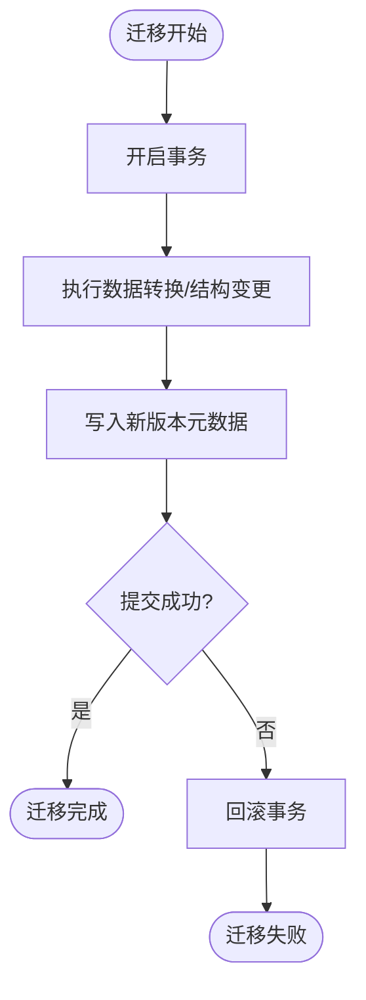
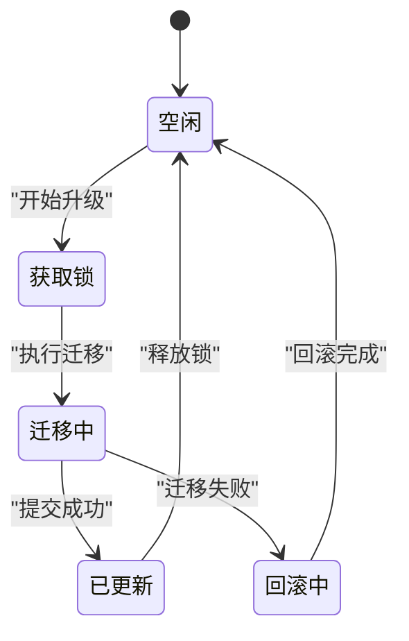
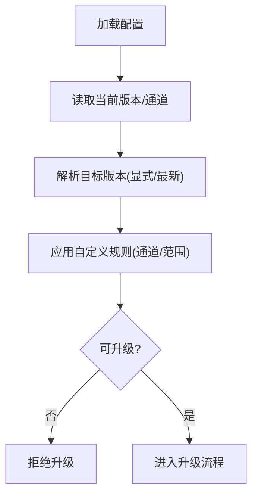
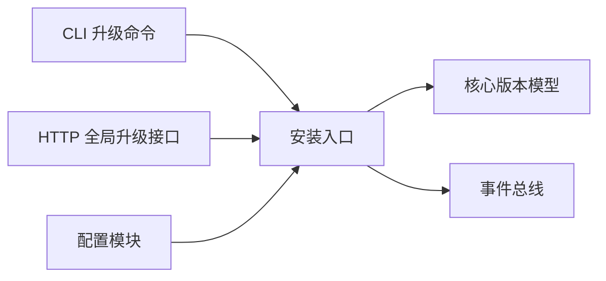

# 安装版本管理

<cite>
**本文引用的文件**
- [packages/core/src/installation/version.ts](file://packages/core/src/installation/version.ts)
- [packages/opencode/src/installation/index.ts](file://packages/opencode/src/installation/index.ts)
- [packages/opencode/src/server/routes/instance/httpapi/handlers/global.ts](file://packages/opencode/src/server/routes/instance/httpapi/handlers/global.ts)
- [packages/opencode/src/cli/cmd/upgrade.ts](file://packages/opencode/src/cli/cmd/upgrade.ts)
- [packages/opencode/src/cli/upgrade.ts](file://packages/opencode/src/cli/upgrade.ts)
- [packages/opencode/src/config/config.ts](file://packages/opencode/src/config/config.ts)
- [packages/opencode/test/installation/installation.test.ts](file://packages/opencode/test/installation/installation.test.ts)
- [script/version.ts](file://script/version.ts)
</cite>

## 目录
1. [引言](#引言)
2. [项目结构](#项目结构)
3. [核心组件](#核心组件)
4. [架构总览](#架构总览)
5. [详细组件分析](#详细组件分析)
6. [依赖关系分析](#依赖关系分析)
7. [性能考量](#性能考量)
8. [故障排除指南](#故障排除指南)
9. [结论](#结论)
10. [附录](#附录)

## 引言
本文件面向 OpenCode 安装版本管理系统的架构与实现，围绕以下目标展开：版本标识与版本比较、版本兼容性检查、版本检查器工作原理、版本迁移器（自动迁移、回滚与数据转换）、版本锁定与更新策略、版本配置与自定义规则、最佳实践与故障排除，并通过图示与“章节来源”定位到具体实现文件，帮助读者快速理解并安全地完成系统升级。

## 项目结构
OpenCode 将版本管理能力拆分为核心库与上层应用/CLI/服务端的集成点：
- 核心版本模型与工具位于 core 包中，提供版本标识、通道与比较等基础能力
- 上层通过 CLI、HTTP API、配置模块等调用核心版本能力
- 版本脚本用于发布与版本号生成

图表来源
- [packages/core/src/installation/version.ts](file://packages/core/src/installation/version.ts)
- [packages/opencode/src/config/config.ts](file://packages/opencode/src/config/config.ts)
- [packages/opencode/src/cli/cmd/upgrade.ts](file://packages/opencode/src/cli/cmd/upgrade.ts)
- [packages/opencode/src/cli/upgrade.ts](file://packages/opencode/src/cli/upgrade.ts)
- [packages/opencode/src/server/routes/instance/httpapi/handlers/global.ts](file://packages/opencode/src/server/routes/instance/httpapi/handlers/global.ts)
- [packages/opencode/src/installation/index.ts](file://packages/opencode/src/installation/index.ts)
- [packages/opencode/test/installation/installation.test.ts](file://packages/opencode/test/installation/installation.test.ts)
- [script/version.ts](file://script/version.ts)

章节来源
- [packages/core/src/installation/version.ts](file://packages/core/src/installation/version.ts)
- [packages/opencode/src/installation/index.ts](file://packages/opencode/src/installation/index.ts)
- [packages/opencode/src/server/routes/instance/httpapi/handlers/global.ts](file://packages/opencode/src/server/routes/instance/httpapi/handlers/global.ts)
- [packages/opencode/src/cli/cmd/upgrade.ts](file://packages/opencode/src/cli/cmd/upgrade.ts)
- [packages/opencode/src/cli/upgrade.ts](file://packages/opencode/src/cli/upgrade.ts)
- [packages/opencode/src/config/config.ts](file://packages/opencode/src/config/config.ts)
- [packages/opencode/test/installation/installation.test.ts](file://packages/opencode/test/installation/installation.test.ts)
- [script/version.ts](file://script/version.ts)

## 核心组件
- 版本标识与通道
  - 提供版本号、通道（如稳定/预发行）等标识，支持版本比较与兼容性判断
- 安装入口与升级流程
  - CLI 与 HTTP 接口统一调用安装入口，执行升级或回滚
- 配置集成
  - 配置模块读取当前版本与目标版本，驱动升级决策
- 测试与脚本
  - 行为测试覆盖升级路径；版本脚本负责发布时的版本号生成

章节来源
- [packages/core/src/installation/version.ts](file://packages/core/src/installation/version.ts)
- [packages/opencode/src/installation/index.ts](file://packages/opencode/src/installation/index.ts)
- [packages/opencode/src/config/config.ts](file://packages/opencode/src/config/config.ts)
- [packages/opencode/test/installation/installation.test.ts](file://packages/opencode/test/installation/installation.test.ts)
- [script/version.ts](file://script/version.ts)

## 架构总览
下图展示了从用户触发升级到版本更新事件的端到端流程，涵盖 CLI、HTTP API、安装入口与事件广播：

图表来源
- [packages/opencode/src/cli/cmd/upgrade.ts](file://packages/opencode/src/cli/cmd/upgrade.ts)
- [packages/opencode/src/cli/upgrade.ts](file://packages/opencode/src/cli/upgrade.ts)
- [packages/opencode/src/server/routes/instance/httpapi/handlers/global.ts](file://packages/opencode/src/server/routes/instance/httpapi/handlers/global.ts)
- [packages/opencode/src/installation/index.ts](file://packages/opencode/src/installation/index.ts)

## 详细组件分析

### 组件一：版本标识与比较（核心）
- 设计要点
  - 使用版本号与通道进行唯一标识与排序
  - 提供版本比较与兼容性判断，支撑“最新版本”选择与目标版本约束
- 数据结构与复杂度
  - 版本比较算法通常为 O(n) 或 O(1)（按段比较），空间复杂度 O(1)
- 关键职责
  - 识别当前安装版本
  - 计算可升级目标（latest）
  - 判断版本兼容性（前置条件/约束）

图表来源
- [packages/core/src/installation/version.ts](file://packages/core/src/installation/version.ts)

章节来源
- [packages/core/src/installation/version.ts](file://packages/core/src/installation/version.ts)

### 组件二：安装入口与升级流程（应用层）
- 设计要点
  - CLI 与 HTTP 接口均委托给安装入口执行升级
  - 支持“无目标则取最新版本”的默认策略
  - 失败时返回错误信息，成功后广播“已更新”事件
- 关键流程
  - 解析目标版本（显式传入或查询最新）
  - 执行升级（内部可能包含迁移与回滚）
  - 事件通知

图表来源
- [packages/opencode/src/installation/index.ts](file://packages/opencode/src/installation/index.ts)
- [packages/opencode/src/cli/cmd/upgrade.ts](file://packages/opencode/src/cli/cmd/upgrade.ts)
- [packages/opencode/src/cli/upgrade.ts](file://packages/opencode/src/cli/upgrade.ts)
- [packages/opencode/src/server/routes/instance/httpapi/handlers/global.ts](file://packages/opencode/src/server/routes/instance/httpapi/handlers/global.ts)

章节来源
- [packages/opencode/src/installation/index.ts](file://packages/opencode/src/installation/index.ts)
- [packages/opencode/src/cli/cmd/upgrade.ts](file://packages/opencode/src/cli/cmd/upgrade.ts)
- [packages/opencode/src/cli/upgrade.ts](file://packages/opencode/src/cli/upgrade.ts)
- [packages/opencode/src/server/routes/instance/httpapi/handlers/global.ts](file://packages/opencode/src/server/routes/instance/httpapi/handlers/global.ts)

### 组件三：版本检查器（当前环境状态验证）
- 设计要点
  - 在升级前校验当前版本状态，确保满足升级前置条件
  - 结合通道与兼容性规则，避免不安全升级
- 可能的检查项
  - 当前版本是否存在
  - 是否处于锁定状态（见“版本锁定与更新策略”）
  - 目标版本是否在允许范围内（通道/兼容性）

图表来源
- [packages/core/src/installation/version.ts](file://packages/core/src/installation/version.ts)
- [packages/opencode/src/installation/index.ts](file://packages/opencode/src/installation/index.ts)

章节来源
- [packages/core/src/installation/version.ts](file://packages/core/src/installation/version.ts)
- [packages/opencode/src/installation/index.ts](file://packages/opencode/src/installation/index.ts)

### 组件四：版本迁移器（自动迁移、回滚与数据转换）
- 设计要点
  - 迁移器在升级过程中执行数据转换与结构变更
  - 支持回滚以保证升级失败时系统回到一致状态
- 可能的实现模式
  - 事务化迁移：迁移成功写入新版本，失败回滚
  - 分步迁移：分阶段转换，每步可独立回滚
  - 数据转换规则：基于版本号与通道的映射表

图表来源
- [packages/opencode/src/installation/index.ts](file://packages/opencode/src/installation/index.ts)

章节来源
- [packages/opencode/src/installation/index.ts](file://packages/opencode/src/installation/index.ts)

### 组件五：版本锁定与更新策略
- 设计要点
  - 锁定机制防止并发升级导致的状态不一致
  - 更新策略应保证原子性与幂等性
- 实现建议
  - 升级前获取锁，升级后释放锁
  - 对于不可逆操作，先备份再升级
  - 通过事件总线广播更新完成，触发后续同步

图表来源
- [packages/opencode/src/installation/index.ts](file://packages/opencode/src/installation/index.ts)
- [packages/opencode/src/server/routes/instance/httpapi/handlers/global.ts](file://packages/opencode/src/server/routes/instance/httpapi/handlers/global.ts)

章节来源
- [packages/opencode/src/installation/index.ts](file://packages/opencode/src/installation/index.ts)
- [packages/opencode/src/server/routes/instance/httpapi/handlers/global.ts](file://packages/opencode/src/server/routes/instance/httpapi/handlers/global.ts)

### 组件六：版本配置与自定义版本规则
- 设计要点
  - 配置模块读取当前版本与目标版本，作为升级决策依据
  - 支持通道选择与版本范围限制
- 自定义规则
  - 通道白名单/黑名单
  - 版本范围约束（最小/最大版本）
  - 升级窗口与灰度策略

图表来源
- [packages/opencode/src/config/config.ts](file://packages/opencode/src/config/config.ts)
- [packages/core/src/installation/version.ts](file://packages/core/src/installation/version.ts)

章节来源
- [packages/opencode/src/config/config.ts](file://packages/opencode/src/config/config.ts)
- [packages/core/src/installation/version.ts](file://packages/core/src/installation/version.ts)

### 组件七：版本脚本与发布流程
- 设计要点
  - 版本脚本负责生成版本号、更新变更日志与标签
  - 与 CI/CD 集成，自动化发布流程
- 关注点
  - 版本号格式一致性
  - 变更日志完整性
  - 标签与发布产物关联

章节来源
- [script/version.ts](file://script/version.ts)

## 依赖关系分析
- 组件耦合
  - CLI 与 HTTP 接口均依赖安装入口
  - 安装入口依赖核心版本模型
  - 配置模块为升级提供输入参数
- 外部依赖
  - 事件总线用于跨模块通信
  - 存储层用于持久化版本状态与迁移进度

图表来源
- [packages/opencode/src/cli/cmd/upgrade.ts](file://packages/opencode/src/cli/cmd/upgrade.ts)
- [packages/opencode/src/cli/upgrade.ts](file://packages/opencode/src/cli/upgrade.ts)
- [packages/opencode/src/server/routes/instance/httpapi/handlers/global.ts](file://packages/opencode/src/server/routes/instance/httpapi/handlers/global.ts)
- [packages/opencode/src/installation/index.ts](file://packages/opencode/src/installation/index.ts)
- [packages/opencode/src/config/config.ts](file://packages/opencode/src/config/config.ts)
- [packages/core/src/installation/version.ts](file://packages/core/src/installation/version.ts)

章节来源
- [packages/opencode/src/cli/cmd/upgrade.ts](file://packages/opencode/src/cli/cmd/upgrade.ts)
- [packages/opencode/src/cli/upgrade.ts](file://packages/opencode/src/cli/upgrade.ts)
- [packages/opencode/src/server/routes/instance/httpapi/handlers/global.ts](file://packages/opencode/src/server/routes/instance/httpapi/handlers/global.ts)
- [packages/opencode/src/installation/index.ts](file://packages/opencode/src/installation/index.ts)
- [packages/opencode/src/config/config.ts](file://packages/opencode/src/config/config.ts)
- [packages/core/src/installation/version.ts](file://packages/core/src/installation/version.ts)

## 性能考量
- 版本比较与兼容性判断为轻量计算，对整体性能影响较小
- 迁移过程建议采用批量处理与事务化提交，减少锁持有时间
- 事件广播应异步化，避免阻塞升级主流程
- 缓存常用版本信息与通道映射，降低重复解析成本

## 故障排除指南
- 升级失败
  - 检查迁移日志与回滚记录，确认是否已回滚至旧版本
  - 核对配置中的目标版本与通道是否匹配
- 并发冲突
  - 确认升级锁是否正确获取与释放
  - 若出现死锁，强制释放锁并重试
- 事件未广播
  - 检查事件总线连接与订阅情况
  - 确保升级成功后再广播事件

章节来源
- [packages/opencode/src/installation/index.ts](file://packages/opencode/src/installation/index.ts)
- [packages/opencode/src/server/routes/instance/httpapi/handlers/global.ts](file://packages/opencode/src/server/routes/instance/httpapi/handlers/global.ts)

## 结论
OpenCode 的版本管理以“核心版本模型 + 应用层集成 + 事件驱动”的方式实现，具备清晰的版本标识、比较与兼容性检查能力，并通过安装入口统一对接 CLI 与 HTTP 接口。结合锁定与回滚机制，可在保证安全性的同时实现平滑升级。建议在生产环境中配合严格的通道控制、灰度策略与完备的备份回滚方案，确保升级过程的可靠性。

## 附录
- 示例：版本检查、迁移与更新的完整流程
  - 版本检查：参见安装入口的前置校验逻辑
  - 迁移与回滚：参见安装入口的迁移实现
  - 更新事件：参见全局升级接口的事件广播

章节来源
- [packages/opencode/src/installation/index.ts](file://packages/opencode/src/installation/index.ts)
- [packages/opencode/src/server/routes/instance/httpapi/handlers/global.ts](file://packages/opencode/src/server/routes/instance/httpapi/handlers/global.ts)
- [packages/opencode/test/installation/installation.test.ts](file://packages/opencode/test/installation/installation.test.ts)